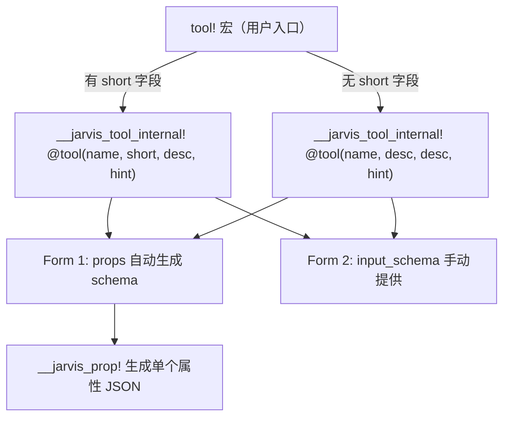

## 用户需求

使用 Rust 声明宏（declarative macro）改造 JarvisAgent 后端工具 schema 的定义方式，消除当前 `json!({...})` 手写 JSON Schema 中的冗余和重复。

## 核心问题

1. `ToolDef.name` 与 `schema.name` 重复
2. `ToolDef.description`（简短摘要）与 `schema.description`（详细描述，发给 LLM）都需手写
3. 属性定义嵌套深：`{"type": "string", "description": "..."}` 重复写几十次
4. `is_enabled` 几乎总是 `true`，无需每次手写
5. `input_schema` 的 `"type": "object"` 外壳固定重复

## 产品概述

设计一套 `tool!` 声明宏，支持两种形式：Form 1（从 props 自动生成 schema）和 Form 2（手动提供 input_schema，仍消除 name/description 重复）。将现有约 28 个工具定义全部迁移到新宏，同时保持生成的 JSON Schema 完全一致。

## 技术栈

- 语言：Rust
- 框架：Tauri 2（桌面应用）
- 核心机制：`macro_rules!` 声明宏

## 实现方案

### 宏架构设计

采用三层宏设计：



**`tool!` 宏**（用户入口，2 个分支）：

- 有 `short` 字段：`short` 用于 `ToolDef.description`，`desc` 用于 `schema.description`
- 无 `short` 字段：`desc` 同时用于两者

**`__jarvis_tool_internal!` 宏**（内部分发，2 个分支）：

- Form 1：`props: { ... }` 自动生成完整 schema
- Form 2：`input_schema: json!(...)` 手动提供 input_schema 部分，宏自动包装 `name` 和 `description`

**`__jarvis_prop!` 宏**（属性生成，7 种类型）：

- `str` → `{"type": "string", "description": ...}`
- `int` → `{"type": "integer", "description": ...}`
- `bool` → `{"type": "boolean", "description": ...}`
- `obj` → `{"type": "object", "description": ...}`
- `arr_str` → `{"type": "array", "items": {"type": "string"}, "description": ...}`
- `arr_int` → `{"type": "array", "items": {"type": "integer"}, "description": ...}`
- `arr_obj` → `{"type": "array", "items": {"type": "object"}, "description": ...}`

### 改造前后对比

**改造前**（以 read_file 为例）：

```rust
ToolDef {
    name: "read_file",
    description: "读取文件内容，支持按行号精确读取",
    search_hint: "read file content view",
    schema: json!({
        "name": "read_file",                    // 重复！
        "description": "读取文件内容。支持...",   // 重复！
        "input_schema": {
            "type": "object",                    // 固定！
            "properties": {
                "path": {"type": "string", "description": "文件路径"},    // 嵌套深！
                "start_line": {"type": "integer", "description": "起始行号"},
                "end_line": {"type": "integer", "description": "结束行号"},
            },
            "required": ["path"]
        }
    }),
    should_defer: true,
    is_read_only: true,
    is_concurrency_safe: true,
    is_enabled: true,   // 几乎总是 true！
}
```

**改造后**：

```rust
tool! {
    name: "read_file",
    desc: "读取文件内容。支持通过 start_line/end_line 精确读取。不要重复读取同一路径同一区间...",
    short: "读取文件内容，支持按行号精确读取",
    hint: "read file content view",
    props: {
        path: str "要读取的文件路径。不要把目录传给 read_file...",
        start_line: int "可选。起始行号（从 1 开始）。只有已知目标片段或文件较大时使用。",
        end_line: int "可选。结束行号（包含）。不要为了浏览整个项目而反复分段读取大量文件。",
    },
    required: [path],
    defer: true,
    ro: true,
    concurrent: true,
}
```

**行数对比**：约 20 行 → 约 12 行，且消除了 name/description 重复和 JSON 括号嵌套。

### 工具分类

**Form 1（props 自动生成）— 约 20 个工具**：

- file_tools: read_file, read_file_skeleton, write_file, edit_file, search_repo, list_directory
- system_tools: set_workspace, get_system_info
- agent_tools: load_skill, compact, dream, propose_plan, run_tasks
- tool_search: search_tools
- claude_code_tools: glob
- shell_tools: git_command, background_run, check_background
- task_tools: task_create, task_delete, task_list, task_get, task_summary

**Form 2（input_schema 手动提供）— 约 8 个工具**：

- shell_tools: run_shell（平台条件式 description）
- claude_code_tools: grep（连字符属性名 -B/-A/-C）
- agent_tools: task（运行时 enum + format! description）
- notebook_tools: notebook_edit（enum 属性）
- task_tools: todo_write（嵌套数组 items）、task_update（可能含复杂字段）

### 实现注意事项

1. `#[macro_export]` 宏会放到 crate 根，使用 `__jarvis_` 前缀避免命名冲突
2. `define_tools!` 宏无需修改，`tool! { ... }` 展开为 `ToolDef { ... }` 表达式，可直接嵌入
3. task_tools 的 `tool_def()` 函数模式也无需改动结构，内部改用 `tool!` 宏即可
4. 迁移后需 `cargo check` + `cargo test` 验证，确保生成的 JSON Schema 与原始一致
5. 注意 `required: []` 生成 `"required": []`，语义上等同于省略 required 字段

## 目录结构

```
src-tauri/src/core/tools/
├── registry.rs                          # [MODIFY] 新增 tool!、__jarvis_tool_internal!、__jarvis_prop! 三个宏
├── file_tools/
│   └── registry.rs                      # [MODIFY] 6 个 ToolDef 改为 tool! Form 1
├── shell_tools.rs                       # [MODIFY] 3 个 Form 1 + 1 个 Form 2 (run_shell)
├── agent_tools.rs                       # [MODIFY] 5 个 Form 1 + 1 个 Form 2 (task)
├── system_tools.rs                      # [MODIFY] 2 个 Form 1
├── claude_code_tools.rs                 # [MODIFY] 1 个 Form 1 (glob) + 1 个 Form 2 (grep)
├── notebook_tools.rs                    # [MODIFY] 1 个 Form 2 (notebook_edit，含 enum 属性)
├── tool_search.rs                       # [MODIFY] 1 个 Form 1
└── task_tools/
    ├── registry.rs                      # [MODIFY] 保持现有注册调用方式
    ├── todo_write.rs                    # [MODIFY] tool_def() 改用 tool! Form 2
    └── persistent/
        ├── create.rs                    # [MODIFY] tool_def() 改用 tool! Form 1
        ├── update.rs                    # [MODIFY] tool_def() 改用 tool! (需检查 schema 复杂度)
        ├── delete.rs                    # [MODIFY] tool_def() 改用 tool! Form 1
        ├── list.rs                      # [MODIFY] tool_def() 改用 tool! Form 1
        ├── get.rs                       # [MODIFY] tool_def() 改用 tool! Form 1
        └── summary.rs                   # [MODIFY] tool_def() 改用 tool! Form 1
```