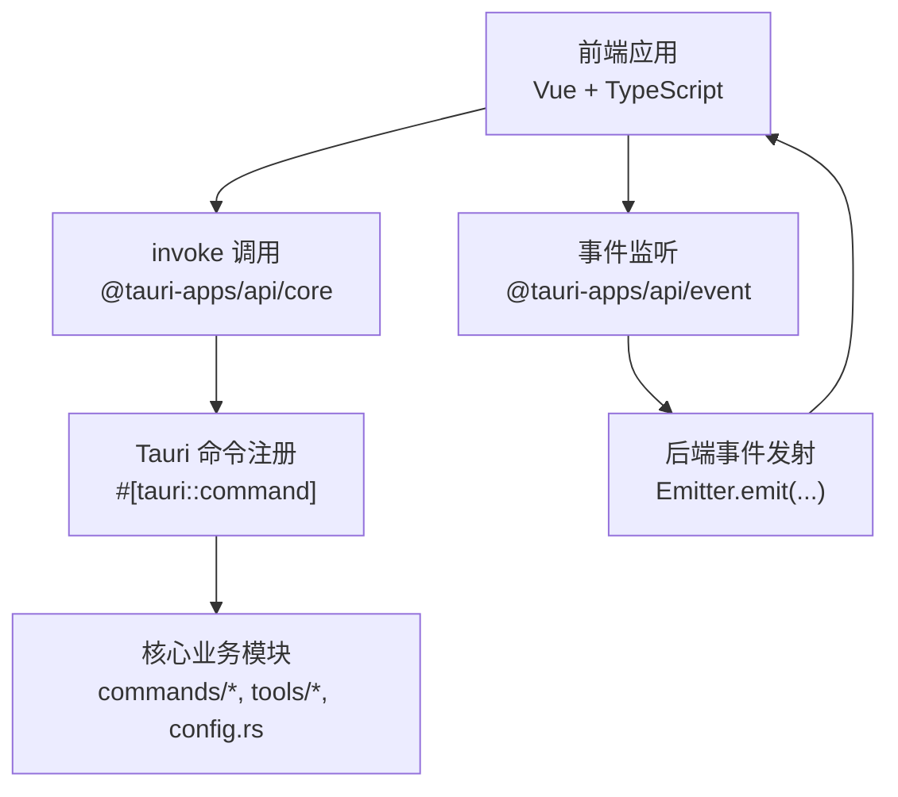
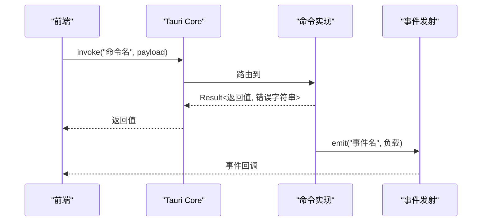
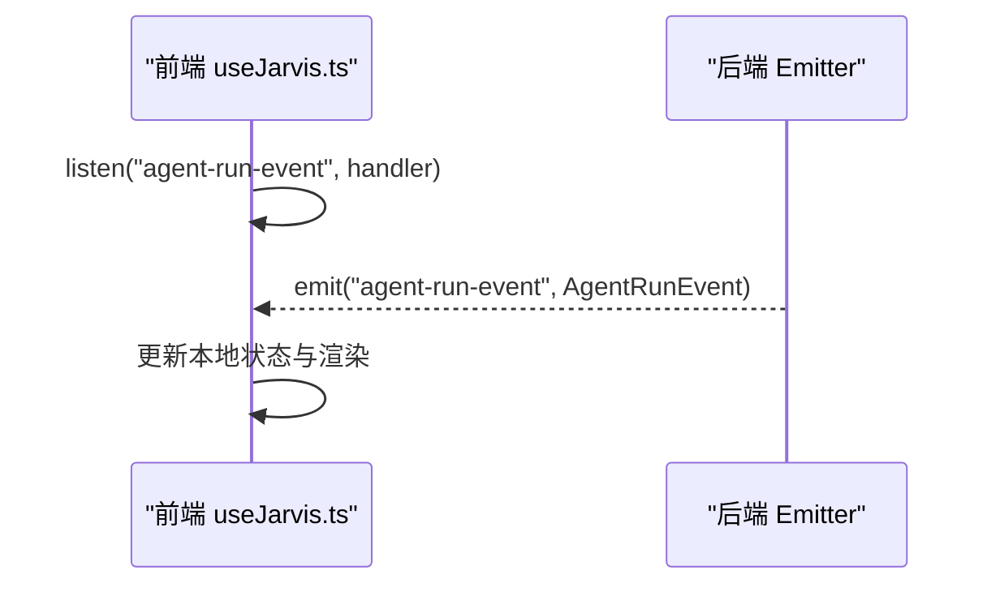
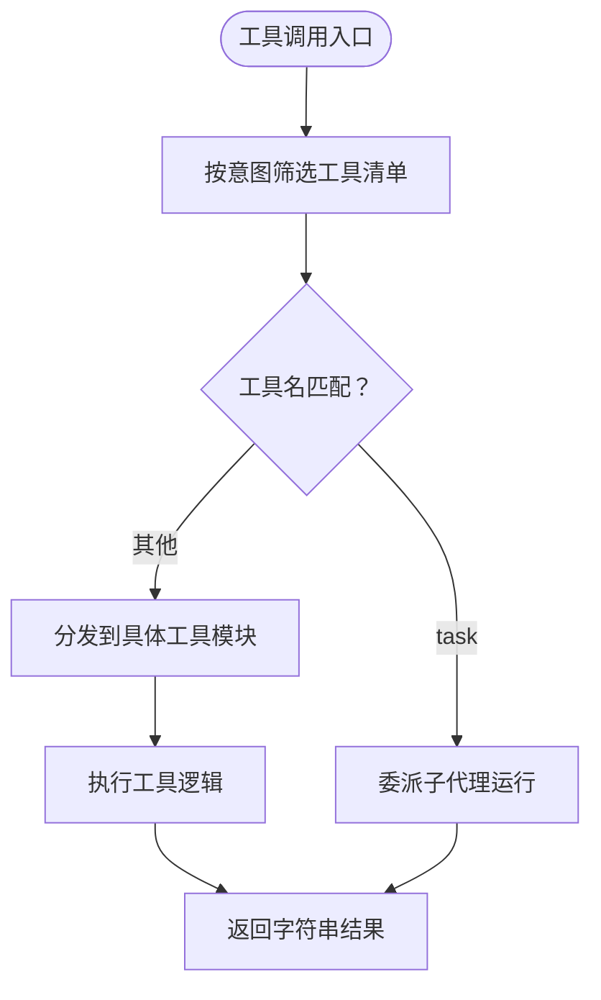
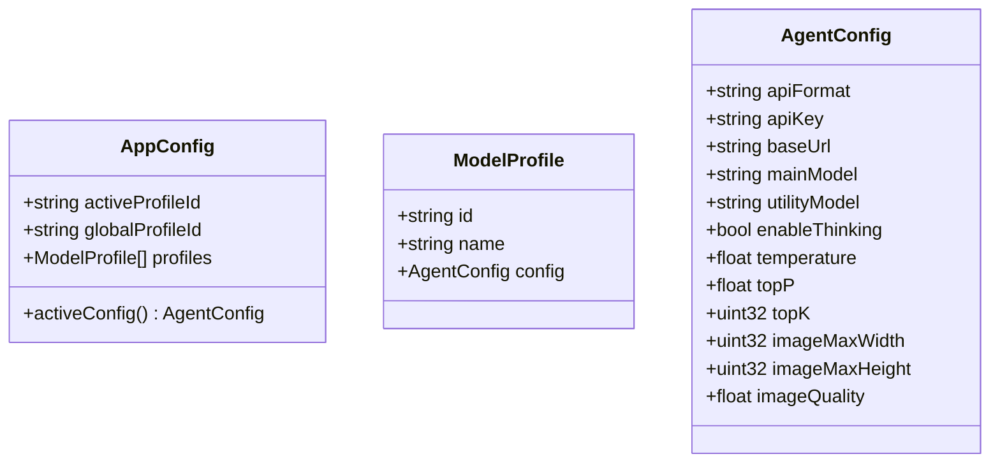
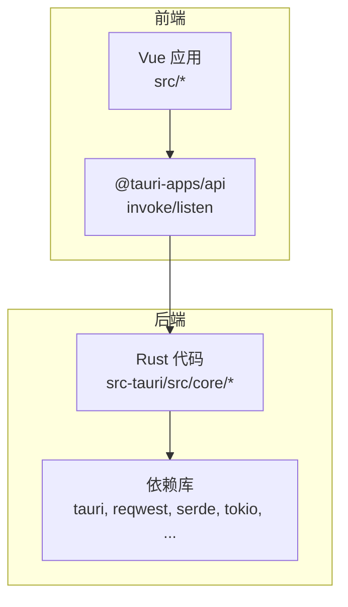

# API 参考

<cite>
**本文引用的文件**
- [main.rs](file://src-tauri/src/main.rs)
- [mod.rs](file://src-tauri/src/core/mod.rs)
- [Cargo.toml](file://src-tauri/Cargo.toml)
- [tauri.conf.json](file://src-tauri/tauri.conf.json)
- [package.json](file://package.json)
- [useJarvis.ts](file://src/composables/useJarvis.ts)
- [index.ts](file://src/types/index.ts)
- [commands_mod.rs](file://src-tauri/src/core/commands/mod.rs)
- [session.rs](file://src-tauri/src/core/commands/session.rs)
- [config.rs](file://src-tauri/src/core/commands/config.rs)
- [permission.rs](file://src-tauri/src/core/commands/permission.rs)
- [tools_mod.rs](file://src-tauri/src/core/tools/mod.rs)
- [system_tools.rs](file://src-tauri/src/core/tools/system_tools.rs)
- [file_tools.rs](file://src-tauri/src/core/tools/file_tools.rs)
- [config.rs](file://src-tauri/src/core/config.rs)
</cite>

## 目录
1. [简介](#简介)
2. [项目结构](#项目结构)
3. [核心组件](#核心组件)
4. [架构总览](#架构总览)
5. [详细组件分析](#详细组件分析)
6. [依赖分析](#依赖分析)
7. [性能考虑](#性能考虑)
8. [故障排查指南](#故障排查指南)
9. [结论](#结论)
10. [附录](#附录)

## 简介
本文件为 JarvisAgent 的完整 API 文档，覆盖 Tauri 命令接口、事件系统、工具接口规范、配置 API 以及前端集成要点。目标是帮助开发者准确地通过前端 invoke 调用后端命令、订阅后端事件、正确传递参数与接收返回值，并理解内置工具的调用方式、参数定义与错误处理策略。

## 项目结构
JarvisAgent 采用 Tauri V2 架构，前端使用 Vue 3 + TypeScript，后端使用 Rust，通过 Tauri 的命令与事件系统进行双向通信。核心后端模块位于 src-tauri/src/core 下，前端通过 @tauri-apps/api 的 invoke 与 listen 进行调用与监听。

图表来源
- [main.rs:4-6](file://src-tauri/src/main.rs#L4-L6)
- [mod.rs:31-60](file://src-tauri/src/core/mod.rs#L31-L60)
- [useJarvis.ts:2-3](file://src/composables/useJarvis.ts#L2-L3)

章节来源
- [main.rs:1-7](file://src-tauri/src/main.rs#L1-L7)
- [Cargo.toml:1-41](file://src-tauri/Cargo.toml#L1-L41)
- [tauri.conf.json:1-40](file://src-tauri/tauri.conf.json#L1-L40)
- [package.json:1-28](file://package.json#L1-L28)

## 核心组件
- 命令接口：通过 #[tauri::command] 注解暴露的后端方法，前端以 invoke 调用，返回 Result<T, String>。
- 事件系统：后端通过 Emitter 发射事件，前端通过 listen 订阅，事件负载为 JSON 结构。
- 工具系统：统一的工具定义与路由分发，按意图动态返回可用工具清单，支持子代理工具与后台任务工具。
- 配置系统：全局配置与模型配置，支持多配置文件与迁移，提供图片压缩配置查询。

章节来源
- [mod.rs:31-60](file://src-tauri/src/core/mod.rs#L31-L60)
- [useJarvis.ts:621-800](file://src/composables/useJarvis.ts#L621-L800)
- [tools_mod.rs:89-379](file://src-tauri/src/core/tools/mod.rs#L89-L379)
- [config.rs:102-135](file://src-tauri/src/core/config.rs#L102-L135)

## 架构总览
后端启动时由 main.rs 调用 jarvisagent_lib::run()，随后在 core/mod.rs 中导出命令与工具，前端通过 useJarvis.ts 统一注册事件监听与封装 invoke 调用。

图表来源
- [main.rs:4-6](file://src-tauri/src/main.rs#L4-L6)
- [mod.rs:31-60](file://src-tauri/src/core/mod.rs#L31-L60)
- [useJarvis.ts:621-800](file://src/composables/useJarvis.ts#L621-L800)

## 详细组件分析

### 命令接口总览
- 会话相关命令：获取活动会话、列出会话、创建会话、切换会话、删除会话、重命名会话、获取会话元数据、保存/读取 Agent 步骤、计划文档与 Agent 运行事件、后台任务、子代理运行与事件、工作目录、回溯最后一条用户消息等。
- 配置相关命令：获取全局配置、保存配置、获取图片压缩配置。
- 权限相关命令：解决权限请求、取消当前会话运行。
- 快照/分支/合并：快照树视图、摘要、详情、分支创建/切换/列举、回滚、当前快照、冲突检测与预览、执行合并等。
- 沙箱：创建、获取、列举、完成、废弃、发布、对比。
- 历史：获取会话历史。

章节来源
- [session.rs:7-200](file://src-tauri/src/core/commands/session.rs#L7-L200)
- [config.rs:4-41](file://src-tauri/src/core/commands/config.rs#L4-L41)
- [permission.rs:4-71](file://src-tauri/src/core/commands/permission.rs#L4-L71)
- [commands_mod.rs:1-9](file://src-tauri/src/core/commands/mod.rs#L1-L9)

### 事件系统 API
- 事件订阅：前端通过 listen 订阅后端发射的事件，事件名为字符串标识符，负载为 JSON 对象。
- 事件类型与负载：
  - todo-update：数组负载，包含待办项列表。
  - permission-request：权限请求对象，含 id、message、可选 sessionId。
  - plan-proposal：方案提案对象，含 id、title、content、可选 sessionId；同时会落地为计划文档。
  - plan-document-updated：计划文档更新事件，负载为计划文档对象。
  - agent-run-updated：Agent 运行状态更新，负载为 AgentRun。
  - agent-run-event：Agent 运行事件流，负载为 AgentRunEvent。
  - chat-turn-start/chat-content/chat-thinking/chat-tool-start/chat-tool-debug/chat-stream/chat-turn-end：聊天流事件，携带会话标识与增量内容。
  - agent-step：Agent 步骤事件，负载为 AgentStep。
  - subagent-updated：子代理运行状态更新，负载为 SubAgentRun。
  - snapshot-created：快照创建事件，负载包含 sessionId 与 snapshotId。
  - config-updated：配置更新事件。
  - active-session-changed：活动会话变更事件，负载包含 deletedSessionId 与 activeSessionId。
  - session-updated/session-renamed：会话更新/重命名事件。
- 事件负载类型定义参考 src/types/index.ts。

图表来源
- [useJarvis.ts:667-677](file://src/composables/useJarvis.ts#L667-L677)
- [index.ts:95-109](file://src/types/index.ts#L95-L109)

章节来源
- [useJarvis.ts:621-800](file://src/composables/useJarvis.ts#L621-L800)
- [index.ts:1-365](file://src/types/index.ts#L1-L365)

### 工具接口规范
- 工具定义：按意图（如 CHAT、MEMORY_QUERY、SUBAGENT、PROJECT_ACTION）返回不同的工具清单，每个工具包含名称、描述与输入 Schema。
- 工具调用路由：handle_tool_call 根据工具名分发到对应模块；特殊工具 task 会委派子代理运行。
- 内置工具类别：
  - 系统工具：get_system_info、set_workspace（受沙箱限制）。
  - 文件工具：list_directory、search_repo、read_file（支持行号范围）、read_file_skeleton、write_file、edit_file。
  - Shell 工具：git_command、run_shell、background_run（后台任务）、check_background（查询后台任务）。
  - 任务工具：task_create、task_update、task_list、task_summary、task_get、task（委派子代理）、propose_plan（方案审批）。
  - Agent 工具：load_skill、compact、dream、propose_plan。
- 参数与返回值：
  - 参数均来自 JSON 输入对象，工具内部进行字段提取与校验。
  - 返回值为字符串，表示执行结果或错误信息；部分工具返回 JSON 字符串（如图片压缩配置）。
- 错误处理：
  - 路径安全检查：确保相对路径、非法字符与沙箱限制。
  - 文件访问错误：区分“被占用/权限”与一般错误，给出明确提示。
  - 权限请求：敏感操作前弹出 permission-request 事件，等待 resolve_permission 决策。

图表来源
- [tools_mod.rs:89-379](file://src-tauri/src/core/tools/mod.rs#L89-L379)
- [system_tools.rs:45-89](file://src-tauri/src/core/tools/system_tools.rs#L45-L89)
- [file_tools.rs:43-94](file://src-tauri/src/core/tools/file_tools.rs#L43-L94)

章节来源
- [tools_mod.rs:89-379](file://src-tauri/src/core/tools/mod.rs#L89-L379)
- [system_tools.rs:1-90](file://src-tauri/src/core/tools/system_tools.rs#L1-L90)
- [file_tools.rs:1-200](file://src-tauri/src/core/tools/file_tools.rs#L1-L200)

### 配置 API
- 配置结构：
  - AppConfig：包含 active_profile_id、global_profile_id、profiles 列表。
  - ModelProfile：包含 id、name、config（AgentConfig）。
  - AgentConfig：包含 API 格式、密钥、基础 URL、主模型/工具模型、思维模式开关、温度、TopP、TopK、图片压缩宽/高/质量等。
- 默认值与规范化：
  - 默认 API 格式为 anthropic，基础 URL 规范化为对应格式结尾。
  - 图片压缩默认宽高与质量在查询时提供默认值。
- 命令：
  - get_config：返回 AppConfig。
  - save_config_cmd：保存配置并发射 config-updated 事件。
  - get_image_compress_config：返回 { maxWidth, maxHeight, quality }。
- 迁移：
  - 若检测到旧版 AgentConfig，自动迁移到 AppConfig。

图表来源
- [config.rs:11-135](file://src-tauri/src/core/config.rs#L11-L135)

章节来源
- [config.rs:1-191](file://src-tauri/src/core/config.rs#L1-L191)
- [config.rs:4-41](file://src-tauri/src/core/commands/config.rs#L4-L41)

### 前端集成与调用示例
- 命令调用：前端通过 invoke("命令名", payload) 调用，payload 为 JSON 对象；返回 Promise<Result>，其中成功为后端返回值，失败为错误字符串。
- 事件监听：通过 listen("事件名", handler) 订阅，handler 接收事件负载对象。
- 示例（以路径代替具体代码）：
  - 创建会话：invoke("create_session", { working_directory: "/absolute/path" })
  - 获取配置：invoke("get_config")
  - 保存配置：invoke("save_config_cmd", { active_profile_id: "default", profiles: [...] })
  - 获取图片压缩配置：invoke("get_image_compress_config")
  - 解决权限请求：invoke("resolve_permission", { id, session_id, decision, content })
  - 取消运行：invoke("cancel_jarvis", { session_id })
  - 工具调用：invoke("handle_tool_call", { name: "task", input: { prompt, read_only }, session_id })

章节来源
- [useJarvis.ts:621-800](file://src/composables/useJarvis.ts#L621-L800)
- [session.rs:19-43](file://src-tauri/src/core/commands/session.rs#L19-L43)
- [config.rs:4-41](file://src-tauri/src/core/commands/config.rs#L4-L41)
- [permission.rs:4-71](file://src-tauri/src/core/commands/permission.rs#L4-L71)
- [tools_mod.rs:381-408](file://src-tauri/src/core/tools/mod.rs#L381-L408)

## 依赖分析
- 后端依赖：Tauri V2、reqwest、tokio、serde、uuid、futures-util、eventsource-stream、tokio-util、regex、thiserror 等。
- 前端依赖：@tauri-apps/api、@tauri-apps/plugins、vue、marked 等。
- 配置与打包：tauri.conf.json 定义窗口、安全策略与打包图标；Cargo.toml 定义库与二进制产物类型。

图表来源
- [Cargo.toml:20-39](file://src-tauri/Cargo.toml#L20-L39)
- [package.json:12-26](file://package.json#L12-L26)
- [tauri.conf.json:1-40](file://src-tauri/tauri.conf.json#L1-L40)

章节来源
- [Cargo.toml:1-41](file://src-tauri/Cargo.toml#L1-L41)
- [package.json:1-28](file://package.json#L1-L28)
- [tauri.conf.json:1-40](file://src-tauri/tauri.conf.json#L1-L40)

## 性能考虑
- 后台任务：长耗时操作应使用 background_run 并通过 check_background 查询状态，避免前端轮询导致阻塞。
- 上下文压缩：在对话过长时使用 compact 工具进行摘要，减少 Token 消耗。
- 文件读取：read_file 支持行号范围，避免一次性读取大文件；read_file_skeleton 快速定位结构。
- 事件渲染节流：前端对聊天流采用 requestAnimationFrame 节流渲染，提升交互流畅度。
- 图片压缩：通过 get_image_compress_config 获取默认压缩参数，避免超大图片传输。

## 故障排查指南
- 权限问题：
  - 现象：set_workspace 返回“路径不安全/权限拒绝/必须使用绝对路径/目录不存在”。
  - 处理：确认路径为绝对路径且在沙箱允许范围内；必要时通过 permission-request 事件申请权限。
- 文件访问冲突：
  - 现象：read_file 报错“文件被占用/被其他程序使用”。
  - 处理：关闭占用程序或稍后重试。
- 后台任务卡住：
  - 现象：check_background 无进展。
  - 处理：避免在思考循环中轮询，仅在用户主动询问时调用；确认工作目录为绝对路径。
- 配置异常：
  - 现象：保存配置后未生效。
  - 处理：确认 active_profile_id 正确；检查 config-updated 事件是否触发；必要时重新加载配置。

章节来源
- [system_tools.rs:45-89](file://src-tauri/src/core/tools/system_tools.rs#L45-L89)
- [file_tools.rs:85-93](file://src-tauri/src/core/tools/file_tools.rs#L85-L93)
- [tools_mod.rs:317-337](file://src-tauri/src/core/tools/mod.rs#L317-L337)
- [config.rs:146-178](file://src-tauri/src/core/config.rs#L146-L178)

## 结论
本 API 文档系统性梳理了 JarvisAgent 的命令接口、事件系统、工具规范与配置 API。建议在生产环境中：
- 严格遵循参数 Schema 与错误返回约定；
- 使用权限请求与沙箱限制保障安全；
- 采用后台任务与上下文压缩优化性能；
- 通过事件驱动实现前后端解耦与实时交互。

## 附录
- 常用命令清单（示例）
  - 会话：create_session、switch_session、recall_last_message、list_sessions、delete_session、rename_session
  - 配置：get_config、save_config_cmd、get_image_compress_config
  - 权限：resolve_permission、cancel_jarvis
  - 工具：task、read_file、write_file、list_directory、git_command、background_run、check_background、propose_plan
- 常用事件清单（示例）
  - agent-run-event、agent-run-updated、chat-content、chat-thinking、chat-tool-debug、snapshot-created、config-updated、permission-request、plan-proposal、plan-document-updated、subagent-updated