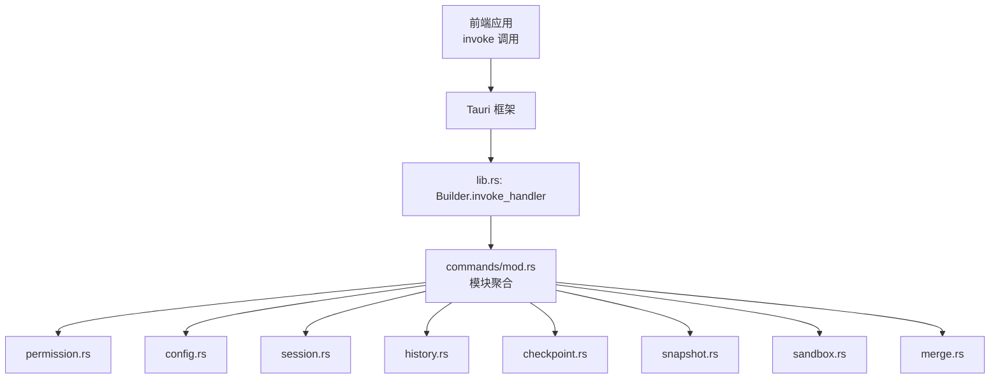
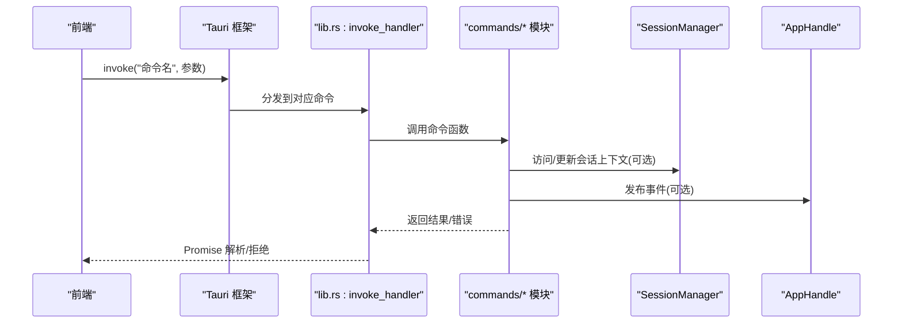
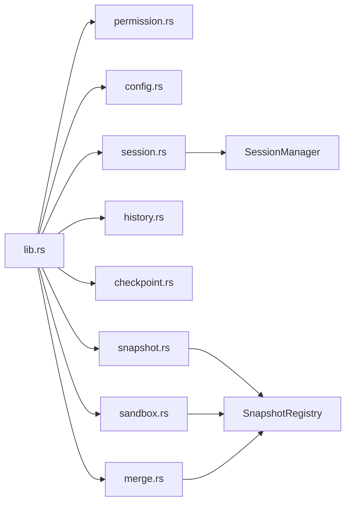
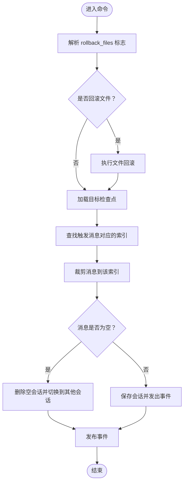

# Tauri 命令接口

<cite>
**本文引用的文件**
- [src-tauri/src/lib.rs](file://src-tauri/src/lib.rs)
- [src-tauri/src/main.rs](file://src-tauri/src/main.rs)
- [src-tauri/tauri.conf.json](file://src-tauri/tauri.conf.json)
- [src-tauri/src/core/commands/mod.rs](file://src-tauri/src/core/commands/mod.rs)
- [src-tauri/src/core/commands/permission.rs](file://src-tauri/src/core/commands/permission.rs)
- [src-tauri/src/core/commands/config.rs](file://src-tauri/src/core/commands/config.rs)
- [src-tauri/src/core/commands/session.rs](file://src-tauri/src/core/commands/session.rs)
- [src-tauri/src/core/commands/history.rs](file://src-tauri/src/core/commands/history.rs)
- [src-tauri/src/core/commands/checkpoint.rs](file://src-tauri/src/core/commands/checkpoint.rs)
- [src-tauri/src/core/commands/snapshot.rs](file://src-tauri/src/core/commands/snapshot.rs)
- [src-tauri/src/core/commands/sandbox.rs](file://src-tauri/src/core/commands/sandbox.rs)
- [src-tauri/src/core/commands/merge.rs](file://src-tauri/src/core/commands/merge.rs)
</cite>

## 目录
1. [简介](#简介)
2. [项目结构](#项目结构)
3. [核心组件](#核心组件)
4. [架构总览](#架构总览)
5. [详细组件分析](#详细组件分析)
6. [依赖关系分析](#依赖关系分析)
7. [性能考虑](#性能考虑)
8. [故障排查指南](#故障排查指南)
9. [结论](#结论)
10. [附录](#附录)

## 简介
本文件为 JarvisAgent 桌面应用的 Tauri 命令接口 API 文档，面向前端开发者与集成人员，系统性梳理后端通过 Tauri invoke 暴露的所有命令，覆盖命令分类、参数规范、返回值格式、错误处理、调用示例、并发控制与性能优化建议。文档中的命令均来自后端源码，确保与实际实现一致。

## 项目结构
后端以 Tauri 为主入口，通过 lib.rs 中的 Builder 注册状态与命令，前端通过 invoke 调用对应命令。命令按功能分组位于 core/commands 下的独立模块，统一由 lib.rs 的 generate_handler 进行集中注册。

**图表来源**
- [src-tauri/src/lib.rs:102-182](file://src-tauri/src/lib.rs#L102-L182)
- [src-tauri/src/core/commands/mod.rs:1-9](file://src-tauri/src/core/commands/mod.rs#L1-L9)

**章节来源**
- [src-tauri/src/lib.rs:57-185](file://src-tauri/src/lib.rs#L57-L185)
- [src-tauri/src/core/commands/mod.rs:1-9](file://src-tauri/src/core/commands/mod.rs#L1-L9)

## 核心组件
- Tauri 应用入口与状态管理
  - 入口函数负责加载环境变量、锁定主目录、恢复工作目录与会话，并注册状态管理器与命令。
  - 状态包括会话管理器、后台任务、子代理监控、配置、工作空间、快照注册表等。
- 命令注册
  - 通过 generate_handler 统一注册所有命令，前端以命令名进行 invoke 调用。

**章节来源**
- [src-tauri/src/lib.rs:57-185](file://src-tauri/src/lib.rs#L57-L185)

## 架构总览
下图展示前端 invoke 到后端命令处理的整体流程，以及与状态管理器的交互。

**图表来源**
- [src-tauri/src/lib.rs:102-182](file://src-tauri/src/lib.rs#L102-L182)
- [src-tauri/src/core/commands/session.rs:19-43](file://src-tauri/src/core/commands/session.rs#L19-L43)

## 详细组件分析

### 核心对话命令：ask_jarvis
- 命令用途
  - 前端通过 invoke 调用后端核心对话能力，发起一次 AI 对话请求。
- 参数与返回
  - 参数：由前端传入对话输入、会话标识等（具体字段由前端定义，后端仅暴露命令入口）。
  - 返回：对话响应内容（文本/流式片段，由前端消费）。
- 并发与异步
  - 使用异步命令处理，内部通过会话管理器与上下文协作。
- 错误处理
  - 由后端统一返回字符串错误信息；前端需捕获并提示。
- 调用示例
  - 前端：invoke("ask_jarvis", { ... })，等待 Promise 解析。
- 性能建议
  - 控制单次请求大小，避免超长上下文导致延迟；必要时启用流式输出。

**章节来源**
- [src-tauri/src/lib.rs:104](file://src-tauri/src/lib.rs#L104)

### 权限控制命令
- resolve_permission
  - 功能：处理权限决策（允许/拒绝），支持可选修改后的文本内容。
  - 参数
    - id: 权限请求唯一标识
    - session_id: 会话标识
    - decision: 决策字符串（如 "allow"/"reject"）
    - content: 可选修改后的内容
  - 返回：无返回值（成功/失败以 Result 表示）
  - 并发：通过 pending_permissions 映射与发送通道协调。
  - 错误：当找不到对应请求时，返回错误字符串。
  - 事件：若为计划文档，发布 "plan-document-updated" 事件。
- cancel_jarvis
  - 功能：取消当前会话的执行，清理未决权限，取消子代理任务。
  - 参数：session_id
  - 返回：无
  - 并发：使用取消令牌与并发映射清理。
  - 事件：取消子代理运行并打印日志。

**章节来源**
- [src-tauri/src/core/commands/permission.rs:4-43](file://src-tauri/src/core/commands/permission.rs#L4-L43)
- [src-tauri/src/core/commands/permission.rs:45-70](file://src-tauri/src/core/commands/permission.rs#L45-L70)

### 会话管理命令
- get_active_session_id
  - 返回：当前活跃会话 ID（可选）。
- list_sessions
  - 返回：会话元数据列表。
- create_session
  - 参数：working_directory（可选）
  - 返回：新创建会话的元数据
  - 校验：若提供目录，需存在且为目录。
- switch_session
  - 参数：id
  - 返回：目标会话元数据
- delete_session
  - 参数：id
- rename_session
  - 参数：id, title
- update_session_profile
  - 参数：id, profile_id
- get_session_meta
  - 参数：id
- get_workspace_dir
  - 参数：session_id
  - 返回：工作目录（非沙箱会话返回 None）
- recall_last_message
  - 功能：撤回最后一条用户消息，必要时删除空会话并发出事件。
  - 返回：被撤回的消息文本
- save_agent_steps / get_agent_steps
  - 功能：保存/读取代理步骤（AgentStep 列表）
- list_plan_documents
  - 返回：计划文档列表
- list_agent_runs / list_agent_run_events
  - 返回：运行与事件列表
- prepare_resume_agent_run
  - 功能：准备恢复某次运行，返回恢复计划
  - 返回：ResumeAgentRunPlan
- get_background_tasks
  - 返回：后台任务列表
- get_subagent_runs / list_subagents / list_subagent_events
  - 返回：子代理运行/事件列表
- cancel_subagent_run
  - 参数：run_id
  - 返回：被取消的子代理运行

**章节来源**
- [src-tauri/src/core/commands/session.rs:7-13](file://src-tauri/src/core/commands/session.rs#L7-L13)
- [src-tauri/src/core/commands/session.rs:14-17](file://src-tauri/src/core/commands/session.rs#L14-L17)
- [src-tauri/src/core/commands/session.rs:19-43](file://src-tauri/src/core/commands/session.rs#L19-L43)
- [src-tauri/src/core/commands/session.rs:46-55](file://src-tauri/src/core/commands/session.rs#L46-L55)
- [src-tauri/src/core/commands/session.rs:139-186](file://src-tauri/src/core/commands/session.rs#L139-L186)
- [src-tauri/src/core/commands/session.rs:188-200](file://src-tauri/src/core/commands/session.rs#L188-L200)
- [src-tauri/src/core/commands/session.rs:202-210](file://src-tauri/src/core/commands/session.rs#L202-L210)
- [src-tauri/src/core/commands/session.rs:212-225](file://src-tauri/src/core/commands/session.rs#L212-L225)
- [src-tauri/src/core/commands/session.rs:227-253](file://src-tauri/src/core/commands/session.rs#L227-L253)
- [src-tauri/src/core/commands/session.rs:255-260](file://src-tauri/src/core/commands/session.rs#L255-L260)
- [src-tauri/src/core/commands/session.rs:262-275](file://src-tauri/src/core/commands/session.rs#L262-L275)
- [src-tauri/src/core/commands/session.rs:277-289](file://src-tauri/src/core/commands/session.rs#L277-L289)
- [src-tauri/src/core/commands/session.rs:291-297](file://src-tauri/src/core/commands/session.rs#L291-L297)
- [src-tauri/src/core/commands/session.rs:299-306](file://src-tauri/src/core/commands/session.rs#L299-L306)
- [src-tauri/src/core/commands/session.rs:308-315](file://src-tauri/src/core/commands/session.rs#L308-L315)
- [src-tauri/src/core/commands/session.rs:317-325](file://src-tauri/src/core/commands/session.rs#L317-L325)
- [src-tauri/src/core/commands/session.rs:327-333](file://src-tauri/src/core/commands/session.rs#L327-L333)

### 配置管理命令
- get_config
  - 返回：当前 AppConfig 的深拷贝
- save_config_cmd
  - 参数：new_config
  - 行为：替换当前配置、持久化、发布 "config-updated" 事件
- get_image_compress_config
  - 返回：图像压缩配置对象（最大宽、高、质量）

**章节来源**
- [src-tauri/src/core/commands/config.rs:4-9](file://src-tauri/src/core/commands/config.rs#L4-L9)
- [src-tauri/src/core/commands/config.rs:11-27](file://src-tauri/src/core/commands/config.rs#L11-L27)
- [src-tauri/src/core/commands/config.rs:29-40](file://src-tauri/src/core/commands/config.rs#L29-L40)

### 历史记录命令
- get_session_history
  - 功能：生成会话历史 HTML 片段，包含用户消息与助手回复，标注检查点按钮与思考内容。
  - 参数：session_id
  - 返回：HTML 字符串
  - 复杂度：遍历消息与检查点映射，时间复杂度 O(N+M)，N 为消息数，M 为检查点数。

**章节来源**
- [src-tauri/src/core/commands/history.rs:6-150](file://src-tauri/src/core/commands/history.rs#L6-L150)

### 检查点与分支命令
- list_checkpoints
  - 参数：session_id, branch_name(可选)
  - 返回：检查点列表
- get_checkpoint_tree
  - 返回：检查点树结构
- rollback_to_checkpoint
  - 参数：session_id, checkpoint_id, rollback_files(可选)
  - 行为：可选回滚文件，裁剪消息，必要时删除空会话并发出事件
  - 返回：恢复的文件路径列表
- create_branch / switch_branch / list_branches / delete_branch / get_active_branch
  - 行为：分支的创建、切换、枚举、删除、查询
- commit_checkpoint
  - 功能：从会话上下文收集待提交操作，创建检查点
  - 返回：新检查点
- clear_pending_operations
  - 清理待提交操作队列

**章节来源**
- [src-tauri/src/core/commands/checkpoint.rs:4-10](file://src-tauri/src/core/commands/checkpoint.rs#L4-L10)
- [src-tauri/src/core/commands/checkpoint.rs:12-17](file://src-tauri/src/core/commands/checkpoint.rs#L12-L17)
- [src-tauri/src/core/commands/checkpoint.rs:19-88](file://src-tauri/src/core/commands/checkpoint.rs#L19-L88)
- [src-tauri/src/core/commands/checkpoint.rs:90-105](file://src-tauri/src/core/commands/checkpoint.rs#L90-L105)
- [src-tauri/src/core/commands/checkpoint.rs:107-113](file://src-tauri/src/core/commands/checkpoint.rs#L107-L113)
- [src-tauri/src/core/commands/checkpoint.rs:115-120](file://src-tauri/src/core/commands/checkpoint.rs#L115-L120)
- [src-tauri/src/core/commands/checkpoint.rs:122-128](file://src-tauri/src/core/commands/checkpoint.rs#L122-L128)
- [src-tauri/src/core/commands/checkpoint.rs:130-135](file://src-tauri/src/core/commands/checkpoint.rs#L130-L135)
- [src-tauri/src/core/commands/checkpoint.rs:137-157](file://src-tauri/src/core/commands/checkpoint.rs#L137-L157)
- [src-tauri/src/core/commands/checkpoint.rs:159-167](file://src-tauri/src/core/commands/checkpoint.rs#L159-L167)

### 快照管理命令
- snapshot_create
  - 参数：patches, message(可选), agent_id(可选), workspace_id(可选)
  - 返回：新快照
- snapshot_get_tree_view
  - 返回：树视图
- snapshot_get_summaries / snapshot_get_detail
  - 返回：摘要/详情
- snapshot_create_branch / snapshot_switch_branch
  - 返回：无
- snapshot_rollback
  - 参数：snapshot_id, target_dir
  - 返回：工作区
- snapshot_list / snapshot_list_branches
  - 返回：快照/分支列表
- snapshot_get_current
  - 返回：当前分支与快照 ID

**章节来源**
- [src-tauri/src/core/commands/snapshot.rs:4-15](file://src-tauri/src/core/commands/snapshot.rs#L4-L15)
- [src-tauri/src/core/commands/snapshot.rs:17-24](file://src-tauri/src/core/commands/snapshot.rs#L17-L24)
- [src-tauri/src/core/commands/snapshot.rs:26-34](file://src-tauri/src/core/commands/snapshot.rs#L26-L34)
- [src-tauri/src/core/commands/snapshot.rs:36-44](file://src-tauri/src/core/commands/snapshot.rs#L36-L44)
- [src-tauri/src/core/commands/snapshot.rs:46-57](file://src-tauri/src/core/commands/snapshot.rs#L46-L57)
- [src-tauri/src/core/commands/snapshot.rs:59-67](file://src-tauri/src/core/commands/snapshot.rs#L59-L67)
- [src-tauri/src/core/commands/snapshot.rs:69-79](file://src-tauri/src/core/commands/snapshot.rs#L69-L79)
- [src-tauri/src/core/commands/snapshot.rs:81-89](file://src-tauri/src/core/commands/snapshot.rs#L81-L89)
- [src-tauri/src/core/commands/snapshot.rs:91-98](file://src-tauri/src/core/commands/snapshot.rs#L91-L98)
- [src-tauri/src/core/commands/snapshot.rs:100-107](file://src-tauri/src/core/commands/snapshot.rs#L100-L107)

### 沙盒会话命令
- sandbox_create
  - 参数：agent_id, base_snapshot_id, description(可选)
  - 返回：沙盒
- sandbox_get / sandbox_list
  - 返回：沙盒/列表
- sandbox_complete / sandbox_abandon
  - 返回：无
- sandbox_publish
  - 返回：发布标识
- sandbox_compare
  - 返回：比较结果列表

**章节来源**
- [src-tauri/src/core/commands/sandbox.rs:4-14](file://src-tauri/src/core/commands/sandbox.rs#L4-L14)
- [src-tauri/src/core/commands/sandbox.rs:16-24](file://src-tauri/src/core/commands/sandbox.rs#L16-L24)
- [src-tauri/src/core/commands/sandbox.rs:26-33](file://src-tauri/src/core/commands/sandbox.rs#L26-L33)
- [src-tauri/src/core/commands/sandbox.rs:35-43](file://src-tauri/src/core/commands/sandbox.rs#L35-L43)
- [src-tauri/src/core/commands/sandbox.rs:45-53](file://src-tauri/src/core/commands/sandbox.rs#L45-L53)
- [src-tauri/src/core/commands/sandbox.rs:55-63](file://src-tauri/src/core/commands/sandbox.rs#L55-L63)
- [src-tauri/src/core/commands/sandbox.rs:65-72](file://src-tauri/src/core/commands/sandbox.rs#L65-L72)

### 合并冲突命令
- merge_preview
  - 返回：合并预览结果
- merge_execute
  - 参数：resolutions(冲突解决映射), message(可选)
  - 返回：新快照
- merge_get_conflicts
  - 返回：冲突列表

**章节来源**
- [src-tauri/src/core/commands/merge.rs:5-14](file://src-tauri/src/core/commands/merge.rs#L5-L14)
- [src-tauri/src/core/commands/merge.rs:16-27](file://src-tauri/src/core/commands/merge.rs#L16-L27)
- [src-tauri/src/core/commands/merge.rs:29-38](file://src-tauri/src/core/commands/merge.rs#L29-L38)

### 模型注册表命令
- get_model_capabilities
  - 返回：模型能力描述
- list_model_registry
  - 返回：模型注册表条目列表

**章节来源**
- [src-tauri/src/lib.rs:179-182](file://src-tauri/src/lib.rs#L179-L182)

## 依赖关系分析
- 命令注册集中于 lib.rs，命令模块之间低耦合，通过状态管理器与 AppHandle 协同。
- 会话相关命令依赖 SessionManager 与 sessions 模块；快照/沙盒/合并命令依赖 SnapshotRegistry 与 snapshot_engine。
- 权限与取消命令依赖会话上下文中的 pending_permissions 与取消令牌。

**图表来源**
- [src-tauri/src/lib.rs:102-182](file://src-tauri/src/lib.rs#L102-L182)
- [src-tauri/src/core/commands/session.rs:19-43](file://src-tauri/src/core/commands/session.rs#L19-L43)
- [src-tauri/src/core/commands/snapshot.rs:11-15](file://src-tauri/src/core/commands/snapshot.rs#L11-L15)
- [src-tauri/src/core/commands/sandbox.rs:10-14](file://src-tauri/src/core/commands/sandbox.rs#L10-L14)
- [src-tauri/src/core/commands/merge.rs:10-14](file://src-tauri/src/core/commands/merge.rs#L10-L14)

**章节来源**
- [src-tauri/src/lib.rs:102-182](file://src-tauri/src/lib.rs#L102-L182)

## 性能考虑
- 异步与并发
  - 所有命令均为异步实现，使用 tokio::sync 锁保护共享状态，避免阻塞主线程。
  - 会话上下文使用 Mutex/RwLock，注意避免长时间持锁。
- I/O 与网络
  - 配置保存与历史生成涉及磁盘与网络请求，建议批量/节流处理。
- 事件发布
  - 频繁事件可能影响前端渲染，建议合并或去抖。
- 图像处理
  - 图像压缩配置可减少传输体积，降低带宽与渲染压力。

[本节为通用建议，无需特定文件来源]

## 故障排查指南
- 常见错误类型
  - 参数校验失败：如目录不存在、会话不存在、检查点不存在等，返回字符串错误。
  - 权限未找到：resolve_permission 无法匹配 pending_permissions 映射。
  - 取消无效：cancel_jarvis 在无取消令牌时不会产生效果。
- 排查步骤
  - 检查命令参数是否符合预期（如 session_id、checkpoint_id、branch_name）。
  - 查看后端日志（println 输出）定位执行位置。
  - 确认会话上下文是否存在，必要时先调用 create_session 或 switch_session。
  - 若涉及文件回滚，确认目标路径与权限。
- 建议
  - 前端对 invoke 结果进行统一错误处理与用户提示。
  - 对高频命令增加前端缓存与去重逻辑。

**章节来源**
- [src-tauri/src/core/commands/session.rs:26-34](file://src-tauri/src/core/commands/session.rs#L26-L34)
- [src-tauri/src/core/commands/checkpoint.rs:36-40](file://src-tauri/src/core/commands/checkpoint.rs#L36-L40)
- [src-tauri/src/core/commands/permission.rs:34-42](file://src-tauri/src/core/commands/permission.rs#L34-L42)

## 结论
本文档系统梳理了 JarvisAgent 的 Tauri 命令接口，覆盖权限、会话、配置、历史、检查点、快照、沙盒、合并与模型注册表等全部命令类别。建议前端在调用时严格遵循参数规范与错误处理流程，并结合并发控制与性能优化策略提升用户体验。

[本节为总结，无需特定文件来源]

## 附录

### 命令分类与清单
- 核心对话：ask_jarvis
- 权限控制：resolve_permission, cancel_jarvis
- 会话管理：get_active_session_id, list_sessions, create_session, switch_session, delete_session, rename_session, update_session_profile, get_session_meta, get_workspace_dir, recall_last_message, save_agent_steps, get_agent_steps, list_plan_documents, list_agent_runs, list_agent_run_events, prepare_resume_agent_run, get_background_tasks, get_subagent_runs, list_subagents, list_subagent_events, cancel_subagent_run
- 配置管理：get_config, save_config_cmd, get_image_compress_config
- 历史记录：get_session_history
- 检查点与分支：list_checkpoints, get_checkpoint_tree, rollback_to_checkpoint, create_branch, switch_branch, list_branches, delete_branch, get_active_branch, commit_checkpoint, clear_pending_operations
- 快照管理：snapshot_create, snapshot_get_tree_view, snapshot_get_summaries, snapshot_get_detail, snapshot_create_branch, snapshot_switch_branch, snapshot_rollback, snapshot_list, snapshot_list_branches, snapshot_get_current
- 沙盒会话：sandbox_create, sandbox_get, sandbox_list, sandbox_complete, sandbox_abandon, sandbox_publish, sandbox_compare
- 合并冲突：merge_preview, merge_execute, merge_get_conflicts
- 模型注册表：get_model_capabilities, list_model_registry

**章节来源**
- [src-tauri/src/lib.rs:102-182](file://src-tauri/src/lib.rs#L102-L182)

### 调用示例（路径指引）
- 核心对话
  - 调用：invoke("ask_jarvis", { ... })
  - 参考：[src-tauri/src/lib.rs:104](file://src-tauri/src/lib.rs#L104)
- 权限控制
  - 调用：invoke("resolve_permission", { id, session_id, decision, content })
  - 参考：[src-tauri/src/core/commands/permission.rs:4-43](file://src-tauri/src/core/commands/permission.rs#L4-L43)
- 会话管理
  - 调用：invoke("create_session", { working_directory })
  - 参考：[src-tauri/src/core/commands/session.rs:19-43](file://src-tauri/src/core/commands/session.rs#L19-L43)
- 配置管理
  - 调用：invoke("save_config_cmd", { new_config })
  - 参考：[src-tauri/src/core/commands/config.rs:11-27](file://src-tauri/src/core/commands/config.rs#L11-L27)
- 历史记录
  - 调用：invoke("get_session_history", { session_id })
  - 参考：[src-tauri/src/core/commands/history.rs:6-150](file://src-tauri/src/core/commands/history.rs#L6-L150)
- 检查点与分支
  - 调用：invoke("commit_checkpoint", { session_id, trigger_message })
  - 参考：[src-tauri/src/core/commands/checkpoint.rs:137-157](file://src-tauri/src/core/commands/checkpoint.rs#L137-L157)
- 快照管理
  - 调用：invoke("snapshot_create", { session_id, patches, message })
  - 参考：[src-tauri/src/core/commands/snapshot.rs:4-15](file://src-tauri/src/core/commands/snapshot.rs#L4-L15)
- 沙盒会话
  - 调用：invoke("sandbox_create", { session_id, agent_id, base_snapshot_id })
  - 参考：[src-tauri/src/core/commands/sandbox.rs:4-14](file://src-tauri/src/core/commands/sandbox.rs#L4-L14)
- 合并冲突
  - 调用：invoke("merge_execute", { session_id, source_branch, target_branch, resolutions, message })
  - 参考：[src-tauri/src/core/commands/merge.rs:16-27](file://src-tauri/src/core/commands/merge.rs#L16-L27)
- 模型注册表
  - 调用：invoke("list_model_registry", {})
  - 参考：[src-tauri/src/lib.rs:179-182](file://src-tauri/src/lib.rs#L179-L182)

### 错误码对照（示例）
- 会话相关
  - 目录不存在或不是文件夹：create_session 参数校验失败
  - 没有可撤回的用户消息：recall_last_message 返回错误
- 检查点相关
  - 检查点不存在：rollback_to_checkpoint 返回错误
- 权限相关
  - 未找到对应权限请求：resolve_permission 返回错误
- 快照/沙盒/合并
  - 未找到指定实体或分支：对应命令返回错误

**章节来源**
- [src-tauri/src/core/commands/session.rs:26-34](file://src-tauri/src/core/commands/session.rs#L26-L34)
- [src-tauri/src/core/commands/session.rs:171-173](file://src-tauri/src/core/commands/session.rs#L171-L173)
- [src-tauri/src/core/commands/checkpoint.rs:38-40](file://src-tauri/src/core/commands/checkpoint.rs#L38-L40)
- [src-tauri/src/core/commands/permission.rs:34-42](file://src-tauri/src/core/commands/permission.rs#L34-L42)

### 并发控制策略
- 使用 tokio::sync Mutex/RwLock 保护共享状态（会话内存、快照注册表等）。
- 权限决策通过 pending_permissions 映射与发送通道保证并发安全。
- 取消操作通过取消令牌与并发映射统一清理。

**章节来源**
- [src-tauri/src/core/commands/permission.rs:34-42](file://src-tauri/src/core/commands/permission.rs#L34-L42)
- [src-tauri/src/core/commands/session.rs:139-186](file://src-tauri/src/core/commands/session.rs#L139-L186)

### 执行流程图（示例：rollback_to_checkpoint）

**图表来源**
- [src-tauri/src/core/commands/checkpoint.rs:19-88](file://src-tauri/src/core/commands/checkpoint.rs#L19-L88)