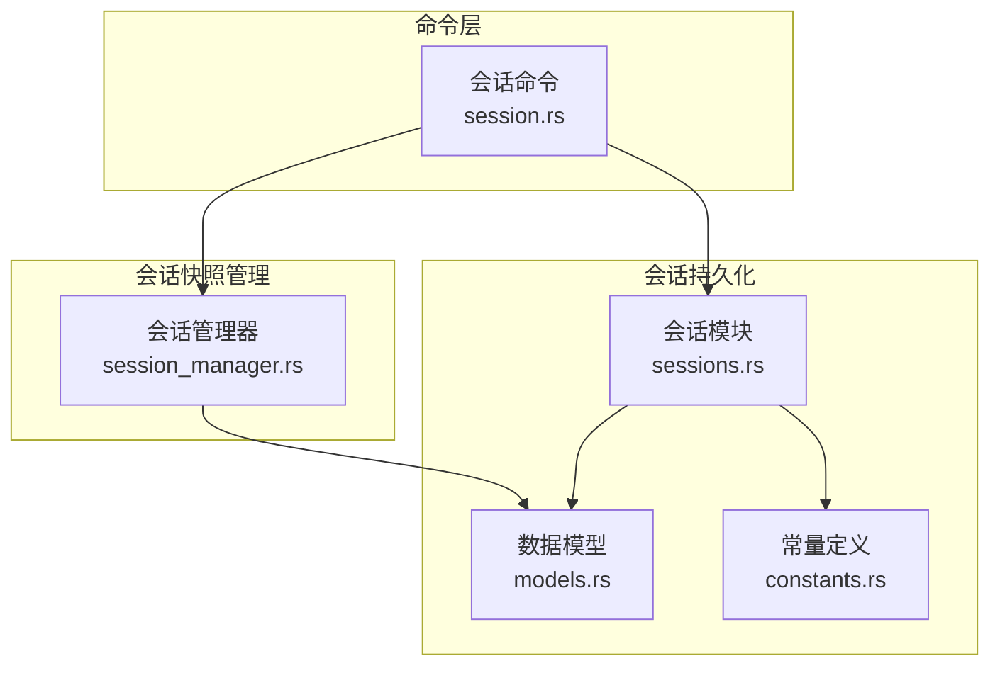
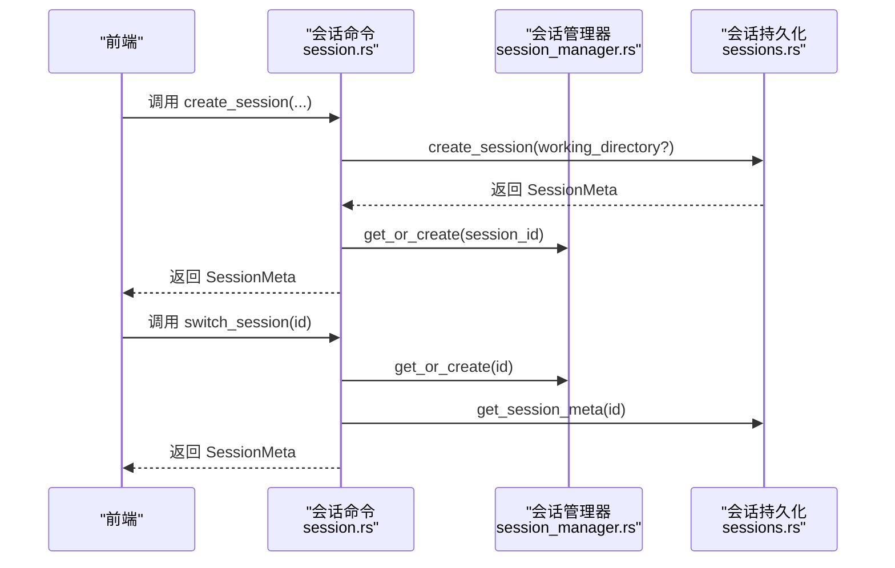
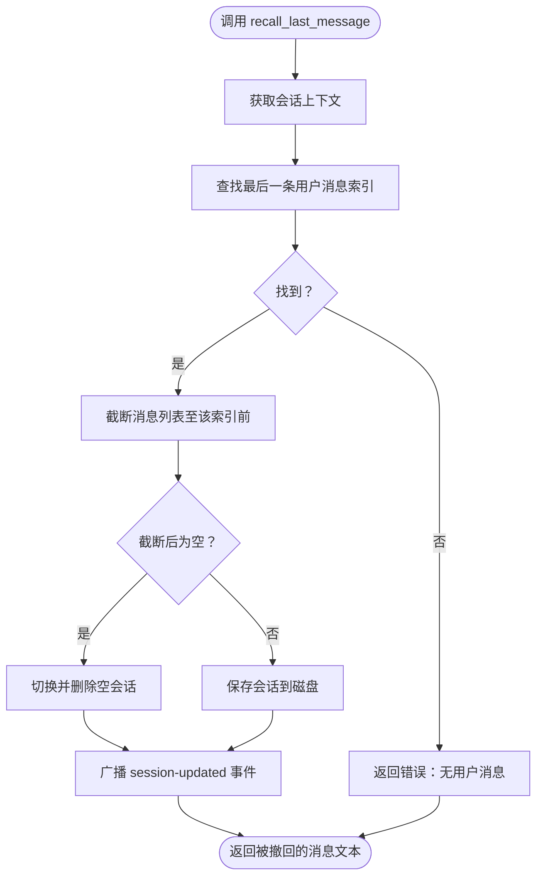
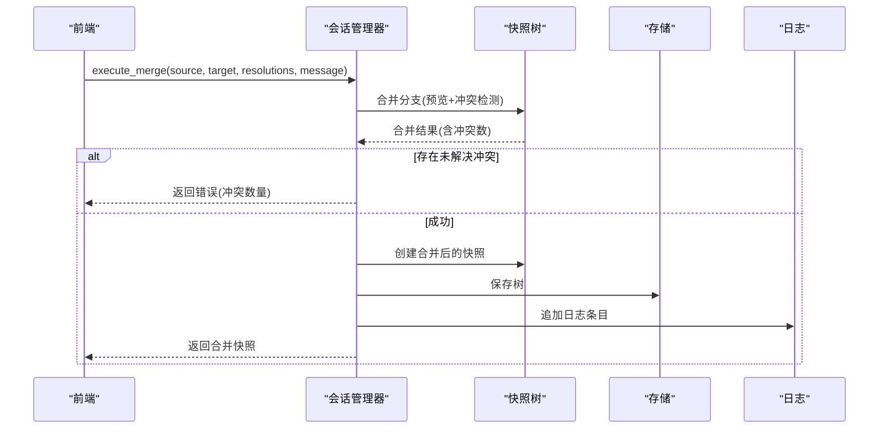
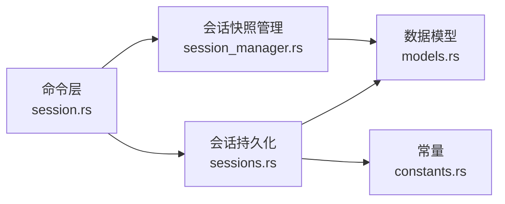

# 会话管理命令

<cite>
**本文引用的文件**
- [session.rs](file://src-tauri/src/core/commands/session.rs)
- [sessions.rs](file://src-tauri/src/core/sessions.rs)
- [session_manager.rs](file://src-tauri/src/core/snapshot_manager/session_manager.rs)
- [models.rs](file://src-tauri/src/core/models.rs)
- [constants.rs](file://src-tauri/src/core/constants.rs)
- [Cargo.toml](file://src-tauri/Cargo.toml)
- [main.rs](file://src-tauri/src/main.rs)
</cite>

## 目录
1. [简介](#简介)
2. [项目结构](#项目结构)
3. [核心组件](#核心组件)
4. [架构总览](#架构总览)
5. [详细组件分析](#详细组件分析)
6. [依赖关系分析](#依赖关系分析)
7. [性能考量](#性能考量)
8. [故障排查指南](#故障排查指南)
9. [结论](#结论)
10. [附录](#附录)

## 简介
本文件系统性梳理会话管理命令的 API 设计与实现，覆盖会话生命周期管理（创建、列表、详情、更新、删除）、会话状态与持久化、会话切换机制、清理策略、配置项与超时控制、并发会话管理、迁移与合并、备份恢复以及冲突解决流程。文档以“命令层-会话持久化-会话快照管理”三层架构为主线，结合实际源码路径定位，帮助开发者与使用者准确理解各接口的行为边界与数据流。

## 项目结构
会话管理相关代码主要分布在以下模块：
- 命令层：对外暴露的 Tauri 命令，负责参数校验、事件广播与调用会话/快照引擎。
- 会话持久化：负责会话元数据与消息体的序列化、过滤与落盘。
- 会话快照管理：负责基于快照树的工作区重建、分支管理、沙箱隔离与合并。

图表来源
- [session.rs:1-334](file://src-tauri/src/core/commands/session.rs#L1-L334)
- [sessions.rs:1-499](file://src-tauri/src/core/sessions.rs#L1-L499)
- [session_manager.rs:1-409](file://src-tauri/src/core/snapshot_manager/session_manager.rs#L1-L409)
- [models.rs:1-256](file://src-tauri/src/core/models.rs#L1-L256)
- [constants.rs:1-30](file://src-tauri/src/core/constants.rs#L1-L30)

章节来源
- [session.rs:1-334](file://src-tauri/src/core/commands/session.rs#L1-L334)
- [sessions.rs:1-499](file://src-tauri/src/core/sessions.rs#L1-L499)
- [session_manager.rs:1-409](file://src-tauri/src/core/snapshot_manager/session_manager.rs#L1-L409)
- [models.rs:1-256](file://src-tauri/src/core/models.rs#L1-L256)
- [constants.rs:1-30](file://src-tauri/src/core/constants.rs#L1-L30)

## 核心组件
- 会话命令层：提供会话 CRUD、切换、重命名、工作目录查询、代理步骤存取、计划文档管理、运行与事件查询等命令。
- 会话持久化层：提供会话元信息与完整消息体的读写、标题自动提取、图片资源落盘、空会话清理、最后活跃会话记录。
- 会话快照管理器：提供快照树、分支、沙箱、合并、回滚、工作区重建等能力，并通过注册表按会话 ID 管理实例。

章节来源
- [session.rs:1-334](file://src-tauri/src/core/commands/session.rs#L1-L334)
- [sessions.rs:55-499](file://src-tauri/src/core/sessions.rs#L55-L499)
- [session_manager.rs:18-409](file://src-tauri/src/core/snapshot_manager/session_manager.rs#L18-L409)

## 架构总览
会话管理采用“命令-持久化-快照”的分层设计。命令层负责业务入口与事件通知；持久化层负责磁盘 IO 与数据过滤；快照管理器负责复杂工作区与分支/沙箱场景。

图表来源
- [session.rs:19-55](file://src-tauri/src/core/commands/session.rs#L19-L55)
- [sessions.rs:191-216](file://src-tauri/src/core/sessions.rs#L191-L216)
- [session_manager.rs:386-402](file://src-tauri/src/core/snapshot_manager/session_manager.rs#L386-L402)

## 详细组件分析

### 会话生命周期命令
- 列表查询
  - 接口：list_sessions()
  - 行为：扫描会话目录，过滤空会话（非活跃且消息数为 0 的会话会被删除），按更新时间倒序返回元信息。
  - 输出：SessionMeta 列表。
  - 章节来源
    - [session.rs:14-17](file://src-tauri/src/core/commands/session.rs#L14-L17)
    - [sessions.rs:162-189](file://src-tauri/src/core/sessions.rs#L162-L189)

- 创建会话
  - 接口：create_session(working_directory?)
  - 行为：校验工作目录（若提供），创建 SessionMeta 并落盘；初始化上下文并写入工作目录。
  - 输出：SessionMeta。
  - 章节来源
    - [session.rs:19-43](file://src-tauri/src/core/commands/session.rs#L19-L43)
    - [sessions.rs:191-216](file://src-tauri/src/core/sessions.rs#L191-L216)

- 切换会话
  - 接口：switch_session(id)
  - 行为：预热内存上下文，返回目标会话元信息。
  - 输出：SessionMeta。
  - 章节来源
    - [session.rs:45-55](file://src-tauri/src/core/commands/session.rs#L45-L55)
    - [session_manager.rs:386-402](file://src-tauri/src/core/snapshot_manager/session_manager.rs#L386-L402)

- 删除会话
  - 接口：delete_session(id)
  - 行为：删除会话 JSON 与关联图片文件。
  - 输出：成功/错误。
  - 章节来源
    - [session.rs:188-195](file://src-tauri/src/core/commands/session.rs#L188-L195)
    - [sessions.rs:444-462](file://src-tauri/src/core/sessions.rs#L444-L462)

- 重命名会话
  - 接口：rename_session(id, title)
  - 行为：更新标题与来源标记（默认/自动/手动）。
  - 输出：SessionMeta。
  - 章节来源
    - [session.rs:196-200](file://src-tauri/src/core/commands/session.rs#L196-L200)
    - [sessions.rs:464-480](file://src-tauri/src/core/sessions.rs#L464-L480)

- 更新会话配置档案
  - 接口：update_session_profile(id, profile_id)
  - 行为：为会话绑定模型预设标识。
  - 输出：成功/错误。
  - 章节来源
    - [session.rs:202-205](file://src-tauri/src/core/commands/session.rs#L202-L205)
    - [sessions.rs:482-493](file://src-tauri/src/core/sessions.rs#L482-L493)

- 获取会话元信息
  - 接口：get_session_meta(id)
  - 行为：读取并返回 SessionMeta。
  - 输出：SessionMeta。
  - 章节来源
    - [session.rs:207-210](file://src-tauri/src/core/commands/session.rs#L207-L210)
    - [sessions.rs:432-442](file://src-tauri/src/core/sessions.rs#L432-L442)

- 获取工作目录
  - 接口：get_workspace_dir(session_id)
  - 行为：返回会话上下文中的工作目录，非沙箱会话返回 None。
  - 输出：工作目录字符串或 None。
  - 章节来源
    - [session.rs:212-225](file://src-tauri/src/core/commands/session.rs#L212-L225)
    - [session_manager.rs:18-26](file://src-tauri/src/core/snapshot_manager/session_manager.rs#L18-L26)

- 代理步骤存取
  - 接口：save_agent_steps(steps, session_id) / get_agent_steps(session_id)
  - 行为：在内存与持久化之间同步 agent_steps。
  - 输出：get_agent_steps 返回步骤列表。
  - 章节来源
    - [session.rs:227-253](file://src-tauri/src/core/commands/session.rs#L227-L253)
    - [sessions.rs:218-364](file://src-tauri/src/core/sessions.rs#L218-L364)

- 计划文档管理
  - 接口：list_plan_documents(session_id)
  - 行为：按更新时间倒序列出计划文档。
  - 输出：PlanDocument 列表。
  - 章节来源
    - [session.rs:255-260](file://src-tauri/src/core/commands/session.rs#L255-L260)
    - [sessions.rs:379-383](file://src-tauri/src/core/sessions.rs#L379-L383)

- 会话自动命名
  - 接口：auto_name_session(app, session_id, memory)
  - 行为：使用 LLM 生成标题，更新会话并广播重命名事件。
  - 输出：无（副作用：更新标题与事件通知）。
  - 章节来源
    - [session.rs:86-137](file://src-tauri/src/core/commands/session.rs#L86-L137)

- 最后一条消息撤回
  - 接口：recall_last_message(session_id)
  - 行为：移除最后一条用户消息，若会话为空则切换并删除空会话。
  - 输出：被撤回的消息文本。
  - 章节来源
    - [session.rs:139-186](file://src-tauri/src/core/commands/session.rs#L139-L186)

- 会话切换与空会话清理
  - 接口：switch_away_and_delete_empty_session(deleted_session_id, app)
  - 行为：选择下一个可用会话作为活动会话，删除已删除会话，广播事件。
  - 输出：无。
  - 章节来源
    - [session.rs:57-84](file://src-tauri/src/core/commands/session.rs#L57-L84)

- Agent 运行与事件查询
  - 接口：list_agent_runs(session_id?) / list_agent_run_events(session_id?, run_id?)
  - 行为：查询 Agent 运行与事件。
  - 输出：运行列表/事件列表。
  - 章节来源
    - [session.rs:262-275](file://src-tauri/src/core/commands/session.rs#L262-L275)

- 准备恢复 Agent 运行
  - 接口：prepare_resume_agent_run(run_id)
  - 行为：准备恢复计划并将消息回填到会话上下文。
  - 输出：ResumeAgentRunPlan。
  - 章节来源
    - [session.rs:277-289](file://src-tauri/src/core/commands/session.rs#L277-L289)

- 背景任务与子代理
  - 接口：get_background_tasks(bg_state) / list_subagents / list_subagent_events / cancel_subagent_run
  - 行为：查询背景任务、子代理运行与事件，取消子代理运行。
  - 输出：对应实体列表或运行对象。
  - 章节来源
    - [session.rs:291-333](file://src-tauri/src/core/commands/session.rs#L291-L333)

图表来源
- [session.rs:139-186](file://src-tauri/src/core/commands/session.rs#L139-L186)

章节来源
- [session.rs:139-186](file://src-tauri/src/core/commands/session.rs#L139-L186)

### 会话状态与持久化
- 状态字段
  - SessionMeta 包含 id、title、created_at、updated_at、message_count、is_smart_named、profile_id、token 统计、title_source、working_directory 等。
  - 章节来源
    - [sessions.rs:55-77](file://src-tauri/src/core/sessions.rs#L55-L77)

- 数据过滤与落盘
  - 保存时过滤工具调用与空文本，仅保留用户输入与助手文本/思考块，大幅减小文件体积。
  - 图片资源落地到 .images 目录，消息中图片块替换为文件名。
  - 章节来源
    - [sessions.rs:218-364](file://src-tauri/src/core/sessions.rs#L218-L364)

- 标题生成策略
  - 默认：从第一条用户消息提取前 N 字符；自动：由 LLM 自动生成；手动：用户自定义。
  - 章节来源
    - [sessions.rs:126-160](file://src-tauri/src/core/sessions.rs#L126-L160)
    - [session.rs:86-137](file://src-tauri/src/core/commands/session.rs#L86-L137)

- 空会话清理
  - list_sessions 会删除非活跃且消息数为 0 的会话文件；recall_last_message 在空会话时触发切换并删除。
  - 章节来源
    - [sessions.rs:162-189](file://src-tauri/src/core/sessions.rs#L162-L189)
    - [session.rs:177-183](file://src-tauri/src/core/commands/session.rs#L177-L183)

- 最后活跃会话
  - 通过 _last_active.txt 记录与读取，便于启动时恢复。
  - 章节来源
    - [sessions.rs:495-499](file://src-tauri/src/core/sessions.rs#L495-L499)
    - [constants.rs:18-18](file://src-tauri/src/core/constants.rs#L18-L18)

章节来源
- [sessions.rs:55-499](file://src-tauri/src/core/sessions.rs#L55-L499)
- [constants.rs:1-30](file://src-tauri/src/core/constants.rs#L1-L30)

### 会话切换机制与并发控制
- 切换机制
  - switch_session 预热内存上下文并返回元信息；switch_away_and_delete_empty_session 自动选择下一个会话并广播事件。
  - 章节来源
    - [session.rs:45-55](file://src-tauri/src/core/commands/session.rs#L45-L55)
    - [session.rs:57-84](file://src-tauri/src/core/commands/session.rs#L57-L84)

- 并发控制
  - 会话管理器通过注册表按会话 ID 缓存实例，避免重复创建；内部使用读写锁保护共享状态。
  - 章节来源
    - [session_manager.rs:375-409](file://src-tauri/src/core/snapshot_manager/session_manager.rs#L375-L409)

章节来源
- [session.rs:45-84](file://src-tauri/src/core/commands/session.rs#L45-L84)
- [session_manager.rs:375-409](file://src-tauri/src/core/snapshot_manager/session_manager.rs#L375-L409)

### 会话清理策略
- 磁盘清理
  - 删除会话时同时清理 .images 下以会话 ID 前缀的图片文件。
  - 章节来源
    - [sessions.rs:444-462](file://src-tauri/src/core/sessions.rs#L444-L462)

- 内存清理
  - 注销会话时从注册表移除实例，释放内存占用。
  - 章节来源
    - [session_manager.rs:404-408](file://src-tauri/src/core/snapshot_manager/session_manager.rs#L404-L408)

章节来源
- [sessions.rs:444-462](file://src-tauri/src/core/sessions.rs#L444-L462)
- [session_manager.rs:404-408](file://src-tauri/src/core/snapshot_manager/session_manager.rs#L404-L408)

### 会话配置选项、超时设置与并发控制
- 配置选项
  - 会话工作目录：可选，None 表示无沙箱限制；通过 create_session 传入。
  - 模型预设：通过 update_session_profile 绑定 profile_id。
  - 章节来源
    - [session.rs:19-43](file://src-tauri/src/core/commands/session.rs#L19-L43)
    - [session.rs:202-205](file://src-tauri/src/core/commands/session.rs#L202-L205)
    - [sessions.rs:55-77](file://src-tauri/src/core/sessions.rs#L55-L77)

- 超时设置
  - 代码库未显式提供会话超时配置项；如需超时控制可在应用层通过外部定时器或任务调度实现。
  - 章节来源
    - [Cargo.toml:20-40](file://src-tauri/Cargo.toml#L20-L40)

- 并发控制
  - 使用 tokio::sync::RwLock 保护快照树与日志等共享状态；SessionManagerRegistry 保证同一会话 ID 只有一个实例。
  - 章节来源
    - [session_manager.rs:18-26](file://src-tauri/src/core/snapshot_manager/session_manager.rs#L18-L26)
    - [session_manager.rs:386-402](file://src-tauri/src/core/snapshot_manager/session_manager.rs#L386-L402)

章节来源
- [session.rs:19-43](file://src-tauri/src/core/commands/session.rs#L19-L43)
- [session.rs:202-205](file://src-tauri/src/core/commands/session.rs#L202-L205)
- [session_manager.rs:18-26](file://src-tauri/src/core/snapshot_manager/session_manager.rs#L18-L26)
- [session_manager.rs:386-402](file://src-tauri/src/core/snapshot_manager/session_manager.rs#L386-L402)
- [Cargo.toml:20-40](file://src-tauri/Cargo.toml#L20-L40)

### 会话迁移、备份恢复与冲突解决
- 快照与分支
  - 支持创建快照、分支、切换分支、列出快照与分支、获取当前分支与快照 ID。
  - 章节来源
    - [session_manager.rs:59-184](file://src-tauri/src/core/snapshot_manager/session_manager.rs#L59-L184)
    - [session_manager.rs:201-224](file://src-tauri/src/core/snapshot_manager/session_manager.rs#L201-L224)

- 工作区重建与回滚
  - 通过 ReplayEngine 重建工作区，rollback_to 回滚到指定快照。
  - 章节来源
    - [session_manager.rs:186-199](file://src-tauri/src/core/snapshot_manager/session_manager.rs#L186-L199)
    - [session_manager.rs:226-230](file://src-tauri/src/core/snapshot_manager/session_manager.rs#L226-L230)

- 沙箱隔离与发布
  - 多 Agent 沙箱：创建、完成、放弃、发布；发布后可合并到主干。
  - 章节来源
    - [session_manager.rs:234-298](file://src-tauri/src/core/snapshot_manager/session_manager.rs#L234-L298)

- 分支合并与冲突解决
  - preview_merge 预览合并；get_merge_conflicts 获取冲突；execute_merge 执行合并并创建合并快照。
  - 章节来源
    - [session_manager.rs:308-370](file://src-tauri/src/core/snapshot_manager/session_manager.rs#L308-L370)

图表来源
- [session_manager.rs:308-370](file://src-tauri/src/core/snapshot_manager/session_manager.rs#L308-L370)

章节来源
- [session_manager.rs:59-370](file://src-tauri/src/core/snapshot_manager/session_manager.rs#L59-L370)

## 依赖关系分析
- 命令层依赖
  - 会话持久化：list_sessions、create_session、delete_session、rename_session、get_session_meta、save_agent_steps、get_agent_steps、list_plan_documents 等。
  - 会话快照管理：switch_session、prepare_resume_agent_run 等。
- 持久化层依赖
  - 数据模型：SessionMemory、Message、Content、PlanDocument 等。
  - 常量：目录与文件名、标题长度限制等。
- 快照管理器依赖
  - 模型与引擎：Snapshot、SnapshotTree、ReplayEngine、MergeEngine、SandboxManager 等。

图表来源
- [session.rs:1-334](file://src-tauri/src/core/commands/session.rs#L1-L334)
- [sessions.rs:1-499](file://src-tauri/src/core/sessions.rs#L1-L499)
- [session_manager.rs:1-409](file://src-tauri/src/core/snapshot_manager/session_manager.rs#L1-L409)
- [models.rs:1-256](file://src-tauri/src/core/models.rs#L1-L256)
- [constants.rs:1-30](file://src-tauri/src/core/constants.rs#L1-L30)

章节来源
- [session.rs:1-334](file://src-tauri/src/core/commands/session.rs#L1-L334)
- [sessions.rs:1-499](file://src-tauri/src/core/sessions.rs#L1-L499)
- [session_manager.rs:1-409](file://src-tauri/src/core/snapshot_manager/session_manager.rs#L1-L409)
- [models.rs:1-256](file://src-tauri/src/core/models.rs#L1-L256)
- [constants.rs:1-30](file://src-tauri/src/core/constants.rs#L1-L30)

## 性能考量
- 数据过滤：保存时过滤工具消息与空文本，显著降低文件大小与 IO 开销。
- 图片资源：将大图转存为文件并仅保留文件名，减少 JSON 体积。
- 空会话清理：定期删除无活跃的空会话，避免磁盘膨胀。
- 并发安全：使用 RwLock 保护共享状态，避免竞态；注册表缓存实例，减少重复初始化成本。
- 建议
  - 对频繁调用的 list_sessions 建议前端做本地缓存与增量刷新。
  - 大消息场景下优先使用多块内容与图片文件路径，避免超大 JSON。

## 故障排查指南
- 会话不存在
  - 现象：get_session_meta/load_session 返回“会话不存在”。
  - 处理：确认会话 ID 是否正确，检查 sessions 目录是否存在对应 JSON。
  - 章节来源
    - [sessions.rs:366-377](file://src-tauri/src/core/sessions.rs#L366-L377)
    - [sessions.rs:432-442](file://src-tauri/src/core/sessions.rs#L432-L442)

- 工作目录无效
  - 现象：create_session 报错“目录不存在或不是文件夹”。
  - 处理：确保传入路径存在且为目录。
  - 章节来源
    - [session.rs:26-34](file://src-tauri/src/core/commands/session.rs#L26-L34)

- 无法撤回消息
  - 现象：recall_last_message 返回“没有可撤回的用户消息”。
  - 处理：确认会话中存在用户消息；若为空会话将触发切换并删除。
  - 章节来源
    - [session.rs:171-173](file://src-tauri/src/core/commands/session.rs#L171-L173)
    - [session.rs:177-183](file://src-tauri/src/core/commands/session.rs#L177-L183)

- 合并失败
  - 现象：execute_merge 返回“存在若干未解决的冲突”。
  - 处理：先调用 get_merge_conflicts 获取冲突，逐项提供 ConflictResolution 后重新执行。
  - 章节来源
    - [session_manager.rs:345-347](file://src-tauri/src/core/snapshot_manager/session_manager.rs#L345-L347)
    - [session_manager.rs:328-334](file://src-tauri/src/core/snapshot_manager/session_manager.rs#L328-L334)

章节来源
- [sessions.rs:366-377](file://src-tauri/src/core/sessions.rs#L366-L377)
- [sessions.rs:432-442](file://src-tauri/src/core/sessions.rs#L432-L442)
- [session.rs:26-34](file://src-tauri/src/core/commands/session.rs#L26-L34)
- [session.rs:171-183](file://src-tauri/src/core/commands/session.rs#L171-L183)
- [session_manager.rs:328-347](file://src-tauri/src/core/snapshot_manager/session_manager.rs#L328-L347)

## 结论
会话管理命令围绕“命令-持久化-快照”三层架构构建，既满足基础的会话 CRUD 与切换需求，又提供了完善的快照树、分支、沙箱与合并能力，适用于复杂场景下的会话迁移与协作。通过数据过滤、空会话清理与并发锁保障，系统在性能与可靠性方面具备良好表现。建议在上层应用中结合事件广播与缓存策略，进一步提升用户体验。

## 附录
- 启动入口
  - 应用入口调用 lib::run，初始化核心模块与命令注册。
  - 章节来源
    - [main.rs:4-7](file://src-tauri/src/main.rs#L4-L7)

章节来源
- [main.rs:4-7](file://src-tauri/src/main.rs#L4-L7)