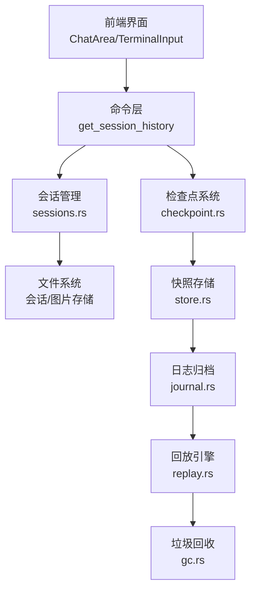
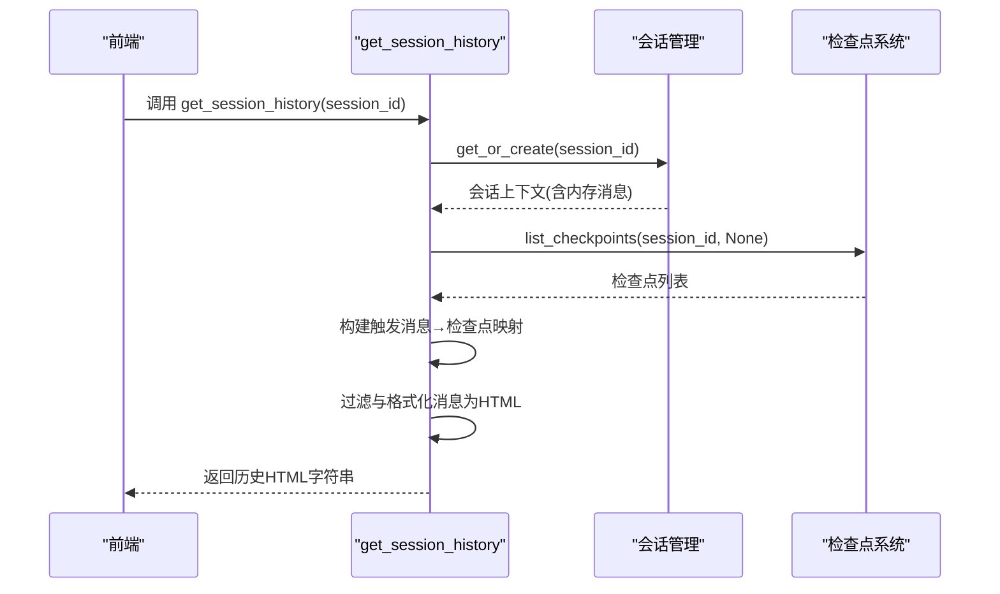
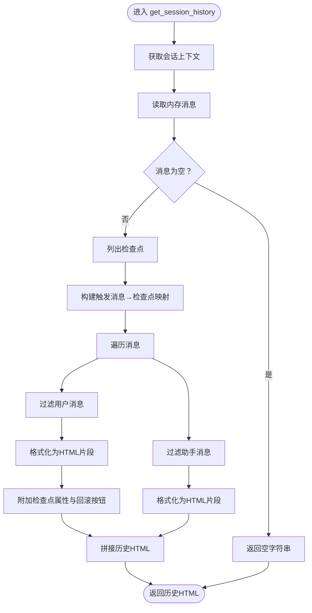
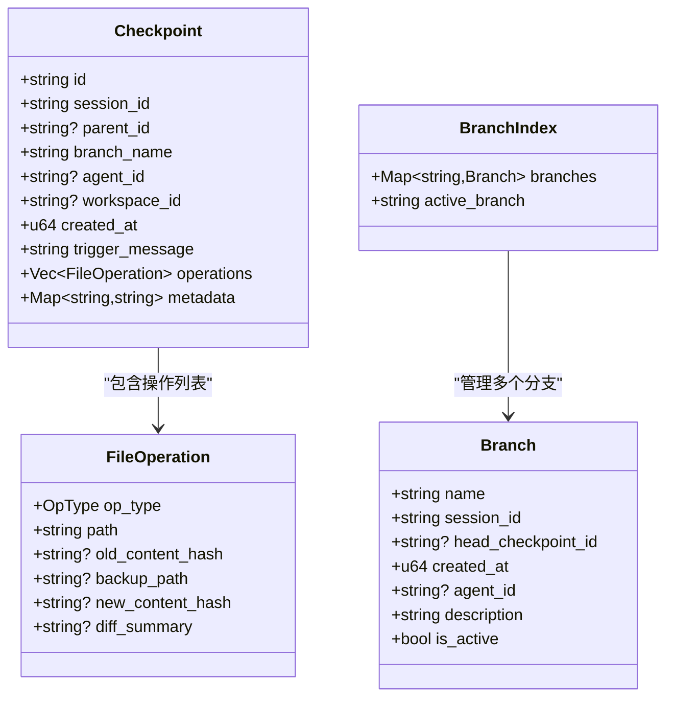
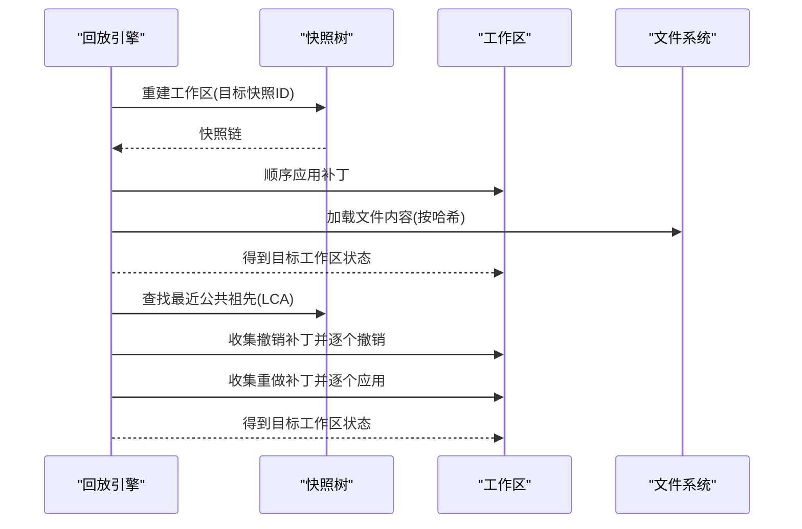
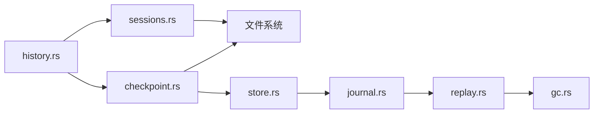

# 历史记录命令

<cite>
**本文引用的文件**
- [history.rs](file://src-tauri/src/core/commands/history.rs)
- [checkpoint.rs](file://src-tauri/src/core/checkpoint.rs)
- [sessions.rs](file://src-tauri/src/core/sessions.rs)
- [models.rs](file://src-tauri/src/core/models.rs)
- [store.rs](file://src-tauri/src/core/snapshot_manager/store.rs)
- [journal.rs](file://src-tauri/src/core/snapshot_engine/journal.rs)
- [replay.rs](file://src-tauri/src/core/snapshot_engine/replay.rs)
- [gc.rs](file://src-tauri/src/core/snapshot_engine/gc.rs)
- [mod.rs](file://src-tauri/src/core/commands/mod.rs)
- [lib.rs](file://src-tauri/src/lib.rs)
</cite>

## 目录
1. [简介](#简介)
2. [项目结构](#项目结构)
3. [核心组件](#核心组件)
4. [架构总览](#架构总览)
5. [详细组件分析](#详细组件分析)
6. [依赖关系分析](#依赖关系分析)
7. [性能考量](#性能考量)
8. [故障排查指南](#故障排查指南)
9. [结论](#结论)
10. [附录](#附录)

## 简介
本文件面向“历史记录命令”的API设计与实现，聚焦于会话历史查询、检查点回滚、快照与时间线管理、历史过滤与归档策略、检索算法与内存优化、历史数据完整性与隐私保护、以及历史记录同步机制等主题。通过梳理后端 Rust 模块与前端交互接口，帮助开发者与使用者理解并正确使用历史记录相关能力。

## 项目结构
围绕历史记录的核心模块分布如下：
- 命令层：提供 Tauri 命令入口，负责会话历史查询等对外 API。
- 会话持久化：负责会话元信息与消息的读写、标题生成、图片资源管理。
- 检查点系统：提供分支、检查点、文件操作备份与回滚能力。
- 快照引擎：包含快照树、补丁应用/撤销、日志归档与压缩、垃圾回收。
- 前端集成：Tauri 命令注册，供前端调用。

图表来源
- [history.rs:6-151](file://src-tauri/src/core/commands/history.rs#L6-L151)
- [sessions.rs:162-499](file://src-tauri/src/core/sessions.rs#L162-L499)
- [checkpoint.rs:152-514](file://src-tauri/src/core/checkpoint.rs#L152-L514)
- [store.rs:17-104](file://src-tauri/src/core/snapshot_manager/store.rs#L17-L104)
- [journal.rs:53-157](file://src-tauri/src/core/snapshot_engine/journal.rs#L53-L157)
- [replay.rs:23-344](file://src-tauri/src/core/snapshot_engine/replay.rs#L23-L344)
- [gc.rs:30-107](file://src-tauri/src/core/snapshot_engine/gc.rs#L30-L107)

章节来源
- [history.rs:6-151](file://src-tauri/src/core/commands/history.rs#L6-L151)
- [mod.rs:1-9](file://src-tauri/src/core/commands/mod.rs#L1-L9)
- [lib.rs:138](file://src-tauri/src/lib.rs#L138)

## 核心组件
- 历史查询命令：对外暴露会话历史查询接口，内部聚合会话消息与检查点信息，生成可渲染的历史 HTML。
- 会话持久化：负责会话元信息与消息的读写、标题生成、图片资源管理；对历史进行过滤以减小体积。
- 检查点系统：提供分支、检查点、文件操作备份与回滚能力；支持按触发消息定位检查点。
- 快照引擎：包含快照树、补丁应用/撤销、日志归档与压缩、垃圾回收。
- 前端集成：Tauri 命令注册，供前端调用。

章节来源
- [history.rs:6-151](file://src-tauri/src/core/commands/history.rs#L6-L151)
- [sessions.rs:162-499](file://src-tauri/src/core/sessions.rs#L162-L499)
- [checkpoint.rs:152-514](file://src-tauri/src/core/checkpoint.rs#L152-L514)
- [store.rs:17-104](file://src-tauri/src/core/snapshot_manager/store.rs#L17-L104)
- [journal.rs:53-157](file://src-tauri/src/core/snapshot_engine/journal.rs#L53-L157)
- [replay.rs:23-344](file://src-tauri/src/core/snapshot_engine/replay.rs#L23-L344)
- [gc.rs:30-107](file://src-tauri/src/core/snapshot_engine/gc.rs#L30-L107)

## 架构总览
历史记录命令的调用链路如下：
- 前端通过 Tauri 命令调用 get_session_history。
- 后端根据 session_id 获取或创建会话上下文，读取会话内存中的消息。
- 读取检查点列表，构建“触发消息 → 检查点”的映射，用于在历史中标识可回滚位置。
- 对消息内容进行过滤与格式化，生成 HTML 片段，并附加检查点属性与回滚按钮。
- 返回历史 HTML 字符串给前端渲染。

图表来源
- [history.rs:6-151](file://src-tauri/src/core/commands/history.rs#L6-L151)
- [checkpoint.rs:334-357](file://src-tauri/src/core/checkpoint.rs#L334-L357)
- [sessions.rs:162-216](file://src-tauri/src/core/sessions.rs#L162-L216)

## 详细组件分析

### 历史查询命令 API
- 命令名称：get_session_history
- 参数：
  - session_id: String
  - 依赖状态：SessionManager
- 返回：Result<String, String>，成功时返回历史 HTML 字符串
- 关键流程：
  - 获取会话上下文并克隆内存消息
  - 读取检查点列表，构建“触发消息前缀 → 检查点信息”映射
  - 遍历消息，过滤用户消息与助手消息，生成 HTML 片段
  - 为用户消息附加 data-checkpoint-id 属性与回滚按钮
  - 返回拼接后的历史 HTML

图表来源
- [history.rs:6-151](file://src-tauri/src/core/commands/history.rs#L6-L151)

章节来源
- [history.rs:6-151](file://src-tauri/src/core/commands/history.rs#L6-L151)

### 会话持久化与历史过滤
- 会话存储结构：
  - 元信息：SessionMeta（标题、创建/更新时间、消息数、令牌用量、工作目录等）
  - 内容：SessionMemory（messages、context、agent_steps、plan_documents）
- 历史过滤策略：
  - 用户消息：仅保留文本与图片块，丢弃工具调用与工具结果
  - 助手消息：仅保留非空文本与思考块
  - 图片处理：将内嵌 base64 编码转存为独立文件，消息中仅保留文件路径
- 标题生成：从第一条用户消息提取“[User Input]:”之后的内容，截断至最大长度
- 删除会话时同步清理对应图片文件

章节来源
- [sessions.rs:55-84](file://src-tauri/src/core/sessions.rs#L55-L84)
- [sessions.rs:162-499](file://src-tauri/src/core/sessions.rs#L162-L499)

### 检查点系统与时间线管理
- 数据结构：
  - Checkpoint：检查点信息（id、parent_id、branch_name、trigger_message、operations、metadata）
  - FileOperation：文件操作类型（编辑、写入、创建、删除、重命名）
  - Branch：分支信息（head_checkpoint_id、agent_id、描述、是否活跃）
  - BranchIndex：分支索引（active_branch、branches）
- 分支管理：
  - 创建分支、切换分支、列出分支、删除分支（禁止删除主分支与当前活跃分支）
- 检查点管理：
  - 创建检查点、加载检查点、列出检查点、按链回溯、获取树视图
  - 回滚到检查点：逆序执行操作，恢复备份文件或删除/恢复目标文件
- 文件备份与恢复：
  - backup_file：基于内容哈希生成备份文件名，避免重复写入
  - restore_file：从备份恢复到目标路径

图表来源
- [checkpoint.rs:16-86](file://src-tauri/src/core/checkpoint.rs#L16-L86)

章节来源
- [checkpoint.rs:152-514](file://src-tauri/src/core/checkpoint.rs#L152-L514)

### 快照引擎与回放机制
- 快照存储：
  - SnapshotStore：按分支目录保存快照 JSON，维护 tree.json
  - 支持保存、加载、删除、枚举快照
- 日志归档与压缩：
  - Journal：追加式日志，支持 replay 重放
  - 当条目数量超过阈值时进行 compact，将树状态写入压缩日志并替换原文件
- 回放与原子回滚：
  - ReplayEngine：重建工作区、查找最近公共祖先、收集撤销/重做补丁
  - AtomicFileRollback：准备阶段生成临时目录与撤销日志，执行阶段原子性地写入目标目录
- 垃圾回收：
  - GarbageCollector：按最大检查点数、最大年龄、最大总大小、是否保留分支头等策略清理

图表来源
- [replay.rs:57-246](file://src-tauri/src/core/snapshot_engine/replay.rs#L57-L246)
- [journal.rs:102-151](file://src-tauri/src/core/snapshot_engine/journal.rs#L102-L151)
- [gc.rs:39-98](file://src-tauri/src/core/snapshot_engine/gc.rs#L39-L98)

章节来源
- [store.rs:17-104](file://src-tauri/src/core/snapshot_manager/store.rs#L17-L104)
- [journal.rs:53-157](file://src-tauri/src/core/snapshot_engine/journal.rs#L53-L157)
- [replay.rs:23-344](file://src-tauri/src/core/snapshot_engine/replay.rs#L23-L344)
- [gc.rs:30-107](file://src-tauri/src/core/snapshot_engine/gc.rs#L30-L107)

### 历史记录检索算法与内存优化
- 检索算法要点：
  - 触发消息匹配：对用户消息内容取前若干字符作为“触发消息前缀”，与检查点映射比对，定位可回滚位置
  - 消息过滤：仅保留文本与图片块，丢弃工具调用/结果，减少冗余
  - HTML 生成：按消息类型分别格式化，助手消息支持展开“思考与操作”
- 内存优化：
  - 会话保存时过滤消息，显著降低文件体积
  - 图片从内嵌 base64 转存为外部文件，消息中仅保留文件路径
  - 历史查询不加载完整工作区，仅基于内存消息与检查点映射生成 HTML

章节来源
- [history.rs:18-96](file://src-tauri/src/core/commands/history.rs#L18-L96)
- [sessions.rs:258-364](file://src-tauri/src/core/sessions.rs#L258-L364)

### 历史记录隐私保护与数据完整性
- 隐私保护：
  - 会话保存时过滤工具调用与工具结果，避免敏感信息外泄
  - 图片从内嵌 base64 转存为独立文件，消息中仅保留文件路径
- 数据完整性：
  - 快照树与补丁序列保证可回放性
  - 日志归档与压缩确保历史可重放且空间可控
  - 原子回滚通过临时目录与撤销日志保障一致性

章节来源
- [sessions.rs:258-364](file://src-tauri/src/core/sessions.rs#L258-L364)
- [journal.rs:102-151](file://src-tauri/src/core/snapshot_engine/journal.rs#L102-L151)
- [replay.rs:248-344](file://src-tauri/src/core/snapshot_engine/replay.rs#L248-L344)

### 历史记录同步机制
- 前端调用后端命令：通过 Tauri 注册的命令接口调用 get_session_history
- 命令注册位置：lib.rs 中注册历史命令
- 命令分组：commands/mod.rs 汇总各命令模块

章节来源
- [lib.rs:138](file://src-tauri/src/lib.rs#L138)
- [mod.rs:1-9](file://src-tauri/src/core/commands/mod.rs#L1-L9)

## 依赖关系分析
- 命令层依赖会话管理与检查点系统，用于获取消息与检查点映射
- 会话管理依赖文件系统进行会话与图片的读写
- 检查点系统依赖文件系统进行检查点与备份文件的持久化
- 快照引擎提供回放与垃圾回收能力，支撑历史的可恢复与空间治理

图表来源
- [history.rs:6-151](file://src-tauri/src/core/commands/history.rs#L6-L151)
- [sessions.rs:162-499](file://src-tauri/src/core/sessions.rs#L162-L499)
- [checkpoint.rs:152-514](file://src-tauri/src/core/checkpoint.rs#L152-L514)
- [store.rs:17-104](file://src-tauri/src/core/snapshot_manager/store.rs#L17-L104)
- [journal.rs:53-157](file://src-tauri/src/core/snapshot_engine/journal.rs#L53-L157)
- [replay.rs:23-344](file://src-tauri/src/core/snapshot_engine/replay.rs#L23-L344)
- [gc.rs:30-107](file://src-tauri/src/core/snapshot_engine/gc.rs#L30-L107)

## 性能考量
- 历史查询复杂度：O(N + M)，N 为消息数，M 为检查点数；通过映射与前缀匹配优化定位
- 会话保存过滤：在写入阶段即完成消息过滤与图片转存，降低后续读取成本
- 日志压缩阈值：当条目数达到阈值时进行 compact，减少 IO 与磁盘占用
- 垃圾回收策略：按最大检查点数、最大年龄、最大总大小控制快照规模

## 故障排查指南
- 历史为空：
  - 检查会话是否存在且消息非空
  - 确认会话保存逻辑未因过滤导致消息数为 0
- 检查点不可用：
  - 确认检查点文件存在且可解析
  - 检查分支头指针是否有效
- 回滚失败：
  - 确认备份文件存在且可恢复
  - 检查原子回滚撤销日志是否完整
- 日志压缩异常：
  - 检查压缩阈值与日志文件权限
  - 确认 compact 后文件替换成功

章节来源
- [sessions.rs:174-179](file://src-tauri/src/core/sessions.rs#L174-L179)
- [checkpoint.rs:406-500](file://src-tauri/src/core/checkpoint.rs#L406-L500)
- [journal.rs:102-151](file://src-tauri/src/core/snapshot_engine/journal.rs#L102-L151)
- [replay.rs:324-344](file://src-tauri/src/core/snapshot_engine/replay.rs#L324-L344)

## 结论
本历史记录命令体系以“会话消息 + 检查点映射”为核心，结合会话过滤、图片转存、快照树与回放机制，提供了高效、可恢复、可治理的历史记录能力。通过命令注册与前端集成，实现了从查询到回滚的完整闭环。建议在生产环境中配合日志压缩与垃圾回收策略，持续优化存储与性能。

## 附录
- 命令注册位置：lib.rs 中注册历史命令
- 命令分组：commands/mod.rs 汇总各命令模块
- 数据模型：models.rs 定义消息、内容块、会话内存等核心类型

章节来源
- [lib.rs:138](file://src-tauri/src/lib.rs#L138)
- [mod.rs:1-9](file://src-tauri/src/core/commands/mod.rs#L1-L9)
- [models.rs:144-235](file://src-tauri/src/core/models.rs#L144-L235)