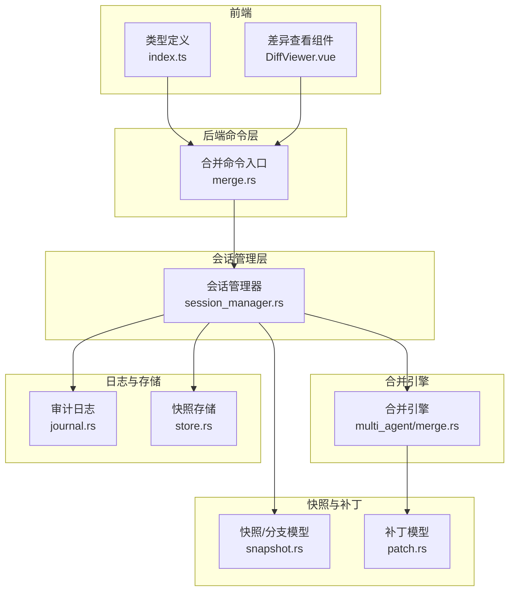
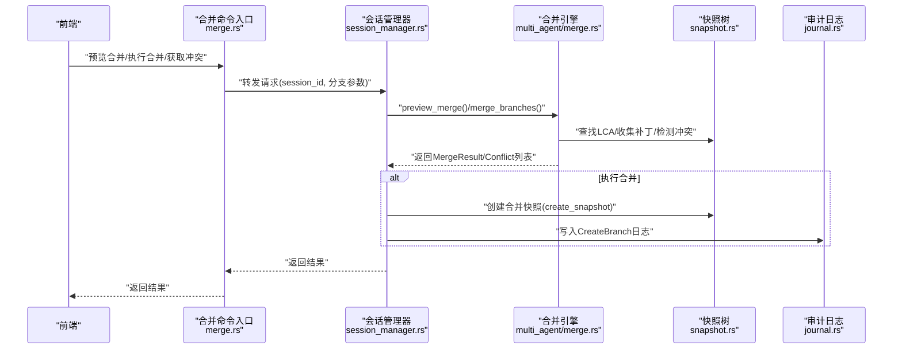
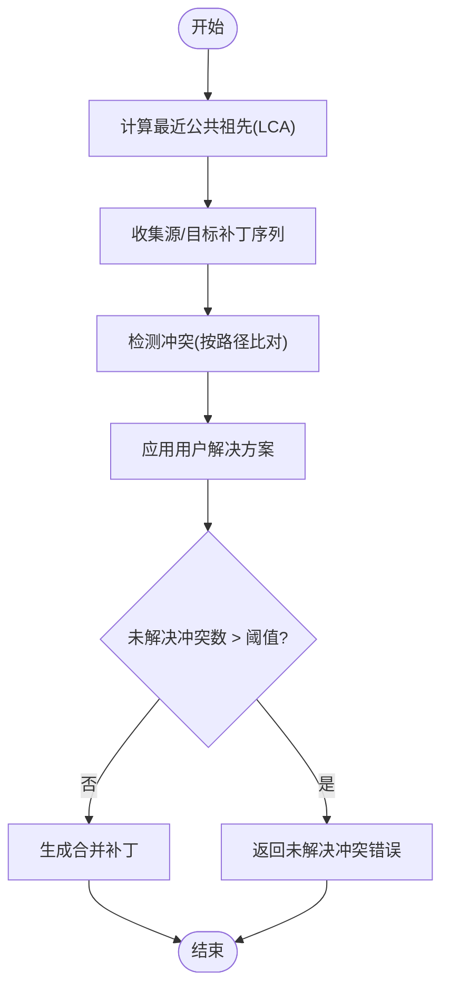
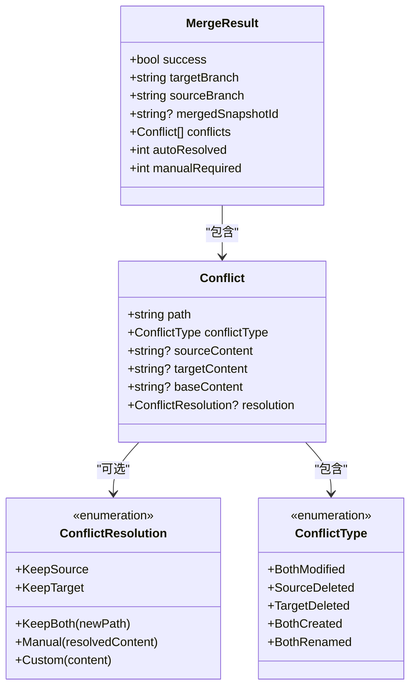
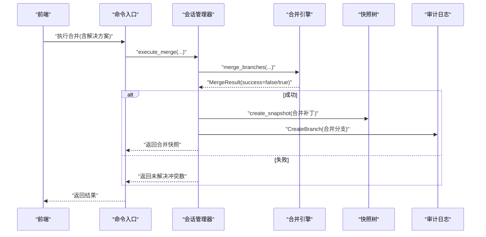
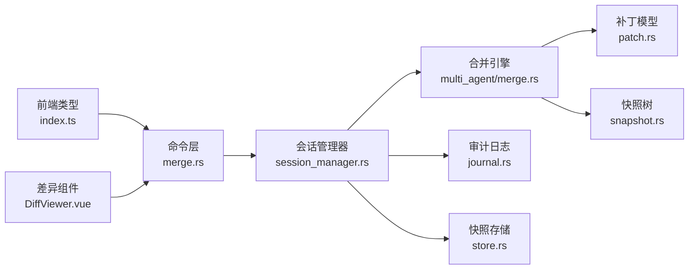

# 合并冲突命令

<cite>
**本文引用的文件**
- [merge.rs](file://src-tauri/src/core/commands/merge.rs)
- [merge.rs（多代理合并）](file://src-tauri/src/core/snapshot_engine/multi_agent/merge.rs)
- [session_manager.rs](file://src-tauri/src/core/snapshot_manager/session_manager.rs)
- [snapshot.rs](file://src-tauri/src/core/snapshot_engine/snapshot.rs)
- [patch.rs](file://src-tauri/src/core/snapshot_engine/patch.rs)
- [journal.rs](file://src-tauri/src/core/snapshot_engine/journal.rs)
- [store.rs](file://src-tauri/src/core/snapshot_manager/store.rs)
- [index.ts（类型定义）](file://src/types/index.ts)
- [DiffViewer.vue](file://src/components/snapshot/DiffViewer.vue)
</cite>

## 目录
1. [简介](#简介)
2. [项目结构](#项目结构)
3. [核心组件](#核心组件)
4. [架构总览](#架构总览)
5. [详细组件分析](#详细组件分析)
6. [依赖关系分析](#依赖关系分析)
7. [性能考量](#性能考量)
8. [故障排查指南](#故障排查指南)
9. [结论](#结论)
10. [附录](#附录)

## 简介
本文件系统化梳理合并冲突处理命令的完整 API 与实现，覆盖冲突检测、冲突解决、手动合并、自动合并、冲突标记、冲突可视化、解决方案生成、冲突解决流程、人工干预机制、冲突历史记录等能力。文档同时给出冲突算法、合并策略、冲突预防策略、最佳实践与审计日志处理方式，帮助开发者与使用者高效理解与使用该功能。

## 项目结构
围绕“合并冲突命令”的关键模块分布如下：
- 前端类型与可视化：类型定义、差异展示组件
- 后端命令层：Tauri 命令入口，桥接会话管理器
- 会话管理器：统一调度快照树、合并引擎、日志与存储
- 合并引擎：冲突检测、自动/手动解析、补丁合并
- 快照与补丁：数据模型与操作抽象
- 日志与持久化：审计日志、树与快照存储

**图表来源**
- [merge.rs:1-39](file://src-tauri/src/core/commands/merge.rs#L1-L39)
- [session_manager.rs:1-409](file://src-tauri/src/core/snapshot_manager/session_manager.rs#L1-L409)
- [merge.rs（多代理合并）:1-392](file://src-tauri/src/core/snapshot_engine/multi_agent/merge.rs#L1-L392)
- [snapshot.rs:1-425](file://src-tauri/src/core/snapshot_engine/snapshot.rs#L1-L425)
- [patch.rs:1-124](file://src-tauri/src/core/snapshot_engine/patch.rs#L1-L124)
- [journal.rs:1-157](file://src-tauri/src/core/snapshot_engine/journal.rs#L1-L157)
- [store.rs:1-104](file://src-tauri/src/core/snapshot_manager/store.rs#L1-L104)
- [index.ts（类型定义）:344-371](file://src/types/index.ts#L344-L371)
- [DiffViewer.vue:1-265](file://src/components/snapshot/DiffViewer.vue#L1-L265)

**章节来源**
- [merge.rs:1-39](file://src-tauri/src/core/commands/merge.rs#L1-L39)
- [session_manager.rs:1-409](file://src-tauri/src/core/snapshot_manager/session_manager.rs#L1-L409)
- [merge.rs（多代理合并）:1-392](file://src-tauri/src/core/snapshot_engine/multi_agent/merge.rs#L1-L392)
- [snapshot.rs:1-425](file://src-tauri/src/core/snapshot_engine/snapshot.rs#L1-L425)
- [patch.rs:1-124](file://src-tauri/src/core/snapshot_engine/patch.rs#L1-L124)
- [journal.rs:1-157](file://src-tauri/src/core/snapshot_engine/journal.rs#L1-L157)
- [store.rs:1-104](file://src-tauri/src/core/snapshot_manager/store.rs#L1-L104)
- [index.ts（类型定义）:344-371](file://src/types/index.ts#L344-L371)
- [DiffViewer.vue:1-265](file://src/components/snapshot/DiffViewer.vue#L1-L265)

## 核心组件
- 合并命令入口（Tauri）
  - 预览合并：返回合并结果与冲突列表
  - 执行合并：基于用户提供的冲突解决方案执行合并
  - 获取冲突：仅返回冲突列表
- 会话管理器
  - 负责加载/保存快照树、写入审计日志、触发合并引擎
- 合并引擎
  - 计算最近公共祖先、收集补丁、检测冲突、应用解决方案、生成合并补丁
- 数据模型
  - 快照树、分支、补丁、冲突、冲突类型与解决方案
- 可视化与类型
  - 前端类型定义与差异展示组件

**章节来源**
- [merge.rs:5-39](file://src-tauri/src/core/commands/merge.rs#L5-L39)
- [session_manager.rs:308-371](file://src-tauri/src/core/snapshot_manager/session_manager.rs#L308-L371)
- [merge.rs（多代理合并）:5-111](file://src-tauri/src/core/snapshot_engine/multi_agent/merge.rs#L5-L111)
- [snapshot.rs:6-46](file://src-tauri/src/core/snapshot_engine/snapshot.rs#L6-L46)
- [patch.rs:5-25](file://src-tauri/src/core/snapshot_engine/patch.rs#L5-L25)
- [index.ts（类型定义）:344-371](file://src/types/index.ts#L344-L371)

## 架构总览
以下序列图展示从命令到执行的关键调用链路，涵盖预览、冲突检测、解决方案应用与最终快照创建。

**图表来源**
- [merge.rs:5-39](file://src-tauri/src/core/commands/merge.rs#L5-L39)
- [session_manager.rs:308-371](file://src-tauri/src/core/snapshot_manager/session_manager.rs#L308-L371)
- [merge.rs（多代理合并）:71-111](file://src-tauri/src/core/snapshot_engine/multi_agent/merge.rs#L71-L111)
- [snapshot.rs:218-256](file://src-tauri/src/core/snapshot_engine/snapshot.rs#L218-L256)
- [journal.rs:113-122](file://src-tauri/src/core/snapshot_engine/journal.rs#L113-L122)

## 详细组件分析

### 合并命令 API 定义
- 预览合并
  - 输入：会话ID、源分支、目标分支
  - 输出：合并结果（是否成功、冲突数量、可自动解决数、冲突列表）
- 执行合并
  - 输入：会话ID、源分支、目标分支、冲突解决方案映射、可选提交信息
  - 输出：合并后的快照
- 获取冲突
  - 输入：会话ID、源分支、目标分支
  - 输出：冲突列表

上述接口由 Tauri 命令包装，内部委托给会话管理器，再由合并引擎完成具体逻辑。

**章节来源**
- [merge.rs:5-39](file://src-tauri/src/core/commands/merge.rs#L5-L39)
- [session_manager.rs:308-371](file://src-tauri/src/core/snapshot_manager/session_manager.rs#L308-L371)

### 合并引擎与冲突算法
- 最近公共祖先（LCA）查找：自两个分支头节点向上遍历，找到首个共同祖先
- 补丁收集：从 LCA 到各自分支头节点，逆序收集补丁序列
- 冲突检测：按路径聚合源/目标补丁，判断是否发生修改冲突
- 解决方案应用：根据路径映射应用用户选择的解决方案
- 合并补丁生成：保留无冲突补丁；对冲突补丁按解决方案生成最终补丁
- 合并阈值：超过阈值的未解决问题将导致合并失败

**图表来源**
- [merge.rs（多代理合并）:71-111](file://src-tauri/src/core/snapshot_engine/multi_agent/merge.rs#L71-L111)
- [merge.rs（多代理合并）:147-170](file://src-tauri/src/core/snapshot_engine/multi_agent/merge.rs#L147-L170)
- [merge.rs（多代理合并）:172-195](file://src-tauri/src/core/snapshot_engine/multi_agent/merge.rs#L172-L195)
- [merge.rs（多代理合并）:197-240](file://src-tauri/src/core/snapshot_engine/multi_agent/merge.rs#L197-L240)
- [merge.rs（多代理合并）:283-300](file://src-tauri/src/core/snapshot_engine/multi_agent/merge.rs#L283-L300)
- [merge.rs（多代理合并）:302-365](file://src-tauri/src/core/snapshot_engine/multi_agent/merge.rs#L302-L365)

**章节来源**
- [merge.rs（多代理合并）:60-111](file://src-tauri/src/core/snapshot_engine/multi_agent/merge.rs#L60-L111)
- [merge.rs（多代理合并）:147-170](file://src-tauri/src/core/snapshot_engine/multi_agent/merge.rs#L147-L170)
- [merge.rs（多代理合并）:172-195](file://src-tauri/src/core/snapshot_engine/multi_agent/merge.rs#L172-L195)
- [merge.rs（多代理合并）:197-240](file://src-tauri/src/core/snapshot_engine/multi_agent/merge.rs#L197-L240)
- [merge.rs（多代理合并）:279-300](file://src-tauri/src/core/snapshot_engine/multi_agent/merge.rs#L279-L300)
- [merge.rs（多代理合并）:302-365](file://src-tauri/src/core/snapshot_engine/multi_agent/merge.rs#L302-L365)

### 冲突类型与解决方案
- 冲突类型
  - 双方修改
  - 源删除/目标删除
  - 双方新建
  - 双方重命名
- 解决方案
  - 保留源
  - 保留目标
  - 保留双方（指定新路径）
  - 手动（提供已解决内容）
  - 自定义（提供自定义内容）

**图表来源**
- [merge.rs（多代理合并）:5-46](file://src-tauri/src/core/snapshot_engine/multi_agent/merge.rs#L5-L46)
- [index.ts（类型定义）:346-371](file://src/types/index.ts#L346-L371)

**章节来源**
- [merge.rs（多代理合并）:17-46](file://src-tauri/src/core/snapshot_engine/multi_agent/merge.rs#L17-L46)
- [index.ts（类型定义）:346-371](file://src/types/index.ts#L346-L371)

### 合并策略与执行流程
- 预览策略：不实际写入，仅返回冲突与统计
- 执行策略：应用解决方案，生成合并补丁，创建合并快照，并写入审计日志
- 人工干预：当冲突数超过阈值或存在未解决冲突时，阻止合并并提示用户
- 冲突可视化：前端通过差异组件展示补丁差异，辅助决策

**图表来源**
- [session_manager.rs:329-371](file://src-tauri/src/core/snapshot_manager/session_manager.rs#L329-L371)
- [merge.rs（多代理合并）:71-111](file://src-tauri/src/core/snapshot_engine/multi_agent/merge.rs#L71-L111)
- [snapshot.rs:218-256](file://src-tauri/src/core/snapshot_engine/snapshot.rs#L218-L256)
- [journal.rs:113-122](file://src-tauri/src/core/snapshot_engine/journal.rs#L113-L122)

**章节来源**
- [session_manager.rs:329-371](file://src-tauri/src/core/snapshot_manager/session_manager.rs#L329-L371)
- [merge.rs（多代理合并）:71-111](file://src-tauri/src/core/snapshot_engine/multi_agent/merge.rs#L71-L111)
- [snapshot.rs:218-256](file://src-tauri/src/core/snapshot_engine/snapshot.rs#L218-L256)
- [journal.rs:113-122](file://src-tauri/src/core/snapshot_engine/journal.rs#L113-L122)

### 冲突可视化与前端集成
- 类型定义：前端 TypeScript 定义了补丁、差异、冲突与合并结果的数据结构
- 差异展示：DiffViewer 组件根据补丁类型渲染差异行、统计增删行数
- 集成方式：后端返回冲突列表与内容，前端以组件呈现，便于人工选择解决方案

**章节来源**
- [index.ts（类型定义）:224-257](file://src/types/index.ts#L224-L257)
- [index.ts（类型定义）:259-290](file://src/types/index.ts#L259-L290)
- [index.ts（类型定义）:344-371](file://src/types/index.ts#L344-L371)
- [DiffViewer.vue:1-265](file://src/components/snapshot/DiffViewer.vue#L1-L265)

### 冲突历史记录与审计日志
- 审计日志：记录创建快照、创建分支、切换分支、压缩等事件
- 合并分支记录：执行合并后写入“创建分支”条目，便于追溯
- 日志压缩：达到阈值后进行压缩，减少体积

**章节来源**
- [journal.rs:9-35](file://src-tauri/src/core/snapshot_engine/journal.rs#L9-L35)
- [journal.rs:102-151](file://src-tauri/src/core/snapshot_engine/journal.rs#L102-L151)
- [session_manager.rs:349-356](file://src-tauri/src/core/snapshot_manager/session_manager.rs#L349-L356)

### 冲突预防策略与最佳实践
- 预防策略
  - 小步提交、明确分支职责
  - 合并前先预览，识别潜在冲突
  - 使用沙箱隔离变更，降低主干污染风险
- 最佳实践
  - 优先采用“保留目标/保留源”等自动化策略
  - 对“双方新建/重命名”类冲突尽量使用“保留双方”
  - 手动解决冲突时，先在本地验证，再提交
  - 合并后及时清理临时分支与沙箱

[本节为通用指导，无需特定文件引用]

## 依赖关系分析
- 命令层依赖会话管理器，后者协调合并引擎、快照树与日志
- 合并引擎依赖补丁与快照树模型
- 前端类型与组件依赖后端数据结构

**图表来源**
- [merge.rs:1-39](file://src-tauri/src/core/commands/merge.rs#L1-L39)
- [session_manager.rs:1-409](file://src-tauri/src/core/snapshot_manager/session_manager.rs#L1-L409)
- [merge.rs（多代理合并）:1-392](file://src-tauri/src/core/snapshot_engine/multi_agent/merge.rs#L1-L392)
- [patch.rs:1-124](file://src-tauri/src/core/snapshot_engine/patch.rs#L1-L124)
- [snapshot.rs:1-425](file://src-tauri/src/core/snapshot_engine/snapshot.rs#L1-L425)
- [journal.rs:1-157](file://src-tauri/src/core/snapshot_engine/journal.rs#L1-L157)
- [store.rs:1-104](file://src-tauri/src/core/snapshot_manager/store.rs#L1-L104)
- [index.ts（类型定义）:344-371](file://src/types/index.ts#L344-L371)
- [DiffViewer.vue:1-265](file://src/components/snapshot/DiffViewer.vue#L1-L265)

**章节来源**
- [merge.rs:1-39](file://src-tauri/src/core/commands/merge.rs#L1-L39)
- [session_manager.rs:1-409](file://src-tauri/src/core/snapshot_manager/session_manager.rs#L1-L409)
- [merge.rs（多代理合并）:1-392](file://src-tauri/src/core/snapshot_engine/multi_agent/merge.rs#L1-L392)
- [patch.rs:1-124](file://src-tauri/src/core/snapshot_engine/patch.rs#L1-L124)
- [snapshot.rs:1-425](file://src-tauri/src/core/snapshot_engine/snapshot.rs#L1-L425)
- [journal.rs:1-157](file://src-tauri/src/core/snapshot_engine/journal.rs#L1-L157)
- [store.rs:1-104](file://src-tauri/src/core/snapshot_manager/store.rs#L1-L104)
- [index.ts（类型定义）:344-371](file://src/types/index.ts#L344-L371)
- [DiffViewer.vue:1-265](file://src/components/snapshot/DiffViewer.vue#L1-L265)

## 性能考量
- 合并阈值控制：避免过多未解决冲突导致执行失败与回滚成本
- 补丁收集与冲突检测：按路径哈希映射，时间复杂度与补丁数量线性相关
- 快照树与日志：定期压缩审计日志，降低 I/O 压力
- 存储策略：按分支组织快照文件，便于增量读取与清理

[本节为通用指导，无需特定文件引用]

## 故障排查指南
- 常见错误
  - 分支不存在：检查分支名称与会话上下文
  - 无公共祖先：确认两个分支确实有关联
  - 合并冲突过多：调整解决方案或拆分合并
  - 合并到同一分支：禁止同分支合并
- 排查步骤
  - 先预览合并，确认冲突类型与数量
  - 针对性地提供解决方案，逐项解决
  - 查看审计日志定位合并分支创建时间线
  - 如需回滚，使用工作区重建与原子回滚工具

**章节来源**
- [merge.rs（多代理合并）:48-58](file://src-tauri/src/core/snapshot_engine/multi_agent/merge.rs#L48-L58)
- [journal.rs:102-151](file://src-tauri/src/core/snapshot_engine/journal.rs#L102-L151)

## 结论
该合并冲突处理命令体系以“预览—决策—执行—审计”为主线，结合自动/手动解决方案与可视化工具，形成完整的冲突治理闭环。通过阈值控制、沙箱隔离与审计日志，既保障合并效率，又确保可追溯与可回滚。

## 附录

### API 一览表
- 预览合并
  - 参数：会话ID、源分支、目标分支
  - 返回：合并结果（含冲突统计）
- 执行合并
  - 参数：会话ID、源分支、目标分支、冲突解决方案映射、可选消息
  - 返回：合并快照
- 获取冲突
  - 参数：会话ID、源分支、目标分支
  - 返回：冲突列表

**章节来源**
- [merge.rs:5-39](file://src-tauri/src/core/commands/merge.rs#L5-L39)
- [session_manager.rs:308-327](file://src-tauri/src/core/snapshot_manager/session_manager.rs#L308-L327)