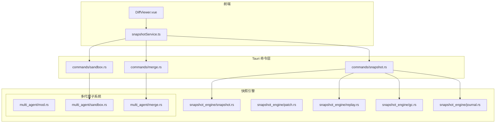
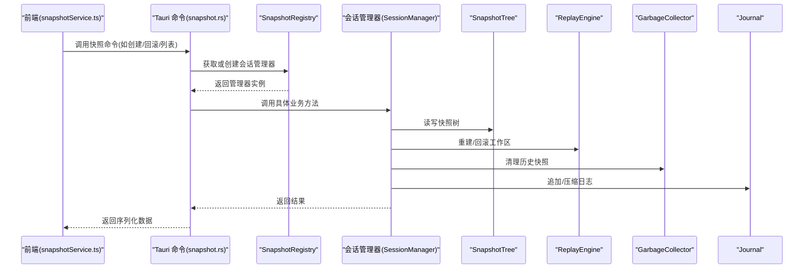
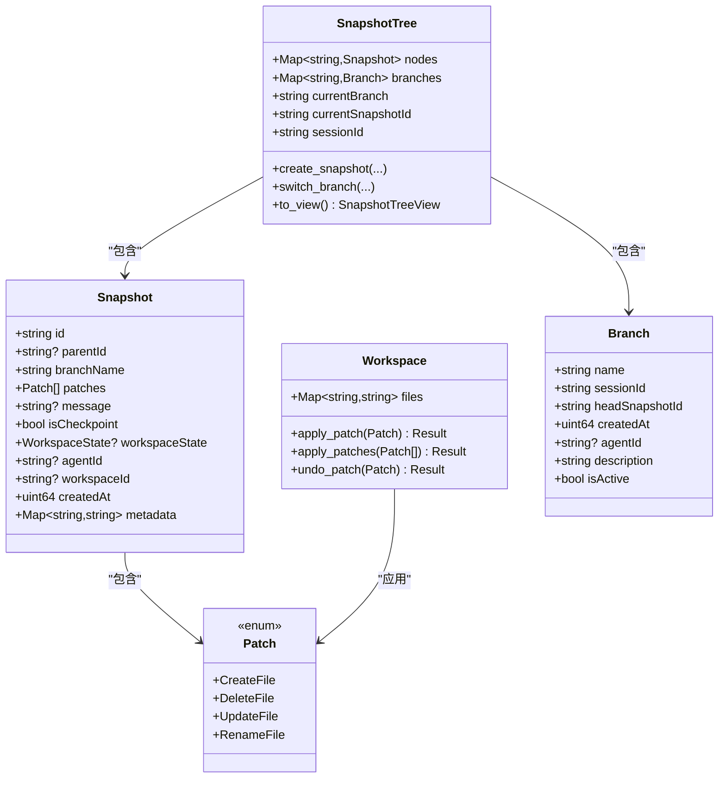
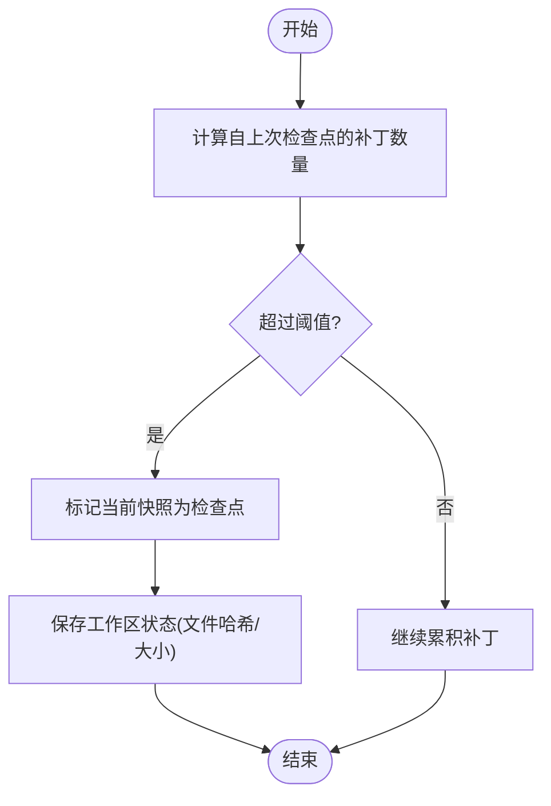
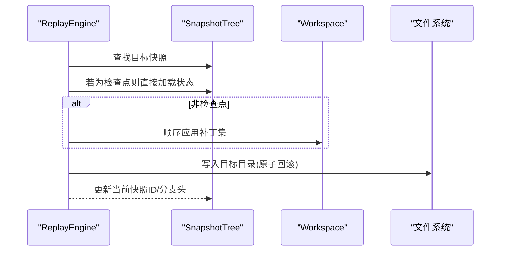
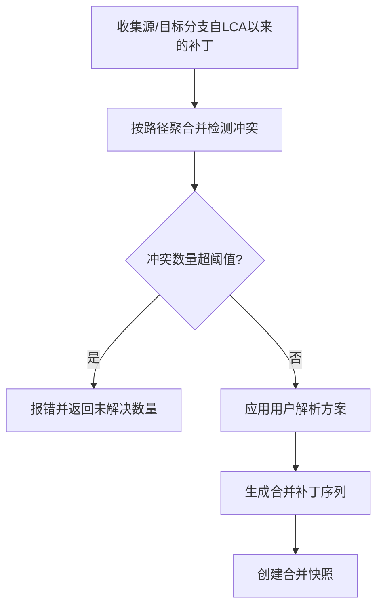
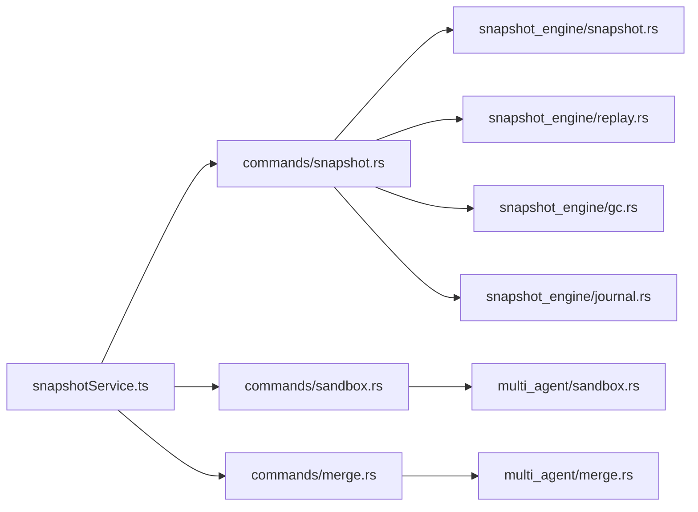

# 快照管理命令

<cite>
**本文引用的文件**
- [src-tauri/src/core/commands/snapshot.rs](file://src-tauri/src/core/commands/snapshot.rs)
- [src-tauri/src/core/snapshot_engine/snapshot.rs](file://src-tauri/src/core/snapshot_engine/snapshot.rs)
- [src-tauri/src/core/snapshot_engine/patch.rs](file://src-tauri/src/core/snapshot_engine/patch.rs)
- [src-tauri/src/core/snapshot_engine/replay.rs](file://src-tauri/src/core/snapshot_engine/replay.rs)
- [src-tauri/src/core/snapshot_engine/gc.rs](file://src-tauri/src/core/snapshot_engine/gc.rs)
- [src-tauri/src/core/snapshot_engine/journal.rs](file://src-tauri/src/core/snapshot_engine/journal.rs)
- [src-tauri/src/core/snapshot_engine/multi_agent/mod.rs](file://src-tauri/src/core/snapshot_engine/multi_agent/mod.rs)
- [src-tauri/src/core/snapshot_engine/multi_agent/sandbox.rs](file://src-tauri/src/core/snapshot_engine/multi_agent/sandbox.rs)
- [src-tauri/src/core/snapshot_engine/multi_agent/merge.rs](file://src-tauri/src/core/snapshot_engine/multi_agent/merge.rs)
- [src-tauri/src/core/commands/sandbox.rs](file://src-tauri/src/core/commands/sandbox.rs)
- [src-tauri/src/core/commands/merge.rs](file://src-tauri/src/core/commands/merge.rs)
- [src/services/snapshotService.ts](file://src/services/snapshotService.ts)
- [src/components/snapshot/DiffViewer.vue](file://src/components/snapshot/DiffViewer.vue)
- [src/types/index.ts](file://src/types/index.ts)
</cite>

## 目录
1. [简介](#简介)
2. [项目结构](#项目结构)
3. [核心组件](#核心组件)
4. [架构总览](#架构总览)
5. [详细组件分析](#详细组件分析)
6. [依赖关系分析](#依赖关系分析)
7. [性能考虑](#性能考虑)
8. [故障排查指南](#故障排查指南)
9. [结论](#结论)
10. [附录](#附录)

## 简介
本文件为“快照管理命令”的详细 API 文档，覆盖快照生命周期中的所有关键操作：创建、列表、详情、树视图、分支管理、切换、回滚、垃圾回收、多代理沙箱与合并等。同时深入解析快照引擎架构、增量快照算法、内容存储与懒加载重建、快照压缩与日志归档策略、生命周期与冲突处理、验证机制、安全与性能优化、以及迁移流程。

## 项目结构
后端采用 Rust 实现，前端通过 Tauri 调用后端命令；快照引擎位于 core 层，命令层封装为 Tauri 命令，前端通过服务层调用这些命令。

**图表来源**
- [src-tauri/src/core/commands/snapshot.rs:1-108](file://src-tauri/src/core/commands/snapshot.rs#L1-L108)
- [src-tauri/src/core/commands/sandbox.rs:1-73](file://src-tauri/src/core/commands/sandbox.rs#L1-L73)
- [src-tauri/src/core/commands/merge.rs:1-39](file://src-tauri/src/core/commands/merge.rs#L1-L39)
- [src-tauri/src/core/snapshot_engine/snapshot.rs:1-425](file://src-tauri/src/core/snapshot_engine/snapshot.rs#L1-L425)
- [src-tauri/src/core/snapshot_engine/patch.rs:1-124](file://src-tauri/src/core/snapshot_engine/patch.rs#L1-L124)
- [src-tauri/src/core/snapshot_engine/replay.rs:1-344](file://src-tauri/src/core/snapshot_engine/replay.rs#L1-L344)
- [src-tauri/src/core/snapshot_engine/gc.rs:1-107](file://src-tauri/src/core/snapshot_engine/gc.rs#L1-L107)
- [src-tauri/src/core/snapshot_engine/journal.rs:1-157](file://src-tauri/src/core/snapshot_engine/journal.rs#L1-L157)
- [src-tauri/src/core/snapshot_engine/multi_agent/mod.rs:1-6](file://src-tauri/src/core/snapshot_engine/multi_agent/mod.rs#L1-L6)
- [src-tauri/src/core/snapshot_engine/multi_agent/sandbox.rs:1-248](file://src-tauri/src/core/snapshot_engine/multi_agent/sandbox.rs#L1-L248)
- [src-tauri/src/core/snapshot_engine/multi_agent/merge.rs:1-392](file://src-tauri/src/core/snapshot_engine/multi_agent/merge.rs#L1-L392)
- [src/services/snapshotService.ts:1-248](file://src/services/snapshotService.ts#L1-L248)
- [src/components/snapshot/DiffViewer.vue:1-265](file://src/components/snapshot/DiffViewer.vue#L1-L265)

**章节来源**
- [src-tauri/src/core/commands/snapshot.rs:1-108](file://src-tauri/src/core/commands/snapshot.rs#L1-L108)
- [src-tauri/src/core/commands/sandbox.rs:1-73](file://src-tauri/src/core/commands/sandbox.rs#L1-L73)
- [src-tauri/src/core/commands/merge.rs:1-39](file://src-tauri/src/core/commands/merge.rs#L1-L39)
- [src/services/snapshotService.ts:1-248](file://src/services/snapshotService.ts#L1-L248)

## 核心组件
- 快照数据模型与树结构：Snapshot、SnapshotTree、Branch、SnapshotTreeView、SnapshotSummary、Workspace、WorkspaceState、FileInfo
- 补丁模型与差异：Patch、TextDiff、DiffHunk、DiffLine、PatchSummary、PatchError
- 回放与重建：ReplayEngine、AtomicFileRollback、UndoEntry、UndoAction
- 垃圾回收：GarbageCollector、GcConfig、GcResult
- 日志与归档：Journal、JournalEntry
- 多代理沙箱：AgentSandbox、SandboxManager、SandboxComparison
- 合并引擎：MergeEngine、MergeResult、Conflict、ConflictResolution

**章节来源**
- [src-tauri/src/core/snapshot_engine/snapshot.rs:1-425](file://src-tauri/src/core/snapshot_engine/snapshot.rs#L1-L425)
- [src-tauri/src/core/snapshot_engine/patch.rs:1-124](file://src-tauri/src/core/snapshot_engine/patch.rs#L1-L124)
- [src-tauri/src/core/snapshot_engine/replay.rs:1-344](file://src-tauri/src/core/snapshot_engine/replay.rs#L1-L344)
- [src-tauri/src/core/snapshot_engine/gc.rs:1-107](file://src-tauri/src/core/snapshot_engine/gc.rs#L1-L107)
- [src-tauri/src/core/snapshot_engine/journal.rs:1-157](file://src-tauri/src/core/snapshot_engine/journal.rs#L1-L157)
- [src-tauri/src/core/snapshot_engine/multi_agent/sandbox.rs:1-248](file://src-tauri/src/core/snapshot_engine/multi_agent/sandbox.rs#L1-L248)
- [src-tauri/src/core/snapshot_engine/multi_agent/merge.rs:1-392](file://src-tauri/src/core/snapshot_engine/multi_agent/merge.rs#L1-L392)

## 架构总览
快照管理命令通过 Tauri 命令暴露给前端，命令层读取或写入 SnapshotRegistry 中的会话级快照管理器，后者协调 SnapshotTree、ReplayEngine、GarbageCollector、Journal 以及多代理子系统完成具体操作。

**图表来源**
- [src-tauri/src/core/commands/snapshot.rs:1-108](file://src-tauri/src/core/commands/snapshot.rs#L1-L108)
- [src-tauri/src/core/snapshot_engine/snapshot.rs:1-425](file://src-tauri/src/core/snapshot_engine/snapshot.rs#L1-L425)
- [src-tauri/src/core/snapshot_engine/replay.rs:1-344](file://src-tauri/src/core/snapshot_engine/replay.rs#L1-L344)
- [src-tauri/src/core/snapshot_engine/gc.rs:1-107](file://src-tauri/src/core/snapshot_engine/gc.rs#L1-L107)
- [src-tauri/src/core/snapshot_engine/journal.rs:1-157](file://src-tauri/src/core/snapshot_engine/journal.rs#L1-L157)
- [src/services/snapshotService.ts:1-248](file://src/services/snapshotService.ts#L1-L248)

## 详细组件分析

### 快照命令 API 定义
以下为后端暴露的快照相关命令及其参数与返回值概要（字段名与类型以 TypeScript 类型定义为准）：

- 创建快照
  - 名称: snapshot_create
  - 参数: sessionId, patches, message?, agentId?, workspaceId?
  - 返回: Snapshot
- 获取树视图
  - 名称: snapshot_get_tree_view
  - 参数: sessionId
  - 返回: SnapshotTreeView
- 获取摘要列表
  - 名称: snapshot_get_summaries
  - 参数: sessionId, snapshotIds[]
  - 返回: SnapshotSummary[]
- 获取快照详情
  - 名称: snapshot_get_detail
  - 参数: sessionId, snapshotId
  - 返回: Snapshot | null
- 创建分支
  - 名称: snapshot_create_branch
  - 参数: sessionId, branchName, fromSnapshotId?, agentId?, description?
  - 返回: void
- 切换分支
  - 名称: snapshot_switch_branch
  - 参数: sessionId, branchName
  - 返回: void
- 回滚到快照
  - 名称: snapshot_rollback
  - 参数: sessionId, snapshotId, targetDir
  - 返回: Workspace
- 列出快照
  - 名称: snapshot_list
  - 参数: sessionId, branchName?
  - 返回: Snapshot[]
- 列出分支
  - 名称: snapshot_list_branches
  - 参数: sessionId
  - 返回: Branch[]
- 获取当前分支与快照ID
  - 名称: snapshot_get_current
  - 参数: sessionId
  - 返回: [branchName, snapshotId]

前端服务层对上述命令进行封装，提供缓存与便捷调用。

**章节来源**
- [src-tauri/src/core/commands/snapshot.rs:1-108](file://src-tauri/src/core/commands/snapshot.rs#L1-L108)
- [src/services/snapshotService.ts:1-248](file://src/services/snapshotService.ts#L1-L248)
- [src/types/index.ts:224-317](file://src/types/index.ts#L224-L317)

### 快照引擎架构与数据模型
- 快照树 SnapshotTree：维护节点映射、分支映射、当前分支与当前快照ID，并支持从当前快照向上遍历构建树视图。
- 快照节点 Snapshot：包含父ID、分支名、补丁集合、消息、是否检查点、工作区状态、元信息等。
- 工作区 Workspace：以文件路径到内容的映射表示当前工作区状态，支持按补丁应用/撤销。
- 补丁 Patch：抽象文件增删改名操作，支持差异结构化表示。
- 分支 Branch：记录分支头快照ID、描述、是否激活等。
- 视图模型：SnapshotTreeView、BranchView、SnapshotNode、SnapshotSummary。

**图表来源**
- [src-tauri/src/core/snapshot_engine/snapshot.rs:1-425](file://src-tauri/src/core/snapshot_engine/snapshot.rs#L1-L425)
- [src-tauri/src/core/snapshot_engine/patch.rs:1-124](file://src-tauri/src/core/snapshot_engine/patch.rs#L1-L124)

**章节来源**
- [src-tauri/src/core/snapshot_engine/snapshot.rs:1-425](file://src-tauri/src/core/snapshot_engine/snapshot.rs#L1-L425)
- [src-tauri/src/core/snapshot_engine/patch.rs:1-124](file://src-tauri/src/core/snapshot_engine/patch.rs#L1-L124)

### 增量快照算法与检查点策略
- 增量存储：每个快照仅保存自父快照以来的补丁集合，避免重复存储完整文件内容。
- 检查点策略：当自上次检查点以来累计补丁数达到阈值时自动创建检查点，检查点包含完整工作区状态（文件哈希与大小），用于加速重建。
- 快照摘要：Snapshot.to_summary 将补丁转换为摘要，便于快速浏览。

**图表来源**
- [src-tauri/src/core/snapshot_engine/snapshot.rs:258-280](file://src-tauri/src/core/snapshot_engine/snapshot.rs#L258-L280)
- [src-tauri/src/core/snapshot_engine/snapshot.rs:218-256](file://src-tauri/src/core/snapshot_engine/snapshot.rs#L218-L256)

**章节来源**
- [src-tauri/src/core/snapshot_engine/snapshot.rs:258-280](file://src-tauri/src/core/snapshot_engine/snapshot.rs#L258-L280)
- [src-tauri/src/core/snapshot_engine/snapshot.rs:218-256](file://src-tauri/src/core/snapshot_engine/snapshot.rs#L218-L256)

### 内容存储与懒加载重建
- 内容存储：ReplayEngine 维护内容存储目录，检查点中文件内容以哈希命名存储，重建时按需加载。
- 懒加载重建：rebuild_workspace_lazy 基于最近公共祖先(LCA)计算需要撤销与重做的补丁，仅对必要部分进行应用/撤销，显著提升重建效率。
- 原子回滚：AtomicFileRollback 在目标目录执行原子性替换，先写入临时目录再批量移动，失败可保留原状。

**图表来源**
- [src-tauri/src/core/snapshot_engine/replay.rs:57-121](file://src-tauri/src/core/snapshot_engine/replay.rs#L57-L121)
- [src-tauri/src/core/snapshot_engine/replay.rs:123-149](file://src-tauri/src/core/snapshot_engine/replay.rs#L123-L149)
- [src-tauri/src/core/snapshot_engine/replay.rs:227-245](file://src-tauri/src/core/snapshot_engine/replay.rs#L227-L245)
- [src-tauri/src/core/snapshot_engine/replay.rs:248-343](file://src-tauri/src/core/snapshot_engine/replay.rs#L248-L343)

**章节来源**
- [src-tauri/src/core/snapshot_engine/replay.rs:57-121](file://src-tauri/src/core/snapshot_engine/replay.rs#L57-L121)
- [src-tauri/src/core/snapshot_engine/replay.rs:123-149](file://src-tauri/src/core/snapshot_engine/replay.rs#L123-L149)
- [src-tauri/src/core/snapshot_engine/replay.rs:227-245](file://src-tauri/src/core/snapshot_engine/replay.rs#L227-L245)
- [src-tauri/src/core/snapshot_engine/replay.rs:248-343](file://src-tauri/src/core/snapshot_engine/replay.rs#L248-L343)

### 快照压缩与日志归档
- 日志条目：Journal 记录创建快照、创建/切换/删除分支、紧凑化等事件。
- 紧凑化：当日志行数超过阈值时，将当前树状态写入紧凑格式文件，替代原始日志，减少 I/O 与启动重放成本。

**章节来源**
- [src-tauri/src/core/snapshot_engine/journal.rs:1-157](file://src-tauri/src/core/snapshot_engine/journal.rs#L1-L157)

### 垃圾回收与生命周期管理
- 保护集合：基于分支头快照向父链追溯，形成受保护ID集合，默认保留分支头。
- 清理条件：按年龄阈值判断是否删除；可选删除孤儿分支。
- 结果统计：移除快照数、分支数与释放空间。

**章节来源**
- [src-tauri/src/core/snapshot_engine/gc.rs:1-107](file://src-tauri/src/core/snapshot_engine/gc.rs#L1-L107)
- [src-tauri/src/core/snapshot_engine/snapshot.rs:390-409](file://src-tauri/src/core/snapshot_engine/snapshot.rs#L390-L409)

### 快照冲突处理与验证机制
- 冲突检测：基于路径与补丁类型判断冲突类型（双方修改、源删除/目标删除、双方创建、双方重命名等）。
- 自动/手动解决：部分冲突可自动保留某一方或双存；其余需人工指定解析方案。
- 解析执行：根据解析结果生成合并后的补丁序列，创建合并快照。

**图表来源**
- [src-tauri/src/core/snapshot_engine/multi_agent/merge.rs:71-111](file://src-tauri/src/core/snapshot_engine/multi_agent/merge.rs#L71-L111)
- [src-tauri/src/core/snapshot_engine/multi_agent/merge.rs:197-240](file://src-tauri/src/core/snapshot_engine/multi_agent/merge.rs#L197-L240)
- [src-tauri/src/core/snapshot_engine/multi_agent/merge.rs:283-300](file://src-tauri/src/core/snapshot_engine/multi_agent/merge.rs#L283-L300)
- [src-tauri/src/core/snapshot_engine/multi_agent/merge.rs:367-384](file://src-tauri/src/core/snapshot_engine/multi_agent/merge.rs#L367-L384)

**章节来源**
- [src-tauri/src/core/snapshot_engine/multi_agent/merge.rs:71-111](file://src-tauri/src/core/snapshot_engine/multi_agent/merge.rs#L71-L111)
- [src-tauri/src/core/snapshot_engine/multi_agent/merge.rs:197-240](file://src-tauri/src/core/snapshot_engine/multi_agent/merge.rs#L197-L240)
- [src-tauri/src/core/snapshot_engine/multi_agent/merge.rs:283-300](file://src-tauri/src/core/snapshot_engine/multi_agent/merge.rs#L283-L300)
- [src-tauri/src/core/snapshot_engine/multi_agent/merge.rs:367-384](file://src-tauri/src/core/snapshot_engine/multi_agent/merge.rs#L367-L384)

### 多代理沙箱与合并
- 沙箱管理：为不同 Agent 创建独立分支与工作区，支持完成、放弃与发布；提供沙箱对比统计。
- 合并流程：预览合并、获取冲突、执行合并并创建合并快照。

**章节来源**
- [src-tauri/src/core/snapshot_engine/multi_agent/sandbox.rs:75-126](file://src-tauri/src/core/snapshot_engine/multi_agent/sandbox.rs#L75-L126)
- [src-tauri/src/core/snapshot_engine/multi_agent/sandbox.rs:177-209](file://src-tauri/src/core/snapshot_engine/multi_agent/sandbox.rs#L177-L209)
- [src-tauri/src/core/snapshot_engine/multi_agent/merge.rs:113-145](file://src-tauri/src/core/snapshot_engine/multi_agent/merge.rs#L113-L145)
- [src-tauri/src/core/commands/sandbox.rs:1-73](file://src-tauri/src/core/commands/sandbox.rs#L1-L73)
- [src-tauri/src/core/commands/merge.rs:1-39](file://src-tauri/src/core/commands/merge.rs#L1-L39)

### 前端交互与差异展示
- 前端服务层：统一调用 Tauri 命令，提供树/摘要/详情缓存，简化 UI 使用。
- 差异展示：DiffViewer 支持创建、删除、更新、重命名四类补丁的可视化差异，统计新增/删除行数。

**章节来源**
- [src/services/snapshotService.ts:1-248](file://src/services/snapshotService.ts#L1-L248)
- [src/components/snapshot/DiffViewer.vue:1-265](file://src/components/snapshot/DiffViewer.vue#L1-L265)
- [src/types/index.ts:224-317](file://src/types/index.ts#L224-L317)

## 依赖关系分析

**图表来源**
- [src-tauri/src/core/commands/snapshot.rs:1-108](file://src-tauri/src/core/commands/snapshot.rs#L1-L108)
- [src-tauri/src/core/commands/sandbox.rs:1-73](file://src-tauri/src/core/commands/sandbox.rs#L1-L73)
- [src-tauri/src/core/commands/merge.rs:1-39](file://src-tauri/src/core/commands/merge.rs#L1-L39)
- [src-tauri/src/core/snapshot_engine/snapshot.rs:1-425](file://src-tauri/src/core/snapshot_engine/snapshot.rs#L1-L425)
- [src-tauri/src/core/snapshot_engine/replay.rs:1-344](file://src-tauri/src/core/snapshot_engine/replay.rs#L1-L344)
- [src-tauri/src/core/snapshot_engine/gc.rs:1-107](file://src-tauri/src/core/snapshot_engine/gc.rs#L1-L107)
- [src-tauri/src/core/snapshot_engine/journal.rs:1-157](file://src-tauri/src/core/snapshot_engine/journal.rs#L1-L157)
- [src-tauri/src/core/snapshot_engine/multi_agent/sandbox.rs:1-248](file://src-tauri/src/core/snapshot_engine/multi_agent/sandbox.rs#L1-L248)
- [src-tauri/src/core/snapshot_engine/multi_agent/merge.rs:1-392](file://src-tauri/src/core/snapshot_engine/multi_agent/merge.rs#L1-L392)
- [src/services/snapshotService.ts:1-248](file://src/services/snapshotService.ts#L1-L248)

**章节来源**
- [src-tauri/src/core/commands/snapshot.rs:1-108](file://src-tauri/src/core/commands/snapshot.rs#L1-L108)
- [src-tauri/src/core/commands/sandbox.rs:1-73](file://src-tauri/src/core/commands/sandbox.rs#L1-L73)
- [src-tauri/src/core/commands/merge.rs:1-39](file://src-tauri/src/core/commands/merge.rs#L1-L39)
- [src/services/snapshotService.ts:1-248](file://src/services/snapshotService.ts#L1-L248)

## 性能考虑
- 增量存储与检查点：仅存储补丁与必要文件哈希，降低存储与传输成本。
- 懒加载重建：基于 LCA 的撤销/重做，避免全量重建。
- 缓存策略：前端对树视图、摘要与详情进行缓存，减少重复请求。
- 日志紧凑化：定期归档日志，降低启动重放开销。
- 并发访问：命令层通过读写锁访问会话管理器，保证并发安全。

[本节为通用性能建议，不直接分析具体文件]

## 故障排查指南
- 快照回滚失败
  - 可能原因：目标目录权限不足、原子回滚阶段文件系统异常。
  - 排查步骤：确认目标目录存在且可写；查看回滚临时目录残留；检查 Undo 日志。
- 冲突过多导致合并失败
  - 可能原因：冲突数量超过阈值。
  - 排查步骤：使用预览接口查看冲突；逐项提供解析方案；分批合并。
- 垃圾回收误删
  - 可能原因：保护集合配置不当或孤儿分支误判。
  - 排查步骤：调整 GcConfig.keepBranchHeads；检查分支头快照是否存在。
- 日志过大影响启动
  - 可能原因：日志行数超过阈值。
  - 排查步骤：触发紧凑化；确认紧凑化成功并替换原日志文件。

**章节来源**
- [src-tauri/src/core/snapshot_engine/replay.rs:248-343](file://src-tauri/src/core/snapshot_engine/replay.rs#L248-L343)
- [src-tauri/src/core/snapshot_engine/multi_agent/merge.rs:48-58](file://src-tauri/src/core/snapshot_engine/multi_agent/merge.rs#L48-L58)
- [src-tauri/src/core/snapshot_engine/gc.rs:79-97](file://src-tauri/src/core/snapshot_engine/gc.rs#L79-L97)
- [src-tauri/src/core/snapshot_engine/journal.rs:102-151](file://src-tauri/src/core/snapshot_engine/journal.rs#L102-L151)

## 结论
该快照系统以增量补丁为核心，结合检查点与懒加载重建，在保证一致性的同时兼顾性能与可维护性。通过分支与多代理沙箱扩展，满足复杂协作场景下的快照管理需求；配合日志紧凑化与垃圾回收，实现长期演进的可持续性。

[本节为总结性内容，不直接分析具体文件]

## 附录

### 命令一览表
- 快照创建：snapshot_create
- 快照树视图：snapshot_get_tree_view
- 快照摘要：snapshot_get_summaries
- 快照详情：snapshot_get_detail
- 创建分支：snapshot_create_branch
- 切换分支：snapshot_switch_branch
- 回滚到快照：snapshot_rollback
- 快照列表：snapshot_list
- 分支列表：snapshot_list_branches
- 当前分支与快照：snapshot_get_current
- 沙箱创建：sandbox_create
- 沙箱获取：sandbox_get
- 沙箱列表：sandbox_list
- 完成沙箱：sandbox_complete
- 放弃沙箱：sandbox_abandon
- 发布沙箱：sandbox_publish
- 沙箱对比：sandbox_compare
- 合并预览：merge_preview
- 获取冲突：merge_get_conflicts
- 执行合并：merge_execute

**章节来源**
- [src-tauri/src/core/commands/snapshot.rs:1-108](file://src-tauri/src/core/commands/snapshot.rs#L1-L108)
- [src-tauri/src/core/commands/sandbox.rs:1-73](file://src-tauri/src/core/commands/sandbox.rs#L1-L73)
- [src-tauri/src/core/commands/merge.rs:1-39](file://src-tauri/src/core/commands/merge.rs#L1-L39)
- [src/services/snapshotService.ts:1-248](file://src/services/snapshotService.ts#L1-L248)