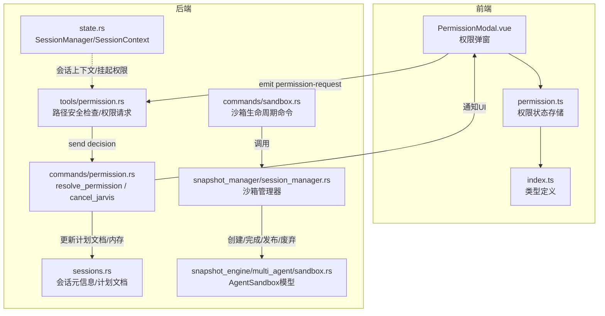
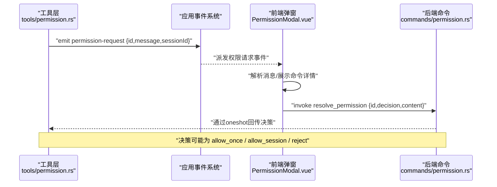
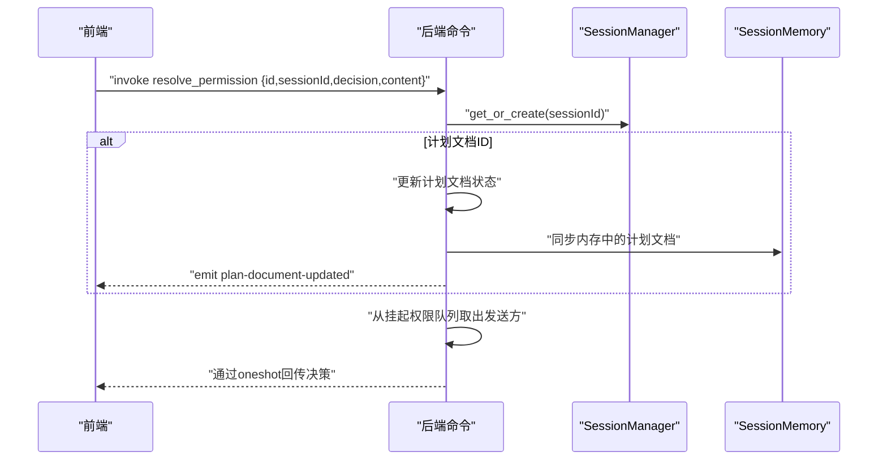
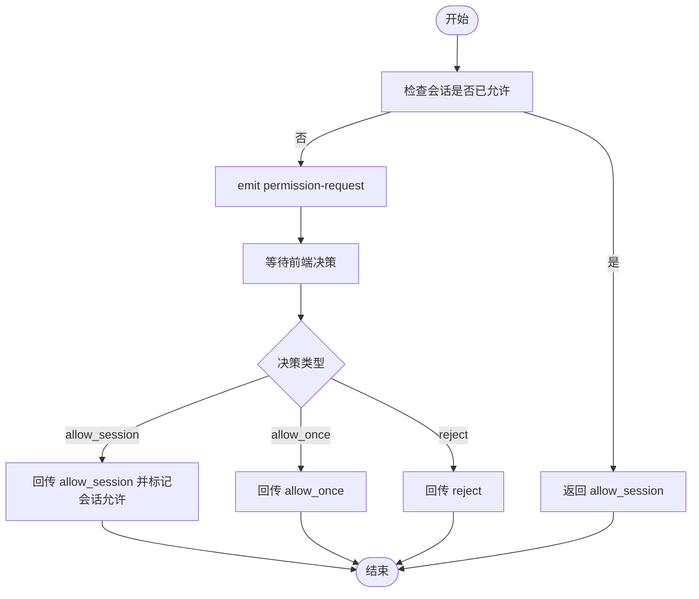
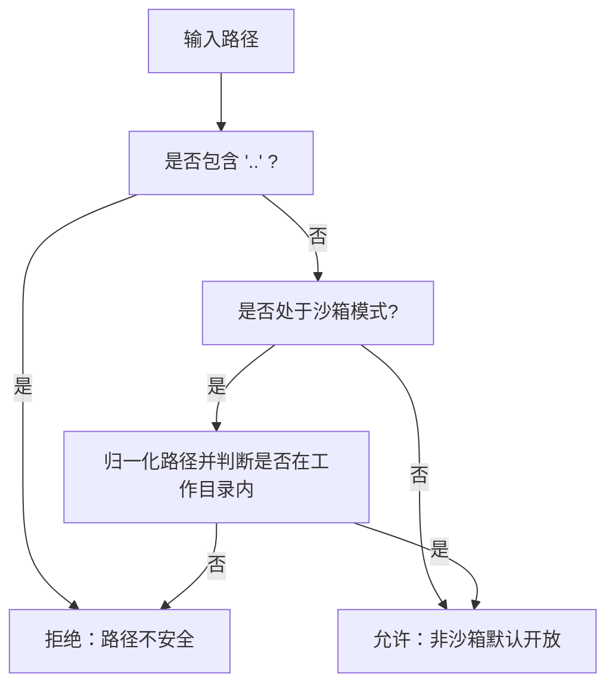
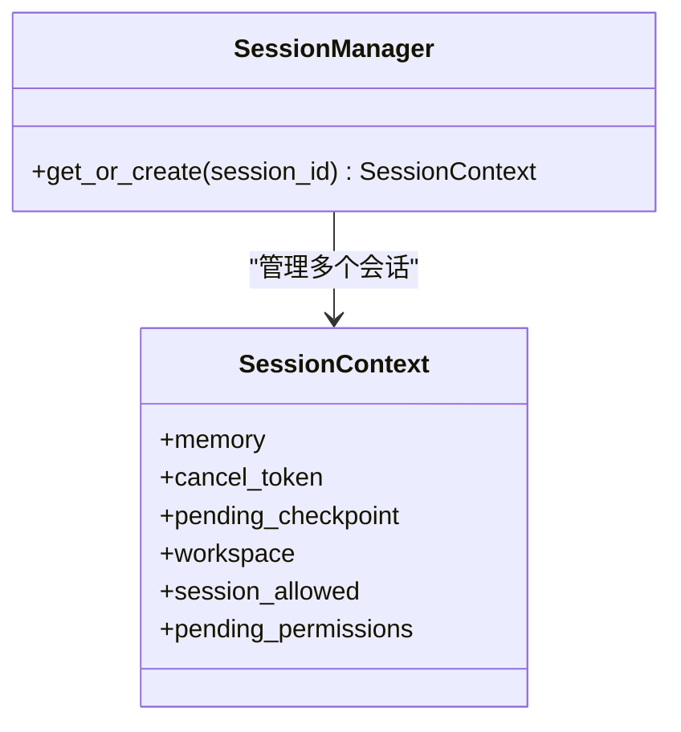
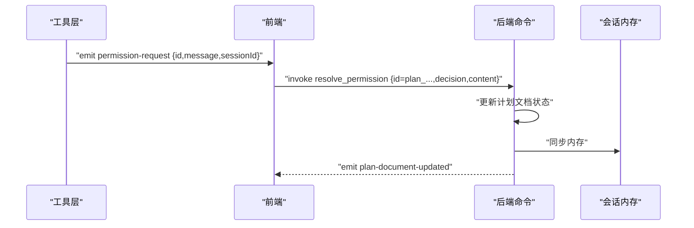
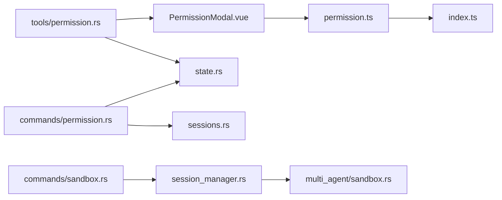

# 权限控制命令

<cite>
**本文引用的文件**
- [permission.rs](file://src-tauri/src/core/commands/permission.rs)
- [permission.rs](file://src-tauri/src/core/tools/permission.rs)
- [sandbox.rs](file://src-tauri/src/core/commands/sandbox.rs)
- [state.rs](file://src-tauri/src/core/state.rs)
- [default.json](file://src-tauri/capabilities/default.json)
- [PermissionModal.vue](file://src/components/common/PermissionModal.vue)
- [permission.ts](file://src/stores/permission.ts)
- [index.ts](file://src/types/index.ts)
- [sessions.rs](file://src-tauri/src/core/sessions.rs)
- [sandbox.rs](file://src-tauri/src/core/snapshot_engine/multi_agent/sandbox.rs)
- [session_manager.rs](file://src-tauri/src/core/snapshot_manager/session_manager.rs)
</cite>

## 目录
1. [简介](#简介)
2. [项目结构](#项目结构)
3. [核心组件](#核心组件)
4. [架构总览](#架构总览)
5. [详细组件分析](#详细组件分析)
6. [依赖关系分析](#依赖关系分析)
7. [性能考量](#性能考量)
8. [故障排查指南](#故障排查指南)
9. [结论](#结论)
10. [附录](#附录)

## 简介
本文件面向权限控制命令的开发者与使用者，系统性梳理权限相关的命令接口、权限级别定义、权限检查机制、沙箱权限控制与路径访问限制，并给出权限申请流程、审批机制、权限缓存策略的实现细节。同时提供权限配置示例、安全最佳实践以及权限绕过防护措施，帮助在保证功能可用的同时最大化系统安全性。

## 项目结构
权限控制涉及前后端协作：前端负责展示权限弹窗、接收用户决策；后端负责权限请求的触发、会话上下文管理、路径安全检查、沙箱边界控制与权限决策回传。

**图表来源**
- [PermissionModal.vue](file://src/components/common/PermissionModal.vue)
- [permission.ts](file://src/stores/permission.ts)
- [index.ts](file://src/types/index.ts)
- [permission.rs](file://src-tauri/src/core/commands/permission.rs)
- [permission.rs](file://src-tauri/src/core/tools/permission.rs)
- [state.rs](file://src-tauri/src/core/state.rs)
- [sessions.rs](file://src-tauri/src/core/sessions.rs)
- [sandbox.rs](file://src-tauri/src/core/commands/sandbox.rs)
- [sandbox.rs](file://src-tauri/src/core/snapshot_engine/multi_agent/sandbox.rs)
- [session_manager.rs](file://src-tauri/src/core/snapshot_manager/session_manager.rs)

**章节来源**
- [PermissionModal.vue](file://src/components/common/PermissionModal.vue)
- [permission.ts](file://src/stores/permission.ts)
- [index.ts](file://src/types/index.ts)
- [permission.rs](file://src-tauri/src/core/commands/permission.rs)
- [permission.rs](file://src-tauri/src/core/tools/permission.rs)
- [state.rs](file://src-tauri/src/core/state.rs)
- [sessions.rs](file://src-tauri/src/core/sessions.rs)
- [sandbox.rs](file://src-tauri/src/core/commands/sandbox.rs)
- [sandbox.rs](file://src-tauri/src/core/snapshot_engine/multi_agent/sandbox.rs)
- [session_manager.rs](file://src-tauri/src/core/snapshot_manager/session_manager.rs)

## 核心组件
- 权限命令
  - resolve_permission：处理权限请求的最终决策，支持对“计划文档”状态更新与内存同步，并向前端回传结果。
  - cancel_jarvis：取消会话，清理挂起的权限请求并广播取消事件。
- 权限工具
  - 路径安全检查：禁止路径遍历（如包含“..”），并在沙箱模式下强制边界校验。
  - 权限请求：通过事件系统向前端弹窗请求用户决策，支持一次性允许、本次会话始终允许等策略。
- 会话状态
  - SessionManager/SessionContext：维护每个会话的内存、取消令牌、挂起权限队列、工作目录与会话级允许标记。
- 沙箱命令
  - 沙箱生命周期：创建、获取、列出、完成、废弃、发布、比较。
- 类型与能力
  - 前端类型定义了权限请求、计划提案与文档等结构。
  - Tauri 能力配置声明了窗口与文件系统权限范围。

**章节来源**
- [permission.rs](file://src-tauri/src/core/commands/permission.rs)
- [permission.rs](file://src-tauri/src/core/tools/permission.rs)
- [state.rs](file://src-tauri/src/core/state.rs)
- [sandbox.rs](file://src-tauri/src/core/commands/sandbox.rs)
- [index.ts](file://src/types/index.ts)
- [default.json](file://src-tauri/capabilities/default.json)

## 架构总览
权限控制采用“后端触发、前端确认”的异步模式。后端在需要执行敏感操作时，通过工具函数发起权限请求，前端弹出确认框，用户选择后由后端命令回传决策，完成闭环。

**图表来源**
- [permission.rs](file://src-tauri/src/core/tools/permission.rs)
- [PermissionModal.vue](file://src/components/common/PermissionModal.vue)
- [permission.rs](file://src-tauri/src/core/commands/permission.rs)

## 详细组件分析

### 权限命令 API
- resolve_permission
  - 输入参数：请求ID、会话ID、决策（allow/allow_session/reject）、可选修改内容。
  - 功能：若ID以“plan_”开头，更新对应计划文档状态并同步到会话内存；从挂起权限队列取出发送方，回传决策字符串。
  - 返回：成功或错误字符串。
- cancel_jarvis
  - 输入参数：会话ID。
  - 功能：取消会话任务、广播取消事件；清空挂起权限并全部回传“reject”。

**图表来源**
- [permission.rs](file://src-tauri/src/core/commands/permission.rs)
- [state.rs](file://src-tauri/src/core/state.rs)
- [sessions.rs](file://src-tauri/src/core/sessions.rs)

**章节来源**
- [permission.rs](file://src-tauri/src/core/commands/permission.rs)

### 权限请求与决策流程
- 工具层请求权限
  - 若会话已被标记为允许，则直接返回“allow_session”。
  - 否则生成唯一请求ID，注册到挂起权限映射，通过事件系统向前端发送“permission-request”，等待前端决策。
- 前端弹窗与快捷键
  - 解析消息中的原因与命令内容，支持Markdown风格与冒号分隔两种模式。
  - 提供快捷键：A（允许一次）、S（本次会话允许）、R/Esc（拒绝）。
- 决策回传
  - 前端调用后端命令回传决策；若为“allow_session”，后端更新会话允许标记。

**图表来源**
- [permission.rs](file://src-tauri/src/core/tools/permission.rs)
- [PermissionModal.vue](file://src/components/common/PermissionModal.vue)
- [permission.ts](file://src/stores/permission.ts)

**章节来源**
- [permission.rs](file://src-tauri/src/core/tools/permission.rs)
- [PermissionModal.vue](file://src/components/common/PermissionModal.vue)
- [permission.ts](file://src/stores/permission.ts)

### 路径访问与沙箱权限控制
- 路径安全检查
  - 禁止包含“..”的路径遍历。
  - 在沙箱模式下（工作目录非空），对绝对或相对路径进行归一化并判断是否位于工作目录内。
- 沙箱边界
  - 沙箱会话拥有独立工作区，非沙箱会话默认允许更大范围访问。
  - 沙箱生命周期命令：创建、获取、列出、完成、废弃、发布、比较。

**图表来源**
- [permission.rs](file://src-tauri/src/core/tools/permission.rs)
- [sandbox.rs](file://src-tauri/src/core/commands/sandbox.rs)
- [session_manager.rs](file://src-tauri/src/core/snapshot_manager/session_manager.rs)

**章节来源**
- [permission.rs](file://src-tauri/src/core/tools/permission.rs)
- [sandbox.rs](file://src-tauri/src/core/commands/sandbox.rs)
- [session_manager.rs](file://src-tauri/src/core/snapshot_manager/session_manager.rs)

### 会话与权限缓存策略
- 会话上下文
  - 每个会话维护内存、取消令牌、挂起权限队列、工作目录与会话允许标记。
  - 通过SessionManager按需创建与复用，支持从磁盘加载会话元信息与工作目录。
- 权限缓存
  - “allow_session”决策会写入会话允许标记，后续同会话内请求可直接放行，减少重复弹窗。
  - 挂起权限使用HashMap按ID索引，决策完成后移除，避免内存泄漏。

**图表来源**
- [state.rs](file://src-tauri/src/core/state.rs)

**章节来源**
- [state.rs](file://src-tauri/src/core/state.rs)

### 计划文档与审批机制
- 计划文档
  - 支持状态：pending/approved/rejected；包含标题、内容、路径、时间戳等。
  - 前端存储与排序，后端命令在收到“plan_”ID时更新状态并同步到内存。
- 审批流程
  - 工具层请求权限，前端弹窗展示计划提案详情，用户批准或拒绝。
  - 后端命令回传决策并更新文档状态，同时向前端广播“plan-document-updated”。

**图表来源**
- [permission.rs](file://src-tauri/src/core/commands/permission.rs)
- [sessions.rs](file://src-tauri/src/core/sessions.rs)
- [index.ts](file://src/types/index.ts)

**章节来源**
- [permission.rs](file://src-tauri/src/core/commands/permission.rs)
- [sessions.rs](file://src-tauri/src/core/sessions.rs)
- [index.ts](file://src/types/index.ts)

### 权限级别定义与检查机制
- 权限级别
  - 读取（read）、写入（write）、执行（execute）、管理员（admin）等抽象级别在工具层与能力配置中体现。
  - 文件系统能力通过Tauri能力文件显式声明，如“fs:default”、“fs:allow-read-file”等。
- 检查机制
  - 路径安全检查优先于能力范围检查；沙箱模式下进一步限制工作区外访问。
  - 前端弹窗仅作为交互层，实际权限由后端工具层与能力配置共同决定。

**章节来源**
- [default.json](file://src-tauri/capabilities/default.json)
- [permission.rs](file://src-tauri/src/core/tools/permission.rs)

## 依赖关系分析
- 前端依赖
  - PermissionModal.vue 依赖权限状态存储与聊天状态，负责渲染与交互。
  - permission.ts 维护权限请求、计划提案与文档集合，提供计算属性与更新方法。
  - index.ts 定义权限请求、计划提案与文档的数据结构。
- 后端依赖
  - commands/permission.rs 依赖 state.rs 中的 SessionManager 与 sessions.rs 中的计划文档更新逻辑。
  - tools/permission.rs 依赖 state.rs 的会话上下文，使用事件系统与前端通信。
  - commands/sandbox.rs 依赖 snapshot_manager/session_manager.rs 与 snapshot_engine/multi_agent/sandbox.rs 实现沙箱生命周期管理。

**图表来源**
- [PermissionModal.vue](file://src/components/common/PermissionModal.vue)
- [permission.ts](file://src/stores/permission.ts)
- [index.ts](file://src/types/index.ts)
- [permission.rs](file://src-tauri/src/core/commands/permission.rs)
- [state.rs](file://src-tauri/src/core/state.rs)
- [sessions.rs](file://src-tauri/src/core/sessions.rs)
- [permission.rs](file://src-tauri/src/core/tools/permission.rs)
- [sandbox.rs](file://src-tauri/src/core/commands/sandbox.rs)
- [session_manager.rs](file://src-tauri/src/core/snapshot_manager/session_manager.rs)
- [sandbox.rs](file://src-tauri/src/core/snapshot_engine/multi_agent/sandbox.rs)

**章节来源**
- [PermissionModal.vue](file://src/components/common/PermissionModal.vue)
- [permission.ts](file://src/stores/permission.ts)
- [index.ts](file://src/types/index.ts)
- [permission.rs](file://src-tauri/src/core/commands/permission.rs)
- [state.rs](file://src-tauri/src/core/state.rs)
- [sessions.rs](file://src-tauri/src/core/sessions.rs)
- [permission.rs](file://src-tauri/src/core/tools/permission.rs)
- [sandbox.rs](file://src-tauri/src/core/commands/sandbox.rs)
- [session_manager.rs](file://src-tauri/src/core/snapshot_manager/session_manager.rs)
- [sandbox.rs](file://src-tauri/src/core/snapshot_engine/multi_agent/sandbox.rs)

## 性能考量
- 异步与事件驱动：权限请求采用oneshot通道与事件系统，避免阻塞主线程。
- 会话上下文缓存：SessionManager按需创建与复用，减少重复初始化成本。
- 路径检查轻量：归一化与前缀匹配为O(n)复杂度，适合高频调用场景。
- 沙箱操作：仅在需要时创建与保存，避免不必要的I/O。

## 故障排查指南
- 权限请求未弹窗
  - 检查工具层是否正确发出“permission-request”事件。
  - 确认前端是否监听该事件并显示弹窗。
- 决策未生效
  - 确认前端调用后端命令时携带正确的请求ID与决策。
  - 检查后端命令是否从挂起权限队列取出发送方并回传。
- 沙箱访问被拒绝
  - 确认路径是否包含“..”或超出工作目录范围。
  - 检查会话是否处于沙箱模式及工作目录配置。
- 会话取消无效
  - 确认后端命令是否正确取消令牌并清空挂起权限队列。

**章节来源**
- [permission.rs](file://src-tauri/src/core/tools/permission.rs)
- [permission.rs](file://src-tauri/src/core/commands/permission.rs)
- [state.rs](file://src-tauri/src/core/state.rs)

## 结论
本权限体系通过“后端触发、前端确认”的异步模式，结合路径安全检查、会话级允许标记与沙箱边界控制，实现了可控、可观测且可扩展的权限管理。配合能力配置与计划文档审批机制，既满足日常使用需求，又有效降低越权风险。

## 附录

### 权限命令一览
- resolve_permission
  - 作用：处理权限请求决策，更新计划文档状态并回传结果。
  - 参数：id、session_id、decision、content。
  - 返回：Result<(), String>。
- cancel_jarvis
  - 作用：取消会话，清理挂起权限并广播取消事件。
  - 参数：session_id。
  - 返回：Result<(), String>。

**章节来源**
- [permission.rs](file://src-tauri/src/core/commands/permission.rs)

### 沙箱命令一览
- sandbox_create
  - 作用：为指定会话与Agent创建沙箱。
  - 返回：AgentSandbox。
- sandbox_get
  - 作用：获取指定沙箱。
  - 返回：Option<AgentSandbox>。
- sandbox_list
  - 作用：列出会话下的所有沙箱。
  - 返回：Vec<AgentSandbox>。
- sandbox_complete
  - 作用：完成沙箱。
  - 返回：Result<(), String>。
- sandbox_abandon
  - 作用：废弃沙箱。
  - 返回：Result<(), String>。
- sandbox_publish
  - 作用：发布沙箱。
  - 返回：Result<String, String>。
- sandbox_compare
  - 作用：比较沙箱差异。
  - 返回：Result<Vec<SandboxComparison>, String>。

**章节来源**
- [sandbox.rs](file://src-tauri/src/core/commands/sandbox.rs)

### 权限配置示例
- 能力文件 default.json
  - 示例：声明主窗口的权限集合，包含窗口控制与文件系统读取能力。
  - 说明：根据需要增删能力项，严格遵循最小权限原则。

**章节来源**
- [default.json](file://src-tauri/capabilities/default.json)

### 安全最佳实践
- 最小权限：仅授予完成任务所需的最小能力集。
- 路径白名单：优先使用明确路径而非通配符，避免glob带来的不确定性。
- 沙箱隔离：对高风险操作启用沙箱，限制工作区外访问。
- 审计与日志：记录权限请求与决策，便于审计与回溯。
- 用户教育：通过清晰的弹窗提示与快捷键提升用户体验与安全意识。

### 权限绕过防护
- 路径遍历检测：严格禁止“..”出现在路径中。
- 归一化路径：统一处理相对路径与当前工作目录，避免歧义。
- 沙箱边界：在沙箱模式下强制边界校验，拒绝越界访问。
- 会话级允许：仅在用户明确授权后才缓存允许标记，避免默认放行。