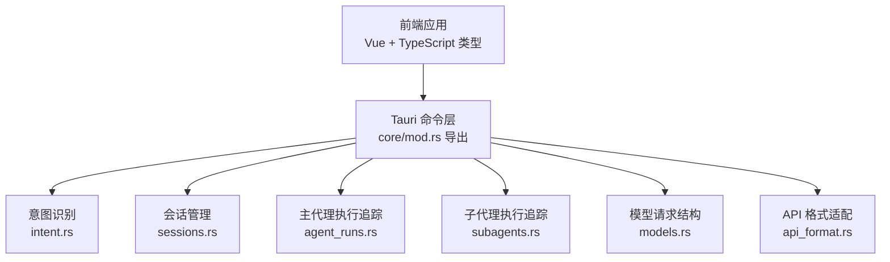
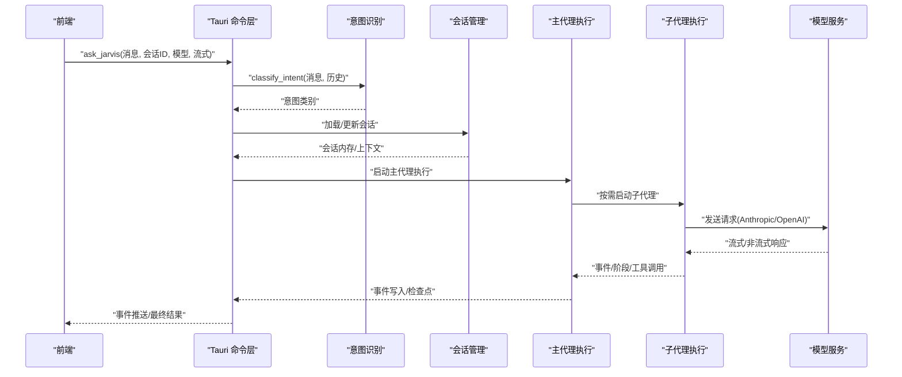
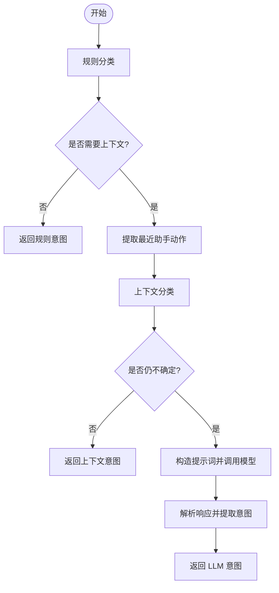
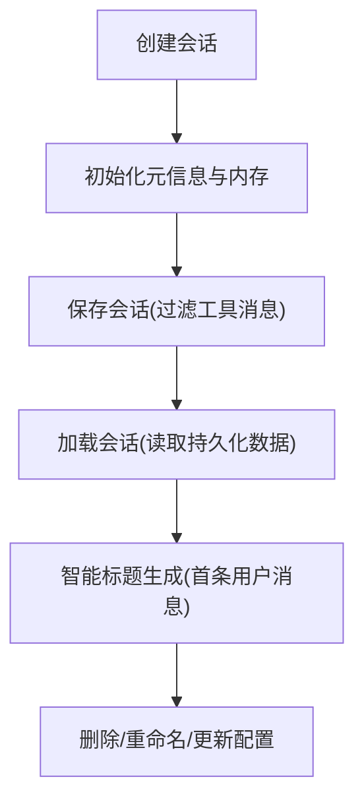
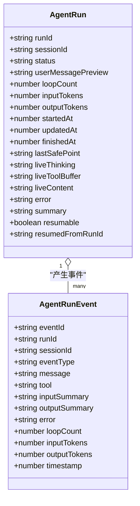
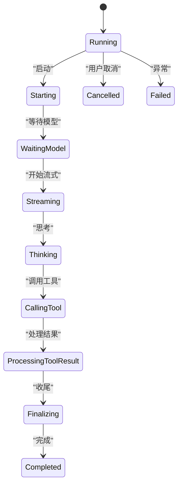
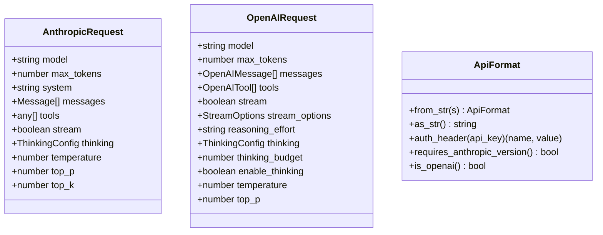
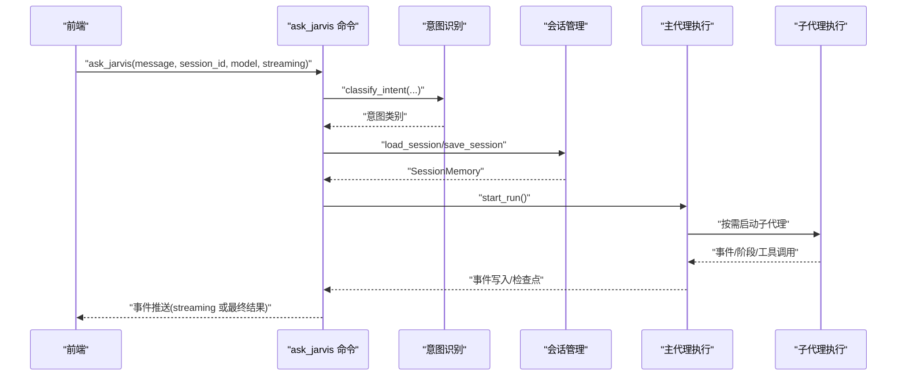
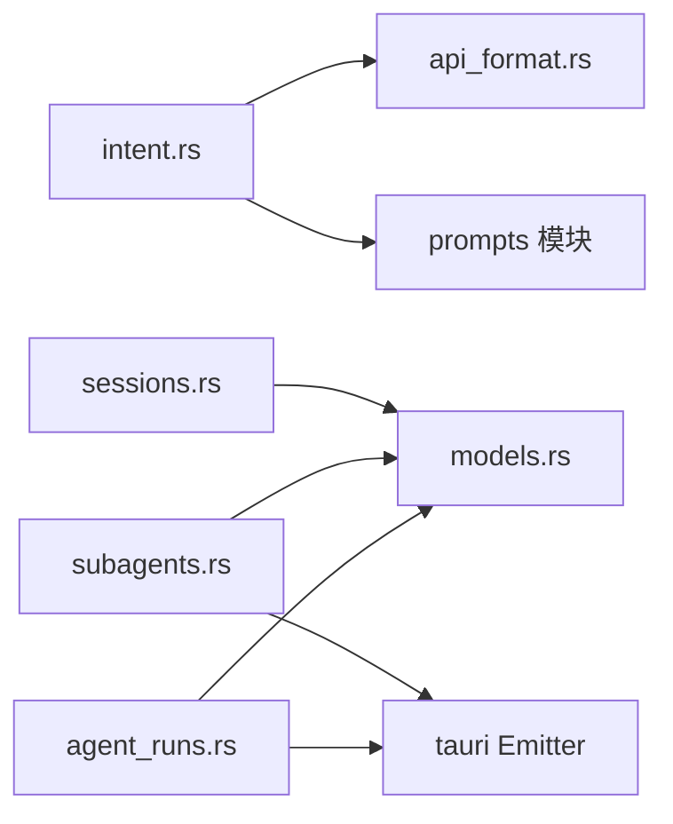

# 核心对话命令

<cite>
**本文引用的文件**
- [src-tauri/src/core/mod.rs](file://src-tauri/src/core/mod.rs)
- [src-tauri/src/core/models.rs](file://src-tauri/src/core/models.rs)
- [src-tauri/src/core/sessions.rs](file://src-tauri/src/core/sessions.rs)
- [src-tauri/src/core/intent.rs](file://src-tauri/src/core/intent.rs)
- [src-tauri/src/core/subagents.rs](file://src-tauri/src/core/subagents.rs)
- [src-tauri/src/core/agent_runs.rs](file://src-tauri/src/core/agent_runs.rs)
- [src-tauri/src/core/api_format.rs](file://src-tauri/src/core/api_format.rs)
- [src/types/index.ts](file://src/types/index.ts)
</cite>

## 目录
1. [简介](#简介)
2. [项目结构](#项目结构)
3. [核心组件](#核心组件)
4. [架构总览](#架构总览)
5. [详细组件分析](#详细组件分析)
6. [依赖关系分析](#依赖关系分析)
7. [性能考量](#性能考量)
8. [故障排查指南](#故障排查指南)
9. [结论](#结论)
10. [附录](#附录)

## 简介
本文件面向“核心对话命令”的完整 API 规范与实现解析，重点覆盖 ask_jarvis 等核心对话命令的参数结构、返回值格式、错误处理机制，并系统阐述对话流程：意图识别、模型选择、上下文构建、响应生成、状态更新。文档同时提供同步与异步调用示例、流式响应处理、错误恢复策略、对话状态管理、并发控制与性能优化建议。

## 项目结构
后端 Rust 核心位于 src-tauri/src/core 下，前端类型定义位于 src/types/index.ts。核心对话命令通过 Tauri 命令桥接前后端，后端负责意图识别、会话管理、子代理执行与事件追踪等。

**图表来源**
- [src-tauri/src/core/mod.rs:35-64](file://src-tauri/src/core/mod.rs#L35-L64)
- [src-tauri/src/core/intent.rs:1-228](file://src-tauri/src/core/intent.rs#L1-L228)
- [src-tauri/src/core/sessions.rs:1-499](file://src-tauri/src/core/sessions.rs#L1-L499)
- [src-tauri/src/core/agent_runs.rs:1-550](file://src-tauri/src/core/agent_runs.rs#L1-L550)
- [src-tauri/src/core/subagents.rs:1-666](file://src-tauri/src/core/subagents.rs#L1-L666)
- [src-tauri/src/core/models.rs:1-256](file://src-tauri/src/core/models.rs#L1-L256)
- [src-tauri/src/core/api_format.rs:1-93](file://src-tauri/src/core/api_format.rs#L1-L93)

**章节来源**
- [src-tauri/src/core/mod.rs:1-64](file://src-tauri/src/core/mod.rs#L1-L64)

## 核心组件
- 意图识别与分类：根据规则与上下文进行意图判定，必要时回退至 LLM 判定。
- 会话管理：创建、切换、删除、重命名、持久化与智能标题生成。
- 主代理执行追踪：记录主任务生命周期、事件流、检查点与恢复能力。
- 子代理执行追踪：多子代理并行/串行执行的状态、阶段、事件与取消控制。
- 模型请求结构与 API 格式：统一 Anthropic/OpenAI 请求体与认证头。
- 前端类型定义：对 AgentRun、SubAgentRun、AgentStep、JarvisResult 等进行 TypeScript 映射。

**章节来源**
- [src-tauri/src/core/intent.rs:5-228](file://src-tauri/src/core/intent.rs#L5-L228)
- [src-tauri/src/core/sessions.rs:162-499](file://src-tauri/src/core/sessions.rs#L162-L499)
- [src-tauri/src/core/agent_runs.rs:86-550](file://src-tauri/src/core/agent_runs.rs#L86-L550)
- [src-tauri/src/core/subagents.rs:116-666](file://src-tauri/src/core/subagents.rs#L116-L666)
- [src-tauri/src/core/models.rs:3-256](file://src-tauri/src/core/models.rs#L3-L256)
- [src-tauri/src/core/api_format.rs:1-93](file://src-tauri/src/core/api_format.rs#L1-L93)
- [src/types/index.ts:3-171](file://src/types/index.ts#L3-L171)

## 架构总览
核心对话命令的调用链路如下：前端发起 ask_jarvis 请求 → 后端意图识别与模型选择 → 上下文构建与消息序列化 → 流式/非流式响应生成 → 事件推送与状态更新 → 前端消费事件并渲染。

**图表来源**
- [src-tauri/src/core/mod.rs:35-64](file://src-tauri/src/core/mod.rs#L35-L64)
- [src-tauri/src/core/intent.rs:5-228](file://src-tauri/src/core/intent.rs#L5-L228)
- [src-tauri/src/core/sessions.rs:162-499](file://src-tauri/src/core/sessions.rs#L162-L499)
- [src-tauri/src/core/agent_runs.rs:86-550](file://src-tauri/src/core/agent_runs.rs#L86-L550)
- [src-tauri/src/core/subagents.rs:116-666](file://src-tauri/src/core/subagents.rs#L116-L666)
- [src-tauri/src/core/models.rs:20-140](file://src-tauri/src/core/models.rs#L20-L140)
- [src-tauri/src/core/api_format.rs:11-43](file://src-tauri/src/core/api_format.rs#L11-L43)

## 详细组件分析

### 组件一：意图识别与模型选择
- 输入
  - 消息文本、历史消息、API 密钥、基础地址、模型 ID、API 格式
- 处理逻辑
  - 规则优先：若规则可直接判定意图，则直接返回
  - 上下文增强：结合最近助手动作进行上下文分类
  - LLM 回退：若仍不确定，构造提示词并调用模型进行分类
- 输出
  - 意图类别字符串（如 CODE_WRITE、QUESTION、CHAT、DANGEROUS 等）

**图表来源**
- [src-tauri/src/core/intent.rs:5-228](file://src-tauri/src/core/intent.rs#L5-L228)

**章节来源**
- [src-tauri/src/core/intent.rs:5-228](file://src-tauri/src/core/intent.rs#L5-L228)

### 组件二：会话管理与上下文构建
- 会话生命周期
  - 创建：生成唯一会话 ID，初始化元信息与内存
  - 加载/保存：持久化消息（过滤工具消息），维护标题与令牌用量
  - 删除：清理会话文件与相关图片资源
  - 重命名：支持自动/手动标题来源标记
- 上下文构建
  - 会话内存包含消息列表、上下文片段、Agent 步骤与计划文档
  - 智能标题：从第一条用户消息提取前若干字符作为标题

**图表来源**
- [src-tauri/src/core/sessions.rs:192-499](file://src-tauri/src/core/sessions.rs#L192-L499)

**章节来源**
- [src-tauri/src/core/sessions.rs:162-499](file://src-tauri/src/core/sessions.rs#L162-L499)

### 组件三：主代理执行追踪（AgentRun）
- 关键字段
  - 运行 ID、会话 ID、状态、用户消息预览、循环次数、令牌用量、时间戳、摘要、可恢复性
- 事件流
  - start、thinking、content、tool_call、tool_result、checkpoint、complete、error、cancel、interrupted
- 检查点与恢复
  - 保存检查点（包含消息、令牌用量、最后安全点），支持恢复执行

**图表来源**
- [src-tauri/src/core/agent_runs.rs:25-84](file://src-tauri/src/core/agent_runs.rs#L25-L84)
- [src-tauri/src/core/agent_runs.rs:439-473](file://src-tauri/src/core/agent_runs.rs#L439-L473)

**章节来源**
- [src-tauri/src/core/agent_runs.rs:86-550](file://src-tauri/src/core/agent_runs.rs#L86-L550)

### 组件四：子代理执行追踪（SubAgentRun）
- 关键字段
  - 运行 ID、会话 ID、任务 ID、标签、只读标志、状态、阶段、循环次数、最大循环、当前工具、令牌用量、时间戳、错误与摘要
- 阶段与事件
  - Starting、WaitingModel、Streaming、Thinking、CallingTool、ProcessingToolResult、Finalizing
  - start、phase、tool_call、tool_result、complete、cancel、error
- 并发与取消
  - 使用取消令牌实现运行中取消，心跳保持状态更新

**图表来源**
- [src-tauri/src/core/subagents.rs:19-71](file://src-tauri/src/core/subagents.rs#L19-L71)
- [src-tauri/src/core/subagents.rs:200-377](file://src-tauri/src/core/subagents.rs#L200-L377)

**章节来源**
- [src-tauri/src/core/subagents.rs:116-666](file://src-tauri/src/core/subagents.rs#L116-L666)

### 组件五：模型请求结构与 API 格式
- 请求体
  - Anthropic：包含 model、max_tokens、system、messages、tools、stream、thinking、temperature、top_p、top_k
  - OpenAI：包含 model、max_tokens、messages、tools、stream、stream_options、reasoning_effort、thinking、thinking_budget、enable_thinking、temperature、top_p
- 认证与版本
  - Anthropic：使用 x-api-key，可设置 anthropic-version
  - OpenAI：使用 Authorization: Bearer
- 前端类型映射
  - JarvisResult、AgentStep、SubAgentRun、AgentRunEvent 等

**图表来源**
- [src-tauri/src/core/models.rs:20-140](file://src-tauri/src/core/models.rs#L20-L140)
- [src-tauri/src/core/api_format.rs:11-43](file://src-tauri/src/core/api_format.rs#L11-L43)

**章节来源**
- [src-tauri/src/core/models.rs:3-256](file://src-tauri/src/core/models.rs#L3-L256)
- [src-tauri/src/core/api_format.rs:1-93](file://src-tauri/src/core/api_format.rs#L1-L93)
- [src/types/index.ts:3-171](file://src/types/index.ts#L3-L171)

### 组件六：核心对话命令 ask_jarvis 接口规范
- 命令导出
  - ask_jarvis 在 core/mod.rs 中被导出，供 Tauri 命令层使用
- 参数结构
  - message: 用户输入文本或复杂内容块
  - session_id: 会话标识符
  - model: 模型名称
  - streaming: 是否启用流式响应
  - 其他：如 temperature、top_p、tools 等由具体实现决定
- 返回值格式
  - 同步：返回 JarvisResult（状态、内容、输入/会话输出令牌）
  - 异步：通过事件流推送 AgentRunEvent/SubAgentEvent，前端逐步渲染
- 错误处理
  - 意图识别失败默认返回 UNCLEAR
  - 会话不存在/保存失败抛出错误
  - 子代理运行失败/取消分别触发 error/cancel 事件
- 对话流程
  - 意图识别 → 模型选择 → 上下文构建 → 响应生成 → 事件推送 → 状态更新

**图表来源**
- [src-tauri/src/core/mod.rs:35-64](file://src-tauri/src/core/mod.rs#L35-L64)
- [src-tauri/src/core/intent.rs:5-228](file://src-tauri/src/core/intent.rs#L5-L228)
- [src-tauri/src/core/sessions.rs:367-499](file://src-tauri/src/core/sessions.rs#L367-L499)
- [src-tauri/src/core/agent_runs.rs:86-131](file://src-tauri/src/core/agent_runs.rs#L86-L131)
- [src-tauri/src/core/subagents.rs:116-177](file://src-tauri/src/core/subagents.rs#L116-L177)

**章节来源**
- [src-tauri/src/core/mod.rs:35-64](file://src-tauri/src/core/mod.rs#L35-L64)
- [src-tauri/src/core/models.rs:3-11](file://src-tauri/src/core/models.rs#L3-L11)
- [src/types/index.ts:3-171](file://src/types/index.ts#L3-L171)

## 依赖关系分析
- 模块耦合
  - intent.rs 依赖 api_format.rs 进行认证头与协议格式判断
  - agent_runs.rs 与 subagents.rs 通过事件系统与前端通信
  - sessions.rs 提供会话数据持久化，被 intent 与 agent_runs 复用
- 外部依赖
  - reqwest 用于 HTTP 请求
  - serde/serde_json 用于序列化/反序列化
  - tauri::Emitter 用于事件推送

**图表来源**
- [src-tauri/src/core/intent.rs:1-228](file://src-tauri/src/core/intent.rs#L1-L228)
- [src-tauri/src/core/api_format.rs:1-93](file://src-tauri/src/core/api_format.rs#L1-L93)
- [src-tauri/src/core/agent_runs.rs:1-550](file://src-tauri/src/core/agent_runs.rs#L1-L550)
- [src-tauri/src/core/subagents.rs:1-666](file://src-tauri/src/core/subagents.rs#L1-L666)
- [src-tauri/src/core/sessions.rs:1-499](file://src-tauri/src/core/sessions.rs#L1-L499)
- [src-tauri/src/core/models.rs:1-256](file://src-tauri/src/core/models.rs#L1-L256)

**章节来源**
- [src-tauri/src/core/intent.rs:1-228](file://src-tauri/src/core/intent.rs#L1-L228)
- [src-tauri/src/core/agent_runs.rs:1-550](file://src-tauri/src/core/agent_runs.rs#L1-L550)
- [src-tauri/src/core/subagents.rs:1-666](file://src-tauri/src/core/subagents.rs#L1-L666)
- [src-tauri/src/core/sessions.rs:1-499](file://src-tauri/src/core/sessions.rs#L1-L499)
- [src-tauri/src/core/models.rs:1-256](file://src-tauri/src/core/models.rs#L1-L256)
- [src-tauri/src/core/api_format.rs:1-93](file://src-tauri/src/core/api_format.rs#L1-L93)

## 性能考量
- 会话持久化
  - 过滤工具消息，仅保存有意义的对话内容，降低文件体积
  - 智能标题提取避免长消息开销
- 事件流
  - 限制事件缓冲数量（子代理事件最多 300 条），避免内存膨胀
  - 心跳机制定期更新运行状态，防止僵尸任务占用资源
- 模型调用
  - 优先规则分类减少 LLM 调用次数
  - 流式响应提升交互体验，减少前端等待时间
- 并发控制
  - 使用取消令牌与心跳保障子代理可中断与可观测
  - 主代理与子代理事件独立写入，降低锁竞争

[本节为通用性能建议，不直接分析具体文件]

## 故障排查指南
- 意图识别失败
  - 现象：返回 UNCLEAR
  - 处理：检查规则与上下文提取逻辑，必要时增加日志
- 会话加载/保存异常
  - 现象：会话不存在或保存失败
  - 处理：确认会话文件存在与权限，检查磁盘空间
- 子代理运行失败/取消
  - 现象：触发 error/cancel 事件
  - 处理：查看事件中的错误信息与摘要，必要时重新启动
- 流式响应中断
  - 现象：事件丢失或断流
  - 处理：检查网络与模型服务可用性，前端重连并恢复事件

**章节来源**
- [src-tauri/src/core/intent.rs:225-228](file://src-tauri/src/core/intent.rs#L225-L228)
- [src-tauri/src/core/sessions.rs:367-499](file://src-tauri/src/core/sessions.rs#L367-L499)
- [src-tauri/src/core/subagents.rs:341-432](file://src-tauri/src/core/subagents.rs#L341-L432)
- [src-tauri/src/core/agent_runs.rs:370-372](file://src-tauri/src/core/agent_runs.rs#L370-L372)

## 结论
核心对话命令以意图识别为入口，结合会话管理与主/子代理执行追踪，形成完整的对话生命周期闭环。通过统一的模型请求结构与 API 格式适配，以及事件驱动的异步处理，系统实现了高扩展性与可观测性。建议在生产环境中配合流式响应、事件缓冲与取消机制，确保用户体验与系统稳定性。

[本节为总结性内容，不直接分析具体文件]

## 附录

### API 定义与调用示例（概念性说明）
- 同步调用
  - 场景：简单问答、无需实时反馈
  - 流程：发送 ask_jarvis → 等待 JarvisResult → 渲染最终回答
- 异步调用
  - 场景：长文本生成、工具调用、多轮对话
  - 流程：发送 ask_jarvis → 订阅 agent-run-event/subagent-event → 实时渲染中间态与最终态
- 流式响应处理
  - 前端监听事件流，逐步拼接 live_content/live_thinking/live_tool_buffer
  - 出现工具调用时，显示工具名与输入摘要
- 错误恢复策略
  - 主代理中断：读取检查点并准备恢复执行
  - 子代理失败：记录错误摘要，允许用户重试或取消
  - 会话异常：重建会话或回滚到上一个安全点

[本节为概念性说明，不直接分析具体文件]