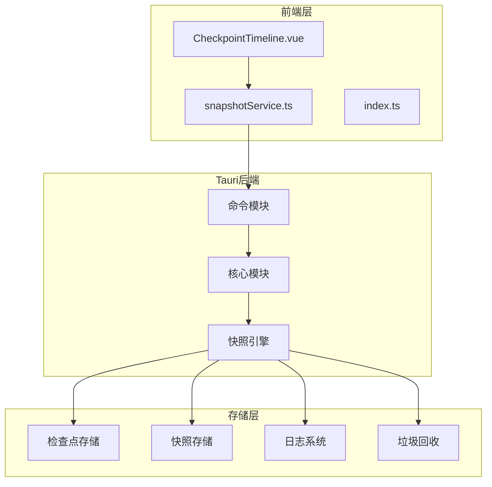
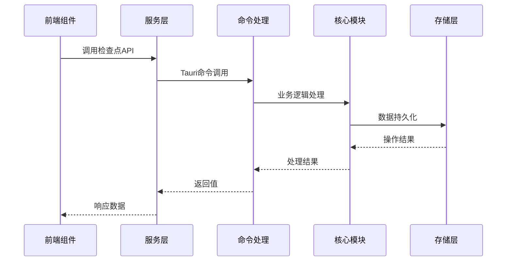
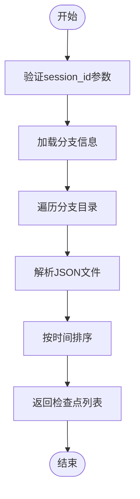
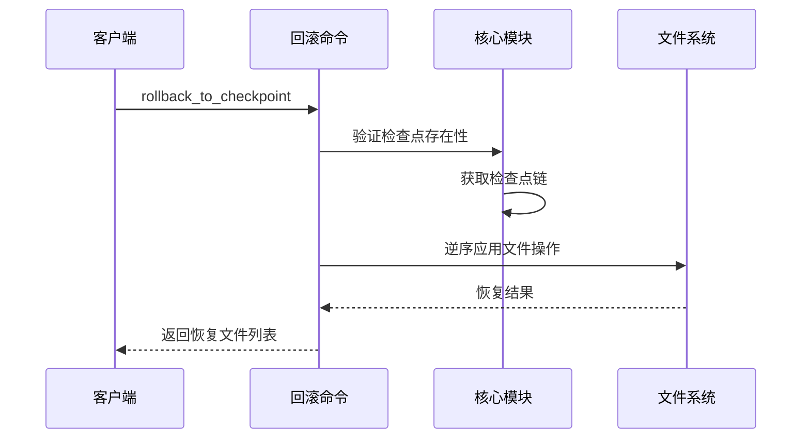
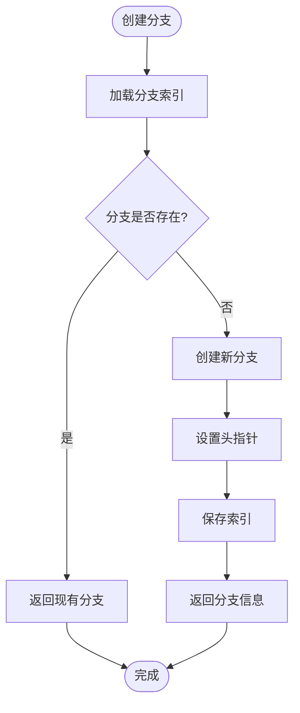
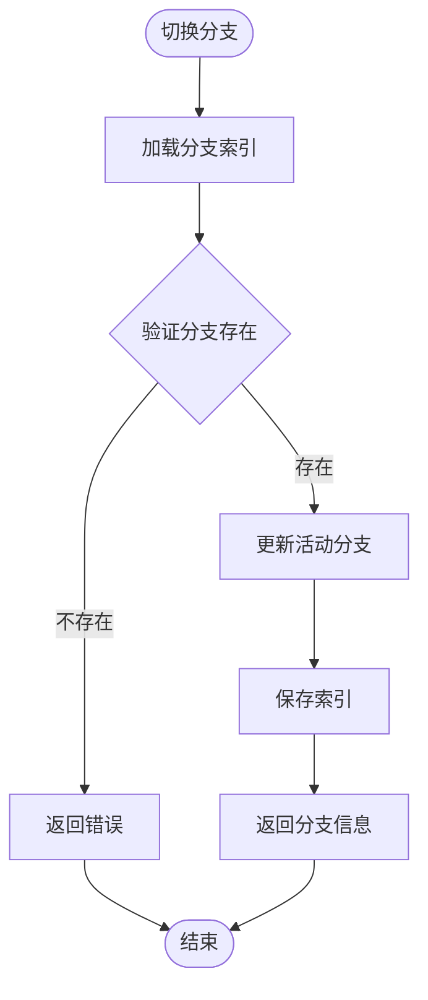
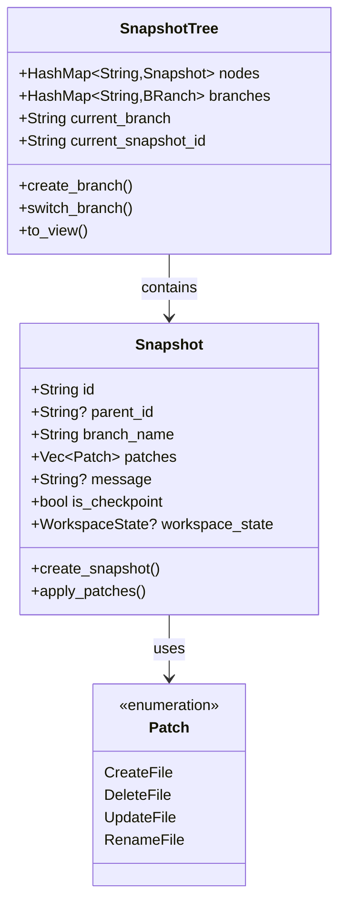
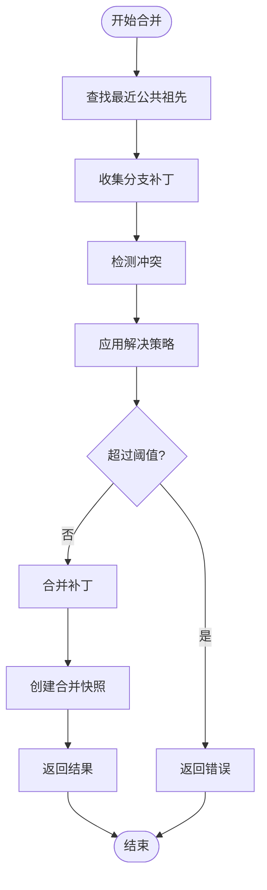
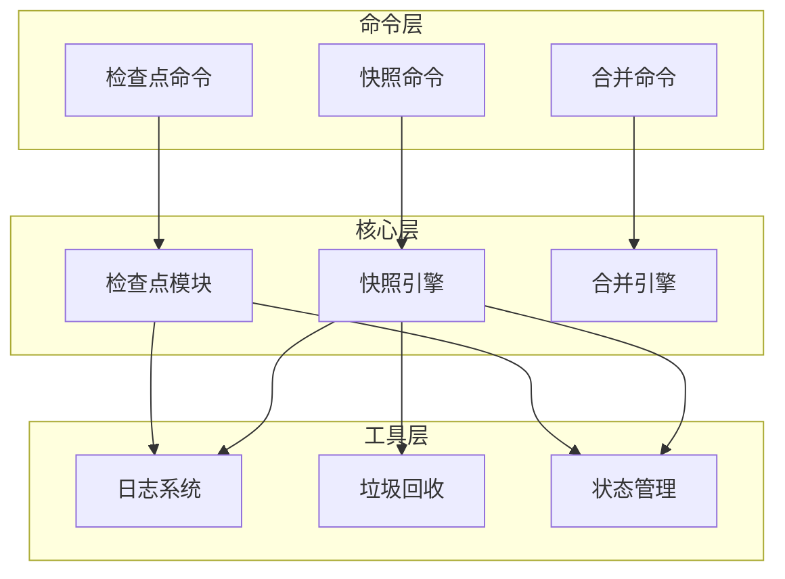

# 检查点与分支命令

<cite>
**本文档引用的文件**
- [checkpoint.rs](file://src-tauri/src/core/commands/checkpoint.rs)
- [checkpoint.rs（核心模块）](file://src-tauri/src/core/checkpoint.rs)
- [snapshot.rs（命令模块）](file://src-tauri/src/core/commands/snapshot.rs)
- [merge.rs（命令模块）](file://src-tauri/src/core/commands/merge.rs)
- [mod.rs（快照引擎模块）](file://src-tauri/src/core/snapshot_engine/mod.rs)
- [snapshot.rs（快照引擎）](file://src-tauri/src/core/snapshot_engine/snapshot.rs)
- [merge.rs（多代理合并）](file://src-tauri/src/core/snapshot_engine/multi_agent/merge.rs)
- [journal.rs（日志）](file://src-tauri/src/core/snapshot_engine/journal.rs)
- [gc.rs（垃圾回收）](file://src-tauri/src/core/snapshot_engine/gc.rs)
- [store.rs（存储）](file://src-tauri/src/core/snapshot_manager/store.rs)
- [state.rs（状态管理）](file://src-tauri/src/core/state.rs)
- [CheckpointTimeline.vue](file://src/components/checkpoint/CheckpointTimeline.vue)
- [snapshotService.ts](file://src/services/snapshotService.ts)
- [index.ts（类型定义）](file://src/types/index.ts)
</cite>

## 目录
1. [简介](#简介)
2. [项目结构](#项目结构)
3. [核心组件](#核心组件)
4. [架构概览](#架构概览)
5. [详细组件分析](#详细组件分析)
6. [依赖关系分析](#依赖关系分析)
7. [性能考虑](#性能考虑)
8. [故障排除指南](#故障排除指南)
9. [结论](#结论)

## 简介

本文档提供了JarvisAgent项目中检查点与分支管理命令的完整API文档。系统实现了两套并行的版本控制系统：

- **检查点系统（Checkpoint System）**：基于文件操作的细粒度版本控制，支持精确的文件变更跟踪和回滚
- **快照引擎（Snapshot Engine）**：基于补丁的高级版本控制，支持多智能体协作和智能合并

系统提供了完整的分支管理功能，包括分支创建、切换、合并、删除等操作，以及强大的冲突检测和自动合并策略。

## 项目结构

**图表来源**
- [checkpoint.rs:1-168](file://src-tauri/src/core/commands/checkpoint.rs#L1-L168)
- [snapshot.rs（命令模块）:1-108](file://src-tauri/src/core/commands/snapshot.rs#L1-L108)
- [checkpoint.rs（核心模块）:1-514](file://src-tauri/src/core/checkpoint.rs#L1-L514)

**章节来源**
- [checkpoint.rs:1-168](file://src-tauri/src/core/commands/checkpoint.rs#L1-L168)
- [snapshot.rs（命令模块）:1-108](file://src-tauri/src/core/commands/snapshot.rs#L1-L108)
- [checkpoint.rs（核心模块）:1-514](file://src-tauri/src/core/checkpoint.rs#L1-L514)

## 核心组件

### 检查点管理系统

检查点系统提供了基于文件操作的版本控制能力：

- **文件操作跟踪**：精确记录每个文件的编辑、写入、创建、删除、重命名操作
- **备份机制**：为每个文件变更创建内容哈希和备份文件
- **回滚功能**：支持精确到单个检查点的文件状态恢复

### 快照引擎

快照引擎提供了更高级的版本控制功能：

- **补丁系统**：基于补丁的增量变更记录
- **多智能体支持**：支持多个智能体在同一工作空间内的协作
- **智能合并**：自动冲突检测和解决策略
- **沙箱管理**：隔离的开发环境管理

### 分支管理

系统支持完整的分支生命周期管理：

- **分支创建**：从指定检查点或快照创建新分支
- **分支切换**：在不同分支间快速切换
- **分支合并**：智能的分支合并和冲突解决
- **分支删除**：安全的分支清理和资源释放

**章节来源**
- [checkpoint.rs（核心模块）:16-86](file://src-tauri/src/core/checkpoint.rs#L16-L86)
- [snapshot.rs（快照引擎）:6-100](file://src-tauri/src/core/snapshot_engine/snapshot.rs#L6-L100)
- [merge.rs（多代理合并）:5-47](file://src-tauri/src/core/snapshot_engine/multi_agent/merge.rs#L5-L47)

## 架构概览

**图表来源**
- [checkpoint.rs:4-168](file://src-tauri/src/core/commands/checkpoint.rs#L4-L168)
- [state.rs:17-78](file://src-tauri/src/core/state.rs#L17-L78)

系统采用分层架构设计，确保了良好的可维护性和扩展性。

## 详细组件分析

### 检查点命令API

#### 列出检查点

**图表来源**
- [checkpoint.rs:5-10](file://src-tauri/src/core/commands/checkpoint.rs#L5-L10)
- [checkpoint.rs（核心模块）:334-357](file://src-tauri/src/core/checkpoint.rs#L334-L357)

#### 回滚到检查点

**图表来源**
- [checkpoint.rs:20-88](file://src-tauri/src/core/commands/checkpoint.rs#L20-L88)
- [checkpoint.rs（核心模块）:455-500](file://src-tauri/src/core/checkpoint.rs#L455-L500)

#### 分支管理API

##### 创建分支

**图表来源**
- [checkpoint.rs:91-105](file://src-tauri/src/core/commands/checkpoint.rs#L91-L105)
- [checkpoint.rs（核心模块）:193-220](file://src-tauri/src/core/checkpoint.rs#L193-L220)

##### 分支切换

**图表来源**
- [checkpoint.rs:108-113](file://src-tauri/src/core/commands/checkpoint.rs#L108-L113)
- [checkpoint.rs（核心模块）:222-237](file://src-tauri/src/core/checkpoint.rs#L222-L237)

**章节来源**
- [checkpoint.rs:1-168](file://src-tauri/src/core/commands/checkpoint.rs#L1-L168)
- [checkpoint.rs（核心模块）:154-277](file://src-tauri/src/core/checkpoint.rs#L154-L277)

### 快照引擎API

#### 快照创建
快照引擎提供了更高级的版本控制能力：

**图表来源**
- [snapshot.rs（快照引擎）:6-47](file://src-tauri/src/core/snapshot_engine/snapshot.rs#L6-L47)
- [snapshot.rs（快照引擎）:218-256](file://src-tauri/src/core/snapshot_engine/snapshot.rs#L218-L256)

#### 分支合并

**图表来源**
- [merge.rs（多代理合并）:71-111](file://src-tauri/src/core/snapshot_engine/multi_agent/merge.rs#L71-L111)
- [merge.rs（命令模块）:5-39](file://src-tauri/src/core/commands/merge.rs#L5-L39)

**章节来源**
- [snapshot.rs（命令模块）:1-108](file://src-tauri/src/core/commands/snapshot.rs#L1-L108)
- [merge.rs（命令模块）:1-39](file://src-tauri/src/core/commands/merge.rs#L1-L39)
- [merge.rs（多代理合并）:64-392](file://src-tauri/src/core/snapshot_engine/multi_agent/merge.rs#L64-L392)

### 存储机制

#### 检查点存储
检查点系统采用文件系统存储：

- **目录结构**：`.checkpoints/{session_id}/{branch_name}/{checkpoint_id}.json`
- **备份机制**：每个文件变更创建内容哈希和备份文件
- **索引管理**：`branches.json`维护分支元数据

#### 快照存储
快照引擎采用更复杂的存储策略：

- **树形结构**：内存中的SnapshotTree对象
- **持久化**：定期将树结构序列化到磁盘
- **压缩机制**：支持日志压缩以优化存储空间

**章节来源**
- [checkpoint.rs（核心模块）:89-127](file://src-tauri/src/core/checkpoint.rs#L89-L127)
- [store.rs（存储）:13-76](file://src-tauri/src/core/snapshot_manager/store.rs#L13-L76)

## 依赖关系分析

**图表来源**
- [checkpoint.rs:1-168](file://src-tauri/src/core/commands/checkpoint.rs#L1-L168)
- [snapshot.rs（命令模块）:1-108](file://src-tauri/src/core/commands/snapshot.rs#L1-L108)
- [merge.rs（命令模块）:1-39](file://src-tauri/src/core/commands/merge.rs#L1-L39)

系统采用松耦合设计，各模块通过清晰的接口进行交互，便于独立测试和维护。

**章节来源**
- [mod.rs（快照引擎模块）:1-14](file://src-tauri/src/core/snapshot_engine/mod.rs#L1-L14)
- [state.rs:1-78](file://src-tauri/src/core/state.rs#L1-L78)

## 性能考虑

### 存储优化

1. **检查点压缩**：系统实现了基于时间戳的检查点压缩策略，避免过多的检查点文件占用磁盘空间。

2. **缓存机制**：前端和服务层都实现了智能缓存，减少重复的数据请求。

3. **增量更新**：快照引擎使用补丁系统，只存储变更内容而非完整文件副本。

### 并发处理

1. **异步操作**：所有文件操作都是异步执行，避免阻塞主线程。

2. **锁机制**：使用Tokio的RwLock确保并发访问的安全性。

3. **会话隔离**：每个会话都有独立的状态上下文，避免相互影响。

### 内存管理

1. **垃圾回收**：快照引擎内置垃圾回收机制，自动清理过期的快照和分支。

2. **配置化**：GC策略可通过配置调整，平衡存储空间和性能需求。

**章节来源**
- [journal.rs（日志）:7-157](file://src-tauri/src/core/snapshot_engine/journal.rs#L7-L157)
- [gc.rs（垃圾回收）:30-98](file://src-tauri/src/core/snapshot_engine/gc.rs#L30-L98)
- [state.rs:44-78](file://src-tauri/src/core/state.rs#L44-L78)

## 故障排除指南

### 常见问题及解决方案

#### 检查点回滚失败
**症状**：回滚操作抛出异常
**可能原因**：
- 目标检查点不存在
- 文件权限不足
- 备份文件损坏

**解决方案**：
1. 验证检查点ID的有效性
2. 检查文件系统权限
3. 重新生成备份文件

#### 分支切换异常
**症状**：分支切换后数据不一致
**可能原因**：
- 活跃分支索引损坏
- 分支头指针指向无效快照

**解决方案**：
1. 重建分支索引文件
2. 重新设置分支头指针

#### 合并冲突过多
**症状**：自动合并失败，冲突数量超过阈值
**可能原因**：
- 冲突检测阈值设置过低
- 分支变更过于复杂

**解决方案**：
1. 调整冲突阈值配置
2. 手动解决部分冲突后重试

### 调试工具

系统提供了多种调试和监控工具：

1. **检查点树视图**：可视化显示所有检查点和分支关系
2. **操作日志**：详细记录所有文件操作和系统事件
3. **性能监控**：跟踪存储使用情况和操作耗时

**章节来源**
- [CheckpointTimeline.vue:27-136](file://src/components/checkpoint/CheckpointTimeline.vue#L27-L136)
- [snapshotService.ts:14-248](file://src/services/snapshotService.ts#L14-L248)

## 结论

JarvisAgent的检查点与分支管理系统提供了企业级的版本控制能力，具有以下优势：

1. **双轨制架构**：同时支持细粒度的检查点系统和高级的快照引擎
2. **智能合并**：先进的冲突检测和自动解决机制
3. **安全性**：完善的权限控制和数据保护措施
4. **可扩展性**：模块化的架构设计便于功能扩展

系统适用于复杂的AI开发场景，能够有效管理多智能体协作过程中的代码变更和知识演进。通过合理的配置和最佳实践，可以实现高效的版本控制和团队协作。