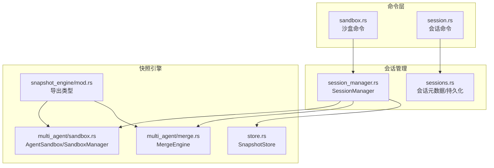
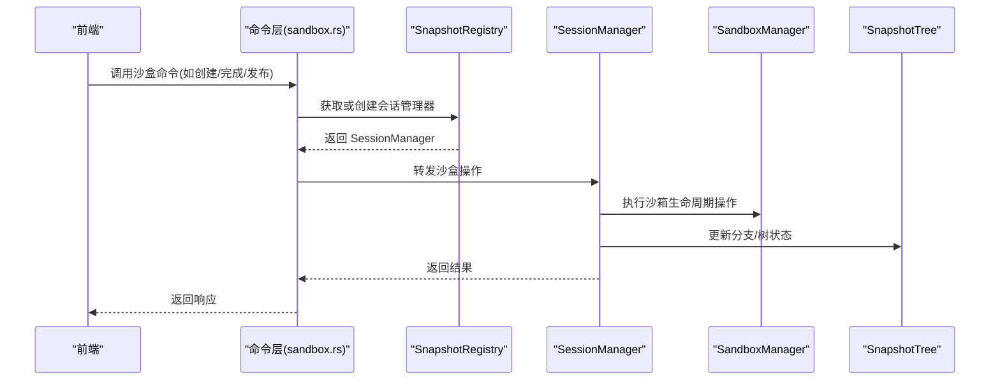
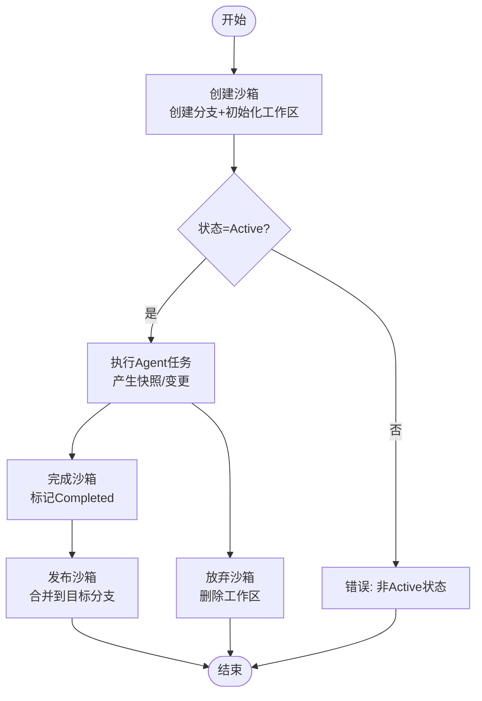
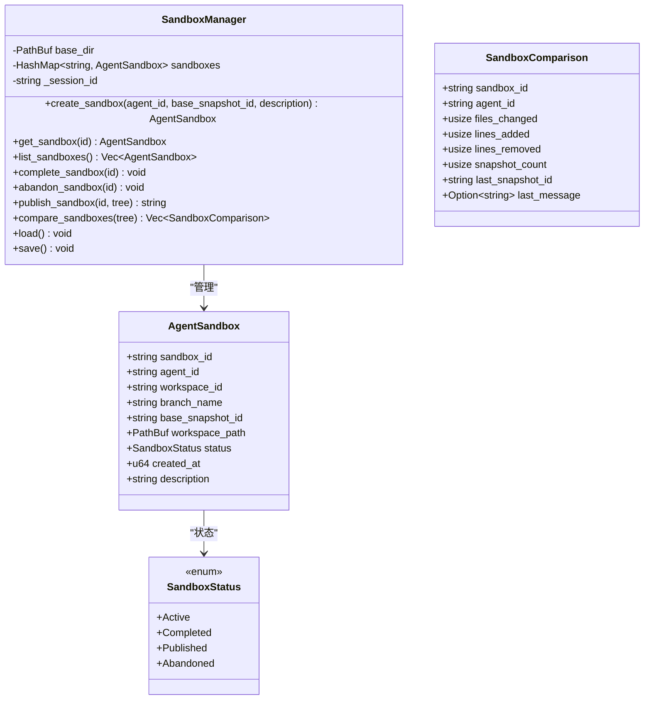
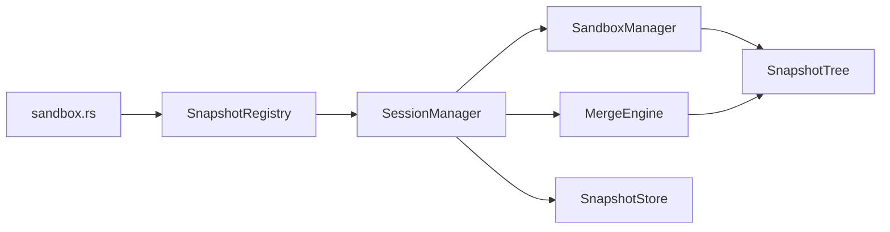

# 沙盒会话命令

<cite>
**本文引用的文件**
- [src-tauri/src/core/commands/sandbox.rs](file://src-tauri/src/core/commands/sandbox.rs)
- [src-tauri/src/core/commands/session.rs](file://src-tauri/src/core/commands/session.rs)
- [src-tauri/src/core/sessions.rs](file://src-tauri/src/core/sessions.rs)
- [src-tauri/src/core/snapshot_engine/multi_agent/sandbox.rs](file://src-tauri/src/core/snapshot_engine/multi_agent/sandbox.rs)
- [src-tauri/src/core/snapshot_engine/mod.rs](file://src-tauri/src/core/snapshot_engine/mod.rs)
- [src-tauri/src/core/snapshot_engine/multi_agent/merge.rs](file://src-tauri/src/core/snapshot_engine/multi_agent/merge.rs)
- [src-tauri/src/core/snapshot_manager/session_manager.rs](file://src-tauri/src/core/snapshot_manager/session_manager.rs)
- [src-tauri/src/core/snapshot_manager/store.rs](file://src-tauri/src/core/snapshot_manager/store.rs)
- [src-tauri/Cargo.toml](file://src-tauri/Cargo.toml)
</cite>

## 目录
1. [简介](#简介)
2. [项目结构](#项目结构)
3. [核心组件](#核心组件)
4. [架构总览](#架构总览)
5. [详细组件分析](#详细组件分析)
6. [依赖关系分析](#依赖关系分析)
7. [性能考量](#性能考量)
8. [故障排查指南](#故障排查指南)
9. [结论](#结论)
10. [附录](#附录)

## 简介
本文件面向“沙盒会话管理命令”的使用者与维护者，系统性梳理沙盒相关的命令接口、数据模型、生命周期管理、隔离与安全控制、资源限制策略、权限与网络访问控制、性能监控与资源统计、故障恢复与审计等主题。文档以代码为依据，结合可视化图示帮助读者快速理解并正确使用沙盒能力。

## 项目结构
围绕沙盒会话管理的关键模块分布如下：
- 命令层：提供对外暴露的 Tauri 命令，封装对会话与沙盒的调用
- 会话管理层：负责会话的创建、切换、删除、重命名、工作目录等
- 快照引擎：提供快照树、补丁、回放、合并等能力
- 多智能体沙箱：定义 AgentSandbox、SandboxManager、SandboxStatus、SandboxComparison 等
- 存储层：负责快照与树的持久化
- 合并引擎：提供分支合并、冲突检测与解决策略

图表来源
- [src-tauri/src/core/commands/sandbox.rs:1-73](file://src-tauri/src/core/commands/sandbox.rs#L1-L73)
- [src-tauri/src/core/commands/session.rs:1-334](file://src-tauri/src/core/commands/session.rs#L1-L334)
- [src-tauri/src/core/sessions.rs:1-499](file://src-tauri/src/core/sessions.rs#L1-L499)
- [src-tauri/src/core/snapshot_engine/mod.rs:1-14](file://src-tauri/src/core/snapshot_engine/mod.rs#L1-L14)
- [src-tauri/src/core/snapshot_engine/multi_agent/sandbox.rs:1-248](file://src-tauri/src/core/snapshot_engine/multi_agent/sandbox.rs#L1-L248)
- [src-tauri/src/core/snapshot_engine/multi_agent/merge.rs:1-392](file://src-tauri/src/core/snapshot_engine/multi_agent/merge.rs#L1-L392)
- [src-tauri/src/core/snapshot_manager/session_manager.rs:1-409](file://src-tauri/src/core/snapshot_manager/session_manager.rs#L1-L409)
- [src-tauri/src/core/snapshot_manager/store.rs:1-104](file://src-tauri/src/core/snapshot_manager/store.rs#L1-L104)

章节来源
- [src-tauri/src/core/commands/sandbox.rs:1-73](file://src-tauri/src/core/commands/sandbox.rs#L1-L73)
- [src-tauri/src/core/commands/session.rs:1-334](file://src-tauri/src/core/commands/session.rs#L1-L334)
- [src-tauri/src/core/sessions.rs:1-499](file://src-tauri/src/core/sessions.rs#L1-L499)
- [src-tauri/src/core/snapshot_engine/mod.rs:1-14](file://src-tauri/src/core/snapshot_engine/mod.rs#L1-L14)
- [src-tauri/src/core/snapshot_engine/multi_agent/sandbox.rs:1-248](file://src-tauri/src/core/snapshot_engine/multi_agent/sandbox.rs#L1-L248)
- [src-tauri/src/core/snapshot_engine/multi_agent/merge.rs:1-392](file://src-tauri/src/core/snapshot_engine/multi_agent/merge.rs#L1-L392)
- [src-tauri/src/core/snapshot_manager/session_manager.rs:1-409](file://src-tauri/src/core/snapshot_manager/session_manager.rs#L1-L409)
- [src-tauri/src/core/snapshot_manager/store.rs:1-104](file://src-tauri/src/core/snapshot_manager/store.rs#L1-L104)

## 核心组件
- 沙盒数据模型
  - AgentSandbox：包含沙箱标识、所属 Agent、工作空间、分支名、基线快照、工作区路径、状态、创建时间、描述
  - SandboxStatus：Active、Completed、Published、Abandoned
  - SandboxComparison：变更文件数、新增/删除行数、快照数量、最新快照ID、最后消息摘要
- 沙盒管理器
  - SandboxManager：负责沙箱的创建、查询、列举、完成、放弃、发布、比较、加载/保存索引
- 会话与工作目录
  - SessionMeta：包含会话级工作目录 working_directory 字段，None 表示无限制
- 合并引擎
  - MergeEngine：提供分支预览合并、实际合并、冲突检测与自动/手动解决策略
- 存储与会话管理
  - SnapshotStore：按分支持久化快照，保存树
  - SessionManager：聚合快照树、日志、回放引擎、沙盒管理器、合并引擎；提供沙盒生命周期方法

章节来源
- [src-tauri/src/core/snapshot_engine/multi_agent/sandbox.rs:8-58](file://src-tauri/src/core/snapshot_engine/multi_agent/sandbox.rs#L8-L58)
- [src-tauri/src/core/sessions.rs:55-77](file://src-tauri/src/core/sessions.rs#L55-L77)
- [src-tauri/src/core/snapshot_engine/multi_agent/merge.rs:5-58](file://src-tauri/src/core/snapshot_engine/multi_agent/merge.rs#L5-L58)
- [src-tauri/src/core/snapshot_manager/store.rs:13-11](file://src-tauri/src/core/snapshot_manager/store.rs#L13-L11)
- [src-tauri/src/core/snapshot_manager/session_manager.rs:18-26](file://src-tauri/src/core/snapshot_manager/session_manager.rs#L18-L26)

## 架构总览
沙盒会话命令通过命令层封装，调用会话管理器，进而驱动快照引擎与存储层完成沙盒生命周期管理。会话层提供工作目录限制，快照引擎提供分支与快照能力，合并引擎提供跨分支合并与冲突处理。

图表来源
- [src-tauri/src/core/commands/sandbox.rs:4-72](file://src-tauri/src/core/commands/sandbox.rs#L4-L72)
- [src-tauri/src/core/snapshot_manager/session_manager.rs:234-304](file://src-tauri/src/core/snapshot_manager/session_manager.rs#L234-L304)

## 详细组件分析

### 沙盒命令 API 定义
- sandbox_create
  - 参数：session_id, agent_id, base_snapshot_id, description(可选)
  - 返回：AgentSandbox
  - 作用：基于指定会话与基线快照创建新的沙箱，同时在快照树上创建对应分支
- sandbox_get
  - 参数：session_id, sandbox_id
  - 返回：Option<AgentSandbox>
  - 作用：按沙箱ID查询沙箱信息
- sandbox_list
  - 参数：session_id
  - 返回：Vec<AgentSandbox>
  - 作用：列出当前会话下所有沙箱
- sandbox_complete
  - 参数：session_id, sandbox_id
  - 返回：()
  - 作用：将沙箱标记为已完成
- sandbox_abandon
  - 参数：session_id, sandbox_id
  - 返回：()
  - 作用：放弃沙箱并清理其工作区目录
- sandbox_publish
  - 参数：session_id, sandbox_id
  - 返回：String(目标合并分支名)
  - 作用：将已完成的沙箱发布到主干或目标分支
- sandbox_compare
  - 参数：session_id
  - 返回：Vec<SandboxComparison>
  - 作用：对比当前会话下各沙箱的变更统计

章节来源
- [src-tauri/src/core/commands/sandbox.rs:4-72](file://src-tauri/src/core/commands/sandbox.rs#L4-L72)

### 沙盒生命周期流程

图表来源
- [src-tauri/src/core/snapshot_engine/multi_agent/sandbox.rs:75-151](file://src-tauri/src/core/snapshot_engine/multi_agent/sandbox.rs#L75-L151)
- [src-tauri/src/core/snapshot_manager/session_manager.rs:234-298](file://src-tauri/src/core/snapshot_manager/session_manager.rs#L234-L298)

### 沙盒数据模型类图

图表来源
- [src-tauri/src/core/snapshot_engine/multi_agent/sandbox.rs:8-58](file://src-tauri/src/core/snapshot_engine/multi_agent/sandbox.rs#L8-L58)

### 合并与冲突处理
- 预览合并：计算冲突数量与可自动解决数量
- 实际合并：应用冲突解决策略，生成合并后的快照
- 冲突类型：双方修改、源删除/目标删除、双方创建、双方重命名
- 解决策略：保留源/目标、保留两者、手动/自定义内容

```mermaid
flowchart TD
PREVIEW["预览合并"] --> DETECT["检测冲突"]
DETECT --> COUNT["统计冲突数量"]
COUNT --> DECIDE{"是否超过阈值?"}
DECIDE --> |是| FAIL["返回未解决冲突数量"]
DECIDE --> |否| APPLY["应用解决策略"]
APPLY --> MERGE["生成合并补丁"]
MERGE --> SNAPSHOT["创建合并快照"]
SNAPSHOT --> DONE["完成"]
```

图表来源
- [src-tauri/src/core/snapshot_engine/multi_agent/merge.rs:71-145](file://src-tauri/src/core/snapshot_engine/multi_agent/merge.rs#L71-L145)
- [src-tauri/src/core/snapshot_engine/multi_agent/merge.rs:197-300](file://src-tauri/src/core/snapshot_engine/multi_agent/merge.rs#L197-L300)
- [src-tauri/src/core/snapshot_engine/multi_agent/merge.rs:367-384](file://src-tauri/src/core/snapshot_engine/multi_agent/merge.rs#L367-L384)

### 会话与工作目录
- 会话元数据包含 working_directory 字段，用于限制会话级工作目录
- 当工作目录为 None 时，表示无限制；否则前端与 Agent 应遵循该限制，避免误以为存在沙箱限制

章节来源
- [src-tauri/src/core/sessions.rs:55-77](file://src-tauri/src/core/sessions.rs#L55-L77)
- [src-tauri/src/core/commands/session.rs:212-225](file://src-tauri/src/core/commands/session.rs#L212-L225)

## 依赖关系分析
- 命令层依赖会话注册表与会话管理器，统一调度沙盒操作
- 会话管理器聚合快照树、日志、回放引擎、沙盒管理器、合并引擎
- 多智能体沙箱与合并引擎通过快照树进行分支与变更追踪
- 存储层负责快照与树的持久化

图表来源
- [src-tauri/src/core/commands/sandbox.rs:1-14](file://src-tauri/src/core/commands/sandbox.rs#L1-L14)
- [src-tauri/src/core/snapshot_manager/session_manager.rs:18-56](file://src-tauri/src/core/snapshot_manager/session_manager.rs#L18-L56)
- [src-tauri/src/core/snapshot_engine/mod.rs:8-13](file://src-tauri/src/core/snapshot_engine/mod.rs#L8-L13)

章节来源
- [src-tauri/src/core/commands/sandbox.rs:1-14](file://src-tauri/src/core/commands/sandbox.rs#L1-L14)
- [src-tauri/src/core/snapshot_manager/session_manager.rs:18-56](file://src-tauri/src/core/snapshot_manager/session_manager.rs#L18-L56)
- [src-tauri/src/core/snapshot_engine/mod.rs:8-13](file://src-tauri/src/core/snapshot_engine/mod.rs#L8-L13)

## 性能考量
- 快照与树的持久化：快照按分支目录存储，树整体保存，建议定期清理冗余快照以降低 IO 压力
- 合并冲突阈值：默认阈值限制未解决冲突数量，避免大规模冲突导致的合并失败
- 工作区重建：Checkpoint 时重建工作区并缓存内容，提升回放与对比效率
- 并发访问：会话管理器内部使用读写锁保护快照树与日志，确保并发安全

章节来源
- [src-tauri/src/core/snapshot_manager/store.rs:22-76](file://src-tauri/src/core/snapshot_manager/store.rs#L22-L76)
- [src-tauri/src/core/snapshot_engine/multi_agent/merge.rs:60-69](file://src-tauri/src/core/snapshot_engine/multi_agent/merge.rs#L60-L69)
- [src-tauri/src/core/snapshot_manager/session_manager.rs:59-131](file://src-tauri/src/core/snapshot_manager/session_manager.rs#L59-L131)

## 故障排查指南
- 沙箱状态错误
  - 现象：对非 Active 状态沙箱执行完成/发布操作失败
  - 排查：确认沙箱状态是否为 Active；若已 Completed/Published/Abandoned，请先重置或重新创建
- 沙箱不存在
  - 现象：查询/操作沙箱ID返回 NotFound
  - 排查：检查沙箱ID是否正确；确认沙箱是否被放弃并清理了工作区
- 发布失败
  - 现象：发布沙箱时报错“无效状态”或“主分支不存在”
  - 排查：确保沙箱状态为 Completed；确认主分支存在
- 合并冲突过多
  - 现象：预览显示大量未解决冲突
  - 排查：调整冲突解决策略，必要时手动介入；或降低冲突阈值
- 工作目录限制
  - 现象：Agent 在会话工作目录外执行失败
  - 排查：确认会话元数据中的 working_directory 是否设置；前端应遵循该限制

章节来源
- [src-tauri/src/core/snapshot_engine/multi_agent/sandbox.rs:44-58](file://src-tauri/src/core/snapshot_engine/multi_agent/sandbox.rs#L44-L58)
- [src-tauri/src/core/snapshot_engine/multi_agent/sandbox.rs:128-151](file://src-tauri/src/core/snapshot_engine/multi_agent/sandbox.rs#L128-L151)
- [src-tauri/src/core/snapshot_engine/multi_agent/sandbox.rs:153-175](file://src-tauri/src/core/snapshot_engine/multi_agent/sandbox.rs#L153-L175)
- [src-tauri/src/core/snapshot_engine/multi_agent/merge.rs:48-58](file://src-tauri/src/core/snapshot_engine/multi_agent/merge.rs#L48-L58)
- [src-tauri/src/core/sessions.rs:74-76](file://src-tauri/src/core/sessions.rs#L74-L76)

## 结论
沙盒会话管理通过命令层、会话管理器、快照引擎与存储层的协同，提供了完整的沙箱生命周期管理能力。结合会话级工作目录限制、分支与快照追踪、合并与冲突处理，系统在保证隔离与可控的同时，提供了可观测与可恢复的能力。建议在生产环境中配合定期清理、冲突阈值与审计日志，持续优化性能与稳定性。

## 附录

### 沙盒隔离机制
- 工作区隔离：每个沙箱拥有独立工作区目录，避免相互覆盖
- 分支隔离：每个 Agent 对应独立分支，变更在树上隔离
- 会话级工作目录：通过 SessionMeta.working_directory 限制会话范围

章节来源
- [src-tauri/src/core/snapshot_engine/multi_agent/sandbox.rs:85-90](file://src-tauri/src/core/snapshot_engine/multi_agent/sandbox.rs#L85-L90)
- [src-tauri/src/core/sessions.rs:74-76](file://src-tauri/src/core/sessions.rs#L74-L76)

### 资源限制策略
- 冲突阈值：限制未解决冲突数量，防止大规模冲突拖垮合并
- 快照清理：定期清理冗余快照，控制磁盘占用
- 内容缓存：Checkpoint 时缓存文件内容，减少重复 IO

章节来源
- [src-tauri/src/core/snapshot_engine/multi_agent/merge.rs:60-69](file://src-tauri/src/core/snapshot_engine/multi_agent/merge.rs#L60-L69)
- [src-tauri/src/core/snapshot_manager/session_manager.rs:59-104](file://src-tauri/src/core/snapshot_manager/session_manager.rs#L59-L104)

### 权限控制与网络访问控制
- 会话级工作目录限制：通过 working_directory 控制文件系统访问范围
- 建议：在前端与 Agent 层面强制遵循该限制，避免越权访问
- 网络访问：当前实现未显式声明网络访问策略，建议在应用配置中明确网络白名单与代理策略

章节来源
- [src-tauri/src/core/sessions.rs:74-76](file://src-tauri/src/core/sessions.rs#L74-L76)

### 性能监控与资源统计
- 快照计数与变更统计：通过 SandboxComparison 提供文件变更、增删行数、快照数量等指标
- Token 统计：会话层提供输入/输出 token 统计字段，可用于成本与性能评估

章节来源
- [src-tauri/src/core/snapshot_engine/multi_agent/sandbox.rs:31-42](file://src-tauri/src/core/snapshot_engine/multi_agent/sandbox.rs#L31-L42)
- [src-tauri/src/core/sessions.rs:68-71](file://src-tauri/src/core/sessions.rs#L68-L71)

### 沙盒故障恢复
- 放弃沙箱：清理工作区并标记为 Abandoned，便于重新创建
- 回放与重建：通过回放引擎与快照树重建工作区，支持回滚与对比
- 合并回退：预览合并失败时可直接终止，不破坏现有分支

章节来源
- [src-tauri/src/core/snapshot_engine/multi_agent/sandbox.rs:140-151](file://src-tauri/src/core/snapshot_engine/multi_agent/sandbox.rs#L140-L151)
- [src-tauri/src/core/snapshot_manager/session_manager.rs:186-199](file://src-tauri/src/core/snapshot_manager/session_manager.rs#L186-L199)
- [src-tauri/src/core/snapshot_engine/multi_agent/merge.rs:113-145](file://src-tauri/src/core/snapshot_engine/multi_agent/merge.rs#L113-L145)

### 沙盒安全审计
- 日志记录：快照创建、分支切换、合并等关键动作写入日志，便于审计
- 内容缓存：内容按哈希存储，便于一致性校验与溯源

章节来源
- [src-tauri/src/core/snapshot_manager/session_manager.rs:112-128](file://src-tauri/src/core/snapshot_manager/session_manager.rs#L112-L128)
- [src-tauri/src/core/snapshot_manager/session_manager.rs:80-103](file://src-tauri/src/core/snapshot_manager/session_manager.rs#L80-L103)

### 沙盒间通信与生命周期最佳实践
- 通信：通过快照树与分支进行跨沙箱变更追踪与合并
- 生命周期：优先完成再发布，避免在 Active 状态下直接发布；放弃前确认工作区清理
- 最佳实践：为每个 Agent 单独创建沙箱；定期清理未使用的沙箱与快照；启用冲突阈值与预览合并

章节来源
- [src-tauri/src/core/snapshot_manager/session_manager.rs:234-298](file://src-tauri/src/core/snapshot_manager/session_manager.rs#L234-L298)
- [src-tauri/src/core/snapshot_engine/multi_agent/merge.rs:71-111](file://src-tauri/src/core/snapshot_engine/multi_agent/merge.rs#L71-L111)