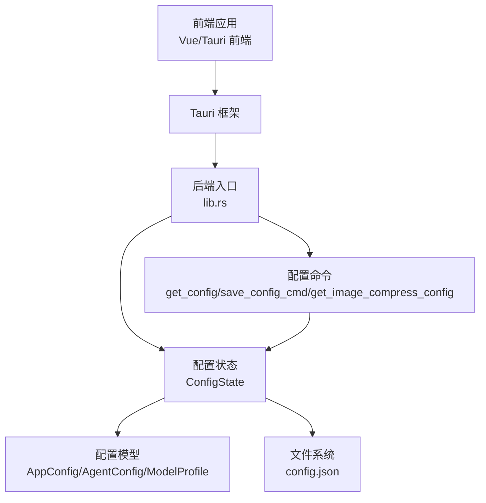
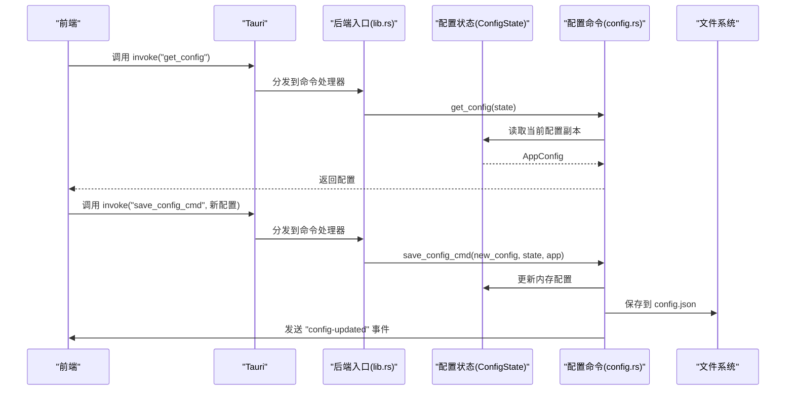
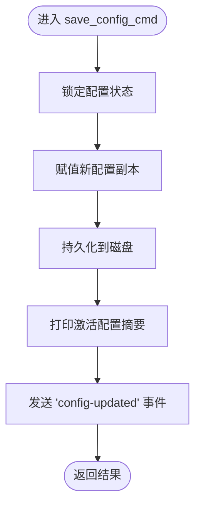
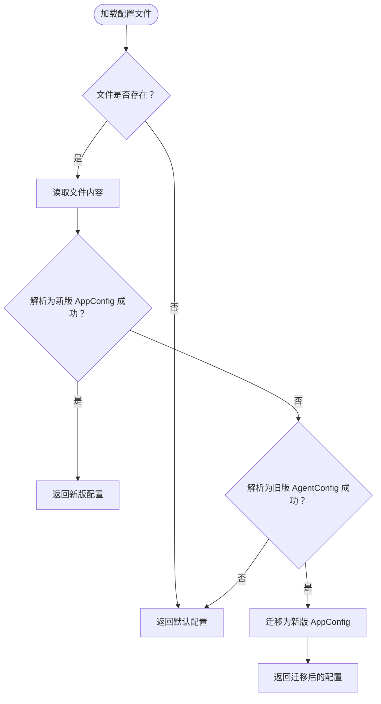
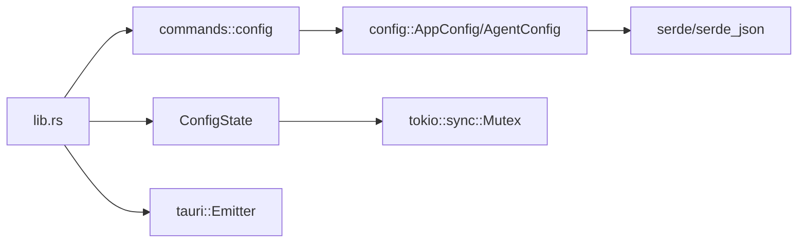

# 配置管理命令

<cite>
**本文引用的文件**
- [config.rs](file://src-tauri/src/core/config.rs)
- [config.rs](file://src-tauri/src/core/commands/config.rs)
- [lib.rs](file://src-tauri/src/lib.rs)
- [Cargo.toml](file://src-tauri/Cargo.toml)
- [mod.rs](file://src-tauri/src/core/mod.rs)
</cite>

## 目录
1. [简介](#简介)
2. [项目结构](#项目结构)
3. [核心组件](#核心组件)
4. [架构总览](#架构总览)
5. [详细组件分析](#详细组件分析)
6. [依赖关系分析](#依赖关系分析)
7. [性能考虑](#性能考虑)
8. [故障排除指南](#故障排除指南)
9. [结论](#结论)
10. [附录](#附录)

## 简介
本文件面向配置管理命令的使用者与维护者，系统性梳理配置相关的命令接口与实现细节，覆盖以下主题：
- 配置读取、写入、图片压缩参数查询等命令
- 配置项分类（模型配置、代理配置、系统配置、用户偏好）
- 配置优先级与激活机制
- 配置热更新与事件通知
- 配置备份与恢复建议
- 配置模板、默认值与迁移策略
- 安全性、版本管理与冲突处理最佳实践

## 项目结构
配置管理功能由 Rust 后端通过 Tauri 命令暴露给前端调用，核心位置如下：
- 配置数据模型与状态：src-tauri/src/core/config.rs
- 配置命令实现：src-tauri/src/core/commands/config.rs
- 命令注册入口：src-tauri/src/lib.rs
- 模块导出：src-tauri/src/core/mod.rs
- 依赖声明：src-tauri/Cargo.toml

图表来源
- [lib.rs:93-94](file://src-tauri/src/lib.rs#L93-L94)
- [config.rs:148-149](file://src-tauri/src/core/config.rs#L148-L149)
- [config.rs:4-40](file://src-tauri/src/core/commands/config.rs#L4-L40)

章节来源
- [lib.rs:93-94](file://src-tauri/src/lib.rs#L93-L94)
- [mod.rs:37-37](file://src-tauri/src/core/mod.rs#L37-L37)

## 核心组件
- 配置模型
  - AppConfig：顶层应用配置，包含活动配置档案 ID、全局档案 ID 与多个模型档案列表。
  - ModelProfile：模型档案，包含档案标识、名称与 AgentConfig。
  - AgentConfig：单个模型的连接与生成参数，如 API 格式、密钥、基础 URL、主/工具模型、推理参数、图片压缩参数等。
- 配置状态
  - ConfigState：全局配置状态，以 Arc<Mutex<AppConfig>> 形式在 Tauri 状态中管理，保证并发安全。
- 命令接口
  - get_config：返回当前完整配置。
  - save_config_cmd：保存新配置，持久化到磁盘，触发“config-updated”事件。
  - get_image_compress_config：返回图片压缩参数的聚合视图。

章节来源
- [config.rs:86-146](file://src-tauri/src/core/config.rs#L86-L146)
- [config.rs:148-149](file://src-tauri/src/core/config.rs#L148-L149)
- [config.rs:4-40](file://src-tauri/src/core/commands/config.rs#L4-L40)

## 架构总览
配置系统采用“模型-状态-命令-持久化”的分层设计：
- 数据模型层：定义配置结构与默认值。
- 状态管理层：在应用启动时加载配置并注入为 Tauri 状态。
- 命令层：对外暴露配置读取、保存、查询图片压缩参数等命令。
- 持久化层：将配置序列化为 JSON 写入磁盘，支持旧版迁移。

图表来源
- [lib.rs:102-136](file://src-tauri/src/lib.rs#L102-L136)
- [config.rs:4-27](file://src-tauri/src/core/commands/config.rs#L4-L27)
- [config.rs:191-201](file://src-tauri/src/core/config.rs#L191-L201)

## 详细组件分析

### 配置模型与默认值
- AgentConfig 默认值
  - API 格式、基础 URL、主模型、工具模型、推理开关与温度/TopP/TopK 等参数均提供合理默认值，确保首次安装即可使用。
  - 图片压缩参数提供默认宽高与质量，便于直接使用。
- AppConfig 默认值
  - 默认活动档案与全局档案均为“default”，内置一个名为“默认预设”的档案，简化初始体验。
- 激活逻辑
  - active_config() 会根据 active_profile_id 查找对应档案，若未找到则回退到首个档案；随后规范化基础 URL，按 API 格式自动补全路径后缀。

章节来源
- [config.rs:52-70](file://src-tauri/src/core/config.rs#L52-L70)
- [config.rs:95-108](file://src-tauri/src/core/config.rs#L95-L108)
- [config.rs:110-146](file://src-tauri/src/core/config.rs#L110-L146)

### 配置命令 API

#### get_config
- 功能：返回当前完整应用配置。
- 输入：无
- 输出：AppConfig
- 并发：通过 Mutex 保护状态，返回克隆对象避免外部修改影响内部状态。
- 适用场景：初始化界面、显示当前配置概览。

章节来源
- [config.rs:4-9](file://src-tauri/src/core/commands/config.rs#L4-L9)

#### save_config_cmd
- 功能：保存新配置，持久化到磁盘，并向前端广播配置更新事件。
- 输入：new_config(AppConfig)
- 处理流程：
  - 更新内存中的 AppConfig。
  - 调用 save_config() 将配置写入磁盘。
  - 读取当前激活配置摘要信息进行日志输出。
  - 通过 app.emit("config-updated", ()) 通知前端。
- 输出：成功/错误字符串
- 适用场景：用户在设置面板完成配置修改并提交。

图表来源
- [config.rs:12-27](file://src-tauri/src/core/commands/config.rs#L12-L27)
- [config.rs:191-201](file://src-tauri/src/core/config.rs#L191-L201)

章节来源
- [config.rs:12-27](file://src-tauri/src/core/commands/config.rs#L12-L27)

#### get_image_compress_config
- 功能：返回图片压缩参数聚合视图（最大宽、最大高、质量）。
- 输入：无
- 输出：JSON 对象（包含 maxWidth、maxHeight、quality）
- 行为：从当前激活配置读取，若未设置则使用默认值。
- 适用场景：设置面板中图片上传前的压缩参数展示与调整。

章节来源
- [config.rs:29-40](file://src-tauri/src/core/commands/config.rs#L29-L40)

### 配置优先级与激活机制
- 档案优先级
  - active_profile_id 指定当前激活档案；若找不到则回退到第一个档案。
  - global_profile_id 作为全局默认档案标识，用于某些场景下的默认回退。
- URL 规范化
  - active_config() 会根据 API 格式（OpenAI/Anthropic）自动补全基础 URL 的路径后缀，确保请求路径正确。
- 参数优先级
  - 当前激活档案的参数优先于默认值；未设置的字段使用默认值。

章节来源
- [config.rs:88-146](file://src-tauri/src/core/config.rs#L88-L146)

### 配置热更新与事件通知
- 热更新触发：save_config_cmd 成功保存后，通过 app.emit("config-updated", ()) 广播事件。
- 前端订阅：前端应监听该事件以刷新 UI 或重新加载配置相关的状态。
- 注意事项：事件名需保持一致，避免前端监听不到更新。

章节来源
- [config.rs:20-25](file://src-tauri/src/core/commands/config.rs#L20-L25)

### 配置迁移与兼容性
- 支持从旧版 AgentConfig 迁移到新版 AppConfig：
  - 若磁盘上存在旧版 JSON，则尝试解析为旧版结构，然后封装为单档案的 AppConfig。
  - 新版结构包含 profiles 列表，便于未来扩展多档案与多模型配置。
- 迁移过程：
  - 读取文件内容。
  - 优先尝试解析为新版 AppConfig。
  - 若失败且能解析为旧版 AgentConfig，则进行迁移并保留默认档案。
  - 解析失败则返回默认配置。

图表来源
- [config.rs:156-189](file://src-tauri/src/core/config.rs#L156-L189)

章节来源
- [config.rs:156-189](file://src-tauri/src/core/config.rs#L156-L189)

### 配置模板与默认值设置
- 模板来源：AppConfig::default() 与 AgentConfig::default() 提供初始模板。
- 建议实践：
  - 新增配置项时在 Default 实现中提供合理默认值。
  - 为复杂配置提供示例档案（例如多档案模板），便于用户快速开始。
  - 对于敏感字段（如 API 密钥）不建议硬编码默认值，保持空字符串并在运行时提示用户填写。

章节来源
- [config.rs:52-70](file://src-tauri/src/core/config.rs#L52-L70)
- [config.rs:95-108](file://src-tauri/src/core/config.rs#L95-L108)

### 配置备份与恢复
- 备份建议：
  - 定期复制 config.json 至安全位置。
  - 可结合版本控制（如 Git）管理配置变更历史。
- 恢复建议：
  - 将备份的 config.json 替换当前文件，重启应用后生效。
  - 若遇到解析错误，可先用文本编辑器检查 JSON 结构，再尝试恢复。

章节来源
- [config.rs:191-201](file://src-tauri/src/core/config.rs#L191-L201)

### 配置安全性
- 敏感信息处理：
  - API 密钥等敏感字段不应明文存储在公共仓库或日志中。
  - 建议在 UI 中隐藏输入，仅在必要时进行脱敏显示。
- 访问控制：
  - 配置命令仅在本地应用内调用，避免直接暴露到网络。
- 最佳实践：
  - 不在配置中存储明文密码；如需临时缓存，尽量缩短生命周期并及时清理。

章节来源
- [config.rs:21-24](file://src-tauri/src/core/commands/config.rs#L21-L24)

### 配置版本管理与冲突处理
- 版本管理：
  - 通过字段的可选性与默认值实现向后兼容。
  - 新增字段时保持默认值稳定，避免破坏现有配置。
- 冲突处理：
  - 当 active_profile_id 指向不存在的档案时，回退到第一个档案，避免配置丢失。
  - URL 规范化减少因路径不一致导致的请求失败。

章节来源
- [config.rs:110-146](file://src-tauri/src/core/config.rs#L110-L146)

## 依赖关系分析
- 模块依赖
  - lib.rs 通过 manage 注入 ConfigState，并在 generate_handler 中注册配置命令。
  - core::mod.rs 统一导出配置命令，便于其他模块使用。
- 外部依赖
  - serde/serde_json 用于配置的序列化与反序列化。
  - tokio::sync::Mutex 提供并发安全的状态访问。
  - tauri::Emitter 用于事件广播。

图表来源
- [lib.rs:93-94](file://src-tauri/src/lib.rs#L93-L94)
- [lib.rs:102-136](file://src-tauri/src/lib.rs#L102-L136)
- [Cargo.toml:26-27](file://src-tauri/Cargo.toml#L26-L27)

章节来源
- [lib.rs:93-94](file://src-tauri/src/lib.rs#L93-L94)
- [mod.rs:37-37](file://src-tauri/src/core/mod.rs#L37-L37)
- [Cargo.toml:26-27](file://src-tauri/Cargo.toml#L26-L27)

## 性能考虑
- 并发安全：ConfigState 使用 Arc<Mutex<AppConfig>>，在高频读取场景下注意避免长时间持有锁。
- 序列化成本：save_config_cmd 每次保存都会进行 JSON 序列化与磁盘写入，建议在 UI 层做节流或合并保存。
- URL 规范化：active_config() 在每次获取激活配置时执行一次规范化，通常开销很小，但应避免在热路径中重复调用。

## 故障排除指南
- 无法读取配置
  - 检查 config.json 是否存在且格式合法；若解析失败，系统将回退到默认配置。
- 保存失败
  - 确认磁盘写权限；查看是否有并发写入冲突。
- 配置未生效
  - 确认前端是否监听了 "config-updated" 事件并刷新了相关状态。
- URL 请求失败
  - 检查 API 格式与基础 URL 是否匹配；active_config() 会自动补全路径，但仍需确保协议与域名正确。

章节来源
- [config.rs:156-189](file://src-tauri/src/core/config.rs#L156-L189)
- [config.rs:19-25](file://src-tauri/src/core/commands/config.rs#L19-L25)

## 结论
本配置管理命令体系以简洁的数据模型与稳定的命令接口为核心，提供了完整的配置读取、保存与事件通知能力。通过默认值、迁移与回退机制，系统在易用性与兼容性之间取得平衡。建议在实际使用中配合事件监听、备份策略与安全实践，进一步提升稳定性与可维护性。

## 附录

### 命令清单与签名
- get_config
  - 返回：AppConfig
  - 用途：获取当前完整配置
- save_config_cmd
  - 参数：new_config(AppConfig)
  - 返回：Result<(), String>
  - 用途：保存配置并广播更新事件
- get_image_compress_config
  - 返回：JSON 对象（maxWidth/maxHeight/quality）
  - 用途：获取图片压缩参数聚合视图

章节来源
- [config.rs:4-40](file://src-tauri/src/core/commands/config.rs#L4-L40)