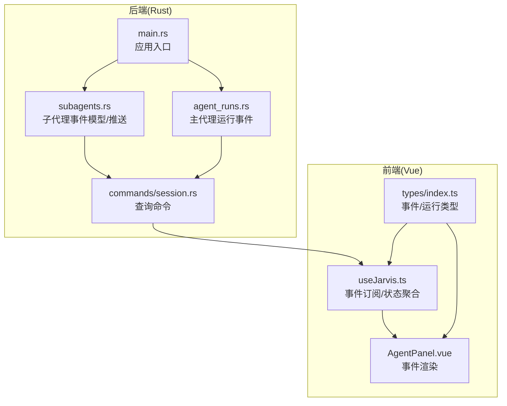
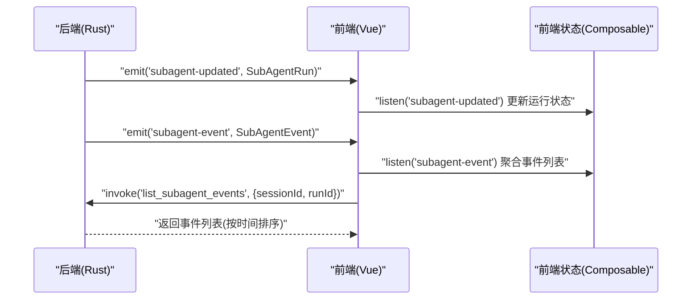
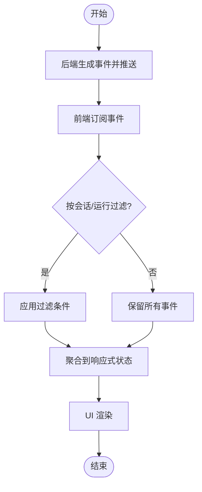
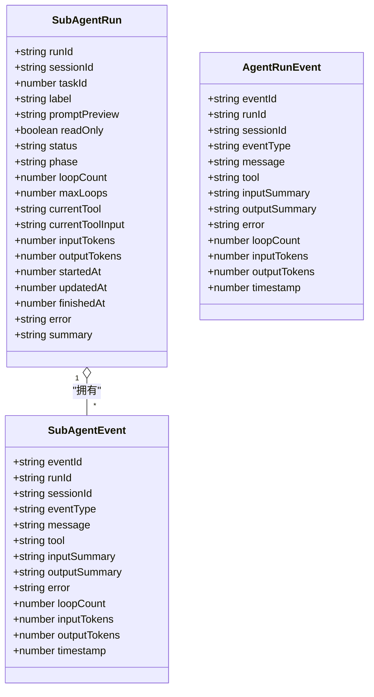
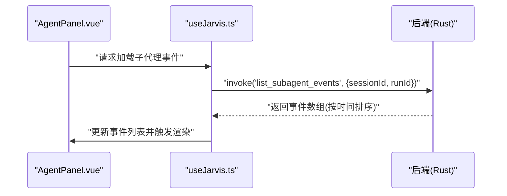
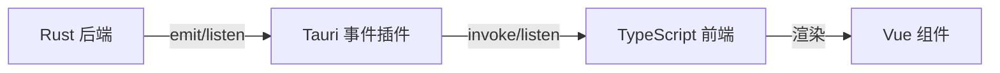

# 事件系统 API

<cite>
**本文引用的文件**
- [main.rs](file://src-tauri/src/main.rs)
- [subagents.rs](file://src-tauri/src/core/subagents.rs)
- [agent_runs.rs](file://src-tauri/src/core/agent_runs.rs)
- [session.rs](file://src-tauri/src/core/commands/session.rs)
- [useJarvis.ts](file://src/composables/useJarvis.ts)
- [AgentPanel.vue](file://src/components/chat/AgentPanel.vue)
- [index.ts](file://src/types/index.ts)
- [Cargo.lock](file://src-tauri/Cargo.lock)
- [desktop-schema.json](file://src-tauri/gen/schemas/desktop-schema.json)
- [windows-schema.json](file://src-tauri/gen/schemas/windows-schema.json)
</cite>

## 目录
1. [简介](#简介)
2. [项目结构](#项目结构)
3. [核心组件](#核心组件)
4. [架构总览](#架构总览)
5. [详细组件分析](#详细组件分析)
6. [依赖关系分析](#依赖关系分析)
7. [性能考量](#性能考量)
8. [故障排除指南](#故障排除指南)
9. [结论](#结论)
10. [附录](#附录)

## 简介
本文件系统化梳理 JarvisAgent 项目的事件系统 API，覆盖前后端事件通信协议、事件类型与消息格式、订阅与生命周期管理、事件数据结构、处理最佳实践、调试与监控、错误处理与故障排除。事件系统以 Tauri 插件事件为核心，后端 Rust 实现事件生成与存储，前端 Vue Composable 订阅并渲染事件流。

## 项目结构
事件系统相关代码主要分布在以下位置：
- 后端（Rust）：核心事件模型与事件推送逻辑位于 core 子模块；命令层提供查询接口；主入口负责应用启动。
- 前端（Vue）：通过 @tauri-apps/api 进行事件订阅与调用后端命令；UI 组件消费事件并展示。
- 类型定义（TypeScript）：统一前后端事件与运行状态的数据契约。

**图表来源**
- [main.rs:1-7](file://src-tauri/src/main.rs#L1-L7)
- [subagents.rs:55-177](file://src-tauri/src/core/subagents.rs#L55-L177)
- [agent_runs.rs:439-477](file://src-tauri/src/core/agent_runs.rs#L439-L477)
- [session.rs:300-333](file://src-tauri/src/core/commands/session.rs#L300-L333)
- [useJarvis.ts:780-814](file://src/composables/useJarvis.ts#L780-L814)
- [AgentPanel.vue:375-389](file://src/components/chat/AgentPanel.vue#L375-L389)
- [index.ts:54-167](file://src/types/index.ts#L54-L167)

**章节来源**
- [main.rs:1-7](file://src-tauri/src/main.rs#L1-L7)
- [subagents.rs:55-177](file://src-tauri/src/core/subagents.rs#L55-L177)
- [agent_runs.rs:439-477](file://src-tauri/src/core/agent_runs.rs#L439-L477)
- [session.rs:300-333](file://src-tauri/src/core/commands/session.rs#L300-L333)
- [useJarvis.ts:780-814](file://src/composables/useJarvis.ts#L780-L814)
- [AgentPanel.vue:375-389](file://src/components/chat/AgentPanel.vue#L375-L389)
- [index.ts:54-167](file://src/types/index.ts#L54-L167)

## 核心组件
- 事件模型与推送
  - 子代理事件模型：包含事件 ID、运行 ID、会话 ID、事件类型、消息、工具名、输入/输出摘要、错误、循环次数、Token 统计、时间戳等字段。
  - 主代理运行事件模型：包含事件 ID、运行 ID、会话 ID、事件类型、消息、工具、输入/输出摘要、错误、循环次数、Token 统计、时间戳等字段。
  - 事件推送：后端在运行状态变更时构造事件并推送，同时持久化到会话运行事件日志文件。

- 事件订阅与消费
  - 前端通过 @tauri-apps/api.listen 订阅后端推送的事件，如 agent-step、subagent-updated、subagent-event、checkpoint-created、active-session-changed 等。
  - 前端 Composable 将事件聚合到响应式状态中，并触发 UI 渲染。

- 查询接口
  - 提供列出子代理运行与事件的命令，支持按会话或运行过滤，便于前端初始化加载与历史回放。

**章节来源**
- [subagents.rs:55-114](file://src-tauri/src/core/subagents.rs#L55-L114)
- [agent_runs.rs:439-477](file://src-tauri/src/core/agent_runs.rs#L439-L477)
- [index.ts:54-167](file://src/types/index.ts#L54-L167)
- [useJarvis.ts:780-814](file://src/composables/useJarvis.ts#L780-L814)
- [session.rs:300-333](file://src-tauri/src/core/commands/session.rs#L300-L333)

## 架构总览
事件系统采用“后端生成、前端订阅”的架构。后端在子代理与主代理运行过程中生成事件，通过 Tauri 事件通道推送到前端；前端 Composable 订阅并聚合事件，UI 组件根据事件更新视图。

**图表来源**
- [subagents.rs:615-625](file://src-tauri/src/core/subagents.rs#L615-L625)
- [useJarvis.ts:804-814](file://src/composables/useJarvis.ts#L804-L814)
- [session.rs:318-325](file://src-tauri/src/core/commands/session.rs#L318-L325)

## 详细组件分析

### 事件类型与消息格式
- 子代理事件类型
  - start：运行开始
  - phase：阶段切换
  - tool_call：调用工具
  - tool_result：工具执行结果
  - complete：运行完成
  - cancel：用户取消
  - error：运行失败
- 主代理运行事件类型
  - 由后端统一推送，包含运行级事件信息与 Token 统计

事件负载字段
- 通用字段：事件 ID、运行 ID、会话 ID、事件类型、消息、时间戳
- 工具相关：工具名、输入摘要、输出摘要
- 错误与状态：错误信息、运行状态
- Token 统计：输入/输出 Token 数
- 循环统计：循环次数

**章节来源**
- [subagents.rs:144-151](file://src-tauri/src/core/subagents.rs#L144-L151)
- [agent_runs.rs:439-477](file://src-tauri/src/core/agent_runs.rs#L439-L477)
- [index.ts:54-167](file://src/types/index.ts#L54-L167)

### 事件生命周期管理
- 发布
  - 后端在运行状态变更时构造事件并推送，同时写入会话运行事件日志文件。
- 订阅
  - 前端通过 listen 订阅事件，自动更新本地状态。
- 取消订阅
  - 当会话切换或组件卸载时，前端应确保不再接收无关会话的事件。
- 事件过滤
  - 前端在订阅时可按会话 ID 或运行 ID 进行过滤；后端命令支持按会话/运行过滤。

**图表来源**
- [useJarvis.ts:780-814](file://src/composables/useJarvis.ts#L780-L814)
- [session.rs:318-325](file://src-tauri/src/core/commands/session.rs#L318-L325)

**章节来源**
- [subagents.rs:565-613](file://src-tauri/src/core/subagents.rs#L565-L613)
- [agent_runs.rs:439-477](file://src-tauri/src/core/agent_runs.rs#L439-L477)
- [useJarvis.ts:829-895](file://src/composables/useJarvis.ts#L829-L895)

### 事件数据结构
- 子代理运行状态
  - 字段：运行 ID、会话 ID、任务 ID、标签、提示词预览、只读标志、状态、阶段、循环次数、最大循环数、当前工具、Token 统计、起止时间、错误、摘要等。
- 子代理事件
  - 字段：事件 ID、运行 ID、会话 ID、事件类型、消息、工具、输入/输出摘要、错误、循环次数、Token 统计、时间戳。
- 主代理运行事件
  - 字段：事件 ID、运行 ID、会话 ID、事件类型、消息、工具、输入/输出摘要、错误、循环次数、Token 统计、时间戳。

**图表来源**
- [index.ts:74-167](file://src/types/index.ts#L74-L167)

**章节来源**
- [index.ts:74-167](file://src/types/index.ts#L74-L167)

### 事件订阅机制
- 前端订阅
  - 使用 @tauri-apps/api.listen 订阅后端推送的事件名称，如 agent-step、subagent-updated、subagent-event、checkpoint-created、active-session-changed。
  - 订阅回调中进行会话 ID 校验与事件聚合，避免跨会话污染。
- 前端调用后端命令
  - 使用 @tauri-apps/api/invoke 调用后端命令，如 list_subagent_events，用于初始化加载历史事件。
- UI 渲染
  - AgentPanel.vue 根据事件时间戳排序并截断显示最近 300 条事件，支持按事件类型分类展示。

**图表来源**
- [useJarvis.ts:1207-1231](file://src/composables/useJarvis.ts#L1207-L1231)
- [AgentPanel.vue:375-389](file://src/components/chat/AgentPanel.vue#L375-L389)

**章节来源**
- [useJarvis.ts:780-814](file://src/composables/useJarvis.ts#L780-L814)
- [useJarvis.ts:1207-1231](file://src/composables/useJarvis.ts#L1207-L1231)
- [AgentPanel.vue:375-389](file://src/components/chat/AgentPanel.vue#L375-L389)

### 事件处理最佳实践
- 异步事件处理
  - 后端事件推送为异步，前端订阅回调应避免阻塞主线程，必要时使用微任务或节流。
- 事件去重
  - 前端聚合时可基于事件 ID 去重，避免重复渲染。
- 事件顺序保证
  - 事件携带时间戳，前端按时间戳排序；后端也保证事件写入顺序。
- 内存控制
  - 前端对事件列表进行截断（如保留最近 300 条），防止内存膨胀。
- 会话隔离
  - 订阅与查询均应按会话 ID 过滤，避免跨会话事件干扰。

**章节来源**
- [subagents.rs:601-607](file://src-tauri/src/core/subagents.rs#L601-L607)
- [useJarvis.ts:807-814](file://src/composables/useJarvis.ts#L807-L814)

## 依赖关系分析
- 后端依赖
  - Tauri 事件系统用于跨进程事件推送。
  - tokio_util 的 CancellationToken 支持运行取消。
  - serde 序列化事件结构。
- 前端依赖
  - @tauri-apps/api 提供事件订阅与命令调用能力。
  - Vue 响应式系统驱动 UI 更新。

**图表来源**
- [Cargo.lock:934-989](file://src-tauri/Cargo.lock#L934-L989)
- [Cargo.lock:1914-1929](file://src-tauri/Cargo.lock#L1914-L1929)
- [desktop-schema.json:2353-2405](file://src-tauri/gen/schemas/desktop-schema.json#L2353-L2405)
- [windows-schema.json:2353-2405](file://src-tauri/gen/schemas/windows-schema.json#L2353-L2405)

**章节来源**
- [Cargo.lock:934-989](file://src-tauri/Cargo.lock#L934-L989)
- [Cargo.lock:1914-1929](file://src-tauri/Cargo.lock#L1914-L1929)
- [desktop-schema.json:2353-2405](file://src-tauri/gen/schemas/desktop-schema.json#L2353-L2405)
- [windows-schema.json:2353-2405](file://src-tauri/gen/schemas/windows-schema.json#L2353-L2405)

## 性能考量
- 事件数量控制
  - 后端事件列表上限为 300 条，超出则丢弃旧事件，降低内存占用。
- 推送频率
  - 子代理心跳每 5 秒推送一次运行状态，避免过于频繁的事件风暴。
- 前端渲染优化
  - 仅保留最近 300 条事件并按时间戳排序，减少 DOM 操作与重排。
- I/O 写入
  - 主代理运行事件写入 JSONL 文件，按追加方式写入，避免大文件频繁重写。

**章节来源**
- [subagents.rs:601-607](file://src-tauri/src/core/subagents.rs#L601-L607)
- [subagents.rs:627-650](file://src-tauri/src/core/subagents.rs#L627-L650)
- [agent_runs.rs:468-471](file://src-tauri/src/core/agent_runs.rs#L468-L471)
- [useJarvis.ts:807-814](file://src/composables/useJarvis.ts#L807-L814)

## 故障排除指南
- 事件未到达前端
  - 检查权限配置是否允许 listen/emit/unlisten。
  - 确认前端已正确调用 listen 并传入正确的事件名称。
- 事件顺序异常
  - 确保前端按时间戳排序，且后端事件写入顺序一致。
- 事件过多导致卡顿
  - 检查前端是否正确截断事件列表（如保留最近 300 条）。
- 会话切换后仍收到旧事件
  - 确认 active-session-changed 订阅逻辑已清理旧会话状态并停止渲染无关事件。
- 后端命令无法调用
  - 检查命令权限配置，确认 allow-listen/allow-emit 等权限已启用。

**章节来源**
- [desktop-schema.json:2353-2405](file://src-tauri/gen/schemas/desktop-schema.json#L2353-L2405)
- [windows-schema.json:2353-2405](file://src-tauri/gen/schemas/windows-schema.json#L2353-L2405)
- [useJarvis.ts:829-895](file://src/composables/useJarvis.ts#L829-L895)

## 结论
本事件系统以 Tauri 事件插件为核心，后端负责事件生成与持久化，前端负责订阅与渲染，形成清晰的职责分离。通过严格的事件模型、过滤与内存控制策略，系统在复杂多会话场景下仍能保持良好的性能与稳定性。建议在生产环境中进一步完善事件去重、批量推送与错误重试机制，以提升可靠性与可观测性。

## 附录

### 事件 API 规范
- 事件名称
  - subagent-updated：子代理运行状态更新
  - subagent-event：子代理事件
  - agent-step：主代理步骤事件
  - checkpoint-created：检查点创建事件
  - active-session-changed：活动会话切换事件
- 命令
  - list_subagent_events：列出子代理事件（支持按会话/运行过滤）

**章节来源**
- [subagents.rs:615-625](file://src-tauri/src/core/subagents.rs#L615-L625)
- [session.rs:318-325](file://src-tauri/src/core/commands/session.rs#L318-L325)
- [useJarvis.ts:780-814](file://src/composables/useJarvis.ts#L780-L814)