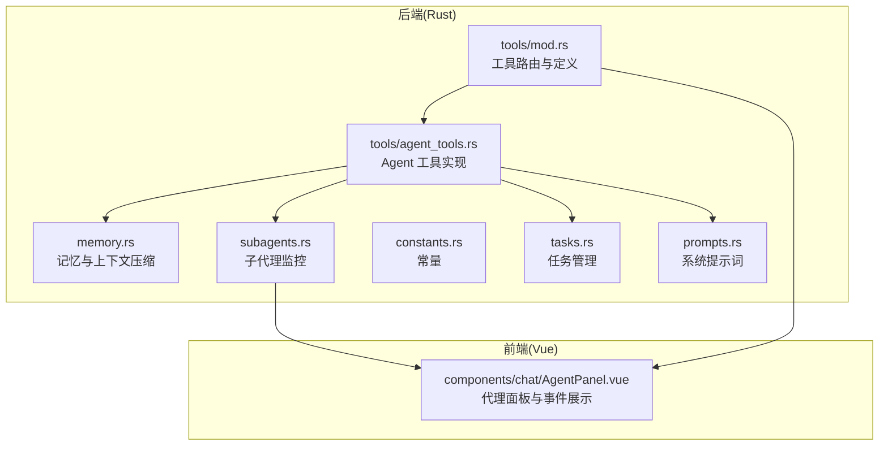
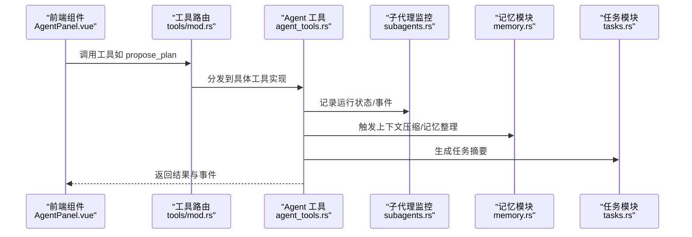
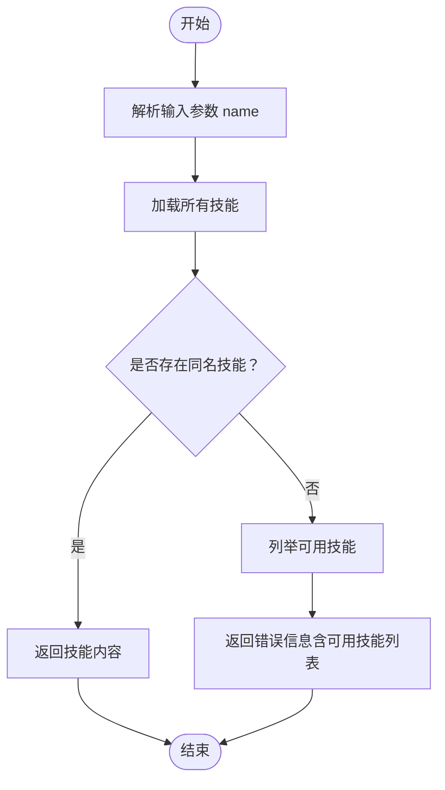
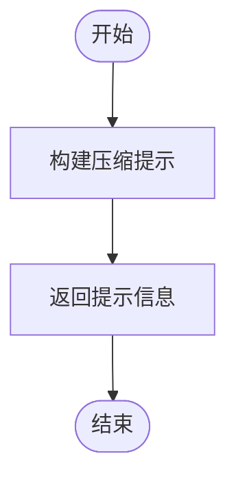
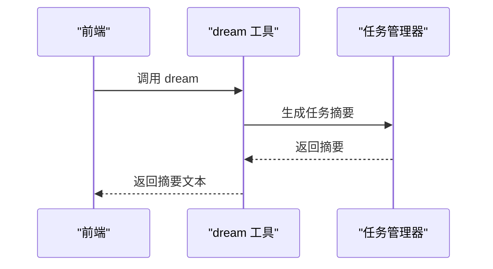
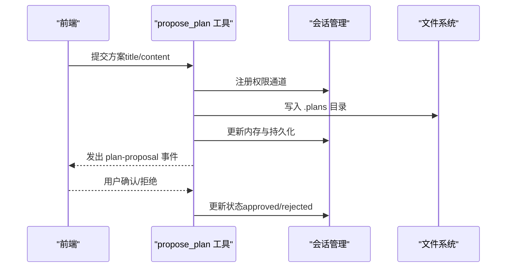
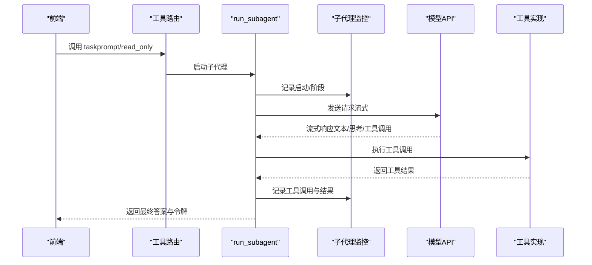
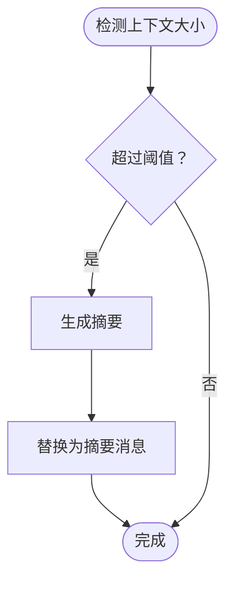
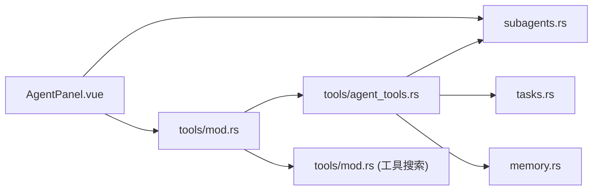

# Agent 工具接口

<cite>
**本文引用的文件**
- [agent_tools.rs](file://src-tauri/src/core/tools/agent_tools.rs)
- [mod.rs](file://src-tauri/src/core/tools/mod.rs)
- [memory.rs](file://src-tauri/src/core/memory.rs)
- [models.rs](file://src-tauri/src/core/models.rs)
- [subagents.rs](file://src-tauri/src/core/subagents.rs)
- [constants.rs](file://src-tauri/src/core/constants.rs)
- [tasks.rs](file://src-tauri/src/core/tasks.rs)
- [prompts.rs](file://src-tauri/src/core/prompts.rs)
- [AgentPanel.vue](file://src/components/chat/AgentPanel.vue)
</cite>

## 目录
1. [简介](#简介)
2. [项目结构](#项目结构)
3. [核心组件](#核心组件)
4. [架构总览](#架构总览)
5. [详细组件分析](#详细组件分析)
6. [依赖关系分析](#依赖关系分析)
7. [性能考量](#性能考量)
8. [故障排查指南](#故障排查指南)
9. [结论](#结论)
10. [附录](#附录)

## 简介
本文件系统性梳理 JarvisAgent 智能代理工具接口，覆盖以下核心能力：
- 技能加载：load_skill（从本地技能目录动态加载技能）
- 上下文压缩：compact（手动触发压缩；自动压缩由记忆模块负责）
- 记忆整理：dream（触发全局任务状态摘要，辅助决策）
- 方案提案：propose_plan（将实施方案推送至前端预览面板，等待审批）
- 子代理执行：run_subagent（子代理工作流，含工具调用、流式输出、令牌统计）

文档同时阐述智能代理的工作原理（技能加载机制、记忆管理、决策流程、方案审批流程），并提供最佳实践与调试方法。

## 项目结构
后端 Rust 核心位于 src-tauri，前端 Vue 组件位于 src。工具接口主要分布在 tools 子模块，配合记忆、任务、子代理监控等模块协同工作。

图表来源
- [mod.rs:157-185](file://src-tauri/src/core/tools/mod.rs#L157-L185)
- [agent_tools.rs:19-720](file://src-tauri/src/core/tools/agent_tools.rs#L19-L720)
- [memory.rs:103-214](file://src-tauri/src/core/memory.rs#L103-L214)
- [subagents.rs:73-177](file://src-tauri/src/core/subagents.rs#L73-L177)
- [tasks.rs:144-202](file://src-tauri/src/core/tasks.rs#L144-L202)
- [prompts.rs:38-63](file://src-tauri/src/core/prompts.rs#L38-L63)
- [AgentPanel.vue:330-451](file://src/components/chat/AgentPanel.vue#L330-L451)

章节来源
- [mod.rs:1-237](file://src-tauri/src/core/tools/mod.rs#L1-L237)
- [agent_tools.rs:1-836](file://src-tauri/src/core/tools/agent_tools.rs#L1-L836)
- [memory.rs:1-474](file://src-tauri/src/core/memory.rs#L1-L474)
- [subagents.rs:1-666](file://src-tauri/src/core/subagents.rs#L1-L666)
- [tasks.rs:1-241](file://src-tauri/src/core/tasks.rs#L1-L241)
- [prompts.rs:1-82](file://src-tauri/src/core/prompts.rs#L1-L82)
- [AgentPanel.vue:1-1010](file://src/components/chat/AgentPanel.vue#L1-L1010)

## 核心组件
- 工具路由与分发：统一入口 handle_tool_call，内部根据工具名分发到具体实现（含子代理 task 路由）
- Agent 工具实现：load_skill、compact、dream、propose_plan、run_subagent
- 记忆与上下文压缩：估算令牌、微压缩、自动压缩、记忆 Agent 更新
- 子代理监控：运行状态、阶段、事件、令牌统计、取消机制
- 任务管理：任务创建、更新、摘要、级联影响
- 系统提示词：主代理与子代理系统提示，用于约束行为与策略

章节来源
- [mod.rs:157-236](file://src-tauri/src/core/tools/mod.rs#L157-L236)
- [agent_tools.rs:19-836](file://src-tauri/src/core/tools/agent_tools.rs#L19-L836)
- [memory.rs:10-474](file://src-tauri/src/core/memory.rs#L10-L474)
- [subagents.rs:73-666](file://src-tauri/src/core/subagents.rs#L73-L666)
- [tasks.rs:6-241](file://src-tauri/src/core/tasks.rs#L6-L241)
- [prompts.rs:38-82](file://src-tauri/src/core/prompts.rs#L38-L82)

## 架构总览
Agent 工具接口采用“工具路由 + 具体实现 + 监控与状态”的分层设计。前端通过事件驱动与后端交互，后端通过监控器记录子代理生命周期与工具调用轨迹。

图表来源
- [AgentPanel.vue:330-451](file://src/components/chat/AgentPanel.vue#L330-L451)
- [mod.rs:157-185](file://src-tauri/src/core/tools/mod.rs#L157-L185)
- [agent_tools.rs:722-836](file://src-tauri/src/core/tools/agent_tools.rs#L722-L836)
- [subagents.rs:116-177](file://src-tauri/src/core/subagents.rs#L116-L177)
- [memory.rs:103-214](file://src-tauri/src/core/memory.rs#L103-L214)
- [tasks.rs:144-202](file://src-tauri/src/core/tasks.rs#L144-L202)

## 详细组件分析

### 工具接口总览
- 工具路由：handle_tool_call 根据工具名分发；task 名称路由到 run_subagent
- 工具定义：get_tools_definition 按意图返回核心工具与延迟工具 Schema
- 工具实现：load_skill、compact、dream、propose_plan、run_subagent

章节来源
- [mod.rs:94-185](file://src-tauri/src/core/tools/mod.rs#L94-L185)

### load_skill（技能加载）
- 功能：从 Agent 家目录的 skills 子目录扫描并加载技能，返回技能内容
- 输入参数：name（技能名称）
- 行为：若找到匹配技能，返回技能包裹的 XML 风格文本；否则返回可用技能列表
- 返回值：字符串（技能内容或错误信息）
- 交互模式：前端调用后，可在系统提示中注入可用技能列表

图表来源
- [agent_tools.rs:19-38](file://src-tauri/src/core/tools/agent_tools.rs#L19-L38)

章节来源
- [agent_tools.rs:19-38](file://src-tauri/src/core/tools/agent_tools.rs#L19-L38)
- [mod.rs:27-92](file://src-tauri/src/core/tools/mod.rs#L27-L92)

### compact（上下文压缩）
- 功能：手动触发上下文压缩提示
- 输入参数：无（或可扩展 focus 等参数）
- 行为：返回提示信息，实际压缩逻辑由记忆模块 auto_compact 实现
- 返回值：字符串（提示信息）
- 交互模式：前端显示压缩提示，随后由记忆模块进行摘要与清理

图表来源
- [agent_tools.rs:40-47](file://src-tauri/src/core/tools/agent_tools.rs#L40-L47)

章节来源
- [agent_tools.rs:40-47](file://src-tauri/src/core/tools/agent_tools.rs#L40-L47)
- [memory.rs:103-214](file://src-tauri/src/core/memory.rs#L103-L214)

### dream（记忆整理）
- 功能：触发全局任务状态摘要，辅助决策与休息/总结状态判断
- 输入参数：无
- 行为：调用任务管理器生成摘要，返回摘要文本
- 返回值：字符串（摘要与建议）
- 交互模式：前端展示摘要，引导下一步行动

图表来源
- [agent_tools.rs:49-59](file://src-tauri/src/core/tools/agent_tools.rs#L49-L59)
- [tasks.rs:144-202](file://src-tauri/src/core/tasks.rs#L144-L202)

章节来源
- [agent_tools.rs:49-59](file://src-tauri/src/core/tools/agent_tools.rs#L49-L59)
- [tasks.rs:144-202](file://src-tauri/src/core/tasks.rs#L144-L202)

### propose_plan（方案提案）
- 功能：将实施方案推送到前端预览面板，等待用户确认或拒绝
- 输入参数：title（标题）、content（内容）
- 行为：
  - 生成唯一 ID 并注册权限通道
  - 保存方案到 .plans 目录（Markdown）
  - 写入会话内存与持久化
  - 发出前端事件（plan-proposal）
- 返回值：字符串（提示信息）
- 交互模式：前端弹出预览面板，用户点击同意/拒绝，后端据此更新状态

图表来源
- [agent_tools.rs:722-836](file://src-tauri/src/core/tools/agent_tools.rs#L722-L836)

章节来源
- [agent_tools.rs:722-836](file://src-tauri/src/core/tools/agent_tools.rs#L722-L836)

### run_subagent（子代理执行）
- 功能：启动子代理执行任务，支持只读/读写模式，流式输出与工具调用
- 输入参数：prompt（任务描述）、read_only（是否只读）、session_id、task_id、label
- 行为：
  - 启动运行并记录状态
  - 选择工具集（只读模式过滤变更类工具）
  - 发送请求到模型（支持 OpenAI/Anthropic 格式）
  - 流式解析内容块（文本、思考、工具调用）
  - 执行工具调用并记录结果
  - 统计令牌消耗，支持取消
- 返回值：(最终答案, 输入令牌, 输出令牌)
- 交互模式：前端通过 AgentPanel 展示子代理运行状态、阶段、事件与令牌统计

图表来源
- [agent_tools.rs:62-720](file://src-tauri/src/core/tools/agent_tools.rs#L62-L720)
- [subagents.rs:116-339](file://src-tauri/src/core/subagents.rs#L116-L339)
- [prompts.rs:38-63](file://src-tauri/src/core/prompts.rs#L38-L63)

章节来源
- [agent_tools.rs:62-720](file://src-tauri/src/core/tools/agent_tools.rs#L62-L720)
- [subagents.rs:73-339](file://src-tauri/src/core/subagents.rs#L73-L339)
- [prompts.rs:38-63](file://src-tauri/src/core/prompts.rs#L38-L63)

### 记忆与上下文压缩
- 估算令牌：estimate_tokens 基于消息内容字符数粗估
- 微压缩：micro_compact 保留最近若干工具结果摘要
- 自动压缩：auto_compact 在上下文过大时生成摘要并清理历史
- 记忆 Agent：run_memory_agent 依据最新对话更新全局/项目记忆文件

图表来源
- [memory.rs:103-214](file://src-tauri/src/core/memory.rs#L103-L214)

章节来源
- [memory.rs:10-474](file://src-tauri/src/core/memory.rs#L10-L474)

### 任务管理与摘要
- 任务创建/更新/查询/列表
- 依赖关系与级联影响
- 汇总报告：完成率、瓶颈任务、可启动任务

章节来源
- [tasks.rs:6-241](file://src-tauri/src/core/tasks.rs#L6-L241)

### 子代理监控与事件
- 运行状态：Running/Completed/Failed/Cancelled
- 阶段：Starting/WaitingModel/Streaming/Thinking/CallingTool/ProcessingToolResult/Finalizing
- 事件：start/phase/tool_call/tool_result/complete/cancel/error
- 取消：基于 CancellationToken 支持取消运行

章节来源
- [subagents.rs:10-666](file://src-tauri/src/core/subagents.rs#L10-L666)

### 前端交互与可视化
- AgentPanel 展示子代理运行状态、阶段、事件与令牌统计
- 执行流程步骤视图，支持悬停查看详情
- 任务计划面板，支持展开/折叠与状态切换

章节来源
- [AgentPanel.vue:330-451](file://src/components/chat/AgentPanel.vue#L330-L451)

## 依赖关系分析
- 工具路由依赖：tools/mod.rs 依赖 agent_tools.rs、subagents.rs、tasks.rs、memory.rs
- 子代理依赖：run_subagent 依赖 ConfigState、SessionManager、SubAgentMonitor、工具定义
- 记忆依赖：memory.rs 依赖 ConfigState、API 格式适配器
- 前端依赖：AgentPanel.vue 依赖子代理运行状态、事件与权限状态

图表来源
- [mod.rs:157-185](file://src-tauri/src/core/tools/mod.rs#L157-L185)
- [agent_tools.rs:62-720](file://src-tauri/src/core/tools/agent_tools.rs#L62-L720)
- [subagents.rs:116-177](file://src-tauri/src/core/subagents.rs#L116-L177)
- [tasks.rs:144-202](file://src-tauri/src/core/tasks.rs#L144-L202)
- [memory.rs:103-214](file://src-tauri/src/core/memory.rs#L103-L214)
- [AgentPanel.vue:330-451](file://src/components/chat/AgentPanel.vue#L330-L451)

章节来源
- [mod.rs:1-237](file://src-tauri/src/core/tools/mod.rs#L1-L237)
- [agent_tools.rs:1-836](file://src-tauri/src/core/tools/agent_tools.rs#L1-L836)
- [subagents.rs:1-666](file://src-tauri/src/core/subagents.rs#L1-L666)
- [tasks.rs:1-241](file://src-tauri/src/core/tasks.rs#L1-L241)
- [memory.rs:1-474](file://src-tauri/src/core/memory.rs#L1-L474)
- [AgentPanel.vue:1-1010](file://src/components/chat/AgentPanel.vue#L1-L1010)

## 性能考量
- 令牌限制：MAX_TOKENS_CONTEXT 控制单次请求上下文长度
- 循环上限：MAX_AGENT_LOOP_BEFORE_CONFIRM 限制子代理轮数，避免无限循环
- 自动压缩：在上下文过大时自动生成摘要，降低令牌消耗
- 只读模式：减少变更类工具调用，提高安全性与稳定性
- 事件裁剪：子代理事件最多保留 300 条，避免内存膨胀

章节来源
- [constants.rs:22-30](file://src-tauri/src/core/constants.rs#L22-L30)
- [memory.rs:103-214](file://src-tauri/src/core/memory.rs#L103-L214)
- [subagents.rs:508-612](file://src-tauri/src/core/subagents.rs#L508-L612)

## 故障排查指南
- 子代理取消：检查取消令牌与 is_cancelled 状态，确认事件是否正确记录
- 工具调用失败：查看 parse_streamed_tool_input 解析错误与工具结果记录
- API 请求失败：检查 API Key、Base URL、认证头与模型格式（OpenAI/Anthropic）
- 记忆更新失败：确认 update_memory 工具调用与文件写入权限
- 任务摘要异常：核对任务状态与依赖关系，关注级联影响

章节来源
- [subagents.rs:341-432](file://src-tauri/src/core/subagents.rs#L341-L432)
- [agent_tools.rs:540-666](file://src-tauri/src/core/tools/agent_tools.rs#L540-L666)
- [memory.rs:335-473](file://src-tauri/src/core/memory.rs#L335-L473)
- [tasks.rs:70-119](file://src-tauri/src/core/tasks.rs#L70-L119)

## 结论
Agent 工具接口围绕“工具路由 + 子代理执行 + 记忆与任务管理”构建，具备完善的事件监控、令牌统计与安全控制。通过 propose_plan 实现方案审批闭环，结合 dream 与 compact 辅助记忆与上下文治理，形成完整的智能代理工作流。建议在生产环境中启用只读模式默认策略，并严格控制工具调用范围与轮数上限。

## 附录

### 使用示例与最佳实践
- 技能开发
  - 在 Agent 家目录 skills 下创建技能包，文件名为 SKILL.md，使用 YAML Front Matter 定义 name 与 description
  - 使用 load_skill 获取技能内容，注入系统提示以增强子代理能力
- 记忆优化
  - 当对话上下文增长明显时，使用 compact 触发压缩；或依赖 auto_compact 自动摘要
  - 定期调用 dream 生成任务摘要，评估项目进展与瓶颈
- 方案设计
  - 复杂任务先 propose_plan 提交方案，经用户审批后再执行
  - 在只读模式下先行验证可行性，必要时再开启读写模式
- 代理行为调试
  - 通过 AgentPanel 查看子代理运行状态、阶段与事件
  - 关注令牌统计与工具调用详情，定位性能瓶颈
  - 使用取消功能中断长时间运行的任务

章节来源
- [mod.rs:27-92](file://src-tauri/src/core/tools/mod.rs#L27-L92)
- [agent_tools.rs:40-59](file://src-tauri/src/core/tools/agent_tools.rs#L40-L59)
- [tasks.rs:144-202](file://src-tauri/src/core/tasks.rs#L144-L202)
- [AgentPanel.vue:330-451](file://src/components/chat/AgentPanel.vue#L330-L451)