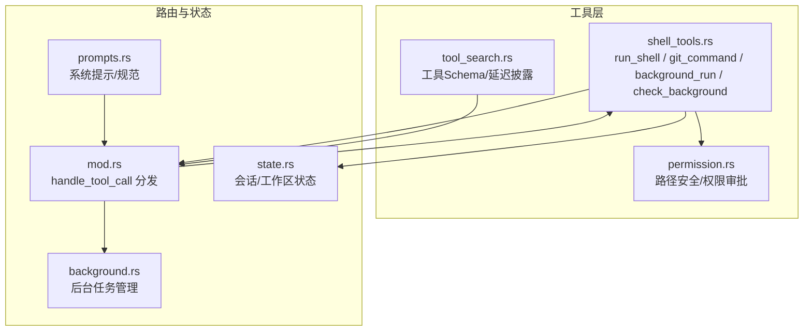
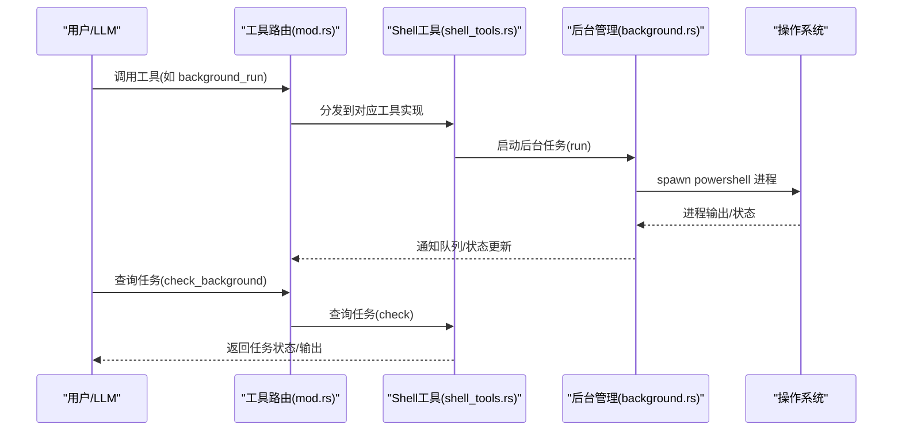
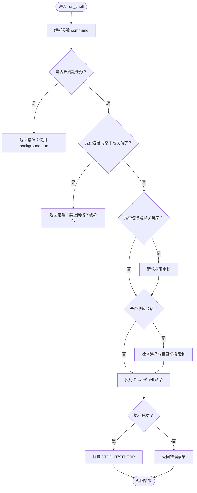
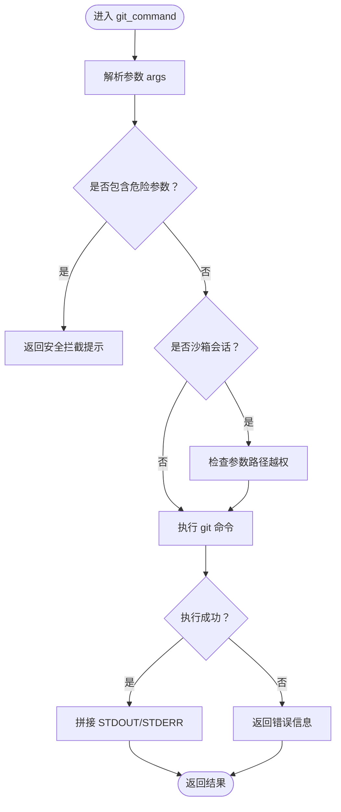
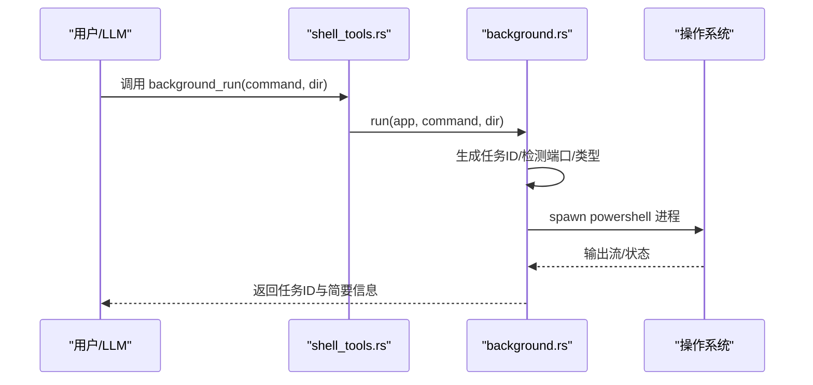
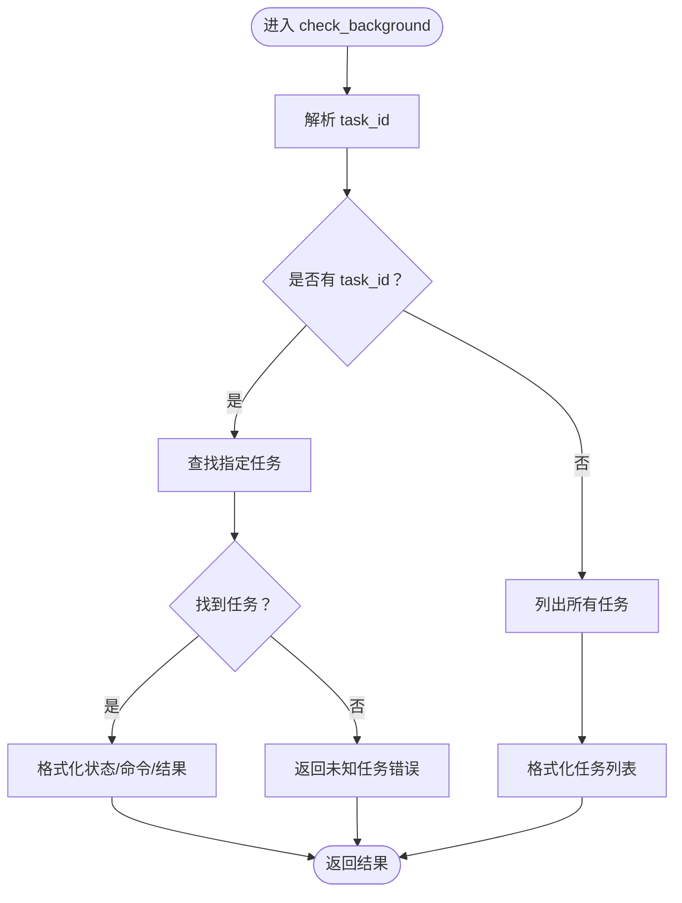
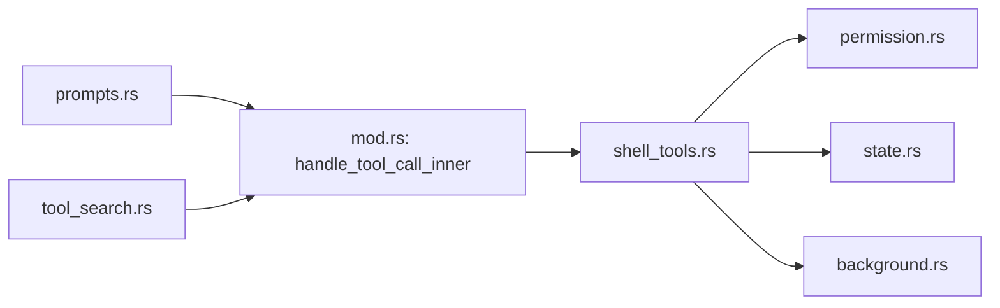

# Shell 工具接口

<cite>
**本文档引用的文件**
- [shell_tools.rs](file://src-tauri/src/core/tools/shell_tools.rs)
- [mod.rs](file://src-tauri/src/core/tools/mod.rs)
- [background.rs](file://src-tauri/src/core/background.rs)
- [permission.rs](file://src-tauri/src/core/tools/permission.rs)
- [state.rs](file://src-tauri/src/core/state.rs)
- [prompts.rs](file://src-tauri/src/core/prompts.rs)
- [tool_search.rs](file://src-tauri/src/core/tools/tool_search.rs)
- [README.md](file://README.md)
</cite>

## 目录
1. [简介](#简介)
2. [项目结构](#项目结构)
3. [核心组件](#核心组件)
4. [架构总览](#架构总览)
5. [详细组件分析](#详细组件分析)
6. [依赖关系分析](#依赖关系分析)
7. [性能考虑](#性能考虑)
8. [故障排除指南](#故障排除指南)
9. [结论](#结论)

## 简介
本文件系统性地文档化了 Shell 工具接口，涵盖以下核心工具：
- run_shell：执行 PowerShell 命令（阻塞同步）
- background_run：后台执行长时间运行的命令
- check_background：检查后台任务状态
- git_command：执行只读 Git 操作

文档重点说明各工具的参数定义、执行环境、返回值格式、错误处理机制；阐述安全限制（命令白名单、路径沙箱、权限审批、网络下载拦截）；并提供使用示例与最佳实践。

## 项目结构
Shell 工具位于 Rust 后端的工具模块中，通过统一的工具路由进行分发，并与后台任务管理器、权限检查模块协同工作。

**图表来源**
- [shell_tools.rs:1-222](file://src-tauri/src/core/tools/shell_tools.rs#L1-L222)
- [mod.rs:157-236](file://src-tauri/src/core/tools/mod.rs#L157-L236)
- [background.rs:29-297](file://src-tauri/src/core/background.rs#L29-L297)
- [permission.rs:12-103](file://src-tauri/src/core/tools/permission.rs#L12-L103)
- [state.rs:19-77](file://src-tauri/src/core/state.rs#L19-L77)
- [prompts.rs:16-63](file://src-tauri/src/core/prompts.rs#L16-L63)
- [tool_search.rs:8-45](file://src-tauri/src/core/tools/tool_search.rs#L8-L45)

**章节来源**
- [shell_tools.rs:1-222](file://src-tauri/src/core/tools/shell_tools.rs#L1-L222)
- [mod.rs:157-236](file://src-tauri/src/core/tools/mod.rs#L157-L236)

## 核心组件
- run_shell：阻塞同步执行 PowerShell 命令，内置长周期任务拦截、危险命令权限审批、网络下载拦截、沙箱路径检查。
- git_command：只读 Git 操作，拦截危险参数（如 push、commit、rebase 等），支持沙箱路径校验。
- background_run：异步后台执行命令，自动检测任务类型与端口，返回任务ID。
- check_background：查询后台任务状态与输出，支持按任务ID查询或列出全部任务。

**章节来源**
- [shell_tools.rs:49-130](file://src-tauri/src/core/tools/shell_tools.rs#L49-L130)
- [shell_tools.rs:132-181](file://src-tauri/src/core/tools/shell_tools.rs#L132-L181)
- [shell_tools.rs:183-222](file://src-tauri/src/core/tools/shell_tools.rs#L183-L222)
- [background.rs:95-276](file://src-tauri/src/core/background.rs#L95-L276)

## 架构总览
工具调用通过统一路由分发至对应实现，后台任务由后台管理器维护状态与通知队列。

**图表来源**
- [mod.rs:187-236](file://src-tauri/src/core/tools/mod.rs#L187-L236)
- [shell_tools.rs:183-222](file://src-tauri/src/core/tools/shell_tools.rs#L183-L222)
- [background.rs:95-276](file://src-tauri/src/core/background.rs#L95-L276)

## 详细组件分析

### run_shell：执行 PowerShell 命令（阻塞同步）
- 功能概述
  - 在 PowerShell 环境中执行命令，阻塞直到完成。
  - 内置多项安全与体验保护：长周期任务拦截、危险命令权限审批、网络下载拦截、沙箱路径检查、目录切换限制。
- 参数定义
  - command: 字符串，要执行的 PowerShell 命令。
- 执行环境
  - 使用 powershell.exe，参数包含 -NoProfile、-NonInteractive、-Command。
  - 执行目录为会话工作区或当前目录。
- 返回值格式
  - 成功：包含 STDOUT 与 STDERR 的组合字符串。
  - 失败：包含错误信息的字符串。
- 错误处理机制
  - 长周期任务拦截：检测常见开发服务器启动命令，直接返回错误提示，引导使用 background_run。
  - 危险命令权限审批：对删除、格式化、停止进程等关键字触发权限审批流程。
  - 网络下载拦截：拦截 Invoke-WebRequest/iwr/wget/curl，避免触发安全确认框导致进程卡死。
  - 沙箱路径检查：对 Windows 绝对路径与相对路径中的 .. 进行校验，防止越权访问。
  - 目录切换限制：在沙箱会话中禁止 cd/Set-Location 等目录切换命令。
- 安全限制
  - 命令白名单：仅允许只读或低风险命令；长周期/服务启动必须走后台。
  - 超时控制：run_shell 本身阻塞，建议通过 background_run 执行长任务。
  - 资源限制：通过权限审批与路径检查降低资源滥用风险。
- 使用示例
  - 查看文件内容：使用专用工具 read_file 或只读命令，避免 run_shell。
  - 启动开发服务器：使用 background_run，不要用 run_shell。
  - 下载文件：不要使用 wget/curl，告知用户手动操作。
- 最佳实践
  - 优先使用专用只读工具（如 read_file、list_directory）。
  - 长周期任务一律使用 background_run。
  - 沙箱会话中避免使用 cd 等目录切换命令。

**图表来源**
- [shell_tools.rs:49-130](file://src-tauri/src/core/tools/shell_tools.rs#L49-L130)

**章节来源**
- [shell_tools.rs:49-130](file://src-tauri/src/core/tools/shell_tools.rs#L49-L130)
- [prompts.rs:22-26](file://src-tauri/src/core/prompts.rs#L22-L26)

### git_command：只读 Git 操作
- 功能概述
  - 仅允许只读 Git 操作，拦截可能修改历史或推送的参数。
  - 支持沙箱路径校验，防止越权访问。
- 参数定义
  - args: 数组，Git 命令参数列表（如 ["status"]、["log", "-n", "5"]）。
- 执行环境
  - 使用 git.exe，执行目录为会话工作区或当前目录。
- 返回值格式
  - 成功：包含 STDOUT 与 STDERR 的组合字符串。
  - 失败：包含错误信息的字符串。
- 错误处理机制
  - 危险参数拦截：对 push、commit、rebase、reset、revert、clean、checkout 等参数直接返回安全拦截提示。
  - 沙箱路径检查：对包含 ":" 或 ".." 的参数进行越权校验。
- 安全限制
  - 命令白名单：仅允许只读操作。
  - 资源限制：通过参数拦截与路径检查降低风险。
- 使用示例
  - 查看状态：["status"]
  - 查看日志：["log", "-n", "5"]
  - 查看差异：["diff"]
- 最佳实践
  - 仅使用只读参数，避免任何可能修改仓库的操作。
  - 在沙箱会话中谨慎传递路径参数。

**图表来源**
- [shell_tools.rs:132-181](file://src-tauri/src/core/tools/shell_tools.rs#L132-L181)

**章节来源**
- [shell_tools.rs:132-181](file://src-tauri/src/core/tools/shell_tools.rs#L132-L181)
- [README.md:241](file://README.md#L241)

### background_run：后台执行长时间运行的命令
- 功能概述
  - 异步启动 PowerShell 命令，立即返回任务ID，不阻塞对话。
  - 自动检测任务类型（前端/后端）与端口，便于用户访问服务。
- 参数定义
  - command: 字符串，要执行的具体命令（如 "npm run dev"）。
  - dir: 字符串（可选），命令执行的工作目录绝对路径（必须提供，不要在 command 中手写 cd）。
- 执行环境
  - 使用 powershell.exe，启用 stdout/stderr 管道捕获。
  - 执行目录为传入 dir 或会话工作区。
- 返回值格式
  - 返回包含任务ID、类型、端口与简短命令摘要的字符串。
- 错误处理机制
  - 进程启动失败：记录 error 状态与错误信息。
  - 进程退出：根据退出码设置 completed/error 状态。
- 安全限制
  - 沙箱路径检查：若在沙箱会话中，dir 必须在工作区内。
- 使用示例
  - 启动前端开发服务器：{"command": "npm run dev", "dir": "/absolute/path/to/project"}
  - 启动后端服务：{"command": "python app.py", "dir": "/absolute/path/to/project"}
- 最佳实践
  - 必须提供绝对路径的 dir，不要在 command 中手写 cd。
  - 启动服务后告知用户服务地址，不要轮询 check_background。

**图表来源**
- [shell_tools.rs:183-222](file://src-tauri/src/core/tools/shell_tools.rs#L183-L222)
- [background.rs:95-236](file://src-tauri/src/core/background.rs#L95-L236)

**章节来源**
- [shell_tools.rs:183-222](file://src-tauri/src/core/tools/shell_tools.rs#L183-L222)
- [background.rs:95-236](file://src-tauri/src/core/background.rs#L95-L236)
- [prompts.rs:22-26](file://src-tauri/src/core/prompts.rs#L22-L26)

### check_background：检查后台任务状态
- 功能概述
  - 查询指定任务ID的状态与输出，或列出所有任务。
- 参数定义
  - task_id: 字符串（可选），后台任务ID；留空则返回所有任务状态。
- 执行环境
  - 从后台管理器状态中读取任务信息。
- 返回值格式
  - 指定任务：包含状态、简短命令与结果的字符串。
  - 列出全部：每行一个任务的ID、状态与简短命令。
  - 无任务：返回提示信息。
- 错误处理机制
  - 未知任务ID：返回错误提示。
  - 状态未初始化：返回错误提示。
- 使用示例
  - 查询单个任务：{"task_id": "abc123"}
  - 列出全部任务：{"task_id": ""}
- 最佳实践
  - 严禁在思考循环中连续轮询，仅在用户主动询问时使用。

**图表来源**
- [shell_tools.rs:213-222](file://src-tauri/src/core/tools/shell_tools.rs#L213-L222)
- [background.rs:238-276](file://src-tauri/src/core/background.rs#L238-L276)

**章节来源**
- [shell_tools.rs:213-222](file://src-tauri/src/core/tools/shell_tools.rs#L213-L222)
- [background.rs:238-276](file://src-tauri/src/core/background.rs#L238-L276)
- [prompts.rs:25-26](file://src-tauri/src/core/prompts.rs#L25-L26)

## 依赖关系分析
- 工具路由
  - 工具调用通过 handle_tool_call_inner 分发到具体实现。
- 权限与沙箱
  - run_shell/git_command 使用 is_within_workspace 与 request_permission 进行路径与权限控制。
- 后台任务
  - background_run 依赖 BackgroundManager 管理任务生命周期与通知。
- 会话状态
  - 通过 SessionManager 获取工作区路径，用于沙箱限制与执行目录定位。

**图表来源**
- [mod.rs:187-236](file://src-tauri/src/core/tools/mod.rs#L187-L236)
- [shell_tools.rs:1-222](file://src-tauri/src/core/tools/shell_tools.rs#L1-L222)
- [permission.rs:12-103](file://src-tauri/src/core/tools/permission.rs#L12-L103)
- [state.rs:19-77](file://src-tauri/src/core/state.rs#L19-L77)
- [background.rs:29-297](file://src-tauri/src/core/background.rs#L29-L297)
- [prompts.rs:16-63](file://src-tauri/src/core/prompts.rs#L16-L63)
- [tool_search.rs:8-45](file://src-tauri/src/core/tools/tool_search.rs#L8-L45)

**章节来源**
- [mod.rs:187-236](file://src-tauri/src/core/tools/mod.rs#L187-L236)
- [shell_tools.rs:1-222](file://src-tauri/src/core/tools/shell_tools.rs#L1-L222)

## 性能考虑
- run_shell 是阻塞同步，不适合长周期任务，可能导致对话卡死。
- background_run 使用异步进程与管道捕获，适合开发服务器、后端服务等长时间运行任务。
- 建议：
  - 长周期任务一律使用 background_run。
  - 避免在 run_shell 中执行可能产生大量输出的命令（如查看 node_modules）。
  - 合理设置工作目录，减少不必要的路径解析开销。

[本节为通用指导，无需特定文件来源]

## 故障排除指南
- run_shell 返回“长周期任务拦截”
  - 原因：检测到启动开发服务器或长时间运行命令。
  - 处理：改用 background_run，并提供绝对路径的 dir。
- run_shell 返回“网络下载命令禁止”
  - 原因：包含 Invoke-WebRequest/iwr/wget/curl。
  - 处理：告知用户手动下载，或改用其他方式。
- run_shell 返回“权限拒绝”
  - 原因：危险命令触发权限审批，用户拒绝。
  - 处理：重新发起请求并获得用户同意。
- git_command 返回“安全拦截”
  - 原因：包含危险参数（如 push、commit、rebase 等）。
  - 处理：改用只读参数或在受控环境下执行。
- background_run 返回“Failed to spawn”
  - 原因：无法启动 PowerShell 进程。
  - 处理：检查命令语法、工作目录权限与系统环境。
- check_background 返回“Unknown task”或“状态未初始化”
  - 原因：任务ID不存在或后台状态未初始化。
  - 处理：确认任务ID正确，或稍后重试。

**章节来源**
- [shell_tools.rs:49-130](file://src-tauri/src/core/tools/shell_tools.rs#L49-L130)
- [shell_tools.rs:132-181](file://src-tauri/src/core/tools/shell_tools.rs#L132-L181)
- [shell_tools.rs:183-222](file://src-tauri/src/core/tools/shell_tools.rs#L183-L222)
- [background.rs:154-172](file://src-tauri/src/core/background.rs#L154-L172)
- [background.rs:238-276](file://src-tauri/src/core/background.rs#L238-L276)

## 结论
Shell 工具接口通过严格的参数校验、权限审批与沙箱限制，确保在提供强大命令执行能力的同时保障系统安全与用户体验。建议优先使用专用只读工具与 background_run 执行长周期任务，遵循系统提示与最佳实践，避免潜在风险与性能问题。