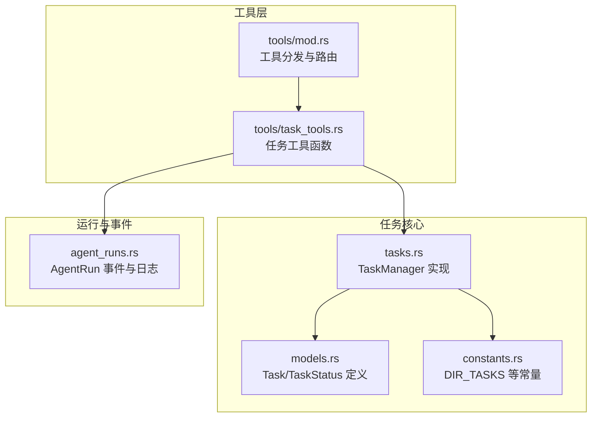
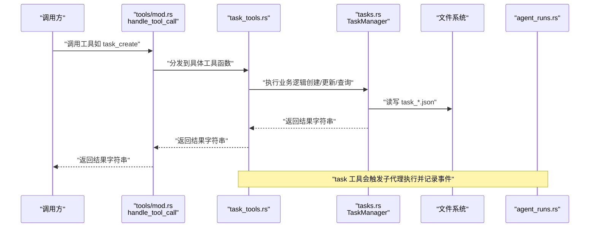
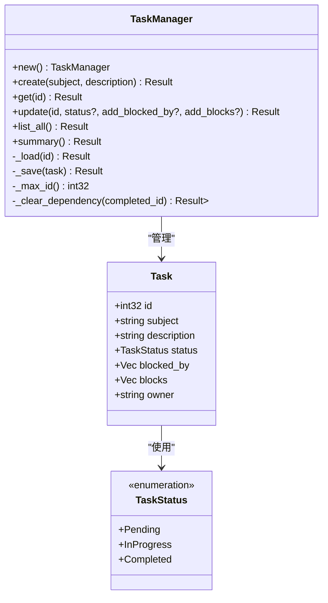
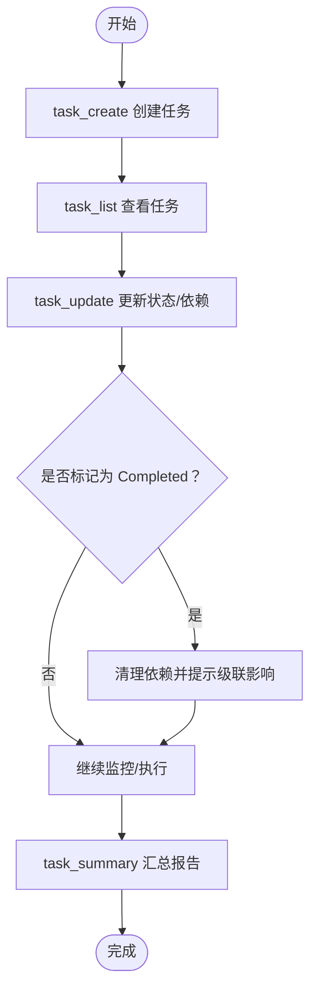
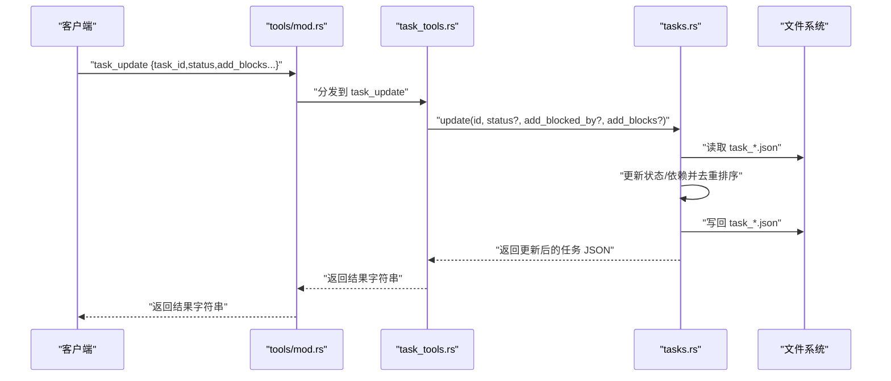
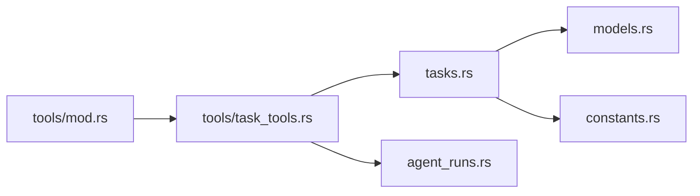

# 任务工具接口

<cite>
**本文引用的文件**
- [task_tools.rs](file://src-tauri/src/core/tools/task_tools.rs)
- [tasks.rs](file://src-tauri/src/core/tasks.rs)
- [models.rs](file://src-tauri/src/core/models.rs)
- [constants.rs](file://src-tauri/src/core/constants.rs)
- [mod.rs](file://src-tauri/src/core/tools/mod.rs)
- [agent_runs.rs](file://src-tauri/src/core/agent_runs.rs)
</cite>

## 目录
1. [简介](#简介)
2. [项目结构](#项目结构)
3. [核心组件](#核心组件)
4. [架构总览](#架构总览)
5. [详细组件分析](#详细组件分析)
6. [依赖分析](#依赖分析)
7. [性能考虑](#性能考虑)
8. [故障排查指南](#故障排查指南)
9. [结论](#结论)
10. [附录](#附录)

## 简介
本文件面向“任务工具接口”的使用者与维护者，系统性地文档化任务管理相关工具的调用方式、参数定义、状态流转、依赖关系处理与返回值格式，并给出任务生命周期（创建、执行、监控、完成）的完整流程说明。重点覆盖以下工具：
- task_create：创建任务
- task_update：更新任务（状态、阻塞关系）
- task_list：列出任务清单
- task_get：获取单个任务详情
- task_summary：生成任务全景报告
- task：执行任务（通过子代理运行）

同时提供最佳实践建议，包括任务看板集成、依赖管理、并行处理与错误恢复策略。

## 项目结构
任务工具位于后端 Rust 核心模块中，采用“工具分发 + 任务管理器”的分层设计：
- 工具分发层：负责接收前端/上层调用，解析工具名与输入，路由到具体工具实现
- 任务管理器：封装任务的持久化、状态变更、依赖计算与汇总统计
- 数据模型：定义任务实体与状态枚举
- 常量定义：统一任务数据目录命名

图表来源
- [mod.rs:157-185](file://src-tauri/src/core/tools/mod.rs#L157-L185)
- [task_tools.rs:1-74](file://src-tauri/src/core/tools/task_tools.rs#L1-L74)
- [tasks.rs:1-241](file://src-tauri/src/core/tasks.rs#L1-L241)
- [models.rs:237-256](file://src-tauri/src/core/models.rs#L237-L256)
- [constants.rs:4-12](file://src-tauri/src/core/constants.rs#L4-L12)
- [agent_runs.rs:439-473](file://src-tauri/src/core/agent_runs.rs#L439-L473)

章节来源
- [mod.rs:157-185](file://src-tauri/src/core/tools/mod.rs#L157-L185)
- [task_tools.rs:1-74](file://src-tauri/src/core/tools/task_tools.rs#L1-L74)
- [tasks.rs:1-241](file://src-tauri/src/core/tasks.rs#L1-L241)
- [models.rs:237-256](file://src-tauri/src/core/models.rs#L237-L256)
- [constants.rs:4-12](file://src-tauri/src/core/constants.rs#L4-L12)

## 核心组件
- 工具分发与路由：根据工具名将调用分发至对应实现，如 task_create、task_update、task_list、task_get、task_summary。
- 任务管理器（TaskManager）：负责任务的创建、加载、保存、更新、列表、汇总与依赖清理。
- 数据模型（Task、TaskStatus）：标准化任务字段与状态枚举。
- 常量（DIR_TASKS）：任务数据存储目录约定。
- 子代理执行（task 工具）：通过 run_subagent 触发子代理执行，结合只读模式与标签进行任务编排。

章节来源
- [mod.rs:157-185](file://src-tauri/src/core/tools/mod.rs#L157-L185)
- [tasks.rs:10-19](file://src-tauri/src/core/tasks.rs#L10-L19)
- [models.rs:237-256](file://src-tauri/src/core/models.rs#L237-L256)
- [constants.rs:4-12](file://src-tauri/src/core/constants.rs#L4-L12)

## 架构总览
工具调用到任务执行的关键路径如下：

图表来源
- [mod.rs:157-185](file://src-tauri/src/core/tools/mod.rs#L157-L185)
- [task_tools.rs:1-74](file://src-tauri/src/core/tools/task_tools.rs#L1-L74)
- [tasks.rs:50-63](file://src-tauri/src/core/tasks.rs#L50-L63)
- [agent_runs.rs:247-300](file://src-tauri/src/core/agent_runs.rs#L247-L300)

## 详细组件分析

### 工具定义与参数规范
- task_create
  - 输入键：subject（字符串，必填）、description（字符串，可选）
  - 返回：任务对象的 JSON 字符串（格式化输出）
  - 行为：分配自增 ID，初始状态为 Pending，blocked_by 与 blocks 为空
- task_update
  - 输入键：task_id（整数，必填）、status（字符串，可选，枚举 in_progress/completed/pending）、add_blocked_by（数组，整数 ID 列表，可选）、add_blocks（数组，整数 ID 列表，可选）
  - 返回：更新后的任务对象 JSON 字符串；若将任务标记为 Completed，会自动解除其他任务对它的阻塞，并在结果末尾附加级联影响提示
  - 行为：支持仅更新状态、仅添加阻塞关系、或同时更新两者；blocks 会同步反向写入被阻塞的任务的 blocked_by
- task_list
  - 输入：无
  - 返回：每行一个任务的简要信息（含状态标记与阻塞来源），按 ID 升序排列
- task_get
  - 输入键：task_id（整数，必填）
  - 返回：任务对象 JSON 字符串（格式化输出）
- task_summary
  - 输入：无
  - 返回：多行文本报告，包含完成率、各状态计数、瓶颈任务（阻塞他人最多）、可启动任务（无阻塞）等摘要信息
- task（执行任务）
  - 输入键：prompt（字符串，必填）、read_only（布尔，可选，默认 true）、task_id（整数，可选）、label（字符串，可选）
  - 返回：子代理执行结果字符串（包含 token 统计元组，但工具层未使用）
  - 行为：通过 run_subagent 启动子代理执行，记录工具调用与结果/错误事件

章节来源
- [task_tools.rs:7-73](file://src-tauri/src/core/tools/task_tools.rs#L7-L73)
- [mod.rs:157-185](file://src-tauri/src/core/tools/mod.rs#L157-L185)

### 数据模型与状态管理
- TaskStatus 枚举：Pending、InProgress、Completed
- Task 结构体字段：id、subject、description、status、blocked_by（被哪些任务阻塞）、blocks（阻塞哪些任务）、owner
- 状态变更规则：
  - 将任务标记为 Completed 时，会扫描所有任务，移除被该任务阻塞的条目，并对解除阻塞的任务集合发出级联提示
  - blocked_by 与 blocks 的去重与排序保证一致性
- 依赖关系处理：
  - add_blocks 会同步更新被阻塞任务的 blocked_by
  - _clear_dependency 在任务完成后自动清理依赖链

图表来源
- [models.rs:237-256](file://src-tauri/src/core/models.rs#L237-L256)
- [tasks.rs:6-19](file://src-tauri/src/core/tasks.rs#L6-L19)
- [tasks.rs:50-119](file://src-tauri/src/core/tasks.rs#L50-L119)
- [tasks.rs:121-142](file://src-tauri/src/core/tasks.rs#L121-L142)

章节来源
- [models.rs:237-256](file://src-tauri/src/core/models.rs#L237-L256)
- [tasks.rs:50-119](file://src-tauri/src/core/tasks.rs#L50-L119)
- [tasks.rs:121-142](file://src-tauri/src/core/tasks.rs#L121-L142)

### 任务生命周期流程
- 创建：调用 task_create，生成 task_*.json，初始状态为 Pending
- 执行：调用 task（read_only 可选），通过子代理执行任务
- 监控：调用 task_list 查看待办与阻塞关系；调用 task_summary 获取全局进度与瓶颈
- 完成：调用 task_update 将状态设为 Completed，系统自动解除依赖并提示级联影响
- 查询：调用 task_get 获取单个任务详情

图表来源
- [task_tools.rs:7-73](file://src-tauri/src/core/tools/task_tools.rs#L7-L73)
- [tasks.rs:70-119](file://src-tauri/src/core/tasks.rs#L70-L119)
- [tasks.rs:144-202](file://src-tauri/src/core/tasks.rs#L144-L202)

章节来源
- [task_tools.rs:7-73](file://src-tauri/src/core/tools/task_tools.rs#L7-L73)
- [tasks.rs:70-119](file://src-tauri/src/core/tasks.rs#L70-L119)
- [tasks.rs:144-202](file://src-tauri/src/core/tasks.rs#L144-L202)

### 工具调用序列（以 task_update 为例）

图表来源
- [mod.rs:187-236](file://src-tauri/src/core/tools/mod.rs#L187-L236)
- [task_tools.rs:20-45](file://src-tauri/src/core/tools/task_tools.rs#L20-L45)
- [tasks.rs:70-119](file://src-tauri/src/core/tasks.rs#L70-L119)

章节来源
- [mod.rs:187-236](file://src-tauri/src/core/tools/mod.rs#L187-L236)
- [task_tools.rs:20-45](file://src-tauri/src/core/tools/task_tools.rs#L20-L45)
- [tasks.rs:70-119](file://src-tauri/src/core/tasks.rs#L70-L119)

## 依赖分析
- 模块耦合
  - tools/mod.rs 作为统一入口，集中路由到各工具模块
  - task_tools.rs 仅依赖 TaskManager 与 TaskStatus
  - TaskManager 依赖 models.rs 中的数据结构与 constants.rs 中的目录常量
- 外部依赖
  - 文件系统：任务以 task_*.json 形式持久化于 Agent 家目录下的 .tasks 目录
  - 事件系统：task 工具通过 agent_runs.rs 记录工具调用与结果/错误事件
- 潜在循环依赖
  - 当前结构清晰，无循环导入风险

图表来源
- [mod.rs:157-185](file://src-tauri/src/core/tools/mod.rs#L157-L185)
- [task_tools.rs:1-74](file://src-tauri/src/core/tools/task_tools.rs#L1-L74)
- [tasks.rs:1-241](file://src-tauri/src/core/tasks.rs#L1-L241)
- [models.rs:237-256](file://src-tauri/src/core/models.rs#L237-L256)
- [constants.rs:4-12](file://src-tauri/src/core/constants.rs#L4-L12)
- [agent_runs.rs:439-473](file://src-tauri/src/core/agent_runs.rs#L439-L473)

章节来源
- [mod.rs:157-185](file://src-tauri/src/core/tools/mod.rs#L157-L185)
- [task_tools.rs:1-74](file://src-tauri/src/core/tools/task_tools.rs#L1-L74)
- [tasks.rs:1-241](file://src-tauri/src/core/tasks.rs#L1-L241)
- [models.rs:237-256](file://src-tauri/src/core/models.rs#L237-L256)
- [constants.rs:4-12](file://src-tauri/src/core/constants.rs#L4-L12)
- [agent_runs.rs:439-473](file://src-tauri/src/core/agent_runs.rs#L439-L473)

## 性能考虑
- 文件 IO 成本
  - 每次任务更新均涉及读取与写入 task_*.json，频繁更新可能带来 IO 压力
  - 建议批量更新或合并操作，减少文件写入次数
- 依赖清理复杂度
  - _clear_dependency 遍历所有任务以清理依赖，时间复杂度 O(N)，N 为任务总数
  - 对于大规模任务集，建议控制 Completed 任务的触发频率，或在业务层做节流
- 列表与汇总
  - list_all 与 summary 会遍历目录中的所有任务文件，注意在任务数量较多时的响应时间
- 并发与锁
  - 当前实现未显式加锁，建议在高并发场景下引入文件级锁或序列化写入策略

## 故障排查指南
- 任务未找到
  - 现象：task_get 返回“not found”
  - 排查：确认 task_id 是否正确；检查 .tasks 目录是否存在对应 task_*.json
- 状态更新无效
  - 现象：task_update 返回成功但状态未变化
  - 排查：确认传入的 status 是否为 in_progress/completed/pending；确认 task_id 存在
- 依赖未生效
  - 现象：add_blocks 未同步到被阻塞任务
  - 排查：确认 add_blocks 数组元素为有效 task_id；确认被阻塞任务存在且未包含重复 ID
- 级联影响缺失
  - 现象：将任务标记为 Completed 后未提示解除阻塞
  - 排查：确认系统已执行 _clear_dependency 流程；检查 blocked_by 是否被清空
- 事件记录异常
  - 现象：task 工具执行后未产生事件
  - 排查：确认 run_subagent 调用正常；检查 agent_runs.rs 的事件写入与推送逻辑

章节来源
- [tasks.rs:35-48](file://src-tauri/src/core/tasks.rs#L35-L48)
- [tasks.rs:70-119](file://src-tauri/src/core/tasks.rs#L70-L119)
- [tasks.rs:121-142](file://src-tauri/src/core/tasks.rs#L121-L142)
- [agent_runs.rs:247-300](file://src-tauri/src/core/agent_runs.rs#L247-L300)

## 结论
任务工具接口提供了完整的任务生命周期管理能力：从创建、更新、查询到汇总与执行。其设计以 TaskManager 为核心，围绕 JSON 文件持久化与状态机演进，辅以依赖关系的自动维护与级联影响提示。在实际使用中，建议结合子代理执行能力进行任务编排，并遵循批量更新、节流触发与事件监控的最佳实践，确保系统稳定与可观测性。

## 附录

### 工具调用示例与最佳实践
- 任务看板集成
  - 使用 task_list 获取当前所有任务，按状态与阻塞关系渲染看板列（待办/进行中/已完成）
  - 使用 task_summary 生成每日/每周摘要，辅助看板负责人决策
- 任务依赖管理
  - 使用 add_blocks 明确任务间的阻塞关系；系统会自动同步反向 blocked_by
  - 使用 add_blocked_by 标注上游依赖，便于识别瓶颈
- 并行任务处理
  - 将多个无相互阻塞的任务标记为 InProgress，系统不会阻止它们并行推进
  - 对存在共享资源的任务，建议在业务层增加互斥或队列机制
- 错误恢复策略
  - 对于长时间运行的任务，结合子代理的断点续跑能力（参考 AgentRun 的检查点与恢复流程）
  - 对关键任务设置阶段性里程碑，定期提交检查点，降低失败成本

章节来源
- [tasks.rs:144-202](file://src-tauri/src/core/tasks.rs#L144-L202)
- [agent_runs.rs:302-348](file://src-tauri/src/core/agent_runs.rs#L302-L348)
- [agent_runs.rs:374-392](file://src-tauri/src/core/agent_runs.rs#L374-L392)