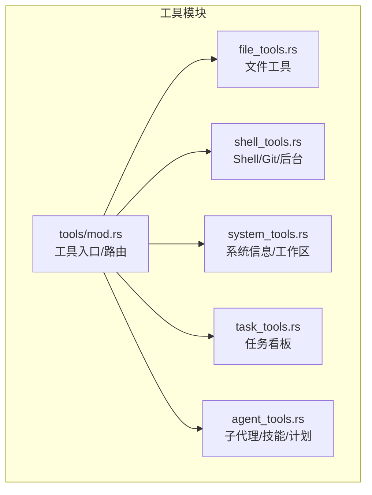
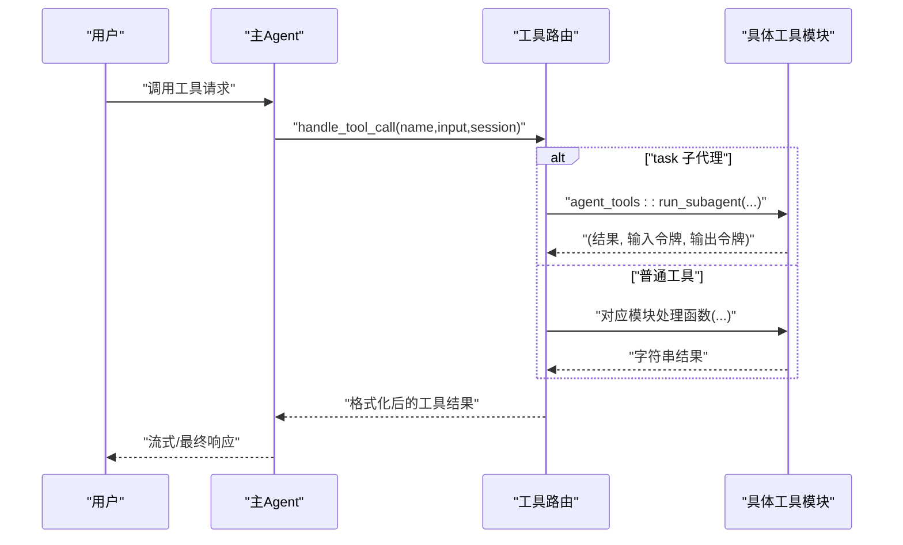
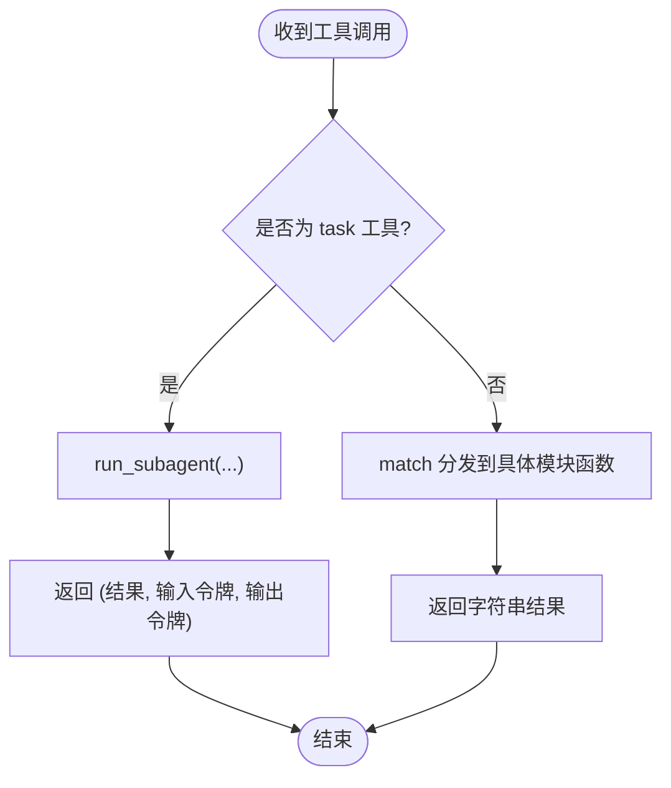
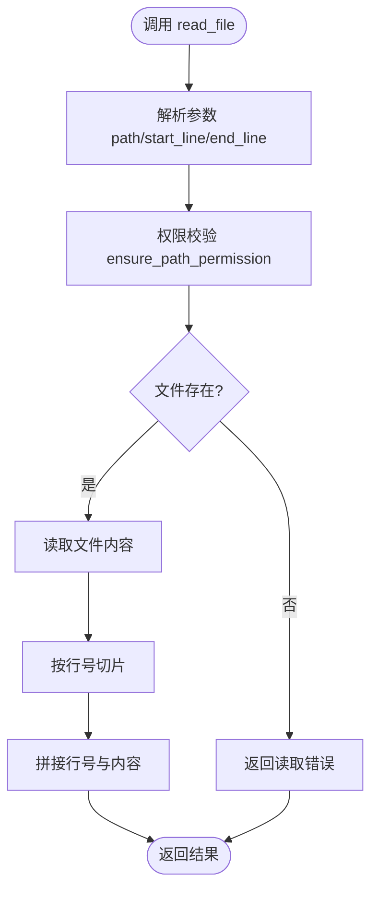
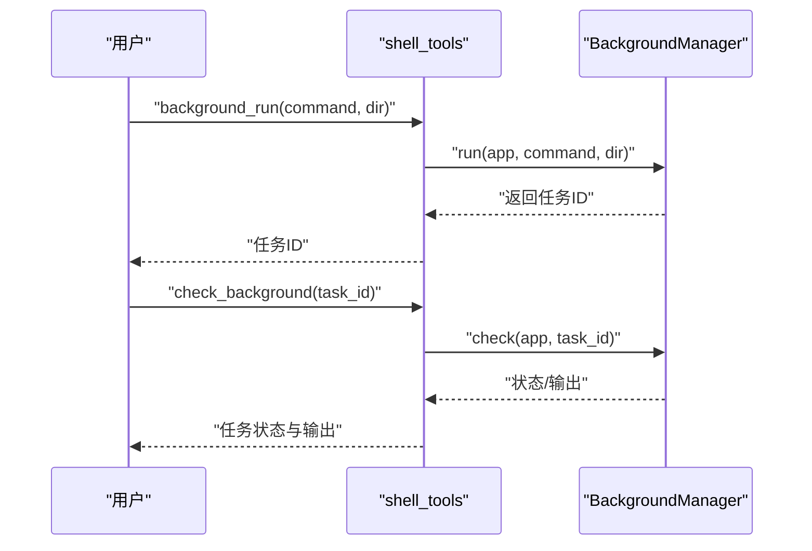
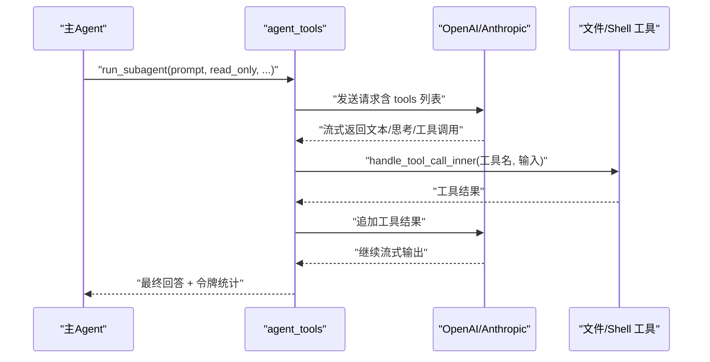
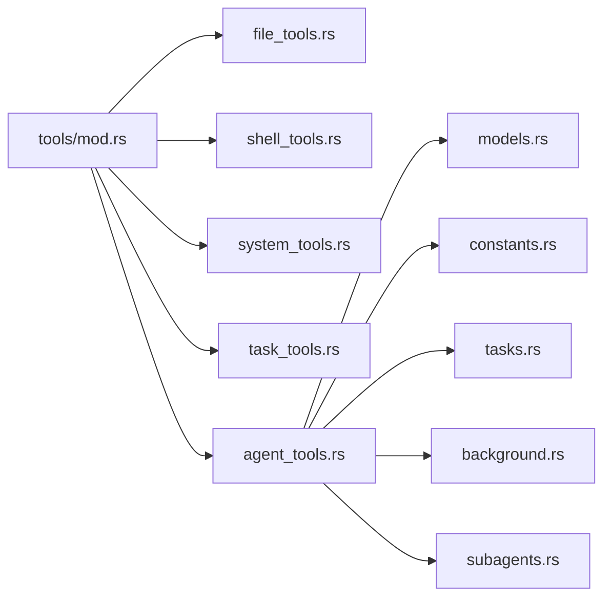

# 工具接口规范

<cite>
**本文档引用的文件**
- [src-tauri/src/core/tools/mod.rs](file://src-tauri/src/core/tools/mod.rs)
- [src-tauri/src/core/tools/agent_tools.rs](file://src-tauri/src/core/tools/agent_tools.rs)
- [src-tauri/src/core/tools/file_tools.rs](file://src-tauri/src/core/tools/file_tools.rs)
- [src-tauri/src/core/tools/shell_tools.rs](file://src-tauri/src/core/tools/shell_tools.rs)
- [src-tauri/src/core/tools/system_tools.rs](file://src-tauri/src/core/tools/system_tools.rs)
- [src-tauri/src/core/tools/task_tools.rs](file://src-tauri/src/core/tools/task_tools.rs)
- [src-tauri/src/core/models.rs](file://src-tauri/src/core/models.rs)
- [src-tauri/src/core/constants.rs](file://src-tauri/src/core/constants.rs)
- [src-tauri/src/core/tasks.rs](file://src-tauri/src/core/tasks.rs)
- [src-tauri/src/core/background.rs](file://src-tauri/src/core/background.rs)
- [src-tauri/src/core/subagents.rs](file://src-tauri/src/core/subagents.rs)
- [README.md](file://README.md)
- [agent/doc/s02-tool-use.md](file://agent/doc/s02-tool-use.md)
</cite>

## 目录
1. [简介](#简介)
2. [项目结构](#项目结构)
3. [核心组件](#核心组件)
4. [架构总览](#架构总览)
5. [详细组件分析](#详细组件分析)
6. [依赖分析](#依赖分析)
7. [性能考虑](#性能考虑)
8. [故障排查指南](#故障排查指南)
9. [结论](#结论)
10. [附录](#附录)

## 简介
本规范系统化定义 JarvisAgent 的工具接口标准，覆盖内置工具的调用方式、参数定义、返回值格式、错误处理机制；阐述工具路由机制（发现、加载、调用）；给出工具开发指南（自定义工具创建、注册、测试）；并提供安全机制、权限控制、资源限制、性能监控与故障恢复策略。目标是帮助开发者在不改动核心 Agent 循环的前提下，安全、稳定地扩展工具能力。

## 项目结构
工具系统位于 Rust 后端 src-tauri 的 core/tools 模块，采用“按功能域划分”的模块化组织：
- tools/mod.rs：工具入口与路由分发
- tools/file_tools.rs：文件读写、搜索、骨架提取
- tools/shell_tools.rs：Shell 命令、Git 只读、后台任务
- tools/system_tools.rs：系统信息、工作区设置
- tools/task_tools.rs：任务看板 CRUD 与报告
- tools/agent_tools.rs：子代理委派、技能加载、上下文压缩、记忆整理、方案审批

图表来源
- [src-tauri/src/core/tools/mod.rs:1-454](file://src-tauri/src/core/tools/mod.rs#L1-L454)
- [src-tauri/src/core/tools/file_tools.rs:1-491](file://src-tauri/src/core/tools/file_tools.rs#L1-L491)
- [src-tauri/src/core/tools/shell_tools.rs:1-222](file://src-tauri/src/core/tools/shell_tools.rs#L1-L222)
- [src-tauri/src/core/tools/system_tools.rs:1-90](file://src-tauri/src/core/tools/system_tools.rs#L1-L90)
- [src-tauri/src/core/tools/task_tools.rs:1-74](file://src-tauri/src/core/tools/task_tools.rs#L1-L74)
- [src-tauri/src/core/tools/agent_tools.rs:1-837](file://src-tauri/src/core/tools/agent_tools.rs#L1-L837)

章节来源
- [src-tauri/src/core/tools/mod.rs:1-454](file://src-tauri/src/core/tools/mod.rs#L1-L454)
- [README.md:107-160](file://README.md#L107-L160)

## 核心组件
- 工具定义与发现
  - 通过 get_tools_definition(intent) 动态生成工具清单，按意图类型（如 PROJECT_ACTION、SUBAGENT、MEMORY_QUERY）返回不同的工具集合，并附带 input_schema（JSON Schema）。
  - 支持加载 skills 目录下的技能文件（SKILL.md），通过 load_all_skills()/parse_skill() 注入到系统提示词中，增强子代理的专业能力。
- 工具路由与调用
  - handle_tool_call() 作为统一入口，区分 task 子代理委派与普通工具调用；后者由 handle_tool_call_inner() 分发到具体模块函数。
  - 子代理 run_subagent() 在独立上下文中循环执行，支持流式输出、工具调用、令牌统计与取消机制。
- 数据模型与常量
  - models.rs 定义 Anthropic/OpenAI 请求/响应结构、消息与内容块、思维配置等。
  - constants.rs 定义最大令牌数、循环上限、后台输出长度限制等关键阈值。

章节来源
- [src-tauri/src/core/tools/mod.rs:23-87](file://src-tauri/src/core/tools/mod.rs#L23-L87)
- [src-tauri/src/core/tools/mod.rs:90-379](file://src-tauri/src/core/tools/mod.rs#L90-L379)
- [src-tauri/src/core/tools/mod.rs:381-453](file://src-tauri/src/core/tools/mod.rs#L381-L453)
- [src-tauri/src/core/models.rs:1-200](file://src-tauri/src/core/models.rs#L1-L200)
- [src-tauri/src/core/constants.rs:1-30](file://src-tauri/src/core/constants.rs#L1-L30)

## 架构总览
工具接口遵循“声明即路由”的设计：每个工具在 tools/mod.rs 中声明其名称、描述与输入模式，调用时由 handle_tool_call_inner() 通过匹配分发到具体实现。子代理通过 agent_tools.rs 的 run_subagent() 在独立上下文中执行，与主对话隔离。

图表来源
- [src-tauri/src/core/tools/mod.rs:381-453](file://src-tauri/src/core/tools/mod.rs#L381-L453)
- [src-tauri/src/core/tools/agent_tools.rs:62-721](file://src-tauri/src/core/tools/agent_tools.rs#L62-L721)

## 详细组件分析

### 工具接口标准
- 工具元数据
  - name: 工具唯一标识符（字符串）
  - description: 工具用途说明（字符串）
  - input_schema: JSON Schema，定义必填字段、类型、枚举与描述
- 能力声明
  - 每个工具在 get_tools_definition() 中声明，按意图动态返回；SUBAGENT 意图下会移除写入类工具以保证只读安全。
- 参数验证
  - 严格依据 input_schema 校验；缺失必填项或类型不符将导致调用失败。
- 结果格式化
  - 返回字符串；子代理场景返回三元组 (最终回答, 输入令牌, 输出令牌)，便于前端展示与计费统计。
- 错误处理
  - 统一捕获系统错误、权限拒绝、路径越权、命令危险等情形，返回明确错误信息；子代理内部集成取消令牌与阶段状态上报。

章节来源
- [src-tauri/src/core/tools/mod.rs:90-379](file://src-tauri/src/core/tools/mod.rs#L90-L379)
- [src-tauri/src/core/models.rs:1-200](file://src-tauri/src/core/models.rs#L1-L200)

### 工具路由机制
- 工具发现
  - 通过 get_tools_definition(intent) 生成工具清单；在 SUBAGENT 意图下过滤掉写入类工具。
- 工具加载
  - 通过 re-export 与模块导入，将各工具模块函数暴露到统一入口。
- 工具调用
  - handle_tool_call_inner() 使用 match 分发到具体实现；task 工具走 run_subagent() 子代理流程。

图表来源
- [src-tauri/src/core/tools/mod.rs:381-453](file://src-tauri/src/core/tools/mod.rs#L381-L453)
- [src-tauri/src/core/tools/agent_tools.rs:62-721](file://src-tauri/src/core/tools/agent_tools.rs#L62-L721)

章节来源
- [src-tauri/src/core/tools/mod.rs:381-453](file://src-tauri/src/core/tools/mod.rs#L381-L453)

### 文件工具族（file_tools）
- read_file(path, start_line?, end_line?)
  - 读取文件内容，支持行号范围；自动处理文件被占用等异常。
- read_file_skeleton(path)
  - 提取文件结构骨架（类/函数/导入等），辅助快速定位。
- write_file(path, content)
  - 写入文件，自动备份旧内容并创建快照；记录操作与差异摘要。
- edit_file(path, old_text, new_text)
  - 基于搜索替换修改文件片段，失败时提示未找到旧文本。
- search_repo(pattern, dir?)
  - 全局关键词搜索，自动忽略 node_modules/target/dist 等目录与二进制文件。
- list_directory(path)
  - 列出目录内容（文件/目录）。
- generate_repo_map/dir 搜索
  - 生成目录树与递归搜索实现。

图表来源
- [src-tauri/src/core/tools/file_tools.rs:44-94](file://src-tauri/src/core/tools/file_tools.rs#L44-L94)

章节来源
- [src-tauri/src/core/tools/file_tools.rs:44-365](file://src-tauri/src/core/tools/file_tools.rs#L44-L365)

### Shell 工具族（shell_tools）
- run_shell(command)
  - 执行 PowerShell 命令；拦截长周期服务启动、查看 node_modules、网络下载等危险行为；在沙箱会话中限制路径与目录切换。
- git_command(args[])
  - 只读 Git 操作（status/diff/log 等），拦截 push/reset 等危险参数；在沙箱中校验路径。
- background_run(command, dir)
  - 后台执行长周期命令，返回任务 ID；自动检测端口与任务类型。
- check_background(task_id?)
  - 查询后台任务状态与输出。

图表来源
- [src-tauri/src/core/tools/shell_tools.rs:184-221](file://src-tauri/src/core/tools/shell_tools.rs#L184-L221)
- [src-tauri/src/core/background.rs:95-200](file://src-tauri/src/core/background.rs#L95-L200)

章节来源
- [src-tauri/src/core/tools/shell_tools.rs:49-221](file://src-tauri/src/core/tools/shell_tools.rs#L49-L221)
- [src-tauri/src/core/background.rs:1-200](file://src-tauri/src/core/background.rs#L1-L200)

### 系统工具族（system_tools）
- get_system_info()
  - 返回 OS/CWD/Home 信息；若处于沙箱会话，显示工作区路径。
- set_workspace(path)
  - 设置全局工作区（仅非沙箱会话可用）；需要用户确认；写入 .jarvis_workspace 记录。

章节来源
- [src-tauri/src/core/tools/system_tools.rs:19-89](file://src-tauri/src/core/tools/system_tools.rs#L19-L89)

### 任务工具族（task_tools）
- task_create(subject, description?)
- task_update(task_id, status?, add_blocked_by?, add_blocks?)
- task_list()
- task_get(task_id)
- task_summary()

章节来源
- [src-tauri/src/core/tools/task_tools.rs:1-74](file://src-tauri/src/core/tools/task_tools.rs#L1-L74)
- [src-tauri/src/core/tasks.rs:1-200](file://src-tauri/src/core/tasks.rs#L1-L200)

### Agent 工具族（agent_tools）
- load_skill(name)
  - 加载 skills 目录下的技能知识（SKILL.md），返回包装后的技能内容。
- compact()
  - 触发上下文压缩。
- dream()
  - 生成任务全景报告，触发记忆整理。
- run_subagent(prompt, read_only, session_id, task_id?, label?)
  - 子代理执行引擎：构建系统提示词、注入技能、循环思考→工具调用→观察→流式输出；支持取消、令牌统计、阶段上报。
- propose_plan(title, content)
  - 提交方案审批，持久化到 .plans 目录并通过前端面板展示。

图表来源
- [src-tauri/src/core/tools/agent_tools.rs:62-721](file://src-tauri/src/core/tools/agent_tools.rs#L62-L721)

章节来源
- [src-tauri/src/core/tools/agent_tools.rs:19-837](file://src-tauri/src/core/tools/agent_tools.rs#L19-L837)
- [src-tauri/src/core/subagents.rs:73-200](file://src-tauri/src/core/subagents.rs#L73-L200)

## 依赖分析
- 模块耦合
  - tools/mod.rs 作为单一入口，聚合各工具模块；子代理依赖 ConfigState、SessionManager、SnapshotRegistry 等状态与服务。
- 外部依赖
  - HTTP 客户端（reqwest）、事件流（EventSource）、Tokio 异步运行时、UUID 生成器。
- 潜在循环依赖
  - 工具模块间无直接循环依赖；子代理通过 handle_tool_call_inner() 间接调用文件/Shell 工具，属于单向依赖。

图表来源
- [src-tauri/src/core/tools/mod.rs:1-454](file://src-tauri/src/core/tools/mod.rs#L1-L454)
- [src-tauri/src/core/tools/agent_tools.rs:1-837](file://src-tauri/src/core/tools/agent_tools.rs#L1-L837)
- [src-tauri/src/core/models.rs:1-200](file://src-tauri/src/core/models.rs#L1-L200)
- [src-tauri/src/core/constants.rs:1-30](file://src-tauri/src/core/constants.rs#L1-L30)
- [src-tauri/src/core/tasks.rs:1-200](file://src-tauri/src/core/tasks.rs#L1-L200)
- [src-tauri/src/core/background.rs:1-200](file://src-tauri/src/core/background.rs#L1-L200)
- [src-tauri/src/core/subagents.rs:1-200](file://src-tauri/src/core/subagents.rs#L1-L200)

章节来源
- [src-tauri/src/core/tools/mod.rs:1-454](file://src-tauri/src/core/tools/mod.rs#L1-L454)

## 性能考虑
- 令牌与上下文
  - MAX_TOKENS_CONTEXT 控制单次请求上下文大小；超过阈值自动压缩。
- 循环限制
  - MAX_AGENT_LOOP_BEFORE_CONFIRM 与 MAX_AGENT_LOOP_ABSOLUTE 限制子代理循环次数，防止无限思考。
- 后台任务
  - background_run 使用异步子进程与流式读取，避免阻塞主线程；输出长度限制 MAX_BACKGROUND_OUTPUT_LEN。
- I/O 与搜索
  - search_repo 限制每页结果数量，避免超大数据集导致内存压力。

章节来源
- [src-tauri/src/core/constants.rs:22-30](file://src-tauri/src/core/constants.rs#L22-L30)
- [src-tauri/src/core/tools/file_tools.rs:308-334](file://src-tauri/src/core/tools/file_tools.rs#L308-L334)
- [src-tauri/src/core/background.rs:95-200](file://src-tauri/src/core/background.rs#L95-L200)

## 故障排查指南
- 工具调用失败
  - 检查 input_schema 是否满足必填字段与类型；查看返回的错误信息（如权限拒绝、路径越权、命令危险）。
- 子代理异常
  - 关注 SubAgentMonitor 的阶段状态（Starting/WaitingModel/Streaming/Thinking/CallingTool/Finalizing）与取消令牌；检查 API Key、Base URL 配置。
- 后台任务
  - 使用 check_background 查询任务状态；注意不要在循环中轮询，避免阻塞。
- 文件操作失败
  - 检查 ensure_path_permission 与沙箱限制；Windows 下文件被占用会返回特定错误信息。

章节来源
- [src-tauri/src/core/tools/agent_tools.rs:160-721](file://src-tauri/src/core/tools/agent_tools.rs#L160-L721)
- [src-tauri/src/core/tools/shell_tools.rs:49-221](file://src-tauri/src/core/tools/shell_tools.rs#L49-L221)
- [src-tauri/src/core/tools/file_tools.rs:44-365](file://src-tauri/src/core/tools/file_tools.rs#L44-L365)
- [src-tauri/src/core/subagents.rs:73-200](file://src-tauri/src/core/subagents.rs#L73-L200)

## 结论
本规范明确了工具接口的声明、路由、调用与结果格式，提供了安全与性能保障策略。通过在 tools/mod.rs 中声明工具并在对应模块实现处理函数，即可在不改动核心循环的前提下扩展能力。建议在新增工具时严格遵循 JSON Schema 参数定义、最小权限原则与资源限制，确保系统稳定与可维护性。

## 附录

### 工具清单与参数（节选）
- 文件工具
  - read_file: path, start_line?, end_line?
  - read_file_skeleton: path
  - write_file: path, content
  - edit_file: path, old_text, new_text
  - list_directory: path
  - search_repo: pattern, dir?
- Shell 工具
  - run_shell: command
  - git_command: args[]
  - background_run: command, dir
  - check_background: task_id?
- 系统工具
  - get_system_info: 无
  - set_workspace: path
- 任务工具
  - task_create: subject, description?
  - task_update: task_id, status?, add_blocked_by?[], add_blocks?[]
  - task_list: 无
  - task_get: task_id
  - task_summary: 无
- Agent 工具
  - task: prompt, read_only?
  - load_skill: name
  - compact: focus?
  - dream: 无
  - propose_plan: title, content

章节来源
- [src-tauri/src/core/tools/mod.rs:90-379](file://src-tauri/src/core/tools/mod.rs#L90-L379)
- [README.md:208-234](file://README.md#L208-L234)

### 工具开发指南
- 创建自定义工具
  - 在 tools/ 下新增模块文件，实现 async 函数 (app, input, session_id) -> 返回字符串或三元组。
  - 在 tools/mod.rs 中：
    - 引入模块：use super::your_module::{your_fn};
    - 在 get_tools_definition() 中添加工具定义与 input_schema；
    - 在 handle_tool_call_inner() 的 match 分支中添加分发。
- 注册与测试
  - 通过 get_tools_definition(intent) 验证工具可见性与参数校验；
  - 使用最小化输入进行单元测试，覆盖正常路径与错误路径（如权限拒绝、路径越权、命令危险）。
- 安全与权限
  - 严格使用 ensure_path_permission/is_within_workspace；
  - 对高危命令（删除、网络下载、服务启动）进行拦截与用户确认；
  - 在沙箱会话中限制路径与目录切换。
- 性能与监控
  - 控制单次输出长度与循环次数；
  - 记录令牌统计与阶段事件，便于前端展示与计费。

章节来源
- [agent/doc/s02-tool-use.md:1-102](file://agent/doc/s02-tool-use.md#L1-L102)
- [src-tauri/src/core/tools/mod.rs:90-379](file://src-tauri/src/core/tools/mod.rs#L90-L379)
- [src-tauri/src/core/tools/agent_tools.rs:62-721](file://src-tauri/src/core/tools/agent_tools.rs#L62-L721)