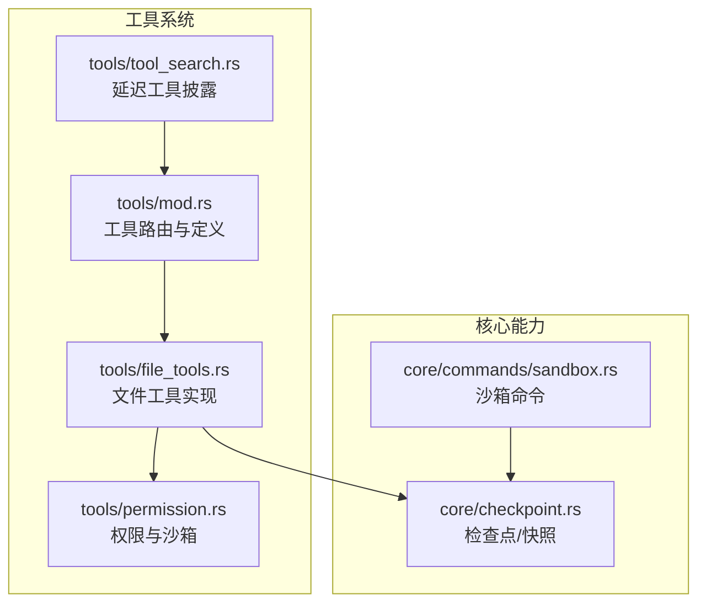
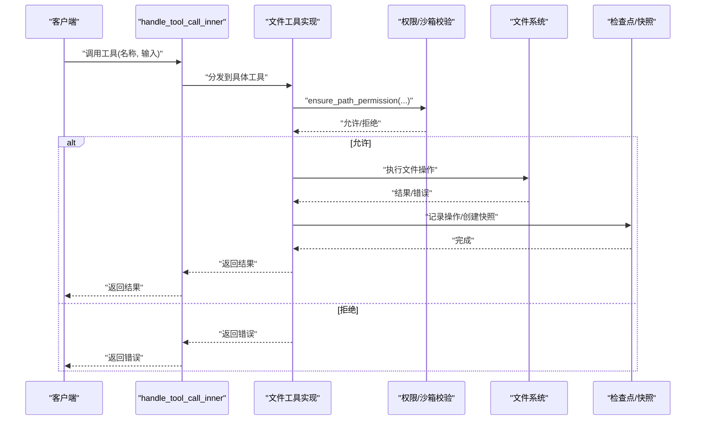
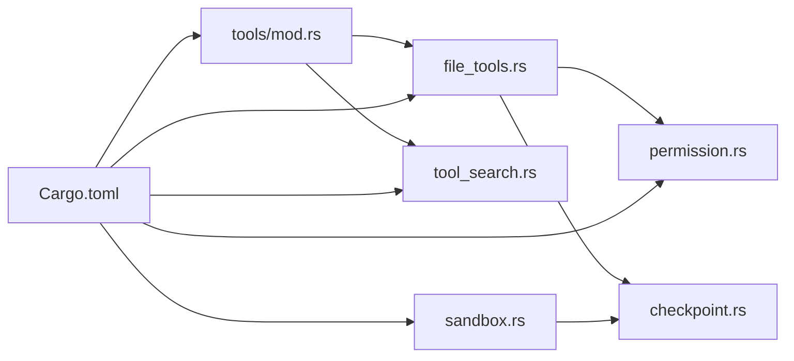
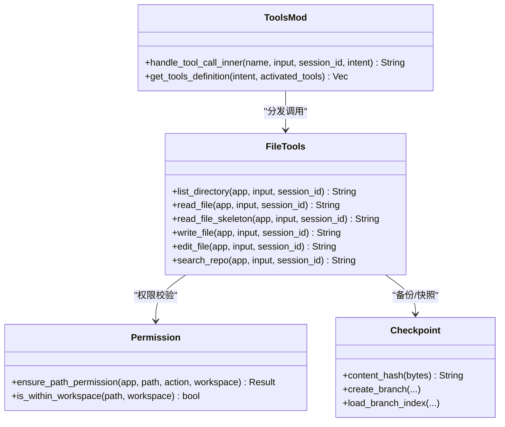

# 文件工具接口

<cite>
**本文引用的文件**
- [file_tools.rs](file://src-tauri/src/core/tools/file_tools.rs)
- [mod.rs](file://src-tauri/src/core/tools/mod.rs)
- [permission.rs](file://src-tauri/src/core/tools/permission.rs)
- [tool_search.rs](file://src-tauri/src/core/tools/tool_search.rs)
- [checkpoint.rs](file://src-tauri/src/core/checkpoint.rs)
- [sandbox.rs](file://src-tauri/src/core/commands/sandbox.rs)
- [Cargo.toml](file://src-tauri/Cargo.toml)
</cite>

## 目录
1. [简介](#简介)
2. [项目结构](#项目结构)
3. [核心组件](#核心组件)
4. [架构总览](#架构总览)
5. [详细组件分析](#详细组件分析)
6. [依赖分析](#依赖分析)
7. [性能考虑](#性能考虑)
8. [故障排查指南](#故障排查指南)
9. [结论](#结论)
10. [附录](#附录)

## 简介
本文件工具接口文档面向开发者与高级用户，系统性地记录了文件相关工具的调用方式、参数定义、返回值格式与错误处理机制；同时阐述了安全机制（路径验证、权限检查、沙箱限制），并提供使用示例、最佳实践与性能优化建议（含大文件处理策略）。主要工具包括：list_directory（列出目录）、read_file（读取文件）、write_file（写入文件）、edit_file（编辑文件）、search_repo（搜索代码）。

## 项目结构
文件工具位于 Rust 后端的工具系统模块中，采用“按功能域划分”的组织方式：
- 工具系统入口与路由：tools/mod.rs
- 文件工具实现：tools/file_tools.rs
- 权限与沙箱：tools/permission.rs
- 工具搜索与延迟披露：tools/tool_search.rs
- 快照与检查点：core/checkpoint.rs
- 沙箱命令：core/commands/sandbox.rs
- 依赖声明：Cargo.toml

图表来源
- [mod.rs:157-236](file://src-tauri/src/core/tools/mod.rs#L157-L236)
- [file_tools.rs:19-41](file://src-tauri/src/core/tools/file_tools.rs#L19-L41)
- [permission.rs:49-72](file://src-tauri/src/core/tools/permission.rs#L49-L72)
- [tool_search.rs:8-45](file://src-tauri/src/core/tools/tool_search.rs#L8-L45)
- [checkpoint.rs:131-150](file://src-tauri/src/core/checkpoint.rs#L131-L150)
- [sandbox.rs:1-73](file://src-tauri/src/core/commands/sandbox.rs#L1-L73)

章节来源
- [mod.rs:157-236](file://src-tauri/src/core/tools/mod.rs#L157-L236)
- [file_tools.rs:19-41](file://src-tauri/src/core/tools/file_tools.rs#L19-L41)
- [permission.rs:49-72](file://src-tauri/src/core/tools/permission.rs#L49-L72)
- [tool_search.rs:8-45](file://src-tauri/src/core/tools/tool_search.rs#L8-L45)
- [checkpoint.rs:131-150](file://src-tauri/src/core/checkpoint.rs#L131-L150)
- [sandbox.rs:1-73](file://src-tauri/src/core/commands/sandbox.rs#L1-L73)

## 核心组件
- 工具路由与分发：handle_tool_call_inner 将工具名映射到具体实现，确保统一入口与意图感知。
- 文件工具族：list_directory、read_file、read_file_skeleton、write_file、edit_file、search_repo。
- 权限与沙箱：ensure_path_permission 实施路径安全与工作区边界检查；沙箱命令提供隔离与发布能力。
- 快照与回滚：write_file/edit_file 自动备份并创建快照，支持差异记录与回滚。
- 延迟工具披露：search_tools 与 get_deferred_tool_definitions 提供按需加载的参数定义。

章节来源
- [mod.rs:187-236](file://src-tauri/src/core/tools/mod.rs#L187-L236)
- [file_tools.rs:43-365](file://src-tauri/src/core/tools/file_tools.rs#L43-L365)
- [permission.rs:49-72](file://src-tauri/src/core/tools/permission.rs#L49-L72)
- [checkpoint.rs:131-150](file://src-tauri/src/core/checkpoint.rs#L131-L150)
- [tool_search.rs:8-45](file://src-tauri/src/core/tools/tool_search.rs#L8-L45)

## 架构总览
文件工具的调用链路如下：前端/上层逻辑通过工具名与输入参数调用 handle_tool_call_inner，内部根据工具名分发至具体实现；实现中先进行权限与沙箱校验，再执行文件系统操作，并在写入/编辑场景下记录检查点与快照。

图表来源
- [mod.rs:187-236](file://src-tauri/src/core/tools/mod.rs#L187-L236)
- [file_tools.rs:43-365](file://src-tauri/src/core/tools/file_tools.rs#L43-L365)
- [permission.rs:49-72](file://src-tauri/src/core/tools/permission.rs#L49-L72)
- [checkpoint.rs:131-150](file://src-tauri/src/core/checkpoint.rs#L131-L150)

## 详细组件分析

### 工具调用总览与参数规范
- 工具注册与路由：工具名到实现的映射在 handle_tool_call_inner 中集中维护，确保新增工具只需在此处注册。
- 延迟工具披露：search_tools 返回匹配工具的简述，随后通过 get_deferred_tool_full_schema 获取完整 JSON Schema，避免一次性暴露全部参数定义。

章节来源
- [mod.rs:187-236](file://src-tauri/src/core/tools/mod.rs#L187-L236)
- [tool_search.rs:8-45](file://src-tauri/src/core/tools/tool_search.rs#L8-L45)
- [tool_search.rs:92-309](file://src-tauri/src/core/tools/tool_search.rs#L92-L309)

### list_directory（列出目录）
- 功能：列出指定路径下的所有文件与目录，标记类型（文件/目录）。
- 输入参数
  - path：字符串，目标目录路径（相对或绝对）。
- 返回值
  - 成功：按行输出“[DIR]/[FILE] 名称”；若目录为空，返回“目录为空”。
  - 失败：返回“读取目录失败: 错误信息”。
- 错误处理
  - 路径不安全或越界：ensure_path_permission 返回错误。
  - 文件系统错误：捕获并返回人类可读错误。
- 性能与限制
  - 无深度限制，遍历所有可见条目；对超大目录建议配合沙箱与工作区限制。

章节来源
- [file_tools.rs:336-365](file://src-tauri/src/core/tools/file_tools.rs#L336-L365)
- [permission.rs:49-72](file://src-tauri/src/core/tools/permission.rs#L49-L72)

### read_file（读取文件）
- 功能：读取文件内容，支持按行号范围输出（语义化点读），避免上下文过长。
- 输入参数
  - path：字符串，必填。
  - start_line：整数，可选，起始行号（从 1 开始）。
  - end_line：整数，可选，结束行号（包含）。
- 返回值
  - 成功：文件头（含总行数与显示范围）+ 行号与内容；若指定行范围，仅输出该范围。
  - 失败：返回“读取错误: ...”，并对常见锁文件/权限错误给出友好提示。
- 错误处理
  - 路径校验：ensure_path_permission。
  - 文件被占用/权限不足：特殊提示“文件可能被其他智能体或程序锁定，请稍后重试”。
- 最佳实践
  - 使用 start_line/end_line 精确读取片段，减少上下文长度。
  - 对二进制或大文件谨慎使用，优先考虑 read_file_skeleton 或分段读取。

章节来源
- [file_tools.rs:43-94](file://src-tauri/src/core/tools/file_tools.rs#L43-L94)
- [permission.rs:49-72](file://src-tauri/src/core/tools/permission.rs#L49-L72)

### read_file_skeleton（提取文件结构骨架）
- 功能：扫描文件，提取函数/类/导入等结构骨架与行号，便于快速定位。
- 输入参数
  - path：字符串，必填。
- 返回值
  - 成功：文件头 + 结构骨架行；若未识别到结构，提示“未提取到明显的结构骨架”。
  - 失败：返回“读取错误: ...”，并做锁文件/权限错误友好提示。
- 适用场景
  - 快速浏览源码结构，配合 read_file 精读片段。

章节来源
- [file_tools.rs:96-146](file://src-tauri/src/core/tools/file_tools.rs#L96-L146)
- [permission.rs:49-72](file://src-tauri/src/core/tools/permission.rs#L49-L72)

### write_file（写入文件）
- 功能：写入文件内容，自动备份原始内容并创建快照，支持创建/覆盖两种行为。
- 输入参数
  - path：字符串，必填。
  - content：字符串，必填。
- 返回值
  - 成功：返回“成功创建/写入 路径”。
  - 失败：返回“写入失败: ...”，并做锁文件/权限错误友好提示。
- 安全与审计
  - 备份：在同分支下生成备份路径，记录旧内容哈希。
  - 快照：创建 Patch(CreateFile/UpdateFile)，记录 diff 概要，触发“snapshot-created”事件。
  - 检查点：记录 FileOperation，包含操作类型、路径、哈希与备份路径。
- 最佳实践
  - 大文件写入前先 read_file_skeleton 确认结构。
  - 修改前先 read_file 验证上下文，避免误改。

章节来源
- [file_tools.rs:148-223](file://src-tauri/src/core/tools/file_tools.rs#L148-L223)
- [checkpoint.rs:131-150](file://src-tauri/src/core/checkpoint.rs#L131-L150)

### edit_file（编辑文件）
- 功能：基于“旧文本 → 新文本”的搜索替换进行局部编辑，自动备份并创建快照。
- 输入参数
  - path：字符串，必填。
  - old_text：字符串，必填，必须存在于文件中。
  - new_text：字符串，必填。
- 返回值
  - 成功：返回“成功编辑 路径”。
  - 失败：返回“编辑失败: 未在 ... 中找到指定的旧文本块”或“编辑并保存失败: ...”。
- 安全与审计
  - 备份：读取原始内容后生成备份。
  - 快照：创建 UpdateFile Patch，记录 diff 概要。
  - 检查点：记录 Edit 操作，包含旧/新内容哈希与备份路径。
- 注意事项
  - old_text 必须完整存在于文件中，否则直接失败。
  - 若文件被占用或权限不足，返回友好提示。

章节来源
- [file_tools.rs:225-305](file://src-tauri/src/core/tools/file_tools.rs#L225-L305)
- [checkpoint.rs:131-150](file://src-tauri/src/core/checkpoint.rs#L131-L150)

### search_repo（搜索代码）
- 功能：在指定目录下递归搜索包含关键词的文本，自动忽略常见二进制与构建产物。
- 输入参数
  - pattern：字符串，必填，搜索关键词。
  - dir：字符串，可选，默认当前工作目录。
- 返回值
  - 成功：每行输出“文件:行号: 匹配行内容”，并在结果过多时截断并提示。
  - 失败：返回“未找到包含 '...' 的内容。”或“读取目录失败: ...”。
- 性能与过滤
  - 限制结果数量（内部 limit 控制），避免过多输出。
  - 自动忽略 node_modules/target/dist/. 开头的目录与常见二进制扩展名。
- 最佳实践
  - 指定 dir 限定搜索范围，避免全盘扫描。
  - 使用更精确的 pattern，减少噪声。

章节来源
- [file_tools.rs:307-334](file://src-tauri/src/core/tools/file_tools.rs#L307-L334)
- [file_tools.rs:432-490](file://src-tauri/src/core/tools/file_tools.rs#L432-L490)

### 安全机制与权限控制
- 路径安全
  - is_path_safe：禁止包含 “..” 遍历。
  - normalize_path：规范化路径，消除中间 “.” 与 “..”。
- 工作区边界
  - is_within_workspace：在沙箱会话中强制要求路径位于工作区内。
  - ensure_path_permission：综合安全检查与工作区边界校验，返回错误或允许。
- 沙箱隔离
  - sandbox_create/list/get/publish/compare：提供多智能体隔离、比较与发布能力。
- 权限请求
  - request_permission：对非沙箱会话的敏感路径访问，可触发前端权限弹窗，支持会话级“允许”。

章节来源
- [permission.rs:12-72](file://src-tauri/src/core/tools/permission.rs#L12-L72)
- [permission.rs:74-102](file://src-tauri/src/core/tools/permission.rs#L74-L102)
- [sandbox.rs:1-73](file://src-tauri/src/core/commands/sandbox.rs#L1-L73)

### 快照与回滚（检查点）
- 内容哈希：content_hash 计算内容哈希，用于差异与回滚。
- 检查点结构：Checkpoint、FileOperation、Branch 等。
- Patch 类型：CreateFile、UpdateFile、Delete、Rename 等。
- 回滚与发布：通过快照管理器完成，支持多智能体沙箱隔离与冲突解决。

章节来源
- [checkpoint.rs:131-150](file://src-tauri/src/core/checkpoint.rs#L131-L150)
- [checkpoint.rs:16-85](file://src-tauri/src/core/checkpoint.rs#L16-L85)
- [checkpoint.rs:152-200](file://src-tauri/src/core/checkpoint.rs#L152-L200)

## 依赖分析
- 工具系统依赖
  - tools/mod.rs 作为入口，依赖各工具模块与权限模块。
  - file_tools.rs 依赖 permission.rs、checkpoint.rs 与快照引擎。
  - tool_search.rs 依赖工具定义与延迟披露机制。
- 外部依赖
  - tauri、serde_json、tokio、reqwest 等，用于事件、序列化、异步与网络适配。

图表来源
- [mod.rs:1-25](file://src-tauri/src/core/tools/mod.rs#L1-L25)
- [file_tools.rs:1-8](file://src-tauri/src/core/tools/file_tools.rs#L1-L8)
- [permission.rs:1-10](file://src-tauri/src/core/tools/permission.rs#L1-L10)
- [tool_search.rs:1-6](file://src-tauri/src/core/tools/tool_search.rs#L1-L6)
- [checkpoint.rs:1-13](file://src-tauri/src/core/checkpoint.rs#L1-L13)
- [sandbox.rs:1-3](file://src-tauri/src/core/commands/sandbox.rs#L1-L3)
- [Cargo.toml:20-41](file://src-tauri/Cargo.toml#L20-L41)

章节来源
- [mod.rs:1-25](file://src-tauri/src/core/tools/mod.rs#L1-L25)
- [file_tools.rs:1-8](file://src-tauri/src/core/tools/file_tools.rs#L1-L8)
- [permission.rs:1-10](file://src-tauri/src/core/tools/permission.rs#L1-L10)
- [tool_search.rs:1-6](file://src-tauri/src/core/tools/tool_search.rs#L1-L6)
- [checkpoint.rs:1-13](file://src-tauri/src/core/checkpoint.rs#L1-L13)
- [sandbox.rs:1-3](file://src-tauri/src/core/commands/sandbox.rs#L1-L3)
- [Cargo.toml:20-41](file://src-tauri/Cargo.toml#L20-L41)

## 性能考虑
- 读取策略
  - read_file 支持行号范围，避免一次性读取大文件导致上下文膨胀。
  - read_file_skeleton 仅扫描结构骨架，适合快速定位。
- 搜索策略
  - search_repo 内部限制结果数量并自动过滤二进制与构建产物，避免无效输出。
  - 建议明确 dir 限定搜索范围。
- 写入与编辑
  - write_file/edit_file 自动备份与快照，便于回滚；对大文件建议先分段读取与增量写入。
  - 避免频繁小粒度写入，尽量批量合并。
- 并发与锁
  - 若文件被占用（锁），工具会返回友好提示，建议重试或等待。
- I/O 优化
  - 使用缓冲与异步 I/O（Rust 异步运行时）提升吞吐。
  - 对只读场景优先使用 read_file/read_file_skeleton，避免不必要的写入。

## 故障排查指南
- 常见错误与提示
  - 路径不安全：包含 “..” 遍历，返回“路径不安全：包含 ‘..’ 遍历”。
  - 越界访问：在沙箱会话中访问工作区外路径，返回“沙箱限制：路径 'X' 不在沙箱目录 'Y' 内”。
  - 文件被占用/权限不足：返回“文件可能被其他智能体或程序锁定，请稍后重试”。
  - 未找到旧文本：edit_file 返回“未在 ... 中找到指定的旧文本块”。
- 排查步骤
  - 确认路径是否为绝对路径或相对于当前工作目录。
  - 在沙箱会话中，确保路径位于工作区内。
  - 检查文件是否被其他进程占用，稍后重试。
  - 对大文件，优先使用行号范围或骨架提取工具。
- 相关实现参考
  - 权限与沙箱：ensure_path_permission、is_within_workspace。
  - 错误提示：read_file/write_file/edit_file/search_repo 的错误分支。

章节来源
- [permission.rs:49-72](file://src-tauri/src/core/tools/permission.rs#L49-L72)
- [file_tools.rs:73-94](file://src-tauri/src/core/tools/file_tools.rs#L73-L94)
- [file_tools.rs:214-222](file://src-tauri/src/core/tools/file_tools.rs#L214-L222)
- [file_tools.rs:285-293](file://src-tauri/src/core/tools/file_tools.rs#L285-L293)
- [file_tools.rs:327-334](file://src-tauri/src/core/tools/file_tools.rs#L327-L334)

## 结论
文件工具接口提供了安全、可观测、可回滚的文件操作能力。通过权限与沙箱机制保障安全边界，借助检查点与快照实现可追溯与可恢复；通过延迟工具披露与行号范围读取优化用户体验与性能。建议在生产环境中遵循最小权限原则、明确工作区边界、合理使用行号范围与骨架提取，并对大文件采取分段与增量策略。

## 附录
- 工具调用流程（类图）

图表来源
- [mod.rs:187-236](file://src-tauri/src/core/tools/mod.rs#L187-L236)
- [file_tools.rs:43-365](file://src-tauri/src/core/tools/file_tools.rs#L43-L365)
- [permission.rs:49-72](file://src-tauri/src/core/tools/permission.rs#L49-L72)
- [checkpoint.rs:131-150](file://src-tauri/src/core/checkpoint.rs#L131-L150)