# 权限工具接口

<cite>
**本文档引用的文件**
- [permission.rs](file://src-tauri/src/core/tools/permission.rs)
- [file_tools.rs](file://src-tauri/src/core/tools/file_tools.rs)
- [permission.rs](file://src-tauri/src/core/commands/permission.rs)
- [state.rs](file://src-tauri/src/core/state.rs)
- [PermissionModal.vue](file://src/components/common/PermissionModal.vue)
- [chat.ts](file://src/stores/chat.ts)
- [permission.ts](file://src/stores/permission.ts)
- [index.ts](file://src/types/index.ts)
- [pathValidation.ts](file://demo/claudecode_tools/PowerShellTool/pathValidation.ts)
- [pathValidation.ts](file://demo/claudecode_tools/BashTool/pathValidation.ts)
</cite>

## 目录
1. [简介](#简介)
2. [项目结构](#项目结构)
3. [核心组件](#核心组件)
4. [架构概览](#架构概览)
5. [详细组件分析](#详细组件分析)
6. [依赖关系分析](#依赖关系分析)
7. [性能考虑](#性能考虑)
8. [故障排除指南](#故障排除指南)
9. [结论](#结论)
10. [附录](#附录)

## 简介

本文件详细记录了 JarvisAgent 项目中的权限工具接口，包括路径安全检查、权限验证和权限申请等核心功能。该权限系统采用多层安全防护机制，结合前端交互界面和后端 Rust 实现，确保对文件系统操作的安全控制。

权限系统主要包含以下核心功能：
- 路径安全检查（is_path_safe）
- 权限验证（ensure_path_permission）
- 用户权限申请（request_permission）
- 沙箱边界控制
- 权限缓存策略
- 安全审计机制

## 项目结构

权限工具接口分布在多个层次中：

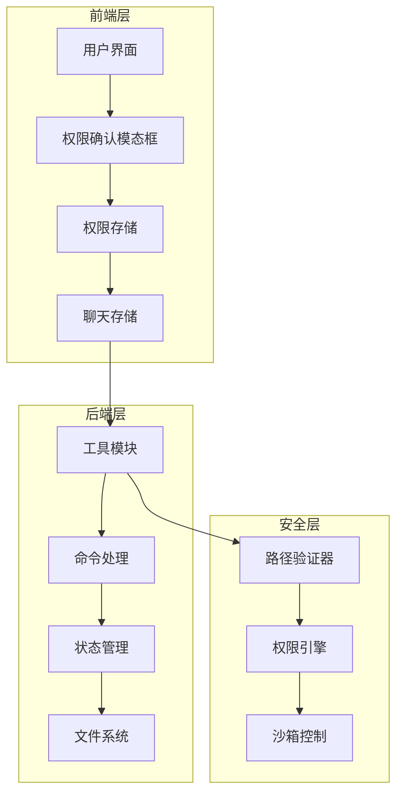

**图表来源**
- [PermissionModal.vue:1-339](file://src/components/common/PermissionModal.vue#L1-L339)
- [chat.ts:309-323](file://src/stores/chat.ts#L309-L323)
- [permission.ts:1-66](file://src/stores/permission.ts#L1-L66)

**章节来源**
- [PermissionModal.vue:1-339](file://src/components/common/PermissionModal.vue#L1-L339)
- [chat.ts:1-658](file://src/stores/chat.ts#L1-L658)
- [permission.ts:1-66](file://src/stores/permission.ts#L1-L66)

## 核心组件

### 路径安全检查组件

路径安全检查是权限系统的第一道防线，主要负责检测潜在的路径遍历攻击。

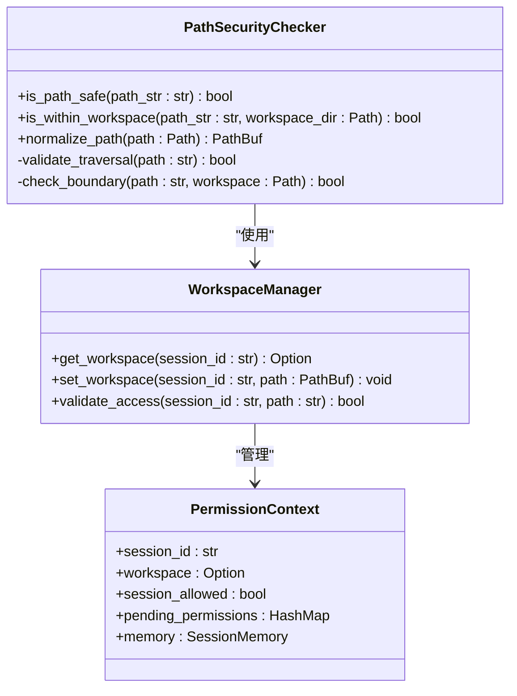

**图表来源**
- [permission.rs:12-47](file://src-tauri/src/core/tools/permission.rs#L12-L47)
- [state.rs:19-41](file://src-tauri/src/core/state.rs#L19-L41)

### 权限验证组件

权限验证组件负责执行具体的权限检查逻辑，包括路径安全验证和沙箱边界检查。

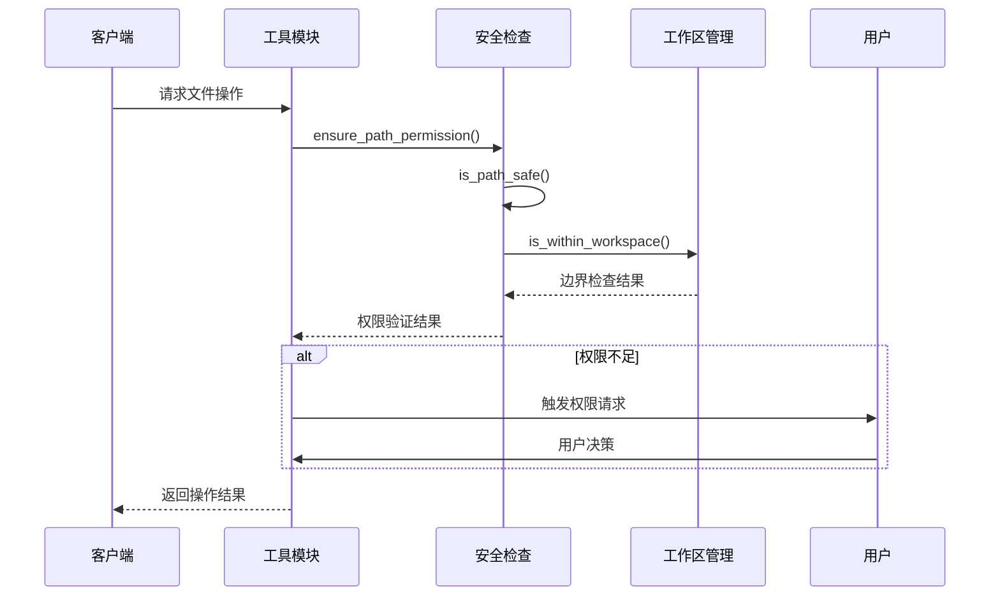

**图表来源**
- [file_tools.rs:44-94](file://src-tauri/src/core/tools/file_tools.rs#L44-L94)
- [permission.rs:49-72](file://src-tauri/src/core/tools/permission.rs#L49-L72)

**章节来源**
- [permission.rs:12-72](file://src-tauri/src/core/tools/permission.rs#L12-L72)
- [file_tools.rs:44-94](file://src-tauri/src/core/tools/file_tools.rs#L44-L94)

## 架构概览

权限系统采用分层架构设计，确保安全性和可扩展性：

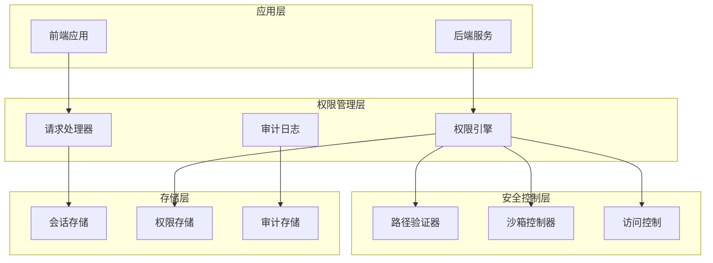

**图表来源**
- [permission.rs:1-43](file://src-tauri/src/core/commands/permission.rs#L1-L43)
- [state.rs:44-77](file://src-tauri/src/core/state.rs#L44-L77)

## 详细组件分析

### 路径安全检查工具

#### is_path_safe 函数

`is_path_safe` 是最基础的路径安全检查函数，用于检测路径中是否包含危险的路径遍历序列。

**函数签名**: `is_path_safe(path_str: &str) -> bool`

**参数定义**:
- `path_str`: 待检查的路径字符串

**返回值**:
- `bool`: 路径是否安全（`true` 表示安全，`false` 表示存在路径遍历风险）

**安全策略**:
- 检测路径中是否包含 `".."` 序列
- 防止相对路径遍历攻击
- 作为所有文件操作的基础安全检查

**实现逻辑**:
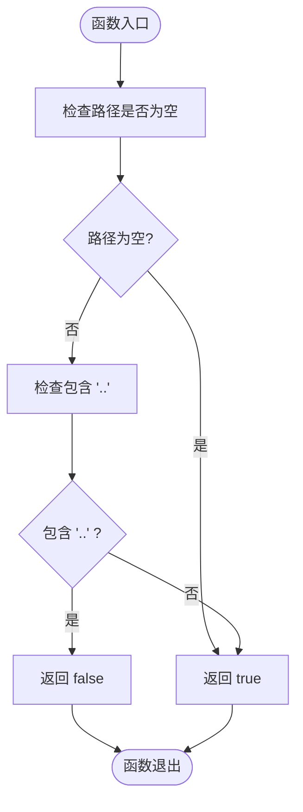

**图表来源**
- [permission.rs:12-14](file://src-tauri/src/core/tools/permission.rs#L12-L14)

#### is_within_workspace 函数

`is_within_workspace` 负责检查路径是否在指定的工作区范围内。

**函数签名**: `is_within_workspace(path_str: &str, workspace_dir: Option<&Path>) -> bool`

**参数定义**:
- `path_str`: 待检查的路径字符串
- `workspace_dir`: 工作区目录（可选）

**返回值**:
- `bool`: 路径是否在工作区内

**安全策略**:
- 对于未设置工作区的情况，始终返回 `true`
- 对于设置了工作区的情况，检查路径是否位于工作区目录内
- 使用标准化路径处理，防止绕过工作区限制

**实现逻辑**:
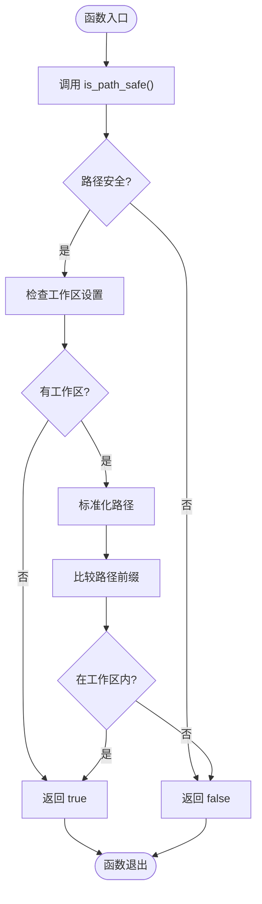

**图表来源**
- [permission.rs:30-47](file://src-tauri/src/core/tools/permission.rs#L30-L47)

**章节来源**
- [permission.rs:12-47](file://src-tauri/src/core/tools/permission.rs#L12-L47)

### 权限验证工具

#### ensure_path_permission 函数

`ensure_path_permission` 是权限验证的核心函数，负责执行完整的权限检查流程。

**函数签名**: `ensure_path_permission(app: &AppHandle, path_str: &str, action: &str, workspace_dir: Option<&Path>) -> Result<(), String>`

**参数定义**:
- `app`: Tauri 应用句柄
- `path_str`: 路径字符串
- `action`: 操作类型（读取、写入、编辑等）
- `workspace_dir`: 工作区目录（可选）

**返回值**:
- `Result<(), String>`: 成功时返回 `Ok(())`，失败时返回错误信息

**安全策略**:
1. 首先执行基础路径安全检查
2. 如果设置了工作区，则执行沙箱边界检查
3. 非沙箱模式下允许最大范围访问
4. 提供详细的错误信息用于用户理解

**实现逻辑**:
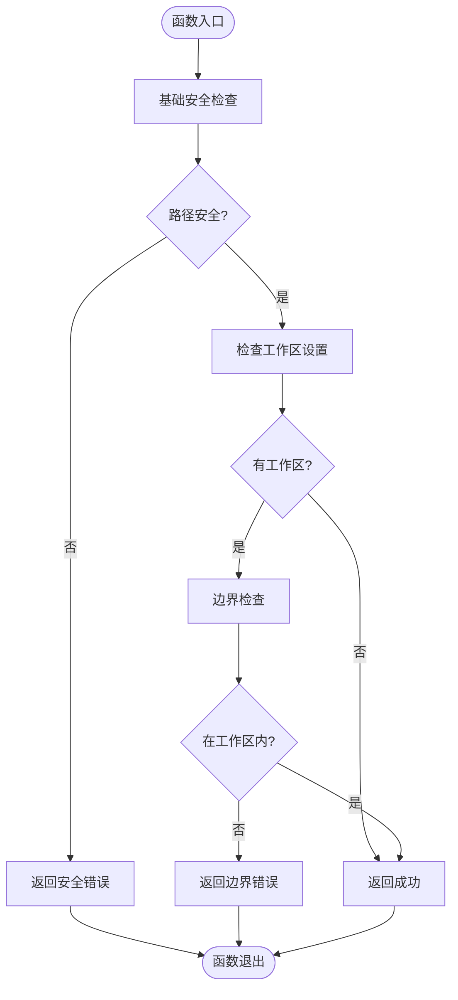

**图表来源**
- [permission.rs:49-72](file://src-tauri/src/core/tools/permission.rs#L49-L72)

**章节来源**
- [permission.rs:49-72](file://src-tauri/src/core/tools/permission.rs#L49-L72)

### 权限申请工具

#### request_permission 函数

`request_permission` 负责处理用户的权限申请流程，提供交互式的权限确认机制。

**函数签名**: `request_permission(app: &AppHandle, session_id: &str, message: &str) -> String`

**参数定义**:
- `app`: Tauri 应用句柄
- `session_id`: 会话标识符
- `message`: 权限申请消息

**返回值**:
- `String`: 用户的决策结果

**决策类型**:
- `"allow_once"`: 仅本次操作允许
- `"allow_session"`: 本次会话内始终允许
- `"reject"`: 拒绝

**实现逻辑**:
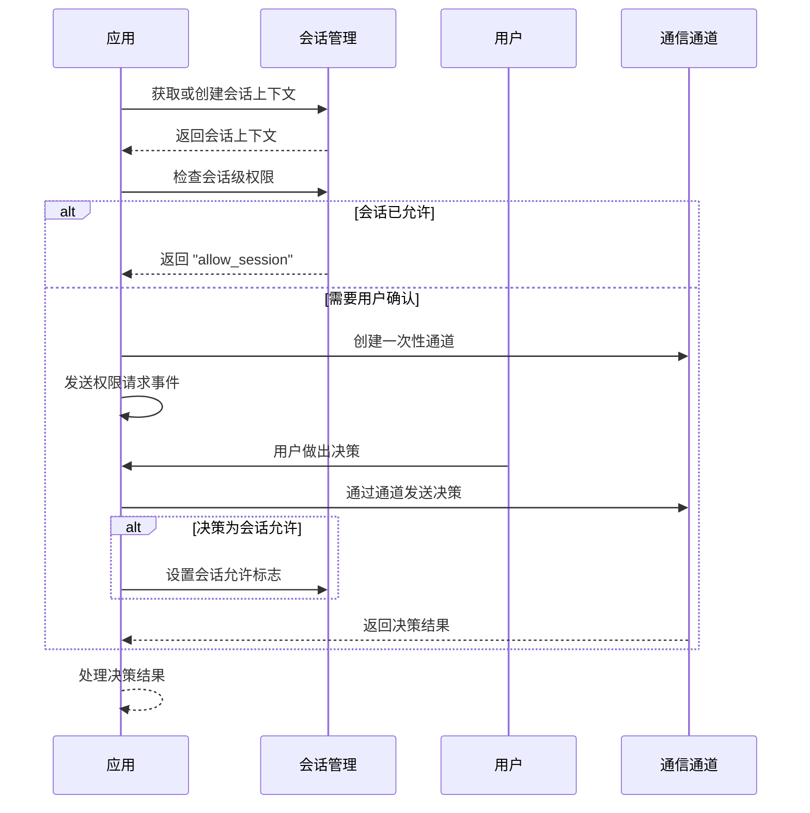

**图表来源**
- [permission.rs:74-102](file://src-tauri/src/core/tools/permission.rs#L74-L102)

**章节来源**
- [permission.rs:74-102](file://src-tauri/src/core/tools/permission.rs#L74-L102)

### 前端权限确认组件

#### PermissionModal 组件

权限确认模态框提供了用户友好的权限申请界面，支持键盘快捷键操作。

**组件特性**:
- 智能消息解析，支持多种消息格式
- 命令内容精简显示，避免界面拥挤
- 支持键盘快捷键：A（允许一次）、S（会话允许）、R/Esc（拒绝）
- 响应式设计，适配不同屏幕尺寸

**消息解析逻辑**:
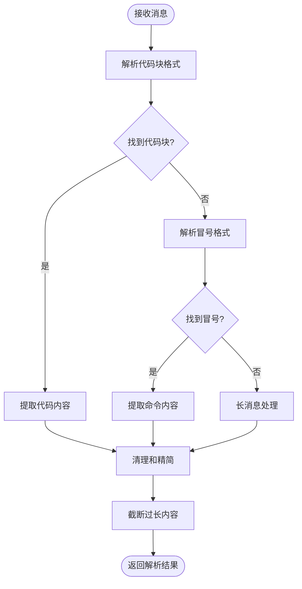

**图表来源**
- [PermissionModal.vue:9-51](file://src/components/common/PermissionModal.vue#L9-L51)

**章节来源**
- [PermissionModal.vue:1-339](file://src/components/common/PermissionModal.vue#L1-L339)

### 文件操作权限集成

#### 文件工具权限集成

文件操作工具集成了权限检查机制，确保所有文件操作都经过适当的权限验证。

**支持的操作类型**:
- `read_file`: 文件读取操作
- `write_file`: 文件写入操作  
- `edit_file`: 文件编辑操作
- `search_repo`: 仓库搜索操作
- `list_directory`: 目录列表操作

**权限检查流程**:
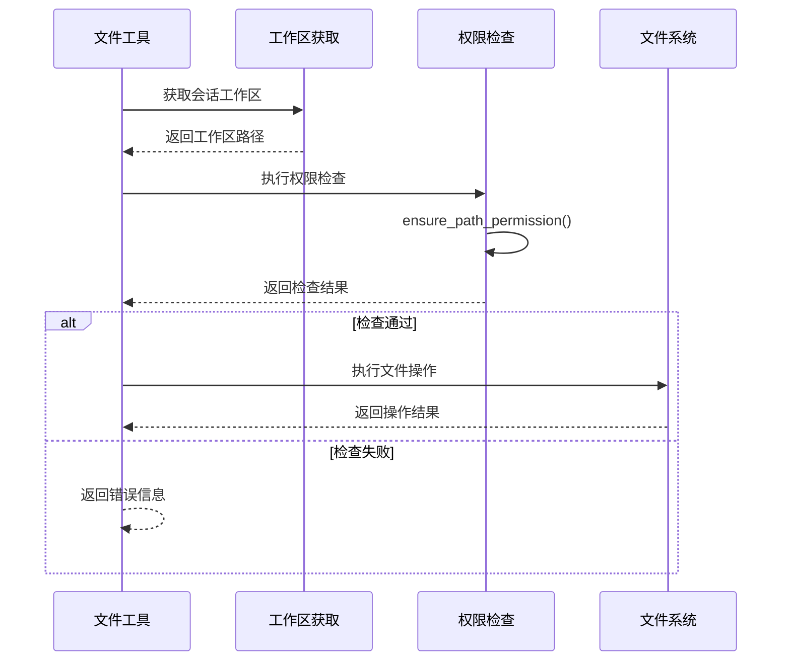

**图表来源**
- [file_tools.rs:44-94](file://src-tauri/src/core/tools/file_tools.rs#L44-L94)

**章节来源**
- [file_tools.rs:44-94](file://src-tauri/src/core/tools/file_tools.rs#L44-L94)

## 依赖关系分析

权限系统各组件之间的依赖关系如下：

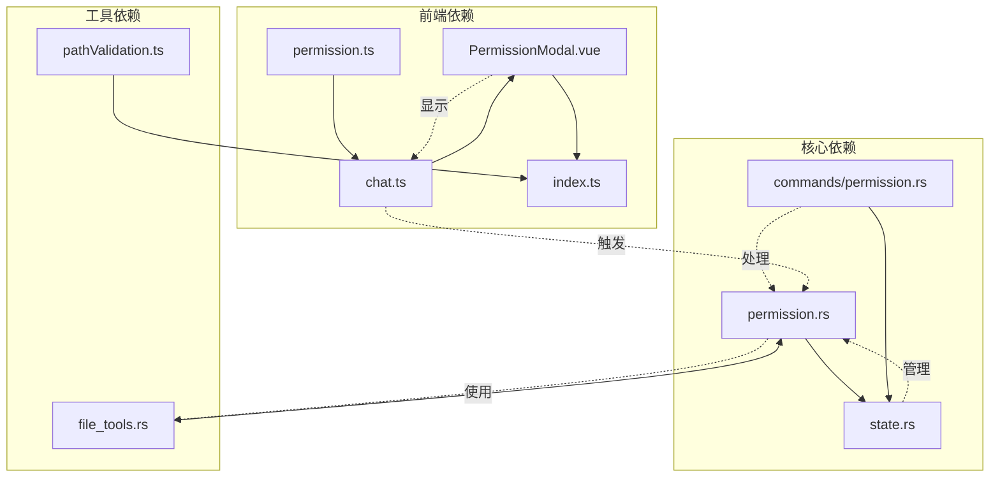

**图表来源**
- [permission.rs:1-103](file://src-tauri/src/core/tools/permission.rs#L1-L103)
- [state.rs:1-78](file://src-tauri/src/core/state.rs#L1-L78)
- [file_tools.rs:1-491](file://src-tauri/src/core/tools/file_tools.rs#L1-L491)

**章节来源**
- [permission.rs:1-103](file://src-tauri/src/core/tools/permission.rs#L1-L103)
- [state.rs:1-78](file://src-tauri/src/core/state.rs#L1-L78)
- [file_tools.rs:1-491](file://src-tauri/src/core/tools/file_tools.rs#L1-L491)

## 性能考虑

权限系统的性能优化策略：

### 缓存策略
- **会话级权限缓存**: 已允许的会话会在内存中缓存权限状态
- **路径规范化缓存**: 标准化后的路径可以重复使用
- **规则匹配缓存**: 权限规则匹配结果可以缓存以提高性能

### 异步处理
- **异步权限检查**: 权限验证采用异步模式，避免阻塞主线程
- **一次性通道**: 使用 Tokio 的 oneshot 通道实现高效的异步通信
- **并发控制**: 通过互斥锁保护共享状态的并发访问

### 内存管理
- **智能指针使用**: 使用 `Arc` 和 `RwLock` 管理共享资源
- **生命周期管理**: 会话上下文具有明确的生命周期
- **资源清理**: 自动清理过期的权限请求和会话数据

## 故障排除指南

### 常见问题及解决方案

#### 权限拒绝错误
**问题**: 文件操作被拒绝
**可能原因**:
- 路径包含 `".."` 序列
- 路径超出工作区范围
- 用户拒绝了权限申请

**解决步骤**:
1. 检查路径是否包含相对路径遍历
2. 验证路径是否在工作区内
3. 查看权限申请历史记录
4. 调整权限设置或重新申请

#### 权限申请无响应
**问题**: 权限申请对话框不显示
**可能原因**:
- 会话状态异常
- 前端事件监听器失效
- 后端权限请求未正确处理

**解决步骤**:
1. 检查会话 ID 是否有效
2. 验证前端事件绑定
3. 查看后端日志输出
4. 重启应用或清理会话状态

#### 沙箱访问问题
**问题**: 沙箱模式下无法访问预期路径
**可能原因**:
- 工作区配置错误
- 路径规范化失败
- 权限规则冲突

**解决步骤**:
1. 验证工作区路径配置
2. 检查路径规范化逻辑
3. 审核权限规则设置
4. 调整沙箱配置

**章节来源**
- [permission.rs:49-72](file://src-tauri/src/core/tools/permission.rs#L49-L72)
- [PermissionModal.vue:54-71](file://src/components/common/PermissionModal.vue#L54-L71)

## 结论

JarvisAgent 的权限工具接口设计了一个多层次、多维度的安全防护体系。通过基础的路径安全检查、严格的沙箱边界控制、灵活的权限申请机制以及完善的前端交互界面，系统能够在保证安全性的同时提供良好的用户体验。

关键优势包括：
- **分层安全设计**: 从路径检查到沙箱控制的多层防护
- **用户友好界面**: 清晰的权限申请流程和反馈机制
- **高性能实现**: 异步处理和缓存策略确保系统响应速度
- **可扩展架构**: 模块化设计便于功能扩展和维护

建议的最佳实践：
- 始终使用 `ensure_path_permission` 进行权限验证
- 合理配置工作区和权限规则
- 及时处理权限申请请求
- 定期审查权限使用日志

## 附录

### API 参考

#### 路径安全检查 API
- `is_path_safe(path_str: &str) -> bool`: 基础路径安全检查
- `is_within_workspace(path_str: &str, workspace_dir: Option<&Path>) -> bool`: 工作区边界检查
- `normalize_path(path: &Path) -> PathBuf`: 路径标准化

#### 权限验证 API
- `ensure_path_permission(app: &AppHandle, path_str: &str, action: &str, workspace_dir: Option<&Path>) -> Result<(), String>`: 完整权限检查
- `request_permission(app: &AppHandle, session_id: &str, message: &str) -> String`: 用户权限申请

#### 文件操作 API
- `read_file(app: &AppHandle, input: &serde_json::Value, session_id: &str) -> String`: 文件读取
- `write_file(app: &AppHandle, input: &serde_json::Value, session_id: &str) -> String`: 文件写入
- `edit_file(app: &AppHandle, input: &serde_json::Value, session_id: &str) -> String`: 文件编辑

### 配置选项

#### 权限规则配置
- `allow`: 明确允许的操作
- `deny`: 明确禁止的操作
- `ask`: 需要用户确认的操作

#### 沙箱配置
- `workspace_dir`: 工作区根目录
- `session_allowed`: 会话级权限状态
- `pending_permissions`: 待处理权限请求

### 安全审计

系统提供完整的权限使用审计功能，包括：
- 权限申请记录
- 用户决策历史
- 操作日志跟踪
- 安全事件监控