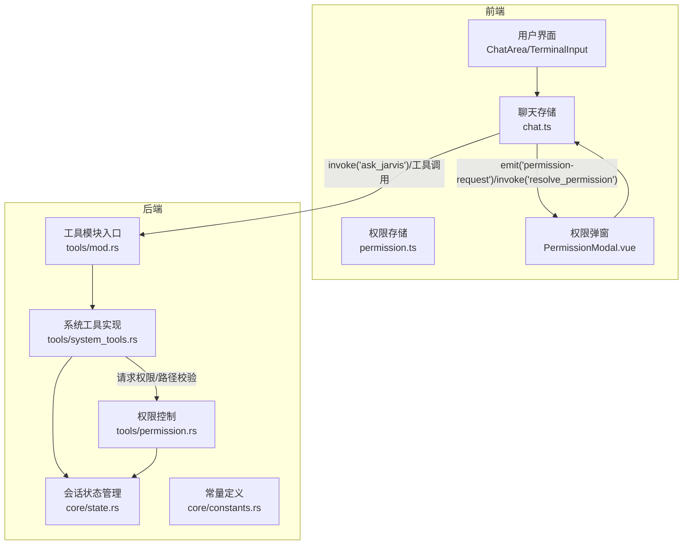
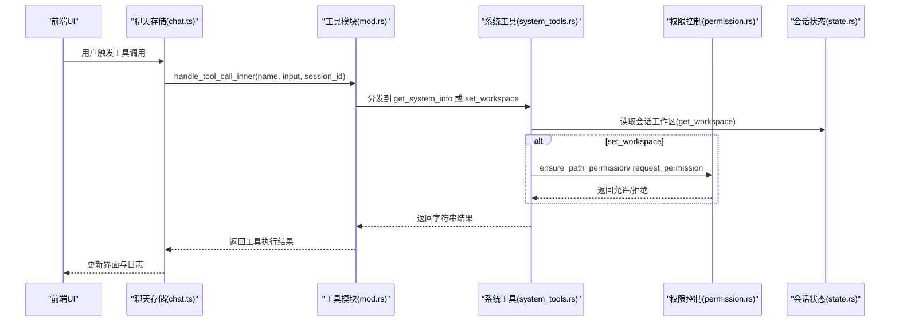
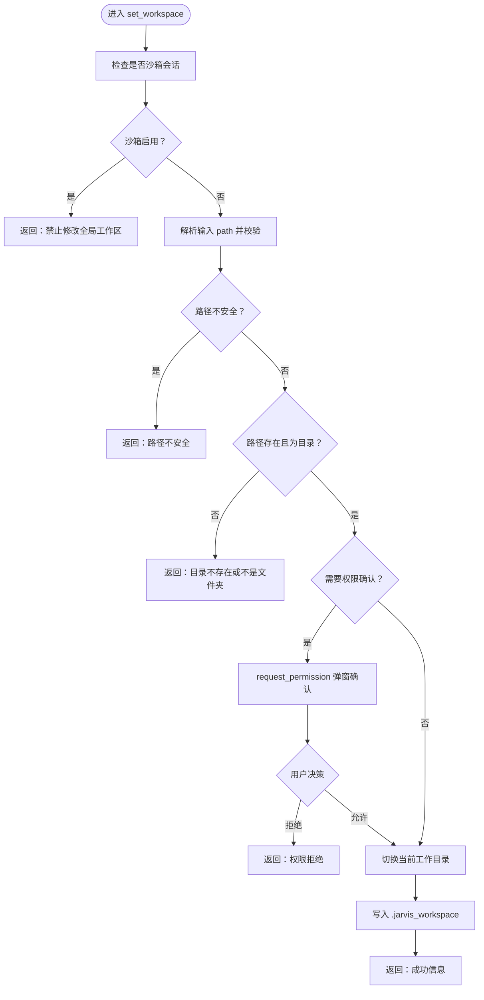
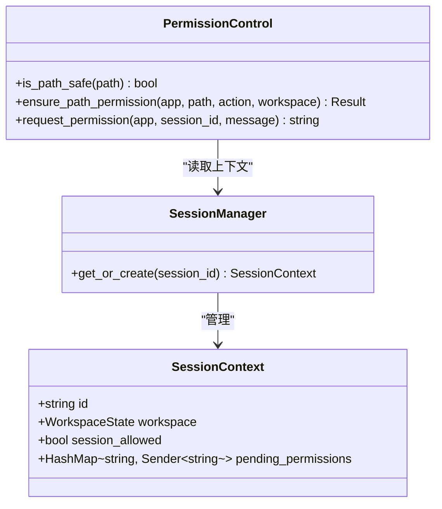
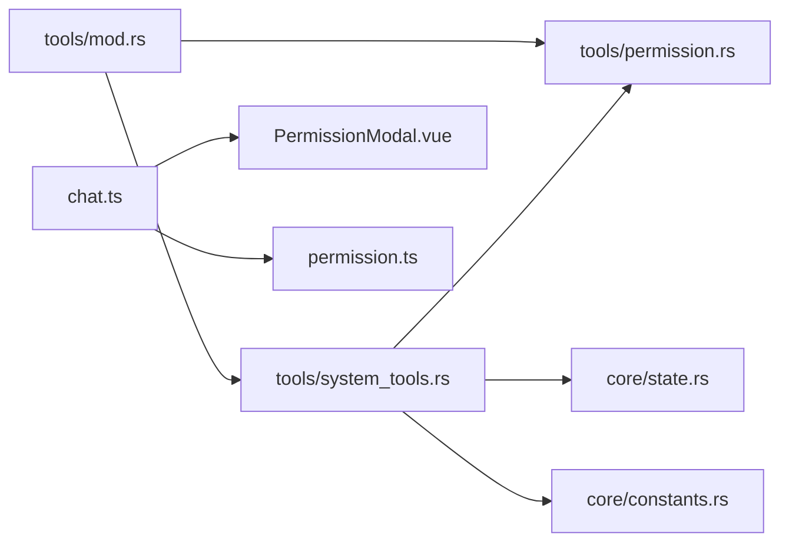

# 系统工具接口

<cite>
**本文档引用的文件**
- [system_tools.rs](file://src-tauri/src/core/tools/system_tools.rs)
- [mod.rs](file://src-tauri/src/core/tools/mod.rs)
- [permission.rs](file://src-tauri/src/core/tools/permission.rs)
- [state.rs](file://src-tauri/src/core/state.rs)
- [constants.rs](file://src-tauri/src/core/constants.rs)
- [PermissionModal.vue](file://src/components/common/PermissionModal.vue)
- [permission.ts](file://src/stores/permission.ts)
- [chat.ts](file://src/stores/chat.ts)
- [tauri.conf.json](file://src-tauri/tauri.conf.json)
</cite>

## 目录
1. [简介](#简介)
2. [项目结构](#项目结构)
3. [核心组件](#核心组件)
4. [架构概览](#架构概览)
5. [详细组件分析](#详细组件分析)
6. [依赖关系分析](#依赖关系分析)
7. [性能考量](#性能考量)
8. [故障排除指南](#故障排除指南)
9. [结论](#结论)
10. [附录](#附录)

## 简介
本文件系统化梳理 JarvisAgent 的系统工具接口，重点覆盖以下能力：
- 获取系统信息：get_system_info
- 设置工作区：set_workspace

文档将详细说明每个工具的参数定义、系统要求、返回值格式、兼容性考虑；阐述权限控制机制（系统信息访问限制、工作区路径验证、环境变量管理）；并提供使用示例与最佳实践。

## 项目结构
系统工具位于 Rust 后端的工具模块中，通过统一的工具路由分发到具体实现，并与前端权限弹窗交互。

**图表来源**
- [mod.rs:158-236](file://src-tauri/src/core/tools/mod.rs#L158-L236)
- [system_tools.rs:18-89](file://src-tauri/src/core/tools/system_tools.rs#L18-L89)
- [permission.rs:74-102](file://src-tauri/src/core/tools/permission.rs#L74-L102)
- [state.rs:44-77](file://src-tauri/src/core/state.rs#L44-L77)
- [permission.ts:6-27](file://src/stores/permission.ts#L6-L27)
- [chat.ts:309-340](file://src/stores/chat.ts#L309-L340)
- [PermissionModal.vue:1-339](file://src/components/common/PermissionModal.vue#L1-L339)

**章节来源**
- [mod.rs:158-236](file://src-tauri/src/core/tools/mod.rs#L158-L236)
- [system_tools.rs:1-90](file://src-tauri/src/core/tools/system_tools.rs#L1-L90)
- [permission.rs:1-103](file://src-tauri/src/core/tools/permission.rs#L1-L103)
- [state.rs:1-78](file://src-tauri/src/core/state.rs#L1-L78)
- [constants.rs:1-30](file://src-tauri/src/core/constants.rs#L1-L30)

## 核心组件
- 工具路由与分发：统一入口 handle_tool_call_inner，按工具名分派到各模块实现。
- 系统工具：get_system_info、set_workspace。
- 权限控制：request_permission、ensure_path_permission、is_path_safe、is_within_workspace。
- 会话状态：SessionManager、SessionContext 维护工作区与权限状态。
- 前端交互：PermissionModal 弹窗展示权限请求，Pinia 存储管理权限状态。

**章节来源**
- [mod.rs:158-236](file://src-tauri/src/core/tools/mod.rs#L158-L236)
- [system_tools.rs:18-89](file://src-tauri/src/core/tools/system_tools.rs#L18-L89)
- [permission.rs:12-102](file://src-tauri/src/core/tools/permission.rs#L12-L102)
- [state.rs:19-77](file://src-tauri/src/core/state.rs#L19-L77)
- [permission.ts:6-66](file://src/stores/permission.ts#L6-L66)
- [chat.ts:309-340](file://src/stores/chat.ts#L309-L340)
- [PermissionModal.vue:1-339](file://src/components/common/PermissionModal.vue#L1-L339)

## 架构概览
系统工具的调用链路如下：

**图表来源**
- [mod.rs:187-236](file://src-tauri/src/core/tools/mod.rs#L187-L236)
- [system_tools.rs:18-89](file://src-tauri/src/core/tools/system_tools.rs#L18-L89)
- [permission.rs:49-102](file://src-tauri/src/core/tools/permission.rs#L49-L102)
- [state.rs:51-76](file://src-tauri/src/core/state.rs#L51-L76)
- [chat.ts:309-340](file://src/stores/chat.ts#L309-L340)

## 详细组件分析

### 工具路由与分发（tools/mod.rs）
- 提供 handle_tool_call_inner，根据工具名分派到具体实现。
- 支持 get_system_info、set_workspace 等系统工具。
- 对 task 工具走子代理分支，其他工具走内部分发。

**章节来源**
- [mod.rs:158-236](file://src-tauri/src/core/tools/mod.rs#L158-L236)

### 系统信息获取（get_system_info）
- 功能：返回操作系统类型、当前工作目录（若存在沙箱则显示沙箱目录）、用户主目录。
- 参数：
  - app: tauri::AppHandle
  - input: serde_json::Value（未使用）
  - session_id: &str
- 行为：
  - 读取 USERPROFILE 环境变量作为 Home。
  - 读取当前进程工作目录。
  - 若会话存在沙箱工作区，则返回“沙箱限制”提示与沙箱路径。
- 返回值：格式化的字符串，包含 OS、CWD/Home 信息。

**章节来源**
- [system_tools.rs:18-43](file://src-tauri/src/core/tools/system_tools.rs#L18-L43)

### 工作区设置（set_workspace）
- 功能：在非沙箱会话中切换全局工作区，并持久化到 Agent 家目录的 .jarvis_workspace 文件。
- 参数：
  - app: tauri::AppHandle
  - input: serde_json::Value（包含 path 字段）
  - session_id: &str
- 行为：
  - 若当前会话已启用沙箱，直接拒绝修改全局工作区。
  - 校验输入 path：
    - 不允许相对路径与父目录遍历（..）。
    - 路径必须存在且为目录。
  - 若目标路径不同于当前目录，触发权限请求（request_permission）。
  - 成功后更新当前进程工作目录，并写入 .jarvis_workspace。
- 返回值：字符串结果（成功/失败/拒绝/不安全等）。

**图表来源**
- [system_tools.rs:46-89](file://src-tauri/src/core/tools/system_tools.rs#L46-L89)
- [permission.rs:74-102](file://src-tauri/src/core/tools/permission.rs#L74-L102)
- [constants.rs:14-15](file://src-tauri/src/core/constants.rs#L14-L15)

**章节来源**
- [system_tools.rs:46-89](file://src-tauri/src/core/tools/system_tools.rs#L46-L89)

### 权限控制机制
- 路径安全检查：
  - is_path_safe：不允许 .. 遍历。
  - ensure_path_permission：在沙箱模式下强制边界检查，拒绝越界访问。
- 会话级权限请求：
  - request_permission：通过事件总线向前端发出 permission-request，等待用户决策（允许一次/本次会话始终允许/拒绝）。
  - 支持 session_allowed 标记，允许本次会话内自动放行。
- 沙箱边界：
  - get_workspace：从 SessionManager 获取当前会话的沙箱工作区。
  - set_workspace：若沙箱启用则禁止修改全局工作区。

**图表来源**
- [state.rs:19-77](file://src-tauri/src/core/state.rs#L19-L77)
- [permission.rs:12-102](file://src-tauri/src/core/tools/permission.rs#L12-L102)

**章节来源**
- [permission.rs:12-102](file://src-tauri/src/core/tools/permission.rs#L12-L102)
- [state.rs:19-77](file://src-tauri/src/core/state.rs#L19-L77)

### 前端权限交互
- PermissionModal：解析后端消息，展示原因与命令详情，支持键盘快捷键（A/S/R）快速决策。
- Pinia permission.ts：维护权限请求与计划提案的状态。
- chat.ts：监听 permission-request 事件，调用 resolve_permission 发送决策回后端。

**章节来源**
- [PermissionModal.vue:1-339](file://src/components/common/PermissionModal.vue#L1-L339)
- [permission.ts:6-66](file://src/stores/permission.ts#L6-L66)
- [chat.ts:309-340](file://src/stores/chat.ts#L309-L340)

## 依赖关系分析
- 工具模块依赖：
  - tools/mod.rs 依赖 tools/system_tools.rs、tools/permission.rs、core/state.rs。
  - system_tools.rs 依赖 permission.rs、state.rs、constants.rs。
- 前后端通信：
  - 前端通过 invoke 调用后端工具与权限决议。
  - 后端通过 emit 触发 permission-request 事件。

**图表来源**
- [mod.rs:1-26](file://src-tauri/src/core/tools/mod.rs#L1-L26)
- [system_tools.rs:1-9](file://src-tauri/src/core/tools/system_tools.rs#L1-L9)
- [permission.rs:1-11](file://src-tauri/src/core/tools/permission.rs#L1-L11)
- [state.rs:1-8](file://src-tauri/src/core/state.rs#L1-L8)
- [constants.rs:1-30](file://src-tauri/src/core/constants.rs#L1-L30)
- [chat.ts:309-340](file://src/stores/chat.ts#L309-L340)
- [permission.ts:6-27](file://src/stores/permission.ts#L6-L27)
- [PermissionModal.vue:1-339](file://src/components/common/PermissionModal.vue#L1-L339)

**章节来源**
- [mod.rs:1-26](file://src-tauri/src/core/tools/mod.rs#L1-L26)
- [system_tools.rs:1-9](file://src-tauri/src/core/tools/system_tools.rs#L1-L9)
- [permission.rs:1-11](file://src-tauri/src/core/tools/permission.rs#L1-L11)
- [state.rs:1-8](file://src-tauri/src/core/state.rs#L1-L8)
- [constants.rs:1-30](file://src-tauri/src/core/constants.rs#L1-L30)
- [chat.ts:309-340](file://src/stores/chat.ts#L309-L340)
- [permission.ts:6-27](file://src/stores/permission.ts#L6-L27)
- [PermissionModal.vue:1-339](file://src/components/common/PermissionModal.vue#L1-L339)

## 性能考量
- 工具调用为同步阻塞操作，建议在 UI 中提供明确的加载状态与节流渲染。
- set_workspace 切换工作目录与写入文件为轻量 IO，通常毫秒级。
- 权限弹窗采用一次性通道（oneshot）等待用户决策，避免轮询开销。
- 前端渲染采用增量更新策略，减少 Markdown 解析压力。

## 故障排除指南
- “路径不安全”：检查输入路径是否包含 .. 或相对路径。
- “目录不存在或不是文件夹”：确认路径存在且为目录。
- “当前会话已配置沙箱，禁止修改全局工作区”：在沙箱会话中无法修改全局工作区，需创建新会话。
- “权限拒绝”：检查前端权限弹窗的决策，必要时选择“本次会话始终允许”。

**章节来源**
- [system_tools.rs:58-88](file://src-tauri/src/core/tools/system_tools.rs#L58-L88)
- [permission.rs:74-102](file://src-tauri/src/core/tools/permission.rs#L74-L102)

## 结论
系统工具接口通过统一路由与严格的权限控制，实现了安全可控的系统信息获取与工作区管理能力。沙箱模式与路径边界检查有效降低了风险；前后端协作的权限弹窗提供了透明的用户决策机制。建议在生产环境中结合 Tauri 的 CSP 与打包配置，进一步强化安全边界。

## 附录

### 使用示例与最佳实践
- 系统信息收集
  - 调用 get_system_info，无需输入参数，返回包含 OS、工作目录（沙箱时标注限制）与 Home 的字符串。
  - 适用场景：诊断、日志采集、环境展示。
- 工作区管理
  - 调用 set_workspace，传入包含 path 的 JSON 对象。
  - 最佳实践：
    - 仅在非沙箱会话中使用；若需要跨目录访问，优先考虑在沙箱内限定路径。
    - 输入路径必须为绝对路径且存在。
    - 遵循权限弹窗流程，避免无授权变更全局工作区。
- 跨平台兼容性
  - get_system_info 读取 USERPROFILE 与当前进程目录，适配 Windows 环境；在其他平台可扩展环境变量映射。
  - set_workspace 严格校验路径安全性，避免跨平台路径差异导致的越界问题。

**章节来源**
- [system_tools.rs:18-89](file://src-tauri/src/core/tools/system_tools.rs#L18-L89)
- [constants.rs:14-15](file://src-tauri/src/core/constants.rs#L14-L15)
- [tauri.conf.json:24-26](file://src-tauri/tauri.conf.json#L24-L26)