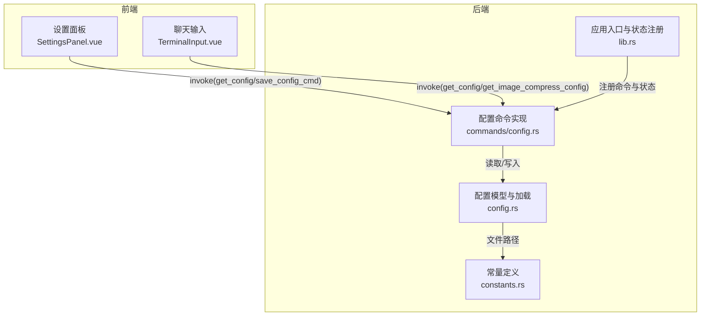
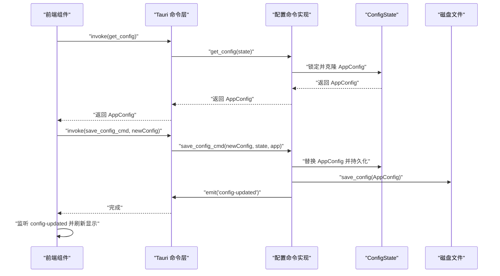
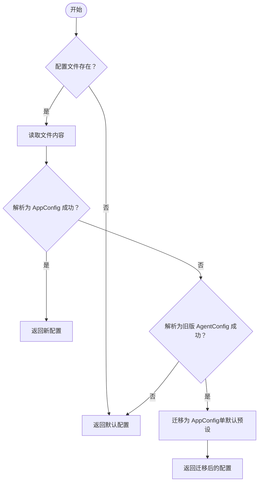
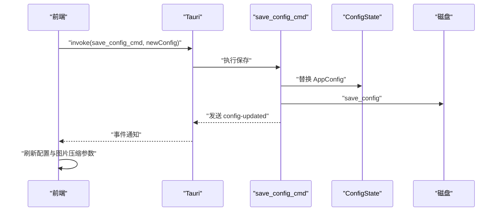
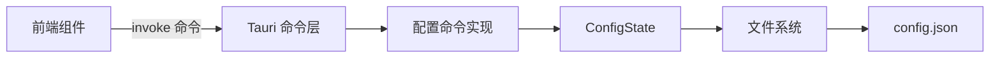

# 配置 API

<cite>
**本文引用的文件**
- [config.rs](file://src-tauri/src/core/config.rs)
- [config 命令实现](file://src-tauri/src/core/commands/config.rs)
- [应用入口与状态注册](file://src-tauri/src/lib.rs)
- [常量定义](file://src-tauri/src/core/constants.rs)
- [设置面板（前端）](file://src/components/settings/SettingsPanel.vue)
- [聊天输入（前端）](file://src/components/chat/TerminalInput.vue)
- [Tauri 配置](file://src-tauri/tauri.conf.json)
- [Cargo 依赖](file://src-tauri/Cargo.toml)
</cite>

## 目录
1. [简介](#简介)
2. [项目结构](#项目结构)
3. [核心组件](#核心组件)
4. [架构总览](#架构总览)
5. [详细组件分析](#详细组件分析)
6. [依赖关系分析](#依赖关系分析)
7. [性能考量](#性能考量)
8. [故障排查指南](#故障排查指南)
9. [结论](#结论)
10. [附录](#附录)

## 简介
本文件系统化地文档化了配置 API 的设计与实现，覆盖以下方面：
- 配置项说明、默认值、验证规则与作用范围
- 配置文件格式、加载优先级与迁移策略
- 配置更新流程（实时通知、保存与生效）
- 配置管理最佳实践（分组、环境区分、敏感信息保护）
- 配置迁移、版本兼容、备份恢复与故障诊断

## 项目结构
配置相关的核心位置集中在后端 Rust 模块与前端 Vue 组件之间，通过 Tauri 命令桥接进行交互。

**图表来源**
- [应用入口与状态注册:88-182](file://src-tauri/src/lib.rs#L88-L182)
- [配置模型与加载:151-201](file://src-tauri/src/core/config.rs#L151-L201)
- [配置命令实现:4-40](file://src-tauri/src/core/commands/config.rs#L4-L40)
- [常量定义:14-20](file://src-tauri/src/core/constants.rs#L14-L20)

**章节来源**
- [应用入口与状态注册:88-182](file://src-tauri/src/lib.rs#L88-L182)
- [配置模型与加载:151-201](file://src-tauri/src/core/config.rs#L151-L201)
- [配置命令实现:4-40](file://src-tauri/src/core/commands/config.rs#L4-L40)
- [常量定义:14-20](file://src-tauri/src/core/constants.rs#L14-L20)

## 核心组件
- 配置模型
  - AppConfig：顶层应用配置，包含活动预设 ID、全局默认预设 ID、以及多个 ModelProfile 列表。
  - ModelProfile：包含预设 ID、名称与 AgentConfig。
  - AgentConfig：单个模型连接与推理参数，涵盖 API 格式、密钥、基础 URL、主/工具模型、推理参数、图片压缩参数等。
- 配置状态与加载
  - ConfigState：全局配置状态（Arc<Mutex<AppConfig>>），由应用入口初始化并注入命令。
  - load_config：从磁盘加载配置，支持从旧版 AgentConfig 迁移。
  - save_config：将配置写回磁盘。
- 前端交互
  - 设置面板：展示与编辑 AppConfig/ModelProfile/AgentConfig，支持新增、切换、删除预设，保存并触发后端持久化。
  - 聊天输入：动态读取当前激活配置与图片压缩参数，监听配置变更事件以刷新界面。

**章节来源**
- [配置模型与加载:12-146](file://src-tauri/src/core/config.rs#L12-L146)
- [配置命令实现:4-40](file://src-tauri/src/core/commands/config.rs#L4-L40)
- [设置面板（前端）:363-532](file://src/components/settings/SettingsPanel.vue#L363-L532)
- [聊天输入（前端）:94-118](file://src/components/chat/TerminalInput.vue#L94-L118)

## 架构总览
配置 API 的调用链路如下：

**图表来源**
- [配置命令实现:4-27](file://src-tauri/src/core/commands/config.rs#L4-L27)
- [配置模型与加载:151-201](file://src-tauri/src/core/config.rs#L151-L201)
- [应用入口与状态注册:93-93](file://src-tauri/src/lib.rs#L93-L93)

**章节来源**
- [配置命令实现:4-27](file://src-tauri/src/core/commands/config.rs#L4-L27)
- [应用入口与状态注册:93-93](file://src-tauri/src/lib.rs#L93-L93)

## 详细组件分析

### 配置数据模型与默认值
- AppConfig
  - active_profile_id：当前激活的预设 ID，默认为 "default"。
  - global_profile_id：全局默认预设 ID，默认为 "default"。
  - profiles：预设列表，默认包含一个名为“默认预设”的预设。
- ModelProfile
  - id/name/config：预设标识、名称与配置对象。
- AgentConfig（默认值）
  - api_format："anthropic"
  - api_key：空字符串
  - base_url：示例基础地址
  - main_model/utility_model："mimo-v2-flash"
  - enable_thinking：false
  - temperature/top_p/top_k：未设置（None）
  - image_max_width/image_max_height：未设置（None）
  - image_quality：未设置（None）

字段校验与规范化
- active_config：根据 api_format 自动补全 base_url 尾部路径（OpenAI 以 "/v1/chat/completions" 结尾，Anthropic 以 "/v1/messages" 结尾）。
- 兼容旧配置：当检测到旧版 AgentConfig 时，自动迁移到 AppConfig 的默认预设。

**章节来源**
- [配置模型与加载:85-146](file://src-tauri/src/core/config.rs#L85-L146)
- [配置模型与加载:52-70](file://src-tauri/src/core/config.rs#L52-L70)
- [配置模型与加载:156-189](file://src-tauri/src/core/config.rs#L156-L189)

### 配置加载与迁移机制
- 文件位置：位于 Agent 主目录下的 config.json。
- 加载流程
  - 若文件不存在，返回默认配置。
  - 优先尝试解析为新版 AppConfig。
  - 若失败，尝试解析为旧版 AgentConfig 并迁移为单个默认预设。
  - 解析失败则返回默认配置。
- 保存流程
  - 创建父目录（如不存在）。
  - 以美化 JSON 写入磁盘。

**图表来源**
- [配置模型与加载:156-189](file://src-tauri/src/core/config.rs#L156-L189)

**章节来源**
- [配置模型与加载:151-201](file://src-tauri/src/core/config.rs#L151-L201)
- [常量定义:14-20](file://src-tauri/src/core/constants.rs#L14-L20)

### 配置更新与实时通知
- 前端调用
  - get_config：获取当前 AppConfig。
  - save_config_cmd：保存新配置并触发后端持久化。
  - get_image_compress_config：获取图片压缩参数（基于当前激活配置）。
- 后端行为
  - 保存成功后，写入磁盘并发出 "config-updated" 事件。
  - 前端监听该事件以刷新界面与能力检测。
- 实时更新效果
  - 聊天输入组件在收到事件后重新加载配置与图片压缩参数。
  - 设置面板在保存后即时同步并提示状态。

**图表来源**
- [配置命令实现:11-27](file://src-tauri/src/core/commands/config.rs#L11-L27)
- [聊天输入（前端）:196-198](file://src/components/chat/TerminalInput.vue#L196-L198)

**章节来源**
- [配置命令实现:4-40](file://src-tauri/src/core/commands/config.rs#L4-L40)
- [聊天输入（前端）:94-118](file://src/components/chat/TerminalInput.vue#L94-L118)

### 前端配置编辑与验证
- 设置面板
  - 支持新增、删除、切换预设。
  - 校验：预设名称、API Base URL、主代理模型、工具代理模型均不能为空。
  - 保存后同步到后端并提示状态。
- 能力检测
  - 输入主代理模型 ID 后延时查询模型能力，用于 UI 展示与引导。
- 聊天输入
  - 动态读取当前激活配置与图片压缩参数。
  - 监听配置更新事件以刷新显示。

**章节来源**
- [设置面板（前端）:363-532](file://src/components/settings/SettingsPanel.vue#L363-L532)
- [聊天输入（前端）:94-118](file://src/components/chat/TerminalInput.vue#L94-L118)

## 依赖关系分析
- Rust 依赖
  - serde/serde_json：序列化/反序列化配置。
  - tokio：异步运行时，配合 Mutex 实现并发安全。
  - dotenvy：加载 .env 环境变量（不影响配置文件，但影响运行时行为）。
- Tauri 插件
  - 窗口状态、文件系统、对话框等插件为应用提供系统级能力，与配置 API 无直接耦合。
- 前后端交互
  - 通过 Tauri 命令桥接，前端以 invoke 方式调用后端命令，后端通过状态与文件系统完成持久化。

**图表来源**
- [Cargo 依赖:20-40](file://src-tauri/Cargo.toml#L20-L40)
- [应用入口与状态注册:93-93](file://src-tauri/src/lib.rs#L93-L93)

**章节来源**
- [Cargo 依赖:20-40](file://src-tauri/Cargo.toml#L20-L40)
- [应用入口与状态注册:93-93](file://src-tauri/src/lib.rs#L93-L93)

## 性能考量
- 配置读取：内存中持有 AppConfig，读取为浅拷贝，开销极低。
- 配置写入：磁盘写入采用美化 JSON，便于人工阅读，I/O 成本可控。
- 并发安全：使用 Arc<Mutex> 保证多线程访问安全。
- 事件驱动：通过事件通知前端刷新，避免轮询带来的资源消耗。

[本节为通用性能讨论，不直接分析具体文件]

## 故障排查指南
- 配置文件损坏
  - 现象：加载失败，回退到默认配置。
  - 处理：检查 config.json 格式，必要时删除以恢复默认。
- 旧版配置迁移
  - 现象：启动时打印迁移日志。
  - 处理：确认迁移后的 AppConfig 是否符合预期。
- 保存失败
  - 现象：前端提示保存失败。
  - 处理：检查磁盘权限与路径，确认后端日志输出。
- 配置未生效
  - 现象：界面未刷新。
  - 处理：确认前端是否监听 "config-updated" 事件并正确刷新。

**章节来源**
- [配置模型与加载:156-189](file://src-tauri/src/core/config.rs#L156-L189)
- [配置命令实现:11-27](file://src-tauri/src/core/commands/config.rs#L11-L27)
- [聊天输入（前端）:196-198](file://src/components/chat/TerminalInput.vue#L196-L198)

## 结论
本配置 API 以简洁的数据模型与清晰的命令接口实现了配置的持久化、迁移与实时更新。前端通过直观的设置面板与聊天输入组件完成配置编辑与即时反馈，后端通过事件机制保障配置变更的传播。整体设计兼顾易用性与可维护性，适合在桌面应用中推广使用。

[本节为总结性内容，不直接分析具体文件]

## 附录

### 配置项说明与默认值一览
- AppConfig
  - active_profile_id：当前激活的预设 ID，默认 "default"
  - global_profile_id：全局默认预设 ID，默认 "default"
  - profiles：预设列表，默认包含一个“默认预设”
- ModelProfile
  - id/name/config：预设标识、名称与配置对象
- AgentConfig（默认值）
  - api_format："anthropic"
  - api_key：空字符串
  - base_url：示例基础地址
  - main_model/utility_model："mimo-v2-flash"
  - enable_thinking：false
  - temperature/top_p/top_k：未设置（None）
  - image_max_width/image_max_height：未设置（None）
  - image_quality：未设置（None）

**章节来源**
- [配置模型与加载:85-146](file://src-tauri/src/core/config.rs#L85-L146)
- [配置模型与加载:52-70](file://src-tauri/src/core/config.rs#L52-L70)

### 验证规则与作用范围
- 前端校验（设置面板）
  - 预设名称非空
  - API Base URL 非空
  - 主代理模型非空
  - 工具代理模型非空
- 后端校验（active_config）
  - 根据 api_format 自动补全 base_url 尾部路径
- 作用范围
  - AppConfig：全局应用配置
  - ModelProfile：按预设隔离
  - AgentConfig：单个模型连接与推理参数

**章节来源**
- [设置面板（前端）:496-513](file://src/components/settings/SettingsPanel.vue#L496-L513)
- [配置模型与加载:110-146](file://src-tauri/src/core/config.rs#L110-L146)

### 配置文件格式、加载优先级与合并策略
- 文件格式：JSON（美化输出）
- 加载优先级
  - 存在则优先解析为 AppConfig
  - 否则尝试解析为旧版 AgentConfig 并迁移
  - 否则返回默认配置
- 合并策略
  - 新版 AppConfig：直接使用
  - 旧版 AgentConfig：迁移为单个默认预设

**章节来源**
- [配置模型与加载:156-189](file://src-tauri/src/core/config.rs#L156-L189)

### 配置更新流程（实时更新、重启生效、配置回滚）
- 实时更新
  - 保存后端持久化并发出 "config-updated" 事件
  - 前端监听事件并刷新界面
- 重启生效
  - 配置文件为持久化介质，重启后从磁盘加载
- 配置回滚
  - 当前实现未提供自动回滚机制，建议通过备份 config.json 实现手动回滚

**章节来源**
- [配置命令实现:11-27](file://src-tauri/src/core/commands/config.rs#L11-L27)
- [聊天输入（前端）:196-198](file://src/components/chat/TerminalInput.vue#L196-L198)

### 配置管理最佳实践
- 配置分组
  - 使用 ModelProfile 将不同场景（开发/生产/测试）拆分为独立预设
- 环境区分
  - 通过不同的 active_profile_id 切换环境，避免混用
- 敏感信息保护
  - API Key 以密码输入框展示，避免明文泄露
  - 建议在 CI/CD 中使用环境变量或密钥管理服务
- 版本兼容与迁移
  - 保持向后兼容，提供迁移逻辑
  - 迁移时打印日志，便于审计
- 备份与恢复
  - 定期备份 config.json
  - 恢复时先停止应用，再替换文件

**章节来源**
- [设置面板（前端）:363-532](file://src/components/settings/SettingsPanel.vue#L363-L532)
- [配置模型与加载:156-189](file://src-tauri/src/core/config.rs#L156-L189)

### 相关文件与入口
- 后端入口与状态注册：[应用入口与状态注册:88-182](file://src-tauri/src/lib.rs#L88-L182)
- 配置命令：[配置命令实现:4-40](file://src-tauri/src/core/commands/config.rs#L4-L40)
- 配置模型与加载：[配置模型与加载:151-201](file://src-tauri/src/core/config.rs#L151-L201)
- 常量定义：[常量定义:14-20](file://src-tauri/src/core/constants.rs#L14-L20)
- 前端设置面板：[设置面板（前端）:363-532](file://src/components/settings/SettingsPanel.vue#L363-L532)
- 前端聊天输入：[聊天输入（前端）:94-118](file://src/components/chat/TerminalInput.vue#L94-L118)
- Tauri 配置：[Tauri 配置:1-40](file://src-tauri/tauri.conf.json#L1-L40)
- 依赖声明：[Cargo 依赖:20-40](file://src-tauri/Cargo.toml#L20-L40)