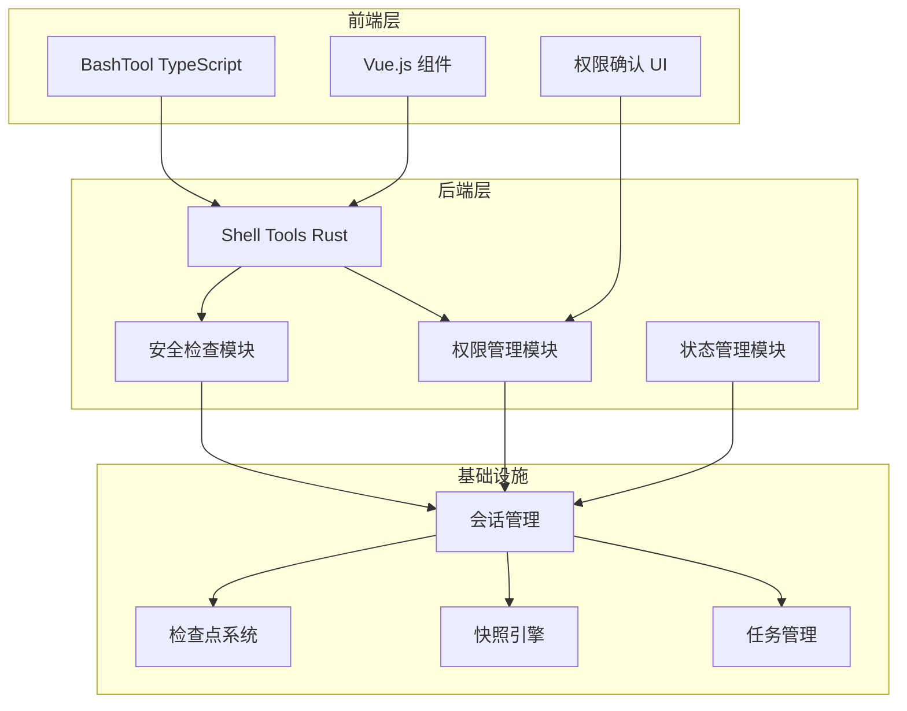
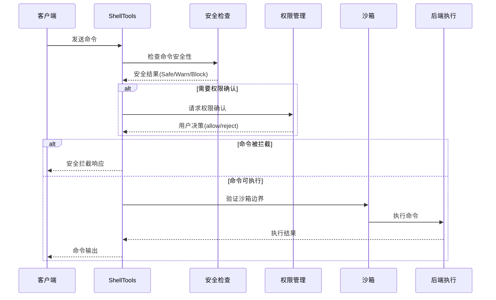
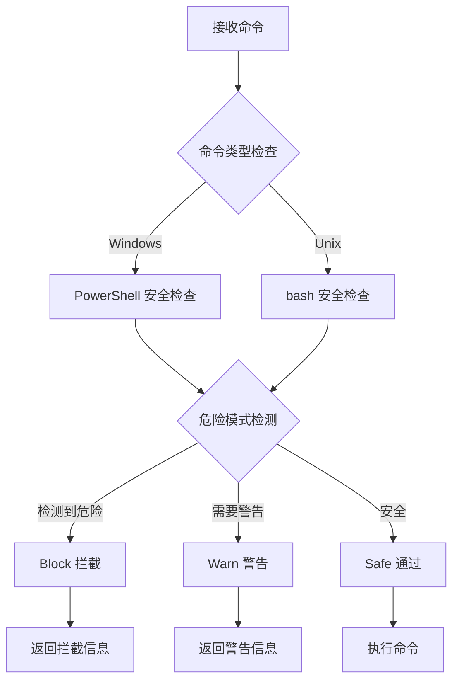
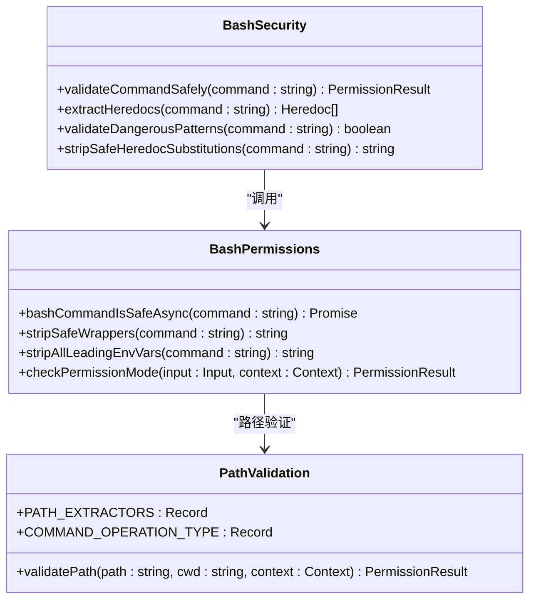
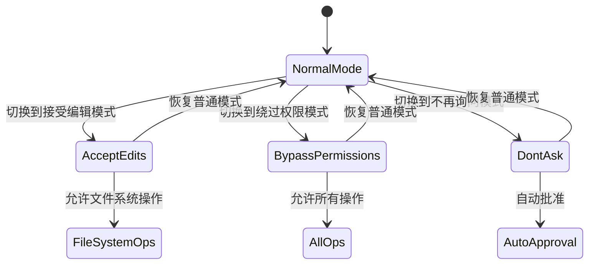
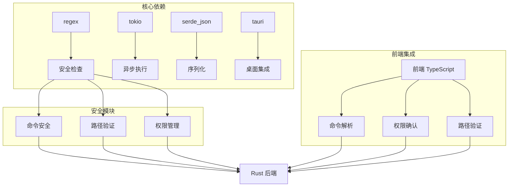

# Shell 安全框架

<cite>
**本文档引用的文件**
- [README.md](file://README.md)
- [main.rs](file://src-tauri/src/main.rs)
- [Cargo.toml](file://src-tauri/Cargo.toml)
- [shell_tools.rs](file://src-tauri/src/core/tools/shell_tools.rs)
- [permission.rs](file://src-tauri/src/core/tools/permission.rs)
- [shell_security.rs](file://src-tauri/src/core/tools/shell_security.rs)
- [bashSecurity.ts](file://demo/claudecode_tools/BashTool/bashSecurity.ts)
- [bashPermissions.ts](file://demo/claudecode_tools/BashTool/bashPermissions.ts)
- [pathValidation.ts](file://demo/claudecode_tools/BashTool/pathValidation.ts)
- [readOnlyValidation.ts](file://demo/claudecode_tools/BashTool/readOnlyValidation.ts)
- [modeValidation.ts](file://demo/claudecode_tools/BashTool/modeValidation.ts)
- [traits.rs](file://src-tauri/src/core/traits.rs)
- [state.rs](file://src-tauri/src/core/state.rs)
- [rules.rs](file://src-tauri/src/core/intent/rules.rs)
- [checkpoint.rs](file://src-tauri/src/core/session/checkpoint.rs)
- [mod.rs](file://src-tauri/src/core/snapshot_engine/mod.rs)
- [tasks.rs](file://src-tauri/src/core/orchestration/tasks.rs)
</cite>

## 目录
1. [简介](#简介)
2. [项目结构](#项目结构)
3. [核心组件](#核心组件)
4. [架构概览](#架构概览)
5. [详细组件分析](#详细组件分析)
6. [依赖关系分析](#依赖关系分析)
7. [性能考虑](#性能考虑)
8. [故障排除指南](#故障排除指南)
9. [结论](#结论)

## 简介

Shell 安全框架是一个基于 Rust 和 TypeScript 的多层安全防护系统，专门设计用于保护 AI 驱动的桌面应用免受恶意 Shell 命令攻击。该框架实现了跨平台的命令安全检查、路径验证、权限管理和沙箱隔离等核心安全功能。

框架的核心特点包括：
- **多层安全防护**：从命令语法分析到路径验证的全方位保护
- **跨平台兼容**：同时支持 Windows PowerShell 和 Unix bash
- **智能权限管理**：基于会话状态的动态权限决策
- **沙箱隔离**：确保命令执行在受控环境中
- **审计追踪**：完整的操作日志和回滚机制

## 项目结构

**图表来源**
- [main.rs:1-23](file://src-tauri/src/main.rs#L1-L23)
- [Cargo.toml:1-42](file://src-tauri/Cargo.toml#L1-L42)

**章节来源**
- [README.md:96-170](file://README.md#L96-L170)
- [main.rs:1-23](file://src-tauri/src/main.rs#L1-L23)
- [Cargo.toml:1-42](file://src-tauri/Cargo.toml#L1-L42)

## 核心组件

### Shell 工具模块
Shell 工具模块提供了统一的命令执行接口，支持同步和异步执行模式：

- **run_shell()**: 主要的命令执行入口，支持平台自动选择
- **git_command()**: 只读 Git 操作工具
- **background_run()**: 后台任务执行
- **check_background()**: 后台任务状态查询

### 安全检查模块
安全检查模块实现了多层次的安全防护：

- **命令语法分析**：检测潜在的恶意命令模式
- **路径安全验证**：防止路径遍历攻击
- **只读命令识别**：自动跳过不需要权限确认的命令
- **破坏性警告**：对高风险操作提供警告信息

### 权限管理模块
权限管理模块提供了细粒度的权限控制：

- **会话级权限**：基于会话状态的权限决策
- **一次性权限**：通过 oneshot channel 实现的阻塞等待
- **权限缓存**：允许会话级别的权限缓存
- **沙箱边界检查**：确保命令在受控工作目录内执行

**章节来源**
- [shell_tools.rs:1-580](file://src-tauri/src/core/tools/shell_tools.rs#L1-L580)
- [permission.rs:1-121](file://src-tauri/src/core/tools/permission.rs#L1-L121)
- [shell_security.rs:1-800](file://src-tauri/src/core/tools/shell_security.rs#L1-L800)

## 架构概览

**图表来源**
- [shell_tools.rs:254-354](file://src-tauri/src/core/tools/shell_tools.rs#L254-L354)
- [permission.rs:89-120](file://src-tauri/src/core/tools/permission.rs#L89-L120)

## 详细组件分析

### Shell 安全检查系统

#### 命令安全分析
安全检查系统实现了多层次的命令分析机制：

**图表来源**
- [shell_security.rs:660-763](file://src-tauri/src/core/tools/shell_security.rs#L660-L763)

#### 跨平台安全策略
框架实现了针对不同操作系统的专门安全策略：

| 平台 | 危险命令检测 | 只读命令白名单 | 特殊防护 |
|------|-------------|---------------|----------|
| Windows | PowerShell cmdlet 检测、COM 对象、计划任务 | PowerShell cmdlet 白名单 | UNC 路径防护 |
| Unix | eval/source 检测、sudo 权限提升 | 外部命令白名单 | 包管理器安装检测 |

**章节来源**
- [shell_security.rs:231-290](file://src-tauri/src/core/tools/shell_security.rs#L231-L290)
- [shell_security.rs:765-800](file://src-tauri/src/core/tools/shell_security.rs#L765-L800)

### TypeScript 前端安全模块

#### Bash 安全分析器
前端 TypeScript 模块提供了与后端 Rust 安全检查相呼应的客户端验证：

**图表来源**
- [bashSecurity.ts:1-800](file://demo/claudecode_tools/BashTool/bashSecurity.ts#L1-L800)
- [bashPermissions.ts:1-800](file://demo/claudecode_tools/BashTool/bashPermissions.ts#L1-L800)
- [pathValidation.ts:1-800](file://demo/claudecode_tools/BashTool/pathValidation.ts#L1-L800)

#### 路径安全验证
路径验证模块实现了严格的路径安全检查：

- **路径规范化**：解析 `.` 和 `..` 组件
- **工作目录限制**：确保路径在沙箱工作目录内
- **危险路径检测**：识别可能造成数据丢失的路径模式
- **权限建议**：为用户提供建议的权限规则

**章节来源**
- [pathValidation.ts:65-108](file://demo/claudecode_tools/BashTool/pathValidation.ts#L65-L108)
- [pathValidation.ts:703-784](file://demo/claudecode_tools/BashTool/pathValidation.ts#L703-L784)

### 权限管理模式

#### 模式验证系统
权限管理模式提供了灵活的权限控制机制：

**图表来源**
- [modeValidation.ts:23-109](file://demo/claudecode_tools/BashTool/modeValidation.ts#L23-L109)

**章节来源**
- [modeValidation.ts:1-116](file://demo/claudecode_tools/BashTool/modeValidation.ts#L1-L116)

### 沙箱和会话管理

#### 会话状态管理
会话管理模块提供了完整的会话生命周期管理：

- **会话上下文**：存储会话相关的状态信息
- **工作空间管理**：跟踪当前工作目录
- **权限缓存**：缓存用户的权限决策
- **内存管理**：管理会话的对话历史

#### 检查点系统
检查点系统提供了文件级的版本控制能力：

- **文件操作记录**：记录所有文件变更操作
- **分支管理**：支持多分支并行开发
- **原子回滚**：支持精确的文件回滚
- **备份管理**：智能的文件备份和恢复

**章节来源**
- [state.rs:1-99](file://src-tauri/src/core/state.rs#L1-L99)
- [checkpoint.rs:1-544](file://src-tauri/src/core/session/checkpoint.rs#L1-L544)

## 依赖关系分析

**图表来源**
- [Cargo.toml:20-40](file://src-tauri/Cargo.toml#L20-L40)

**章节来源**
- [Cargo.toml:1-42](file://src-tauri/Cargo.toml#L1-L42)

## 性能考虑

### 异步执行优化
框架采用了异步执行模型来提高性能：

- **Tokio 运行时**：使用异步 I/O 处理命令执行
- **超时控制**：防止长时间运行的命令阻塞系统
- **并发处理**：支持多个命令的并发执行
- **内存管理**：智能的内存分配和垃圾回收

### 缓存策略
为了提高响应速度，框架实现了多层缓存机制：

- **正则表达式缓存**：懒初始化的正则表达式
- **权限决策缓存**：会话级别的权限决策缓存
- **命令解析缓存**：重复命令的解析结果缓存
- **路径验证缓存**：文件系统状态缓存

## 故障排除指南

### 常见问题诊断

#### 命令执行失败
当遇到命令执行失败时，可以按照以下步骤进行诊断：

1. **检查命令安全性**：确认命令是否被安全检查拦截
2. **验证权限状态**：确认用户是否有足够的权限执行命令
3. **检查沙箱限制**：确认命令是否在允许的工作目录内执行
4. **查看超时设置**：确认命令执行是否超时

#### 权限确认问题
如果权限确认对话框没有出现：

1. **检查会话状态**：确认会话是否处于正确的权限模式
2. **验证权限缓存**：检查是否已经缓存了之前的权限决策
3. **检查前端连接**：确认前端是否正确接收权限请求事件

#### 路径验证错误
当路径验证失败时：

1. **检查路径格式**：确认路径是否符合预期格式
2. **验证工作目录**：确认路径是否在允许的工作目录范围内
3. **检查特殊字符**：确认路径中是否包含不允许的特殊字符

**章节来源**
- [shell_tools.rs:334-354](file://src-tauri/src/core/tools/shell_tools.rs#L334-L354)
- [permission.rs:89-120](file://src-tauri/src/core/tools/permission.rs#L89-L120)

## 结论

Shell 安全框架通过多层安全防护、跨平台兼容性和智能权限管理，为 AI 驱动的应用程序提供了全面的 Shell 命令安全保护。框架的设计充分考虑了易用性和安全性之间的平衡，在保证系统安全的同时，也为用户提供了灵活的使用体验。

主要优势包括：
- **全面的安全防护**：从命令语法到路径验证的全方位保护
- **跨平台兼容**：统一的接口支持多种操作系统
- **智能权限管理**：基于会话状态的动态权限决策
- **审计追踪**：完整的操作日志和回滚机制
- **高性能设计**：异步执行和智能缓存机制

该框架为构建安全可靠的 AI 驱动应用程序奠定了坚实的基础，特别适合需要频繁执行 Shell 命令的企业级应用场景。