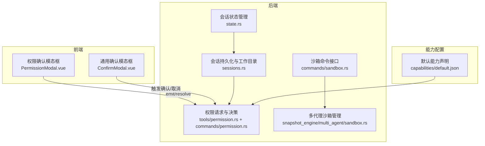
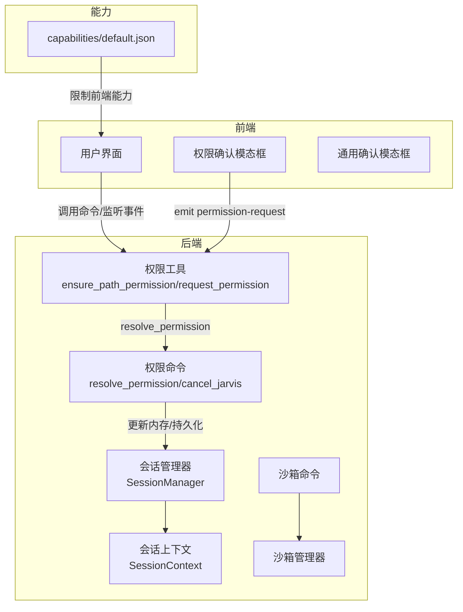
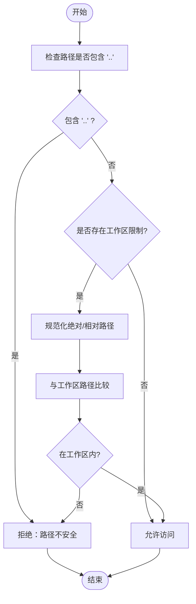
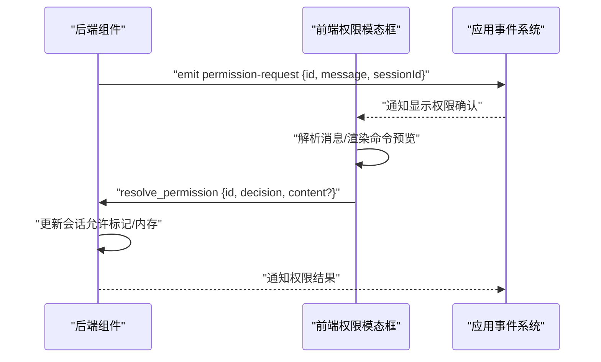
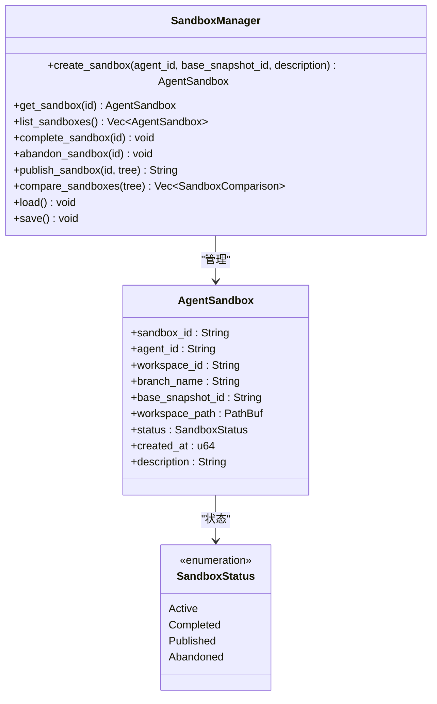
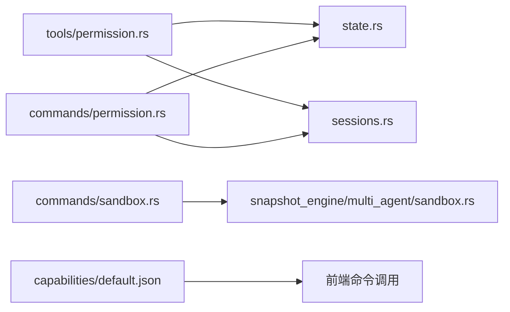

# 安全与权限控制

<cite>
**本文引用的文件**
- [src-tauri/src/core/tools/permission.rs](file://src-tauri/src/core/tools/permission.rs)
- [src-tauri/src/core/commands/permission.rs](file://src-tauri/src/core/commands/permission.rs)
- [src-tauri/src/core/commands/sandbox.rs](file://src-tauri/src/core/commands/sandbox.rs)
- [src-tauri/src/core/state.rs](file://src-tauri/src/core/state.rs)
- [src-tauri/src/core/sessions.rs](file://src-tauri/src/core/sessions.rs)
- [src-tauri/src/core/snapshot_engine/multi_agent/sandbox.rs](file://src-tauri/src/core/snapshot_engine/multi_agent/sandbox.rs)
- [src-tauri/src/core/snapshot_engine/mod.rs](file://src-tauri/src/core/snapshot_engine/mod.rs)
- [src/components/common/PermissionModal.vue](file://src/components/common/PermissionModal.vue)
- [src/components/common/ConfirmModal.vue](file://src/components/common/ConfirmModal.vue)
- [src-tauri/capabilities/default.json](file://src-tauri/capabilities/default.json)
</cite>

## 目录
1. [简介](#简介)
2. [项目结构](#项目结构)
3. [核心组件](#核心组件)
4. [架构总览](#架构总览)
5. [详细组件分析](#详细组件分析)
6. [依赖关系分析](#依赖关系分析)
7. [性能考量](#性能考量)
8. [故障排查指南](#故障排查指南)
9. [结论](#结论)
10. [附录](#附录)

## 简介
本文件面向 JarvisAgent 的安全与权限控制系统，围绕“沙箱机制”与“权限控制”两大主题展开，系统性阐述会话级工作目录限制、路径安全验证、循环检测机制；解释权限控制系统中的用户确认流程、危险操作拦截与 Git 安全限制；并给出访问控制策略、安全边界设计、威胁防护措施、安全配置选项、最佳实践与常见问题解决方案。文档同时提供安全架构图与威胁模型分析，帮助开发者与运维人员快速理解并正确部署与使用。

## 项目结构
本项目采用前后端分离与能力声明相结合的安全架构：
- 后端（Tauri/Rust）负责核心安全策略、会话状态管理、沙箱生命周期与路径边界校验。
- 前端（Vue）负责用户交互与权限确认 UI，通过事件通道与后端通信。
- 能力配置（capabilities）定义最小权限集，避免过度授权。

**图表来源**
- [src/components/common/PermissionModal.vue](file://src/components/common/PermissionModal.vue)
- [src/components/common/ConfirmModal.vue](file://src/components/common/ConfirmModal.vue)
- [src-tauri/src/core/state.rs](file://src-tauri/src/core/state.rs)
- [src-tauri/src/core/sessions.rs](file://src-tauri/src/core/sessions.rs)
- [src-tauri/src/core/tools/permission.rs](file://src-tauri/src/core/tools/permission.rs)
- [src-tauri/src/core/commands/permission.rs](file://src-tauri/src/core/commands/permission.rs)
- [src-tauri/src/core/commands/sandbox.rs](file://src-tauri/src/core/commands/sandbox.rs)
- [src-tauri/src/core/snapshot_engine/multi_agent/sandbox.rs](file://src-tauri/src/core/snapshot_engine/multi_agent/sandbox.rs)
- [src-tauri/capabilities/default.json](file://src-tauri/capabilities/default.json)

**章节来源**
- [src-tauri/src/core/state.rs:17-77](file://src-tauri/src/core/state.rs#L17-L77)
- [src-tauri/src/core/sessions.rs:55-93](file://src-tauri/src/core/sessions.rs#L55-L93)
- [src-tauri/src/core/tools/permission.rs:12-72](file://src-tauri/src/core/tools/permission.rs#L12-L72)
- [src-tauri/src/core/commands/permission.rs:4-70](file://src-tauri/src/core/commands/permission.rs#L4-L70)
- [src-tauri/src/core/commands/sandbox.rs:4-72](file://src-tauri/src/core/commands/sandbox.rs#L4-L72)
- [src-tauri/src/core/snapshot_engine/multi_agent/sandbox.rs:60-107](file://src-tauri/src/core/snapshot_engine/multi_agent/sandbox.rs#L60-L107)
- [src-tauri/capabilities/default.json:6-16](file://src-tauri/capabilities/default.json#L6-L16)

## 核心组件
- 会话状态与工作目录
  - 会话上下文包含工作目录、权限许可标记与待处理权限请求队列，用于在沙箱与非沙箱场景间切换。
- 路径安全与工作区边界
  - 提供路径规范化与工作区外访问拦截逻辑，保障会话级工作目录限制。
- 权限请求与决策
  - 通过事件通道向前端弹出权限确认模态框，支持“拒绝/允许一次/本次会话始终允许”三种决策。
- 沙箱生命周期与 Git 安全
  - 提供沙箱创建、完成、放弃、发布与比较等命令，结合分支与快照树实现变更隔离与可审计性。
- 能力配置
  - 默认能力声明限定最小权限集，避免前端直接访问系统资源。

**章节来源**
- [src-tauri/src/core/state.rs:19-41](file://src-tauri/src/core/state.rs#L19-L41)
- [src-tauri/src/core/sessions.rs:74-77](file://src-tauri/src/core/sessions.rs#L74-L77)
- [src-tauri/src/core/tools/permission.rs:12-72](file://src-tauri/src/core/tools/permission.rs#L12-L72)
- [src-tauri/src/core/commands/sandbox.rs:4-72](file://src-tauri/src/core/commands/sandbox.rs#L4-L72)
- [src-tauri/capabilities/default.json:6-16](file://src-tauri/capabilities/default.json#L6-L16)

## 架构总览
下图展示了安全与权限控制的整体架构：前端通过命令与事件与后端交互；后端在执行敏感操作前进行路径与权限校验；沙箱模块提供隔离与可审计的变更空间；能力配置约束前端可调用的后端能力。

**图表来源**
- [src-tauri/src/core/state.rs:44-77](file://src-tauri/src/core/state.rs#L44-L77)
- [src-tauri/src/core/tools/permission.rs:49-102](file://src-tauri/src/core/tools/permission.rs#L49-L102)
- [src-tauri/src/core/commands/permission.rs:4-70](file://src-tauri/src/core/commands/permission.rs#L4-L70)
- [src-tauri/src/core/commands/sandbox.rs:4-72](file://src-tauri/src/core/commands/sandbox.rs#L4-L72)
- [src-tauri/src/core/snapshot_engine/multi_agent/sandbox.rs:60-107](file://src-tauri/src/core/snapshot_engine/multi_agent/sandbox.rs#L60-L107)
- [src-tauri/capabilities/default.json:6-16](file://src-tauri/capabilities/default.json#L6-L16)

## 详细组件分析

### 组件一：会话级工作目录与路径安全
- 设计要点
  - 会话元数据中包含工作目录字段，用于标识会话级工作区。
  - 路径安全检查禁止包含“..”的遍历序列；路径规范化消除“.”与“..”片段。
  - 在存在工作区限制时，严格校验目标路径是否位于工作区内；非沙箱会话（None）下不做额外拦截。
- 关键流程
  - 创建会话时可传入工作目录；加载会话时恢复工作目录。
  - 执行文件/系统操作前调用路径权限校验，若越界则拒绝。
- 循环检测机制
  - 通过路径规范化与前缀匹配实现循环与越界检测，避免相对路径逃逸。

**图表来源**
- [src-tauri/src/core/tools/permission.rs:12-72](file://src-tauri/src/core/tools/permission.rs#L12-L72)
- [src-tauri/src/core/sessions.rs:74-77](file://src-tauri/src/core/sessions.rs#L74-L77)

**章节来源**
- [src-tauri/src/core/tools/permission.rs:12-72](file://src-tauri/src/core/tools/permission.rs#L12-L72)
- [src-tauri/src/core/sessions.rs:74-77](file://src-tauri/src/core/sessions.rs#L74-L77)

### 组件二：权限请求与用户确认流程
- 设计要点
  - 后端在需要用户确认时，通过事件通道发送“permission-request”，携带会话 ID、请求 ID 与消息内容。
  - 前端权限模态框解析消息，提取原因与命令内容，支持键盘快捷键（A/S/R）快速决策。
  - 决策通过“resolve_permission”命令回传，支持“拒绝/允许一次/本次会话始终允许”。
  - 若用户选择“本次会话始终允许”，后端将标记会话允许，后续同会话内同类请求可自动放行。
- 关键流程
  - 请求生成：分配唯一请求 ID，注册回调等待响应。
  - 前端展示：解析消息并渲染模态框。
  - 决策回传：根据选择构造响应并发送。
  - 自动放行：会话允许标记生效，避免重复弹窗。

**图表来源**
- [src-tauri/src/core/tools/permission.rs:74-102](file://src-tauri/src/core/tools/permission.rs#L74-L102)
- [src-tauri/src/core/commands/permission.rs:5-43](file://src-tauri/src/core/commands/permission.rs#L5-L43)
- [src/components/common/PermissionModal.vue:1-118](file://src/components/common/PermissionModal.vue#L1-L118)

**章节来源**
- [src-tauri/src/core/tools/permission.rs:49-102](file://src-tauri/src/core/tools/permission.rs#L49-L102)
- [src-tauri/src/core/commands/permission.rs:4-70](file://src-tauri/src/core/commands/permission.rs#L4-L70)
- [src/components/common/PermissionModal.vue:7-69](file://src/components/common/PermissionModal.vue#L7-L69)

### 组件三：沙箱机制与 Git 安全
- 设计要点
  - 沙箱以独立工作区与分支隔离变更，支持创建、完成、放弃、发布与比较。
  - 发布前要求沙箱状态为“已完成”，并基于快照树进行合并分支命名与状态更新。
  - 沙箱索引持久化，便于重启后恢复状态。
- 关键流程
  - 创建：生成沙箱 ID、工作区目录与分支名，初始化状态为“Active”。
  - 完成：将状态置为“Completed”，允许后续发布。
  - 放弃：将状态置为“Abandoned”，并删除工作区目录。
  - 发布：校验状态为“Completed”，生成合并分支名并置为“Published”。

**图表来源**
- [src-tauri/src/core/snapshot_engine/multi_agent/sandbox.rs:60-239](file://src-tauri/src/core/snapshot_engine/multi_agent/sandbox.rs#L60-L239)

**章节来源**
- [src-tauri/src/core/commands/sandbox.rs:4-72](file://src-tauri/src/core/commands/sandbox.rs#L4-L72)
- [src-tauri/src/core/snapshot_engine/multi_agent/sandbox.rs:60-175](file://src-tauri/src/core/snapshot_engine/multi_agent/sandbox.rs#L60-L175)

### 组件四：访问控制策略与安全边界
- 访问控制策略
  - 会话级工作目录作为安全边界：非沙箱会话允许最大范围访问；沙箱会话强制边界检查。
  - 路径规范化与越界检测：防止“..”遍历与相对路径逃逸。
  - 权限确认：对潜在危险操作进行用户确认，支持“本次会话始终允许”以提升可用性。
- 安全边界设计
  - 前端能力最小化：通过能力声明限制前端可调用的后端命令与文件系统权限。
  - 会话隔离：不同会话拥有独立上下文与工作目录，避免相互干扰。
- 威胁防护措施
  - 路径攻击：通过规范化与前缀匹配阻断越界访问。
  - 误操作防护：权限确认与取消令牌机制，允许用户随时终止高风险任务。
  - 沙箱隔离：变更在沙箱内隔离，发布前可对比差异，降低生产风险。

**章节来源**
- [src-tauri/src/core/tools/permission.rs:12-72](file://src-tauri/src/core/tools/permission.rs#L12-L72)
- [src-tauri/src/core/state.rs:19-41](file://src-tauri/src/core/state.rs#L19-L41)
- [src-tauri/capabilities/default.json:6-16](file://src-tauri/capabilities/default.json#L6-L16)

## 依赖关系分析
- 组件耦合
  - 权限工具与会话管理器紧密耦合：权限请求依赖会话上下文与内存状态。
  - 沙箱命令与沙箱管理器耦合：命令通过注册表获取会话级管理器实例。
- 外部依赖
  - 能力配置约束前端调用后端命令的能力集合，避免越权访问。
- 潜在风险
  - 若会话工作目录未正确持久化或加载，可能导致边界失效。
  - 权限确认链路中断（如前端未监听事件）会导致任务卡死。

**图表来源**
- [src-tauri/src/core/tools/permission.rs:10-102](file://src-tauri/src/core/tools/permission.rs#L10-L102)
- [src-tauri/src/core/state.rs:44-77](file://src-tauri/src/core/state.rs#L44-L77)
- [src-tauri/src/core/sessions.rs:66-71](file://src-tauri/src/core/sessions.rs#L66-L71)
- [src-tauri/src/core/commands/permission.rs:4-70](file://src-tauri/src/core/commands/permission.rs#L4-L70)
- [src-tauri/src/core/commands/sandbox.rs:4-72](file://src-tauri/src/core/commands/sandbox.rs#L4-L72)
- [src-tauri/src/core/snapshot_engine/multi_agent/sandbox.rs:60-107](file://src-tauri/src/core/snapshot_engine/multi_agent/sandbox.rs#L60-L107)
- [src-tauri/capabilities/default.json:6-16](file://src-tauri/capabilities/default.json#L6-L16)

**章节来源**
- [src-tauri/src/core/state.rs:44-77](file://src-tauri/src/core/state.rs#L44-L77)
- [src-tauri/src/core/sessions.rs:66-71](file://src-tauri/src/core/sessions.rs#L66-L71)
- [src-tauri/src/core/commands/permission.rs:4-70](file://src-tauri/src/core/commands/permission.rs#L4-L70)
- [src-tauri/src/core/commands/sandbox.rs:4-72](file://src-tauri/src/core/commands/sandbox.rs#L4-L72)
- [src-tauri/src/core/snapshot_engine/multi_agent/sandbox.rs:60-107](file://src-tauri/src/core/snapshot_engine/multi_agent/sandbox.rs#L60-L107)
- [src-tauri/capabilities/default.json:6-16](file://src-tauri/capabilities/default.json#L6-L16)

## 性能考量
- 路径检查与规范化
  - 规范化过程涉及路径组件遍历与拼接，建议在高频调用场景下缓存工作区路径与规范化结果，减少重复计算。
- 权限确认
  - 事件通道与一次性通道（oneshot）配合使用，避免阻塞主线程；建议在前端层合并相似请求，减少弹窗频率。
- 沙箱管理
  - 沙箱索引持久化与加载在启动时进行；建议异步加载并延迟初始化，避免影响启动速度。
- 能力配置
  - 能力声明越小越好，减少前端不必要的命令调用，降低 IPC 开销。

## 故障排查指南
- 问题：路径访问被拒绝
  - 排查点：确认路径是否包含“..”；确认工作目录是否设置；确认目标路径是否在工作区内。
  - 解决：移除“..”、调整工作目录或切换到非沙箱会话。
- 问题：权限确认模态框未出现
  - 排查点：确认前端是否监听“permission-request”事件；确认后端是否正确发出事件。
  - 解决：检查前端事件监听与后端事件发射逻辑。
- 问题：会话工作目录丢失
  - 排查点：确认会话元数据持久化与加载逻辑；确认工作目录字段是否正确序列化/反序列化。
  - 解决：修复会话文件读写与元数据映射。
- 问题：沙箱发布失败
  - 排查点：确认沙箱状态是否为“Completed”；确认快照树中是否存在主分支。
  - 解决：先完成沙箱再发布，确保分支存在。

**章节来源**
- [src-tauri/src/core/tools/permission.rs:55-68](file://src-tauri/src/core/tools/permission.rs#L55-L68)
- [src-tauri/src/core/commands/permission.rs:34-42](file://src-tauri/src/core/commands/permission.rs#L34-L42)
- [src-tauri/src/core/sessions.rs:66-71](file://src-tauri/src/core/sessions.rs#L66-L71)
- [src-tauri/src/core/snapshot_engine/multi_agent/sandbox.rs:153-175](file://src-tauri/src/core/snapshot_engine/multi_agent/sandbox.rs#L153-L175)

## 结论
JarvisAgent 的安全与权限控制体系以“会话级工作目录+路径安全校验+权限确认+沙箱隔离+能力最小化”为核心，既保证了易用性，又有效降低了风险。通过规范化的路径处理、严格的边界检查与可审计的沙箱机制，系统能够在复杂任务场景下提供可控、透明且可追溯的安全保障。建议在实际部署中结合能力配置与会话策略，持续优化权限确认体验与沙箱发布流程。

## 附录
- 安全配置选项
  - 会话工作目录：在创建会话时设置，用于启用沙箱模式。
  - 能力声明：通过能力文件限制前端可调用命令与文件系统权限。
- 最佳实践
  - 默认启用沙箱模式，除非明确需要全局访问。
  - 对高危操作统一走权限确认流程，避免静默执行。
  - 定期审查沙箱状态与差异，及时发布或放弃。
- 威胁模型
  - 路径遍历攻击：通过规范化与前缀匹配阻断。
  - 误操作风险：通过权限确认与取消令牌缓解。
  - 权限滥用：通过能力最小化与会话隔离降低影响面。