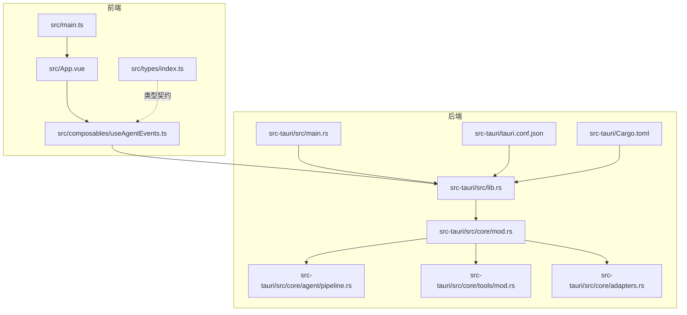
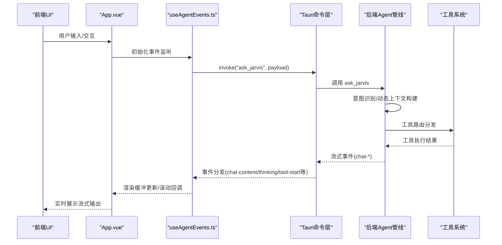
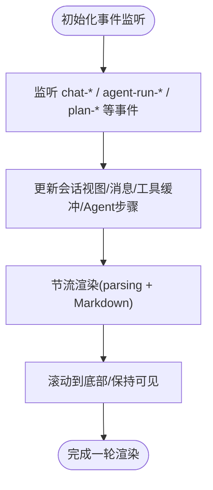
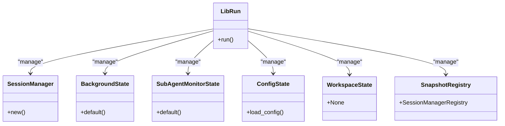
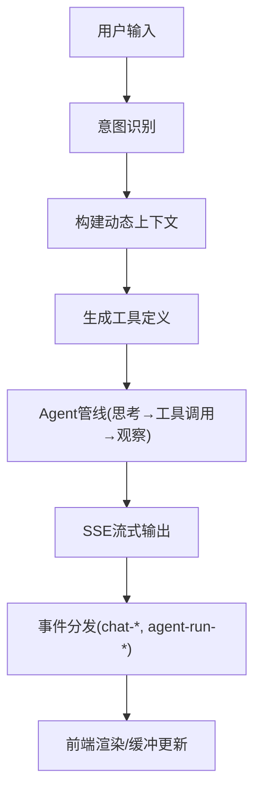
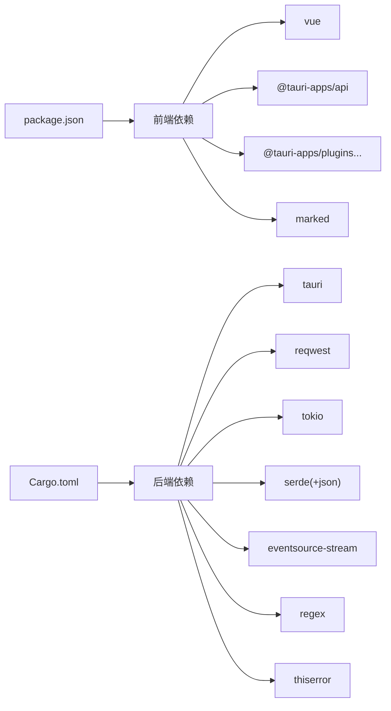

# 开发指南

<cite>
**本文引用的文件**
- [README.md](file://README.md)
- [CLAUDE.md](file://CLAUDE.md)
- [package.json](file://package.json)
- [vite.config.ts](file://vite.config.ts)
- [tsconfig.json](file://tsconfig.json)
- [tsconfig.node.json](file://tsconfig.node.json)
- [src/main.ts](file://src/main.ts)
- [src/App.vue](file://src/App.vue)
- [src/composables/useAgentEvents.ts](file://src/composables/useAgentEvents.ts)
- [src/types/index.ts](file://src/types/index.ts)
- [src-tauri/src/lib.rs](file://src-tauri/src/lib.rs)
- [src-tauri/src/main.rs](file://src-tauri/src/main.rs)
- [src-tauri/Cargo.toml](file://src-tauri/Cargo.toml)
- [src-tauri/tauri.conf.json](file://src-tauri/tauri.conf.json)
- [src-tauri/src/core/mod.rs](file://src-tauri/src/core/mod.rs)
- [src-tauri/src/core/agent/pipeline.rs](file://src-tauri/src/core/agent/pipeline.rs)
- [src-tauri/src/core/tools/mod.rs](file://src-tauri/src/core/tools/mod.rs)
- [src-tauri/src/core/adapters.rs](file://src-tauri/src/core/adapters.rs)
- [src-tauri/model_registry.json](file://src-tauri/model_registry.json)
</cite>

## 更新摘要
**所做更改**
- 更新开发工作流程章节，反映新的 pnpm tauri dev、pnpm build、pnpm tauri build、cargo test 命令
- 更新开发环境设置，强调 Tauri 2.0 + pnpm 的新工作流程
- 更新构建配置说明，反映 pnpm 包管理器和 Tauri CLI 的使用
- 更新测试策略，明确 cargo test 的 Rust 测试执行方式

## 目录
1. [简介](#简介)
2. [项目结构](#项目结构)
3. [核心组件](#核心组件)
4. [架构总览](#架构总览)
5. [详细组件分析](#详细组件分析)
6. [依赖分析](#依赖分析)
7. [性能考虑](#性能考虑)
8. [故障排查指南](#故障排查指南)
9. [结论](#结论)
10. [附录](#附录)

## 简介
本指南面向 JarvisAgent 的开发者，覆盖开发环境搭建、IDE 配置、调试与热重载、代码规范、调试技巧、测试策略、构建配置、性能分析与错误诊断，以及贡献流程与代码审查标准。项目采用 Vue 3 + TypeScript 前端与 Tauri 2.0 + Rust 后端的混合架构，支持多模型、多工具、子代理委派与方案审批等企业级 Agent 能力。

**更新** 新的开发工作流程已采用 pnpm 包管理器和 Tauri CLI，提供更高效的开发体验和构建流程。

## 项目结构
项目分为前端与后端两大部分：
- 前端：Vue 3 + TypeScript，Vite 构建，Tauri 集成，事件驱动与状态管理集中在 Composables 中。
- 后端：Rust + Tokio 异步运行时，Tauri 插件生态，统一通过命令注册暴露给前端调用。



**图表来源**
- [src/main.ts:1-6](file://src/main.ts#L1-L6)
- [src/App.vue:1-276](file://src/App.vue#L1-L276)
- [src/composables/useAgentEvents.ts:1-800](file://src/composables/useAgentEvents.ts#L1-L800)
- [src/types/index.ts:1-365](file://src/types/index.ts#L1-L365)
- [src-tauri/src/lib.rs:1-186](file://src-tauri/src/lib.rs#L1-L186)
- [src-tauri/src/main.rs:1-7](file://src-tauri/src/main.rs#L1-L7)
- [src-tauri/src/core/mod.rs:1-60](file://src-tauri/src/core/mod.rs#L1-L60)
- [src-tauri/src/core/agent/pipeline.rs:1-200](file://src-tauri/src/core/agent/pipeline.rs#L1-L200)
- [src-tauri/src/core/tools/mod.rs:1-454](file://src-tauri/src/core/tools/mod.rs#L1-L454)
- [src-tauri/src/core/adapters.rs:1-200](file://src-tauri/src/core/adapters.rs#L1-L200)
- [src-tauri/tauri.conf.json:1-40](file://src-tauri/tauri.conf.json#L1-L40)
- [src-tauri/Cargo.toml:1-41](file://src-tauri/Cargo.toml#L1-L41)

**章节来源**
- [README.md:96-170](file://README.md#L96-L170)
- [src/main.ts:1-6](file://src/main.ts#L1-L6)
- [src/App.vue:1-276](file://src/App.vue#L1-L276)
- [src-tauri/src/lib.rs:1-186](file://src-tauri/src/lib.rs#L1-L186)

## 核心组件
- 前端应用入口与根组件：负责挂载应用、引入全局样式与事件监听初始化。
- Composables/useAgentEvents：集中管理会话视图状态、事件监听、渲染缓冲与工具状态，桥接前端与后端命令。
- 类型系统：定义会话、消息、Agent 步骤、运行事件、子代理运行、快照与补丁等核心类型。
- 后端入口与状态管理：初始化环境、恢复会话、注册插件与命令，暴露给前端调用。
- Agent 管线：意图识别、动态上下文构建、工具定义、流式响应与事件分发。
- 工具系统：文件、Shell、系统、任务、Agent 与权限控制工具的统一路由与实现。
- 适配器：OpenAI/Anthropic 双格式消息翻译与流式输入解析。

**章节来源**
- [src/main.ts:1-6](file://src/main.ts#L1-L6)
- [src/App.vue:1-276](file://src/App.vue#L1-L276)
- [src/composables/useAgentEvents.ts:1-800](file://src/composables/useAgentEvents.ts#L1-L800)
- [src/types/index.ts:1-365](file://src/types/index.ts#L1-L365)
- [src-tauri/src/lib.rs:1-186](file://src-tauri/src/lib.rs#L1-L186)
- [src-tauri/src/core/agent/pipeline.rs:1-200](file://src-tauri/src/core/agent/pipeline.rs#L1-L200)
- [src-tauri/src/core/tools/mod.rs:1-454](file://src-tauri/src/core/tools/mod.rs#L1-L454)
- [src-tauri/src/core/adapters.rs:1-200](file://src-tauri/src/core/adapters.rs#L1-L200)

## 架构总览
JarvisAgent 采用"前端 Vue + 后端 Rust + Tauri 桥接"的架构。前端通过 Tauri invoke 与事件系统与后端通信，后端通过命令注册暴露功能，统一由 Agent 管线驱动意图识别、工具调用与流式输出。



**图表来源**
- [src/App.vue:1-276](file://src/App.vue#L1-L276)
- [src/composables/useAgentEvents.ts:620-800](file://src/composables/useAgentEvents.ts#L620-L800)
- [src-tauri/src/lib.rs:102-182](file://src-tauri/src/lib.rs#L102-L182)
- [src-tauri/src/core/agent/pipeline.rs:1-200](file://src-tauri/src/core/agent/pipeline.rs#L1-L200)
- [src-tauri/src/core/tools/mod.rs:381-454](file://src-tauri/src/core/tools/mod.rs#L381-L454)

## 详细组件分析

### 前端应用与状态管理
- 应用入口：创建 Vue 应用并挂载根组件，引入全局样式。
- 根组件：组织布局、标题栏、侧边栏、聊天区域、输入框与弹窗面板，计算显示状态并初始化事件监听。
- useAgentEvents：集中管理会话视图、消息、工具缓冲、思考缓冲、Agent 步骤、子代理运行与计划文档，订阅后端事件并通过 Markdown 渲染与节流刷新提升性能。



**图表来源**
- [src/App.vue:17-28](file://src/App.vue#L17-L28)
- [src/composables/useAgentEvents.ts:620-800](file://src/composables/useAgentEvents.ts#L620-L800)

**章节来源**
- [src/main.ts:1-6](file://src/main.ts#L1-L6)
- [src/App.vue:1-276](file://src/App.vue#L1-L276)
- [src/composables/useAgentEvents.ts:1-800](file://src/composables/useAgentEvents.ts#L1-L800)

### 后端命令与状态管理
- 后端入口：初始化环境变量、锁定 Agent 主目录、恢复工作目录与会话，构建 Tauri 应用并注册状态管理器与命令。
- 命令注册：覆盖权限控制、会话管理、配置、历史、检查点/分支、快照、沙盒、合并、模型注册表等命令。
- 核心模块：core 子模块导出统一 API，便于前端按需调用。



**图表来源**
- [src-tauri/src/lib.rs:57-101](file://src-tauri/src/lib.rs#L57-L101)
- [src-tauri/src/lib.rs:102-182](file://src-tauri/src/lib.rs#L102-L182)

**章节来源**
- [src-tauri/src/lib.rs:1-186](file://src-tauri/src/lib.rs#L1-L186)
- [src-tauri/src/core/mod.rs:1-60](file://src-tauri/src/core/mod.rs#L1-L60)

### Agent 管线与工具系统
- 动态上下文构建：根据意图类型注入全局/项目上下文、技能与沙箱提示。
- 工具定义：按意图筛选工具集合，支持文件、Shell、系统、任务、Agent 与方案审批等。
- 工具路由：根据工具名分发到具体实现模块，子代理工具单独处理。
- 适配器：将不同模型格式的消息转换为 OpenAI 格式，处理流式输入解析与推理内容回填。



**图表来源**
- [src-tauri/src/core/agent/pipeline.rs:17-85](file://src-tauri/src/core/agent/pipeline.rs#L17-L85)
- [src-tauri/src/core/tools/mod.rs:89-379](file://src-tauri/src/core/tools/mod.rs#L89-L379)
- [src-tauri/src/core/adapters.rs:84-200](file://src-tauri/src/core/adapters.rs#L84-L200)

**章节来源**
- [src-tauri/src/core/agent/pipeline.rs:1-200](file://src-tauri/src/core/agent/pipeline.rs#L1-L200)
- [src-tauri/src/core/tools/mod.rs:1-454](file://src-tauri/src/core/tools/mod.rs#L1-L454)
- [src-tauri/src/core/adapters.rs:1-200](file://src-tauri/src/core/adapters.rs#L1-L200)

### 类型系统与契约
- 会话与消息：ChatMessage、会话状态与标记。
- Agent 步骤与运行：AgentStep、AgentRun、AgentRunEvent、SubAgentRun、SubAgentEvent。
- 计划与文档：PlanProposal、PlanDocument。
- 快照与补丁：Snapshot、Patch、Diff 等。
- 多 Agent 沙箱与分支合并：AgentSandbox、MergeResult、Conflict。

**章节来源**
- [src/types/index.ts:1-365](file://src/types/index.ts#L1-L365)

## 依赖分析
- 前端依赖：Vue 3、@tauri-apps/api、@tauri-apps 插件生态、marked、Vite、TypeScript。
- 后端依赖：Tauri 2、Reqwest、Tokio、Serde、EventSource Stream、Futures Util、UUID、Regex、thiserror 等。
- 构建与脚本：Vite 配置、Tauri 配置、开发/构建脚本。



**图表来源**
- [package.json:1-28](file://package.json#L1-L28)
- [src-tauri/Cargo.toml:1-41](file://src-tauri/Cargo.toml#L1-L41)

**章节来源**
- [package.json:1-28](file://package.json#L1-L28)
- [src-tauri/Cargo.toml:1-41](file://src-tauri/Cargo.toml#L1-L41)

## 性能考虑
- 前端渲染节流：通过 requestAnimationFrame 与缓冲区合并减少频繁 DOM 更新。
- Markdown 渲染：使用 marked，按消息块增量渲染，避免整段重绘。
- 事件驱动：后端以 SSE 流式事件推送，前端按事件增量更新，降低内存峰值。
- 后端异步：Tokio 异步运行时与流式处理，避免阻塞主线程。
- 资源限制：模型注册表内嵌，减少运行时 IO；工具调用前进行路径与权限校验，避免无效计算。

**章节来源**
- [src/composables/useAgentEvents.ts:547-583](file://src/composables/useAgentEvents.ts#L547-L583)
- [src-tauri/src/core/adapters.rs:1-200](file://src-tauri/src/core/adapters.rs#L1-L200)

## 故障排查指南
- 热重载与开发模式
  - 确认 Vite 固定端口与 HMR 配置，避免端口冲突。
  - Tauri 开发 URL 与前端开发端口一致。
- 前端调试
  - 使用浏览器 DevTools 检查事件监听与渲染缓冲更新。
  - 关注 Markdown 渲染与工具状态行的 DOM 更新。
- 后端调试
  - 查看控制台输出与日志，关注会话恢复、工作目录设置与工具调用。
  - 检查模型注册表加载与工具定义是否正确。
- 跨语言调试
  - 前端通过 @tauri-apps/api.invoke 调用后端命令，后端通过 Emitter 发送事件。
  - 使用 Tauri 配置的 devUrl 与前端联调，确保事件通道畅通。

**章节来源**
- [vite.config.ts:1-33](file://vite.config.ts#L1-L33)
- [src-tauri/tauri.conf.json:6-11](file://src-tauri/tauri.conf.json#L6-L11)
- [src-tauri/src/lib.rs:88-101](file://src-tauri/src/lib.rs#L88-L101)

## 结论
本指南提供了 JarvisAgent 的开发环境、代码规范、调试与测试策略、构建配置与性能优化建议。建议在开发过程中严格遵循类型契约、事件驱动与工具路由规范，利用热重载与跨语言调试工具提升迭代效率，并通过模型注册表与工具系统扩展能力边界。

## 附录

### 开发环境设置与 IDE 配置
- 前端
  - 使用 Vite + Vue 3 + TypeScript，启用严格模式与未使用变量/参数检查。
  - 配置 Vite 固定端口与 HMR，忽略 src-tauri 目录与特定文件。
- 后端
  - 使用 Rust + Tokio，启用 Cargo.lock 与版本约束。
  - Tauri 插件按需引入，确保与前端脚本一致。
- IDE 建议
  - VSCode：安装 Vue、TypeScript、Rust 扩展，启用 ESLint/Prettier（如需）。
  - 前端：启用 Volar，TS 严格模式；后端：启用 rust-analyzer。

**章节来源**
- [tsconfig.json:1-26](file://tsconfig.json#L1-L26)
- [tsconfig.node.json:1-11](file://tsconfig.node.json#L1-L11)
- [vite.config.ts:1-33](file://vite.config.ts#L1-L33)
- [src-tauri/Cargo.toml:1-41](file://src-tauri/Cargo.toml#L1-L41)

### 开发工作流程

**更新** 新的工作流程采用 pnpm 包管理器和 Tauri CLI，提供更直观的开发体验。

#### 开发环境准备
- 安装 pnpm（版本 ≥ 8）
- 安装 Node.js（兼容版本）
- 安装 Rust 工具链（nightly 版本）

#### 开发工作流程
```bash
# 安装依赖
pnpm install

# 开发模式（热重载）
pnpm tauri dev

# 生产构建
pnpm tauri build

# Rust 测试
cargo test
```

#### 构建与发布
```bash
# 前端类型检查
pnpm build

# 生产构建
pnpm tauri build

# Rust 测试
cargo test
```

**章节来源**
- [README.md:52-59](file://README.md#L52-L59)
- [README.md:269-274](file://README.md#L269-L274)
- [CLAUDE.md:11-17](file://CLAUDE.md#L11-L17)
- [package.json:6-11](file://package.json#L6-L11)

### 调试技巧
- 前端
  - 在 useAgentEvents 中注册滚动回调与节流渲染，便于观察增量更新。
  - 使用浏览器断点定位事件监听与渲染函数。
- 后端
  - 在 agent/pipeline.rs 中设置关键日志点，观察意图识别与工具调用路径。
  - 使用 tools/mod.rs 的工具路由分发定位具体实现。
- 跨语言
  - 通过 Tauri 事件通道验证前后端数据一致性。

**章节来源**
- [src/composables/useAgentEvents.ts:568-583](file://src/composables/useAgentEvents.ts#L568-L583)
- [src-tauri/src/core/agent/pipeline.rs:1-200](file://src-tauri/src/core/agent/pipeline.rs#L1-L200)
- [src-tauri/src/core/tools/mod.rs:381-454](file://src-tauri/src/core/tools/mod.rs#L381-L454)

### 测试策略
- 单元测试
  - 前端：对 Composables 与工具函数进行纯函数测试，模拟事件与渲染缓冲。
  - 后端：对工具实现与适配器进行模块测试，覆盖错误路径与边界条件。
- 集成测试
  - 前后端联调：通过 Tauri invoke 与事件通道验证端到端流程。
  - 模拟流式事件：验证渲染节流与增量更新。
- 端到端测试
  - 使用真实模型配置与最小化工作目录，验证 Agent 管线与工具调用。

**章节来源**
- [src/composables/useAgentEvents.ts:620-800](file://src/composables/useAgentEvents.ts#L620-L800)
- [src-tauri/src/core/adapters.rs:42-62](file://src-tauri/src/core/adapters.rs#L42-L62)
- [src-tauri/src/core/tools/mod.rs:410-454](file://src-tauri/src/core/tools/mod.rs#L410-L454)

### 构建配置与发布
- 前端
  - Vite 构建与预览脚本，TypeScript 类型检查。
- 后端
  - Tauri 构建与打包配置，图标与窗口属性。
- 发布
  - 使用 Tauri CLI 执行构建，生成多平台包。

**章节来源**
- [package.json:6-11](file://package.json#L6-L11)
- [src-tauri/tauri.conf.json:1-40](file://src-tauri/tauri.conf.json#L1-L40)

### 性能分析与错误诊断
- 性能分析
  - 前端：使用浏览器性能面板观察渲染节流与事件频率。
  - 后端：使用火焰图与 tokio-runtime 监控工具定位热点。
- 错误诊断
  - 模型注册表：核对模型能力字段与流式支持。
  - 工具调用：检查路径安全与权限请求，避免阻塞与异常。

**章节来源**
- [src-tauri/model_registry.json:1-496](file://src-tauri/model_registry.json#L1-L496)
- [src-tauri/src/core/tools/mod.rs:18-19](file://src-tauri/src/core/tools/mod.rs#L18-L19)

### 贡献流程与代码审查
- 分支策略
  - Fork 仓库，创建特性分支，提交更改并发起 PR。
- 代码审查
  - 关注类型契约一致性、事件驱动设计、工具路由清晰度与错误处理。
  - 确保新增工具符合安全与权限控制规范。

**章节来源**
- [README.md:298-307](file://README.md#L298-L307)