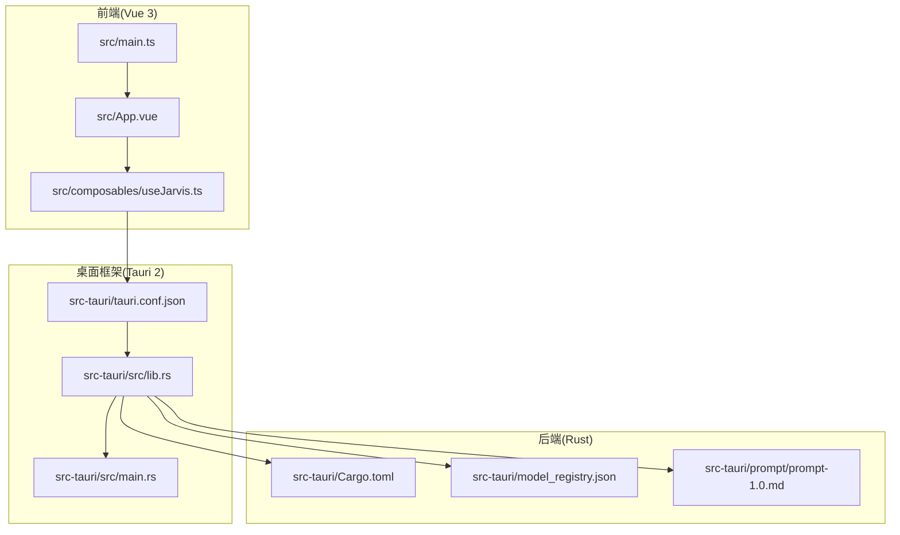
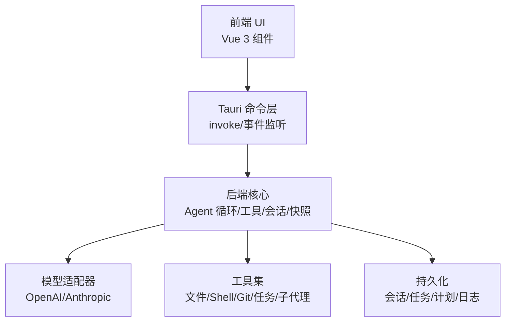
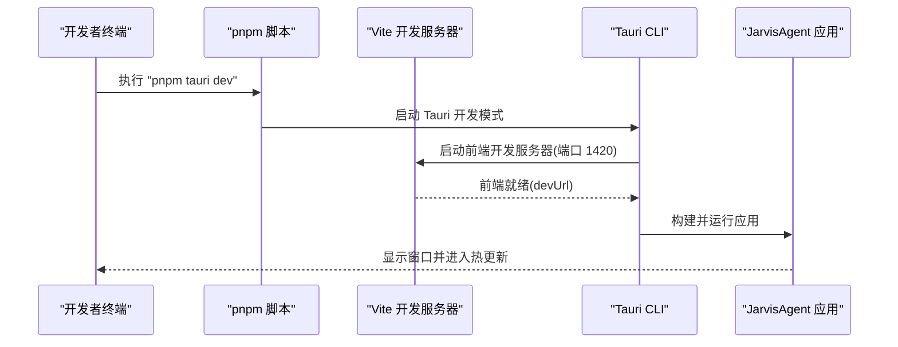
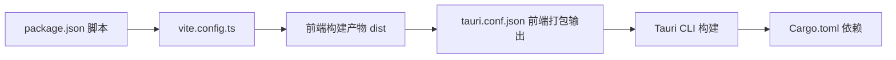

# 快速开始

<cite>
**本文引用的文件**
- [README.md](file://README.md)
- [package.json](file://package.json)
- [vite.config.ts](file://vite.config.ts)
- [src-tauri/tauri.conf.json](file://src-tauri/tauri.conf.json)
- [src-tauri/Cargo.toml](file://src-tauri/Cargo.toml)
- [src-tauri/src/main.rs](file://src-tauri/src/main.rs)
- [src-tauri/src/lib.rs](file://src-tauri/src/lib.rs)
- [src-tauri/model_registry.json](file://src-tauri/model_registry.json)
- [src-tauri/prompt/prompt-1.0.md](file://src-tauri/prompt/prompt-1.0.md)
- [src/main.ts](file://src/main.ts)
- [src/App.vue](file://src/App.vue)
- [src/composables/useJarvis.ts](file://src/composables/useJarvis.ts)
</cite>

## 目录
1. [简介](#简介)
2. [项目结构](#项目结构)
3. [核心组件](#核心组件)
4. [架构总览](#架构总览)
5. [详细组件分析](#详细组件分析)
6. [依赖关系分析](#依赖关系分析)
7. [性能考虑](#性能考虑)
8. [故障排查指南](#故障排查指南)
9. [结论](#结论)
10. [附录](#附录)

## 简介
JarvisAgent 是一个基于 Tauri 2.0 + Vue 3 的桌面 AI 编程助手，支持多主流大模型（LLM），具备深度思考、子代理委派、方案审批、会话持久化、沙箱工作目录等企业级能力。本文面向新用户，提供从环境准备、安装依赖、开发模式启动、构建发布到首次运行配置的完整快速上手指南。

## 项目结构
项目采用前后端分离的桌面应用结构：
- 前端：Vue 3 + TypeScript，Vite 构建与热更新
- 后端：Rust + Tauri，Tokio 异步运行时，Reqwest HTTP 客户端
- 配置：Vite、Tauri、Cargo、package.json

图表来源
- [src/main.ts:1-6](file://src/main.ts#L1-L6)
- [src/App.vue:1-276](file://src/App.vue#L1-L276)
- [src/composables/useJarvis.ts:1-800](file://src/composables/useJarvis.ts#L1-L800)
- [src-tauri/tauri.conf.json:1-40](file://src-tauri/tauri.conf.json#L1-L40)
- [src-tauri/src/lib.rs:1-186](file://src-tauri/src/lib.rs#L1-L186)
- [src-tauri/src/main.rs:1-7](file://src-tauri/src/main.rs#L1-L7)
- [src-tauri/Cargo.toml:1-41](file://src-tauri/Cargo.toml#L1-L41)
- [src-tauri/model_registry.json:1-496](file://src-tauri/model_registry.json#L1-L496)
- [src-tauri/prompt/prompt-1.0.md:1-69](file://src-tauri/prompt/prompt-1.0.md#L1-L69)

章节来源
- [README.md: 第107-160行:107-160](file://README.md#L107-L160)
- [src-tauri/tauri.conf.json: 第6-11行:6-11](file://src-tauri/tauri.conf.json#L6-L11)
- [vite.config.ts: 第8-32行:8-32](file://vite.config.ts#L8-L32)

## 核心组件
- 前端入口与应用根组件：负责挂载 Vue 应用、引入全局样式，承载聊天、侧栏、设置等 UI 组件。
- Tauri 后端入口：初始化运行时、加载配置、注册状态与命令、构建并运行应用。
- 模型能力注册表：集中管理各厂商模型的能力参数，便于统一适配与扩展。
- 系统提示词：定义主代理、子代理、记忆代理的行为约束与风格。

章节来源
- [src/main.ts: 第1-6行:1-6](file://src/main.ts#L1-L6)
- [src/App.vue: 第1-276行:1-276](file://src/App.vue#L1-L276)
- [src-tauri/src/lib.rs: 第48-186行:48-186](file://src-tauri/src/lib.rs#L48-L186)
- [src-tauri/model_registry.json: 第1-496行:1-496](file://src-tauri/model_registry.json#L1-L496)
- [src-tauri/prompt/prompt-1.0.md: 第1-69行:1-69](file://src-tauri/prompt/prompt-1.0.md#L1-L69)

## 架构总览
JarvisAgent 采用“前端 Vue + Tauri 框架 + Rust 后端”的三层架构。前端通过 Tauri 的 invoke 与后端命令交互，后端通过模型适配器对接多家 LLM，工具层提供文件、Shell、Git、任务等能力，配合会话与快照管理实现可追溯的执行过程。

图表来源
- [src/App.vue: 第1-276行:1-276](file://src/App.vue#L1-L276)
- [src/composables/useJarvis.ts: 第620-800行:620-800](file://src/composables/useJarvis.ts#L620-L800)
- [src-tauri/src/lib.rs: 第102-182行:102-182](file://src-tauri/src/lib.rs#L102-L182)

## 详细组件分析

### 环境要求与安装
- 环境要求
  - Node.js >= 18
  - Rust >= 1.70
  - pnpm >= 8（推荐）或 npm
- 安装依赖
  - 前端依赖：pnpm install
  - Rust 依赖：首次构建时自动安装
- 开发模式
  - pnpm tauri dev
- 构建发布
  - pnpm tauri build

章节来源
- [README.md: 第45-70行:45-70](file://README.md#L45-L70)
- [package.json: 第6-10行:6-10](file://package.json#L6-L10)

### 开发模式启动流程

图表来源
- [src-tauri/tauri.conf.json: 第7-10行:7-10](file://src-tauri/tauri.conf.json#L7-L10)
- [vite.config.ts: 第16-26行:16-26](file://vite.config.ts#L16-L26)
- [package.json: 第6-10行:6-10](file://package.json#L6-L10)

章节来源
- [src-tauri/tauri.conf.json: 第6-11行:6-11](file://src-tauri/tauri.conf.json#L6-L11)
- [vite.config.ts: 第8-32行:8-32](file://vite.config.ts#L8-L32)
- [package.json: 第6-10行:6-10](file://package.json#L6-L10)

### 首次运行配置
- 首次运行时，点击右上角设置按钮进行配置：
  - API Key：你的 LLM API 密钥
  - Base URL：API 端点地址（自动补全路径）
  - API Format：选择 openai 或 anthropic 格式
  - 主模型：用于主代理和子代理的模型
  - 工具模型：用于意图分类和记忆管理的轻量模型（可选更便宜的模型）
  - 深度思考：开启/关闭思考模式
- 支持多预设（Profile）管理，可为不同场景切换配置。

章节来源
- [README.md: 第72-83行:72-83](file://README.md#L72-L83)

### 模型能力与注册表
- 模型能力注册表集中管理各厂商模型的参数与能力，如是否支持思考模式、视觉、最大上下文长度等。
- 可通过扩展注册表新增模型，以适配更多 LLM。

章节来源
- [src-tauri/model_registry.json: 第1-496行:1-496](file://src-tauri/model_registry.json#L1-L496)
- [README.md: 第85-105行:85-105](file://README.md#L85-L105)

### 前端交互与状态管理
- useJarvis 组合式函数负责：
  - 事件监听：接收来自后端的聊天流、工具状态、计划提案、子代理运行等事件
  - 状态管理：会话视图、消息、工具缓冲、思考缓冲、代理步骤、计划文档、任务等
  - 渲染：将流式内容与 Markdown 渲染为 HTML，支持滚动与节流刷新
- App.vue 作为根组件，组织布局、侧栏、聊天区域、设置面板与权限/方案弹窗。

章节来源
- [src/composables/useJarvis.ts: 第620-800行:620-800](file://src/composables/useJarvis.ts#L620-L800)
- [src/App.vue: 第1-276行:1-276](file://src/App.vue#L1-L276)

### Tauri 后端初始化与命令注册
- main.rs：程序入口，调用 lib.rs 的 run 函数
- lib.rs：初始化环境变量、锁定 Agent 主目录、恢复工作目录与会话，构建 Tauri 应用并注册状态与命令
- 命令覆盖：AI 对话、权限控制、会话管理、配置管理、历史记录、检查点/分支、快照管理、沙盒会话、合并冲突、模型注册表等

章节来源
- [src-tauri/src/main.rs: 第4-6行:4-6](file://src-tauri/src/main.rs#L4-L6)
- [src-tauri/src/lib.rs: 第57-186行:57-186](file://src-tauri/src/lib.rs#L57-L186)

### 系统提示词与 Agent 行为
- 主代理提示词：强调简单输入直接回复、复杂任务先规划再执行、严格在用户指定范围内操作、任务机制与执行约束
- 子代理提示词：先读再改、精准修改、完成后仅返回关键结果
- 记忆代理提示词：维护用户长期与项目记忆，仅在有新信息时更新

章节来源
- [src-tauri/prompt/prompt-1.0.md: 第1-69行:1-69](file://src-tauri/prompt/prompt-1.0.md#L1-L69)

## 依赖关系分析
- 前端依赖
  - Vue 3、@tauri-apps/api、@tauri-apps 插件（dialog/fs/opener）、marked、typescript、vite、vue-tsc
- 后端依赖
  - Tauri 2、Reqwest、Tokio、eventsource-stream、futures-util、serde、tokio-util、regex、thiserror 等
- 构建与脚本
  - package.json 定义 dev/build/preview/tauri 脚本
  - vite.config.ts 固定前端开发端口与热更新配置
  - tauri.conf.json 配置开发/构建前置命令、前端打包输出、窗口属性与打包图标

图表来源
- [package.json: 第6-10行:6-10](file://package.json#L6-L10)
- [vite.config.ts: 第8-32行:8-32](file://vite.config.ts#L8-L32)
- [src-tauri/tauri.conf.json: 第6-11行:6-11](file://src-tauri/tauri.conf.json#L6-L11)
- [src-tauri/Cargo.toml: 第20-39行:20-39](file://src-tauri/Cargo.toml#L20-L39)

章节来源
- [package.json: 第12-26行:12-26](file://package.json#L12-L26)
- [src-tauri/Cargo.toml: 第20-39行:20-39](file://src-tauri/Cargo.toml#L20-L39)

## 性能考虑
- 前端渲染节流：useJarvis 对当前轮次渲染进行节流，减少频繁 DOM 更新
- 流式输出：后端通过 SSE/流式接口推送内容，前端增量拼接与滚动
- 异步运行时：Rust 后端使用 Tokio，支持高并发与取消机制
- 热更新端口固定：Vite 固定端口与严格端口策略，避免端口冲突导致的性能抖动

章节来源
- [src/composables/useJarvis.ts: 第547-573行:547-573](file://src/composables/useJarvis.ts#L547-L573)
- [vite.config.ts: 第14-26行:14-26](file://vite.config.ts#L14-L26)
- [src-tauri/Cargo.toml: 第29行](file://src-tauri/Cargo.toml#L29)

## 故障排查指南
- 端口占用
  - 现象：开发模式启动失败，提示端口被占用
  - 处理：确保 1420 端口可用，或调整 vite.config.ts 中的 server.port
- 环境变量未生效
  - 现象：模型 API Key 未生效
  - 处理：确认 .env 文件存在且包含正确的 KEY/URL，或在系统环境变量中设置
- 模型配置错误
  - 现象：API 格式选择错误导致请求失败
  - 处理：在设置面板中切换 API Format（openai/anthropic），并核对 Base URL
- 权限与沙箱
  - 现象：执行 Shell 命令被拦截或需要确认
  - 处理：根据弹窗授权，或在沙箱限制内操作；避免路径穿越
- 构建失败
  - 现象：pnpm tauri build 报错
  - 处理：检查 Rust 工具链版本与依赖，确保 Cargo.toml 与 tauri.conf.json 配置正确

章节来源
- [vite.config.ts: 第16-26行:16-26](file://vite.config.ts#L16-L26)
- [src-tauri/src/lib.rs: 第58-77行:58-77](file://src-tauri/src/lib.rs#L58-L77)
- [README.md: 第72-83行:72-83](file://README.md#L72-L83)

## 结论
通过以上步骤，你可以快速完成 JarvisAgent 的环境准备、依赖安装、开发模式启动与构建发布，并在首次运行时完成必要的配置。建议结合模型注册表与系统提示词，按需扩展模型与 Agent 行为，充分利用会话、快照与工具集提升开发效率与安全性。

## 附录
- 常用命令
  - 安装依赖：pnpm install
  - 开发模式：pnpm tauri dev
  - 类型检查：pnpm build
  - 构建发布：pnpm tauri build
- 数据存储位置
  - 应用数据存储在运行目录下，包含配置、会话、任务、计划、日志、技能、记忆等子目录

章节来源
- [README.md: 第43-70行:43-70](file://README.md#L43-L70)
- [README.md: 第257-274行:257-274](file://README.md#L257-L274)