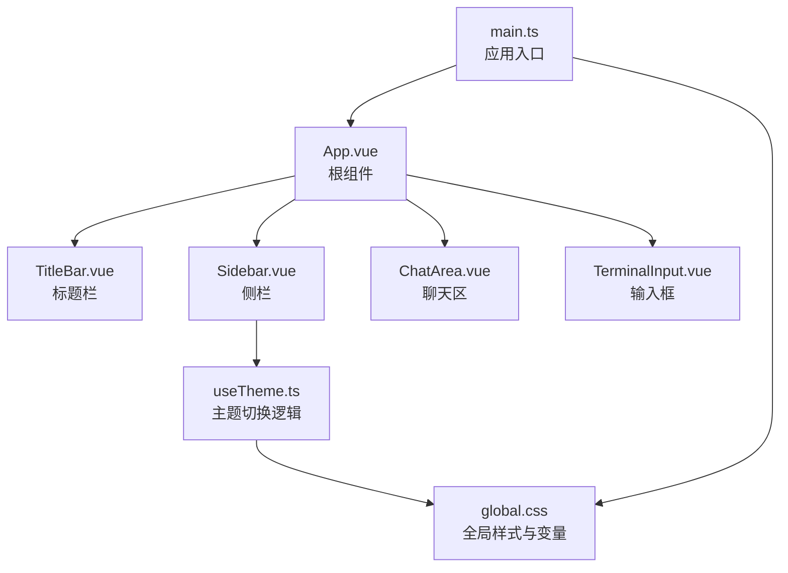
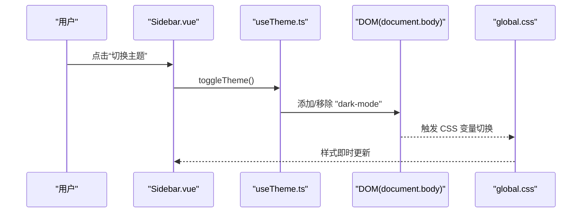
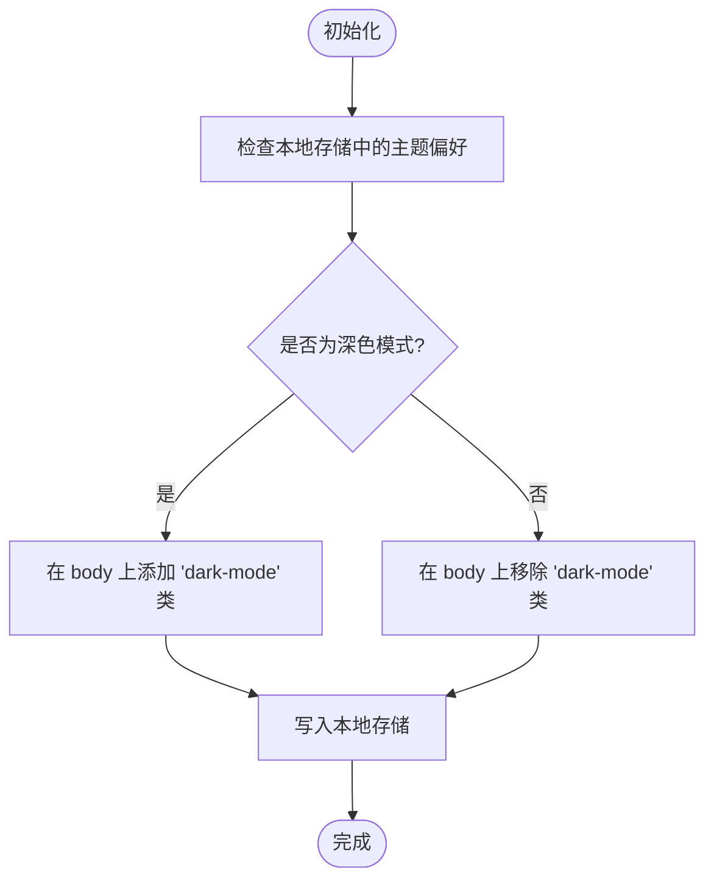
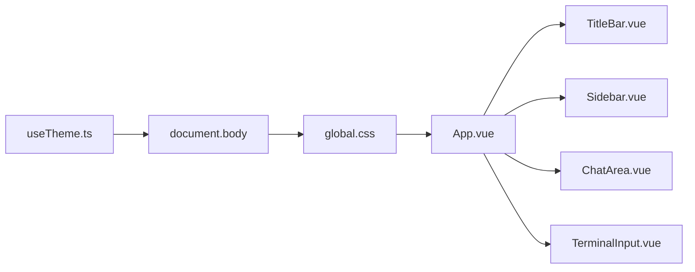

# 主题定制

<cite>
**本文引用的文件**
- [global.css](file://src/assets/global.css)
- [useTheme.ts](file://src/composables/useTheme.ts)
- [App.vue](file://src/App.vue)
- [main.ts](file://src/main.ts)
- [SettingsPanel.vue](file://src/components/settings/SettingsPanel.vue)
- [TitleBar.vue](file://src/components/layout/TitleBar.vue)
- [Sidebar.vue](file://src/components/layout/Sidebar.vue)
- [ChatArea.vue](file://src/components/chat/ChatArea.vue)
- [TerminalInput.vue](file://src/components/chat/TerminalInput.vue)
- [vite.config.ts](file://vite.config.ts)
- [package.json](file://package.json)
</cite>

## 目录
1. [简介](#简介)
2. [项目结构](#项目结构)
3. [核心组件](#核心组件)
4. [架构总览](#架构总览)
5. [详细组件分析](#详细组件分析)
6. [依赖关系分析](#依赖关系分析)
7. [性能考量](#性能考量)
8. [故障排查指南](#故障排查指南)
9. [结论](#结论)
10. [附录](#附录)

## 简介
本指南面向希望在 JarvisAgent 中进行主题定制与扩展的开发者与设计师。内容涵盖：
- 样式变量系统（CSS 自定义属性、颜色主题、字体与排版）
- 主题切换机制（动态样式加载、主题状态管理、持久化）
- 主题开发最佳实践（颜色搭配、响应式与无障碍）
- 全局样式覆盖方法（组件样式、动画与布局）
- 主题打包与分发、向后兼容性策略

## 项目结构
JarvisAgent 采用 Vue 3 + Vite + Tauri 架构，主题系统以 CSS 变量为核心，通过全局样式文件集中定义，并由组件按需消费。主题切换通过一个组合式函数管理状态并在 DOM 上应用类名，从而驱动 CSS 变量切换。

图表来源
- [main.ts:1-6](file://src/main.ts#L1-L6)
- [App.vue:1-276](file://src/App.vue#L1-L276)
- [global.css:1-308](file://src/assets/global.css#L1-L308)
- [useTheme.ts:1-35](file://src/composables/useTheme.ts#L1-L35)
- [TitleBar.vue:1-109](file://src/components/layout/TitleBar.vue#L1-L109)
- [Sidebar.vue:1-783](file://src/components/layout/Sidebar.vue#L1-L783)
- [ChatArea.vue:296-641](file://src/components/chat/ChatArea.vue#L296-L641)
- [TerminalInput.vue:441-488](file://src/components/chat/TerminalInput.vue#L441-L488)

章节来源
- [main.ts:1-6](file://src/main.ts#L1-L6)
- [global.css:1-308](file://src/assets/global.css#L1-L308)
- [useTheme.ts:1-35](file://src/composables/useTheme.ts#L1-L35)
- [App.vue:1-276](file://src/App.vue#L1-L276)

## 核心组件
- 样式变量系统：集中于全局样式文件，定义浅色/深色两套变量集，配合毛玻璃、阴影、过渡等通用变量。
- 主题切换组合式函数：负责初始化与切换，写入 DOM 类名并持久化到本地存储。
- 组件消费变量：各组件通过 CSS 变量与工具类实现一致的主题表现。

章节来源
- [global.css:6-114](file://src/assets/global.css#L6-L114)
- [useTheme.ts:9-34](file://src/composables/useTheme.ts#L9-L34)
- [App.vue:84-275](file://src/App.vue#L84-L275)

## 架构总览
主题系统围绕“CSS 变量 + DOM 类名 + 组合式函数”的三层协作：
- 变量层：定义颜色、阴影、圆角、过渡、毛玻璃等变量，分别在浅色与深色模式下生效。
- 控制层：组合式函数在挂载时读取本地偏好，切换时更新 DOM 类名并持久化。
- 表现层：组件样式统一使用变量与工具类，自动随变量切换而变化。

图表来源
- [Sidebar.vue:401-416](file://src/components/layout/Sidebar.vue#L401-L416)
- [useTheme.ts:19-28](file://src/composables/useTheme.ts#L19-L28)
- [global.css:72-114](file://src/assets/global.css#L72-L114)

## 详细组件分析

### 样式变量系统
- 颜色主题
  - 浅色模式：背景、面板、边框、文本、强调色等均以高透明度白色/浅色系为主，营造通透感。
  - 深色模式：背景、面板、边框、文本、强调色等均以深色/低亮度为主，降低眩光。
- 调色板与语义色
  - 主色调：蓝色系用于强调与链接；绿色系用于成功；红色系用于错误；黄色系用于警告/运行中。
  - 表面色：危险表面、警告表面、强表面等，用于不同语义的容器与高亮。
- 字体系统
  - 无衬线字体作为默认正文，等宽字体用于代码与终端场景。
- 毛玻璃与阴影
  - 提供轻/中/重三档毛玻璃背景、边框与阴影，统一组件的视觉层次。
- 动画与过渡
  - 使用 Material Design 标准缓动曲线，定义快/正常/慢三种过渡时长，确保交互一致性。
- 响应式与无障碍
  - 基于媒体查询适配“减少动态效果”偏好；提供焦点可见性样式，满足键盘导航与无障碍要求。

章节来源
- [global.css:6-114](file://src/assets/global.css#L6-L114)
- [global.css:116-252](file://src/assets/global.css#L116-L252)

### 主题切换实现机制
- 初始化：组件挂载时从本地存储读取用户偏好，若为深色则在 body 上添加类名。
- 切换：点击触发切换函数，翻转状态并在 DOM 上添加/移除类名，同时持久化到本地存储。
- 效果：CSS 变量随类名切换而切换，组件样式自动更新。

图表来源
- [useTheme.ts:10-17](file://src/composables/useTheme.ts#L10-L17)
- [useTheme.ts:20-28](file://src/composables/useTheme.ts#L20-L28)

章节来源
- [useTheme.ts:1-35](file://src/composables/useTheme.ts#L1-L35)

### 组件样式与变量消费
- 根容器与页面基础
  - 根容器与页面基础样式直接消费变量，保证整体背景、文字、字体与过渡的一致性。
- 标题栏与侧栏
  - 顶部标题栏与侧栏均使用毛玻璃变量与过渡，保持统一的视觉风格与交互反馈。
- 聊天与输入
  - 聊天区域与输入框使用毛玻璃与阴影变量，营造沉浸式体验。
- 设置面板
  - 设置面板自身也大量使用变量与动画，确保与整体风格一致。

章节来源
- [App.vue:84-275](file://src/App.vue#L84-L275)
- [TitleBar.vue:32-108](file://src/components/layout/TitleBar.vue#L32-L108)
- [Sidebar.vue:423-782](file://src/components/layout/Sidebar.vue#L423-L782)
- [ChatArea.vue:296-641](file://src/components/chat/ChatArea.vue#L296-L641)
- [TerminalInput.vue:441-488](file://src/components/chat/TerminalInput.vue#L441-L488)
- [SettingsPanel.vue:535-596](file://src/components/settings/SettingsPanel.vue#L535-L596)

### 动态样式加载与构建
- 应用入口引入全局样式，确保变量与工具类在应用启动时即生效。
- Vite 配置未对 CSS 做特殊处理，变量与工具类通过静态导入生效。

章节来源
- [main.ts:1-6](file://src/main.ts#L1-L6)
- [vite.config.ts:1-33](file://vite.config.ts#L1-L33)

## 依赖关系分析
- useTheme.ts 依赖 Vue 的响应式能力与浏览器本地存储 API。
- 各组件依赖全局 CSS 变量与工具类，形成松耦合的样式体系。
- App.vue 作为根组件，承载全局容器与状态指示器，消费变量并驱动子组件。

图表来源
- [useTheme.ts:4-34](file://src/composables/useTheme.ts#L4-L34)
- [global.css:6-114](file://src/assets/global.css#L6-L114)
- [App.vue:1-276](file://src/App.vue#L1-L276)
- [TitleBar.vue:1-109](file://src/components/layout/TitleBar.vue#L1-L109)
- [Sidebar.vue:1-783](file://src/components/layout/Sidebar.vue#L1-L783)
- [ChatArea.vue:296-641](file://src/components/chat/ChatArea.vue#L296-L641)
- [TerminalInput.vue:441-488](file://src/components/chat/TerminalInput.vue#L441-L488)

章节来源
- [useTheme.ts:1-35](file://src/composables/useTheme.ts#L1-L35)
- [global.css:1-308](file://src/assets/global.css#L1-L308)
- [App.vue:1-276](file://src/App.vue#L1-L276)

## 性能考量
- CSS 变量切换成本极低，仅影响渲染层，不触发重排重绘。
- 毛玻璃与阴影使用 backdrop-filter 与 filter，现代浏览器优化良好；在低端设备上可结合“减少动态效果”偏好降低动画。
- 组件样式统一使用变量，避免重复计算与冗余样式，提升维护效率。

## 故障排查指南
- 主题未切换
  - 检查本地存储键值是否存在且正确；确认切换函数被调用；确认 body 上类名存在。
- 样式未生效
  - 确认全局样式已在入口处导入；确认组件使用了变量而非硬编码颜色。
- 动画异常
  - 检查“减少动态效果”偏好是否启用；确认关键帧与过渡时长未被覆盖。

章节来源
- [useTheme.ts:10-28](file://src/composables/useTheme.ts#L10-L28)
- [global.css:243-252](file://src/assets/global.css#L243-L252)

## 结论
JarvisAgent 的主题系统以 CSS 变量为核心，通过组合式函数与 DOM 类名实现主题切换，配合组件级变量消费，形成简洁、统一且可扩展的主题体系。遵循本文最佳实践，可在不破坏现有结构的前提下进行主题定制与扩展。

## 附录

### 主题开发最佳实践
- 颜色搭配原则
  - 保持主色调一致，强调色用于重要状态；危险/警告/成功使用语义化颜色。
  - 深浅模式下对比度充足，避免高亮与背景相近导致可读性差。
- 响应式设计考虑
  - 在窄屏与高 DPI 下测试变量与动画表现；必要时通过媒体查询微调字号与间距。
- 无障碍访问支持
  - 确保焦点可见性样式在深浅模式下清晰；避免仅靠颜色传达信息，辅以图标或文本。
- 动画与过渡
  - 使用统一的缓动曲线与时长；为“减少动态效果”用户提供降级体验。

### 全局样式覆盖方法
- 组件样式定制
  - 优先使用变量与工具类；如需局部覆盖，尽量在组件作用域内通过变量重定义实现。
- 动画效果配置
  - 修改过渡时长与缓动曲线时，保持与全局一致；避免过度动画影响性能。
- 布局调整技巧
  - 使用变量统一控制圆角、阴影与间距；通过媒体查询适配不同屏幕尺寸。

### 主题打包与分发指南
- 打包
  - 将自定义变量与工具类合并至全局样式文件；确保变量命名与现有体系一致。
- 分发
  - 提供独立的 CSS 文件或主题包，包含变量定义与必要的工具类；在应用入口按需引入。
- 向后兼容性
  - 新增变量时保留旧变量别名一段时间；在组件中同时兼容新旧变量，逐步迁移。