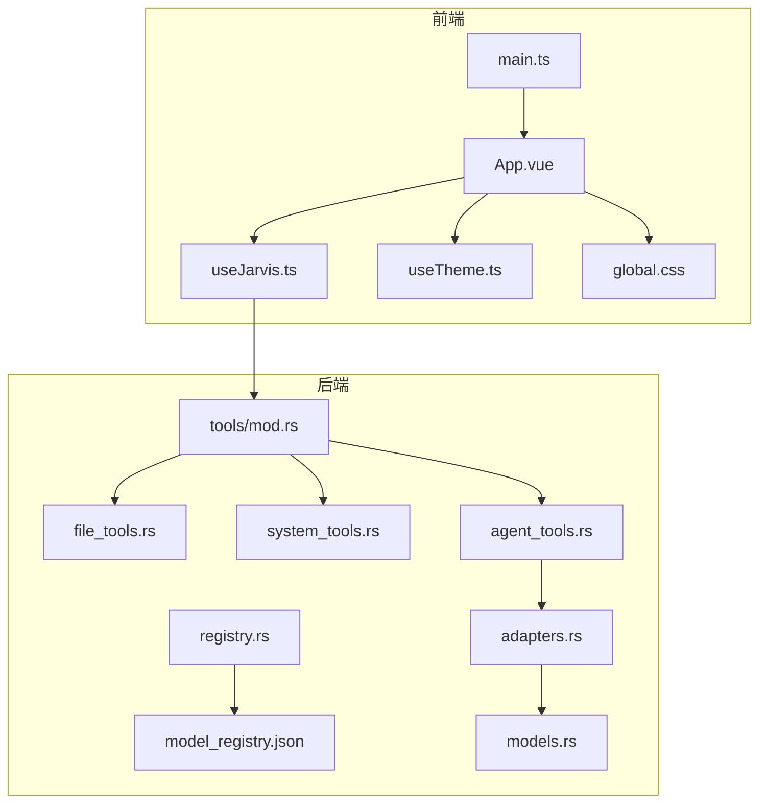
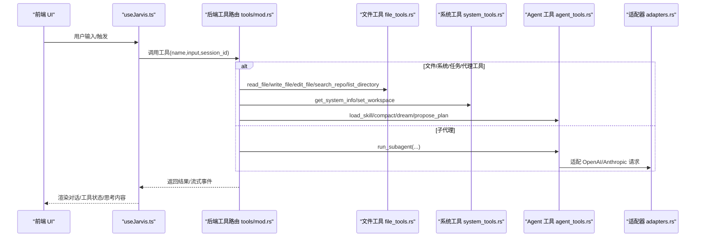
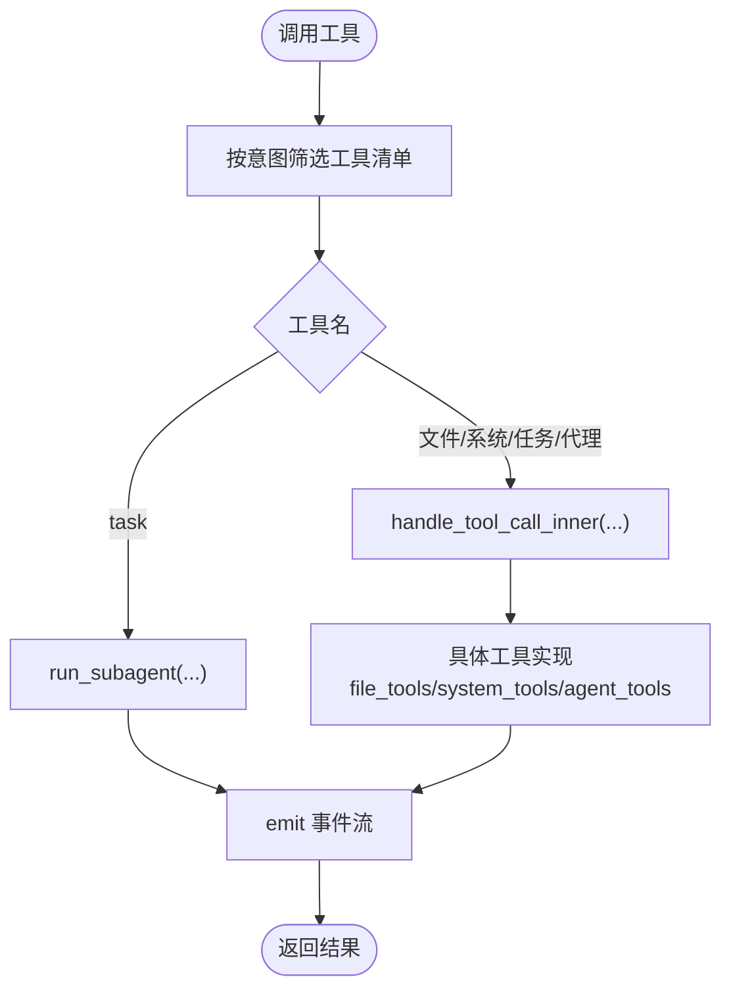
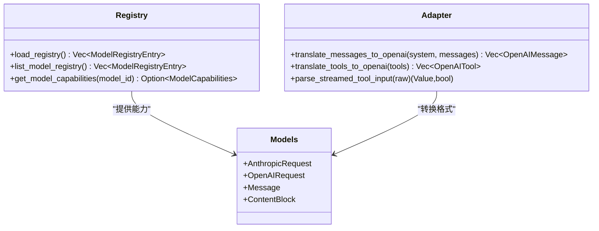
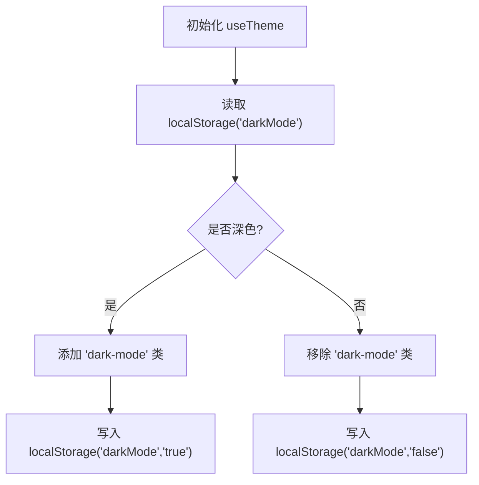
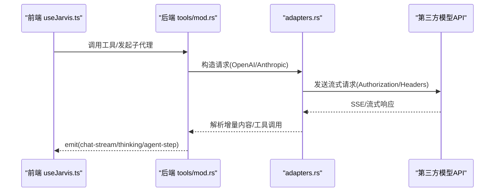
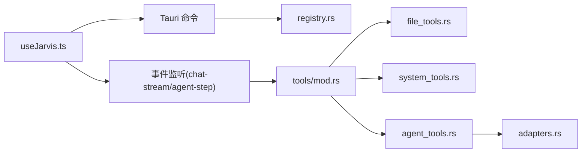

# 扩展与定制

<cite>
**本文引用的文件**
- [README.md](file://README.md)
- [main.ts](file://src/main.ts)
- [App.vue](file://src/App.vue)
- [useJarvis.ts](file://src/composables/useJarvis.ts)
- [useTheme.ts](file://src/composables/useTheme.ts)
- [global.css](file://src/assets/global.css)
- [mod.rs](file://src-tauri/src/core/tools/mod.rs)
- [file_tools.rs](file://src-tauri/src/core/tools/file_tools.rs)
- [system_tools.rs](file://src-tauri/src/core/tools/system_tools.rs)
- [agent_tools.rs](file://src-tauri/src/core/tools/agent_tools.rs)
- [adapters.rs](file://src-tauri/src/core/adapters.rs)
- [registry.rs](file://src-tauri/src/core/registry.rs)
- [model_registry.json](file://src-tauri/model_registry.json)
- [models.rs](file://src-tauri/src/core/models.rs)
- [index.ts](file://src/types/index.ts)
</cite>

## 目录
1. [简介](#简介)
2. [项目结构](#项目结构)
3. [核心组件](#核心组件)
4. [架构总览](#架构总览)
5. [详细组件分析](#详细组件分析)
6. [依赖分析](#依赖分析)
7. [性能考量](#性能考量)
8. [故障排查指南](#故障排查指南)
9. [结论](#结论)
10. [附录](#附录)

## 简介
本文件面向希望对 JarvisAgent 进行扩展与定制的开发者，系统阐述以下主题：
- 插件开发机制：自定义工具开发、工具路由机制、动态加载策略
- 模型扩展方法：模型注册表配置、新模型集成、适配器开发
- 主题定制指南：样式变量、CSS 自定义属性、主题切换实现
- 第三方服务集成：API 适配、认证机制、数据同步
- 扩展点识别、最佳实践建议与兼容性考虑
- 具体扩展示例与集成案例

## 项目结构
JarvisAgent 采用前后端分离的桌面应用架构：
- 前端（Vue 3 + TypeScript）负责 UI、事件监听与渲染
- 后端（Rust + Tauri）负责工具执行、模型适配、会话与快照管理

**图表来源**
- [main.ts:1-6](file://src/main.ts#L1-L6)
- [App.vue:1-276](file://src/App.vue#L1-L276)
- [useJarvis.ts:620-800](file://src/composables/useJarvis.ts#L620-L800)
- [useTheme.ts:1-35](file://src/composables/useTheme.ts#L1-L35)
- [global.css:1-308](file://src/assets/global.css#L1-L308)
- [mod.rs:1-454](file://src-tauri/src/core/tools/mod.rs#L1-L454)
- [file_tools.rs:1-491](file://src-tauri/src/core/tools/file_tools.rs#L1-L491)
- [system_tools.rs:1-90](file://src-tauri/src/core/tools/system_tools.rs#L1-L90)
- [agent_tools.rs:1-837](file://src-tauri/src/core/tools/agent_tools.rs#L1-L837)
- [adapters.rs:1-259](file://src-tauri/src/core/adapters.rs#L1-L259)
- [registry.rs:1-103](file://src-tauri/src/core/registry.rs#L1-L103)
- [model_registry.json:1-496](file://src-tauri/model_registry.json#L1-L496)
- [models.rs:1-256](file://src-tauri/src/core/models.rs#L1-L256)

**章节来源**
- [README.md:107-160](file://README.md#L107-L160)
- [main.ts:1-6](file://src/main.ts#L1-L6)
- [App.vue:1-276](file://src/App.vue#L1-L276)

## 核心组件
- 前端核心
  - useJarvis.ts：负责与后端事件通信、会话状态管理、流式渲染与 UI 交互
  - useTheme.ts：主题切换与本地持久化
  - global.css：全局样式与 CSS 变量体系
- 后端核心
  - tools/mod.rs：工具系统入口，定义工具清单、路由分发与动态加载
  - adapters.rs：OpenAI/Anthropic 双格式适配器
  - registry.rs + model_registry.json：模型能力注册表
  - models.rs：请求/响应数据结构
  - agent_tools.rs：子代理、技能加载、上下文压缩、记忆整理、方案审批
  - file_tools.rs、system_tools.rs：文件与系统工具实现

**章节来源**
- [useJarvis.ts:620-800](file://src/composables/useJarvis.ts#L620-L800)
- [useTheme.ts:1-35](file://src/composables/useTheme.ts#L1-L35)
- [global.css:1-308](file://src/assets/global.css#L1-L308)
- [mod.rs:1-454](file://src-tauri/src/core/tools/mod.rs#L1-L454)
- [adapters.rs:1-259](file://src-tauri/src/core/adapters.rs#L1-L259)
- [registry.rs:1-103](file://src-tauri/src/core/registry.rs#L1-L103)
- [model_registry.json:1-496](file://src-tauri/model_registry.json#L1-L496)
- [models.rs:1-256](file://src-tauri/src/core/models.rs#L1-L256)
- [agent_tools.rs:1-837](file://src-tauri/src/core/tools/agent_tools.rs#L1-L837)
- [file_tools.rs:1-491](file://src-tauri/src/core/tools/file_tools.rs#L1-L491)
- [system_tools.rs:1-90](file://src-tauri/src/core/tools/system_tools.rs#L1-L90)

## 架构总览
JarvisAgent 的 Agent 循环由“意图识别 → 工具集加载 → Agent 循环（思考→工具调用→观察）→ 流式输出”构成。前端通过 Tauri 事件与后端交互，后端通过适配器统一模型 API，并通过工具路由分发到具体实现。

**图表来源**
- [useJarvis.ts:620-800](file://src/composables/useJarvis.ts#L620-L800)
- [mod.rs:381-453](file://src-tauri/src/core/tools/mod.rs#L381-L453)
- [file_tools.rs:43-365](file://src-tauri/src/core/tools/file_tools.rs#L43-L365)
- [system_tools.rs:18-89](file://src-tauri/src/core/tools/system_tools.rs#L18-L89)
- [agent_tools.rs:19-721](file://src-tauri/src/core/tools/agent_tools.rs#L19-L721)
- [adapters.rs:84-259](file://src-tauri/src/core/adapters.rs#L84-L259)

## 详细组件分析

### 插件开发机制：自定义工具开发、工具路由机制、动态加载策略
- 自定义工具开发
  - 工具实现位置：在 tools 目录下新增模块（参考现有 file_tools.rs、system_tools.rs、agent_tools.rs）
  - 工具签名：接收 AppHandle、输入 JSON、session_id，返回字符串结果
  - 权限与沙箱：通过 ensure_path_permission/request_permission 确保安全
  - 事件上报：emit 流式事件（如 chat-stream、chat-thinking、agent-step）
  - 示例参考：文件读写、搜索、Shell 命令、任务管理、子代理执行
- 工具路由机制
  - 工具定义：get_tools_definition 根据意图（CHAT/MEMORY_QUERY/SUBAGENT/PROJECT_ACTION）返回工具清单
  - 路由分发：handle_tool_call/handle_tool_call_inner 根据工具名分发到具体实现
  - 子代理路由：task 工具走 run_subagent，其余走内部分发
- 动态加载策略
  - 技能加载：load_all_skills 递归扫描 skills 目录，解析 SKILL.md，提供 load_skill 工具按需加载
  - 会话工作目录：get_workspace 获取当前会话沙箱，确保工具操作受限

**图表来源**
- [mod.rs:89-379](file://src-tauri/src/core/tools/mod.rs#L89-L379)
- [mod.rs:381-453](file://src-tauri/src/core/tools/mod.rs#L381-L453)
- [agent_tools.rs:61-721](file://src-tauri/src/core/tools/agent_tools.rs#L61-L721)
- [file_tools.rs:43-365](file://src-tauri/src/core/tools/file_tools.rs#L43-L365)
- [system_tools.rs:18-89](file://src-tauri/src/core/tools/system_tools.rs#L18-L89)

**章节来源**
- [mod.rs:1-454](file://src-tauri/src/core/tools/mod.rs#L1-L454)
- [file_tools.rs:1-491](file://src-tauri/src/core/tools/file_tools.rs#L1-L491)
- [system_tools.rs:1-90](file://src-tauri/src/core/tools/system_tools.rs#L1-L90)
- [agent_tools.rs:1-837](file://src-tauri/src/core/tools/agent_tools.rs#L1-L837)

### 模型扩展方法：模型注册表配置、新模型集成、适配器开发
- 模型注册表配置
  - 数据源：model_registry.json，包含模型能力字段（streaming、thinking、thinkingParam、temperature、maxTokens、vision、notes）
  - 编译时内嵌：registry.rs 使用 include_str! 将 JSON 内嵌到二进制，保证部署一致性
  - 查询接口：load_registry/list_model_registry/get_model_capabilities
- 新模型集成
  - 添加条目：在 model_registry.json 中新增模型记录
  - 能力匹配：query_capabilities 支持精确与模糊匹配（包含关系）
  - 前端选择：list_model_registry 返回完整列表供前端下拉选择
- 适配器开发
  - OpenAI/Anthropic 双格式：translate_messages_to_openai/translate_tools_to_openai
  - 思考参数适配：should_backfill_deepseek_reasoning_content + thinkingParam 映射
  - 流式解析：parse_streamed_tool_input 规范化 JSON 控制字符

**图表来源**
- [registry.rs:56-103](file://src-tauri/src/core/registry.rs#L56-L103)
- [adapters.rs:84-259](file://src-tauri/src/core/adapters.rs#L84-L259)
- [models.rs:20-188](file://src-tauri/src/core/models.rs#L20-L188)
- [model_registry.json:1-496](file://src-tauri/model_registry.json#L1-L496)

**章节来源**
- [registry.rs:1-103](file://src-tauri/src/core/registry.rs#L1-L103)
- [adapters.rs:1-259](file://src-tauri/src/core/adapters.rs#L1-L259)
- [models.rs:1-256](file://src-tauri/src/core/models.rs#L1-L256)
- [model_registry.json:1-496](file://src-tauri/model_registry.json#L1-L496)

### 主题定制指南：样式变量、CSS 自定义属性、主题切换实现
- 样式变量与 CSS 自定义属性
  - 全局变量：背景、文本、强调色、字体、毛玻璃效果、阴影、圆角、过渡动画
  - 暗色模式：通过 body.dark-mode 切换变量集合
  - 毛玻璃工具类：glass-panel/glass-panel-heavy/glass-panel-light
- 主题切换实现
  - useTheme.ts：初始化从 localStorage 读取 darkMode，切换时更新 body.classList 并持久化
  - 前端组件：App.vue 使用 CSS 变量驱动主题切换

**图表来源**
- [useTheme.ts:9-34](file://src/composables/useTheme.ts#L9-L34)
- [global.css:6-114](file://src/assets/global.css#L6-L114)
- [App.vue:1-276](file://src/App.vue#L1-L276)

**章节来源**
- [useTheme.ts:1-35](file://src/composables/useTheme.ts#L1-L35)
- [global.css:1-308](file://src/assets/global.css#L1-L308)
- [App.vue:1-276](file://src/App.vue#L1-L276)

### 第三方服务集成：API 适配、认证机制、数据同步
- API 适配
  - OpenAI/Anthropic 双格式：适配消息结构、工具定义、流式事件
  - 思考参数映射：reasoning_effort/thinking/thinkingBudget/enable_thinking
- 认证机制
  - OpenAI：Authorization: Bearer {api_key}
  - Anthropic：x-api-key + anthropic-version
- 数据同步
  - 事件驱动：chat-stream/chat-thinking/agent-step 等事件从前端监听
  - 会话状态：useJarvis.ts 维护会话视图、消息、工具缓冲、Agent 步骤
  - 计划审批：propose_plan 将方案持久化至 .plans 目录并通过事件推送前端

**图表来源**
- [useJarvis.ts:620-800](file://src/composables/useJarvis.ts#L620-L800)
- [mod.rs:381-453](file://src-tauri/src/core/tools/mod.rs#L381-L453)
- [adapters.rs:84-259](file://src-tauri/src/core/adapters.rs#L84-L259)

**章节来源**
- [adapters.rs:1-259](file://src-tauri/src/core/adapters.rs#L1-L259)
- [useJarvis.ts:620-800](file://src/composables/useJarvis.ts#L620-L800)

## 依赖分析
- 前端依赖后端事件与命令，后端通过 Tauri 命令暴露能力（如模型查询）
- 工具模块之间低耦合，通过统一路由与事件进行解耦
- 适配器层抽象不同模型格式差异，降低上层改动成本

**图表来源**
- [useJarvis.ts:620-800](file://src/composables/useJarvis.ts#L620-L800)
- [registry.rs:91-103](file://src-tauri/src/core/registry.rs#L91-L103)
- [mod.rs:381-453](file://src-tauri/src/core/tools/mod.rs#L381-L453)
- [adapters.rs:84-259](file://src-tauri/src/core/adapters.rs#L84-L259)

**章节来源**
- [useJarvis.ts:620-800](file://src/composables/useJarvis.ts#L620-L800)
- [registry.rs:1-103](file://src-tauri/src/core/registry.rs#L1-L103)
- [mod.rs:1-454](file://src-tauri/src/core/tools/mod.rs#L1-L454)

## 性能考量
- 流式渲染：前端使用 requestAnimationFrame 与节流策略减少重绘
- 工具调用：子代理采用 SSE 流式响应，边到边渲染，提升感知性能
- 事件驱动：通过事件聚合与缓冲（toolBuffer/tempBuffer）降低 UI 更新频率
- 模型适配：统一适配器减少重复序列化与格式转换开销

[本节为通用指导，无需特定文件引用]

## 故障排查指南
- 工具调用失败
  - 检查权限与沙箱：ensure_path_permission/request_permission
  - 查看事件流：chat-stream/chat-thinking/agent-step
  - 子代理取消：SubAgentMonitor::is_cancelled/acknowledge_cancelled
- 模型适配问题
  - 思考参数不生效：核对 model_registry.json 的 thinkingParam 与适配器映射
  - 流式参数解析失败：parse_streamed_tool_input 返回错误，查看原始片段
- 主题切换异常
  - 确认 localStorage('darkMode') 与 body.classList('dark-mode') 同步
  - 检查 global.css 变量覆盖顺序

**章节来源**
- [agent_tools.rs:540-666](file://src-tauri/src/core/tools/agent_tools.rs#L540-L666)
- [adapters.rs:42-62](file://src-tauri/src/core/adapters.rs#L42-L62)
- [useTheme.ts:9-34](file://src/composables/useTheme.ts#L9-L34)
- [global.css:6-114](file://src/assets/global.css#L6-L114)

## 结论
通过清晰的工具路由、完善的模型适配与事件驱动架构，JarvisAgent 提供了良好的扩展基础。开发者可按需新增工具、扩展模型能力、定制主题样式，并通过事件与会话状态实现与第三方系统的数据同步。

[本节为总结，无需特定文件引用]

## 附录

### 扩展点识别与最佳实践
- 扩展点
  - 工具模块：在 tools 目录新增模块，完善 get_tools_definition 与 handle_tool_call
  - 模型注册：在 model_registry.json 新增条目，必要时调整适配器映射
  - 主题变量：在 global.css 增加/调整 CSS 变量，保持明暗两套
- 最佳实践
  - 工具实现遵循统一签名与事件上报规范
  - 模型适配保持幂等与可回退
  - 主题切换使用 localStorage 持久化，避免页面刷新丢失
  - 子代理工具调用严格控制只读模式，避免破坏主对话上下文

**章节来源**
- [mod.rs:89-379](file://src-tauri/src/core/tools/mod.rs#L89-L379)
- [adapters.rs:225-259](file://src-tauri/src/core/adapters.rs#L225-L259)
- [global.css:6-114](file://src/assets/global.css#L6-L114)

### 兼容性考虑
- 前端类型与后端事件保持一致（参考 src/types/index.ts 与 useJarvis.ts 事件负载）
- 模型能力字段向后兼容，新增字段使用 serde 的 skip_serializing_if
- 适配器对不同厂商参数进行映射，避免上层硬编码

**章节来源**
- [index.ts:1-365](file://src/types/index.ts#L1-L365)
- [useJarvis.ts:620-800](file://src/composables/useJarvis.ts#L620-L800)
- [adapters.rs:225-259](file://src-tauri/src/core/adapters.rs#L225-L259)

### 具体扩展示例与集成案例
- 新增文件工具
  - 在 file_tools.rs 新增函数，遵循 read_file/write_file 的签名与错误处理
  - 在 tools/mod.rs 的 get_tools_definition 中注册工具定义
  - 在 handle_tool_call_inner 中添加分发
- 新增模型
  - 在 model_registry.json 添加条目，设置 capabilities
  - 如需特殊思考参数，调整 adapters.rs 的映射逻辑
- 主题扩展
  - 在 global.css 增加变量并在 useTheme.ts 中保持同步
- 子代理只读模式
  - 在 agent_tools.rs 的 run_subagent 中根据 read_only 过滤 mutating 工具

**章节来源**
- [file_tools.rs:43-365](file://src-tauri/src/core/tools/file_tools.rs#L43-L365)
- [mod.rs:89-379](file://src-tauri/src/core/tools/mod.rs#L89-L379)
- [mod.rs:410-453](file://src-tauri/src/core/tools/mod.rs#L410-L453)
- [adapters.rs:225-259](file://src-tauri/src/core/adapters.rs#L225-L259)
- [global.css:6-114](file://src/assets/global.css#L6-L114)
- [agent_tools.rs:123-140](file://src-tauri/src/core/tools/agent_tools.rs#L123-L140)