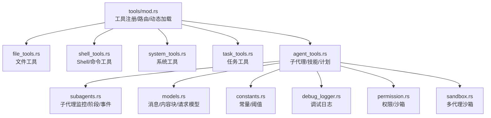
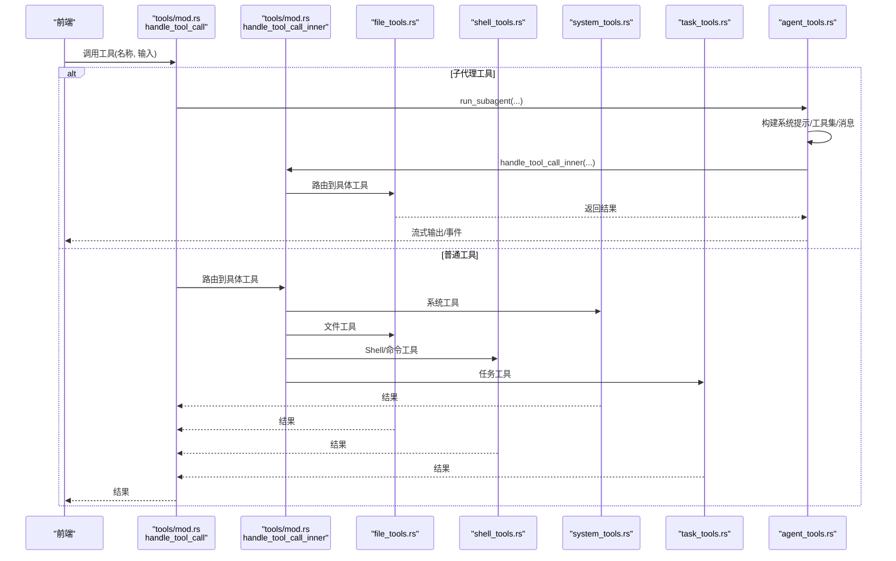
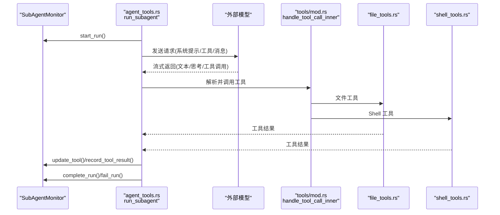
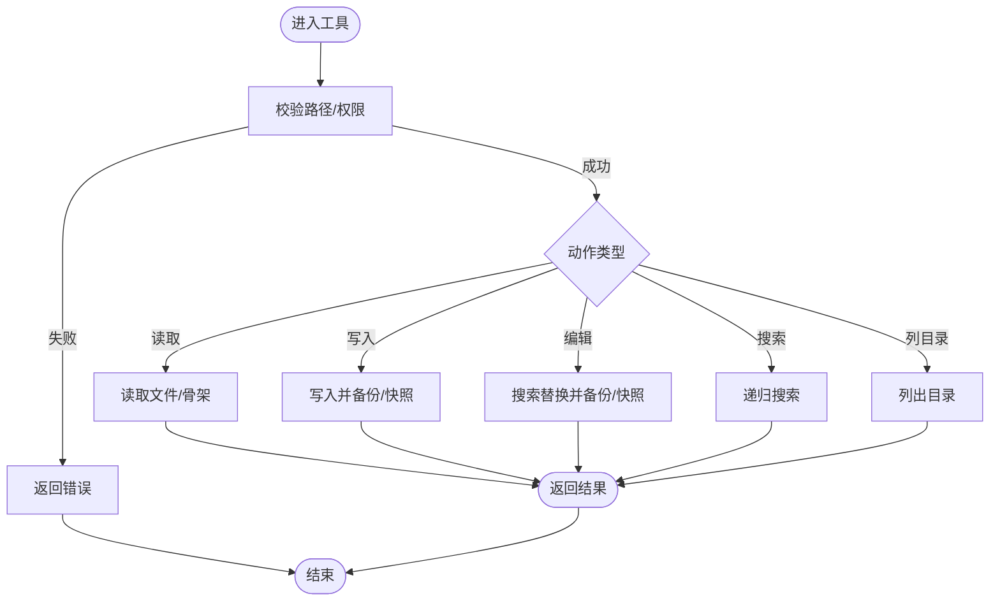
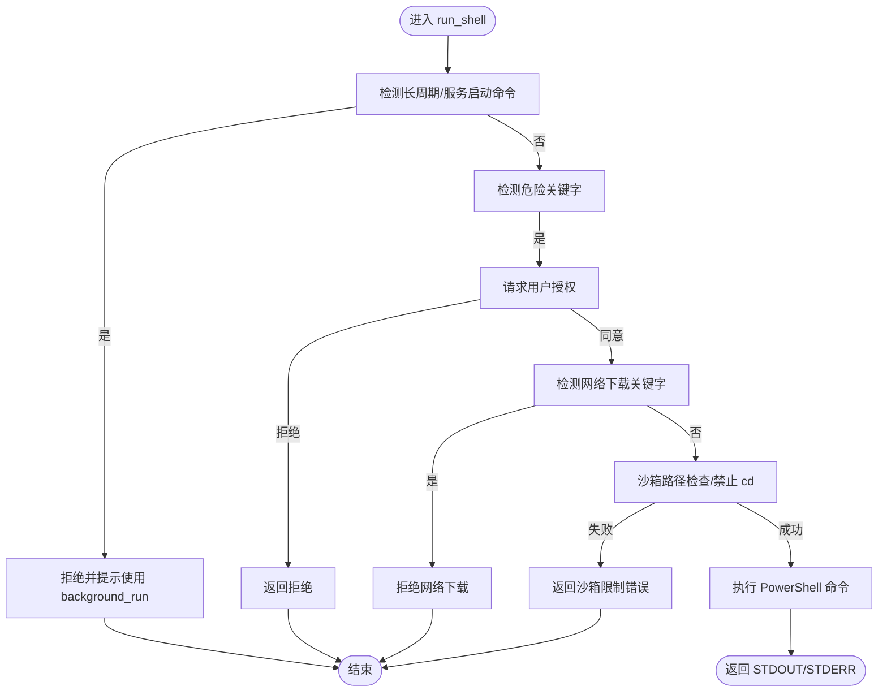
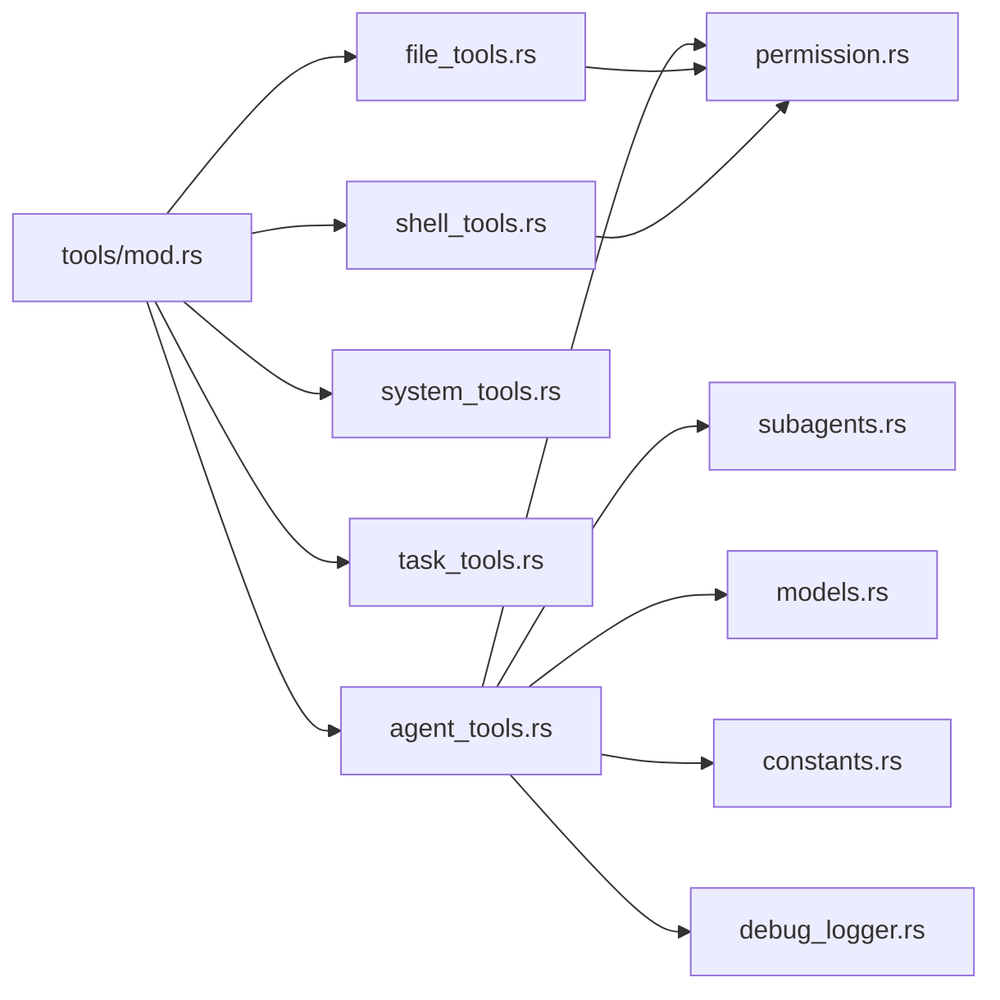

# 插件开发

<cite>
**本文引用的文件**
- [src-tauri/src/core/tools/mod.rs](file://src-tauri/src/core/tools/mod.rs)
- [src-tauri/src/core/tools/permission.rs](file://src-tauri/src/core/tools/permission.rs)
- [src-tauri/src/core/tools/file_tools.rs](file://src-tauri/src/core/tools/file_tools.rs)
- [src-tauri/src/core/tools/shell_tools.rs](file://src-tauri/src/core/tools/shell_tools.rs)
- [src-tauri/src/core/tools/system_tools.rs](file://src-tauri/src/core/tools/system_tools.rs)
- [src-tauri/src/core/tools/task_tools.rs](file://src-tauri/src/core/tools/task_tools.rs)
- [src-tauri/src/core/tools/agent_tools.rs](file://src-tauri/src/core/tools/agent_tools.rs)
- [src-tauri/src/core/models.rs](file://src-tauri/src/core/models.rs)
- [src-tauri/src/core/constants.rs](file://src-tauri/src/core/constants.rs)
- [src-tauri/src/core/subagents.rs](file://src-tauri/src/core/subagents.rs)
- [src-tauri/src/core/agent_runs.rs](file://src-tauri/src/core/agent_runs.rs)
- [src-tauri/src/core/debug_logger.rs](file://src-tauri/src/core/debug_logger.rs)
- [src-tauri/src/core/snapshot_engine/multi_agent/sandbox.rs](file://src-tauri/src/core/snapshot_engine/multi_agent/sandbox.rs)
- [src-tauri/src/main.rs](file://src-tauri/src/main.rs)
</cite>

## 目录
1. [简介](#简介)
2. [项目结构](#项目结构)
3. [核心组件](#核心组件)
4. [架构总览](#架构总览)
5. [详细组件分析](#详细组件分析)
6. [依赖分析](#依赖分析)
7. [性能考虑](#性能考虑)
8. [故障排查指南](#故障排查指南)
9. [结论](#结论)
10. [附录](#附录)

## 简介
本文件面向希望在 JarvisAgent 中开发“工具”（Tool）的开发者，系统性阐述工具系统的架构设计与实现要点，包括：
- 工具注册机制与动态加载策略
- 工具路由分发与调用链
- 自定义工具开发流程（接口规范、参数校验、错误处理）
- 典型工具实现示例（文件操作、系统命令、Shell）
- 工具生命周期管理（初始化、执行、清理）
- 权限控制与沙箱机制
- 工具测试与调试方法

## 项目结构
工具系统位于 Rust 后端模块 src-tauri 下，采用“按功能域划分”的模块组织方式：
- tools 模块：统一导出与路由，负责工具定义、动态加载技能、工具分发
- 各工具子模块：file_tools、shell_tools、system_tools、task_tools、agent_tools
- 权限与沙箱：permission.rs、sandbox.rs（多代理沙箱）
- 子代理执行引擎：agent_tools.rs、subagents.rs
- 模型与常量：models.rs、constants.rs
- 调试日志：debug_logger.rs
- 运行时记录：agent_runs.rs

图表来源
- [src-tauri/src/core/tools/mod.rs:1-454](file://src-tauri/src/core/tools/mod.rs#L1-L454)
- [src-tauri/src/core/tools/file_tools.rs:1-491](file://src-tauri/src/core/tools/file_tools.rs#L1-L491)
- [src-tauri/src/core/tools/shell_tools.rs:1-222](file://src-tauri/src/core/tools/shell_tools.rs#L1-L222)
- [src-tauri/src/core/tools/system_tools.rs:1-90](file://src-tauri/src/core/tools/system_tools.rs#L1-L90)
- [src-tauri/src/core/tools/task_tools.rs:1-74](file://src-tauri/src/core/tools/task_tools.rs#L1-L74)
- [src-tauri/src/core/tools/agent_tools.rs:1-837](file://src-tauri/src/core/tools/agent_tools.rs#L1-L837)
- [src-tauri/src/core/subagents.rs:1-200](file://src-tauri/src/core/subagents.rs#L1-L200)
- [src-tauri/src/core/models.rs:1-200](file://src-tauri/src/core/models.rs#L1-L200)
- [src-tauri/src/core/constants.rs:1-30](file://src-tauri/src/core/constants.rs#L1-L30)
- [src-tauri/src/core/debug_logger.rs:1-186](file://src-tauri/src/core/debug_logger.rs#L1-L186)
- [src-tauri/src/core/tools/permission.rs:1-103](file://src-tauri/src/core/tools/permission.rs#L1-L103)
- [src-tauri/src/core/snapshot_engine/multi_agent/sandbox.rs:101-140](file://src-tauri/src/core/snapshot_engine/multi_agent/sandbox.rs#L101-L140)

章节来源
- [src-tauri/src/core/tools/mod.rs:1-454](file://src-tauri/src/core/tools/mod.rs#L1-L454)
- [src-tauri/src/core/tools/permission.rs:1-103](file://src-tauri/src/core/tools/permission.rs#L1-L103)
- [src-tauri/src/core/tools/file_tools.rs:1-491](file://src-tauri/src/core/tools/file_tools.rs#L1-L491)
- [src-tauri/src/core/tools/shell_tools.rs:1-222](file://src-tauri/src/core/tools/shell_tools.rs#L1-L222)
- [src-tauri/src/core/tools/system_tools.rs:1-90](file://src-tauri/src/core/tools/system_tools.rs#L1-L90)
- [src-tauri/src/core/tools/task_tools.rs:1-74](file://src-tauri/src/core/tools/task_tools.rs#L1-L74)
- [src-tauri/src/core/tools/agent_tools.rs:1-837](file://src-tauri/src/core/tools/agent_tools.rs#L1-L837)
- [src-tauri/src/core/models.rs:1-200](file://src-tauri/src/core/models.rs#L1-L200)
- [src-tauri/src/core/constants.rs:1-30](file://src-tauri/src/core/constants.rs#L1-L30)
- [src-tauri/src/core/subagents.rs:1-200](file://src-tauri/src/core/subagents.rs#L1-L200)
- [src-tauri/src/core/debug_logger.rs:1-186](file://src-tauri/src/core/debug_logger.rs#L1-L186)
- [src-tauri/src/core/snapshot_engine/multi_agent/sandbox.rs:101-140](file://src-tauri/src/core/snapshot_engine/multi_agent/sandbox.rs#L101-L140)

## 核心组件
- 工具注册与路由
  - 工具定义：按意图（CHAT/MEMORY_QUERY/SUBAGENT/PROJECT_ACTION）动态拼装工具清单，包含输入 Schema 校验
  - 路由分发：handle_tool_call/handle_tool_call_inner 将工具名映射到具体实现
  - 动态加载：load_all_skills 从 Agent 家目录扫描 SKILL.md 并解析为 Skill 结构
- 权限与沙箱
  - ensure_path_permission/is_within_workspace：路径安全与沙箱边界校验
  - request_permission：高风险操作的用户授权
  - 多代理沙箱：限制工作目录与命令路径
- 子代理执行引擎
  - run_subagent：构建系统提示词、工具集、消息历史，驱动 LLM 流式推理与工具调用
  - SubAgentMonitor：运行期状态、阶段、事件、令牌统计、取消机制
- 日志与调试
  - DebugLogger：请求/响应/思考/意图分类等日志落盘
  - 工具调用事件：chat-tool-debug、agent-step、chat-thinking 等事件通道

章节来源
- [src-tauri/src/core/tools/mod.rs:22-87](file://src-tauri/src/core/tools/mod.rs#L22-L87)
- [src-tauri/src/core/tools/mod.rs:89-379](file://src-tauri/src/core/tools/mod.rs#L89-L379)
- [src-tauri/src/core/tools/mod.rs:381-453](file://src-tauri/src/core/tools/mod.rs#L381-L453)
- [src-tauri/src/core/tools/permission.rs:49-72](file://src-tauri/src/core/tools/permission.rs#L49-L72)
- [src-tauri/src/core/tools/permission.rs:74-102](file://src-tauri/src/core/tools/permission.rs#L74-L102)
- [src-tauri/src/core/tools/agent_tools.rs:61-721](file://src-tauri/src/core/tools/agent_tools.rs#L61-L721)
- [src-tauri/src/core/subagents.rs:73-177](file://src-tauri/src/core/subagents.rs#L73-L177)
- [src-tauri/src/core/debug_logger.rs:13-105](file://src-tauri/src/core/debug_logger.rs#L13-L105)

## 架构总览
工具系统采用“集中式路由 + 分层职责”的设计：
- tools/mod.rs 负责工具清单与路由
- 各工具模块独立实现具体能力
- 权限与沙箱在工具执行前统一校验
- 子代理引擎贯穿工具调用与事件上报

图表来源
- [src-tauri/src/core/tools/mod.rs:381-453](file://src-tauri/src/core/tools/mod.rs#L381-L453)
- [src-tauri/src/core/tools/file_tools.rs:43-94](file://src-tauri/src/core/tools/file_tools.rs#L43-L94)
- [src-tauri/src/core/tools/shell_tools.rs:49-130](file://src-tauri/src/core/tools/shell_tools.rs#L49-L130)
- [src-tauri/src/core/tools/system_tools.rs:18-43](file://src-tauri/src/core/tools/system_tools.rs#L18-L43)
- [src-tauri/src/core/tools/task_tools.rs:7-74](file://src-tauri/src/core/tools/task_tools.rs#L7-L74)
- [src-tauri/src/core/tools/agent_tools.rs:61-721](file://src-tauri/src/core/tools/agent_tools.rs#L61-L721)

## 详细组件分析

### 工具注册与动态加载
- 工具定义
  - 按意图返回不同工具集合，包含名称、描述、输入 Schema
  - MEMORY_QUERY 意图下注入记忆相关工具
  - SUBAGENT 意图下注入文件/系统/任务工具，并移除某些高风险工具
- 动态加载技能
  - 从 Agent 家目录扫描 skills 子目录，解析 SKILL.md 为 Skill 结构
  - 子代理启动时将技能注入系统提示词

章节来源
- [src-tauri/src/core/tools/mod.rs:89-379](file://src-tauri/src/core/tools/mod.rs#L89-L379)
- [src-tauri/src/core/tools/mod.rs:22-49](file://src-tauri/src/core/tools/mod.rs#L22-L49)

### 工具路由分发
- handle_tool_call：识别子代理工具 task，走 run_subagent；其余走 handle_tool_call_inner
- handle_tool_call_inner：通过匹配表将工具名映射到具体模块实现

章节来源
- [src-tauri/src/core/tools/mod.rs:381-453](file://src-tauri/src/core/tools/mod.rs#L381-L453)

### 权限控制与沙箱
- ensure_path_permission：校验路径安全性与沙箱边界
- is_within_workspace：规范化路径后判断是否在工作目录内
- request_permission：高风险命令/全局工作区变更触发用户授权
- 多代理沙箱：限制命令路径、禁止目录切换、限定执行目录

章节来源
- [src-tauri/src/core/tools/permission.rs:49-72](file://src-tauri/src/core/tools/permission.rs#L49-L72)
- [src-tauri/src/core/tools/permission.rs:74-102](file://src-tauri/src/core/tools/permission.rs#L74-L102)
- [src-tauri/src/core/tools/shell_tools.rs:17-108](file://src-tauri/src/core/tools/shell_tools.rs#L17-L108)
- [src-tauri/src/core/snapshot_engine/multi_agent/sandbox.rs:101-140](file://src-tauri/src/core/snapshot_engine/multi_agent/sandbox.rs#L101-L140)

### 子代理执行引擎
- run_subagent：构建系统提示词（含技能）、工具集、消息历史；流式接收 LLM 输出；解析工具调用；调用 handle_tool_call_inner；记录事件与令牌；支持取消
- SubAgentMonitor：运行状态、阶段、事件、令牌统计、取消令牌

图表来源
- [src-tauri/src/core/tools/agent_tools.rs:61-721](file://src-tauri/src/core/tools/agent_tools.rs#L61-L721)
- [src-tauri/src/core/subagents.rs:73-177](file://src-tauri/src/core/subagents.rs#L73-L177)
- [src-tauri/src/core/subagents.rs:234-302](file://src-tauri/src/core/subagents.rs#L234-L302)
- [src-tauri/src/core/subagents.rs:341-414](file://src-tauri/src/core/subagents.rs#L341-L414)

章节来源
- [src-tauri/src/core/tools/agent_tools.rs:61-721](file://src-tauri/src/core/tools/agent_tools.rs#L61-L721)
- [src-tauri/src/core/subagents.rs:73-177](file://src-tauri/src/core/subagents.rs#L73-L177)
- [src-tauri/src/core/subagents.rs:234-302](file://src-tauri/src/core/subagents.rs#L234-L302)
- [src-tauri/src/core/subagents.rs:341-414](file://src-tauri/src/core/subagents.rs#L341-L414)

### 文件操作工具
- 读取文件：支持行号范围，自动处理文件被占用场景
- 读取骨架：提取函数/类/导入等结构骨架
- 写入文件：自动备份、记录操作、创建快照
- 编辑文件：基于搜索替换，自动备份、记录操作、创建快照
- 搜索：递归搜索关键词，忽略常见二进制与隐藏文件
- 列目录：安全列出目录内容

图表来源
- [src-tauri/src/core/tools/file_tools.rs:43-94](file://src-tauri/src/core/tools/file_tools.rs#L43-L94)
- [src-tauri/src/core/tools/file_tools.rs:96-146](file://src-tauri/src/core/tools/file_tools.rs#L96-L146)
- [src-tauri/src/core/tools/file_tools.rs:148-223](file://src-tauri/src/core/tools/file_tools.rs#L148-L223)
- [src-tauri/src/core/tools/file_tools.rs:225-305](file://src-tauri/src/core/tools/file_tools.rs#L225-L305)
- [src-tauri/src/core/tools/file_tools.rs:307-334](file://src-tauri/src/core/tools/file_tools.rs#L307-L334)
- [src-tauri/src/core/tools/file_tools.rs:336-365](file://src-tauri/src/core/tools/file_tools.rs#L336-L365)

章节来源
- [src-tauri/src/core/tools/file_tools.rs:43-94](file://src-tauri/src/core/tools/file_tools.rs#L43-L94)
- [src-tauri/src/core/tools/file_tools.rs:96-146](file://src-tauri/src/core/tools/file_tools.rs#L96-L146)
- [src-tauri/src/core/tools/file_tools.rs:148-223](file://src-tauri/src/core/tools/file_tools.rs#L148-L223)
- [src-tauri/src/core/tools/file_tools.rs:225-305](file://src-tauri/src/core/tools/file_tools.rs#L225-L305)
- [src-tauri/src/core/tools/file_tools.rs:307-334](file://src-tauri/src/core/tools/file_tools.rs#L307-L334)
- [src-tauri/src/core/tools/file_tools.rs:336-365](file://src-tauri/src/core/tools/file_tools.rs#L336-L365)

### 系统命令工具
- run_shell：执行 PowerShell 命令，阻塞同步；长周期任务强制使用 background_run；拦截危险命令与网络下载；沙箱内禁止目录切换
- git_command：只读 Git 命令，拦截高风险参数；沙箱内校验参数路径
- background_run/check_background：后台任务执行与状态查询

图表来源
- [src-tauri/src/core/tools/shell_tools.rs:49-130](file://src-tauri/src/core/tools/shell_tools.rs#L49-L130)
- [src-tauri/src/core/tools/shell_tools.rs:132-181](file://src-tauri/src/core/tools/shell_tools.rs#L132-L181)
- [src-tauri/src/core/tools/shell_tools.rs:183-222](file://src-tauri/src/core/tools/shell_tools.rs#L183-L222)

章节来源
- [src-tauri/src/core/tools/shell_tools.rs:49-130](file://src-tauri/src/core/tools/shell_tools.rs#L49-L130)
- [src-tauri/src/core/tools/shell_tools.rs:132-181](file://src-tauri/src/core/tools/shell_tools.rs#L132-L181)
- [src-tauri/src/core/tools/shell_tools.rs:183-222](file://src-tauri/src/core/tools/shell_tools.rs#L183-L222)

### 系统信息与工作区工具
- get_system_info：返回 OS/CWD/Home，若沙箱则标注
- set_workspace：切换全局工作区（沙箱会话中禁止）

章节来源
- [src-tauri/src/core/tools/system_tools.rs:18-43](file://src-tauri/src/core/tools/system_tools.rs#L18-L43)
- [src-tauri/src/core/tools/system_tools.rs:45-89](file://src-tauri/src/core/tools/system_tools.rs#L45-L89)

### 任务管理工具
- task_create/task_update/task_list/task_get/task_summary：基于 TaskManager 的任务持久化与查询

章节来源
- [src-tauri/src/core/tools/task_tools.rs:7-74](file://src-tauri/src/core/tools/task_tools.rs#L7-L74)

### 技能/计划/上下文工具
- load_skill：动态加载技能（SKILL.md）
- compact/dream：上下文压缩与记忆整理
- propose_plan：方案审批，持久化到 .plans 并触发前端预览

章节来源
- [src-tauri/src/core/tools/agent_tools.rs:19-38](file://src-tauri/src/core/tools/agent_tools.rs#L19-L38)
- [src-tauri/src/core/tools/agent_tools.rs:40-59](file://src-tauri/src/core/tools/agent_tools.rs#L40-L59)
- [src-tauri/src/core/tools/agent_tools.rs:723-837](file://src-tauri/src/core/tools/agent_tools.rs#L723-L837)

## 依赖分析
- 模块耦合
  - tools/mod.rs 作为中枢，依赖各工具模块与 models、constants
  - agent_tools.rs 依赖 models、subagents、permissions、tasks 等
  - file_tools.rs 依赖 permission、checkpoint/snapshot_engine
  - shell_tools.rs 依赖 permission、background 管理器
- 外部依赖
  - Tauri 事件系统（Emitter/Manager）用于前端通信
  - reqwest 与 SSE 事件源用于流式响应
  - tokio/cancellation 用于子代理取消

图表来源
- [src-tauri/src/core/tools/mod.rs:1-20](file://src-tauri/src/core/tools/mod.rs#L1-L20)
- [src-tauri/src/core/tools/agent_tools.rs:1-17](file://src-tauri/src/core/tools/agent_tools.rs#L1-L17)
- [src-tauri/src/core/tools/file_tools.rs:1-7](file://src-tauri/src/core/tools/file_tools.rs#L1-L7)
- [src-tauri/src/core/tools/shell_tools.rs:1-6](file://src-tauri/src/core/tools/shell_tools.rs#L1-L6)
- [src-tauri/src/core/subagents.rs:1-8](file://src-tauri/src/core/subagents.rs#L1-L8)
- [src-tauri/src/core/models.rs:1-20](file://src-tauri/src/core/models.rs#L1-L20)
- [src-tauri/src/core/constants.rs:1-30](file://src-tauri/src/core/constants.rs#L1-L30)
- [src-tauri/src/core/debug_logger.rs:1-6](file://src-tauri/src/core/debug_logger.rs#L1-L6)

章节来源
- [src-tauri/src/core/tools/mod.rs:1-20](file://src-tauri/src/core/tools/mod.rs#L1-L20)
- [src-tauri/src/core/tools/agent_tools.rs:1-17](file://src-tauri/src/core/tools/agent_tools.rs#L1-L17)
- [src-tauri/src/core/tools/file_tools.rs:1-7](file://src-tauri/src/core/tools/file_tools.rs#L1-L7)
- [src-tauri/src/core/tools/shell_tools.rs:1-6](file://src-tauri/src/core/tools/shell_tools.rs#L1-L6)
- [src-tauri/src/core/subagents.rs:1-8](file://src-tauri/src/core/subagents.rs#L1-L8)
- [src-tauri/src/core/models.rs:1-20](file://src-tauri/src/core/models.rs#L1-L20)
- [src-tauri/src/core/constants.rs:1-30](file://src-tauri/src/core/constants.rs#L1-L30)
- [src-tauri/src/core/debug_logger.rs:1-6](file://src-tauri/src/core/debug_logger.rs#L1-L6)

## 性能考虑
- 上下文压缩与令牌预算
  - MAX_TOKENS_CONTEXT 控制上下文长度
  - MAX_AGENT_LOOP_BEFORE_CONFIRM 限制子代理轮次，防止长尾
- 文件搜索与 IO
  - 搜索时设置结果上限，避免大量小文件 IO
- Shell 执行
  - 阻塞式 run_shell 禁止长周期任务，后台任务使用 background_run
- 日志与事件
  - DebugLogger 仅在必要时写盘，避免频繁 IO

章节来源
- [src-tauri/src/core/constants.rs:22-30](file://src-tauri/src/core/constants.rs#L22-L30)
- [src-tauri/src/core/tools/agent_tools.rs:160-164](file://src-tauri/src/core/tools/agent_tools.rs#L160-L164)
- [src-tauri/src/core/tools/file_tools.rs:327-334](file://src-tauri/src/core/tools/file_tools.rs#L327-L334)

## 故障排查指南
- 工具参数解析失败
  - 子代理与主代理均会在参数解析失败时记录错误、发送 chat-tool-debug 事件
  - 建议查看 DebugLogger 输出与前端事件面板
- 权限拒绝
  - request_permission 返回 reject 时，需在前端确认授权
- 沙箱限制
  - is_within_workspace/ensure_path_permission 拦截越权路径
  - run_shell 拦截危险命令与网络下载
- 子代理异常
  - SubAgentMonitor.fail_run 记录错误与摘要
  - 支持取消令牌 cancel_run，终止运行

章节来源
- [src-tauri/src/core/tools/agent_tools.rs:516-544](file://src-tauri/src/core/tools/agent_tools.rs#L516-L544)
- [src-tauri/src/core/agent_runs.rs:272-300](file://src-tauri/src/core/agent_runs.rs#L272-L300)
- [src-tauri/src/core/tools/permission.rs:74-102](file://src-tauri/src/core/tools/permission.rs#L74-L102)
- [src-tauri/src/core/tools/shell_tools.rs:77-94](file://src-tauri/src/core/tools/shell_tools.rs#L77-L94)
- [src-tauri/src/core/subagents.rs:341-377](file://src-tauri/src/core/subagents.rs#L341-L377)

## 结论
JarvisAgent 的工具系统以“集中路由 + 分层职责 + 权限与沙箱”为核心设计，既保证了扩展性与安全性，又提供了完善的子代理执行与可观测性。开发者可遵循本文档的接口规范与最佳实践，快速实现稳定、可测试、可审计的工具。

## 附录

### 自定义工具开发流程（模板步骤）
- 定义工具
  - 在 tools/mod.rs 中添加工具定义（名称、描述、输入 Schema）
  - 在 tools/mod.rs 的路由表中新增分支映射
- 实现工具
  - 在对应模块（如 file_tools.rs）实现异步函数，接收 app、input、session_id
  - 使用 ensure_path_permission 校验路径与沙箱
  - 返回字符串结果，或触发事件/持久化
- 注册与测试
  - 重启应用或触发工具刷新
  - 通过前端/事件面板观察行为与日志

章节来源
- [src-tauri/src/core/tools/mod.rs:89-379](file://src-tauri/src/core/tools/mod.rs#L89-L379)
- [src-tauri/src/core/tools/mod.rs:381-453](file://src-tauri/src/core/tools/mod.rs#L381-L453)
- [src-tauri/src/core/tools/permission.rs:49-72](file://src-tauri/src/core/tools/permission.rs#L49-L72)

### 工具生命周期管理
- 初始化：加载工具定义、技能、会话上下文
- 执行：参数校验、权限检查、调用实现、事件上报
- 清理：子代理结束、令牌统计、日志落盘、状态持久化

章节来源
- [src-tauri/src/core/tools/agent_tools.rs:116-123](file://src-tauri/src/core/tools/agent_tools.rs#L116-L123)
- [src-tauri/src/core/subagents.rs:116-177](file://src-tauri/src/core/subagents.rs#L116-L177)
- [src-tauri/src/core/debug_logger.rs:65-105](file://src-tauri/src/core/debug_logger.rs#L65-L105)

### 工具测试与调试技巧
- 使用 DebugLogger 查看请求/响应与思考记录
- 关注 chat-tool-debug、agent-step、chat-thinking 等事件
- 对长周期任务使用 background_run 并定期 check_background
- 对危险命令与路径变更启用 request_permission

章节来源
- [src-tauri/src/core/debug_logger.rs:13-105](file://src-tauri/src/core/debug_logger.rs#L13-L105)
- [src-tauri/src/core/tools/shell_tools.rs:183-222](file://src-tauri/src/core/tools/shell_tools.rs#L183-L222)
- [src-tauri/src/core/tools/permission.rs:74-102](file://src-tauri/src/core/tools/permission.rs#L74-L102)