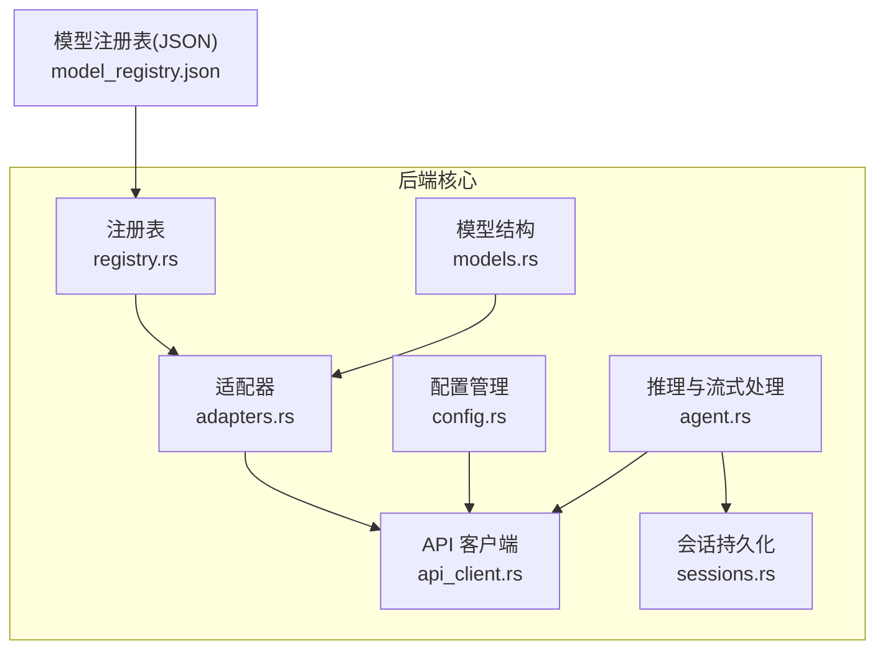
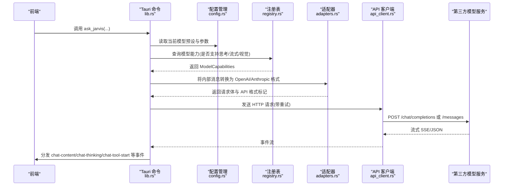
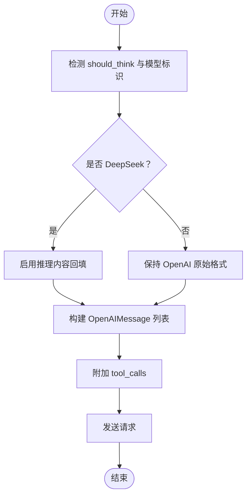
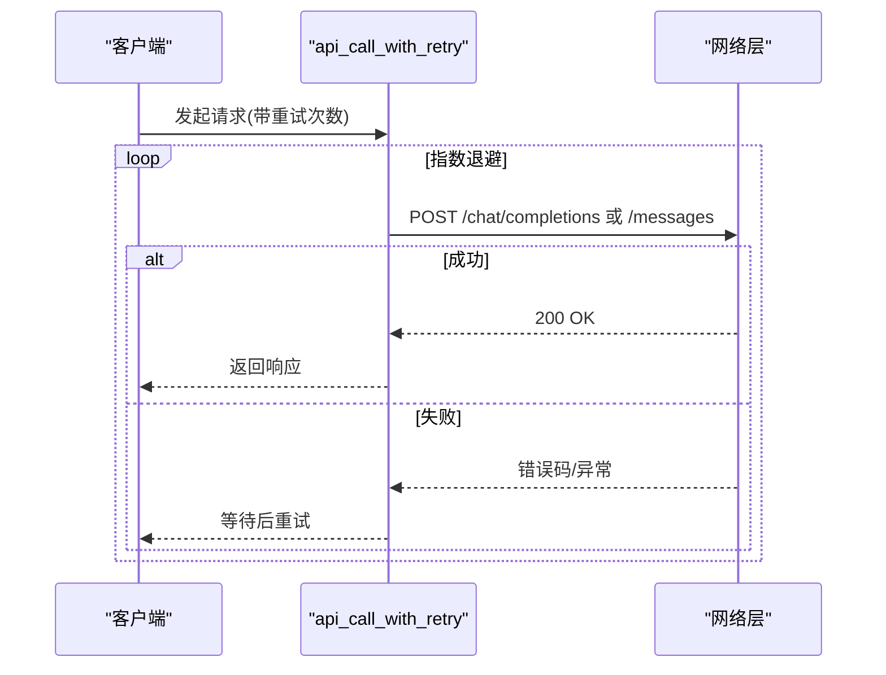
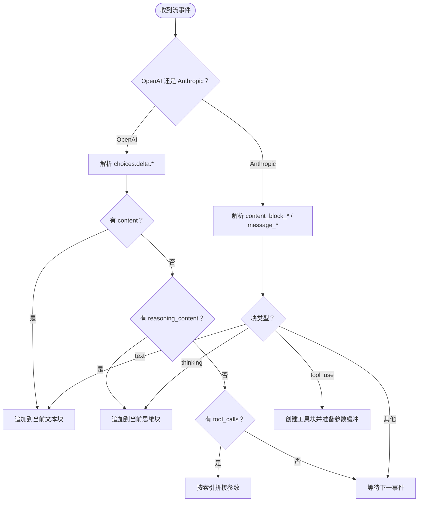
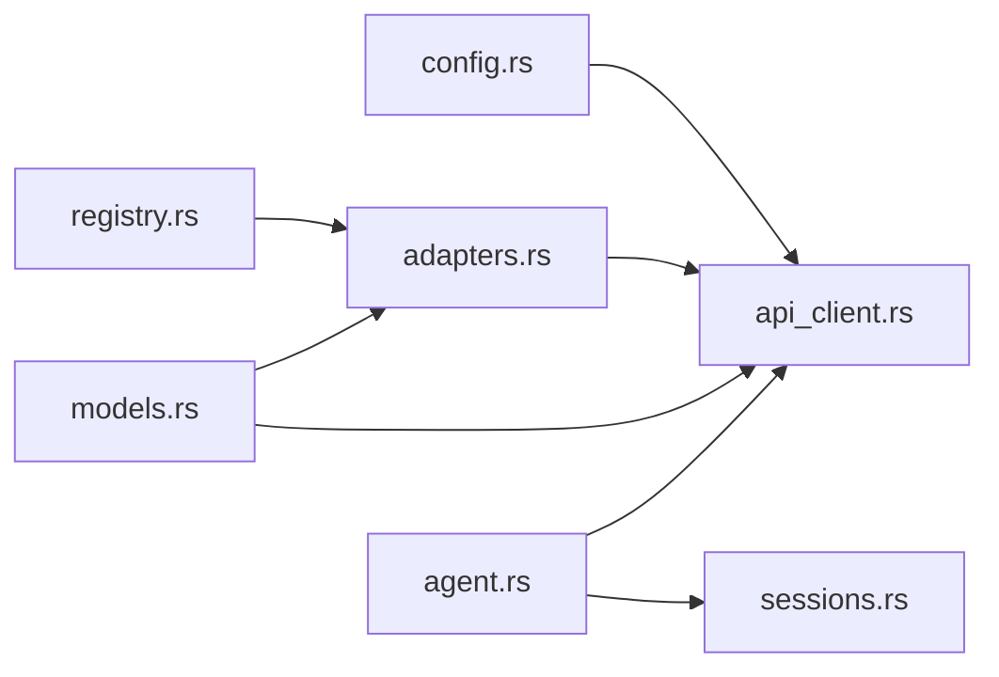

# 模型扩展

<cite>
**本文引用的文件**
- [model_registry.json](file://src-tauri/model_registry.json)
- [adapters.rs](file://src-tauri/src/core/adapters.rs)
- [models.rs](file://src-tauri/src/core/models.rs)
- [registry.rs](file://src-tauri/src/core/registry.rs)
- [api_client.rs](file://src-tauri/src/core/api_client.rs)
- [config.rs](file://src-tauri/src/core/config.rs)
- [sessions.rs](file://src-tauri/src/core/sessions.rs)
- [agent.rs](file://src-tauri/src/core/agent.rs)
- [lib.rs](file://src-tauri/src/lib.rs)
</cite>

## 目录
1. [简介](#简介)
2. [项目结构](#项目结构)
3. [核心组件](#核心组件)
4. [架构总览](#架构总览)
5. [详细组件分析](#详细组件分析)
6. [依赖关系分析](#依赖关系分析)
7. [性能考量](#性能考量)
8. [故障排查指南](#故障排查指南)
9. [结论](#结论)
10. [附录](#附录)

## 简介
本文件面向希望在 JarvisAgent 中新增或扩展模型接入的开发者，系统性地说明以下内容：
- 模型注册表配置方法：JSON 结构、字段定义、参数说明
- 新模型集成流程：API 适配器开发、消息格式转换、工具调用处理
- 适配器开发机制：OpenAI 格式转换、Anthropic 格式适配、多模型统一接口
- 具体模型集成示例：DeepSeek、Claude、GPT、Gemini、Qwen 等
- 推理内容回填机制与思维过程处理
- 模型配置最佳实践与性能优化建议

## 项目结构
JarvisAgent 的模型扩展主要集中在 Rust 后端的 core 模块，前端通过 Tauri 命令与后端交互。关键文件如下：
- 模型注册表：model_registry.json
- 模型与请求结构：models.rs
- 适配器：adapters.rs
- 注册表查询：registry.rs
- API 客户端与重试：api_client.rs
- 配置管理：config.rs
- 会话持久化：sessions.rs
- 流式处理与思维回填：agent.rs
- Tauri 命令注册：lib.rs

图表来源
- [registry.rs:57-102](file://src-tauri/src/core/registry.rs#L57-L102)
- [adapters.rs:84-258](file://src-tauri/src/core/adapters.rs#L84-L258)
- [api_client.rs:4-165](file://src-tauri/src/core/api_client.rs#L4-L165)
- [config.rs:102-134](file://src-tauri/src/core/config.rs#L102-L134)
- [sessions.rs:218-364](file://src-tauri/src/core/sessions.rs#L218-L364)
- [agent.rs:207-399](file://src-tauri/src/core/agent.rs#L207-L399)

章节来源
- [lib.rs:102-182](file://src-tauri/src/lib.rs#L102-L182)

## 核心组件
- 模型注册表：编译时内嵌 JSON，提供模型能力查询与前端下拉选择
- 统一消息与工具结构：OpenAI/Anthropic 请求结构与内容块定义
- 适配器：消息格式转换、工具定义转换、推理内容回填
- API 客户端：统一的 HTTP 调用与指数退避重试
- 配置管理：模型预设、基础 URL 规范化、参数持久化
- 会话持久化：消息过滤、图片落盘、标题提取
- 流式处理：OpenAI/Anthropic 流式事件解析、工具调用增量拼接、思维内容回填

章节来源
- [registry.rs:57-102](file://src-tauri/src/core/registry.rs#L57-L102)
- [models.rs:46-140](file://src-tauri/src/core/models.rs#L46-L140)
- [adapters.rs:84-258](file://src-tauri/src/core/adapters.rs#L84-L258)
- [api_client.rs:4-165](file://src-tauri/src/core/api_client.rs#L4-L165)
- [config.rs:102-134](file://src-tauri/src/core/config.rs#L102-L134)
- [sessions.rs:218-364](file://src-tauri/src/core/sessions.rs#L218-L364)
- [agent.rs:207-399](file://src-tauri/src/core/agent.rs#L207-L399)

## 架构总览
下图展示了从前端发起一次推理请求到返回流式结果的整体链路，以及模型能力如何驱动适配器与客户端行为。

图表来源
- [lib.rs:102-182](file://src-tauri/src/lib.rs#L102-L182)
- [config.rs:102-134](file://src-tauri/src/core/config.rs#L102-L134)
- [registry.rs:74-96](file://src-tauri/src/core/registry.rs#L74-L96)
- [adapters.rs:84-258](file://src-tauri/src/core/adapters.rs#L84-L258)
- [api_client.rs:4-165](file://src-tauri/src/core/api_client.rs#L4-L165)
- [agent.rs:207-399](file://src-tauri/src/core/agent.rs#L207-L399)

## 详细组件分析

### 模型注册表配置方法
- 数据来源：model_registry.json 在编译时通过 include_str! 内嵌至二进制，确保部署时无需外部文件
- 结构要点：
  - models: 数组，每项包含 id、provider、display_name、api_format、capabilities
  - capabilities: streaming、thinking、thinking_param、temperature、vision、max_tokens、notes、thinkingEffortValues（可选）
- 查询策略：
  - 精确匹配 id（大小写不敏感）
  - 模糊匹配：注册表 id 包含用户输入，或用户输入包含注册表 id
- 前端交互：
  - 列出注册表：list_model_registry
  - 查询能力：get_model_capabilities

章节来源
- [model_registry.json:1-496](file://src-tauri/model_registry.json#L1-L496)
- [registry.rs:57-102](file://src-tauri/src/core/registry.rs#L57-L102)

### 统一消息与工具结构
- 内部消息模型：Message、Content、ContentBlock（text/thinking/tool_use/tool_result/image）
- OpenAI 请求结构：OpenAIRequest、OpenAIMessage、OpenAIToolCall 等
- Anthropic 请求结构：AnthropicRequest（包含 thinking、temperature 等）
- 思维配置：ThinkingConfig（type/enabled/disabled，budget_tokens）

章节来源
- [models.rs:144-188](file://src-tauri/src/core/models.rs#L144-L188)
- [models.rs:46-140](file://src-tauri/src/core/models.rs#L46-L140)

### 适配器开发机制
- OpenAI 格式转换：
  - translate_messages_to_openai / translate_messages_to_openai_with_reasoning_backfill
  - 支持多模态图片（data URI）、工具调用（tool_calls）、思维内容（reasoning_content）
- 工具定义转换：
  - translate_tools_to_openai：将工具定义从通用格式转为 OpenAI function 类型
- 推理内容回填：
  - should_backfill_deepseek_reasoning_content：识别 DeepSeek 模型并决定是否回填 reasoning_content
  - reasoning_content_from_thinking / non_deepseek_reasoning_placeholder：构造占位或实际思维内容
- JSON 工具输入解析：
  - parse_streamed_tool_input：容错解析流式 JSON 工具参数

图表来源
- [adapters.rs:226-238](file://src-tauri/src/core/adapters.rs#L226-L238)
- [adapters.rs:84-223](file://src-tauri/src/core/adapters.rs#L84-L223)
- [adapters.rs:240-258](file://src-tauri/src/core/adapters.rs#L240-L258)

章节来源
- [adapters.rs:84-258](file://src-tauri/src/core/adapters.rs#L84-L258)

### API 适配器开发与消息格式转换
- OpenAI 适配：
  - Authorization: Bearer
  - 基础 URL 规范化：/v1/chat/completions
  - 流式：OpenAI 格式 choices[].delta.content/reasoning_content/tool_calls
- Anthropic 适配：
  - x-api-key + anthropic-version
  - 基础 URL 规范化：/v1/messages
  - 流式：message_start/message_delta + content_block_start/delta
- 重试机制：指数退避，最多 N 次，期间向前端广播重试提示与 agent-step 事件

图表来源
- [api_client.rs:4-75](file://src-tauri/src/core/api_client.rs#L4-L75)

章节来源
- [api_client.rs:4-165](file://src-tauri/src/core/api_client.rs#L4-L165)

### 工具调用处理与思维过程处理
- 流式事件解析：
  - OpenAI：choices[].delta.content、reasoning_content、tool_calls
  - Anthropic：content_block_start/delta、message_start/delta
- 工具参数增量拼接：根据索引维护缓冲区，逐步拼接 JSON 字符串，最终解析为结构化参数
- 思维过程处理：
  - 将 thinking 内容以 ContentBlock::Thinking 形式累积
  - DeepSeek 回填：当 should_backfill_deepseek_reasoning_content 为真时，assistant 消息附加 reasoning_content 占位或真实内容

图表来源
- [agent.rs:207-399](file://src-tauri/src/core/agent.rs#L207-L399)

章节来源
- [agent.rs:207-399](file://src-tauri/src/core/agent.rs#L207-L399)

### 具体模型集成示例
以下示例基于注册表中的模型能力字段，指导如何在新模型接入时正确配置与适配：

- DeepSeek
  - apiFormat: openai
  - capabilities.thinking: true
  - capabilities.thinkingParam: reasoning_effort
  - capabilities.temperature: false（思考模式下不可调）
  - 适配要点：启用推理时禁用 temperature；必要时使用 should_backfill_deepseek_reasoning_content 回填 reasoning_content
  - 参考注册项：[model_registry.json:5-62](file://src-tauri/model_registry.json#L5-L62)

- Claude（Anthropic）
  - apiFormat: anthropic
  - capabilities.thinking: true（部分版本支持 Extended Thinking）
  - capabilities.thinkingParam: thinking
  - capabilities.vision: true（部分版本支持）
  - 适配要点：Anthropic 请求体包含 thinking 字段；流式事件为 content_block_start/delta
  - 参考注册项：[model_registry.json:63-135](file://src-tauri/model_registry.json#L63-L135)

- GPT（OpenAI）
  - apiFormat: openai
  - 支持 reasoning_effort（多个版本差异）
  - capabilities.temperature: false（思考模式下不可调）
  - capabilities.vision: true（多数版本支持）
  - 适配要点：根据具体版本选择 reasoning_effort 值集合；注意 Pro 版本可能不支持流式 Responses API
  - 参考注册项：[model_registry.json:136-291](file://src-tauri/model_registry.json#L136-L291)

- Gemini（OpenAI 格式）
  - apiFormat: openai
  - capabilities.thinkingParam: thinkingBudget
  - capabilities.temperature: true（可调）
  - 适配要点：thinkingBudget 控制思考强度；0 表示关闭思考
  - 参考注册项：[model_registry.json:334-377](file://src-tauri/model_registry.json#L334-L377)

- Qwen（OpenAI 格式）
  - apiFormat: openai
  - capabilities.thinkingParam: enable_thinking
  - 适配要点：布尔开关控制是否启用思考
  - 参考注册项：[model_registry.json:378-450](file://src-tauri/model_registry.json#L378-L450)

- 豆包（OpenAI 格式）
  - apiFormat: openai
  - capabilities.thinkingParam: thinking
  - capabilities.vision: true
  - 适配要点：支持深度思考、多模态理解、工具调用
  - 参考注册项：[model_registry.json:451-480](file://src-tauri/model_registry.json#L451-L480)

- MIMO（OpenAI 格式）
  - apiFormat: anthropic
  - capabilities.thinking: false
  - 适配要点：当前版本暂无官方思考参数支持
  - 参考注册项：[model_registry.json:481-494](file://src-tauri/model_registry.json#L481-L494)

章节来源
- [model_registry.json:1-496](file://src-tauri/model_registry.json#L1-L496)
- [adapters.rs:226-238](file://src-tauri/src/core/adapters.rs#L226-L238)

### 模型配置最佳实践
- 预设与切换
  - 使用 AppConfig + ModelProfile 管理多模型预设，支持全局与会话级切换
  - 基础 URL 自动规范化：/v1/chat/completions 或 /v1/messages
- 参数约束
  - 当模型处于“思考模式”时，通常禁用 temperature；注册表 capabilities.temperature 明确标注
  - 不同模型的 reasoning_effort/thinking/thinkingBudget 值域不同，需严格对照注册表
- 图像处理
  - 会话保存时自动过滤工具消息，仅保留文本与图像；图像以文件形式落盘，避免 JSON 过大
- 重试与可观测性
  - API 调用采用指数退避重试；前端可接收 chat-stream 与 agent-step 事件了解重试进度

章节来源
- [config.rs:102-134](file://src-tauri/src/core/config.rs#L102-L134)
- [sessions.rs:218-364](file://src-tauri/src/core/sessions.rs#L218-L364)
- [api_client.rs:4-75](file://src-tauri/src/core/api_client.rs#L4-L75)

## 依赖关系分析
- 注册表与适配器：registry.rs 提供 ModelCapabilities，adapters.rs 根据 capabilities 决策是否回填推理内容与参数传递
- 配置与 API：config.rs 规范化 base_url 与参数，api_client.rs 依据 api_format 发送请求头与路径
- 流式处理：agent.rs 解析来自 OpenAI/Anthropic 的流事件，组装 ContentBlock 并向前端广播

图表来源
- [registry.rs:57-102](file://src-tauri/src/core/registry.rs#L57-L102)
- [adapters.rs:84-258](file://src-tauri/src/core/adapters.rs#L84-L258)
- [api_client.rs:4-165](file://src-tauri/src/core/api_client.rs#L4-L165)
- [config.rs:102-134](file://src-tauri/src/core/config.rs#L102-L134)
- [sessions.rs:218-364](file://src-tauri/src/core/sessions.rs#L218-L364)
- [agent.rs:207-399](file://src-tauri/src/core/agent.rs#L207-L399)

章节来源
- [lib.rs:102-182](file://src-tauri/src/lib.rs#L102-L182)

## 性能考量
- 流式输出：优先使用支持 streaming 的模型，降低首字延迟
- 请求头与路径：统一规范化 base_url，减少错误与重试
- 图像体积：通过配置项限制图片宽高与质量，减少传输与解析成本
- 会话存储：保存时过滤工具消息，仅保留文本与图像，显著减小文件体积
- 重试策略：指数退避避免雪崩，结合前端事件反馈提升用户体验

## 故障排查指南
- API 调用失败
  - 检查 api_format 与基础 URL 是否正确（/v1/chat/completions 或 /v1/messages）
  - 查看重试事件 chat-stream 与 agent-step，确认退避次数与最后一次错误
- 流式解析异常
  - OpenAI：确认 choices[].delta 字段存在；工具参数使用 parse_streamed_tool_input 容错解析
  - Anthropic：确认 content_block_start/delta 与 message_start/delta 事件顺序
- 思维内容缺失
  - 确认 should_backfill_deepseek_reasoning_content 判定逻辑与模型标识
  - 检查 reasoning_content 是否被正确附加到 assistant 消息
- 图像显示问题
  - 确认 sessions 保存时图片已落盘；加载时通过 sessions.load_image_data 读取 Base64

章节来源
- [api_client.rs:4-75](file://src-tauri/src/core/api_client.rs#L4-L75)
- [adapters.rs:42-62](file://src-tauri/src/core/adapters.rs#L42-L62)
- [agent.rs:207-399](file://src-tauri/src/core/agent.rs#L207-L399)
- [sessions.rs:218-364](file://src-tauri/src/core/sessions.rs#L218-L364)

## 结论
通过模型注册表与统一的适配器、请求结构、流式处理机制，JarvisAgent 实现了对多家模型厂商的无缝接入。开发者只需在注册表中补充新模型能力，并在适配器与客户端层面遵循统一的参数与事件规范，即可快速完成新模型集成。配合配置管理与会话持久化，可在保证性能的同时获得良好的可观测性与可维护性。

## 附录
- 前端命令注册：lib.rs 中列出的命令（如 get_model_capabilities、list_model_registry、ask_jarvis 等）为模型扩展与查询提供入口
- 模型注册表字段参考：见 model_registry.json 的 models 数组与 capabilities 字段

章节来源
- [lib.rs:102-182](file://src-tauri/src/lib.rs#L102-L182)
- [model_registry.json:1-496](file://src-tauri/model_registry.json#L1-L496)