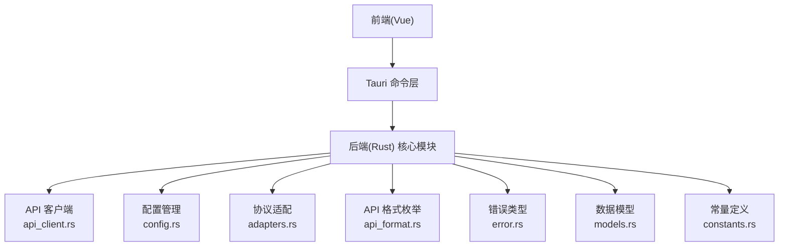
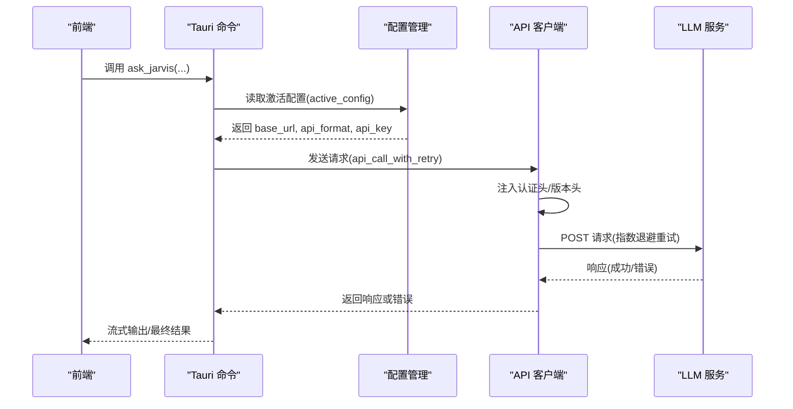
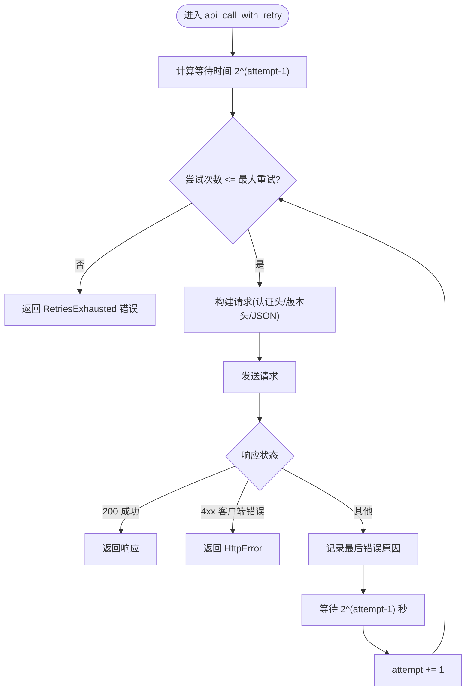
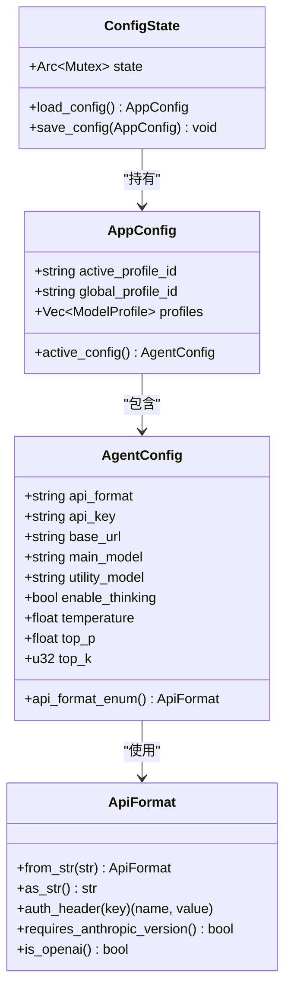
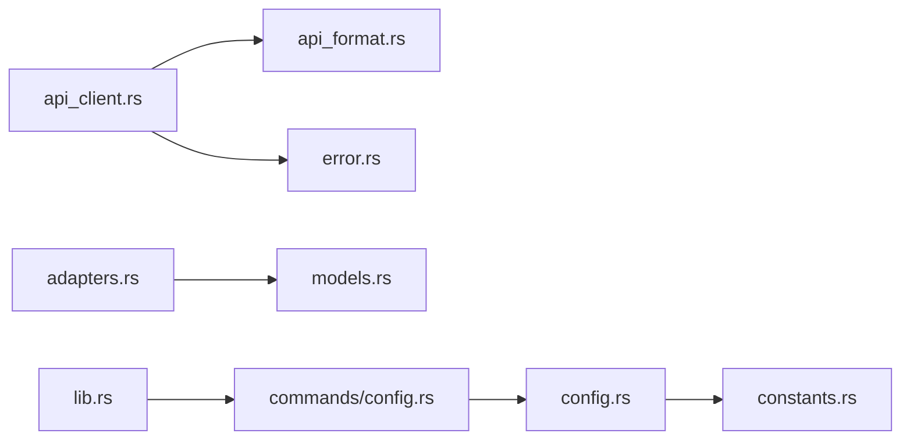

# 第三方集成

<cite>
**本文引用的文件**
- [README.md](file://README.md)
- [src-tauri/src/lib.rs](file://src-tauri/src/lib.rs)
- [src-tauri/src/main.rs](file://src-tauri/src/main.rs)
- [src-tauri/src/core/api_client.rs](file://src-tauri/src/core/api_client.rs)
- [src-tauri/src/core/api_format.rs](file://src-tauri/src/core/api_format.rs)
- [src-tauri/src/core/adapters.rs](file://src-tauri/src/core/adapters.rs)
- [src-tauri/src/core/config.rs](file://src-tauri/src/core/config.rs)
- [src-tauri/src/core/models.rs](file://src-tauri/src/core/models.rs)
- [src-tauri/src/core/constants.rs](file://src-tauri/src/core/constants.rs)
- [src-tauri/src/core/error.rs](file://src-tauri/src/core/error.rs)
- [src-tauri/src/core/commands/config.rs](file://src-tauri/src/core/commands/config.rs)
- [src-tauri/model_registry.json](file://src-tauri/model_registry.json)
</cite>

## 目录
1. [简介](#简介)
2. [项目结构](#项目结构)
3. [核心组件](#核心组件)
4. [架构总览](#架构总览)
5. [详细组件分析](#详细组件分析)
6. [依赖关系分析](#依赖关系分析)
7. [性能考量](#性能考量)
8. [故障排除指南](#故障排除指南)
9. [结论](#结论)
10. [附录](#附录)

## 简介
本文件面向希望在 JarvisAgent 中集成第三方服务（如云存储、版本控制、CI/CD 平台等）的开发者，系统化阐述 API 适配开发方法、认证机制、数据同步策略、配置管理最佳实践，并提供可落地的集成步骤与故障排除建议。文档中的实现细节均以代码库现有模块为依据，确保可操作性与可追溯性。

## 项目结构
JarvisAgent 采用 Tauri + Vue 前端 + Rust 后端的混合架构。后端核心模块位于 src-tauri/src/core 下，涵盖配置管理、API 客户端、协议适配、错误处理、常量定义等。前端通过 Tauri 命令与后端交互，后端通过统一的 API 客户端封装 HTTP 请求与重试逻辑。

图表来源
- [src-tauri/src/lib.rs:88-182](file://src-tauri/src/lib.rs#L88-L182)
- [src-tauri/src/core/api_client.rs:1-170](file://src-tauri/src/core/api_client.rs#L1-170)
- [src-tauri/src/core/config.rs:1-202](file://src-tauri/src/core/config.rs#L1-L202)
- [src-tauri/src/core/adapters.rs:1-259](file://src-tauri/src/core/adapters.rs#L1-L259)
- [src-tauri/src/core/api_format.rs:1-93](file://src-tauri/src/core/api_format.rs#L1-L93)
- [src-tauri/src/core/error.rs:1-141](file://src-tauri/src/core/error.rs#L1-L141)
- [src-tauri/src/core/models.rs:1-256](file://src-tauri/src/core/models.rs#L1-L256)
- [src-tauri/src/core/constants.rs:1-30](file://src-tauri/src/core/constants.rs#L1-L30)

章节来源
- [README.md:107-160](file://README.md#L107-L160)
- [src-tauri/src/lib.rs:57-182](file://src-tauri/src/lib.rs#L57-L182)

## 核心组件
- API 客户端与重试：封装 HTTP 请求、认证头注入、Anthropic 版本头、指数退避重试、错误分类与上报。
- 协议适配：OpenAI/Anthropic 双格式请求与响应适配，消息与工具定义转换。
- 配置管理：多预设配置、激活配置规范化、磁盘持久化与迁移。
- 错误体系：统一的 AgentError/ApiError/ToolError/MemoryError 分层错误类型。
- 数据模型：消息、内容块、工具调用、请求/响应结构体，支撑多模态与工具调用。
- 常量与文件：集中定义目录名、文件名、上下文长度、循环限制等阈值。

章节来源
- [src-tauri/src/core/api_client.rs:7-170](file://src-tauri/src/core/api_client.rs#L7-L170)
- [src-tauri/src/core/adapters.rs:84-259](file://src-tauri/src/core/adapters.rs#L84-L259)
- [src-tauri/src/core/config.rs:12-202](file://src-tauri/src/core/config.rs#L12-L202)
- [src-tauri/src/core/error.rs:4-141](file://src-tauri/src/core/error.rs#L4-L141)
- [src-tauri/src/core/models.rs:20-256](file://src-tauri/src/core/models.rs#L20-L256)
- [src-tauri/src/core/constants.rs:4-30](file://src-tauri/src/core/constants.rs#L4-L30)

## 架构总览
后端通过 Tauri Builder 注册状态与命令，前端通过 invoke 调用后端命令。API 调用由统一客户端封装，根据配置选择 OpenAI/Anthropic 格式，必要时进行消息与工具定义转换。

图表来源
- [src-tauri/src/lib.rs:102-182](file://src-tauri/src/lib.rs#L102-L182)
- [src-tauri/src/core/config.rs:110-146](file://src-tauri/src/core/config.rs#L110-L146)
- [src-tauri/src/core/api_client.rs:7-76](file://src-tauri/src/core/api_client.rs#L7-L76)

## 详细组件分析

### 组件一：API 适配开发方法
- HTTP 客户端配置
  - 认证头：根据 ApiFormat 注入不同头部名称与值（Anthropic 使用 x-api-key，OpenAI 使用 authorization Bearer）。
  - 版本头：当 ApiFormat 为 Anthropic 时附加 anthropic-version。
  - 请求体：根据 ApiFormat 选择 OpenAI/Anthropic 请求体结构。
- 请求响应处理
  - 成功状态直接返回；客户端错误（4xx）包装为 ApiError::HttpError；服务端错误记录最后错误原因。
  - 响应解析：根据格式提取 content 或 choices[0].message.content。
- 错误重试机制
  - 指数退避：第 n 次重试等待 2^(n-1) 秒，同时通过事件向前端反馈重试进度。
  - 最大重试次数可配置，默认按实现传入。

图表来源
- [src-tauri/src/core/api_client.rs:7-76](file://src-tauri/src/core/api_client.rs#L7-L76)
- [src-tauri/src/core/api_format.rs:26-43](file://src-tauri/src/core/api_format.rs#L26-L43)

章节来源
- [src-tauri/src/core/api_client.rs:7-170](file://src-tauri/src/core/api_client.rs#L7-L170)
- [src-tauri/src/core/api_format.rs:1-93](file://src-tauri/src/core/api_format.rs#L1-L93)

### 组件二：认证机制实现
- API 密钥管理
  - 配置项包含 api_key 字段；通过 ConfigState 管理内存状态并在磁盘持久化。
  - 旧版配置迁移：自动检测并迁移到 AppConfig + 多预设结构。
- OAuth 流程
  - 当前代码库未实现 OAuth 流程；如需集成 OAuth，可在前端发起授权页，后端通过命令接收回调并更新配置。
- 令牌刷新策略
  - 当前未实现自动刷新；可在调用前检查令牌有效期，必要时通过命令触发刷新并更新配置。

图表来源
- [src-tauri/src/core/config.rs:12-146](file://src-tauri/src/core/config.rs#L12-L146)
- [src-tauri/src/core/api_format.rs:1-43](file://src-tauri/src/core/api_format.rs#L1-L43)

章节来源
- [src-tauri/src/core/config.rs:12-202](file://src-tauri/src/core/config.rs#L12-L202)
- [src-tauri/src/core/commands/config.rs:4-41](file://src-tauri/src/core/commands/config.rs#L4-L41)

### 组件三：数据同步方法
- 双向同步
  - 建议：以本地会话/快照为“权威源”，第三方服务为“远端源”。变更时先写本地，再异步推送到远端；远端变更通过轮询或 Webhook 拉取到本地。
- 冲突解决
  - 建议：基于时间戳/版本号比较，优先保留最近修改；对可合并字段（如文本内容）采用合并策略，不可合并字段采用“保留本地/远端”策略。
- 增量更新
  - 建议：记录上次同步游标（如时间戳、游标 token），仅拉取增量变更；对删除操作，采用软删除标记或反向同步删除。

说明：上述为通用设计建议，具体实现需结合目标第三方服务的 API 语义与约束。

### 组件四：集成示例（概念性）
- 云存储服务
  - 适配：使用统一 API 客户端封装上传/下载/列举/删除接口；对大文件采用分片上传与断点续传。
  - 同步：以本地文件树为基准，对比远端差异，执行增删改。
- 版本控制系统
  - 适配：封装 Git 操作（status/diff/log）与远程同步；对敏感分支/权限进行沙箱限制。
  - 同步：本地变更先提交到暂存区，再推送；远端变更通过 pull/fetch 同步。
- CI/CD 平台
  - 适配：封装流水线查询、构建触发、日志拉取；对令牌进行最小权限管理。
  - 同步：以本地状态为基准，触发远端构建；回拉构建状态与日志。

说明：以上为通用集成思路，具体实现需参考目标平台的 SDK/REST API 文档。

### 组件五：配置管理最佳实践
- 敏感信息保护
  - 将 API Key 存储在配置中，避免硬编码；在前端仅显示脱敏后的部分字符。
- 配置验证
  - 在保存配置时校验 base_url 格式、api_format 合法性、模型 ID 是否存在于模型注册表。
- 环境隔离
  - 使用多预设（profiles）隔离不同环境（dev/staging/prod）；通过 active_profile_id 切换。

章节来源
- [src-tauri/src/core/config.rs:110-146](file://src-tauri/src/core/config.rs#L110-L146)
- [src-tauri/model_registry.json:1-496](file://src-tauri/model_registry.json#L1-L496)

## 依赖关系分析
- 模块耦合
  - api_client 依赖 api_format、error；adapters 依赖 models；config 依赖 constants；commands/config 依赖 config。
- 外部依赖
  - HTTP 客户端为 reqwest；序列化为 serde_json；错误类型为 thiserror；异步运行时为 tokio。
- 潜在循环依赖
  - 当前模块间通过命令与状态管理解耦，未见直接循环依赖。

图表来源
- [src-tauri/src/core/api_client.rs:1-170](file://src-tauri/src/core/api_client.rs#L1-L170)
- [src-tauri/src/core/api_format.rs:1-93](file://src-tauri/src/core/api_format.rs#L1-L93)
- [src-tauri/src/core/adapters.rs:1-259](file://src-tauri/src/core/adapters.rs#L1-L259)
- [src-tauri/src/core/config.rs:1-202](file://src-tauri/src/core/config.rs#L1-L202)
- [src-tauri/src/core/commands/config.rs:1-41](file://src-tauri/src/core/commands/config.rs#L1-L41)
- [src-tauri/src/lib.rs:88-182](file://src-tauri/src/lib.rs#L88-L182)

## 性能考量
- 指数退避重试降低抖动，提升网络不稳定场景下的成功率。
- 消息与工具适配在请求前完成，避免运行时重复转换。
- 配置加载与保存采用异步互斥锁，保证并发安全与性能平衡。

## 故障排除指南
- 常见错误
  - 未配置 API Key：检查配置是否正确保存与加载。
  - HTTP 错误：查看状态码与响应体，确认鉴权与模型可用性。
  - 网络错误：检查代理/防火墙；适当增加最大重试次数。
  - 解析错误：确认响应格式与 ApiFormat 匹配。
- 诊断步骤
  - 查看后端日志与前端事件（chat-stream/agent-step）。
  - 核对 base_url 是否包含正确路径（OpenAI 自动补全 /chat/completions，Anthropic 补全 /messages）。
  - 使用模型注册表核对模型 ID 与能力。

章节来源
- [src-tauri/src/core/error.rs:40-55](file://src-tauri/src/core/error.rs#L40-L55)
- [src-tauri/src/core/config.rs:122-145](file://src-tauri/src/core/config.rs#L122-L145)

## 结论
通过统一的 API 客户端、协议适配与配置管理，JarvisAgent 为第三方服务集成提供了清晰的扩展点。建议在新增服务时遵循：明确认证方式、封装 HTTP 客户端、实现幂等与冲突处理、严格验证配置与模型能力、并建立完善的日志与重试机制。

## 附录
- 模型能力注册表：用于校验模型能力与参数，确保请求体与响应解析正确。
- 常量与阈值：上下文长度、循环限制等，有助于在集成时评估性能与稳定性。

章节来源
- [src-tauri/model_registry.json:1-496](file://src-tauri/model_registry.json#L1-L496)
- [src-tauri/src/core/constants.rs:22-30](file://src-tauri/src/core/constants.rs#L22-L30)