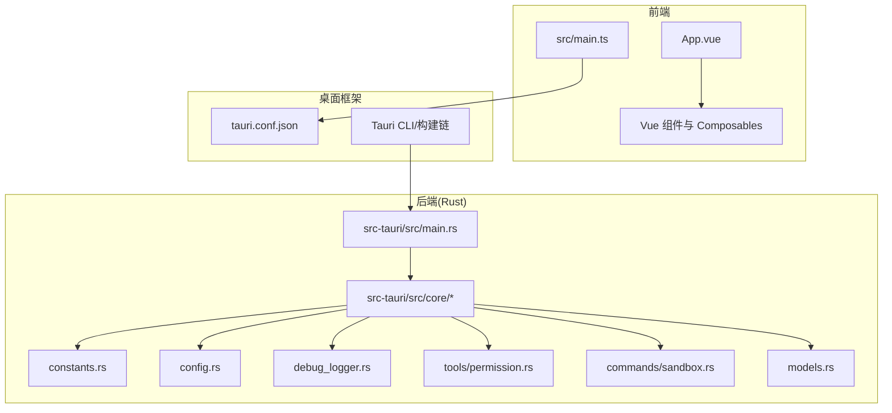
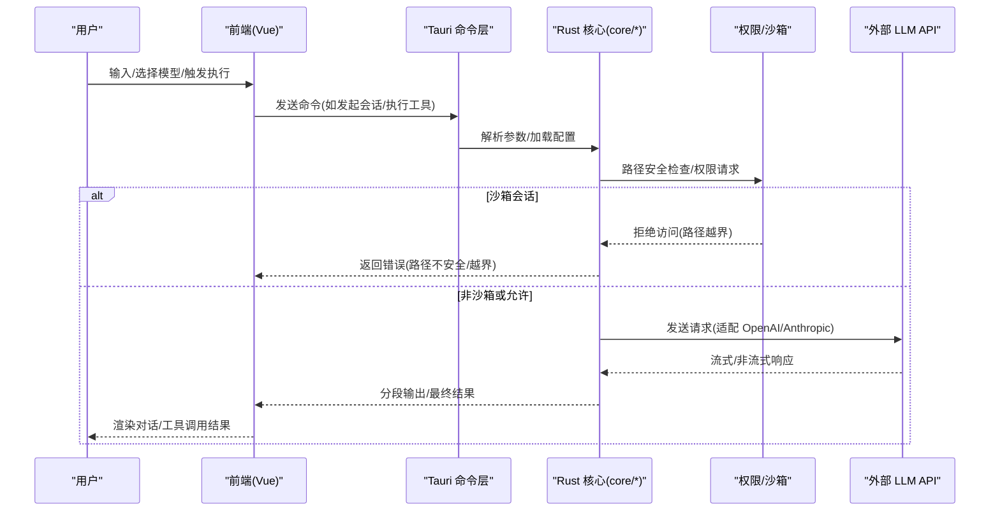
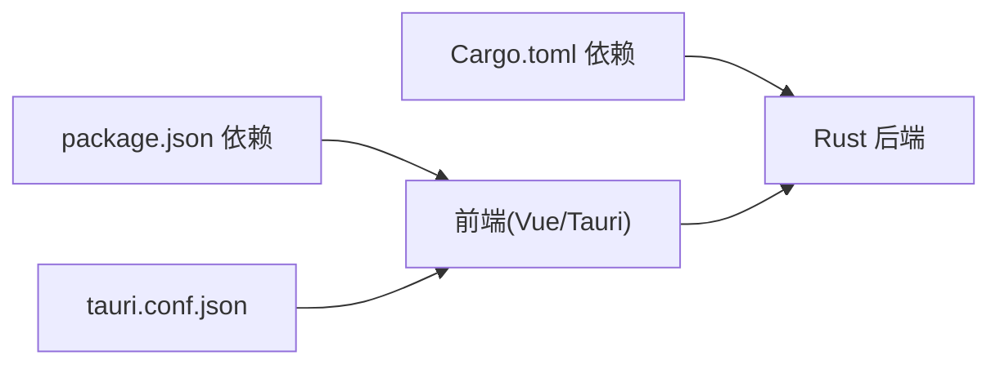
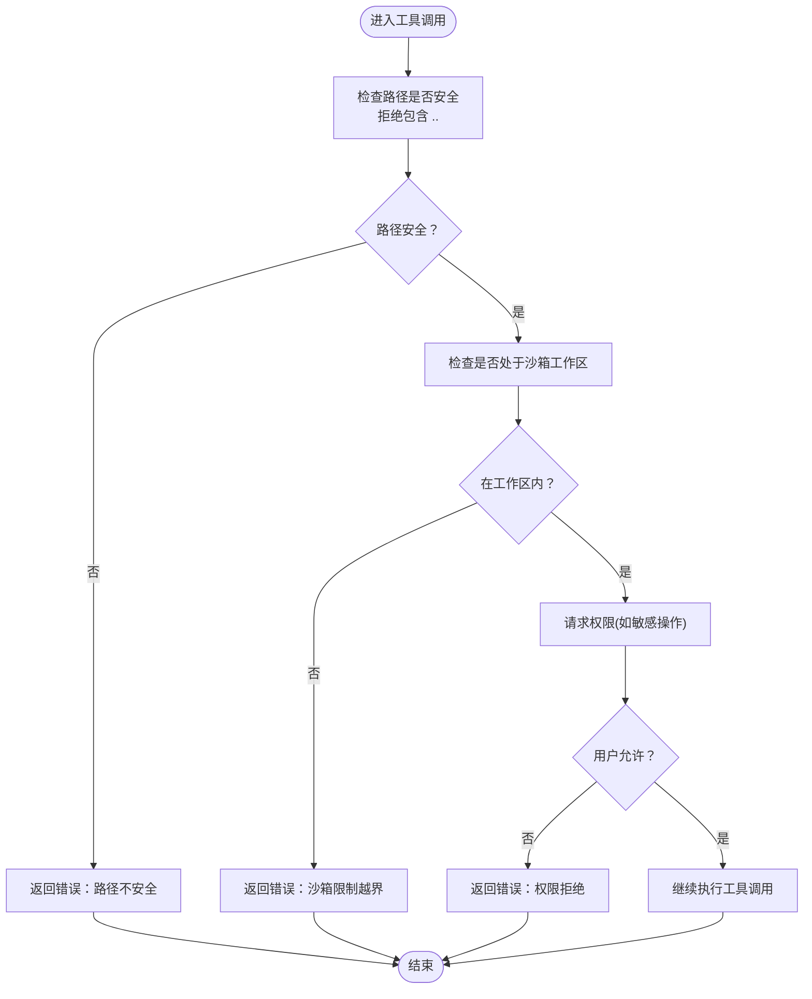

# 故障排除

<cite>
**本文引用的文件**
- [README.md](file://README.md)
- [package.json](file://package.json)
- [src-tauri/Cargo.toml](file://src-tauri/Cargo.toml)
- [src-tauri/tauri.conf.json](file://src-tauri/tauri.conf.json)
- [src/main.ts](file://src/main.ts)
- [src-tauri/src/main.rs](file://src-tauri/src/main.rs)
- [src-tauri/src/core/debug_logger.rs](file://src-tauri/src/core/debug_logger.rs)
- [src-tauri/src/core/config.rs](file://src-tauri/src/core/config.rs)
- [src-tauri/src/core/constants.rs](file://src-tauri/src/core/constants.rs)
- [src-tauri/src/core/models.rs](file://src-tauri/src/core/models.rs)
- [src-tauri/src/core/tools/permission.rs](file://src-tauri/src/core/tools/permission.rs)
- [src-tauri/src/core/commands/sandbox.rs](file://src-tauri/src/core/commands/sandbox.rs)
</cite>

## 目录
1. [简介](#简介)
2. [项目结构](#项目结构)
3. [核心组件](#核心组件)
4. [架构总览](#架构总览)
5. [详细组件分析](#详细组件分析)
6. [依赖关系分析](#依赖关系分析)
7. [性能考虑](#性能考虑)
8. [故障排除指南](#故障排除指南)
9. [结论](#结论)
10. [附录](#附录)

## 简介
本指南面向 JarvisAgent 的使用者与维护者，系统化地梳理安装、配置、运行时异常的排查流程，并提供日志分析、错误追踪、性能分析与安全相关的故障定位方法。文档同时覆盖内存泄漏、CPU 占用过高、启动缓慢等性能问题的识别与缓解策略，以及权限错误、沙箱限制、路径遍历攻击防护等安全问题的处置步骤。最后给出调试工具推荐、监控指标解读与紧急恢复程序，并列出社区支持与问题反馈渠道。

## 项目结构
JarvisAgent 采用前端 Vue 3 + Tauri 2.0 + Rust 后端的混合架构。前端负责 UI 与交互，Tauri 暴露原生能力与命令接口，Rust 后端承载核心 Agent 循环、工具调用、会话与快照管理、权限与沙箱控制、日志与调试等功能。

图表来源
- [src/main.ts:1-6](file://src/main.ts#L1-L6)
- [src-tauri/tauri.conf.json:1-40](file://src-tauri/tauri.conf.json#L1-L40)
- [src-tauri/src/main.rs:1-7](file://src-tauri/src/main.rs#L1-L7)
- [src-tauri/src/core/constants.rs:1-30](file://src-tauri/src/core/constants.rs#L1-L30)
- [src-tauri/src/core/config.rs:1-191](file://src-tauri/src/core/config.rs#L1-L191)
- [src-tauri/src/core/debug_logger.rs:1-186](file://src-tauri/src/core/debug_logger.rs#L1-L186)
- [src-tauri/src/core/tools/permission.rs:1-103](file://src-tauri/src/core/tools/permission.rs#L1-L103)
- [src-tauri/src/core/commands/sandbox.rs:1-73](file://src-tauri/src/core/commands/sandbox.rs#L1-L73)
- [src-tauri/src/core/models.rs:1-256](file://src-tauri/src/core/models.rs#L1-L256)

章节来源
- [README.md:107-160](file://README.md#L107-L160)
- [package.json:1-28](file://package.json#L1-L28)
- [src-tauri/Cargo.toml:1-41](file://src-tauri/Cargo.toml#L1-L41)
- [src-tauri/tauri.conf.json:1-40](file://src-tauri/tauri.conf.json#L1-L40)

## 核心组件
- 配置管理：负责多预设配置的加载、迁移与保存，支持规范化 API 地址与模型参数。
- 日志与调试：提供思考与计划日志、意图分类日志、会话摘要与请求/响应记录，便于回溯 Agent 行为。
- 权限与沙箱：路径安全检查、工作区边界校验、敏感操作权限请求与会话级沙箱隔离。
- 命令与会话：通过 Tauri 命令暴露沙箱生命周期管理，配合会话管理器实现隔离与协作。
- 数据模型：统一 OpenAI/Anthropic 请求/响应结构、消息与内容块、任务与计划文档等数据类型。

章节来源
- [src-tauri/src/core/config.rs:1-191](file://src-tauri/src/core/config.rs#L1-L191)
- [src-tauri/src/core/debug_logger.rs:1-186](file://src-tauri/src/core/debug_logger.rs#L1-L186)
- [src-tauri/src/core/tools/permission.rs:1-103](file://src-tauri/src/core/tools/permission.rs#L1-L103)
- [src-tauri/src/core/commands/sandbox.rs:1-73](file://src-tauri/src/core/commands/sandbox.rs#L1-L73)
- [src-tauri/src/core/models.rs:1-256](file://src-tauri/src/core/models.rs#L1-L256)

## 架构总览
下图展示从用户输入到 Agent 执行再到前端渲染的关键路径，以及关键的错误与安全检查节点。

图表来源
- [src-tauri/src/core/tools/permission.rs:1-103](file://src-tauri/src/core/tools/permission.rs#L1-L103)
- [src-tauri/src/core/commands/sandbox.rs:1-73](file://src-tauri/src/core/commands/sandbox.rs#L1-L73)
- [src-tauri/src/core/models.rs:1-256](file://src-tauri/src/core/models.rs#L1-L256)

## 详细组件分析

### 配置与多预设
- 功能要点
  - 多预设 Profile 管理，支持切换与全局默认。
  - 自动规范化 API Base URL，适配 OpenAI/Anthropic 不同路径。
  - 旧版配置迁移，保证升级平滑。
- 常见问题
  - 预设未生效：检查活动预设 ID 与全局预设 ID 是否正确。
  - API 地址错误：确认 base_url 是否以 / 结尾，格式是否符合所选 API 格式。
  - 图像参数无效：图像压缩宽高与质量需在合理范围内。
- 诊断建议
  - 查看配置文件位置与内容，确认 profiles 数组与 active_profile_id。
  - 在设置面板中逐一核对字段，必要时重置为默认预设并重新填写。

章节来源
- [src-tauri/src/core/config.rs:1-191](file://src-tauri/src/core/config.rs#L1-L191)
- [README.md:72-84](file://README.md#L72-L84)

### 日志与调试
- 功能要点
  - 思考与计划日志：记录每轮思考、工具调用与令牌用量。
  - 意图分类日志：记录用户输入、检测方法与意图类别。
  - 会话摘要：统计会话总输入/输出令牌。
  - 请求/响应文件日志：按轮次记录请求与响应 JSON。
- 常见问题
  - 日志缺失：确认日志目录存在且有写权限；检查 DebugLogger 初始化。
  - 日志过大：定期清理 .logs 目录或调整日志级别（若可配置）。
  - 无法定位问题：结合“请求/响应文件日志”与“思考与计划日志”交叉验证。
- 诊断建议
  - 在运行目录查找 .logs 下的 agent_loop_debug.txt 与 thoughts_and_plans.md。
  - 使用“请求/响应文件日志”定位最后一次成功/失败的请求与响应。
  - 对比“思考与计划日志”中的工具调用序列，定位具体环节。

章节来源
- [src-tauri/src/core/debug_logger.rs:1-186](file://src-tauri/src/core/debug_logger.rs#L1-L186)
- [src-tauri/src/core/constants.rs:1-30](file://src-tauri/src/core/constants.rs#L1-L30)
- [README.md:257-274](file://README.md#L257-L274)

### 权限与沙箱
- 功能要点
  - 路径安全：拒绝包含 .. 的路径，防止遍历攻击。
  - 工作区边界：在沙箱会话中强制限制访问范围。
  - 权限请求：敏感操作前弹窗或事件通知，等待用户确认。
- 常见问题
  - “路径不安全”错误：检查路径是否包含 .. 或相对路径穿越。
  - “沙箱限制”错误：确认目标路径是否在当前会话工作区内。
  - 权限未弹出：检查前端是否监听 permission-request 事件，确认会话状态。
- 诊断建议
  - 在权限模块中核对 is_path_safe 与 is_within_workspace 的判定逻辑。
  - 在前端监听 permission-request 事件并记录用户决策。
  - 若为 Git/Shell 等高危操作，确认已触发权限请求流程。

章节来源
- [src-tauri/src/core/tools/permission.rs:1-103](file://src-tauri/src/core/tools/permission.rs#L1-L103)
- [README.md:235-243](file://README.md#L235-L243)

### 沙箱命令与会话
- 功能要点
  - 沙箱创建、获取、列举、完成、放弃、发布与对比。
  - 与会话管理器配合，实现会话级隔离与状态维护。
- 常见问题
  - 沙箱不存在：确认 session_id 与 sandbox_id 是否匹配。
  - 发布失败：检查沙箱状态与对比结果，确保已完成必要步骤。
  - 列表为空：确认会话是否已创建沙箱或是否被清理。
- 诊断建议
  - 使用 sandbox_list 与 sandbox_get 核对沙箱状态。
  - 通过 sandbox_compare 对比基线与当前状态，定位变更点。
  - 在前端查看沙箱时间线与差异视图辅助定位。

章节来源
- [src-tauri/src/core/commands/sandbox.rs:1-73](file://src-tauri/src/core/commands/sandbox.rs#L1-L73)

### 数据模型与 API 适配
- 功能要点
  - 统一 OpenAI/Anthropic 请求/响应结构，支持流式与非流式。
  - 内容块支持文本、思考、工具调用与结果、图片等。
  - 任务与计划文档结构，便于前端渲染与后续执行。
- 常见问题
  - 请求格式不匹配：确认 api_format 与 base_url 是否一致。
  - 流式输出异常：检查 stream 与 stream_options 配置。
  - 工具调用参数错误：核对 function definition 与 arguments 的 JSON 字符串。
- 诊断建议
  - 对照 models.rs 中的结构体定义，逐项核对请求字段。
  - 使用“请求/响应文件日志”比对实际发送与返回内容。
  - 关注工具调用序列与内容块类型，定位解析或渲染问题。

章节来源
- [src-tauri/src/core/models.rs:1-256](file://src-tauri/src/core/models.rs#L1-L256)

## 依赖关系分析
- 前端依赖
  - Vue 3、Vite、TypeScript、@tauri-apps/api 等，负责 UI 与与后端通信。
- 后端依赖
  - Tauri 2、Reqwest、Tokio、Serde、Regex、EventSource 等，支撑命令、HTTP、异步与流式处理。
- 构建与打包
  - Tauri CLI 与 Vite 配合，开发模式与生产构建流程清晰。

图表来源
- [package.json:1-28](file://package.json#L1-L28)
- [src-tauri/Cargo.toml:1-41](file://src-tauri/Cargo.toml#L1-L41)
- [src-tauri/tauri.conf.json:1-40](file://src-tauri/tauri.conf.json#L1-L40)

章节来源
- [package.json:1-28](file://package.json#L1-L28)
- [src-tauri/Cargo.toml:1-41](file://src-tauri/Cargo.toml#L1-L41)
- [src-tauri/tauri.conf.json:1-40](file://src-tauri/tauri.conf.json#L1-L40)

## 性能考虑
- 上下文压缩与令牌阈值
  - 当上下文接近阈值时自动触发压缩，减少延迟与成本。
  - 可通过 compact 工具手动压缩，降低内存占用。
- 令牌用量统计
  - 日志中记录每轮输入/输出令牌，可用于成本与性能分析。
- 循环限制
  - Agent 循环超过一定轮次暂停等待确认，避免长时间占用 CPU。
- 背景任务与输出长度限制
  - 背景任务输出与通知长度有限制，避免内存膨胀。

章节来源
- [README.md:202-207](file://README.md#L202-L207)
- [src-tauri/src/core/constants.rs:1-30](file://src-tauri/src/core/constants.rs#L1-L30)
- [src-tauri/src/core/debug_logger.rs:163-178](file://src-tauri/src/core/debug_logger.rs#L163-L178)

## 故障排除指南

### 一、安装与环境问题
- 症状
  - 依赖安装失败、开发/构建命令报错。
- 诊断步骤
  - 检查 Node.js 与 Rust 版本是否满足要求。
  - 确认包管理器版本与依赖安装顺序。
  - 查看构建脚本与 Tauri CLI 是否正确配置。
- 解决方案
  - 升级 Node.js 至 18+，Rust 至 1.70+，pnpm 至 8+。
  - 清理缓存后重新安装依赖，必要时删除 lock 文件重试。
  - 确保开发/构建前置命令与前端打包输出路径正确。

章节来源
- [README.md:45-58](file://README.md#L45-L58)
- [package.json:6-11](file://package.json#L6-L11)
- [src-tauri/tauri.conf.json:6-11](file://src-tauri/tauri.conf.json#L6-L11)

### 二、配置错误
- 症状
  - API Key/URL 错误导致请求失败；模型参数无效；预设未生效。
- 诊断步骤
  - 核对 config.json 中的 active_profile_id 与 profiles。
  - 检查 base_url 是否按 API 格式自动补全路径。
  - 验证图像压缩参数是否在合理范围。
- 解决方案
  - 在设置面板重置为默认预设，逐步填写字段并保存。
  - 如从旧版本升级，确认配置迁移是否成功。
  - 修改后重启应用以确保配置生效。

章节来源
- [src-tauri/src/core/config.rs:146-191](file://src-tauri/src/core/config.rs#L146-L191)
- [README.md:72-84](file://README.md#L72-L84)

### 三、运行时异常
- 症状
  - 无响应、卡顿、崩溃；工具调用失败；权限请求未弹出。
- 诊断步骤
  - 查看 .logs 下的思考与计划日志、请求/响应日志。
  - 检查权限模块的路径安全与工作区边界判断。
  - 确认前端是否监听 permission-request 事件。
- 解决方案
  - 修复路径包含 .. 的问题，或切换到非沙箱会话。
  - 确保权限请求通道畅通，必要时重试或刷新页面。
  - 回滚最近改动，对比日志定位异常轮次。

章节来源
- [src-tauri/src/core/debug_logger.rs:1-186](file://src-tauri/src/core/debug_logger.rs#L1-L186)
- [src-tauri/src/core/tools/permission.rs:1-103](file://src-tauri/src/core/tools/permission.rs#L1-L103)

### 四、性能问题
- 症状
  - 内存持续增长、CPU 占用过高、启动缓慢。
- 诊断步骤
  - 关注上下文压缩阈值与压缩触发频率。
  - 检查会话令牌用量与工具调用次数。
  - 观察循环轮次是否接近暂停阈值。
- 解决方案
  - 启用/手动触发压缩，减少上下文长度。
  - 优化工具调用策略，避免不必要的重复调用。
  - 控制会话时长，及时结束长任务。

章节来源
- [README.md:202-207](file://README.md#L202-L207)
- [src-tauri/src/core/constants.rs:22-30](file://src-tauri/src/core/constants.rs#L22-L30)
- [src-tauri/src/core/debug_logger.rs:163-178](file://src-tauri/src/core/debug_logger.rs#L163-L178)

### 五、安全相关问题
- 症状
  - 路径遍历攻击尝试被拦截；沙箱外访问被拒绝；高危操作未授权。
- 诊断步骤
  - 核对 is_path_safe 与 is_within_workspace 的判定逻辑。
  - 检查工作区目录与当前会话状态。
  - 确认权限请求事件是否被前端接收与处理。
- 解决方案
  - 严格避免使用包含 .. 的路径。
  - 在沙箱会话中限定工作区，必要时切换到非沙箱会话。
  - 明确高危操作的权限审批流程，确保用户知情同意。

章节来源
- [src-tauri/src/core/tools/permission.rs:12-72](file://src-tauri/src/core/tools/permission.rs#L12-L72)
- [README.md:235-243](file://README.md#L235-L243)

### 六、日志分析与错误追踪
- 日志位置
  - 运行目录下的 .logs 目录，包含 agent_loop_debug.txt 与 thoughts_and_plans.md。
- 分析方法
  - 以“请求/响应文件日志”为准绳，定位最后一次成功/失败的请求与响应。
  - 对比“思考与计划日志”的工具调用序列，定位具体环节。
  - 结合“会话摘要”统计总令牌用量，评估成本与性能。
- 错误追踪
  - 在前端监听 permission-request 事件，记录用户决策。
  - 在 Rust 层打印关键信息，结合日志进行回溯。

章节来源
- [src-tauri/src/core/debug_logger.rs:1-186](file://src-tauri/src/core/debug_logger.rs#L1-L186)
- [src-tauri/src/core/constants.rs:14-21](file://src-tauri/src/core/constants.rs#L14-L21)

### 七、调试工具与监控指标
- 调试工具推荐
  - 浏览器开发者工具：检查网络请求、事件与权限弹窗。
  - Rust 日志：在终端查看 println 输出与日志文件。
  - Tauri 命令行：使用 Tauri CLI 进行本地调试与构建。
- 监控指标
  - 令牌用量：输入/输出/总用量，用于成本与性能评估。
  - 循环轮次：接近暂停阈值需人工干预。
  - 背景任务输出长度：避免过长输出导致内存压力。

章节来源
- [src-tauri/src/core/debug_logger.rs:163-178](file://src-tauri/src/core/debug_logger.rs#L163-L178)
- [src-tauri/src/core/constants.rs:22-30](file://src-tauri/src/core/constants.rs#L22-L30)

### 八、紧急恢复程序
- 操作步骤
  - 备份当前配置与日志。
  - 删除或重命名 .logs 与 .sessions 目录，清理异常状态。
  - 重置配置为默认预设，重新填写关键参数。
  - 重启应用，确认权限请求与沙箱行为正常。
- 注意事项
  - 恢复前确保重要数据已导出或可重建。
  - 如涉及生产环境，建议先在测试环境验证恢复流程。

章节来源
- [src-tauri/src/core/config.rs:180-191](file://src-tauri/src/core/config.rs#L180-L191)
- [src-tauri/src/core/debug_logger.rs:1-186](file://src-tauri/src/core/debug_logger.rs#L1-L186)

### 九、社区支持与问题反馈
- 支持渠道
  - 通过项目贡献流程提交 Issue 与 Pull Request。
- 反馈流程
  - 准备最小可复现步骤、环境信息与相关日志文件。
  - 描述症状、已尝试的解决步骤与期望结果。

章节来源
- [README.md:507-520](file://README.md#L507-L520)

## 结论
本指南提供了从安装、配置到运行时异常与性能问题的系统化排查方法，并结合日志、权限与沙箱机制给出针对性建议。建议在日常使用中定期备份配置与日志，关注令牌用量与循环轮次，遇到问题时优先通过日志与权限请求事件进行回溯与定位，必要时采用紧急恢复程序保障业务连续性。

## 附录

### A. 关键流程图：权限与沙箱检查

图表来源
- [src-tauri/src/core/tools/permission.rs:12-103](file://src-tauri/src/core/tools/permission.rs#L12-L103)