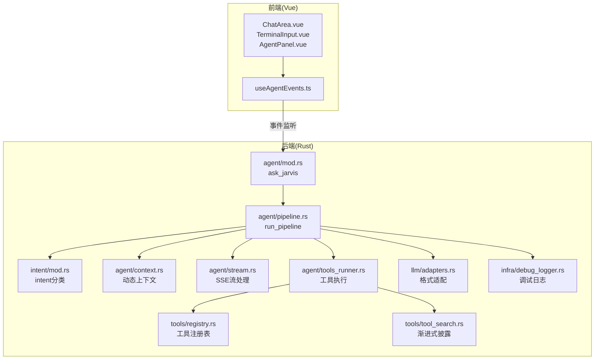
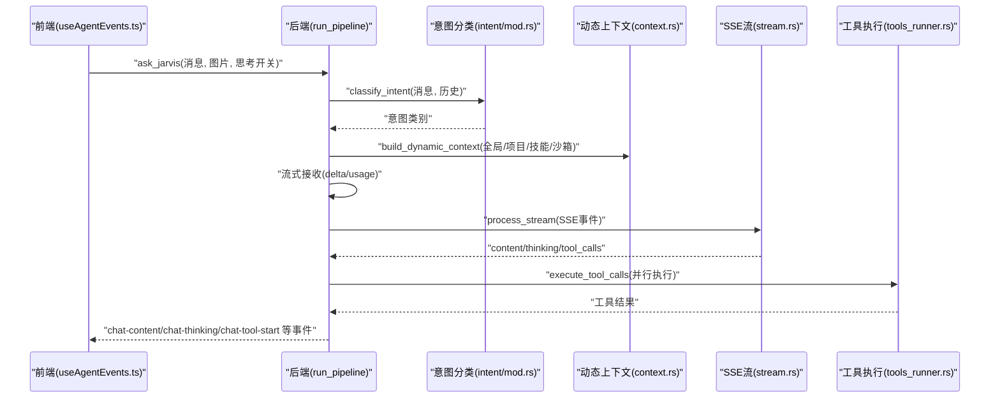
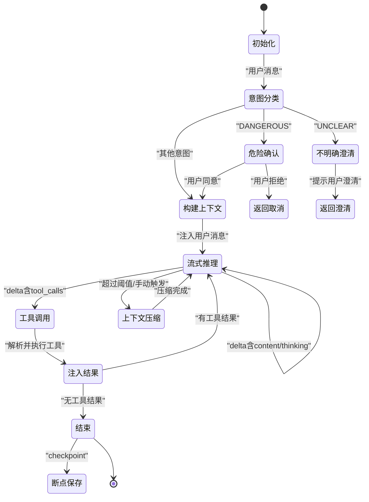
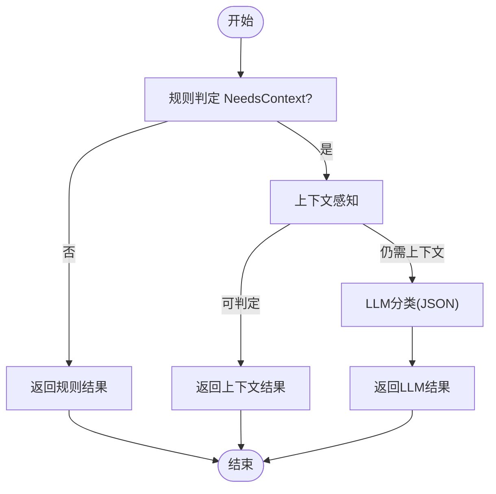
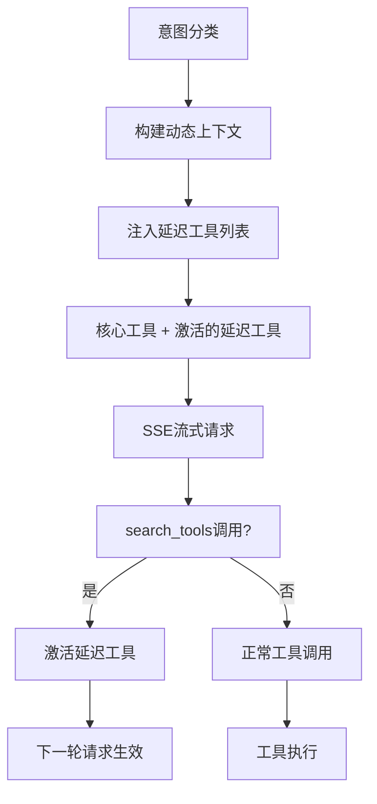
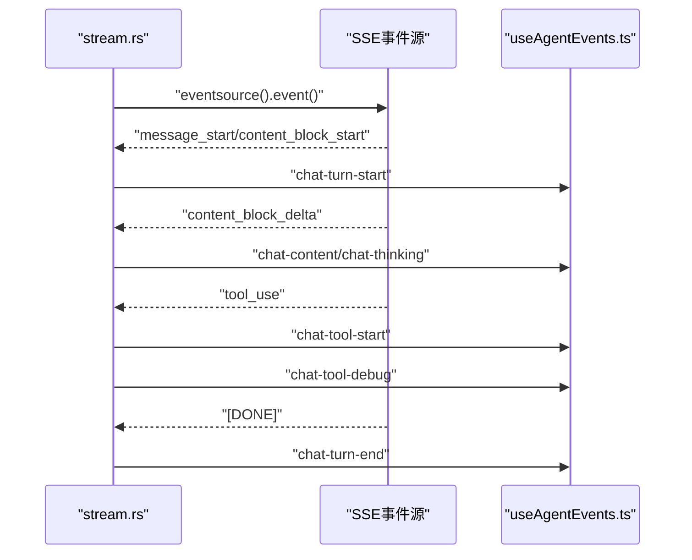
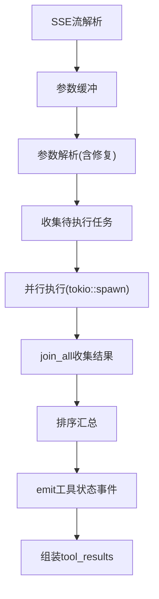
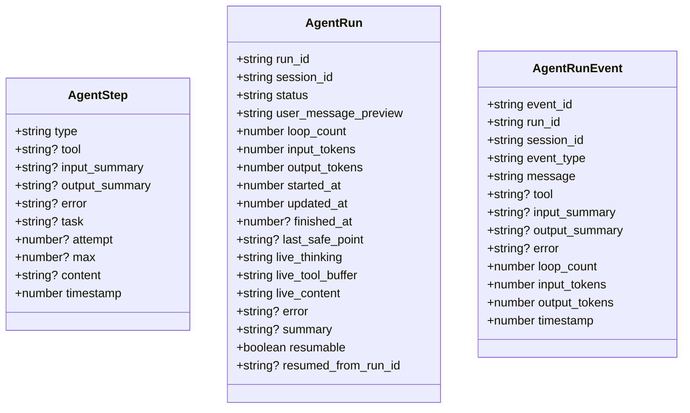
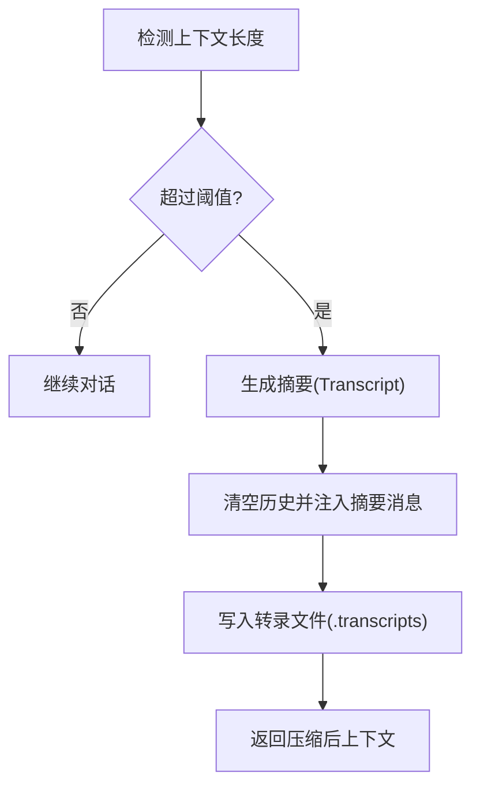
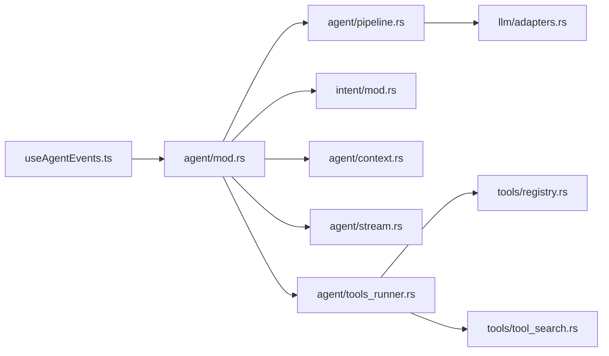

# Agent 循环架构

<cite>
**本文档引用的文件**
- [src-tauri/src/core/agent/mod.rs](file://src-tauri/src/core/agent/mod.rs)
- [src-tauri/src/core/agent/pipeline.rs](file://src-tauri/src/core/agent/pipeline.rs)
- [src-tauri/src/core/agent/stream.rs](file://src-tauri/src/core/agent/stream.rs)
- [src-tauri/src/core/agent/context.rs](file://src-tauri/src/core/agent/context.rs)
- [src-tauri/src/core/agent/tools_runner.rs](file://src-tauri/src/core/agent/tools_runner.rs)
- [src-tauri/src/core/intent/mod.rs](file://src-tauri/src/core/intent/mod.rs)
- [src-tauri/src/core/intent/rules.rs](file://src-tauri/src/core/intent/rules.rs)
- [src-tauri/src/core/tools/registry.rs](file://src-tauri/src/core/tools/registry.rs)
- [src-tauri/src/core/tools/tool_search.rs](file://src-tauri/src/core/tools/tool_search.rs)
- [src-tauri/src/core/llm/adapters.rs](file://src-tauri/src/core/llm/adapters.rs)
- [src/composables/useAgentEvents.ts](file://src/composables/useAgentEvents.ts)
- [src-tauri/src/core/infra/debug_logger.rs](file://src-tauri/src/core/infra/debug_logger.rs)
</cite>

## 目录
1. [简介](#简介)
2. [项目结构](#项目结构)
3. [核心组件](#核心组件)
4. [架构总览](#架构总览)
5. [详细组件分析](#详细组件分析)
6. [依赖关系分析](#依赖关系分析)
7. [性能考量](#性能考量)
8. [故障排查指南](#故障排查指南)
9. [结论](#结论)
10. [附录](#附录)

## 简介
本文件系统性阐述 Jarvis Agent 的"智能代理循环"架构，覆盖意图分类（Intent Classification）、工具调用（Tool Execution）、流式响应（Streaming Response）的完整流程；深入解析 AgentStep 结构、上下文压缩算法、记忆系统集成、深度思考模式的工作原理；说明多模型支持、响应缓存、错误处理与重试机制，并提供 Agent 循环的状态转换图与数据流图。

## 项目结构
该项目采用前后端分离的 Tauri 架构：Rust 后端负责 Agent 循环、意图识别、工具调度、子代理执行、内存与运行记录管理；Vue 前端通过 Tauri 事件通道实时渲染流式输出与运行状态。

**图表来源**
- [src-tauri/src/core/agent/mod.rs:11-31](file://src-tauri/src/core/agent/mod.rs#L11-L31)
- [src-tauri/src/core/agent/pipeline.rs:1085-1120](file://src-tauri/src/core/agent/pipeline.rs#L1085-L1120)
- [src/composables/useAgentEvents.ts:201-550](file://src/composables/useAgentEvents.ts#L201-L550)

## 核心组件
- 意图分类器：根据用户输入与历史消息判定意图类别（如 CHAT、CODE_WRITE、QUESTION、MEMORY_QUERY、DANGEROUS 等），支持规则优先、上下文感知与 LLM 判定三级策略。
- Agent 循环：统一的执行循环，负责构建动态上下文、注入用户消息、流式接收与解析、工具调用、上下文压缩、记忆更新与运行记录。
- 工具系统：集中注册与分发工具，支持 Anthropic 与 OpenAI 格式适配，提供文件/系统/任务/代理相关工具集。
- 子代理（Subagent）：轻量级子循环，隔离上下文与权限，支持只读/读写模式，具备心跳与取消令牌。
- 记忆系统：全局与项目记忆文件，支持自动压缩与摘要，以及记忆整理（Dream Agent）。
- 运行记录与事件：AgentRun/AgentRunEvent/AgentRunCheckpoint 三元组，支持断点保存、恢复与可视化。
- 前端事件驱动：通过 Tauri 事件通道实时渲染流式内容、工具状态、思考内容与运行面板。

**章节来源**
- [src-tauri/src/core/intent/mod.rs:7-67](file://src-tauri/src/core/intent/mod.rs#L7-L67)
- [src-tauri/src/core/agent/pipeline.rs:185-742](file://src-tauri/src/core/agent/pipeline.rs#L185-L742)
- [src-tauri/src/core/tools/registry.rs:37-125](file://src-tauri/src/core/tools/registry.rs#L37-L125)
- [src-tauri/src/core/tools/tool_search.rs:14-149](file://src-tauri/src/core/tools/tool_search.rs#L14-L149)
- [src-tauri/src/core/agent/stream.rs:10-287](file://src-tauri/src/core/agent/stream.rs#L10-L287)
- [src/composables/useAgentEvents.ts:294-420](file://src/composables/useAgentEvents.ts#L294-L420)

## 架构总览
Agent 循环围绕"意图 → 上下文 → 流式推理 → 工具调用 → 结果注入 → 记忆/运行记录"的闭环展开。前端通过事件通道接收增量内容，后端通过 CancellationToken 实现取消与心跳，通过 SessionManager 维护会话状态与工作目录沙箱。

**图表来源**
- [src-tauri/src/core/agent/pipeline.rs:1085-1120](file://src-tauri/src/core/agent/pipeline.rs#L1085-L1120)
- [src-tauri/src/core/intent/mod.rs:7-67](file://src-tauri/src/core/intent/mod.rs#L7-L67)
- [src-tauri/src/core/agent/context.rs:5-76](file://src-tauri/src/core/agent/context.rs#L5-L76)
- [src-tauri/src/core/agent/stream.rs:10-287](file://src-tauri/src/core/agent/stream.rs#L10-L287)
- [src-tauri/src/core/agent/tools_runner.rs:34-340](file://src-tauri/src/core/agent/tools_runner.rs#L34-L340)
- [src/composables/useAgentEvents.ts:294-420](file://src/composables/useAgentEvents.ts#L294-L420)

## 详细组件分析

### Agent 循环与状态机
Agent 循环由 ask_jarvis 主入口驱动，内部包含意图分类、动态上下文构建、流式接收、工具调用、上下文压缩与记忆更新、运行记录与断点保存等阶段。循环中支持取消令牌、回合上限与用户确认机制。

**图表来源**
- [src-tauri/src/core/agent/pipeline.rs:185-742](file://src-tauri/src/core/agent/pipeline.rs#L185-L742)
- [src-tauri/src/core/agent/pipeline.rs:846-894](file://src-tauri/src/core/agent/pipeline.rs#L846-L894)

**章节来源**
- [src-tauri/src/core/agent/pipeline.rs:185-742](file://src-tauri/src/core/agent/pipeline.rs#L185-L742)
- [src-tauri/src/core/agent/mod.rs:11-31](file://src-tauri/src/core/agent/mod.rs#L11-L31)

### 意图分类（Intent Classification）
- 规则优先：基于关键词与短语的快速判定，若规则无法确定再进入上下文感知。
- 上下文感知：结合最近助手动作（如继续/yes）进行语境推断。
- LLM 判定：当规则与上下文均不确定时，使用工具模型进行 JSON 分类输出。
- 支持类别：CHAT、CODE_READ、CODE_WRITE、CODE_REVIEW、TASK_EXECUTE、TASK_PLAN、TASK_CONTINUE、QUESTION、MEMORY_QUERY、SETTINGS、DANGEROUS、UNCLEAR。

**图表来源**
- [src-tauri/src/core/intent/mod.rs:7-67](file://src-tauri/src/core/intent/mod.rs#L7-L67)
- [src-tauri/src/core/intent/rules.rs:297-440](file://src-tauri/src/core/intent/rules.rs#L297-L440)

**章节来源**
- [src-tauri/src/core/intent/mod.rs:7-67](file://src-tauri/src/core/intent/mod.rs#L7-L67)
- [src-tauri/src/core/intent/rules.rs:1-657](file://src-tauri/src/core/intent/rules.rs#L1-L657)

### 按需工具加载与动态上下文注入
- 工具注册表：统一管理工具定义，支持核心工具与延迟工具的区分。
- 渐进式披露：search_tools 工具按需获取延迟工具的完整参数定义。
- 动态上下文：根据意图类型注入不同的上下文信息，包括全局记忆、项目上下文、技能列表等。
- 延迟工具激活：通过 search_tools 调用激活特定工具，仅在下一轮请求中生效。

**图表来源**
- [src-tauri/src/core/tools/registry.rs:37-125](file://src-tauri/src/core/tools/registry.rs#L37-L125)
- [src-tauri/src/core/tools/tool_search.rs:109-149](file://src-tauri/src/core/tools/tool_search.rs#L109-L149)
- [src-tauri/src/core/agent/context.rs:46-76](file://src-tauri/src/core/agent/context.rs#L46-L76)

**章节来源**
- [src-tauri/src/core/tools/registry.rs:37-125](file://src-tauri/src/core/tools/registry.rs#L37-L125)
- [src-tauri/src/core/tools/tool_search.rs:14-149](file://src-tauri/src/core/tools/tool_search.rs#L14-L149)
- [src-tauri/src/core/agent/context.rs:5-76](file://src-tauri/src/core/agent/context.rs#L5-L76)

### SSE 流式输出与事件驱动渲染
- SSE 处理：统一处理 Anthropic EventSource 与 OpenAI 流式格式，分别解析 content、thinking、tool_calls 等字段。
- 事件分发：实时发射 chat-content、chat-thinking、chat-tool-start、chat-tool-debug、chat-turn-start 等事件。
- 前端渲染：useAgentEvents.ts 监听各类事件，增量更新聊天界面与工具状态。
- 原始事件记录：DebugLogger 记录原始 SSE 事件到调试文件，便于问题排查。

**图表来源**
- [src-tauri/src/core/agent/stream.rs:10-287](file://src-tauri/src/core/agent/stream.rs#L10-L287)
- [src/composables/useAgentEvents.ts:294-420](file://src/composables/useAgentEvents.ts#L294-L420)
- [src-tauri/src/core/infra/debug_logger.rs:74-92](file://src-tauri/src/core/infra/debug_logger.rs#L74-L92)

**章节来源**
- [src-tauri/src/core/agent/stream.rs:10-287](file://src-tauri/src/core/agent/stream.rs#L10-L287)
- [src/composables/useAgentEvents.ts:294-420](file://src/composables/useAgentEvents.ts#L294-L420)
- [src-tauri/src/core/infra/debug_logger.rs:56-92](file://src-tauri/src/core/infra/debug_logger.rs#L56-L92)

### 工具调用与并行执行
- 参数解析：parse_streamed_tool_input 支持 JSON 控制字符规范化，自动修复不完整参数。
- 并行执行：execute_tool_calls 使用 tokio::spawn 并行执行多个工具调用，join_all 收集结果。
- 事件追踪：emit chat-tool-debug 事件跟踪工具执行状态，记录 agent-step 事件。
- 特殊工具：run_tasks 工具使用 TaskScheduler 内部并行机制，compact 工具触发手动压缩。

**图表来源**
- [src-tauri/src/core/agent/tools_runner.rs:34-340](file://src-tauri/src/core/agent/tools_runner.rs#L34-L340)
- [src-tauri/src/core/llm/adapters.rs:42-62](file://src-tauri/src/core/llm/adapters.rs#L42-L62)

**章节来源**
- [src-tauri/src/core/agent/tools_runner.rs:34-340](file://src-tauri/src/core/agent/tools_runner.rs#L34-L340)
- [src-tauri/src/core/llm/adapters.rs:1-259](file://src-tauri/src/core/llm/adapters.rs#L1-L259)

### AgentStep 结构与运行记录
- AgentStep：记录每一步的类型（如 tool_call、tool_result、thinking、plan、cancelled 等），包含工具名、输入/输出摘要、错误、时间戳等。
- AgentRun/AgentRunEvent/AgentRunCheckpoint：记录运行状态、事件日志、断点快照与可恢复性。
- 子代理运行：SubAgentRun/SubAgentEvent，包含阶段（WaitingModel/Streaming/Thinking/CallingTool/ProcessingToolResult/Finalizing）与心跳。

**图表来源**
- [src-tauri/src/core/agent/pipeline.rs:185-550](file://src-tauri/src/core/agent/pipeline.rs#L185-L550)

**章节来源**
- [src-tauri/src/core/agent/pipeline.rs:185-550](file://src-tauri/src/core/agent/pipeline.rs#L185-L550)

### 上下文压缩算法与记忆系统
- 上下文估计：按字符长度估算 token 数量，用于阈值控制。
- 微压缩（micro_compact）：保留最近若干工具结果，其余用简短摘要替代，降低冗余。
- 自动压缩（auto_compact）：超长上下文时触发摘要与转录保存，清空历史并注入摘要消息。
- 记忆文件：全局记忆与项目记忆（GEMINI.md），支持 Dream Agent 主动整理与更新。

**图表来源**
- [src-tauri/src/core/agent/pipeline.rs:846-894](file://src-tauri/src/core/agent/pipeline.rs#L846-L894)

**章节来源**
- [src-tauri/src/core/agent/pipeline.rs:846-894](file://src-tauri/src/core/agent/pipeline.rs#L846-L894)

### 深度思考模式（Thinking）
- 配置：ThinkingConfig 支持不同模型的思考参数（reasoning_effort、thinking、thinking_budget、enable_thinking）。
- 适配：根据模型能力自动选择参数形式；对 DeepSeek 等模型进行推理内容回填。
- 前端：chat-thinking 事件驱动思考内容的增量渲染。

**章节来源**
- [src-tauri/src/core/llm/adapters.rs:225-259](file://src-tauri/src/core/llm/adapters.rs#L225-L259)
- [src/composables/useAgentEvents.ts:322-335](file://src/composables/useAgentEvents.ts#L322-L335)

### 多模型支持与适配
- 请求体适配：translate_messages_to_openai/translate_tools_to_openai 将内部格式映射到 OpenAI 格式。
- 模型能力探测：query_capabilities 动态选择思考参数。
- API 格式切换：通过 api_format 判断 OpenAI/Anthropic，分别设置头部与参数。

**章节来源**
- [src-tauri/src/core/llm/adapters.rs:84-259](file://src-tauri/src/core/llm/adapters.rs#L84-L259)

### 响应缓存与错误处理
- 缓存：前端通过事件缓冲与 Markdown 渲染缓存提升交互流畅度。
- 错误处理：工具参数解析失败、网络请求失败、子代理失败均有明确事件与日志记录；支持取消令牌中断与回滚。
- 重试：当前实现未内置自动重试逻辑，建议在上层调用处按需实现指数退避与幂等重试。

**章节来源**
- [src-tauri/src/core/agent/tools_runner.rs:151-211](file://src-tauri/src/core/agent/tools_runner.rs#L151-L211)
- [src-tauri/src/core/agent/pipeline.rs:1034-1062](file://src-tauri/src/core/agent/pipeline.rs#L1034-L1062)
- [src/composables/useAgentEvents.ts:360-376](file://src/composables/useAgentEvents.ts#L360-L376)

## 依赖关系分析
- 组件耦合：agent/mod.rs 依赖 intent/mod.rs、agent/pipeline.rs、agent/context.rs、agent/stream.rs、agent/tools_runner.rs。
- 工具系统：tools/registry.rs 依赖各工具模块注册，tool_search.rs 依赖 registry 进行工具查询。
- 前后端通信：useAgentEvents.ts 通过 @tauri-apps/api 与后端事件通道交互。
- 外部依赖：reqwest、tokio、futures-util、eventsource-stream、uuid、tokio-util 等。

**图表来源**
- [src-tauri/src/core/agent/mod.rs:11-31](file://src-tauri/src/core/agent/mod.rs#L11-L31)
- [src-tauri/src/core/agent/pipeline.rs:1085-1120](file://src-tauri/src/core/agent/pipeline.rs#L1085-L1120)
- [src/composables/useAgentEvents.ts:201-550](file://src/composables/useAgentEvents.ts#L201-L550)

**章节来源**
- [src-tauri/src/core/agent/mod.rs:11-31](file://src-tauri/src/core/agent/mod.rs#L11-L31)
- [src-tauri/src/core/agent/pipeline.rs:1085-1120](file://src-tauri/src/core/agent/pipeline.rs#L1085-L1120)
- [src-tauri/src/core/tools/registry.rs:37-125](file://src-tauri/src/core/tools/registry.rs#L37-L125)
- [src/composables/useAgentEvents.ts:201-550](file://src/composables/useAgentEvents.ts#L201-L550)

## 性能考量
- 流式传输：使用 EventSource 与 SSE 流，减少首字节延迟，前端按帧渲染。
- 上下文压缩：阈值触发与微压缩降低 token 消耗，避免超限。
- 工具调用：按需解析与分发，避免不必要的 JSON 序列化。
- 取消与心跳：CancellationToken 与心跳线程确保长时间运行任务可控。
- 建议：对频繁工具调用进行批量合并与去重；对大文件读取采用分段策略；对网络请求增加指数退避与超时控制。

## 故障排查指南
- 意图分类异常：检查规则与 LLM 分类器的 JSON 输出格式，确认 category 字段合法。
- 流式解析失败：查看 parse_streamed_tool_input 的修复日志，确认 JSON 控制字符规范化。
- 工具执行错误：关注 chat-tool-debug 事件中的 error 字段，定位具体工具与参数。
- 子代理失败：检查 SubAgentRun 的 error 字段与事件日志，确认取消令牌与循环上限。
- 记忆更新失败：确认 update_memory 工具调用与文件写入权限。
- SSE 事件丢失：检查 DebugLogger 中的原始事件记录，确认事件源正确性。

**章节来源**
- [src-tauri/src/core/intent/rules.rs:322-401](file://src-tauri/src/core/intent/rules.rs#L322-L401)
- [src-tauri/src/core/llm/adapters.rs:42-62](file://src-tauri/src/core/llm/adapters.rs#L42-L62)
- [src-tauri/src/core/agent/tools_runner.rs:151-211](file://src-tauri/src/core/agent/tools_runner.rs#L151-L211)
- [src-tauri/src/core/infra/debug_logger.rs:74-92](file://src-tauri/src/core/infra/debug_logger.rs#L74-L92)

## 结论
本架构以"意图 → 上下文 → 流式推理 → 工具调用 → 记忆/运行记录"为核心闭环，通过多模型适配、上下文压缩、子代理隔离与事件驱动渲染，实现了稳定、可观测、可扩展的智能代理循环。新的按需工具加载机制和 SSE 流式输出进一步提升了系统的灵活性与用户体验。建议在生产环境中进一步完善自动重试、并发控制与可观测性指标采集，以提升鲁棒性与用户体验。

## 附录
- 前端事件订阅与渲染：useAgentEvents.ts 负责将后端事件转化为 Markdown 并增量渲染。
- 会话与工作目录：SessionManager 维护会话上下文与工作目录沙箱，支持权限请求与计划文档。
- 系统提示词：MAIN_SYSTEM_PROMPT 与子代理提示词约束行为边界与最佳实践。

**章节来源**
- [src/composables/useAgentEvents.ts:201-550](file://src/composables/useAgentEvents.ts#L201-L550)
- [src-tauri/src/core/agent/context.rs:5-76](file://src-tauri/src/core/agent/context.rs#L5-L76)
- [src-tauri/src/core/intent/mod.rs:69-241](file://src-tauri/src/core/intent/mod.rs#L69-L241)