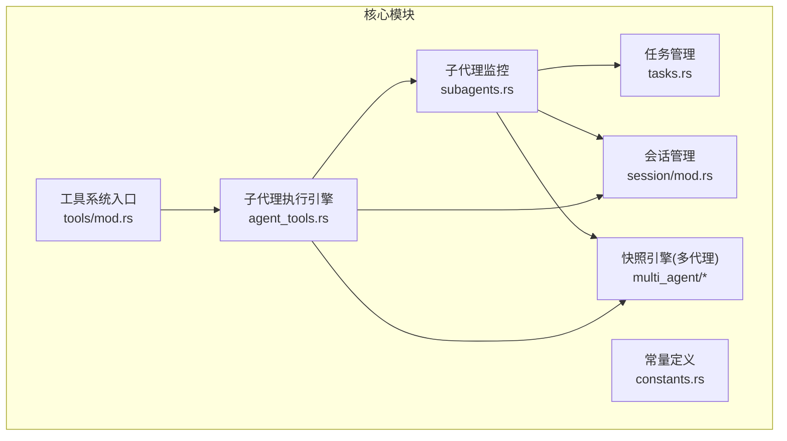
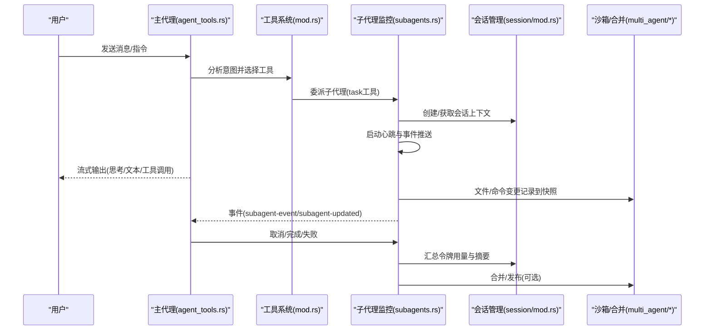
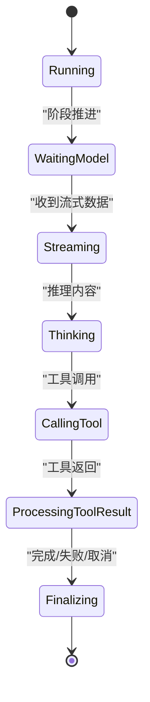
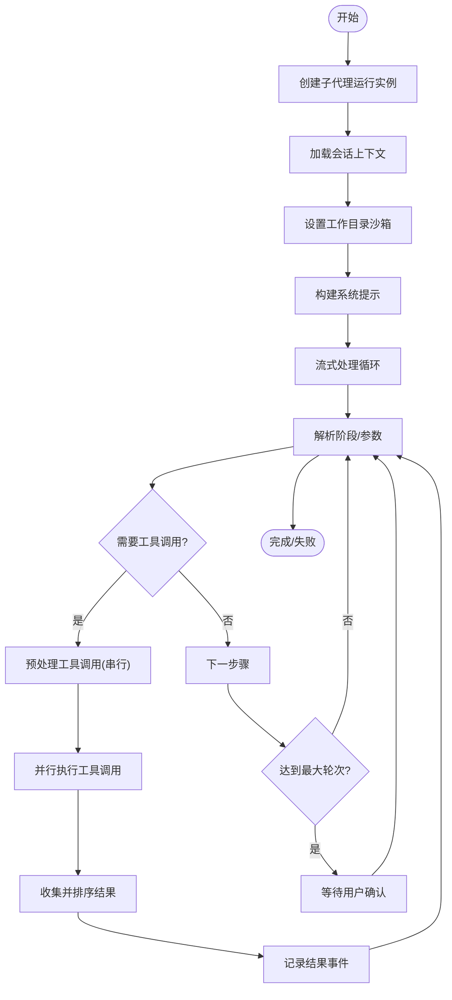
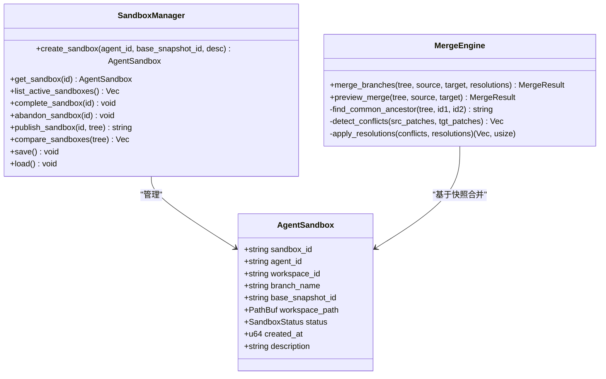
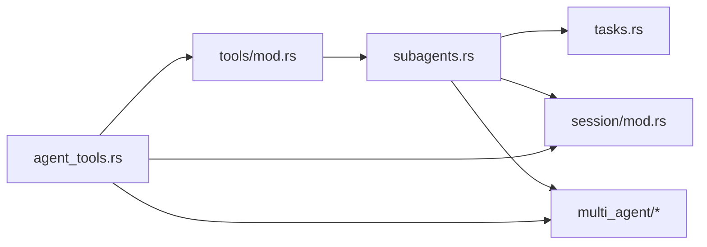

# 子代理系统

<cite>
**本文引用的文件**
- [subagents.rs](file://src-tauri/src/core/orchestration/subagents.rs)
- [agent_tools.rs](file://src-tauri/src/core/tools/agent_tools.rs)
- [mod.rs（工具系统）](file://src-tauri/src/core/tools/mod.rs)
- [tasks.rs](file://src-tauri/src/core/orchestration/tasks.rs)
- [mod.rs（多代理快照引擎）](file://src-tauri/src/core/snapshot_engine/multi_agent/mod.rs)
- [sandbox.rs（多代理沙箱）](file://src-tauri/src/core/snapshot_engine/multi_agent/sandbox.rs)
- [merge.rs（多代理合并）](file://src-tauri/src/core/snapshot_engine/multi_agent/merge.rs)
- [mod.rs（会话模块）](file://src-tauri/src/core/session/mod.rs)
- [constants.rs](file://src-tauri/src/core/constants.rs)
- [main.rs（应用入口）](file://src-tauri/src/main.rs)
</cite>

## 更新摘要
**所做更改**
- 更新子代理系统文件位置：从 core/subagents.rs 迁移到 core/orchestration/subagents.rs
- 新增子代理并行执行能力的详细说明
- 更新子代理生命周期管理与状态机描述
- 新增子代理监控与事件推送机制
- 更新工具系统与子代理委派流程
- 新增任务管理与子代理委派集成

## 目录
1. [引言](#引言)
2. [项目结构](#项目结构)
3. [核心组件](#核心组件)
4. [架构总览](#架构总览)
5. [详细组件分析](#详细组件分析)
6. [依赖分析](#依赖分析)
7. [性能考虑](#性能考虑)
8. [故障排查指南](#故障排查指南)
9. [结论](#结论)
10. [附录](#附录)

## 引言
本文件面向"子代理系统"的架构与实现，围绕以下目标展开：  
- 子代理的生命周期管理与状态机  
- 独立执行环境与资源隔离（会话沙箱与工作目录）  
- 代理编排机制与权限继承  
- 通信协议与事件驱动的状态同步  
- 与主代理的关系、任务委派与结果聚合  
- 子代理池管理、负载均衡、故障恢复与性能监控  
- 提供系统架构图与执行流程图，帮助读者快速理解与落地

**更新** 本次更新重点介绍了子代理系统重构后的文件组织结构、并行执行能力增强、监控与事件推送机制等新特性。

## 项目结构
子代理系统位于 Rust 后端核心模块中，主要分布在如下目录与文件：
- 子代理运行与监控：src-tauri/src/core/orchestration/subagents.rs
- 子代理执行引擎：src-tauri/src/core/tools/agent_tools.rs
- 工具系统入口：src-tauri/src/core/tools/mod.rs
- 任务管理：src-tauri/src/core/orchestration/tasks.rs
- 多代理快照与沙箱：src-tauri/src/core/snapshot_engine/multi_agent/*
- 会话管理：src-tauri/src/core/session/mod.rs
- 常量定义：src-tauri/src/core/constants.rs
- 应用入口：src-tauri/src/main.rs

**图表来源**
- [subagents.rs](file://src-tauri/src/core/orchestration/subagents.rs)
- [agent_tools.rs](file://src-tauri/src/core/tools/agent_tools.rs)
- [mod.rs（工具系统）](file://src-tauri/src/core/tools/mod.rs)
- [tasks.rs](file://src-tauri/src/core/orchestration/tasks.rs)
- [mod.rs（多代理快照引擎）](file://src-tauri/src/core/snapshot_engine/multi_agent/mod.rs)
- [mod.rs（会话模块）](file://src-tauri/src/core/session/mod.rs)
- [constants.rs](file://src-tauri/src/core/constants.rs)

**章节来源**
- [main.rs](file://src-tauri/src/main.rs)
- [subagents.rs](file://src-tauri/src/core/orchestration/subagents.rs)
- [agent_tools.rs](file://src-tauri/src/core/tools/agent_tools.rs)
- [mod.rs（工具系统）](file://src-tauri/src/core/tools/mod.rs)
- [tasks.rs](file://src-tauri/src/core/orchestration/tasks.rs)
- [mod.rs（多代理快照引擎）](file://src-tauri/src/core/snapshot_engine/multi_agent/mod.rs)
- [mod.rs（会话模块）](file://src-tauri/src/core/session/mod.rs)
- [constants.rs](file://src-tauri/src/core/constants.rs)

## 核心组件
- 子代理运行时与监控
  - SubAgentRun：子代理运行实例，包含状态、阶段、令牌用量、错误与摘要等
  - SubAgentEvent：事件日志，记录工具调用、阶段变化、错误等
  - SubAgentMonitor：集中管理运行实例、事件队列与取消令牌
- 子代理执行引擎
  - 流式接收、阶段解析、工具调用、结果回写与取消控制
  - 支持只读模式和读写模式的权限控制
  - **新增** 并行工具执行能力，支持多个工具同时执行
- 会话与工作目录
  - 会话持久化、智能标题、工作目录沙箱、图片缓存
  - 支持会话级工作目录限制
- 多代理快照与沙箱
  - AgentSandbox、SandboxManager、SandboxStatus、SandboxComparison
  - MergeEngine、MergeResult、Conflict、ConflictResolution
- 工具系统与委派
  - 工具定义与路由，task 工具委派子代理，权限校验与路径安全
- 任务管理与委派
  - 任务创建、状态更新、依赖关系维护
  - 与子代理委派的深度集成

**章节来源**
- [subagents.rs](file://src-tauri/src/core/orchestration/subagents.rs)
- [agent_tools.rs](file://src-tauri/src/core/tools/agent_tools.rs)
- [mod.rs（工具系统）](file://src-tauri/src/core/tools/mod.rs)
- [tasks.rs](file://src-tauri/src/core/orchestration/tasks.rs)
- [sandbox.rs（多代理沙箱）](file://src-tauri/src/core/snapshot_engine/multi_agent/sandbox.rs)
- [merge.rs（多代理合并）](file://src-tauri/src/core/snapshot_engine/multi_agent/merge.rs)
- [mod.rs（会话模块）](file://src-tauri/src/core/session/mod.rs)

## 架构总览
子代理系统采用"事件驱动 + 会话隔离 + 沙箱合并"的架构：
- 主代理负责意图识别、上下文构建与流式推理
- 当需要具体执行时，主代理通过工具系统委派子代理
- 子代理在独立会话中运行，拥有独立的内存、令牌统计与事件日志
- 子代理的文件操作与命令执行受会话工作目录沙箱约束
- 多代理产生的变更通过快照树与合并引擎进行冲突检测与合并
- **新增** 子代理支持并行执行多个工具，提高整体执行效率

**图表来源**
- [agent_tools.rs](file://src-tauri/src/core/tools/agent_tools.rs)
- [mod.rs（工具系统）](file://src-tauri/src/core/tools/mod.rs)
- [subagents.rs](file://src-tauri/src/core/orchestration/subagents.rs)
- [mod.rs（会话模块）](file://src-tauri/src/core/session/mod.rs)
- [sandbox.rs（多代理沙箱）](file://src-tauri/src/core/snapshot_engine/multi_agent/sandbox.rs)
- [merge.rs（多代理合并）](file://src-tauri/src/core/snapshot_engine/multi_agent/merge.rs)

## 详细组件分析

### 子代理运行与监控（SubAgentMonitor）
- 生命周期
  - 启动：创建运行实例、注册取消令牌、启动心跳检测
  - 阶段推进：Starting → WaitingModel → Streaming → Thinking → CallingTool → ProcessingToolResult → Finalizing
  - 结束：Complete/Fail/Cancel，移除取消令牌，生成摘要
- 事件系统
  - 事件类型：start、phase、tool_call、tool_result、complete、error、cancel
  - 事件上限：最多保留固定数量事件，溢出时丢弃最早事件
- 取消机制
  - 通过 CancellationToken 实现软取消；支持按 run_id 或 session_id 批量取消
- 状态同步
  - 通过 Tauri 事件通道向前端推送 subagent-updated 与 subagent-event

**图表来源**
- [subagents.rs](file://src-tauri/src/core/orchestration/subagents.rs)

**章节来源**
- [subagents.rs](file://src-tauri/src/core/orchestration/subagents.rs)

### 子代理执行引擎（run_subagent）
- 子代理委派机制
  - 通过 task 工具委派子代理执行具体任务
  - 支持只读/非只读模式，非只读需显式声明
  - 自动加载可用技能并注入系统提示
- 干净上下文环境
  - 优先使用会话工作目录，否则回退到进程 CWD
  - 为每个子代理分配独立沙箱，确保环境隔离
  - 支持会话级工作目录限制，防止越权访问
- 独立对话历史
  - 子代理在独立会话中运行，不共享对话历史
  - 令牌用量独立统计，最终汇总到会话
- 流式处理与工具调用
  - 统一处理 OpenAI 与其它格式的流式事件
  - 解析文本、推理内容、工具调用参数增量
  - 工具输入缓冲与参数修复，支持并行执行

**更新** 新增并行执行能力：子代理现在支持同时执行多个工具调用，通过并行任务池提高执行效率。

**图表来源**
- [agent_tools.rs](file://src-tauri/src/core/tools/agent_tools.rs)

**章节来源**
- [agent_tools.rs](file://src-tauri/src/core/tools/agent_tools.rs)

### 会话与工作目录沙箱
- 会话持久化
  - 元信息（标题、时间戳、令牌用量、工作目录）与消息体分离存储
  - 自动标题提取、图片文件落盘与引用
- 工作目录沙箱
  - 会话级 working_directory 限制文件系统访问范围
  - 路径安全校验与权限请求
- 子代理隔离
  - 子代理在独立会话中运行，不共享对话历史
  - 令牌用量独立统计，最终汇总到会话

**章节来源**
- [mod.rs（会话模块）](file://src-tauri/src/core/session/mod.rs)

### 多代理快照与合并
- AgentSandbox
  - 为每个子代理分配独立沙箱，记录工作区、分支与状态
  - 支持激活、完成、废弃与发布
- SandboxManager
  - 沙箱创建、查询、比较与持久化
  - 对比不同代理的变更统计（文件数、增删行数、快照数）
- MergeEngine
  - 基于快照树的分支合并，检测冲突并支持自动/手动解决
  - 输出合并结果与冲突统计

**图表来源**
- [sandbox.rs（多代理沙箱）](file://src-tauri/src/core/snapshot_engine/multi_agent/sandbox.rs)
- [merge.rs（多代理合并）](file://src-tauri/src/core/snapshot_engine/multi_agent/merge.rs)

**章节来源**
- [sandbox.rs（多代理沙箱）](file://src-tauri/src/core/snapshot_engine/multi_agent/sandbox.rs)
- [merge.rs（多代理合并）](file://src-tauri/src/core/snapshot_engine/multi_agent/merge.rs)
- [mod.rs（多代理快照引擎）](file://src-tauri/src/core/snapshot_engine/multi_agent/mod.rs)

### 任务管理与委派
- 任务看板
  - 任务创建、状态更新、依赖关系维护
  - 完成后级联解封下游任务
- 子代理委派
  - task 工具委派子代理执行具体任务
  - 支持只读/非只读模式，非只读需显式声明
- 结果聚合
  - 子代理运行结束后，主代理汇总事件与摘要

**章节来源**
- [mod.rs（工具系统）](file://src-tauri/src/core/tools/mod.rs)
- [subagents.rs](file://src-tauri/src/core/orchestration/subagents.rs)
- [tasks.rs](file://src-tauri/src/core/orchestration/tasks.rs)

## 依赖分析
- 组件耦合
  - SubAgentMonitor 依赖 Tauri 事件通道与全局状态容器
  - AgentTools 与 Tools 通过统一工具路由分发，降低耦合
  - Session 与 State 提供会话与工作目录的强约束
  - Multi-agent snapshot engine 为子代理变更提供版本化与合并能力
- 外部依赖
  - Tauri 事件系统用于前后端通信
  - Tokio 任务与取消令牌用于并发与取消控制
  - 快照树与合并引擎用于变更追踪与冲突解决

**图表来源**
- [agent_tools.rs](file://src-tauri/src/core/tools/agent_tools.rs)
- [mod.rs（工具系统）](file://src-tauri/src/core/tools/mod.rs)
- [subagents.rs](file://src-tauri/src/core/orchestration/subagents.rs)
- [tasks.rs](file://src-tauri/src/core/orchestration/tasks.rs)
- [mod.rs（会话模块）](file://src-tauri/src/core/session/mod.rs)
- [mod.rs（多代理快照引擎）](file://src-tauri/src/core/snapshot_engine/multi_agent/mod.rs)

**章节来源**
- [agent_tools.rs](file://src-tauri/src/core/tools/agent_tools.rs)
- [mod.rs（工具系统）](file://src-tauri/src/core/tools/mod.rs)
- [subagents.rs](file://src-tauri/src/core/orchestration/subagents.rs)
- [tasks.rs](file://src-tauri/src/core/orchestration/tasks.rs)
- [mod.rs（会话模块）](file://src-tauri/src/core/session/mod.rs)
- [mod.rs（多代理快照引擎）](file://src-tauri/src/core/snapshot_engine/multi_agent/mod.rs)

## 性能考虑
- 事件窗口限制
  - 子代理事件队列上限，避免内存膨胀
- 流式处理
  - 流式接收与增量解析，降低延迟与内存占用
- 取消与心跳
  - 心跳维持运行状态，取消令牌确保及时回收
- 会话与沙箱
  - 工作目录沙箱减少不必要的文件扫描与 IO
- 合并策略
  - 冲突阈值与自动/手动解决策略平衡吞吐与准确性
- **新增** 并行执行
  - 工具调用支持并行执行，通过任务池管理多个并发子任务
  - 并行执行时的资源竞争与锁竞争优化

## 故障排查指南
- 子代理无法取消
  - 检查取消令牌是否存在与是否被移除
  - 确认 is_cancelled 与 cancel_run 的调用链
- 事件丢失
  - 检查事件队列长度与溢出逻辑
- 工具调用失败
  - 查看工具输入解析与参数修复日志
  - 确认权限与工作目录限制
- 合并冲突过多
  - 使用预览合并查看冲突详情，调整冲突阈值或人工介入
- 上下文环境问题
  - 检查会话工作目录设置是否正确
  - 确认沙箱权限配置
- **新增** 并行执行问题
  - 检查并行任务池配置与资源限制
  - 确认工具调用的互斥与竞争条件处理

**章节来源**
- [subagents.rs](file://src-tauri/src/core/orchestration/subagents.rs)
- [agent_tools.rs](file://src-tauri/src/core/tools/agent_tools.rs)
- [merge.rs（多代理合并）](file://src-tauri/src/core/snapshot_engine/multi_agent/merge.rs)

## 结论
子代理系统通过"事件驱动 + 会话隔离 + 沙箱合并"的设计，在保证安全性与可观测性的同时，实现了高效的代理编排与任务委派。主代理专注于意图与推理，子代理专注具体执行与结果产出，二者通过统一的事件与工具系统协同工作。多代理快照与合并能力为复杂场景下的变更追踪与协作提供了坚实基础。

**更新** 重构后的子代理系统不仅保持了原有的架构优势，还通过并行执行能力显著提升了系统性能。新的文件组织结构（core/orchestration/）使代码结构更加清晰，监控与事件推送机制更加完善，为多代理协作提供了更加可靠的基础设施。

## 附录
- 关键数据模型
  - SubAgentRun/SubAgentEvent：运行与事件
  - SessionMeta/SessionMemory：会话元信息与消息体
  - AgentSandbox/SandboxManager/MergeEngine：多代理沙箱与合并
  - SubAgentStatus/SubAgentPhase：子代理状态与阶段
  - Task/TaskManager：任务管理与依赖关系

**章节来源**
- [subagents.rs](file://src-tauri/src/core/orchestration/subagents.rs)
- [mod.rs（会话模块）](file://src-tauri/src/core/session/mod.rs)
- [sandbox.rs（多代理沙箱）](file://src-tauri/src/core/snapshot_engine/multi_agent/sandbox.rs)
- [merge.rs（多代理合并）](file://src-tauri/src/core/snapshot_engine/multi_agent/merge.rs)
- [constants.rs](file://src-tauri/src/core/constants.rs)
- [tasks.rs](file://src-tauri/src/core/orchestration/tasks.rs)