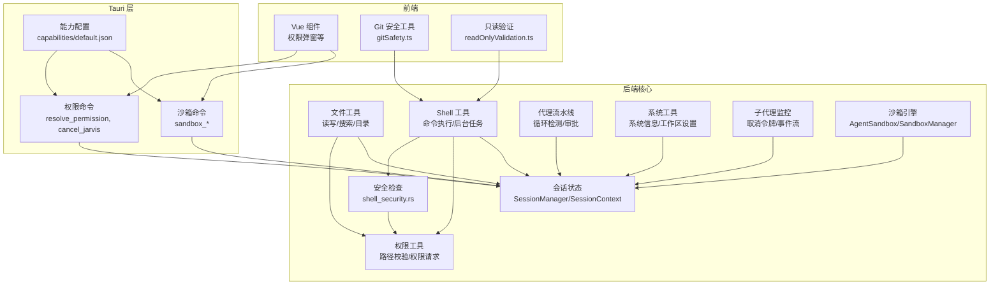
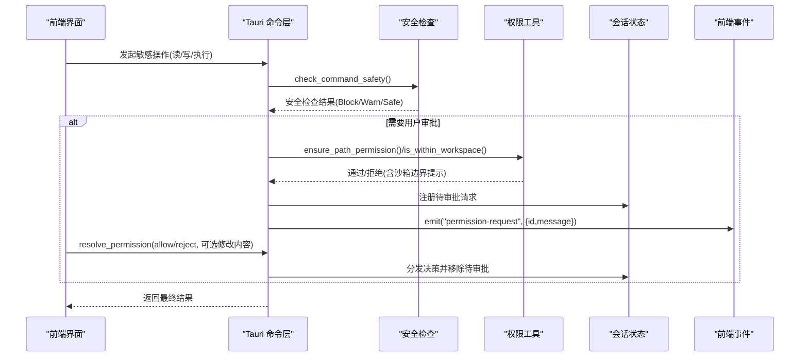
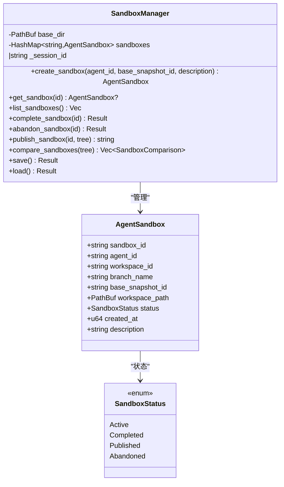
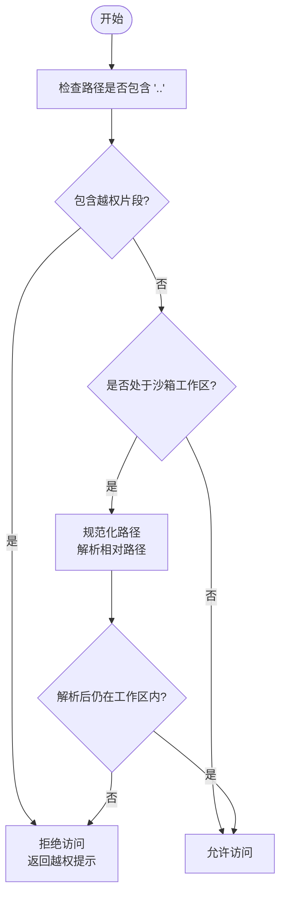
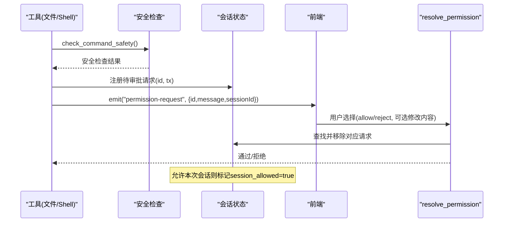
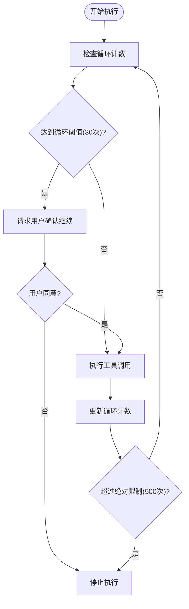
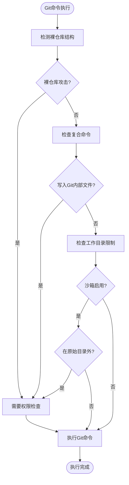
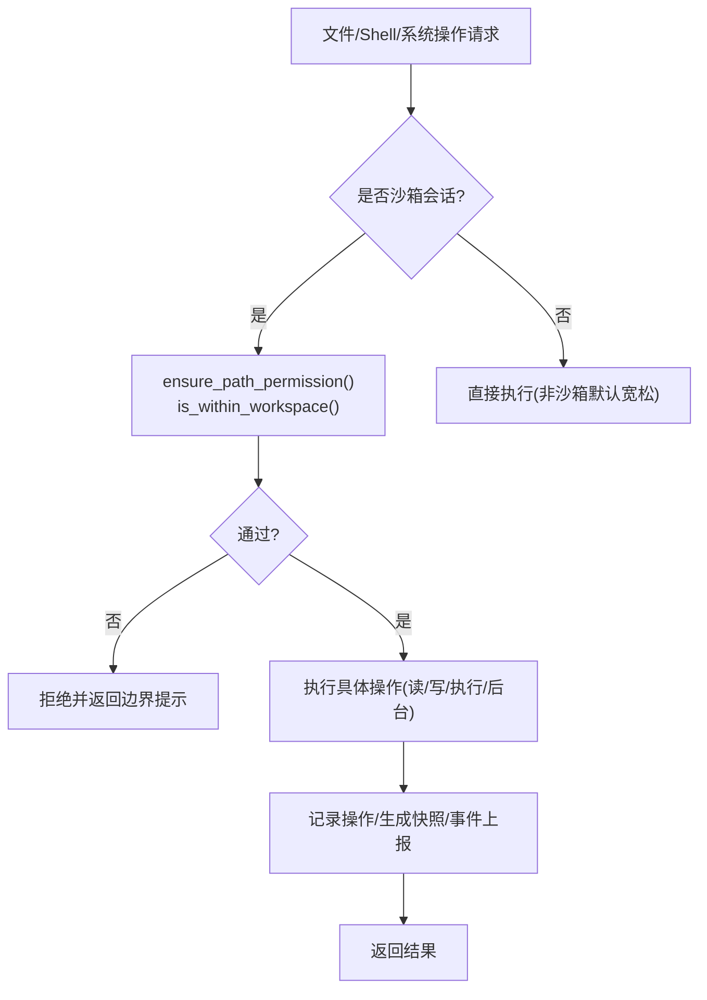
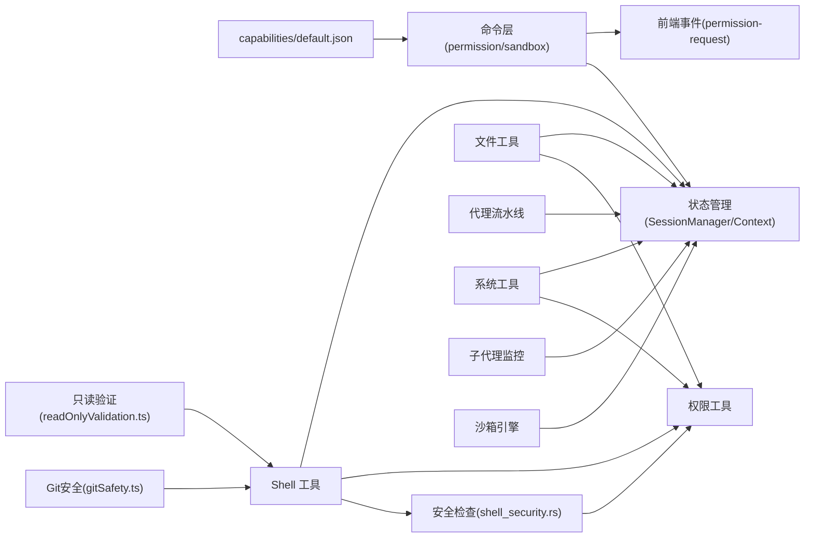

# 安全与权限架构

<cite>
**本文档引用的文件**
- [src-tauri/src/core/tools/permission.rs](file://src-tauri/src/core/tools/permission.rs)
- [src-tauri/src/core/tools/file_tools.rs](file://src-tauri/src/core/tools/file_tools.rs)
- [src-tauri/src/core/tools/shell_tools.rs](file://src-tauri/src/core/tools/shell_tools.rs)
- [src-tauri/src/core/tools/system_tools.rs](file://src-tauri/src/core/tools/system_tools.rs)
- [src-tauri/src/core/tools/shell_security.rs](file://src-tauri/src/core/tools/shell_security.rs)
- [src-tauri/src/core/commands/permission.rs](file://src-tauri/src/core/commands/permission.rs)
- [src-tauri/src/core/commands/sandbox.rs](file://src-tauri/src/core/commands/sandbox.rs)
- [src-tauri/src/core/state.rs](file://src-tauri/src/core/state.rs)
- [src-tauri/src/core/sessions.rs](file://src-tauri/src/core/sessions.rs)
- [src-tauri/src/core/subagents.rs](file://src-tauri/src/core/subagents.rs)
- [src-tauri/src/core/agent/pipeline.rs](file://src-tauri/src/core/agent/pipeline.rs)
- [src-tauri/src/core/constants.rs](file://src-tauri/src/core/constants.rs)
- [src-tauri/src/core/snapshot_engine/multi_agent/sandbox.rs](file://src-tauri/src/core/snapshot_engine/multi_agent/sandbox.rs)
- [demo/claudecode_tools/PowerShellTool/gitSafety.ts](file://demo/claudecode_tools/PowerShellTool/gitSafety.ts)
- [demo/claudecode_tools/BashTool/readOnlyValidation.ts](file://demo/claudecode_tools/BashTool/readOnlyValidation.ts)
- [src-tauri/capabilities/default.json](file://src-tauri/capabilities/default.json)
- [src-tauri/Cargo.toml](file://src-tauri/Cargo.toml)
- [src-tauri/src/main.rs](file://src-tauri/src/main.rs)
</cite>

## 更新摘要
**变更内容**
- 新增沙箱限制机制，防止路径遍历和越权访问
- 增强权限审批流程，支持会话级放行和循环检测
- 引入Git安全防护，防止沙箱逃逸和恶意钩子执行
- 完善只读命令白名单和破坏性命令警告机制
- 添加循环检测和绝对限制，防止无限循环执行

## 目录
1. [引言](#引言)
2. [项目结构](#项目结构)
3. [核心组件](#核心组件)
4. [架构总览](#架构总览)
5. [详细组件分析](#详细组件分析)
6. [依赖关系分析](#依赖关系分析)
7. [性能考量](#性能考量)
8. [故障排查指南](#故障排查指南)
9. [结论](#结论)
10. [附录](#附录)

## 引言
本文件面向安全与权限架构，系统性阐述 JarvisAgent 的安全设计与实现要点，包括：
- 沙箱机制的设计原理与生命周期
- 路径安全验证与工作区边界控制
- 访问控制与权限审批流程
- 文件系统隔离、网络访问限制、进程间通信安全
- 数据保护与审计追踪
- 威胁模型、防护策略与合规性建议
- 安全架构图与权限控制流程图

**更新** 新增沙箱限制、权限审批、循环检测、Git 安全等安全特性，完善了整体安全架构

## 项目结构
安全与权限相关的核心代码主要集中在 Rust 后端模块中，前端通过 Tauri 命令与后端交互，能力由 capabilities 配置进行声明式约束。

**图表来源**
- [src-tauri/src/core/tools/shell_security.rs:1-1099](file://src-tauri/src/core/tools/shell_security.rs#L1-L1099)
- [src-tauri/src/core/agent/pipeline.rs:1-1121](file://src-tauri/src/core/agent/pipeline.rs#L1-L1121)
- [demo/claudecode_tools/PowerShellTool/gitSafety.ts:1-177](file://demo/claudecode_tools/PowerShellTool/gitSafety.ts#L1-L177)
- [demo/claudecode_tools/BashTool/readOnlyValidation.ts:1925-1990](file://demo/claudecode_tools/BashTool/readOnlyValidation.ts#L1925-L1990)

**章节来源**
- [src-tauri/src/core/tools/permission.rs:1-103](file://src-tauri/src/core/tools/permission.rs#L1-L103)
- [src-tauri/src/core/tools/shell_security.rs:1-1099](file://src-tauri/src/core/tools/shell_security.rs#L1-L1099)
- [src-tauri/src/core/agent/pipeline.rs:1-1121](file://src-tauri/src/core/agent/pipeline.rs#L1-L1121)

## 核心组件
- 权限与路径安全工具：提供路径合法性校验、工作区边界判断、权限请求与决策分发。
- 安全检查模块：实现中等严格级别的命令安全检查，包含24项PowerShell适配检查、只读命令白名单和破坏性命令警告。
- 文件工具：封装文件读取、写入、编辑、搜索与目录列举，并在每次操作前执行路径与工作区校验。
- Shell 工具：对命令执行进行危险关键字拦截、网络下载限制、路径越权检查与目录切换限制；长周期任务强制使用后台执行。
- 代理流水线：集成循环检测机制，在达到循环上限时要求用户确认继续执行，防止无限循环。
- 系统工具：提供系统信息查询与工作区设置，沙箱会话中禁止修改全局工作区。
- 会话状态：维护每个会话的上下文、挂起权限请求、取消令牌、工作区路径等。
- 子代理监控：通过取消令牌实现子任务的可中断性，配合权限审批与取消流程。
- 沙箱引擎：管理 AgentSandbox 生命周期、工作区隔离、变更对比与发布合并。
- Git 安全防护：防止沙箱逃逸，检测裸仓库攻击和Git内部文件写入攻击。

**更新** 新增安全检查模块、代理流水线循环检测、Git安全防护等组件

**章节来源**
- [src-tauri/src/core/tools/shell_security.rs:1-1099](file://src-tauri/src/core/tools/shell_security.rs#L1-L1099)
- [src-tauri/src/core/agent/pipeline.rs:1-1121](file://src-tauri/src/core/agent/pipeline.rs#L1-L1121)
- [demo/claudecode_tools/PowerShellTool/gitSafety.ts:1-177](file://demo/claudecode_tools/PowerShellTool/gitSafety.ts#L1-L177)

## 架构总览
安全架构围绕"最小权限 + 边界隔离 + 审批与审计 + 循环检测"展开。前端通过 Tauri 命令调用后端能力，后端在执行敏感操作前进行权限与路径校验，并通过事件流向前端推送审批请求与运行状态。

**更新** 新增安全检查流程，包括命令安全检查和路径权限验证

**图表来源**
- [src-tauri/src/core/tools/shell_security.rs:837-843](file://src-tauri/src/core/tools/shell_security.rs#L837-L843)
- [src-tauri/src/core/tools/permission.rs:49-103](file://src-tauri/src/core/tools/permission.rs#L49-L103)
- [src-tauri/src/core/commands/permission.rs:1-71](file://src-tauri/src/core/commands/permission.rs#L1-L71)

## 详细组件分析

### 沙箱机制
- 设计目标：为每个 Agent 提供独立工作区与分支，隔离文件变更，支持变更对比与发布合并。
- 关键实体：
  - AgentSandbox：描述沙箱标识、所属 Agent、工作区路径、状态与创建时间。
  - SandboxManager：负责沙箱的创建、激活、完成、废弃、发布与比较。
- 生命周期：
  - 创建：生成唯一沙箱 ID 与工作区目录，初始化状态为 Active。
  - 激活：在会话上下文中启用工作区路径，后续工具调用受边界约束。
  - 完成：标记为 Completed，准备发布。
  - 废弃：标记为 Abandoned 并删除工作区。
  - 发布：将沙箱变更合并至主分支，状态更新为 Published。
- 对外接口：通过命令层暴露沙箱创建、查询、列表、完成、废弃、发布与比较。

**图表来源**
- [src-tauri/src/core/snapshot_engine/multi_agent/sandbox.rs:8-248](file://src-tauri/src/core/snapshot_engine/multi_agent/sandbox.rs#L8-L248)

**章节来源**
- [src-tauri/src/core/snapshot_engine/multi_agent/sandbox.rs:1-248](file://src-tauri/src/core/snapshot_engine/multi_agent/sandbox.rs#L1-L248)
- [src-tauri/src/core/commands/sandbox.rs:1-73](file://src-tauri/src/core/commands/sandbox.rs#L1-L73)

### 路径安全验证与工作区边界
- 路径合法性：
  - 禁止包含路径遍历片段（..）。
  - 对相对路径进行规范化与解析，确保最终路径位于工作区之内。
- 工作区外访问：
  - 当会话配置了工作区（沙箱会话）时，所有文件与命令操作均受边界约束。
  - 非沙箱会话（None）下，默认允许访问，但不建议在生产环境使用。
- Shell 命令路径检查：
  - 对 Windows 绝对路径与相对路径进行越权检测。
  - 禁止在沙箱会话中使用目录切换命令（cd/set-location 等）。

**更新** 新增沙箱路径检查，防止命令中包含沙箱外路径引用

**图表来源**
- [src-tauri/src/core/tools/permission.rs:12-72](file://src-tauri/src/core/tools/permission.rs#L12-L72)
- [src-tauri/src/core/tools/shell_tools.rs:124-154](file://src-tauri/src/core/tools/shell_tools.rs#L124-L154)

**章节来源**
- [src-tauri/src/core/tools/permission.rs:1-103](file://src-tauri/src/core/tools/permission.rs#L1-L103)
- [src-tauri/src/core/tools/shell_tools.rs:1-200](file://src-tauri/src/core/tools/shell_tools.rs#L1-L200)

### 访问控制与权限审批流程
- 权限请求：
  - 工具在执行高风险操作前，向会话上下文注册一个一次性审批请求。
  - 通过事件流向前端推送"permission-request"，携带请求 ID、消息与会话 ID。
- 决策分发：
  - 前端展示审批弹窗，用户选择允许或拒绝。
  - 后端通过 resolve_permission 命令分发决策，移除待审批并返回结果。
- 会话级放行：
  - 若用户选择"允许本次会话"，则在该会话上下文中标记允许，后续同类请求快速通过。
- 取消与清理：
  - cancel_jarvis 命令会取消当前会话的取消令牌，并拒绝所有挂起的权限请求。
  - 同时取消该会话下的所有子代理运行。

**更新** 新增安全检查前置步骤，确保命令安全性后再进行权限审批

**图表来源**
- [src-tauri/src/core/tools/shell_security.rs:837-843](file://src-tauri/src/core/tools/shell_security.rs#L837-L843)
- [src-tauri/src/core/tools/permission.rs:74-103](file://src-tauri/src/core/tools/permission.rs#L74-L103)
- [src-tauri/src/core/commands/permission.rs:1-71](file://src-tauri/src/core/commands/permission.rs#L1-L71)

**章节来源**
- [src-tauri/src/core/tools/permission.rs:1-103](file://src-tauri/src/core/tools/permission.rs#L1-L103)
- [src-tauri/src/core/commands/permission.rs:1-71](file://src-tauri/src/core/commands/permission.rs#L1-L71)
- [src-tauri/src/core/state.rs:1-78](file://src-tauri/src/core/state.rs#L1-L78)
- [src-tauri/src/core/subagents.rs:1-666](file://src-tauri/src/core/subagents.rs#L1-L666)

### 循环检测与执行限制
- 循环检测机制：
  - 代理流水线在每次循环前检查循环计数，当达到 MAX_AGENT_LOOP_BEFORE_CONFIRM（30次）时要求用户确认继续执行。
  - 绝对限制为 MAX_AGENT_LOOP_ABSOLUTE（500次），超过此限制强制停止，防止无限循环。
  - 在循环过程中定期检查取消令牌，支持用户随时取消执行。
- 用户确认流程：
  - 当循环达到阈值时，向前端发送确认消息，等待用户决定是否继续。
  - 用户拒绝则立即停止执行，用户同意则继续执行直到达到绝对限制。
- 执行保护：
  - 所有长时间运行的命令都应使用 run_in_background 参数，避免阻塞主线程。
  - 破坏性命令会显示警告信息，提醒用户潜在风险。

**新增** 循环检测机制，防止无限循环执行

**图表来源**
- [src-tauri/src/core/agent/pipeline.rs:399-405](file://src-tauri/src/core/agent/pipeline.rs#L399-L405)
- [src-tauri/src/core/agent/pipeline.rs:789-800](file://src-tauri/src/core/agent/pipeline.rs#L789-L800)
- [src-tauri/src/core/constants.rs:25-26](file://src-tauri/src/core/constants.rs#L25-L26)

**章节来源**
- [src-tauri/src/core/agent/pipeline.rs:1-1121](file://src-tauri/src/core/agent/pipeline.rs#L1-L1121)
- [src-tauri/src/core/constants.rs:1-30](file://src-tauri/src/core/constants.rs#L1-L30)

### Git 安全防护
- 裸仓库攻击防护：
  - 检测当前目录是否为裸仓库结构（包含HEAD、objects/、refs/但无有效.git/HEAD）。
  - 防止Git将当前目录视为裸仓库并执行恶意钩子。
- Git内部文件写入防护：
  - 检测复合命令中同时写入Git内部文件（HEAD、objects/、refs/、hooks/）并执行git的情况。
  - 防止攻击者创建恶意钩子文件后执行。
- 路径逃逸防护：
  - 解析可能逃逸到工作区外的路径，确保最终位置仍在工作区内。
  - 处理相对路径和绝对路径的组合情况。
- 会话安全检查：
  - 在沙箱启用时，禁止在原始工作目录之外执行Git命令。
  - 防止通过背景命令在沙箱外创建文件后执行。

**新增** Git安全防护机制，防止沙箱逃逸和恶意钩子执行

**图表来源**
- [demo/claudecode_tools/PowerShellTool/gitSafety.ts:1-177](file://demo/claudecode_tools/PowerShellTool/gitSafety.ts#L1-L177)
- [demo/claudecode_tools/BashTool/readOnlyValidation.ts:1925-1990](file://demo/claudecode_tools/BashTool/readOnlyValidation.ts#L1925-L1990)

**章节来源**
- [demo/claudecode_tools/PowerShellTool/gitSafety.ts:1-177](file://demo/claudecode_tools/PowerShellTool/gitSafety.ts#L1-L177)
- [demo/claudecode_tools/BashTool/readOnlyValidation.ts:1925-1990](file://demo/claudecode_tools/BashTool/readOnlyValidation.ts#L1925-L1990)

### 安全检查模块
- 命令安全检查：
  - Block类检查：反向Shell、base64解码、危险PowerShell命令、编码命令、下载工具、COM对象、计划任务、提权操作、WMI远程执行、UNC路径等。
  - Warn类检查：长周期命令、sleep命令、node_modules目录、命令替换、模块加载、.NET方法调用、别名操作等。
  - Safe类：通过所有检查的命令。
- 只读命令白名单：
  - PowerShell cmdlet：Get-ChildItem、Get-Content、Get-Process等50+个只读命令。
  - 外部命令：git status/diff/log等只读子命令。
  - Windows命令：dir、ipconfig、tasklist等系统信息命令。
- 破坏性命令警告：
  - 递归删除操作、Git破坏性操作、SQL破坏性操作、系统级破坏性操作等。
- 平台适配：
  - Windows特定检查：Start-Process、New-Object -ComObject等。
  - Unix特定检查：eval、sudo、包管理器安装等。

**新增** 完整的安全检查模块，提供中等严格级别的命令安全防护

**章节来源**
- [src-tauri/src/core/tools/shell_security.rs:1-1099](file://src-tauri/src/core/tools/shell_security.rs#L1-L1099)

### 文件系统隔离与工具链
- 文件工具：
  - 读取：支持行号范围，执行路径校验后读取并格式化输出。
  - 写入/编辑：自动备份原始内容、记录操作并生成快照，便于回滚与审计。
  - 搜索/目录：在工作区内递归搜索与列举，屏蔽大量二进制与构建产物。
- Shell 工具：
  - run_shell：阻塞执行，长周期任务与网络下载命令被明确拦截。
  - git_command：仅允许只读参数，避免破坏性操作。
  - background_run：长任务统一走后台执行，避免阻塞主线程。
- 系统工具：
  - get_system_info：显示当前 CWD 与沙箱工作区信息。
  - set_workspace：非沙箱会话中可修改全局工作区，沙箱会话中禁止。

**更新** 新增安全检查前置步骤，确保命令执行前的安全性

**图表来源**
- [src-tauri/src/core/tools/file_tools.rs:44-223](file://src-tauri/src/core/tools/file_tools.rs#L44-L223)
- [src-tauri/src/core/tools/shell_tools.rs:50-222](file://src-tauri/src/core/tools/shell_tools.rs#L50-L222)
- [src-tauri/src/core/tools/shell_security.rs:837-843](file://src-tauri/src/core/tools/shell_security.rs#L837-L843)

**章节来源**
- [src-tauri/src/core/tools/file_tools.rs:1-491](file://src-tauri/src/core/tools/file_tools.rs#L1-L491)
- [src-tauri/src/core/tools/shell_tools.rs:1-222](file://src-tauri/src/core/tools/shell_tools.rs#L1-L222)
- [src-tauri/src/core/tools/system_tools.rs:1-90](file://src-tauri/src/core/tools/system_tools.rs#L1-L90)

### 网络访问限制与进程间通信安全
- 网络下载限制：明确拦截 PowerShell 下载命令（Invoke-WebRequest/iwr/wget/curl），避免触发安全确认框导致进程卡死。
- 进程间通信：通过 Tauri 事件流与命令通道进行前后端交互，权限请求与子代理事件均以事件形式广播，避免直接跨进程共享敏感句柄。
- 取消机制：使用 CancellationToken 实现长任务可中断，结合 cancel_jarvis 与子代理监控，确保会话级资源可控。

**章节来源**
- [src-tauri/src/core/tools/shell_tools.rs:90-130](file://src-tauri/src/core/tools/shell_tools.rs#L90-L130)
- [src-tauri/src/core/subagents.rs:434-460](file://src-tauri/src/core/subagents.rs#L434-L460)

### 数据保护与审计日志
- 快照与变更记录：文件写入/编辑自动备份并生成补丁，记录操作摘要与哈希，便于审计与回滚。
- 事件驱动：子代理运行状态、阶段变化、工具调用与结果均以事件形式记录与上报。
- 会话持久化：会话元信息与内存数据持久化，包含标题、时间戳、令牌用量与计划文档状态，支持审计追踪。

**章节来源**
- [src-tauri/src/core/tools/file_tools.rs:149-223](file://src-tauri/src/core/tools/file_tools.rs#L149-L223)
- [src-tauri/src/core/subagents.rs:565-612](file://src-tauri/src/core/subagents.rs#L565-L612)
- [src-tauri/src/core/sessions.rs:218-364](file://src-tauri/src/core/sessions.rs#L218-L364)

## 依赖关系分析
- 前端能力声明：通过 capabilities/default.json 声明窗口、文件系统与对话框等能力，后端命令仅在授权范围内可用。
- 后端依赖：使用 Tauri 生态插件（fs、dialog、opener、window-state）与 tokio 异步运行时，保证并发与取消语义。
- 模块耦合：权限工具与状态管理紧密耦合，工具层通过状态获取工作区与挂起请求；命令层负责审批与取消。

**更新** 新增安全检查模块、代理流水线、Git安全等依赖关系

**图表来源**
- [src-tauri/capabilities/default.json:1-18](file://src-tauri/capabilities/default.json#L1-L18)
- [src-tauri/src/core/tools/shell_security.rs:1-1099](file://src-tauri/src/core/tools/shell_security.rs#L1-L1099)
- [src-tauri/src/core/agent/pipeline.rs:1-1121](file://src-tauri/src/core/agent/pipeline.rs#L1-L1121)
- [demo/claudecode_tools/PowerShellTool/gitSafety.ts:1-177](file://demo/claudecode_tools/PowerShellTool/gitSafety.ts#L1-L177)

**章节来源**
- [src-tauri/Cargo.toml:20-42](file://src-tauri/Cargo.toml#L20-L42)
- [src-tauri/src/main.rs:1-7](file://src-tauri/src/main.rs#L1-L7)

## 性能考量
- 异步与取消：使用 tokio 与 CancellationToken，避免阻塞与僵尸进程。
- 事件节流：子代理事件列表限制长度，防止内存膨胀。
- I/O 优化：文件搜索与目录列举过滤常见二进制与构建产物，降低无效扫描开销。
- 快照粒度：按文件级补丁记录，避免全量备份带来的 IO 压力。
- 安全检查优化：使用懒初始化正则表达式，避免重复编译正则造成性能损失。

**更新** 新增安全检查优化策略

## 故障排查指南
- 权限被拒：
  - 检查前端是否正确处理"permission-request"事件并调用 resolve_permission。
  - 确认会话上下文中的 pending_permissions 是否被正确移除。
- 沙箱访问被拒：
  - 确认请求路径是否在工作区内，避免使用 ".." 或越权相对路径。
  - 非沙箱会话默认允许访问，若出现异常，检查工作区配置。
- Shell 命令失败：
  - 长周期任务请改用 background_run。
  - 禁止使用网络下载命令与目录切换命令（cd/set-location）。
  - 检查安全检查结果，确认命令是否被Block或Warn。
- 子代理无法取消：
  - 检查 cancel_jarvis 是否正确调用并清理取消令牌。
  - 确认子代理监控状态中是否存在运行中的任务。
- 循环执行被阻止：
  - 检查循环计数是否达到阈值（30次）。
  - 确认是否需要用户确认继续执行。
  - 检查是否超过绝对限制（500次）。
- Git命令执行失败：
  - 检查是否在裸仓库攻击场景中。
  - 确认是否同时写入Git内部文件并执行git命令。
  - 检查沙箱启用时的工作目录限制。

**更新** 新增循环检测、Git安全等故障排查指导

**章节来源**
- [src-tauri/src/core/commands/permission.rs:46-71](file://src-tauri/src/core/commands/permission.rs#L46-L71)
- [src-tauri/src/core/tools/shell_tools.rs:50-130](file://src-tauri/src/core/tools/shell_tools.rs#L50-L130)
- [src-tauri/src/core/agent/pipeline.rs:399-405](file://src-tauri/src/core/agent/pipeline.rs#L399-L405)
- [demo/claudecode_tools/PowerShellTool/gitSafety.ts:1-177](file://demo/claudecode_tools/PowerShellTool/gitSafety.ts#L1-L177)

## 结论
本架构通过"最小权限 + 工作区边界 + 审批与审计 + 循环检测"的组合拳，实现了对文件系统、Shell 命令与子代理运行的强约束与可观测性。新增的安全检查模块提供了中等严格级别的命令安全防护，包括24项PowerShell适配检查、只读命令白名单和破坏性命令警告。Git安全防护有效防止了沙箱逃逸和恶意钩子执行。循环检测机制确保了系统的稳定性，防止无限循环执行。沙箱机制提供了可验证的隔离与可追溯的变更，权限审批与取消令牌确保了用户可控与可恢复。建议在生产环境中：
- 默认启用沙箱会话，严格限制非沙箱访问。
- 完善前端审批 UI 与异常提示，提升用户体验。
- 增加审计日志的持久化与检索能力，满足合规需求。
- 定期更新安全检查规则，应对新的安全威胁。

**更新** 总结新增的安全特性及其价值

## 附录
- 威胁模型与防护策略：
  - 路径遍历攻击：通过路径规范化与工作区边界检查抵御。
  - 任意命令执行：通过危险关键字拦截与审批流程限制。
  - 网络下载风险：明确禁止相关命令，避免触发系统确认框。
  - 资源滥用：通过后台执行与取消令牌控制长任务。
  - 沙箱逃逸：通过Git安全防护和路径逃逸检测防止。
  - 无限循环：通过循环检测和绝对限制防止系统资源耗尽。
- 合规性考虑：
  - 审计日志：保留操作、变更与事件记录，支持可追溯性。
  - 最小权限：能力声明与命令授权相结合，避免过度放权。
  - 用户同意：对高风险操作采用显式审批，保障知情同意。
  - 安全检查：中等严格级别的命令安全检查，平衡安全性与可用性。

**更新** 新增威胁模型和防护策略，涵盖新增的安全特性