# 工具系统架构

<cite>
**本文引用的文件**
- [src-tauri/src/core/tools/mod.rs](file://src-tauri/src/core/tools/mod.rs)
- [src-tauri/src/core/tools/registry.rs](file://src-tauri/src/core/tools/registry.rs)
- [src-tauri/src/core/tools/tool_search.rs](file://src-tauri/src/core/tools/tool_search.rs)
- [src-tauri/src/core/tools/permission.rs](file://src-tauri/src/core/tools/permission.rs)
- [src-tauri/src/core/tools/file_tools.rs](file://src-tauri/src/core/tools/file_tools.rs)
- [src-tauri/src/core/tools/shell_tools.rs](file://src-tauri/src/core/tools/shell_tools.rs)
- [src-tauri/src/core/tools/shell_security.rs](file://src-tauri/src/core/tools/shell_security.rs)
- [src-tauri/src/core/tools/system_tools.rs](file://src-tauri/src/core/tools/system_tools.rs)
- [src-tauri/src/core/tools/task_tools.rs](file://src-tauri/src/core/tools/task_tools.rs)
- [src-tauri/src/core/tools/agent_tools.rs](file://src-tauri/src/core/tools/agent_tools.rs)
- [src-tauri/src/core/models.rs](file://src-tauri/src/core/models.rs)
- [src-tauri/src/core/constants.rs](file://src-tauri/src/core/constants.rs)
- [src-tauri/src/core/adapters.rs](file://src-tauri/src/core/adapters.rs)
- [src-tauri/src/core/registry.rs](file://src-tauri/src/core/registry.rs)
- [src-tauri/src/core/background.rs](file://src-tauri/src/core/background.rs)
- [src-tauri/model_registry.json](file://src-tauri/model_registry.json)
</cite>

## 更新摘要
**所做更改**
- 新增 define_tools! 宏系统，实现工具注册的标准化和自动化
- 改进工具注册表系统，统一管理 ToolDef 结构和工具元数据
- 新增 shell_security 安全框架，提供跨平台命令安全检查
- 增强工具搜索和渐进式披露机制，支持更智能的工具发现
- 优化文件工具域，完善文件读取、编辑、搜索功能
- 优化 Shell/Git 工具域，强化只读 Git 操作和后台任务管理
- 完善任务工具域，扩展任务管理功能
- 更新工具注册表系统，实现统一的工具元数据管理
- 增强工具搜索和发现机制，支持关键词搜索和精确选择

## 目录
1. [简介](#简介)
2. [项目结构](#项目结构)
3. [核心组件](#核心组件)
4. [架构总览](#架构总览)
5. [详细组件分析](#详细组件分析)
6. [依赖关系分析](#依赖关系分析)
7. [性能考量](#性能考量)
8. [故障排查指南](#故障排查指南)
9. [结论](#结论)
10. [附录](#附录)

## 简介
本文件系统性阐述 JarvisAgent 工具系统的架构设计与实现，重点覆盖：
- 动态工具调用分发机制与路由解析
- 新增 define_tools! 宏系统和改进的工具注册表
- 渐进式工具披露机制与智能工具发现
- 内置工具集（文件操作、Shell 命令、系统信息、Git 操作、任务管理、Agent 工具）的设计模式与实现细节
- 新的 shell_security 安全框架与权限控制
- 参数验证与错误处理机制
- 工具扩展接口与自定义工具开发指南
- 性能优化策略与最佳实践
- 工具系统架构图与调用流程图

## 项目结构
工具系统位于 Rust 后端核心模块 src-tauri/src/core/tools 下，采用"按功能域划分"的模块化组织方式：
- tools 模块作为入口，负责工具定义、路由分发与延迟工具披露
- 新增 tool_search 模块，实现工具搜索和渐进式披露机制
- 新增 shell_security 模块，提供跨平台命令安全检查
- 各工具域模块（file_tools、shell_tools、system_tools、task_tools、agent_tools）实现具体能力
- registry 模块提供统一的工具注册表和元数据管理
- permission 模块提供路径安全与权限请求
- adapters/registry/background 等模块支撑格式转换、模型能力查询与后台任务管理

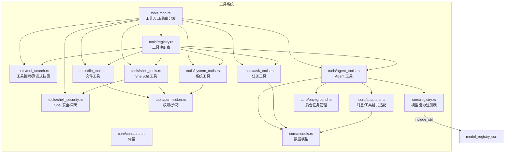

**图表来源**
- [src-tauri/src/core/tools/mod.rs:1-288](file://src-tauri/src/core/tools/mod.rs#L1-L288)
- [src-tauri/src/core/tools/registry.rs:1-156](file://src-tauri/src/core/tools/registry.rs#L1-L156)
- [src-tauri/src/core/tools/tool_search.rs:1-266](file://src-tauri/src/core/tools/tool_search.rs#L1-L266)
- [src-tauri/src/core/tools/shell_security.rs:1-200](file://src-tauri/src/core/tools/shell_security.rs#L1-L200)
- [src-tauri/src/core/tools/permission.rs:1-103](file://src-tauri/src/core/tools/permission.rs#L1-L103)
- [src-tauri/src/core/tools/file_tools.rs:1-837](file://src-tauri/src/core/tools/file_tools.rs#L1-L837)
- [src-tauri/src/core/tools/shell_tools.rs:1-580](file://src-tauri/src/core/tools/shell_tools.rs#L1-L580)
- [src-tauri/src/core/tools/system_tools.rs:1-141](file://src-tauri/src/core/tools/system_tools.rs#L1-L141)
- [src-tauri/src/core/tools/task_tools.rs:1-325](file://src-tauri/src/core/tools/task_tools.rs#L1-L325)
- [src-tauri/src/core/tools/agent_tools.rs:1-1153](file://src-tauri/src/core/tools/agent_tools.rs#L1-L1153)
- [src-tauri/src/core/adapters.rs:1-259](file://src-tauri/src/core/adapters.rs#L1-L259)
- [src-tauri/src/core/registry.rs:1-103](file://src-tauri/src/core/registry.rs#L1-L103)
- [src-tauri/src/core/background.rs:1-297](file://src-tauri/src/core/background.rs#L1-L297)
- [src-tauri/src/core/models.rs:1-256](file://src-tauri/src/core/models.rs#L1-L256)
- [src-tauri/src/core/constants.rs:1-30](file://src-tauri/src/core/constants.rs#L1-L30)

**章节来源**
- [src-tauri/src/core/tools/mod.rs:1-288](file://src-tauri/src/core/tools/mod.rs#L1-L288)

## 核心组件
- 工具入口与路由分发：统一入口 handle_tool_call/handle_tool_call_inner，基于工具名进行分支分发，支持子代理工具 task 的特殊处理与延迟工具披露
- define_tools! 宏系统：标准化工具注册过程，自动将 ToolDef 列表注册到 ToolRegistry
- 工具注册表系统：统一的 ToolDef 结构，支持工具元数据、Schema 定义、延迟披露标记、只读标记等
- 工具搜索与渐进式披露：新增 tool_search 模块，实现工具搜索、关键词匹配、精确选择等功能
- 新的 Shell 安全框架：shell_security 模块提供跨平台命令安全检查，包括危险命令拦截、警告和路径检查
- 权限与沙箱：路径安全检查、工作区外访问授权、会话级权限请求
- 内置工具域：
  - 文件工具：读写/编辑文件、目录遍历、仓库映射与搜索
  - Shell/Git 工具：只读 Git 命令、PowerShell 同步执行、后台任务管理、安全检查
  - 系统工具：系统信息查询、工作区设置（沙箱会话禁用）
  - 任务工具：任务创建/更新/查询/汇总
  - Agent 工具：子代理执行引擎、技能加载、上下文压缩、记忆整理、方案审批
- 支撑能力：消息与工具格式适配（Anthropic/OpenAI）、模型能力注册表、后台任务管理、常量与数据模型

**章节来源**
- [src-tauri/src/core/tools/mod.rs:183-288](file://src-tauri/src/core/tools/mod.rs#L183-L288)
- [src-tauri/src/core/tools/registry.rs:137-156](file://src-tauri/src/core/tools/registry.rs#L137-L156)
- [src-tauri/src/core/tools/tool_search.rs:1-266](file://src-tauri/src/core/tools/tool_search.rs#L1-L266)
- [src-tauri/src/core/tools/shell_security.rs:1-200](file://src-tauri/src/core/tools/shell_security.rs#L1-L200)
- [src-tauri/src/core/tools/permission.rs:1-103](file://src-tauri/src/core/tools/permission.rs#L1-L103)
- [src-tauri/src/core/tools/file_tools.rs:1-837](file://src-tauri/src/core/tools/file_tools.rs#L1-L837)
- [src-tauri/src/core/tools/shell_tools.rs:1-580](file://src-tauri/src/core/tools/shell_tools.rs#L1-L580)
- [src-tauri/src/core/tools/system_tools.rs:1-141](file://src-tauri/src/core/tools/system_tools.rs#L1-L141)
- [src-tauri/src/core/tools/task_tools.rs:1-325](file://src-tauri/src/core/tools/task_tools.rs#L1-L325)
- [src-tauri/src/core/tools/agent_tools.rs:1-1153](file://src-tauri/src/core/tools/agent_tools.rs#L1-L1153)
- [src-tauri/src/core/adapters.rs:1-259](file://src-tauri/src/core/adapters.rs#L1-L259)
- [src-tauri/src/core/registry.rs:1-103](file://src-tauri/src/core/registry.rs#L1-L103)
- [src-tauri/src/core/background.rs:1-297](file://src-tauri/src/core/background.rs#L1-L297)
- [src-tauri/src/core/models.rs:1-256](file://src-tauri/src/core/models.rs#L1-L256)
- [src-tauri/src/core/constants.rs:1-30](file://src-tauri/src/core/constants.rs#L1-L30)

## 架构总览
工具系统采用"入口路由 + 注册表 + 渐进式披露 + 域模块实现 + 安全框架 + 权限/适配/注册表/后台支撑"的分层设计。核心流程：
- 前端/上层调用传入工具名与参数
- 入口模块解析意图，构建工具定义（含延迟披露）
- 路由分发到对应域模块或工具搜索模块
- 域模块执行前进行权限/沙箱校验与参数验证
- 新的安全框架进行命令安全检查
- 执行完成后返回结果，必要时触发快照/事件通知

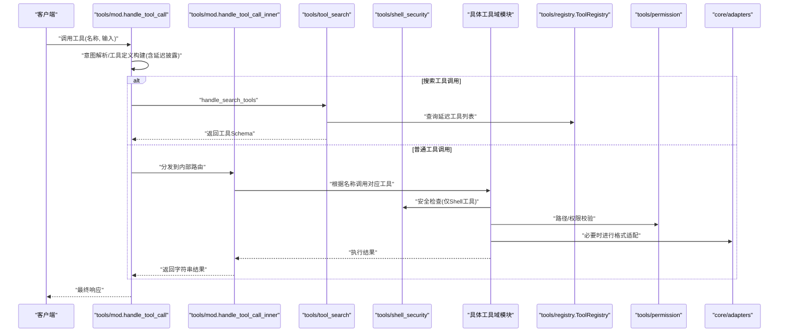

**图表来源**
- [src-tauri/src/core/tools/mod.rs:183-288](file://src-tauri/src/core/tools/mod.rs#L183-L288)
- [src-tauri/src/core/tools/tool_search.rs:125-165](file://src-tauri/src/core/tools/tool_search.rs#L125-L165)
- [src-tauri/src/core/tools/registry.rs:47-135](file://src-tauri/src/core/tools/registry.rs#L47-L135)
- [src-tauri/src/core/tools/permission.rs:1-103](file://src-tauri/src/core/tools/permission.rs#L1-103)
- [src-tauri/src/core/adapters.rs:1-259](file://src-tauri/src/core/adapters.rs#L1-L259)

## 详细组件分析

### 工具入口与路由分发
- 入口函数 handle_tool_call：区分 task 子代理工具与其他工具；task 工具走 run_subagent 流程；其他工具走 handle_tool_call_inner
- handle_tool_call_inner：基于工具名的集中式匹配分发，涵盖系统、文件、Shell、任务、Agent、工具搜索等域
- 工具定义构建：按意图（如 CHAT/MEMORY_QUERY/PROJECT_ACTION/SUBAGENT）返回不同粒度的工具 Schema；对 PROJECT_ACTION/SUBAGENT 采用"延迟披露"策略，仅在激活时返回完整 Schema

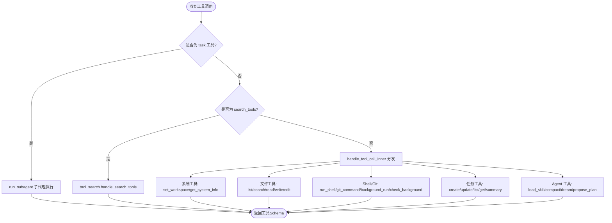

**图表来源**
- [src-tauri/src/core/tools/mod.rs:183-288](file://src-tauri/src/core/tools/mod.rs#L183-L288)
- [src-tauri/src/core/tools/tool_search.rs:125-165](file://src-tauri/src/core/tools/tool_search.rs#L125-L165)

**章节来源**
- [src-tauri/src/core/tools/mod.rs:183-288](file://src-tauri/src/core/tools/mod.rs#L183-L288)

### define_tools! 宏系统与工具注册表
- define_tools! 宏：标准化工具注册过程，自动将 ToolDef 列表注册到 ToolRegistry
- ToolDef 结构：统一的工具元数据定义，包含名称、描述、搜索提示词、完整 JSON Schema、延迟披露标记、只读标记、并发安全标记、启用状态
- 全局注册表：ToolRegistry 单例，支持工具注册、查询、核心工具获取、延迟工具列表获取等功能
- 工具注册：各模块通过 define_tools! 宏注册工具，ToolRegistry.global() 在首次访问时懒初始化

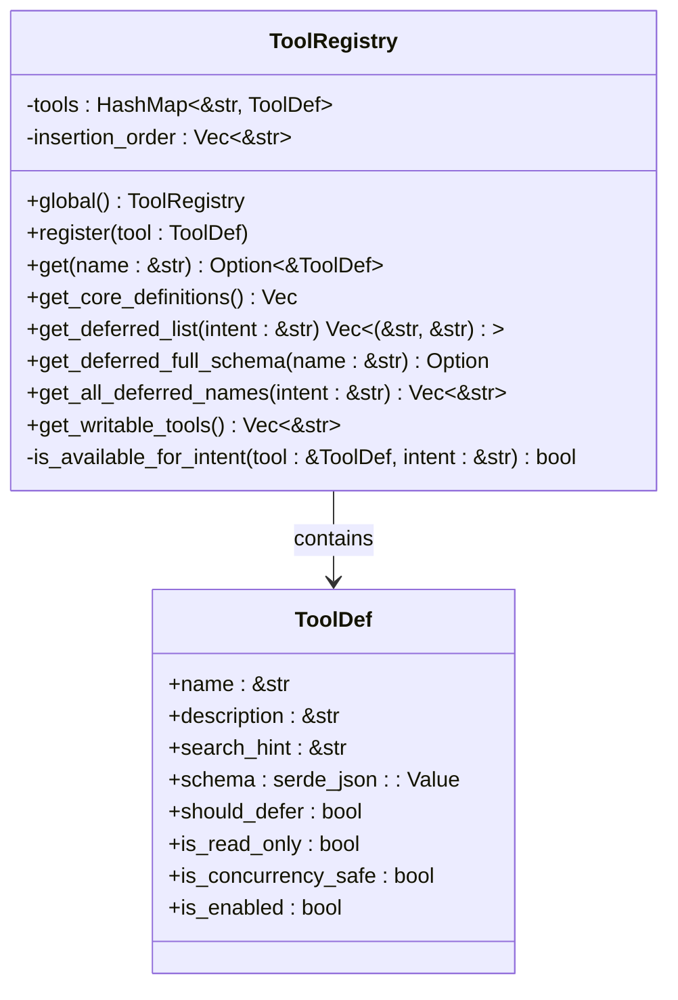

**图表来源**
- [src-tauri/src/core/tools/registry.rs:18-36](file://src-tauri/src/core/tools/registry.rs#L18-L36)
- [src-tauri/src/core/tools/registry.rs:47-135](file://src-tauri/src/core/tools/registry.rs#L47-L135)

**章节来源**
- [src-tauri/src/core/tools/registry.rs:1-156](file://src-tauri/src/core/tools/registry.rs#L1-L156)

### 工具搜索与渐进式披露
- 核心工具获取：get_core_tool_definitions 返回所有 should_defer == false 的工具定义
- 延迟工具列表：get_deferred_tool_list 按意图返回 (name, description) 元组列表
- 工具搜索：search_deferred_tools 支持 select: 精确选择和关键词搜索，返回匹配的工具名列表
- 上下文生成：get_deferred_tools_context 生成延迟工具列表的系统提示上下文
- 搜索工具处理：handle_search_tools 实现完整的搜索流程，返回工具的完整 JSON Schema

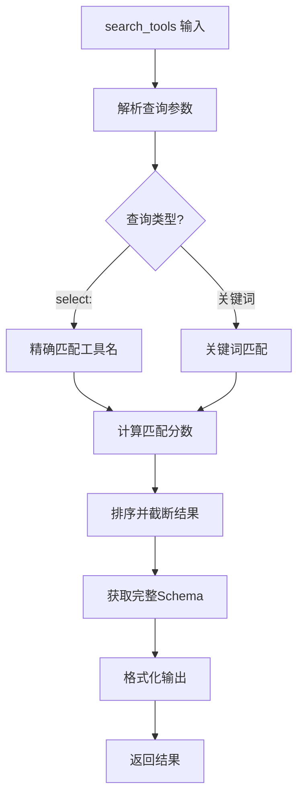

**图表来源**
- [src-tauri/src/core/tools/tool_search.rs:49-105](file://src-tauri/src/core/tools/tool_search.rs#L49-L105)
- [src-tauri/src/core/tools/tool_search.rs:125-165](file://src-tauri/src/core/tools/tool_search.rs#L125-L165)

**章节来源**
- [src-tauri/src/core/tools/tool_search.rs:1-266](file://src-tauri/src/core/tools/tool_search.rs#L1-L266)

### 新的 Shell 安全框架
- 安全检查结果：SafetyResult 枚举，包含 Safe/Warn/Block 三种状态
- 跨平台安全检查：支持 Windows PowerShell 和 Unix bash 命令的安全检查
- 危险命令拦截：拦截反向 Shell、base64 解码、网络下载、COM 对象等高危操作
- 警告机制：对长周期命令、sleep、.NET 方法等中危操作发出警告
- 路径安全检查：检查命令中的路径引用是否在沙箱内

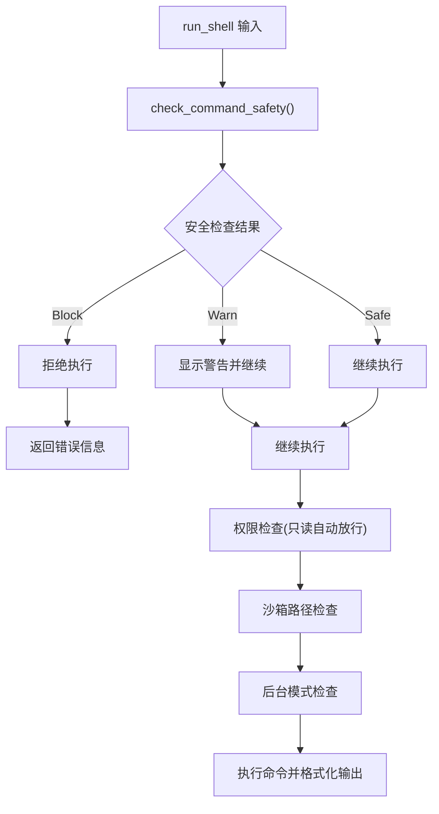

**图表来源**
- [src-tauri/src/core/tools/shell_tools.rs:255-354](file://src-tauri/src/core/tools/shell_tools.rs#L255-L354)
- [src-tauri/src/core/tools/shell_security.rs:23-32](file://src-tauri/src/core/tools/shell_security.rs#L23-L32)

**章节来源**
- [src-tauri/src/core/tools/shell_security.rs:1-200](file://src-tauri/src/core/tools/shell_security.rs#L1-L200)
- [src-tauri/src/core/tools/shell_tools.rs:1-580](file://src-tauri/src/core/tools/shell_tools.rs#L1-L580)

### 权限与安全沙箱
- 路径安全：禁止路径遍历（..），对相对路径进行规范化与工作区边界检查
- 沙箱限制：在工作区会话中，严格限制命令与文件操作仅限于工作区目录；禁止目录切换命令
- 权限请求：对高风险命令（删除、格式化、网络下载等）与工作区变更发出一次性权限请求，支持会话级"允许本次会话"豁免
- 系统工具限制：沙箱会话禁止设置全局工作区

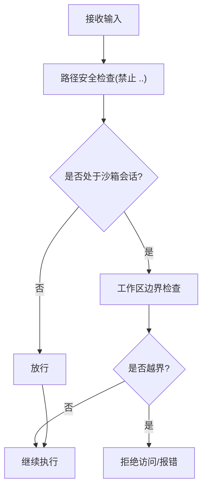

**图表来源**
- [src-tauri/src/core/tools/permission.rs:12-72](file://src-tauri/src/core/tools/permission.rs#L12-L72)
- [src-tauri/src/core/tools/system_tools.rs:56-100](file://src-tauri/src/core/tools/system_tools.rs#L56-L100)
- [src-tauri/src/core/tools/shell_tools.rs:277-290](file://src-tauri/src/core/tools/shell_tools.rs#L277-L290)

**章节来源**
- [src-tauri/src/core/tools/permission.rs:1-103](file://src-tauri/src/core/tools/permission.rs#L1-L103)
- [src-tauri/src/core/tools/system_tools.rs:1-141](file://src-tauri/src/core/tools/system_tools.rs#L1-L141)
- [src-tauri/src/core/tools/shell_tools.rs:1-580](file://src-tauri/src/core/tools/shell_tools.rs#L1-L580)

### 文件工具域
- 能力清单：读取文件（支持行号范围）、读取骨架（结构签名）、写入文件（自动备份+快照）、编辑文件（替换+备份+快照）、目录遍历、仓库映射、关键词搜索
- 安全与审计：每次文件变更记录操作与补丁，自动创建快照；读取/编辑失败时区分"被占用/权限/IO"等场景并给出提示
- 搜索策略：递归遍历，过滤常见二进制与隐藏目录，限制输出数量并截断

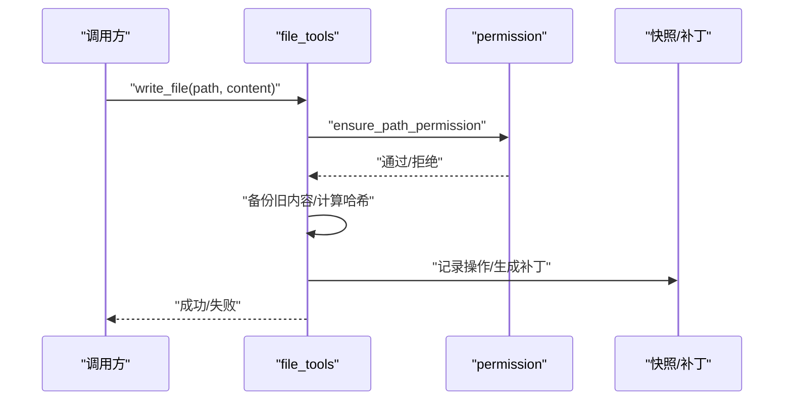

**图表来源**
- [src-tauri/src/core/tools/file_tools.rs:257-350](file://src-tauri/src/core/tools/file_tools.rs#L257-L350)

**章节来源**
- [src-tauri/src/core/tools/file_tools.rs:1-837](file://src-tauri/src/core/tools/file_tools.rs#L1-L837)

### Shell/Git 工具域
- run_shell：阻塞同步执行 PowerShell 命令；长周期/服务启动命令强制改用后台执行；拦截网络下载；沙箱会话禁止目录切换
- git_command：只读 Git 命令，拦截 push/reset/rebase 等危险参数；沙箱会话校验参数路径
- background_run/check_background：后台任务管理，识别任务类型与端口，异步执行并通知

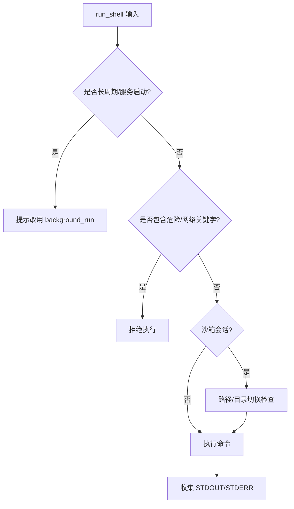

**图表来源**
- [src-tauri/src/core/tools/shell_tools.rs:255-354](file://src-tauri/src/core/tools/shell_tools.rs#L255-L354)
- [src-tauri/src/core/tools/shell_tools.rs:356-446](file://src-tauri/src/core/tools/shell_tools.rs#L356-L446)
- [src-tauri/src/core/background.rs:435-473](file://src-tauri/src/core/background.rs#L435-L473)

**章节来源**
- [src-tauri/src/core/tools/shell_tools.rs:1-580](file://src-tauri/src/core/tools/shell_tools.rs#L1-L580)
- [src-tauri/src/core/background.rs:1-297](file://src-tauri/src/core/background.rs#L1-L297)

### 系统工具域
- get_system_info：返回 OS/CWD/Home，若在沙箱会话则标注工作区限制
- set_workspace：非沙箱会话下变更全局工作区，触发权限确认

**章节来源**
- [src-tauri/src/core/tools/system_tools.rs:1-141](file://src-tauri/src/core/tools/system_tools.rs#L1-L141)

### 任务工具域
- 任务生命周期：创建、更新（状态/阻塞关系）、查询、汇总
- 数据模型：Task/TaskStatus
- 工具注册：支持任务管理相关的所有工具的 Schema 定义和元数据管理

**章节来源**
- [src-tauri/src/core/tools/task_tools.rs:1-325](file://src-tauri/src/core/tools/task_tools.rs#L1-L325)
- [src-tauri/src/core/models.rs:237-256](file://src-tauri/src/core/models.rs#L237-L256)

### Agent 工具域（子代理执行引擎）
- run_subagent：子代理循环执行，支持只读/读写模式；按意图构建工具集合；流式消费模型输出，解析工具调用参数，自动修复流式 JSON；执行工具并记录步骤与用量
- propose_plan：方案审批，生成唯一 ID，持久化到 .plans，推送前端预览面板
- 适配与注册表：根据模型能力选择合适的思考参数（reasoning_effort/thinking/thinkingBudget/enable_thinking），并进行消息与工具格式转换
- 后台任务：与后台管理器协作，记录任务状态与通知

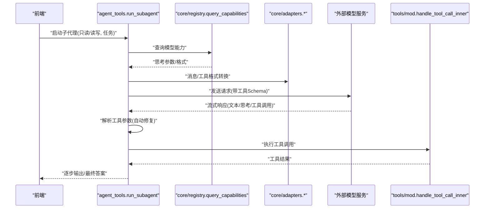

**图表来源**
- [src-tauri/src/core/tools/agent_tools.rs:79-891](file://src-tauri/src/core/tools/agent_tools.rs#L79-L891)
- [src-tauri/src/core/registry.rs:68-89](file://src-tauri/src/core/registry.rs#L68-L89)
- [src-tauri/src/core/adapters.rs:84-259](file://src-tauri/src/core/adapters.rs#L84-L259)

**章节来源**
- [src-tauri/src/core/tools/agent_tools.rs:1-1153](file://src-tauri/src/core/tools/agent_tools.rs#L1-L1153)
- [src-tauri/src/core/registry.rs:1-103](file://src-tauri/src/core/registry.rs#L1-L103)
- [src-tauri/src/core/adapters.rs:1-259](file://src-tauri/src/core/adapters.rs#L1-L259)
- [src-tauri/src/core/background.rs:1-297](file://src-tauri/src/core/background.rs#L1-L297)

## 依赖关系分析
- 模块耦合
  - tools/mod 对各域模块存在直接依赖，但通过统一入口与延迟披露降低耦合度
  - agent_tools 依赖 adapters/registry/background 与 models，形成较重的依赖链
  - tool_search 依赖 registry 模块，提供工具搜索和渐进式披露功能
  - shell_security 为 shell_tools 的横切关注点，提供安全检查
  - permission 为横切关注点，被 file_tools/shell_tools/system_tools 广泛复用
- 外部依赖
  - 模型能力注册表以编译时内嵌 JSON 形式提供，减少运行时 IO
  - 后台任务管理通过状态共享与通知队列解耦

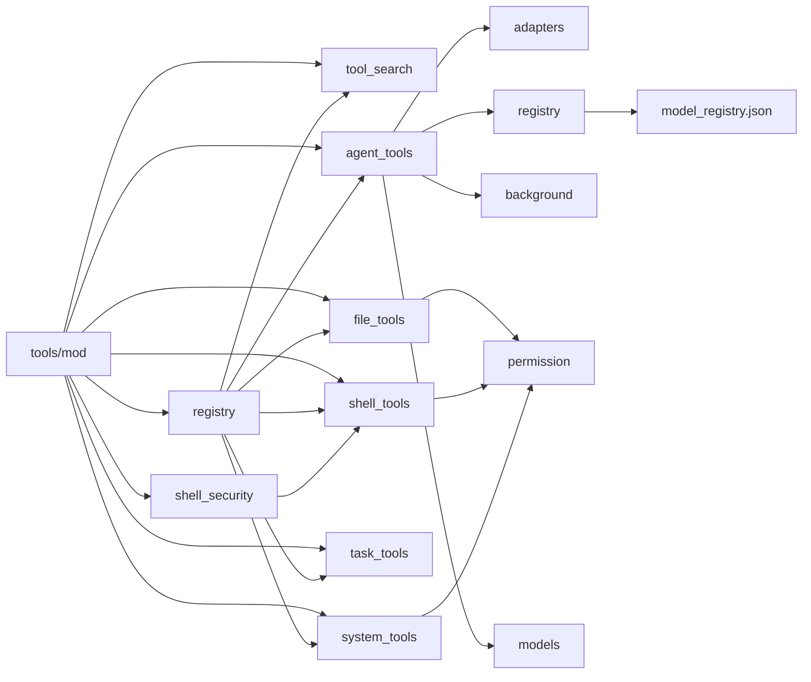

**图表来源**
- [src-tauri/src/core/tools/mod.rs:20-28](file://src-tauri/src/core/tools/mod.rs#L20-L28)
- [src-tauri/src/core/tools/registry.rs:47-62](file://src-tauri/src/core/tools/registry.rs#L47-L62)
- [src-tauri/src/core/registry.rs:54-66](file://src-tauri/src/core/registry.rs#L54-L66)

**章节来源**
- [src-tauri/src/core/tools/mod.rs:1-288](file://src-tauri/src/core/tools/mod.rs#L1-L288)
- [src-tauri/src/core/registry.rs:1-103](file://src-tauri/src/core/registry.rs#L1-L103)

## 性能考量
- 工具调用与流式处理
  - 子代理执行采用流式 SSE/JSON 解析，边解析边执行，降低内存峰值
  - 适配器对流式 JSON 进行容错修复，提升鲁棒性
- I/O 与快照
  - 文件写入/编辑自动备份与快照，避免频繁 IO；搜索限制输出数量防止超长输出
- 后台任务
  - 长周期任务统一走后台执行，避免阻塞主线程；任务类型与端口自动识别，便于前端联动
- 模型适配
  - 按模型能力选择合适参数，避免无效思考/温度设置带来的 token 浪费
- 工具搜索优化
  - 使用评分算法和截断机制，限制搜索结果数量，提升响应速度
- 安全检查优化
  - 正则表达式通过 OnceLock 懒初始化，全局只编译一次，提升性能

**章节来源**
- [src-tauri/src/core/tools/agent_tools.rs:316-526](file://src-tauri/src/core/tools/agent_tools.rs#L316-L526)
- [src-tauri/src/core/adapters.rs:42-62](file://src-tauri/src/core/adapters.rs#L42-L62)
- [src-tauri/src/core/background.rs:42-93](file://src-tauri/src/core/background.rs#L42-L93)
- [src-tauri/src/core/registry.rs:68-89](file://src-tauri/src/core/registry.rs#L68-L89)
- [src-tauri/src/core/tools/tool_search.rs:49-105](file://src-tauri/src/core/tools/tool_search.rs#L49-L105)
- [src-tauri/src/core/tools/shell_security.rs:34-200](file://src-tauri/src/core/tools/shell_security.rs#L34-L200)

## 故障排查指南
- 文件操作失败
  - 常见原因：文件被占用/权限不足/磁盘空间不足
  - 处理建议：检查文件锁、确认权限、释放空间；查看自动备份与快照定位问题
- Shell 命令失败
  - 常见原因：长周期命令阻塞、网络下载触发交互确认、沙箱路径越界、目录切换
  - 处理建议：改用 background_run；避免危险关键字；确认工作区限制
- Git 命令失败
  - 常见原因：使用了只读工具执行写操作参数
  - 处理建议：改用只读参数或外部 Git 客户端
- 子代理卡死/超限
  - 常见原因：循环次数超过阈值、工具参数解析失败
  - 处理建议：检查工具 Schema 与参数；缩短上下文；启用思考模式时注意 token 限制
- 权限拒绝
  - 常见原因：高风险命令/工作区变更
  - 处理建议：在前端确认权限；避免一次性执行大量高风险操作
- 工具搜索失败
  - 常见原因：查询语法错误、工具不存在、意图过滤
  - 处理建议：检查查询格式（select:工具名或关键词）、确认工具在当前意图下可用
- 安全拦截
  - 常见原因：危险命令、破坏性操作、路径越界
  - 处理建议：查看安全检查结果，修改命令或路径；必要时联系管理员

**章节来源**
- [src-tauri/src/core/tools/file_tools.rs:194-203](file://src-tauri/src/core/tools/file_tools.rs#L194-L203)
- [src-tauri/src/core/tools/shell_tools.rs:265-275](file://src-tauri/src/core/tools/shell_tools.rs#L265-L275)
- [src-tauri/src/core/tools/shell_tools.rs:356-376](file://src-tauri/src/core/tools/shell_tools.rs#L356-L376)
- [src-tauri/src/core/tools/agent_tools.rs:79-891](file://src-tauri/src/core/tools/agent_tools.rs#L79-L891)
- [src-tauri/src/core/tools/permission.rs:74-102](file://src-tauri/src/core/tools/permission.rs#L74-L102)
- [src-tauri/src/core/tools/tool_search.rs:125-165](file://src-tauri/src/core/tools/tool_search.rs#L125-L165)
- [src-tauri/src/core/tools/shell_security.rs:23-32](file://src-tauri/src/core/tools/shell_security.rs#L23-L32)

## 结论
本工具系统通过"入口路由 + 注册表 + 渐进式披露 + 域模块 + 安全框架 + 权限/适配/注册表/后台"的分层设计，实现了：
- 动态、可扩展的工具调用与延迟披露
- 标准化的 define_tools! 宏系统，统一工具注册流程
- 统一的工具注册表和元数据管理
- 智能的工具搜索和发现机制
- 新的 shell_security 安全框架，提供跨平台命令安全检查
- 强约束的安全沙箱与细粒度权限控制
- 高效的流式处理与后台任务执行
- 完整的文件变更审计与快照能力
- 与多厂商模型能力的无缝适配

新增的 define_tools! 宏系统和 shell_security 安全框架进一步增强了系统的标准化程度和安全性，通过渐进式披露机制优化了工具 Schema 的传输效率，为后续扩展自定义工具提供了清晰的接口与最佳实践。

## 附录

### 工具扩展接口与自定义工具开发指南
- 新增工具域模块
  - 在 tools 目录新增模块，导出 async 函数：pub async fn your_tool(app, input, session_id) -> String
  - 在 tools/mod.rs 中导入并加入 handle_tool_call_inner 的匹配分支
- 工具定义与 Schema
  - 使用 define_tools! 宏在工具实现文件中注册工具，包含 ToolDef 结构的所有元数据
  - 在 tools/mod.rs 的 get_tools_definition 中按意图返回工具 Schema；对需要延迟披露的工具，先返回简要定义，再在激活时返回完整 Schema
- 工具搜索集成
  - 在 ToolDef 中提供准确的 description 和 search_hint，提升搜索准确性
  - 合理设置 should_defer 标记，决定工具是否参与渐进式披露
- 安全框架集成
  - Shell 工具必须通过 shell_security 模块的安全检查
  - 所有文件/路径相关操作必须调用 ensure_path_permission；涉及高风险命令或工作区变更时，使用 request_permission
  - 沙箱会话中严格限制路径与命令范围
- 权限与安全
  - 所有文件/路径相关操作必须调用 ensure_path_permission；涉及高风险命令或工作区变更时，使用 request_permission
  - 沙箱会话中严格限制路径与命令范围
- 参数验证与错误处理
  - 对输入参数进行显式校验，返回明确的错误信息；对流式参数使用 parse_streamed_tool_input 进行容错修复
- 适配与注册表
  - 如需与多模型格式兼容，参考 adapters 的消息/工具转换逻辑；查询模型能力使用 registry 的 query_capabilities
- 后台任务
  - 长周期任务统一走 background_run；合理设置任务类型与端口，便于前端联动

**章节来源**
- [src-tauri/src/core/tools/mod.rs:183-288](file://src-tauri/src/core/tools/mod.rs#L183-L288)
- [src-tauri/src/core/tools/registry.rs:137-156](file://src-tauri/src/core/tools/registry.rs#L137-L156)
- [src-tauri/src/core/tools/tool_search.rs:167-198](file://src-tauri/src/core/tools/tool_search.rs#L167-L198)
- [src-tauri/src/core/tools/shell_security.rs:1-200](file://src-tauri/src/core/tools/shell_security.rs#L1-L200)
- [src-tauri/src/core/tools/permission.rs:49-102](file://src-tauri/src/core/tools/permission.rs#L49-L102)
- [src-tauri/src/core/adapters.rs:42-62](file://src-tauri/src/core/adapters.rs#L42-L62)
- [src-tauri/src/core/registry.rs:68-89](file://src-tauri/src/core/registry.rs#L68-L89)
- [src-tauri/src/core/background.rs:435-473](file://src-tauri/src/core/background.rs#L435-L473)