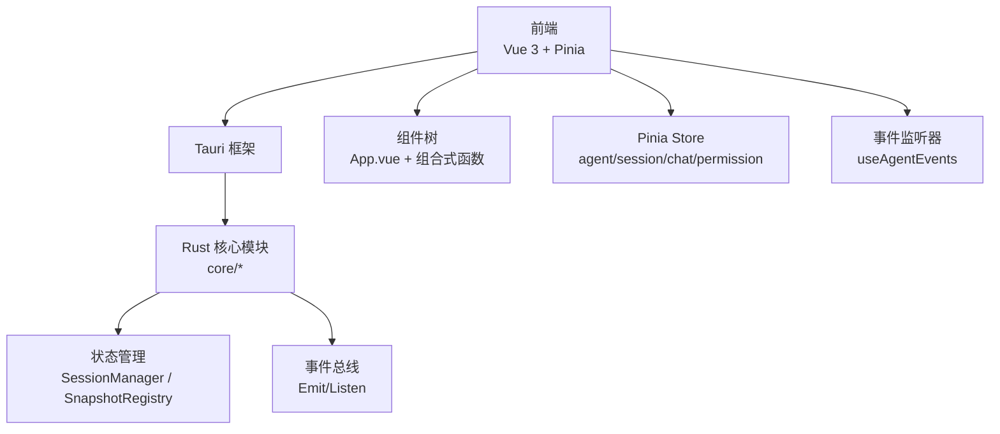
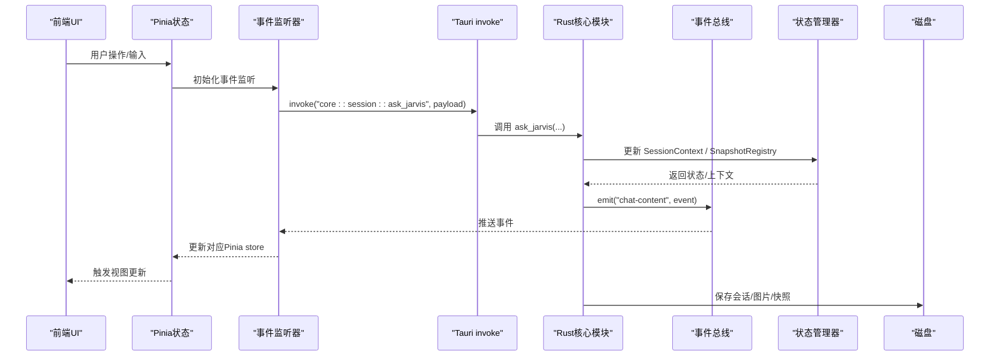
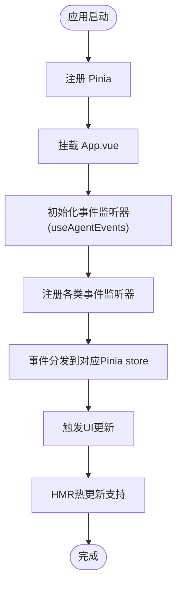
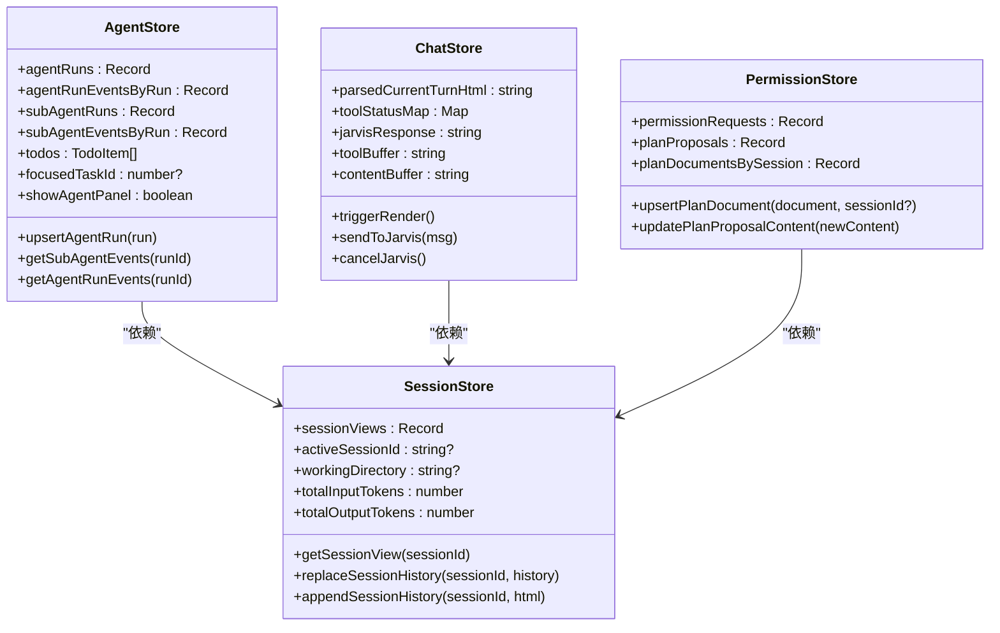
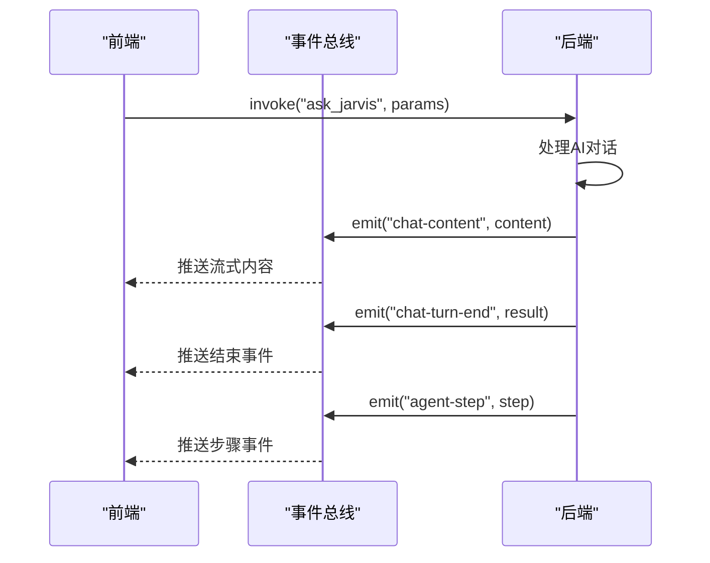
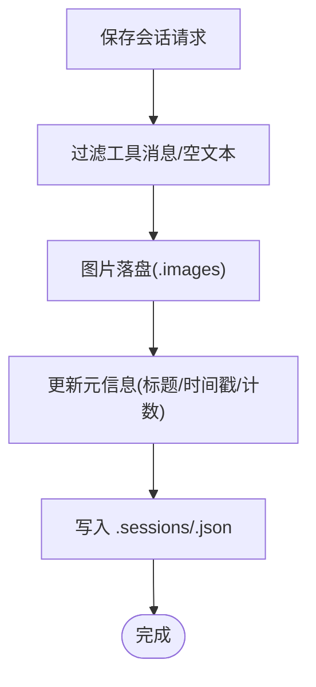
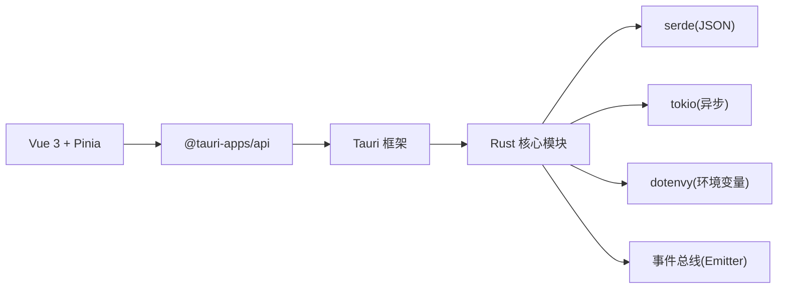

# 数据流架构

<cite>
**本文引用的文件**
- [README.md](file://README.md)
- [main.ts](file://src/main.ts)
- [App.vue](file://src/App.vue)
- [index.ts](file://src/types/index.ts)
- [lib.rs](file://src-tauri/src/lib.rs)
- [main.rs](file://src-tauri/src/main.rs)
- [state.rs](file://src-tauri/src/core/state.rs)
- [sessions.rs](file://src-tauri/src/core/sessions.rs)
- [models.rs](file://src-tauri/src/core/models.rs)
- [useAgentEvents.ts](file://src/composables/useAgentEvents.ts)
- [agent.ts](file://src/stores/agent.ts)
- [session.ts](file://src/stores/session.ts)
- [chat.ts](file://src/stores/chat.ts)
- [permission.ts](file://src/stores/permission.ts)
- [package.json](file://package.json)
</cite>

## 更新摘要
**变更内容**
- 新增前端事件架构：useAgentEvents组合式函数实现完整的事件监听和处理机制
- 新增多个Pinia store：agent、session、chat、permission状态管理
- 新增Rust后端事件集中处理：通过Emit机制实现事件驱动的后端处理
- 新增事件总线设计：统一的事件分发和订阅机制
- 新增消息传递协议：标准化的事件类型和数据结构

## 目录
1. [引言](#引言)
2. [项目结构](#项目结构)
3. [核心组件](#核心组件)
4. [架构总览](#架构总览)
5. [详细组件分析](#详细组件分析)
6. [依赖关系分析](#依赖关系分析)
7. [性能考量](#性能考量)
8. [故障排查指南](#故障排查指南)
9. [结论](#结论)
10. [附录](#附录)

## 引言
本文件面向数据流架构，系统性阐述事件驱动的数据流设计、状态管理模式、数据持久化策略与缓存机制；并覆盖前端状态管理（Vue Composables/Pinia）、后端状态同步、事件总线设计与消息传递协议。文档还解释数据序列化、版本兼容性、迁移策略以及性能优化要点，并提供数据流图、状态转换图与缓存策略图，帮助读者快速理解并高效扩展系统。

**更新** 本版本新增了完整的前端事件架构、Pinia store分发机制和Rust后端事件集中处理的设计与实现。

## 项目结构
项目采用"前端 Vue + 后端 Rust(Tauri)"双层架构，前端通过 Tauri 的 invoke 通道与后端命令交互，后端以模块化方式组织核心业务（会话、快照、子代理、工具等），并通过状态管理器在内存中维护会话上下文，同时持久化到磁盘。新增的事件架构通过统一的事件总线实现前后端的实时通信。

**图表来源**
- [lib.rs:88-184](file://src-tauri/src/lib.rs#L88-L184)
- [main.ts:1-9](file://src/main.ts#L1-L9)
- [App.vue:1-35](file://src/App.vue#L1-L35)
- [useAgentEvents.ts:66-550](file://src/composables/useAgentEvents.ts#L66-L550)

**章节来源**
- [README.md:107-160](file://README.md#L107-L160)
- [lib.rs:88-184](file://src-tauri/src/lib.rs#L88-L184)
- [main.ts:1-9](file://src/main.ts#L1-L9)
- [App.vue:1-35](file://src/App.vue#L1-L35)

## 核心组件
- 前端状态与事件
  - 使用 Pinia 进行全局状态管理，配合组合式函数（如 useTheme）管理 UI 状态。
  - 事件监听由 useAgentEvents 初始化，负责订阅后端事件并驱动 UI 更新。
  - 新增多个专门的 Pinia store：agent（代理运行状态）、session（会话视图状态）、chat（聊天渲染状态）、permission（权限和计划状态）。
- 后端状态与命令
  - 通过 manage 注入多个状态管理器（会话、快照、配置、后台任务、子代理监控）。
  - 通过 generate_handler 注册大量 invoke 命令，覆盖会话、权限、历史、快照、沙盒、合并等。
  - 通过 Emitter 接口实现事件集中处理，统一向前端推送状态变更。
- 数据模型与序列化
  - 前后端共享消息、计划、步骤、会话等模型定义，统一 JSON 序列化。
- 持久化与缓存
  - 会话与图片缓存落地磁盘；图片以文件形式存储，消息体按规则过滤后保存，降低体积。

**更新** 新增了完整的事件架构和多个Pinia store的状态管理机制。

**章节来源**
- [main.ts:1-9](file://src/main.ts#L1-L9)
- [App.vue:1-35](file://src/App.vue#L1-L35)
- [lib.rs:88-184](file://src-tauri/src/lib.rs#L88-L184)
- [index.ts:1-371](file://src/types/index.ts#L1-L371)
- [models.rs:1-256](file://src-tauri/src/core/models.rs#L1-L256)
- [sessions.rs:218-364](file://src-tauri/src/core/sessions.rs#L218-L364)

## 架构总览
下图展示了从前端事件到后端命令处理、状态更新与持久化的整体数据流，包括新增的事件架构和Pinia store分发机制。

**图表来源**
- [lib.rs:102-182](file://src-tauri/src/lib.rs#L102-L182)
- [sessions.rs:218-364](file://src-tauri/src/core/sessions.rs#L218-L364)
- [state.rs:44-77](file://src-tauri/src/core/state.rs#L44-L77)
- [useAgentEvents.ts:201-539](file://src/composables/useAgentEvents.ts#L201-L539)

## 详细组件分析

### 前端事件架构与Pinia Store分发机制
- **事件监听器**：useAgentEvents组合式函数负责初始化所有事件监听器，包括权限请求、计划提案、代理运行、聊天流式输出等事件。
- **Pinia Store分发**：每个事件类型都有对应的Pinia store进行状态更新，实现事件驱动的状态管理。
- **HMR支持**：事件监听器具有热模块替换（HMR）支持，自动清理旧监听器并重新注册。
- **事件类型覆盖**：包括todos、permission、plan proposal、agent run、chat流式事件、checkpoint等完整事件体系。

**图表来源**
- [main.ts:1-9](file://src/main.ts#L1-L9)
- [App.vue:1-35](file://src/App.vue#L1-L35)
- [useAgentEvents.ts:66-550](file://src/composables/useAgentEvents.ts#L66-L550)

**章节来源**
- [main.ts:1-9](file://src/main.ts#L1-L9)
- [App.vue:1-35](file://src/App.vue#L1-L35)
- [useAgentEvents.ts:66-550](file://src/composables/useAgentEvents.ts#L66-L550)

### 多个Pinia Store的状态管理
- **agent store**：管理代理运行状态、事件历史、子代理运行等，提供计算属性和操作方法。
- **session store**：管理会话视图状态，包括消息缓冲区、思考缓冲区、工具缓冲区等。
- **chat store**：管理聊天渲染状态，包括增量渲染、工具状态行、历史消息等。
- **permission store**：管理权限请求和计划文档状态，支持权限决策和计划提案。

**图表来源**
- [agent.ts:12-95](file://src/stores/agent.ts#L12-L95)
- [session.ts:60-171](file://src/stores/session.ts#L60-L171)
- [chat.ts:66-724](file://src/stores/chat.ts#L66-L724)
- [permission.ts:6-66](file://src/stores/permission.ts#L6-L66)

**章节来源**
- [agent.ts:12-95](file://src/stores/agent.ts#L12-L95)
- [session.ts:60-171](file://src/stores/session.ts#L60-L171)
- [chat.ts:66-724](file://src/stores/chat.ts#L66-L724)
- [permission.ts:6-66](file://src/stores/permission.ts#L6-L66)

### 后端事件集中处理与消息传递协议
- **事件集中处理**：Rust后端通过Emitter接口实现事件集中处理，统一向前端推送状态变更。
- **权限事件**：权限请求通过"permission-request"事件推送，支持会话级别的权限控制。
- **计划事件**：计划提案通过"plan-proposal"和"plan-document-updated"事件处理。
- **代理事件**：代理运行状态通过"agent-run-updated"、"agent-run-event"事件推送。
- **聊天事件**：聊天流式输出通过"chat-turn-start"、"chat-content"、"chat-thinking"等事件处理。
- **子代理事件**：子代理运行状态通过"subagent-updated"、"subagent-event"事件推送。

**图表来源**
- [lib.rs:152-224](file://src-tauri/src/lib.rs#L152-L224)
- [useAgentEvents.ts:234-420](file://src/composables/useAgentEvents.ts#L234-L420)

**章节来源**
- [lib.rs:152-224](file://src-tauri/src/lib.rs#L152-L224)
- [useAgentEvents.ts:234-420](file://src/composables/useAgentEvents.ts#L234-L420)

### 数据持久化策略
- 会话持久化：保存时过滤工具消息与空文本，仅保留用户输入与助手文本；图片以文件形式存储，消息体中仅保留文件名；标题自动生成与智能命名策略结合。
- 图片缓存：图片以 Base64 解码后写入 .images 目录，文件名包含会话 ID 与随机后缀，便于清理与隔离。
- 其他数据：.tasks/.plans/.transcripts 等目录用于任务、方案与转录的持久化，遵循一致的命名与组织规范。

**图表来源**
- [sessions.rs:218-364](file://src-tauri/src/core/sessions.rs#L218-L364)

**章节来源**
- [sessions.rs:218-364](file://src-tauri/src/core/sessions.rs#L218-L364)
- [README.md:257-274](file://README.md#L257-L274)

### 缓存机制与版本兼容
- 前端缓存：localStorage 存储主题偏好等轻量状态，避免每次启动重新计算。
- 后端缓存：SessionContext 在内存中缓存会话上下文与工作目录，减少重复 IO；SnapshotRegistry 通过会话级注册表管理快照树。
- 版本兼容与迁移：配置与会话数据采用 JSON 序列化，字段默认值与可选字段设计确保向前兼容；README 描述了多预设与自动迁移能力，建议在新增字段时保持向后兼容策略。

**章节来源**
- [sessions.rs:191-216](file://src-tauri/src/core/sessions.rs#L191-L216)
- [state.rs:44-77](file://src-tauri/src/core/state.rs#L44-L77)
- [README.md:72-83](file://README.md#L72-L83)

## 依赖关系分析
- 前端依赖
  - Vue 3 + Pinia：状态管理与响应式 UI。
  - @tauri-apps/api 与插件：文件系统、对话框、打开器等系统能力。
  - 新增事件处理依赖：@tauri-apps/api/event用于事件监听。
- 后端依赖
  - Tauri 2.0：桌面应用框架与 invoke 通道。
  - tokio：异步运行时，RwLock/Mutex 提供并发安全。
  - serde：JSON 序列化与反序列化。
  - dotenvy：环境变量加载。

**图表来源**
- [package.json:12-27](file://package.json#L12-L27)
- [lib.rs:57-86](file://src-tauri/src/lib.rs#L57-L86)

**章节来源**
- [package.json:12-27](file://package.json#L12-L27)
- [lib.rs:57-86](file://src-tauri/src/lib.rs#L57-L86)

## 性能考量
- 前端
  - 使用组合式函数与 Pinia 管理局部状态，避免全局风暴；事件驱动渲染，仅在必要时更新 UI。
  - 图片以文件形式缓存，避免在 JSON 中携带大块二进制数据，降低序列化与传输成本。
  - 新增事件监听器的HMR支持，避免重复注册导致的性能问题。
  - Pinia store的计算属性优化，减少不必要的状态更新。
- 后端
  - 会话保存时过滤冗余消息，显著降低文件体积与 IO 压力。
  - 使用 RwLock/Mutex 提供并发安全，避免不必要的阻塞；对热点数据（最近会话）进行内存缓存。
  - 异步运行时（Tokio）支撑高并发请求与流式处理。
  - 事件总线的集中处理，减少重复的事件推送。

## 故障排查指南
- 会话加载失败
  - 检查 .sessions/<id>.json 是否存在且可解析；确认 last_active_session 文件是否指向有效会话。
- 图片无法显示
  - 检查 .images 目录是否存在对应文件；确认消息体中的文件名与实际文件一致。
- 主题切换无效
  - 检查 localStorage 中 darkMode 键值；确认 useTheme 的 onMounted 初始化逻辑是否执行。
- 命令调用超时
  - 检查后端命令注册是否正确；确认 invoke 调用参数与后端期望一致；查看日志定位阻塞点。
- 事件监听失效
  - 检查useAgentEvents的初始化是否成功；确认事件监听器是否正确注册。
- Pinia store状态不同步
  - 检查事件是否正确分发到对应store；确认store的计算属性是否正确更新。

**章节来源**
- [sessions.rs:366-377](file://src-tauri/src/core/sessions.rs#L366-L377)
- [sessions.rs:42-53](file://src-tauri/src/core/sessions.rs#L42-L53)
- [main.ts:1-9](file://src/main.ts#L1-L9)
- [lib.rs:102-182](file://src-tauri/src/lib.rs#L102-L182)
- [useAgentEvents.ts:201-539](file://src/composables/useAgentEvents.ts#L201-L539)

## 结论
本项目通过事件驱动的数据流设计，将前端 UI 与后端 Rust 核心模块解耦：前端以组合式函数与 Pinia 管理状态与事件，后端以模块化与状态管理器实现高并发与可扩展性。新增的事件架构通过统一的事件总线实现前后端的实时通信，多个Pinia store提供了细粒度的状态管理。会话与图片的持久化策略兼顾性能与可维护性，统一的消息协议与类型定义确保前后端协作顺畅。建议在后续迭代中持续完善版本兼容与迁移策略，强化错误监控与可观测性，进一步提升系统的稳定性与可扩展性。

## 附录
- 关键文件索引
  - 前端入口与状态：[main.ts:1-9](file://src/main.ts#L1-L9)、[App.vue:1-35](file://src/App.vue#L1-L35)
  - 前端事件架构：[useAgentEvents.ts:66-550](file://src/composables/useAgentEvents.ts#L66-L550)
  - 前端Pinia store：[agent.ts:12-95](file://src/stores/agent.ts#L12-L95)、[session.ts:60-171](file://src/stores/session.ts#L60-L171)、[chat.ts:66-724](file://src/stores/chat.ts#L66-L724)、[permission.ts:6-66](file://src/stores/permission.ts#L6-L66)
  - 后端入口与命令注册：[lib.rs:57-228](file://src-tauri/src/lib.rs#L57-L228)、[main.rs:1-7](file://src-tauri/src/main.rs#L1-L7)
  - 状态管理与会话：[state.rs:44-77](file://src-tauri/src/core/state.rs#L44-L77)、[sessions.rs:191-364](file://src-tauri/src/core/sessions.rs#L191-L364)
  - 数据模型与序列化：[models.rs:1-256](file://src-tauri/src/core/models.rs#L1-L256)、[index.ts:1-371](file://src/types/index.ts#L1-L371)
  - 依赖与脚本：[package.json:1-29](file://package.json#L1-L29)