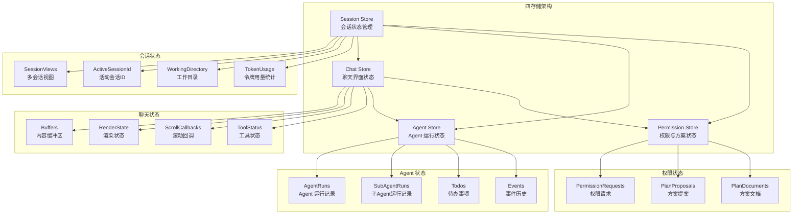
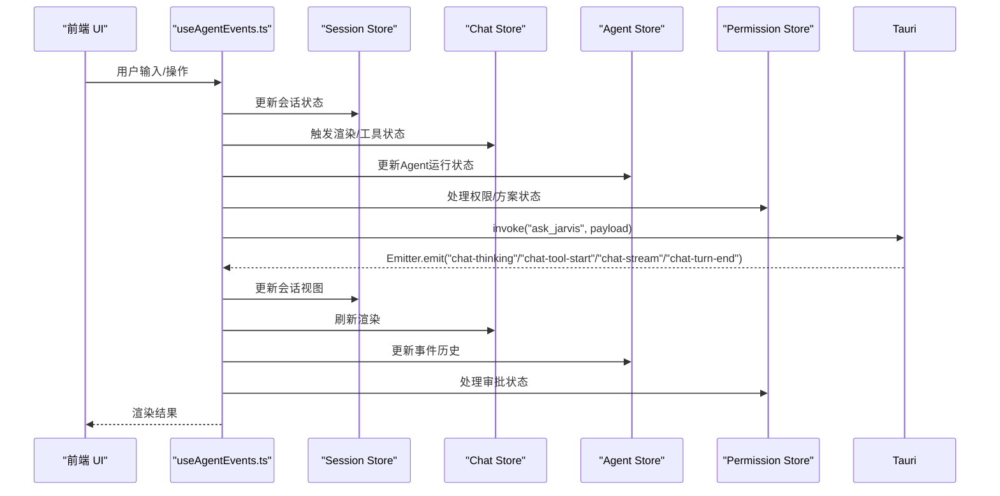
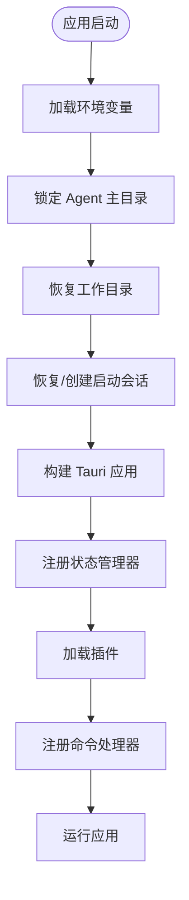
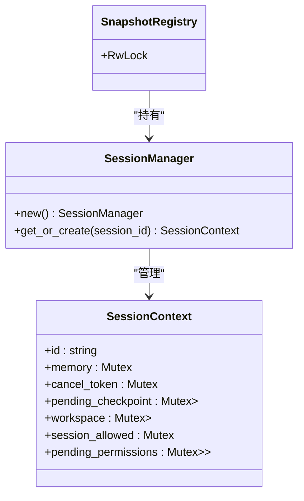
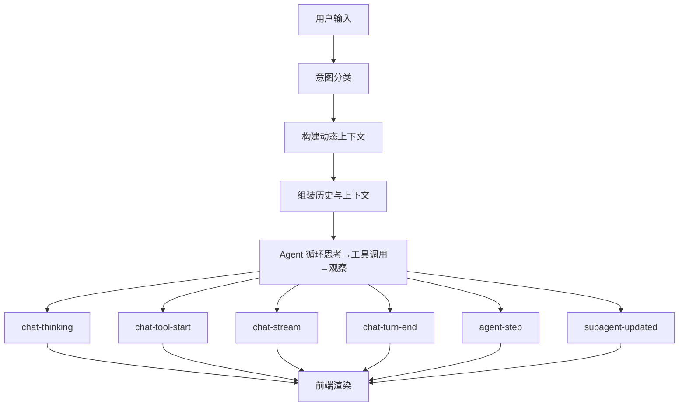
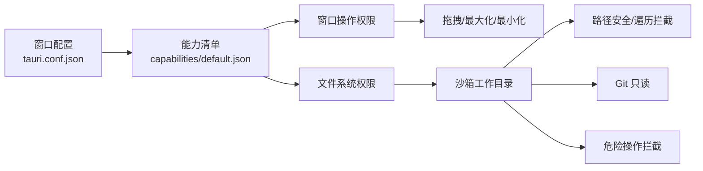
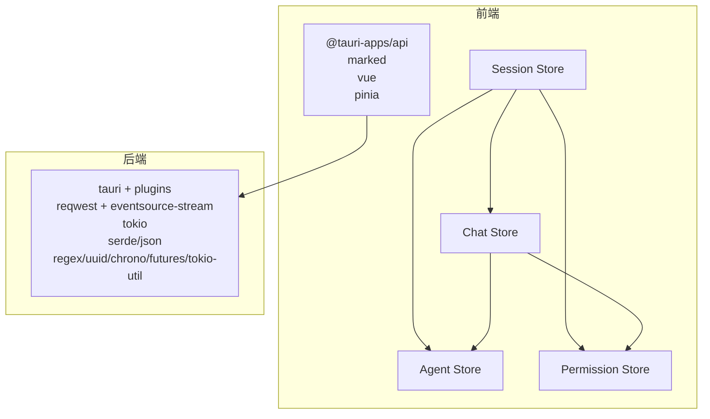

# 整体架构

<cite>
**本文引用的文件**
- [README.md](file://README.md)
- [package.json](file://package.json)
- [src-tauri/Cargo.toml](file://src-tauri/Cargo.toml)
- [src-tauri/tauri.conf.json](file://src-tauri/tauri.conf.json)
- [src-tauri/src/main.rs](file://src-tauri/src/main.rs)
- [src-tauri/src/lib.rs](file://src-tauri/src/lib.rs)
- [src-tauri/src/core/mod.rs](file://src-tauri/src/core/mod.rs)
- [src-tauri/src/core/state.rs](file://src-tauri/src/core/state.rs)
- [src-tauri/src/core/agent.rs](file://src-tauri/src/core/agent.rs)
- [src/App.vue](file://src/App.vue)
- [src/main.ts](file://src/main.ts)
- [src/composables/useAgentEvents.ts](file://src/composables/useAgentEvents.ts)
- [src/stores/session.ts](file://src/stores/session.ts)
- [src/stores/chat.ts](file://src/stores/chat.ts)
- [src/stores/agent.ts](file://src/stores/agent.ts)
- [src/stores/permission.ts](file://src/stores/permission.ts)
- [src/types/index.ts](file://src/types/index.ts)
- [src-tauri/model_registry.json](file://src-tauri/model_registry.json)
- [src-tauri/capabilities/default.json](file://src-tauri/capabilities/default.json)
</cite>

## 更新摘要
**变更内容**
- 更新了四存储架构设计，详细说明 session/chat/agent/permission 四个 Pinia store 的职责划分
- 新增了存储层架构图，展示四个 store 之间的交互关系
- 更新了前端状态管理架构，反映从单体到四存储的演进
- 增强了组件间通信机制的说明，包括 store 间的依赖关系

## 目录
1. [简介](#简介)
2. [项目结构](#项目结构)
3. [核心组件](#核心组件)
4. [架构总览](#架构总览)
5. [四存储架构设计](#四存储架构设计)
6. [详细组件分析](#详细组件分析)
7. [依赖关系分析](#依赖关系-analysis)
8. [性能考量](#性能考量)
9. [故障排查指南](#故障排查指南)
10. [结论](#结论)
11. [附录](#附录)

## 简介
本项目是一个基于 Tauri 2.0 + Vue 3 + Rust 的混合桌面应用，围绕"AI 编程助手"场景构建，提供多模型支持、深度思考模式、意图识别、工具集、子代理委派、方案审批、会话持久化、记忆系统、沙箱工作目录与权限审批等能力。前端采用 Vue 3 + TypeScript，后端以 Rust + Tokio 异步运行时实现，通过 Tauri 的命令通道进行前后端通信，结合能力清单与窗口配置实现安全可控的桌面体验。

## 项目结构
项目采用"前端 Vue + 后端 Rust + Tauri 集成"的分层组织方式：
- 前端 src：Vue 3 应用，包含组件、组合式逻辑、类型定义、服务等
- 后端 src-tauri：Rust 应用，包含核心业务模块、状态管理、命令注册、工具集、快照引擎等
- 配置：package.json、Cargo.toml、tauri.conf.json、capabilities 等

```mermaid
graph TB
subgraph "前端"
FE_App["src/App.vue"]
FE_Main["src/main.ts"]
FE_Composable["src/composables/useAgentEvents.ts"]
FE_Types["src/types/index.ts"]
FE_Session["src/stores/session.ts"]
FE_Chat["src/stores/chat.ts"]
FE_Agent["src/stores/agent.ts"]
FE_Permission["src/stores/permission.ts"]
end
subgraph "Tauri 框架"
Tauri_Config["src-tauri/tauri.conf.json"]
Cap_Default["src-tauri/capabilities/default.json"]
end
subgraph "后端 Rust"
RS_Lib["src-tauri/src/lib.rs"]
RS_Core_Mod["src-tauri/src/core/mod.rs"]
RS_State["src-tauri/src/core/state.rs"]
RS_Agent["src-tauri/src/core/agent.rs"]
RS_Main["src-tauri/src/main.rs"]
RS_Cargo["src-tauri/Cargo.toml"]
end
FE_Main --> FE_App
FE_App --> FE_Composable
FE_Composable --> FE_Types
FE_App <- --> RS_Lib
FE_Composable <- --> RS_Lib
FE_Session --> FE_Chat
FE_Session --> FE_Agent
FE_Session --> FE_Permission
FE_Chat --> FE_Agent
FE_Chat --> FE_Permission
RS_Main --> RS_Lib
RS_Lib --> RS_Core_Mod
RS_Core_Mod --> RS_State
RS_Core_Mod --> RS_Agent
Tauri_Config --> RS_Lib
Cap_Default --> RS_Lib
RS_Cargo --> RS_Lib
```

**图表来源**
- [src-tauri/src/lib.rs:57-185](file://src-tauri/src/lib.rs#L57-L185)
- [src-tauri/src/main.rs:4-6](file://src-tauri/src/main.rs#L4-L6)
- [src-tauri/src/core/mod.rs:1-60](file://src-tauri/src/core/mod.rs#L1-L60)
- [src-tauri/src/core/state.rs:43-77](file://src-tauri/src/core/state.rs#L43-L77)
- [src-tauri/src/core/agent.rs:1-200](file://src-tauri/src/core/agent.rs#L1-L200)
- [src-tauri/tauri.conf.json:1-40](file://src-tauri/tauri.conf.json#L1-L40)
- [src-tauri/capabilities/default.json:1-18](file://src-tauri/capabilities/default.json#L1-L18)
- [src-tauri/Cargo.toml:1-41](file://src-tauri/Cargo.toml#L1-L41)
- [src/main.ts:1-6](file://src/main.ts#L1-L6)
- [src/App.vue:1-82](file://src/App.vue#L1-L82)
- [src/composables/useAgentEvents.ts:620-800](file://src/composables/useAgentEvents.ts#L620-L800)
- [src/types/index.ts:1-365](file://src/types/index.ts#L1-L365)

**章节来源**
- [README.md:107-160](file://README.md#L107-L160)
- [src-tauri/tauri.conf.json:1-40](file://src-tauri/tauri.conf.json#L1-L40)
- [src-tauri/src/lib.rs:57-185](file://src-tauri/src/lib.rs#L57-L185)

## 核心组件
- 前端应用与状态
  - 应用入口与布局：src/main.ts、src/App.vue
  - 会话与交互：src/composables/useAgentEvents.ts（事件监听、流式渲染、权限/方案/运行状态聚合）
  - 类型定义：src/types/index.ts（会话、工具、快照、沙箱、合并等类型）
  - **四存储架构**：src/stores/session.ts、src/stores/chat.ts、src/stores/agent.ts、src/stores/permission.ts
- 后端核心与状态
  - 应用入口与命令注册：src-tauri/src/lib.rs（状态管理器注册、命令绑定、插件加载）
  - 核心模块导出：src-tauri/src/core/mod.rs（agent、commands、sessions、snapshot、tools 等）
  - 会话状态与上下文：src-tauri/src/core/state.rs（SessionManager、SessionContext、SnapshotRegistry 等）
  - Agent 循环与动态上下文：src-tauri/src/core/agent.rs（意图分类、上下文注入、流式事件）
- 配置与能力
  - Tauri 配置：src-tauri/tauri.conf.json（窗口尺寸、透明装饰、开发/构建 URL、安全策略）
  - 能力清单：src-tauri/capabilities/default.json（窗口、对话框、文件系统等权限）
  - 模型注册表：src-tauri/model_registry.json（多模型能力与参数）

**章节来源**
- [src/main.ts:1-6](file://src/main.ts#L1-L6)
- [src/App.vue:1-82](file://src/App.vue#L1-L82)
- [src/composables/useAgentEvents.ts:620-800](file://src/composables/useAgentEvents.ts#L620-L800)
- [src/types/index.ts:1-365](file://src/types/index.ts#L1-L365)
- [src-tauri/src/lib.rs:57-185](file://src-tauri/src/lib.rs#L57-L185)
- [src-tauri/src/core/mod.rs:1-60](file://src-tauri/src/core/mod.rs#L1-L60)
- [src-tauri/src/core/state.rs:43-77](file://src-tauri/src/core/state.rs#L43-L77)
- [src-tauri/src/core/agent.rs:1-200](file://src-tauri/src/core/agent.rs#L1-L200)
- [src-tauri/tauri.conf.json:1-40](file://src-tauri/tauri.conf.json#L1-L40)
- [src-tauri/capabilities/default.json:1-18](file://src-tauri/capabilities/default.json#L1-L18)
- [src-tauri/model_registry.json:1-496](file://src-tauri/model_registry.json#L1-L496)

## 架构总览
整体采用"主进程（Rust）+ 渲染进程（Vue）+ 插件与能力"的混合架构：
- 主进程负责：状态管理、命令处理、I/O、安全校验、模型适配、快照与检查点、子代理调度
- 渲染进程负责：UI 呈现、事件订阅、流式渲染、用户交互、设置与预设管理
- 通信机制：Tauri invoke/emit 通道，前端通过 @tauri-apps/api 调用后端命令，后端通过 Emitter 发布事件
- 安全机制：能力清单（capabilities）、沙箱工作目录、权限审批、循环检测、危险操作拦截

```mermaid
graph TB
subgraph "渲染进程Vue"
UI["App.vue<br/>组件与布局"]
CJ["useAgentEvents.ts<br/>事件监听/渲染/状态聚合"]
Types["types/index.ts<br/>类型定义"]
Stores["四存储架构<br/>session/chat/agent/permission"]
end
subgraph "Tauri 框架"
Config["tauri.conf.json<br/>窗口/安全/构建"]
Cap["capabilities/default.json<br/>权限能力"]
end
subgraph "主进程Rust"
Lib["lib.rs<br/>应用入口/状态注册/命令绑定"]
CoreMod["core/mod.rs<br/>模块导出"]
State["core/state.rs<br/>会话/快照/工作区状态"]
Agent["core/agent.rs<br/>Agent 循环/上下文/流式事件"]
end
UI <- --> Lib
CJ <- --> Lib
Types --> CJ
Stores --> CJ
Config --> Lib
Cap --> Lib
Lib --> CoreMod
CoreMod --> State
CoreMod --> Agent
```

**图表来源**
- [src/App.vue:1-82](file://src/App.vue#L1-L82)
- [src/composables/useAgentEvents.ts:620-800](file://src/composables/useAgentEvents.ts#L620-L800)
- [src/types/index.ts:1-365](file://src/types/index.ts#L1-L365)
- [src-tauri/tauri.conf.json:1-40](file://src-tauri/tauri.conf.json#L1-L40)
- [src-tauri/capabilities/default.json:1-18](file://src-tauri/capabilities/default.json#L1-L18)
- [src-tauri/src/lib.rs:57-185](file://src-tauri/src/lib.rs#L57-L185)
- [src-tauri/src/core/mod.rs:1-60](file://src-tauri/src/core/mod.rs#L1-L60)
- [src-tauri/src/core/state.rs:43-77](file://src-tauri/src/core/state.rs#L43-L77)
- [src-tauri/src/core/agent.rs:1-200](file://src-tauri/src/core/agent.rs#L1-L200)

## 四存储架构设计

### 存储层架构概览
项目采用四存储架构，将前端状态管理拆分为四个独立的 Pinia store，每个 store 负责特定领域的状态管理：



**图表来源**
- [src/stores/session.ts:60-170](file://src/stores/session.ts#L60-L170)
- [src/stores/chat.ts:66-723](file://src/stores/chat.ts#L66-L723)
- [src/stores/agent.ts:12-94](file://src/stores/agent.ts#L12-L94)
- [src/stores/permission.ts:6-65](file://src/stores/permission.ts#L6-L65)

### Session Store（会话状态管理）
负责管理所有会话相关的状态，包括会话视图、工作目录、令牌用量统计等。

**核心职责**：
- 多会话视图管理：支持多个并行会话的状态隔离
- 会话生命周期：创建、激活、删除、清理
- 工作目录管理：会话绑定的工作目录状态
- 令牌用量统计：会话级别的输入输出令牌统计

**关键数据结构**：
- `sessionViews`: Record<string, SessionViewState> - 存储所有会话的视图状态
- `activeSessionId`: string | null - 当前激活的会话ID
- `workingDirectory`: string | null - 会话绑定的工作目录
- `totalInputTokens`/`totalOutputTokens`: number - 会话令牌用量统计

### Chat Store（聊天界面状态）
负责聊天界面的渲染状态和用户交互，与 Session Store 密切协作。

**核心职责**：
- 流式渲染：Markdown 渲染、增量渲染优化
- 用户交互：消息发送、权限审批、方案确认
- 工具状态：工具调用状态跟踪
- 撤回编辑：消息撤回和编辑功能

**关键功能**：
- `triggerRender()`: 渲染触发器，使用 requestAnimationFrame 节流
- `sendToJarvis()`: 主要的消息发送函数
- `resolvePermission()`: 权限请求处理
- `resolvePlan()`: 方案提案处理

### Agent Store（Agent 运行状态）
负责 Agent 执行过程中的状态管理，包括主 Agent 和子 Agent 的运行记录。

**核心职责**：
- Agent 运行记录：主 Agent 和子 Agent 的执行历史
- 事件管理：Agent 运行事件的收集和排序
- 任务管理：待办事项的跟踪和管理
- 面板控制：Agent 执行面板的显示控制

**关键计算属性**：
- `currentAgentRuns()`: 当前会话的 Agent 运行记录
- `currentSubAgentRuns()`: 当前会话的子 Agent 运行记录
- `activeSubAgentRuns()`: 正在运行的子 Agent
- `interruptedAgentRuns()`: 可恢复的中断 Agent

### Permission Store（权限与方案状态）
负责权限审批和方案管理的状态，与会话状态紧密关联。

**核心职责**：
- 权限请求：用户权限审批请求的管理
- 方案提案：AI 方案的生成和审批流程
- 方案文档：方案文档的版本管理和状态跟踪
- 会话关联：权限状态与会话ID的关联

**关键功能**：
- `permissionRequest`: 当前会话的权限请求
- `planProposal`: 当前会话的方案提案
- `upsertPlanDocument()`: 方案文档的更新和插入
- `updatePlanProposalContent()`: 方案内容的动态更新

**章节来源**
- [src/stores/session.ts:60-170](file://src/stores/session.ts#L60-L170)
- [src/stores/chat.ts:66-723](file://src/stores/chat.ts#L66-L723)
- [src/stores/agent.ts:12-94](file://src/stores/agent.ts#L12-L94)
- [src/stores/permission.ts:6-65](file://src/stores/permission.ts#L6-L65)

## 详细组件分析

### 前端：useAgentEvents 组合式逻辑
- 职责
  - 订阅后端事件（权限请求、方案提案、Agent 运行、子代理事件、流式输出等）
  - 管理会话视图状态（消息、工具缓冲、思考缓冲、当前回合步骤）
  - 渲染 Markdown、令牌用量统计、工具状态行、决策链详情
  - 与 Tauri 交互：invoke 调用命令（如 ask_jarvis、会话管理、快照、沙箱、合并等）
- 关键流程
  - 事件监听：listen("permission-request"/"plan-proposal"/"agent-run-event"/"chat-*"/"agent-step"/"subagent-updated")
  - 流式渲染：requestAnimationFrame 节流刷新，拼接思考/工具/内容缓冲
  - 会话视图：多会话状态隔离，按会话键管理历史与步骤
- 与后端契约
  - 通过 @tauri-apps/api.invoke 调用后端命令
  - 通过 @tauri-apps/api.listen 订阅后端事件



**图表来源**
- [src/composables/useAgentEvents.ts:620-800](file://src/composables/useAgentEvents.ts#L620-L800)
- [src-tauri/src/lib.rs:102-182](file://src-tauri/src/lib.rs#L102-L182)
- [src-tauri/src/core/agent.rs:1-200](file://src-tauri/src/core/agent.rs#L1-L200)

**章节来源**
- [src/composables/useAgentEvents.ts:620-800](file://src/composables/useAgentEvents.ts#L620-L800)
- [src/types/index.ts:1-365](file://src/types/index.ts#L1-L365)

### 后端：lib.rs 应用入口与命令注册
- 职责
  - 初始化环境变量、锁定 Agent 主目录、恢复工作目录与会话
  - 构建 Tauri 应用，注册状态管理器（会话、后台任务、子代理监控、配置、工作区、快照注册表）
  - 加载官方插件（opener、dialog、fs、window-state）
  - 注册 invoke 命令（AI 对话、权限、会话、历史、检查点、快照、沙箱、合并、模型注册表等）
- 与前端契约
  - 前端通过 invoke 调用上述命令
  - 后端通过 Emitter 发布事件，前端通过 listen 订阅



**图表来源**
- [src-tauri/src/lib.rs:57-185](file://src-tauri/src/lib.rs#L57-L185)

**章节来源**
- [src-tauri/src/lib.rs:57-185](file://src-tauri/src/lib.rs#L57-L185)

### 核心模块与状态：state.rs 与 core/mod.rs
- SessionManager：维护活跃会话的 SessionContext，支持并发安全的读写
- SessionContext：包含会话内存、取消令牌、待处理检查点、工作区、权限通道等
- SnapshotRegistry：会话级快照注册表，配合快照引擎与管理器
- core/mod.rs：统一导出命令与状态，便于 lib.rs 聚合注册



**图表来源**
- [src-tauri/src/core/state.rs:43-77](file://src-tauri/src/core/state.rs#L43-L77)

**章节来源**
- [src-tauri/src/core/state.rs:1-78](file://src-tauri/src/core/state.rs#L1-L78)
- [src-tauri/src/core/mod.rs:1-60](file://src-tauri/src/core/mod.rs#L1-L60)

### Agent 循环与动态上下文：agent.rs
- 动态上下文构建：根据意图（聊天/记忆查询/项目操作）注入全局记忆、项目映射、技能列表、沙箱提示等
- 用户消息注入：支持文本与多模态（图片 Base64/文件路径）混合内容
- 流式事件：chat-thinking、chat-tool-start、chat-stream、chat-turn-end、agent-step、subagent-updated 等
- 与前端协作：通过 Emitter 发布事件，前端监听并渲染



**图表来源**
- [src-tauri/src/core/agent.rs:17-85](file://src-tauri/src/core/agent.rs#L17-L85)
- [src/composables/useAgentEvents.ts:679-790](file://src/composables/useAgentEvents.ts#L679-L790)

**章节来源**
- [src-tauri/src/core/agent.rs:1-200](file://src-tauri/src/core/agent.rs#L1-L200)
- [src/composables/useAgentEvents.ts:679-790](file://src/composables/useAgentEvents.ts#L679-L790)

### 窗口管理与安全沙箱
- 窗口配置：透明装饰、最小尺寸、初始尺寸、开发/构建 URL
- 能力清单：限制窗口操作、对话框打开、文件系统读取等权限
- 沙箱工作目录：会话绑定工作目录，路径遍历拦截，Git 只读，危险指令拦截，循环检测



**图表来源**
- [src-tauri/tauri.conf.json:13-27](file://src-tauri/tauri.conf.json#L13-L27)
- [src-tauri/capabilities/default.json:6-16](file://src-tauri/capabilities/default.json#L6-L16)

**章节来源**
- [src-tauri/tauri.conf.json:1-40](file://src-tauri/tauri.conf.json#L1-L40)
- [src-tauri/capabilities/default.json:1-18](file://src-tauri/capabilities/default.json#L1-L18)
- [README.md:235-243](file://README.md#L235-L243)

## 依赖关系分析
- 前端依赖
  - @tauri-apps/api：与后端命令通道交互
  - marked：Markdown 渲染
  - vue：响应式 UI
  - pinia：状态管理（四个 store）
- 后端依赖
  - tauri、tauri-plugin-*：窗口、对话框、文件系统、窗口状态
  - reqwest + eventsource-stream：SSE 流式 API 调用
  - tokio：异步运行时
  - serde/json：序列化
  - regex、uuid、chrono、futures-util、tokio-util：工具与辅助



**图表来源**
- [package.json:12-26](file://package.json#L12-L26)
- [src-tauri/Cargo.toml:20-39](file://src-tauri/Cargo.toml#L20-L39)

**章节来源**
- [package.json:1-28](file://package.json#L1-L28)
- [src-tauri/Cargo.toml:1-41](file://src-tauri/Cargo.toml#L1-L41)

## 性能考量
- 异步与流式
  - 后端使用 Tokio 异步运行时与 SSE 流式事件，降低延迟，提升交互体验
- 渲染节流
  - 前端使用 requestAnimationFrame 对流式渲染进行节流，避免频繁重绘
- 会话与状态
  - 会话状态按需加载与清理，减少内存占用
- 资源与缓存
  - 图片缓存与会话级工作区，避免重复 IO
- 构建与打包
  - Vite 提供快速热更新，Tauri 打包跨平台
- **四存储架构优化**
  - 状态隔离：四个 store 各自管理特定领域状态，避免状态耦合
  - 计算属性：使用 Vue computed 优化渲染性能
  - 按需更新：store 间通过依赖关系进行精确的状态更新

## 故障排查指南
- 事件未到达
  - 检查前端是否正确监听事件（listen），后端是否正确 emit
  - 参考：useAgentEvents.ts 的事件监听与 agent.rs 的事件发布
- 命令调用失败
  - 检查命令是否在 lib.rs 的 generate_handler 中注册
  - 参考：src-tauri/src/lib.rs 命令注册段落
- 权限被拒
  - 检查 capabilities/default.json 是否包含所需权限
  - 参考：src-tauri/capabilities/default.json
- 沙箱限制导致操作失败
  - 确认会话工作目录与路径合法性，避免路径遍历
  - 参考：README.md 安全特性与 agent.rs 的上下文注入
- 模型不可用
  - 检查 model_registry.json 中模型能力与参数配置
  - 参考：src-tauri/model_registry.json
- **四存储架构问题**
  - 检查 store 间的依赖关系是否正确
  - 确认 computed 属性的依赖是否完整
  - 验证事件监听器是否正确处理会话切换

**章节来源**
- [src/composables/useAgentEvents.ts:620-800](file://src/composables/useAgentEvents.ts#L620-L800)
- [src-tauri/src/lib.rs:102-182](file://src-tauri/src/lib.rs#L102-L182)
- [src-tauri/capabilities/default.json:1-18](file://src-tauri/capabilities/default.json#L1-L18)
- [src-tauri/model_registry.json:1-496](file://src-tauri/model_registry.json#L1-L496)
- [README.md:235-243](file://README.md#L235-L243)

## 结论
本项目通过 Tauri 2.0 将 Vue 3 前端与 Rust 后端有机结合，形成高安全、强扩展、可演进的桌面应用架构。主进程专注状态、安全与业务逻辑，渲染进程专注 UI 与交互，二者通过命令与事件通道协同。能力清单与沙箱机制保障了系统边界与安全性；异步流式与前端节流提升了性能与体验。

**重大架构演进**：
- 从单体状态管理到四存储架构的演进，实现了状态的清晰分离和职责单一化
- Session Store 作为核心枢纽，协调 Chat、Agent、Permission 三个功能存储
- 通过精确的 store 间依赖关系，实现了高效的响应式状态管理
- 四存储架构为未来的功能扩展提供了良好的基础

整体架构在可维护性、可移植性与安全性之间取得良好平衡，四存储架构的设计进一步提升了系统的模块化程度和可维护性。

## 附录
- 技术选型理由
  - Tauri 2.0：Rust 后端 + 轻量前端，兼顾性能与生态
  - Vue 3 + TypeScript：响应式与类型安全
  - Rust + Tokio：异步与内存安全
  - Reqwest + SSE：流式 API 调用，兼容多模型格式
  - **Pinia + 四存储架构**：模块化状态管理，职责清晰分离
- 架构权衡与约束
  - 权衡：性能 vs 安全（沙箱与能力清单）、功能丰富度 vs 复杂度、状态管理 vs 开发效率
  - 约束：跨平台打包、模型接口差异、前端渲染与后端状态一致性、store 间依赖管理
- **四存储架构优势**
  - **职责分离**：每个 store 专注于特定领域，降低复杂度
  - **状态隔离**：避免状态耦合，提高系统稳定性
  - **性能优化**：精确的状态更新，减少不必要的渲染
  - **可扩展性**：清晰的架构为新功能提供良好基础