# 架构设计

<cite>
**本文引用的文件**
- [README.md](file://README.md)
- [package.json](file://package.json)
- [src-tauri/Cargo.toml](file://src-tauri/Cargo.toml)
- [src-tauri/tauri.conf.json](file://src-tauri/tauri.conf.json)
- [src/main.ts](file://src/main.ts)
- [src/App.vue](file://src/App.vue)
- [src/composables/useJarvis.ts](file://src/composables/useJarvis.ts)
- [src/types/index.ts](file://src/types/index.ts)
- [src-tauri/src/main.rs](file://src-tauri/src/main.rs)
- [src-tauri/src/lib.rs](file://src-tauri/src/lib.rs)
- [src-tauri/src/core/mod.rs](file://src-tauri/src/core/mod.rs)
- [src-tauri/src/core/agent.rs](file://src-tauri/src/core/agent.rs)
- [src-tauri/src/core/subagents.rs](file://src-tauri/src/core/subagents.rs)
- [src-tauri/src/core/tools/mod.rs](file://src-tauri/src/core/tools/mod.rs)
- [src-tauri/src/core/memory.rs](file://src-tauri/src/core/memory.rs)
- [src-tauri/model_registry.json](file://src-tauri/model_registry.json)
- [src/components/chat/ChatArea.vue](file://src/components/chat/ChatArea.vue)
- [src/components/chat/AgentPanel.vue](file://src/components/chat/AgentPanel.vue)
- [src/stores/agent.ts](file://src/stores/agent.ts)
- [src/stores/chat.ts](file://src/stores/chat.ts)
- [src/stores/permission.ts](file://src/stores/permission.ts)
- [src/stores/session.ts](file://src/stores/session.ts)
- [src-tauri/src/core/traits.rs](file://src-tauri/src/core/traits.rs)
- [src-tauri/src/core/providers/openai.rs](file://src-tauri/src/core/providers/openai.rs)
- [src-tauri/src/core/llm/adapters.rs](file://src-tauri/src/core/llm/adapters.rs)
- [src-tauri/src/core/llm/api_client.rs](file://src-tauri/src/core/llm/api_client.rs)
- [src-tauri/src/core/snapshot_engine/mod.rs](file://src-tauri/src/core/snapshot_engine/mod.rs)
- [src-tauri/src/core/snapshot_engine/snapshot.rs](file://src-tauri/src/core/snapshot_engine/snapshot.rs)
- [src-tauri/src/core/snapshot_engine/multi_agent/mod.rs](file://src-tauri/src/core/snapshot_engine/multi_agent/mod.rs)
</cite>

## 更新摘要
**变更内容**
- 新增 Pinia 四存储架构详解，包括 Agent、Chat、Session、Permission 四大存储模块
- 完善 Agent 管线详细流程，涵盖意图分类、工具调用、流式响应的完整循环
- 新增 LlmProvider 抽象层设计，统一 OpenAI/Anthropic API 格式适配
- 重构快照引擎架构，包含快照树、分支管理、补丁应用与多代理沙箱合并

## 目录
1. [引言](#引言)
2. [项目结构](#项目结构)
3. [核心组件](#核心组件)
4. [架构总览](#架构总览)
5. [Pinia 四存储架构](#pinia-四存储架构)
6. [Agent 管线详细流程](#agent-管线详细流程)
7. [LlmProvider 抽象层](#llmprovider-抽象层)
8. [快照引擎架构](#快照引擎架构)
9. [详细组件分析](#详细组件分析)
10. [依赖分析](#依赖分析)
11. [性能考虑](#性能考虑)
12. [故障排查指南](#故障排查指南)
13. [结论](#结论)
14. [附录](#附录)

## 引言
本文件面向 JarvisAgent 的架构设计文档，聚焦以下目标：
- 描述前后端分离与 Tauri 桌面框架集成方式
- 解释 Vue 3 + Rust 的混合架构模式
- 详述 Pinia 四存储架构的设计理念与数据流
- 完整的 Agent 循环架构（意图分类 → 工具调用 → 流式响应）
- LlmProvider 抽象层统一不同供应商 API 格式
- 快照引擎的分支管理与多代理协作机制
- 子代理委派机制、方案审批流程与上下文管理系统
- 组件间交互关系、数据流向与事件驱动机制
- 系统边界、技术决策、约束条件与跨领域关注点（安全、监控、灾难恢复）

## 项目结构
JarvisAgent 采用典型的"前端 Vue 3 + 后端 Rust + Tauri 桌面桥接"的混合架构，并引入了现代化的状态管理：
- 前端层：Vue 3 单页应用，负责 UI、事件监听与渲染，集成 Pinia 四存储架构
- 后端层：Rust + Tokio 异步运行时，负责 Agent 循环、工具调用、快照与会话管理
- 桥接层：Tauri 提供命令注册与事件广播，前端通过 invoke/listen 与后端通信
- 状态管理层：Pinia Store 统一管理应用状态，实现前端数据流的模块化

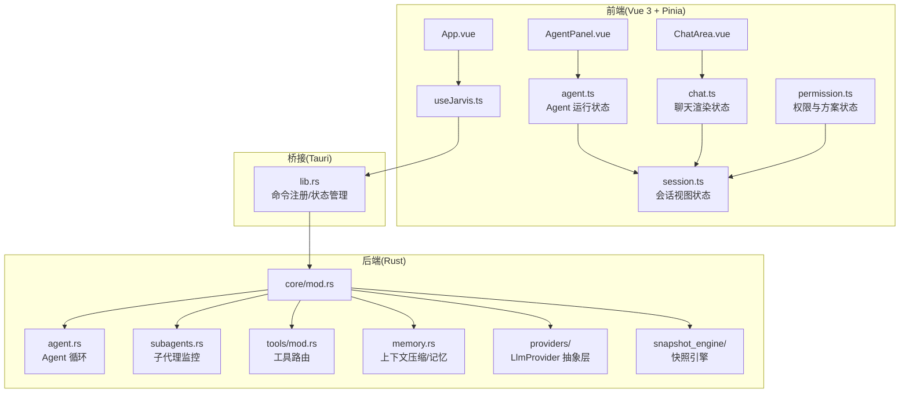

**图表来源**
- [src-tauri/src/lib.rs:88-185](file://src-tauri/src/lib.rs#L88-L185)
- [src-tauri/src/core/mod.rs:1-60](file://src-tauri/src/core/mod.rs#L1-L60)
- [src-tauri/src/core/agent.rs:1-200](file://src-tauri/src/core/agent.rs#L1-L200)
- [src-tauri/src/core/subagents.rs:1-200](file://src-tauri/src/core/subagents.rs#L1-L200)
- [src-tauri/src/core/tools/mod.rs:1-454](file://src-tauri/src/core/tools/mod.rs#L1-L454)
- [src-tauri/src/core/memory.rs:1-200](file://src-tauri/src/core/memory.rs#L1-L200)
- [src-tauri/src/core/llm/adapters.rs:1-259](file://src-tauri/src/core/llm/adapters.rs#L1-L259)
- [src-tauri/src/core/snapshot_engine/snapshot.rs:1-425](file://src-tauri/src/core/snapshot_engine/snapshot.rs#L1-L425)
- [src/App.vue:1-276](file://src/App.vue#L1-L276)
- [src/composables/useJarvis.ts:620-800](file://src/composables/useJarvis.ts#L620-L800)
- [src/components/chat/ChatArea.vue:1-200](file://src/components/chat/ChatArea.vue#L1-L200)
- [src/components/chat/AgentPanel.vue:1-200](file://src/components/chat/AgentPanel.vue#L1-L200)
- [src/stores/agent.ts:1-95](file://src/stores/agent.ts#L1-L95)
- [src/stores/chat.ts:1-724](file://src/stores/chat.ts#L1-L724)
- [src/stores/session.ts:1-171](file://src/stores/session.ts#L1-L171)
- [src/stores/permission.ts:1-66](file://src/stores/permission.ts#L1-L66)

**章节来源**
- [README.md:107-160](file://README.md#L107-L160)
- [src-tauri/tauri.conf.json:1-40](file://src-tauri/tauri.conf.json#L1-L40)
- [src-tauri/src/lib.rs:57-185](file://src-tauri/src/lib.rs#L57-L185)

## 核心组件
- 前端应用与状态管理
  - App.vue：布局与状态指示器，承载聊天区、输入区、侧边栏与设置面板
  - useJarvis.ts：核心交互逻辑，封装 Tauri 事件监听、会话视图、渲染与滚动控制
  - ChatArea.vue：对话渲染、右键菜单、撤回与检查点联动
  - AgentPanel.vue：Agent 步骤、子代理运行与事件可视化
  - Pinia 四存储：Agent、Chat、Session、Permission 四大状态模块协同工作
- 后端核心模块
  - agent.rs：Agent 循环、意图分类、动态上下文构建、流式输出
  - subagents.rs：子代理生命周期、状态机与事件广播
  - tools/mod.rs：工具定义、路由分发与安全校验
  - memory.rs：上下文压缩、自动摘要与转录归档
  - LlmProvider 抽象层：统一 OpenAI/Anthropic API 格式适配
  - 快照引擎：分支管理、补丁应用、多代理协作
  - model_registry.json：模型能力注册表，统一 OpenAI/Anthropic 格式
- 桥接层
  - lib.rs：Tauri Builder 初始化、状态管理器注入、命令注册
  - main.rs：应用入口

**章节来源**
- [src/App.vue:1-276](file://src/App.vue#L1-L276)
- [src/composables/useJarvis.ts:1-800](file://src/composables/useJarvis.ts#L1-L800)
- [src/components/chat/ChatArea.vue:1-200](file://src/components/chat/ChatArea.vue#L1-L200)
- [src/components/chat/AgentPanel.vue:1-200](file://src/components/chat/AgentPanel.vue#L1-L200)
- [src-tauri/src/core/agent.rs:1-200](file://src-tauri/src/core/agent.rs#L1-L200)
- [src-tauri/src/core/subagents.rs:1-200](file://src-tauri/src/core/subagents.rs#L1-L200)
- [src-tauri/src/core/tools/mod.rs:1-454](file://src-tauri/src/core/tools/mod.rs#L1-L454)
- [src-tauri/src/core/memory.rs:1-200](file://src-tauri/src/core/memory.rs#L1-L200)
- [src-tauri/src/core/llm/adapters.rs:1-259](file://src-tauri/src/core/llm/adapters.rs#L1-L259)
- [src-tauri/src/core/snapshot_engine/snapshot.rs:1-425](file://src-tauri/src/core/snapshot_engine/snapshot.rs#L1-L425)
- [src-tauri/src/lib.rs:57-185](file://src-tauri/src/lib.rs#L57-L185)
- [src-tauri/src/main.rs:1-7](file://src-tauri/src/main.rs#L1-L7)

## 架构总览
JarvisAgent 的系统边界清晰：前端负责用户交互与可视化，后端负责业务闭环与系统能力。二者通过 Tauri 的 invoke/listen 实现事件驱动的松耦合通信。新增的 Pinia 四存储架构为前端提供了模块化的状态管理，确保复杂业务场景下的数据一致性。

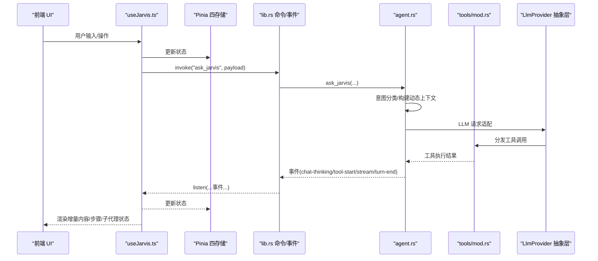

**图表来源**
- [src/composables/useJarvis.ts:620-800](file://src/composables/useJarvis.ts#L620-L800)
- [src/stores/agent.ts:1-95](file://src/stores/agent.ts#L1-L95)
- [src/stores/chat.ts:1-724](file://src/stores/chat.ts#L1-L724)
- [src-tauri/src/lib.rs:102-182](file://src-tauri/src/lib.rs#L102-L182)
- [src-tauri/src/core/agent.rs:1-200](file://src-tauri/src/core/agent.rs#L1-L200)
- [src-tauri/src/core/tools/mod.rs:381-454](file://src-tauri/src/core/tools/mod.rs#L381-L454)
- [src-tauri/src/core/llm/adapters.rs:84-259](file://src-tauri/src/core/llm/adapters.rs#L84-L259)

## Pinia 四存储架构

### 存储模块概览
JarvisAgent 采用 Pinia 四存储架构，将应用状态分为四个相互协作的模块：

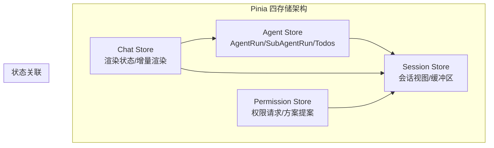

**图表来源**
- [src/stores/agent.ts:12-95](file://src/stores/agent.ts#L12-L95)
- [src/stores/chat.ts:66-724](file://src/stores/chat.ts#L66-L724)
- [src/stores/session.ts:60-171](file://src/stores/session.ts#L60-L171)
- [src/stores/permission.ts:6-66](file://src/stores/permission.ts#L6-L66)

### Agent Store（Agent 运行状态）
管理 Agent 和子代理的运行状态，包括：
- AgentRun：主 Agent 运行实例，跟踪状态、时间戳、可恢复性
- SubAgentRun：子代理运行实例，支持并发执行与状态同步
- Todos：待办事项列表，支持任务焦点管理
- 计算属性：基于会话状态过滤当前运行的 Agent 和子代理

**章节来源**
- [src/stores/agent.ts:12-95](file://src/stores/agent.ts#L12-L95)

### Chat Store（聊天渲染状态）
负责聊天界面的渲染状态管理：
- 增量渲染缓冲区：contentBuffer、tempBuffer、toolBuffer、thinkingBuffer
- Markdown 渲染优化：节流渲染、增量缓存、工具状态行管理
- 会话历史：messages 数组与 HTML 片段的维护
- 事件处理：权限请求、方案提案、工具状态更新

**章节来源**
- [src/stores/chat.ts:66-724](file://src/stores/chat.ts#L66-L724)

### Session Store（会话视图状态）
管理会话级别的状态：
- SessionViewState：完整的会话视图状态，包括运行状态、消息历史、缓冲区
- 多会话支持：通过 sessionId 索引多个会话视图
- 状态计算：当前会话、运行状态检测、令牌使用统计
- 工作目录：项目工作空间的路径管理

**章节来源**
- [src/stores/session.ts:60-171](file://src/stores/session.ts#L60-L171)

### Permission Store（权限与方案状态）
处理权限请求和方案提案：
- 权限请求：跨会话的权限审批流程
- 方案提案：复杂任务的方案生成与审批
- 方案文档：按会话组织的方案文档管理
- 内容更新：动态更新方案内容与状态

**章节来源**
- [src/stores/permission.ts:6-66](file://src/stores/permission.ts#L6-L66)

## Agent 管线详细流程

### Agent 循环架构
Agent 管线包含完整的意图分类、工具调用、流式响应循环：

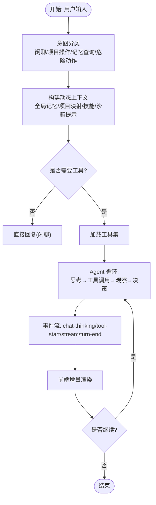

**图表来源**
- [src-tauri/src/core/agent.rs:17-85](file://src-tauri/src/core/agent.rs#L17-L85)
- [src-tauri/src/core/tools/mod.rs:89-379](file://src-tauri/src/core/tools/mod.rs#L89-L379)
- [src/composables/useJarvis.ts:696-778](file://src/composables/useJarvis.ts#L696-L778)

### 子代理委派机制
主代理负责规划与委派，子代理在独立上下文中运行：

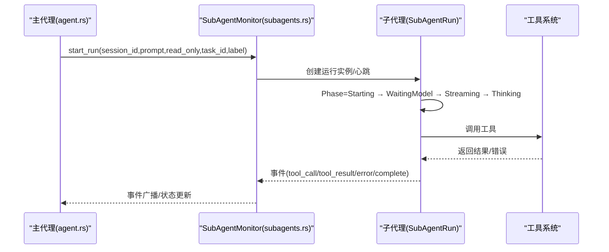

**图表来源**
- [src-tauri/src/core/subagents.rs:116-177](file://src-tauri/src/core/subagents.rs#L116-L177)
- [src-tauri/src/core/tools/mod.rs:381-454](file://src-tauri/src/core/tools/mod.rs#L381-L454)
- [src-tauri/src/core/agent.rs:1-200](file://src-tauri/src/core/agent.rs#L1-L200)

### 方案审批流程
复杂任务必须先提交方案（propose_plan），前端弹出预览面板：

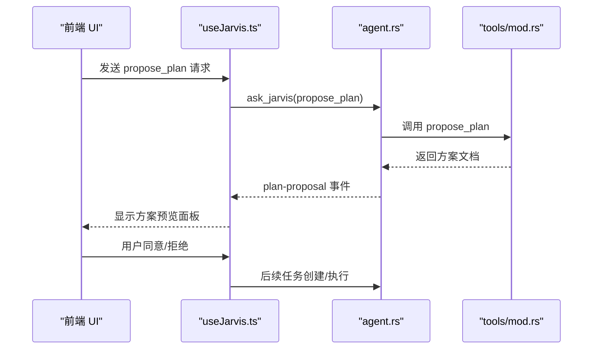

**图表来源**
- [src-tauri/src/core/tools/mod.rs:354-364](file://src-tauri/src/core/tools/mod.rs#L354-L364)
- [src/composables/useJarvis.ts:634-653](file://src/composables/useJarvis.ts#L634-L653)

**章节来源**
- [README.md:162-207](file://README.md#L162-L207)
- [src-tauri/src/core/agent.rs:1-200](file://src-tauri/src/core/agent.rs#L1-L200)
- [src-tauri/src/core/tools/mod.rs:1-454](file://src-tauri/src/core/tools/mod.rs#L1-L454)

## LlmProvider 抽象层

### 抽象接口设计
LlmProvider 抽象层统一了不同 LLM 供应商的 API 差异：

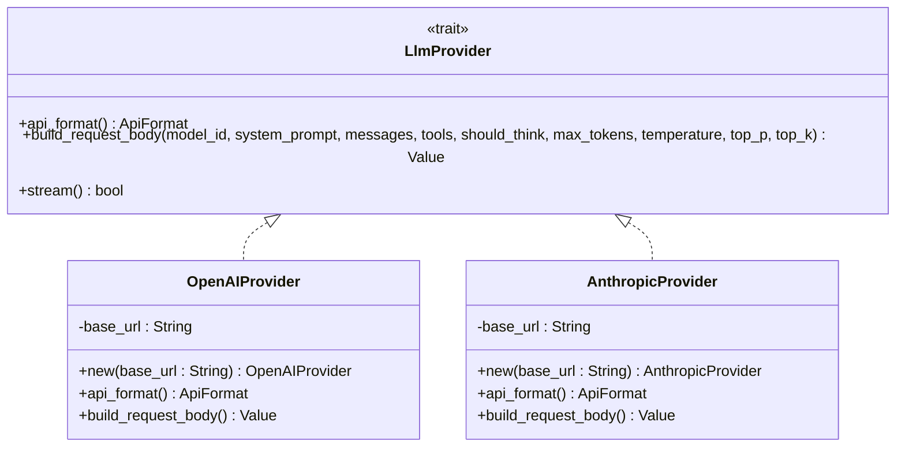

**图表来源**
- [src-tauri/src/core/traits.rs:8-29](file://src-tauri/src/core/traits.rs#L8-L29)
- [src-tauri/src/core/providers/openai.rs:13-21](file://src-tauri/src/core/providers/openai.rs#L13-L21)

### API 格式适配
通过适配器模式处理不同供应商的消息格式转换：

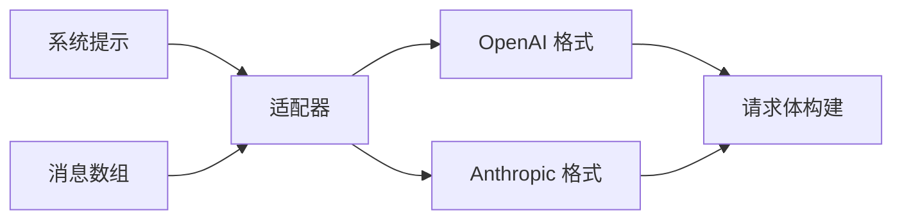

**图表来源**
- [src-tauri/src/core/llm/adapters.rs:84-259](file://src-tauri/src/core/llm/adapters.rs#L84-L259)
- [src-tauri/src/core/llm/api_client.rs:118-139](file://src-tauri/src/core/llm/api_client.rs#L118-L139)

### 重试机制与错误处理
API 客户端实现了智能重试机制：

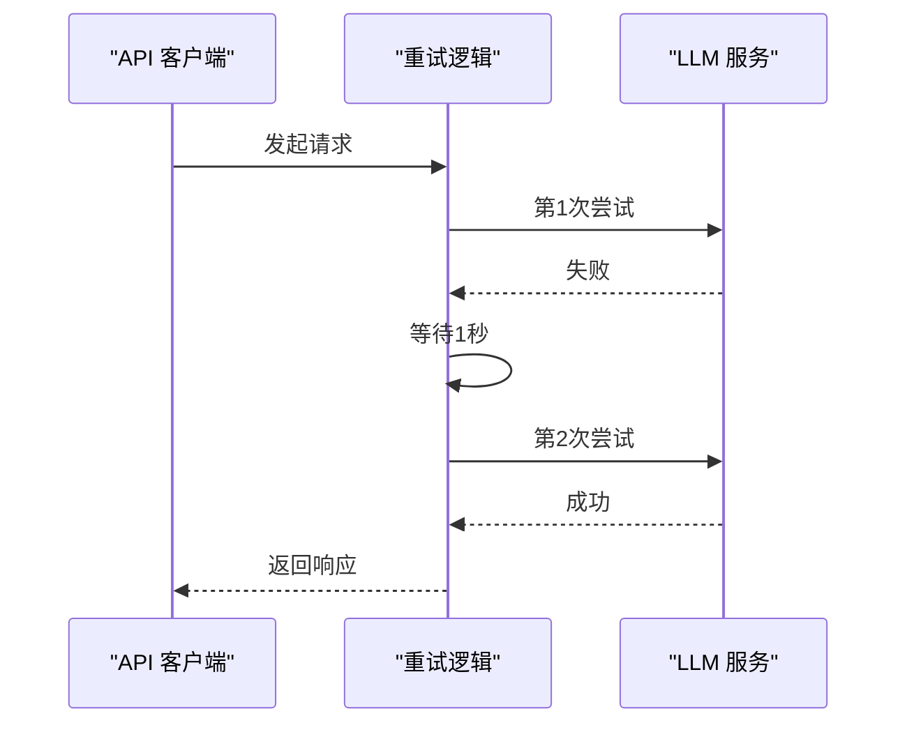

**图表来源**
- [src-tauri/src/core/llm/api_client.rs:11-89](file://src-tauri/src/core/llm/api_client.rs#L11-L89)

**章节来源**
- [src-tauri/src/core/traits.rs:1-41](file://src-tauri/src/core/traits.rs#L1-L41)
- [src-tauri/src/core/providers/openai.rs:1-49](file://src-tauri/src/core/providers/openai.rs#L1-L49)
- [src-tauri/src/core/llm/adapters.rs:1-259](file://src-tauri/src/core/llm/adapters.rs#L1-L259)
- [src-tauri/src/core/llm/api_client.rs:1-189](file://src-tauri/src/core/llm/api_client.rs#L1-L189)

## 快照引擎架构

### 快照树与分支管理
快照引擎提供了完整的版本控制能力：

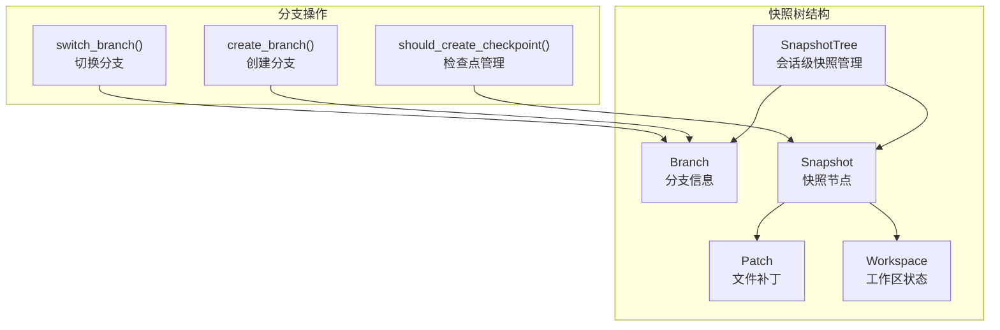

**图表来源**
- [src-tauri/src/core/snapshot_engine/snapshot.rs:38-425](file://src-tauri/src/core/snapshot_engine/snapshot.rs#L38-L425)
- [src-tauri/src/core/snapshot_engine/mod.rs:1-14](file://src-tauri/src/core/snapshot_engine/mod.rs#L1-L14)

### 补丁应用与回滚机制
支持多种类型的文件操作补丁：

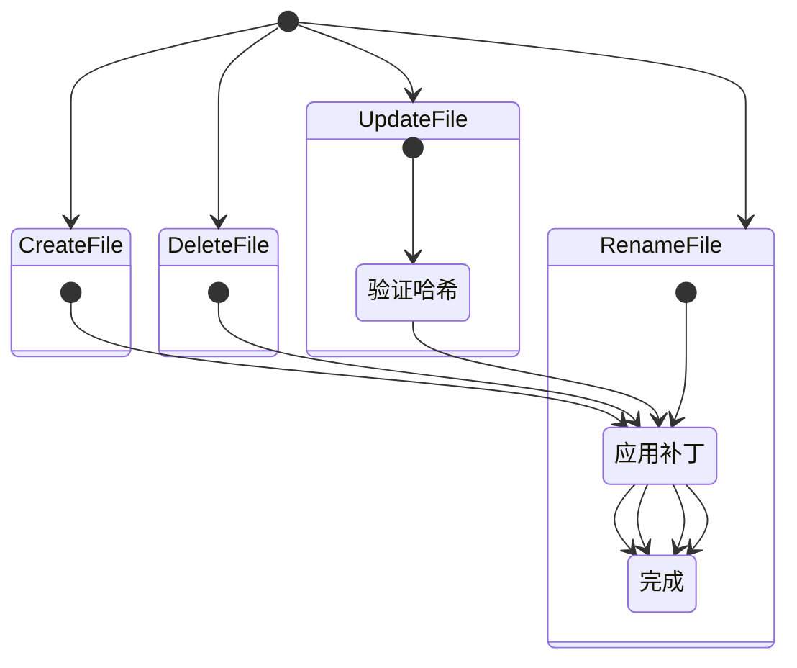

**图表来源**
- [src-tauri/src/core/snapshot_engine/snapshot.rs:108-178](file://src-tauri/src/core/snapshot_engine/snapshot.rs#L108-L178)

### 多代理沙箱合并
支持多代理之间的协作与冲突解决：

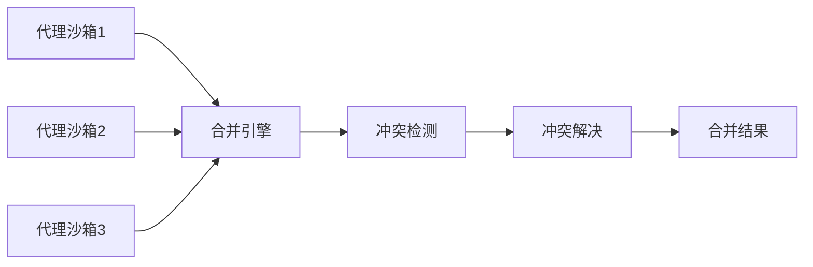

**图表来源**
- [src-tauri/src/core/snapshot_engine/multi_agent/mod.rs:1-6](file://src-tauri/src/core/snapshot_engine/multi_agent/mod.rs#L1-L6)
- [src-tauri/src/core/snapshot_engine/snapshot.rs:194-321](file://src-tauri/src/core/snapshot_engine/snapshot.rs#L194-L321)

**章节来源**
- [src-tauri/src/core/snapshot_engine/snapshot.rs:1-425](file://src-tauri/src/core/snapshot_engine/snapshot.rs#L1-L425)
- [src-tauri/src/core/snapshot_engine/mod.rs:1-14](file://src-tauri/src/core/snapshot_engine/mod.rs#L1-L14)
- [src-tauri/src/core/snapshot_engine/multi_agent/mod.rs:1-6](file://src-tauri/src/core/snapshot_engine/multi_agent/mod.rs#L1-L6)

## 详细组件分析

### 上下文管理系统
自动压缩与手动压缩相结合：

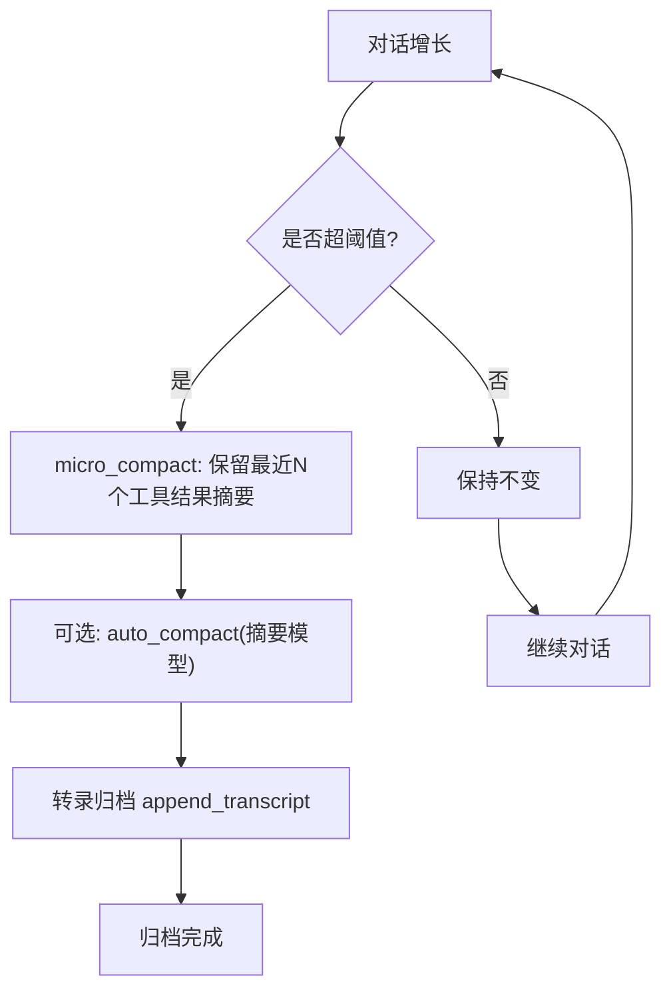

**图表来源**
- [src-tauri/src/core/memory.rs:48-87](file://src-tauri/src/core/memory.rs#L48-L87)
- [src-tauri/src/core/memory.rs:101-200](file://src-tauri/src/core/memory.rs#L101-L200)

### 前后端交互与事件驱动
前端通过 Pinia 存储统一管理状态：

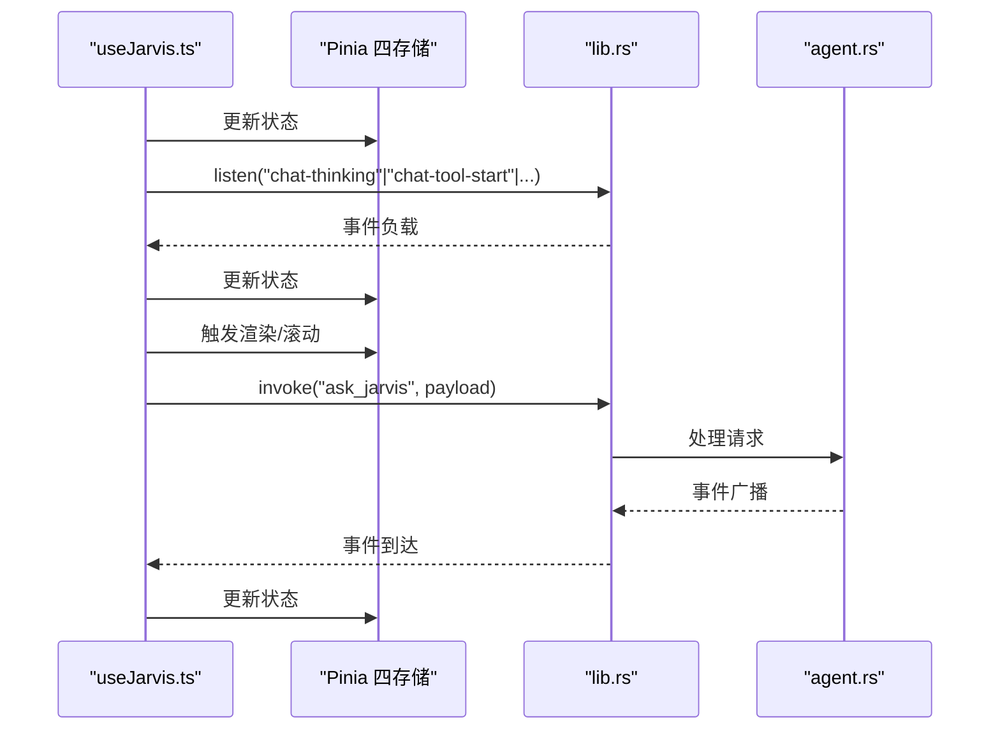

**图表来源**
- [src/composables/useJarvis.ts:620-800](file://src/composables/useJarvis.ts#L620-L800)
- [src/stores/agent.ts:1-95](file://src/stores/agent.ts#L1-L95)
- [src/stores/chat.ts:1-724](file://src/stores/chat.ts#L1-L724)
- [src-tauri/src/lib.rs:102-182](file://src-tauri/src/lib.rs#L102-L182)

**章节来源**
- [src/composables/useJarvis.ts:1-800](file://src/composables/useJarvis.ts#L1-L800)
- [src-tauri/src/lib.rs:88-185](file://src-tauri/src/lib.rs#L88-L185)
- [src/stores/agent.ts:1-95](file://src/stores/agent.ts#L1-L95)
- [src/stores/chat.ts:1-724](file://src/stores/chat.ts#L1-L724)
- [src/stores/session.ts:1-171](file://src/stores/session.ts#L1-L171)
- [src/stores/permission.ts:1-66](file://src/stores/permission.ts#L1-L66)

## 依赖分析
- 技术栈与版本
  - 前端：Vue 3、Vite、TypeScript、Pinia
  - 桌面：Tauri 2.x
  - 后端：Rust、Tokio、Reqwest、EventSource Stream
- 关键依赖关系
  - 前端 package.json 依赖 @tauri-apps/api 与插件
  - 后端 Cargo.toml 依赖 tauri、reqwest、tokio、eventsource-stream、futures-util 等
  - Tauri 配置 tauri.conf.json 指定开发/构建 URL、窗口属性与安全策略
  - Pinia 四存储模块相互协作，通过 Session Store 提供统一的数据源

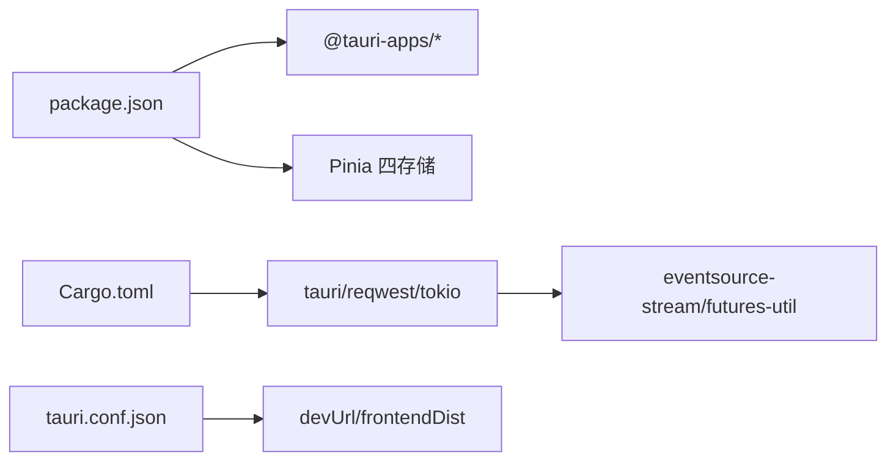

**图表来源**
- [package.json:12-26](file://package.json#L12-L26)
- [src-tauri/Cargo.toml:20-39](file://src-tauri/Cargo.toml#L20-L39)
- [src-tauri/tauri.conf.json:6-11](file://src-tauri/tauri.conf.json#L6-L11)

**章节来源**
- [package.json:1-28](file://package.json#L1-L28)
- [src-tauri/Cargo.toml:1-41](file://src-tauri/Cargo.toml#L1-L41)
- [src-tauri/tauri.conf.json:1-40](file://src-tauri/tauri.conf.json#L1-L40)

## 性能考虑
- 异步与流式：后端使用 Tokio 异步运行时与 SSE 事件流，降低延迟与提升吞吐
- 增量渲染：前端按事件增量更新，避免全量重绘
- Pinia 状态优化：四个存储模块独立管理，减少不必要的状态更新
- 上下文压缩：定期微压缩与自动摘要，控制上下文长度，减少 Token 消耗
- 背景任务：长周期命令通过后台执行，避免阻塞对话
- 模型能力：通过 model_registry.json 统一模型参数，按需选择推理/思考模式
- 快照引擎：高效的补丁应用与分支管理，支持大规模文件系统的版本控制

## 故障排查指南
- 事件未到达
  - 检查前端是否正确注册事件监听
  - 检查后端命令是否成功触发事件广播
- 工具执行异常
  - 查看工具调用路由与权限校验
  - 检查子代理事件与错误字段
- 会话状态异常
  - 检查会话管理命令与状态持久化
  - 关注沙箱路径与权限拦截
- Pinia 状态异常
  - 检查存储模块间的依赖关系
  - 验证状态更新的原子性
- LLM Provider 错误
  - 检查 API 格式适配器配置
  - 验证重试机制是否正常工作
- 快照引擎问题
  - 检查补丁应用的哈希验证
  - 验证分支切换的完整性

**章节来源**
- [src/composables/useJarvis.ts:620-800](file://src/composables/useJarvis.ts#L620-L800)
- [src-tauri/src/core/tools/mod.rs:18-19](file://src-tauri/src/core/tools/mod.rs#L18-L19)
- [src-tauri/src/core/subagents.rs:179-198](file://src-tauri/src/core/subagents.rs#L179-L198)
- [src-tauri/src/core/llm/api_client.rs:11-89](file://src-tauri/src/core/llm/api_client.rs#L11-L89)
- [src-tauri/src/core/snapshot_engine/snapshot.rs:108-178](file://src-tauri/src/core/snapshot_engine/snapshot.rs#L108-L178)

## 结论
JarvisAgent 通过 Vue 3 + Rust + Tauri 的混合架构，结合 Pinia 四存储架构，实现了高性能、可观测、可扩展的 AI 编程助手桌面应用。其完整的 Agent 管线、LlmProvider 抽象层、快照引擎架构以及企业级 Agent 的关键能力，配合事件驱动与流式渲染，提供了流畅的用户体验与强大的工程化能力。新增的架构组件进一步增强了系统的模块化程度、可维护性和扩展性。

## 附录
- 数据模型与类型
  - 会话视图、消息、Agent 步骤、子代理运行与事件、计划文档等类型定义
- 模型能力注册表
  - 统一 OpenAI/Anthropic 格式，支持推理/思考参数与最大 Token 配置
- 快照引擎 API
  - 支持分支管理、补丁应用、多代理协作的完整 API 接口

**章节来源**
- [src/types/index.ts:1-365](file://src/types/index.ts#L1-L365)
- [src-tauri/model_registry.json:1-496](file://src-tauri/model_registry.json#L1-L496)
- [src-tauri/src/core/snapshot_engine/snapshot.rs:1-425](file://src-tauri/src/core/snapshot_engine/snapshot.rs#L1-L425)