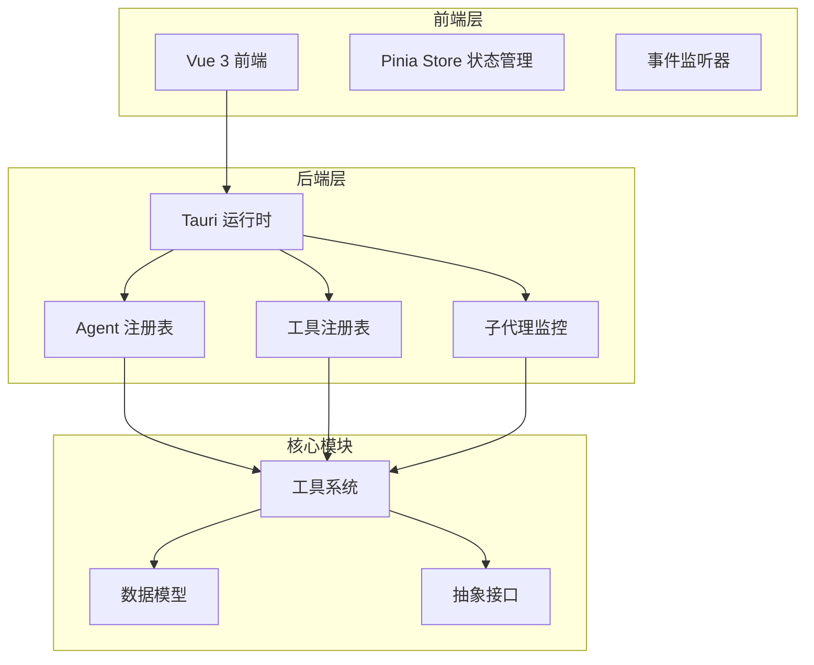
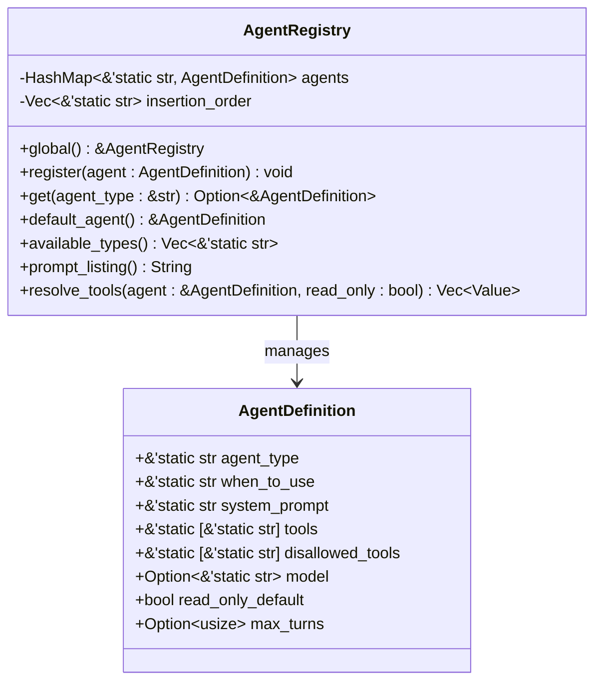
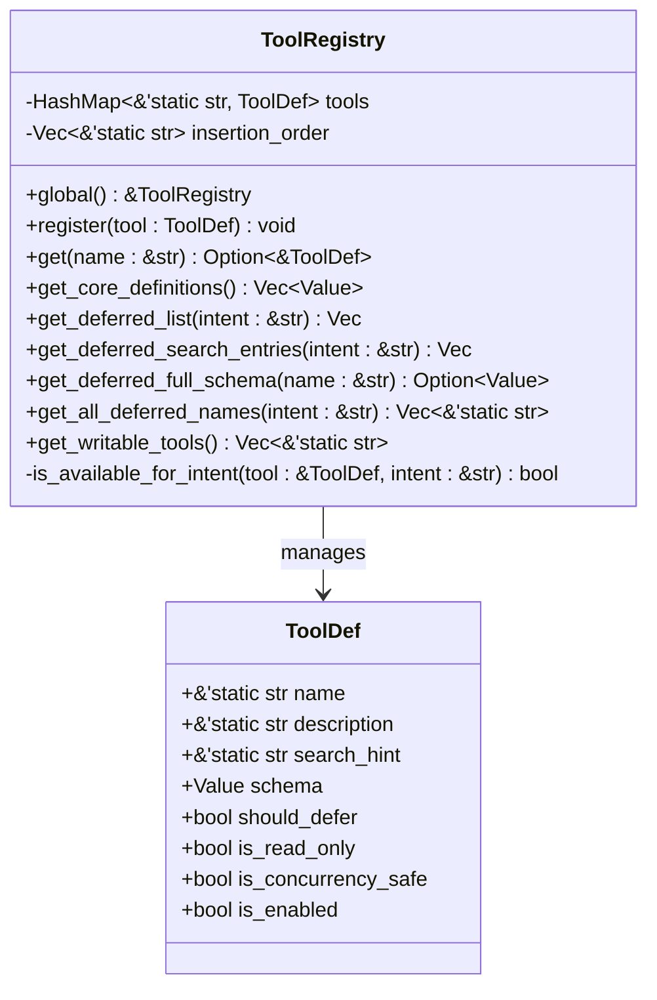
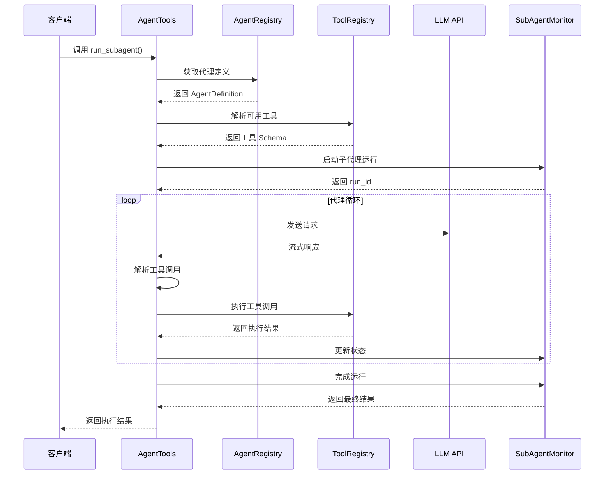
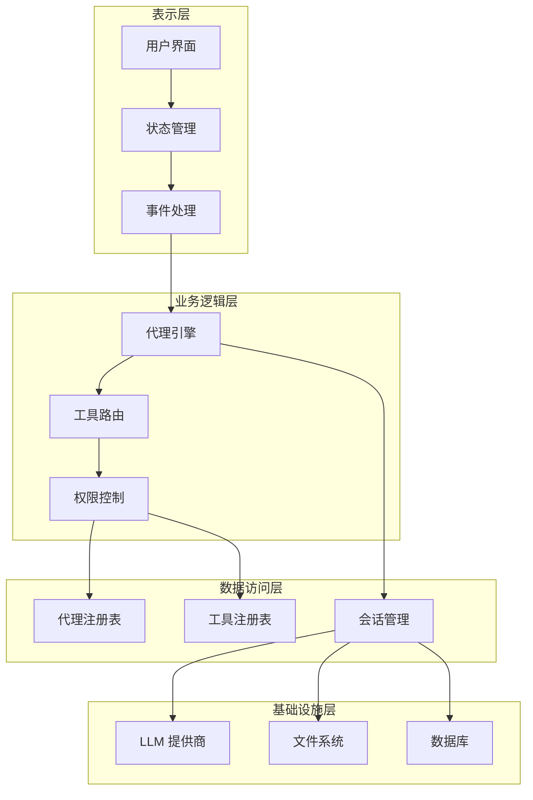
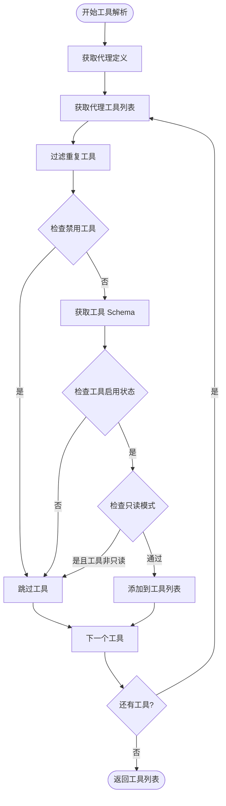
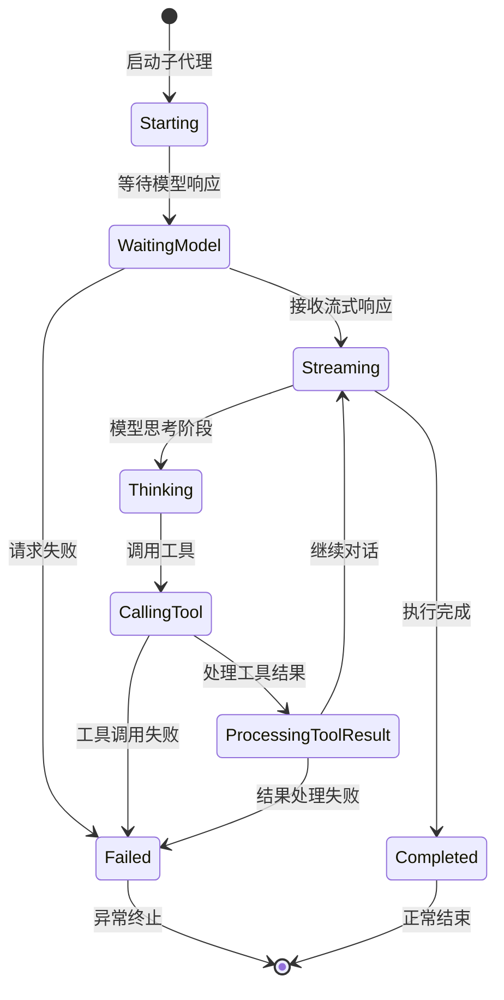
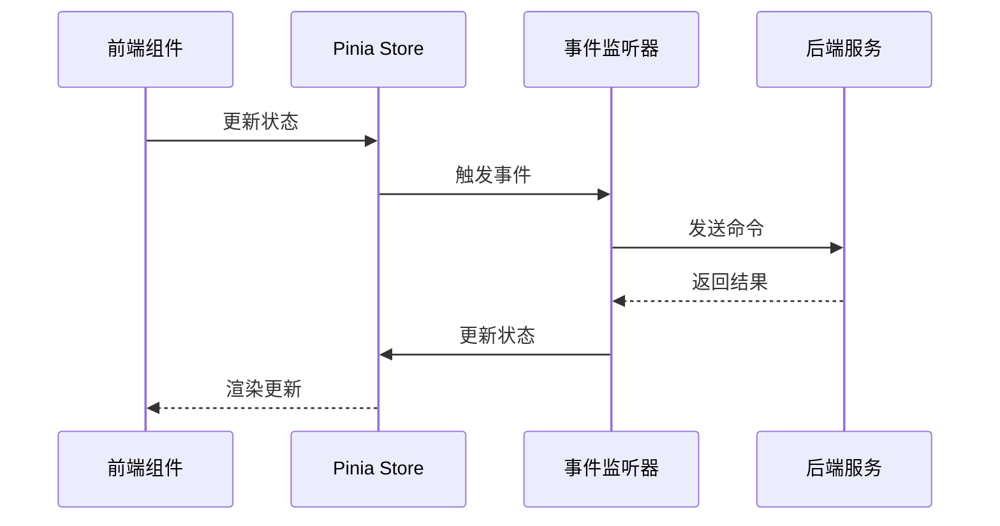
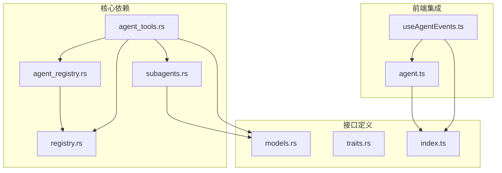

# Agent 注册表系统

<cite>
**本文档引用的文件**
- [agent_registry.rs](file://src-tauri/src/core/tools/agent_registry.rs)
- [registry.rs](file://src-tauri/src/core/tools/registry.rs)
- [mod.rs](file://src-tauri/src/core/tools/mod.rs)
- [agent_tools.rs](file://src-tauri/src/core/tools/agent_tools.rs)
- [subagents.rs](file://src-tauri/src/core/orchestration/subagents.rs)
- [session.rs](file://src-tauri/src/core/commands/session.rs)
- [models.rs](file://src-tauri/src/core/models.rs)
- [traits.rs](file://src-tauri/src/core/traits.rs)
- [index.ts](file://src/types/index.ts)
- [agent.ts](file://src/stores/agent.ts)
- [useAgentEvents.ts](file://src/composables/useAgentEvents.ts)
- [AGENTS.md](file://AGENTS.md)
</cite>

## 目录
1. [简介](#简介)
2. [项目结构](#项目结构)
3. [核心组件](#核心组件)
4. [架构概览](#架构概览)
5. [详细组件分析](#详细组件分析)
6. [依赖关系分析](#依赖关系分析)
7. [性能考虑](#性能考虑)
8. [故障排除指南](#故障排除指南)
9. [结论](#结论)

## 简介

Agent 注册表系统是 JarvisAgent 桌面 AI 编程助手的核心组件之一，负责管理和协调各种子代理（Subagent）的工作流程。该系统提供了轻量级的子代理注册机制，将代理类型契约与工具注册表分离，确保代理定义决定子代理可见的工具，而工具注册表保持工具模式和只读元数据的权威来源。

系统支持多种代理类型，包括通用代理、探索代理、规划代理、代码审查代理、验证代理和实现代理，每种代理都有特定的工具集和权限控制策略。通过智能的工具解析和权限过滤，系统能够在保证安全性的同时提供强大的功能。

## 项目结构

JarvisAgent 采用现代化的桌面应用架构，结合了 Tauri 2.0 和 Vue 3 技术栈：

**图表来源**
- [mod.rs:1-50](file://src-tauri/src/core/tools/mod.rs#L1-L50)
- [AGENTS.md:19-42](file://AGENTS.md#L19-L42)

**章节来源**
- [AGENTS.md:1-74](file://AGENTS.md#L1-L74)
- [mod.rs:1-50](file://src-tauri/src/core/tools/mod.rs#L1-L50)

## 核心组件

### Agent 注册表 (AgentRegistry)

Agent 注册表是系统的核心管理组件，负责存储和管理所有可用的代理定义。它提供了全局单例访问模式，确保在整个应用程序生命周期内保持一致的状态。

**图表来源**
- [agent_registry.rs:60-75](file://src-tauri/src/core/tools/agent_registry.rs#L60-L75)
- [agent_registry.rs:72-75](file://src-tauri/src/core/tools/agent_registry.rs#L72-L75)

### 工具注册表 (ToolRegistry)

工具注册表负责管理所有可用的工具定义，提供统一的工具元数据和 JSON Schema 定义。它支持核心工具和延迟工具的分类管理，以及基于意图的工具筛选。

**图表来源**
- [registry.rs:39-45](file://src-tauri/src/core/tools/registry.rs#L39-L45)
- [registry.rs:41-45](file://src-tauri/src/core/tools/registry.rs#L41-L45)

### 子代理执行引擎 (run_subagent)

子代理执行引擎是系统中最复杂的组件，实现了完整的子代理生命周期管理，包括流式处理、并行工具执行和状态监控。

**图表来源**
- [agent_tools.rs:79-712](file://src-tauri/src/core/tools/agent_tools.rs#L79-L712)
- [agent_registry.rs:186-214](file://src-tauri/src/core/tools/agent_registry.rs#L186-L214)

**章节来源**
- [agent_registry.rs:1-295](file://src-tauri/src/core/tools/agent_registry.rs#L1-L295)
- [registry.rs:1-181](file://src-tauri/src/core/tools/registry.rs#L1-L181)
- [agent_tools.rs:1-976](file://src-tauri/src/core/tools/agent_tools.rs#L1-L976)

## 架构概览

Agent 注册表系统采用分层架构设计，确保各组件之间的松耦合和高内聚：

**图表来源**
- [mod.rs:1-50](file://src-tauri/src/core/tools/mod.rs#L1-L50)
- [session.rs:1-50](file://src-tauri/src/core/commands/session.rs#L1-L50)

系统的核心特性包括：

1. **代理类型管理**：支持多种预定义的代理类型，每种类型都有特定的工具集和权限控制
2. **工具解析机制**：根据代理定义和读写模式动态解析可用工具
3. **权限过滤系统**：基于工具元数据进行智能权限过滤
4. **状态监控**：完整的子代理生命周期监控和事件记录
5. **流式处理**：支持 LLM 响应的流式处理和实时状态更新

**章节来源**
- [mod.rs:117-186](file://src-tauri/src/core/tools/mod.rs#L117-L186)
- [subagents.rs:82-680](file://src-tauri/src/core/orchestration/subagents.rs#L82-L680)

## 详细组件分析

### 代理类型定义

系统预定义了多种代理类型，每种都有其特定的用途和工具集：

| 代理类型 | 默认读写模式 | 最大轮次 | 主要用途 |
|---------|-------------|----------|----------|
| general | 读写 | 无限制 | 通用委托工作 |
| explore | 仅读 | 8轮 | 代码库探索和研究 |
| plan | 仅读 | 8轮 | 计划制定和分析 |
| review | 仅读 | 8轮 | 代码审查和质量检查 |
| verification | 读写 | 10轮 | 行为验证和测试 |
| implementation | 读写 | 无限制 | 具体实现工作 |

### 工具权限系统

工具权限系统基于工具元数据进行智能过滤：

**图表来源**
- [agent_registry.rs:186-214](file://src-tauri/src/core/tools/agent_registry.rs#L186-L214)

### 子代理监控系统

子代理监控系统提供了完整的生命周期管理：

**图表来源**
- [subagents.rs:16-37](file://src-tauri/src/core/orchestration/subagents.rs#L16-L37)

**章节来源**
- [agent_registry.rs:79-175](file://src-tauri/src/core/tools/agent_registry.rs#L79-L175)
- [agent_tools.rs:79-712](file://src-tauri/src/core/tools/agent_tools.rs#L79-L712)
- [subagents.rs:82-680](file://src-tauri/src/core/orchestration/subagents.rs#L82-L680)

### 前端集成

前端通过 Pinia 状态管理和事件监听器与后端进行交互：

**图表来源**
- [useAgentEvents.ts:285-637](file://src/composables/useAgentEvents.ts#L285-L637)
- [agent.ts:12-95](file://src/stores/agent.ts#L12-L95)

**章节来源**
- [index.ts:195-251](file://src/types/index.ts#L195-L251)
- [useAgentEvents.ts:1-638](file://src/composables/useAgentEvents.ts#L1-L638)
- [agent.ts:1-95](file://src/stores/agent.ts#L1-L95)

## 依赖关系分析

系统采用模块化的依赖设计，确保各组件之间的清晰边界：

**图表来源**
- [mod.rs:20-31](file://src-tauri/src/core/tools/mod.rs#L20-L31)
- [models.rs:23-33](file://src-tauri/src/core/models.rs#L23-L33)

主要依赖关系特点：

1. **单向依赖**：AgentRegistry 依赖 ToolRegistry，但反之不成立
2. **松耦合设计**：各模块通过接口定义进行通信
3. **状态隔离**：前端状态管理与后端状态管理相互独立
4. **事件驱动**：前后端通过事件进行异步通信

**章节来源**
- [mod.rs:1-50](file://src-tauri/src/core/tools/mod.rs#L1-L50)
- [models.rs:1-301](file://src-tauri/src/core/models.rs#L1-L301)

## 性能考虑

Agent 注册表系统在设计时充分考虑了性能优化：

### 内存管理
- 使用 `OnceLock` 实现全局单例，避免重复初始化
- 工具注册表保持插入顺序，确保稳定的输出
- 子代理监控使用哈希表进行快速查找

### 并发处理
- 工具调用采用并行执行模式，提高响应速度
- 使用 tokio 异步运行时处理大量并发请求
- 通过取消令牌实现优雅的资源释放

### 缓存策略
- 工具 Schema 缓存避免重复解析
- 代理定义缓存减少查找开销
- 会话状态缓存提升用户体验

## 故障排除指南

### 常见问题及解决方案

**问题1：代理工具不可用**
- 检查代理定义中的工具列表
- 验证工具是否启用和允许访问
- 确认读写模式设置是否正确

**问题2：子代理执行失败**
- 查看子代理事件日志
- 检查 LLM API 配置
- 验证权限设置和工作目录

**问题3：前端状态不同步**
- 确认事件监听器正常工作
- 检查 Pinia 状态更新
- 验证 Tauri 命令调用

**章节来源**
- [subagents.rs:357-393](file://src-tauri/src/core/orchestration/subagents.rs#L357-L393)
- [session.rs:396-403](file://src-tauri/src/core/commands/session.rs#L396-L403)

## 结论

Agent 注册表系统展现了现代 AI 助手应用的优秀架构设计。通过模块化的设计、清晰的职责分离和智能的权限控制，系统能够有效地管理复杂的代理工作流程。

系统的主要优势包括：

1. **灵活性**：支持多种代理类型和动态工具解析
2. **安全性**：基于工具元数据的智能权限过滤
3. **可观测性**：完整的生命周期监控和事件记录
4. **可扩展性**：模块化设计便于功能扩展
5. **用户体验**：流畅的流式处理和实时状态更新

该系统为构建复杂的人工智能应用提供了良好的基础架构，特别是在需要精细权限控制和复杂工作流程管理的场景中表现出色。