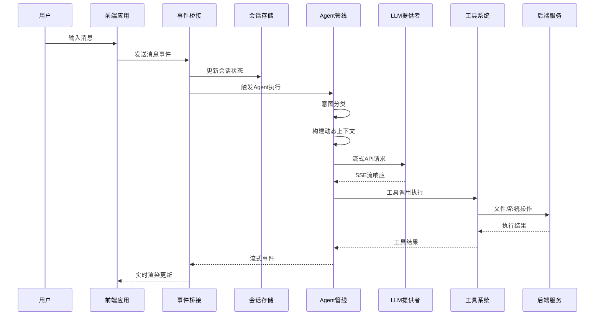
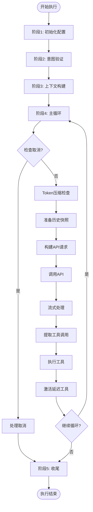
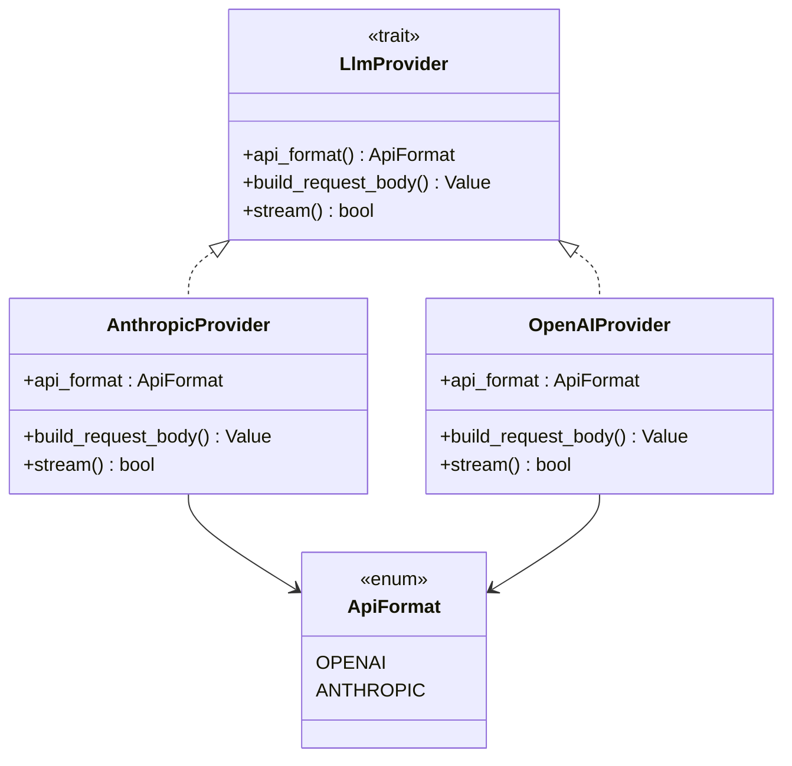
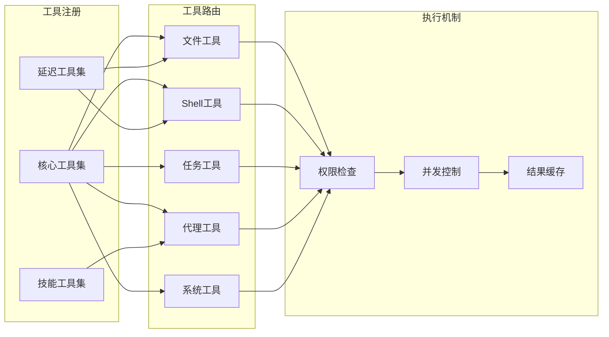
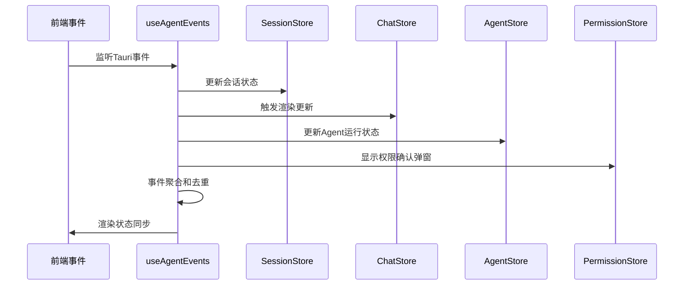
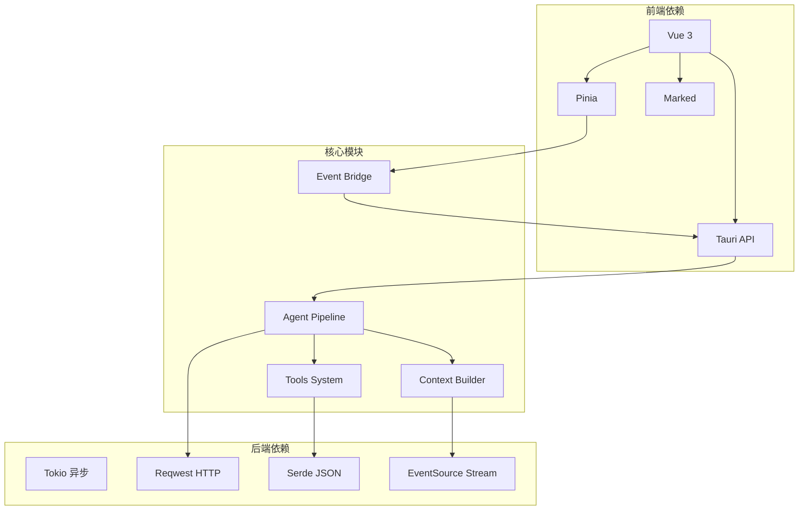

# Agent 系统

<cite>
**本文档引用的文件**
- [README.md](file://README.md)
- [AGENTS.md](file://AGENTS.md)
- [src/main.ts](file://src/main.ts)
- [src/App.vue](file://src/App.vue)
- [src-tauri/src/main.rs](file://src-tauri/src/main.rs)
- [src-tauri/Cargo.toml](file://src-tauri/Cargo.toml)
- [src/composables/useAgentEvents.ts](file://src/composables/useAgentEvents.ts)
- [src/stores/agent.ts](file://src/stores/agent.ts)
- [src/types/index.ts](file://src/types/index.ts)
- [src-tauri/src/core/agent/pipeline.rs](file://src-tauri/src/core/agent/pipeline.rs)
- [src-tauri/src/core/traits.rs](file://src-tauri/src/core/traits.rs)
- [src-tauri/src/core/agent/context.rs](file://src-tauri/src/core/agent/context.rs)
- [src-tauri/src/core/tools/mod.rs](file://src-tauri/src/core/tools/mod.rs)
- [src/components/chat/ChatArea.vue](file://src/components/chat/ChatArea.vue)
</cite>

## 目录
1. [简介](#简介)
2. [项目结构](#项目结构)
3. [核心组件](#核心组件)
4. [架构总览](#架构总览)
5. [详细组件分析](#详细组件分析)
6. [依赖关系分析](#依赖关系分析)
7. [性能考虑](#性能考虑)
8. [故障排除指南](#故障排除指南)
9. [结论](#结论)

## 简介
JarvisAgent 是一个基于 Tauri 2.0 + Vue 3 + Rust 的桌面端 AI 编程助手，具备完整的 Agent 自主循环，支持 20+ 主流 LLM 模型，提供快照版本控制、多 Agent 沙箱、方案审批等企业级能力。系统通过统一的 LLM Provider 抽象屏蔽不同 API 格式差异，前端通过 Tauri 事件桥接收后端流式输出，实现低延迟的交互体验。

## 项目结构
项目采用前后端分离架构，前端使用 Vue 3 + TypeScript + Pinia，后端使用 Rust + Tokio 异步运行时，通过 Tauri 实现桌面应用集成。

```mermaid
graph TB
subgraph "前端 (Vue 3)"
A[src/main.ts 应用入口]
B[src/App.vue 根组件]
C[src/composables/useAgentEvents.ts 事件监听]
D[src/stores/* 状态管理]
E[src/components/* UI组件]
end
subgraph "后端 (Rust)"
F[src-tauri/src/main.rs 应用入口]
G[src-tauri/src/core/* Agent核心]
H[src-tauri/src/core/agent/pipeline.rs Agent流水线]
I[src-tauri/src/core/agent/context.rs 上下文构建]
J[src-tauri/src/core/tools/mod.rs 工具系统]
K[src-tauri/src/core/traits.rs 抽象接口]
end
subgraph "桌面框架"
L[Tauri 2.0]
M[Rust 异步运行时]
end
A --> B
B --> C
C --> D
C --> E
F --> G
G --> H
G --> I
G --> J
G --> K
L <- --> M
L <- --> G
L <- --> C
```

**图表来源**
- [src/main.ts:1-9](file://src/main.ts#L1-L9)
- [src-tauri/src/main.rs:1-23](file://src-tauri/src/main.rs#L1-L23)
- [src/App.vue:1-357](file://src/App.vue#L1-L357)

**章节来源**
- [README.md:96-170](file://README.md#L96-L170)
- [src-tauri/Cargo.toml:1-42](file://src-tauri/Cargo.toml#L1-L42)

## 核心组件
系统包含四大核心组件：Agent 管线、LLM Provider 抽象、工具系统、事件桥接。

### Agent 管线
Agent 管线实现五阶段执行流程：初始化 → 意图验证 → 上下文构建 → 主循环 → 收尾。主循环包含压缩检查、API 调用、流式处理、工具执行等完整 Agent Loop 逻辑。

### LLM Provider 抽象
通过 LlmProvider trait 统一 Anthropic Messages API 和 OpenAI Chat Completions API 的差异，支持流式请求和不同格式的认证头、版本头。

### 工具系统
工具系统支持渐进式披露，根据意图类型动态加载工具集，包括文件操作、Shell 命令、任务管理、子代理委派等功能。

### 事件桥接
前端通过 useAgentEvents.ts 监听后端 Tauri 事件，将流式输出分发到各 Pinia Store，实现渲染状态的实时更新。

**章节来源**
- [src-tauri/src/core/agent/pipeline.rs:1-800](file://src-tauri/src/core/agent/pipeline.rs#L1-L800)
- [src-tauri/src/core/traits.rs:1-60](file://src-tauri/src/core/traits.rs#L1-L60)
- [src-tauri/src/core/tools/mod.rs:1-327](file://src-tauri/src/core/tools/mod.rs#L1-L327)
- [src/composables/useAgentEvents.ts:1-638](file://src/composables/useAgentEvents.ts#L1-L638)

## 架构总览
系统采用事件驱动的微服务架构，前后端通过 Tauri 事件进行松耦合通信。



**图表来源**
- [src/composables/useAgentEvents.ts:285-627](file://src/composables/useAgentEvents.ts#L285-L627)
- [src-tauri/src/core/agent/pipeline.rs:401-800](file://src-tauri/src/core/agent/pipeline.rs#L401-L800)

## 详细组件分析

### Agent 管线组件分析
Agent 管线是系统的核心执行引擎，实现完整的自主 Agent 循环。



**图表来源**
- [src-tauri/src/core/agent/pipeline.rs:401-800](file://src-tauri/src/core/agent/pipeline.rs#L401-L800)

#### 关键特性
- **循环控制**: 支持 MAX_AGENT_LOOP_BEFORE_CONFIRM 和 MAX_AGENT_LOOP_ABSOLUTE 常量限制
- **取消机制**: 使用 CancellationToken 支持随时中断
- **流式处理**: 通过 SSE 解析实时处理 LLM 输出
- **工具执行**: 支持同步和异步工具调用

**章节来源**
- [src-tauri/src/core/agent/pipeline.rs:1-800](file://src-tauri/src/core/agent/pipeline.rs#L1-L800)

### LLM Provider 抽象组件分析
通过 LlmProvider trait 抽象不同 API 格式的差异，实现统一的接口。



**图表来源**
- [src-tauri/src/core/traits.rs:26-47](file://src-tauri/src/core/traits.rs#L26-L47)
- [src-tauri/src/core/llm/api_format.rs](file://src-tauri/src/core/llm/api_format.rs)

#### 关键特性
- **格式统一**: 屏蔽 Anthropic 和 OpenAI API 差异
- **流式支持**: 统一的流式请求接口
- **配置灵活**: 支持不同模型的参数配置

**章节来源**
- [src-tauri/src/core/traits.rs:1-60](file://src-tauri/src/core/traits.rs#L1-L60)

### 工具系统组件分析
工具系统实现按需加载和路由分发，支持渐进式披露。



**图表来源**
- [src-tauri/src/core/tools/mod.rs:117-186](file://src-tauri/src/core/tools/mod.rs#L117-L186)

#### 关键特性
- **渐进式披露**: 根据意图类型动态激活工具
- **权限控制**: 沙箱限制和权限审批机制
- **并发执行**: 支持子代理并行执行

**章节来源**
- [src-tauri/src/core/tools/mod.rs:1-327](file://src-tauri/src/core/tools/mod.rs#L1-L327)

### 事件桥接组件分析
前端通过 useAgentEvents.ts 实现统一的事件监听和分发。



**图表来源**
- [src/composables/useAgentEvents.ts:363-494](file://src/composables/useAgentEvents.ts#L363-L494)

#### 关键特性
- **事件聚合**: 统一监听所有后端事件
- **状态同步**: 自动分发到各 Store
- **增量渲染**: 30fps 节流的 Markdown 渲染

**章节来源**
- [src/composables/useAgentEvents.ts:1-638](file://src/composables/useAgentEvents.ts#L1-L638)

## 依赖关系分析
系统采用模块化设计，各组件间依赖清晰。



**图表来源**
- [src-tauri/Cargo.toml:20-42](file://src-tauri/Cargo.toml#L20-L42)
- [src/package.json:12-28](file://package.json#L12-L28)

**章节来源**
- [src-tauri/Cargo.toml:1-42](file://src-tauri/Cargo.toml#L1-L42)
- [package.json:1-29](file://package.json#L1-L29)

## 性能考虑
系统在多个层面进行了性能优化：

### 前端性能
- **增量 Markdown 渲染**: 30fps 节流，稳定内容缓存，仅尾部实时重渲染
- **虚拟滚动**: 大量历史消息的高效渲染
- **状态分发**: 按需更新，避免全量重渲染

### 后端性能
- **异步流式处理**: 使用 Tokio 运行时处理并发请求
- **连接池**: HTTP 客户端连接复用
- **内存管理**: 会话状态的智能缓存和清理

### 网络性能
- **SSE 流式传输**: 实时响应，减少轮询开销
- **压缩传输**: GZIP 压缩减少带宽占用
- **重试机制**: 智能重试避免网络抖动影响

## 故障排除指南
常见问题及解决方案：

### Agent 执行异常
1. **检查 API 配置**: 确认 API Key 和 Base URL 正确
2. **查看日志输出**: 检查后端调试日志
3. **验证权限设置**: 确认沙箱和权限配置

### 前端渲染问题
1. **事件监听**: 确认 useAgentEvents 正常初始化
2. **状态同步**: 检查 Pinia Store 数据一致性
3. **内存泄漏**: 监控组件生命周期

### 性能问题
1. **渲染节流**: 检查 Markdown 渲染配置
2. **内存使用**: 监控会话状态大小
3. **网络延迟**: 优化 API 调用频率

**章节来源**
- [src/composables/useAgentEvents.ts:285-627](file://src/composables/useAgentEvents.ts#L285-L627)
- [src-tauri/src/core/agent/pipeline.rs:630-644](file://src-tauri/src/core/agent/pipeline.rs#L630-L644)

## 结论
JarvisAgent 系统通过精心设计的架构实现了高性能的 AI 编程助手。系统的核心优势包括：

1. **模块化设计**: 清晰的组件边界和职责分离
2. **事件驱动**: 松耦合的前后端通信机制
3. **性能优化**: 多层次的性能优化策略
4. **安全性**: 完善的权限控制和沙箱机制
5. **可扩展性**: 插件化的工具系统和 Provider 抽象

该系统为桌面端 AI 编程助手提供了坚实的技术基础，适合进一步扩展和定制开发。