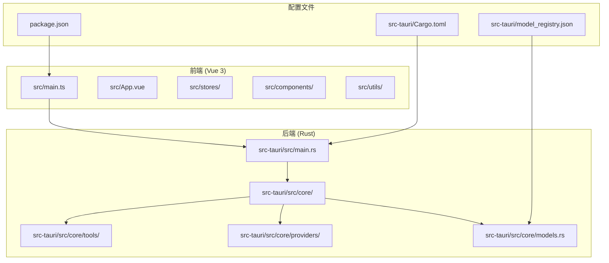
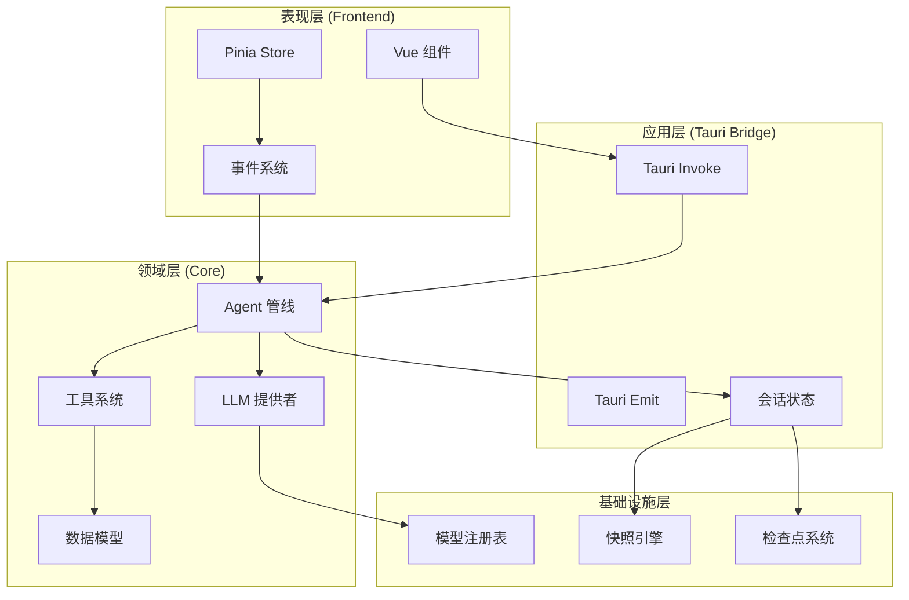
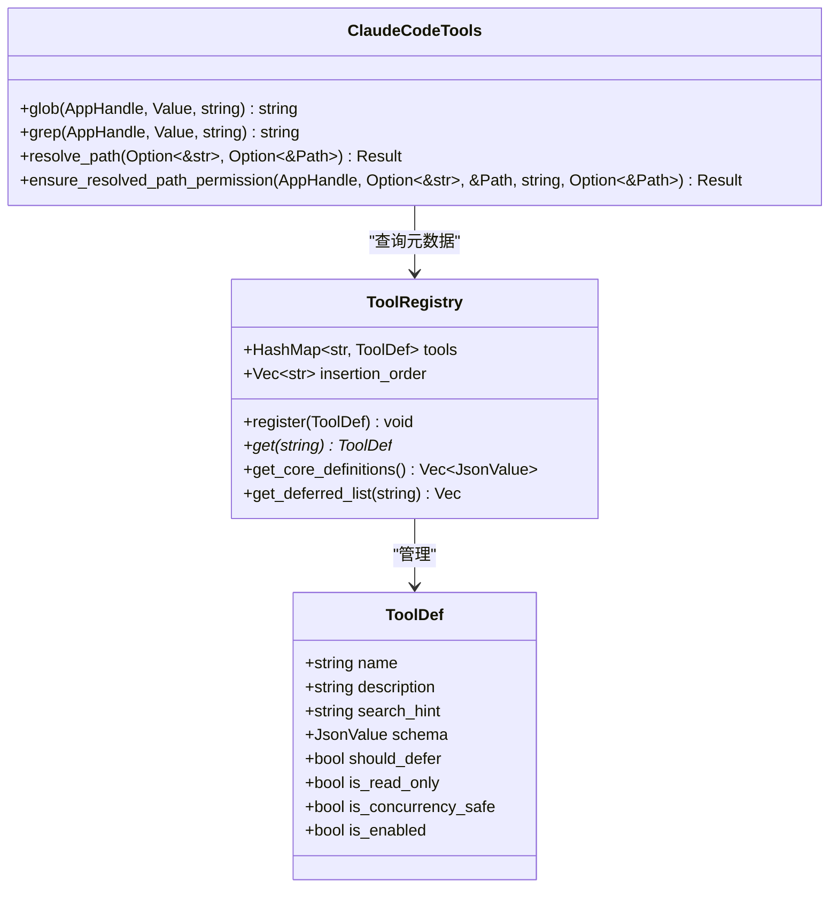
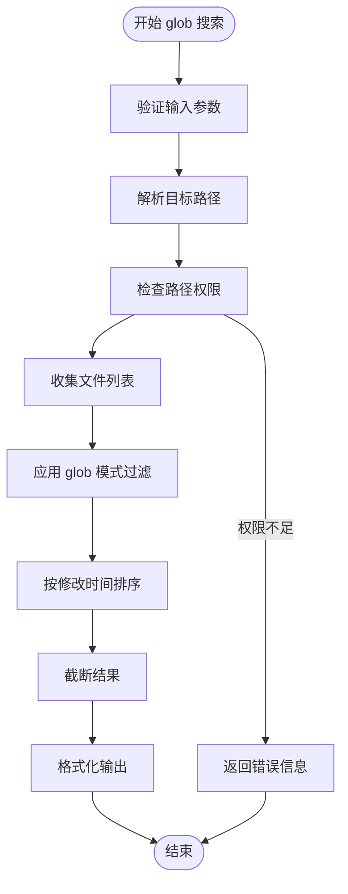
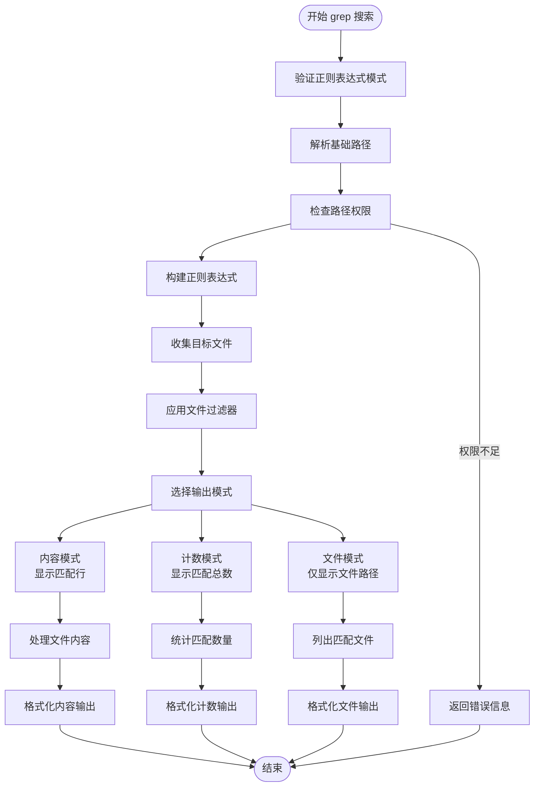
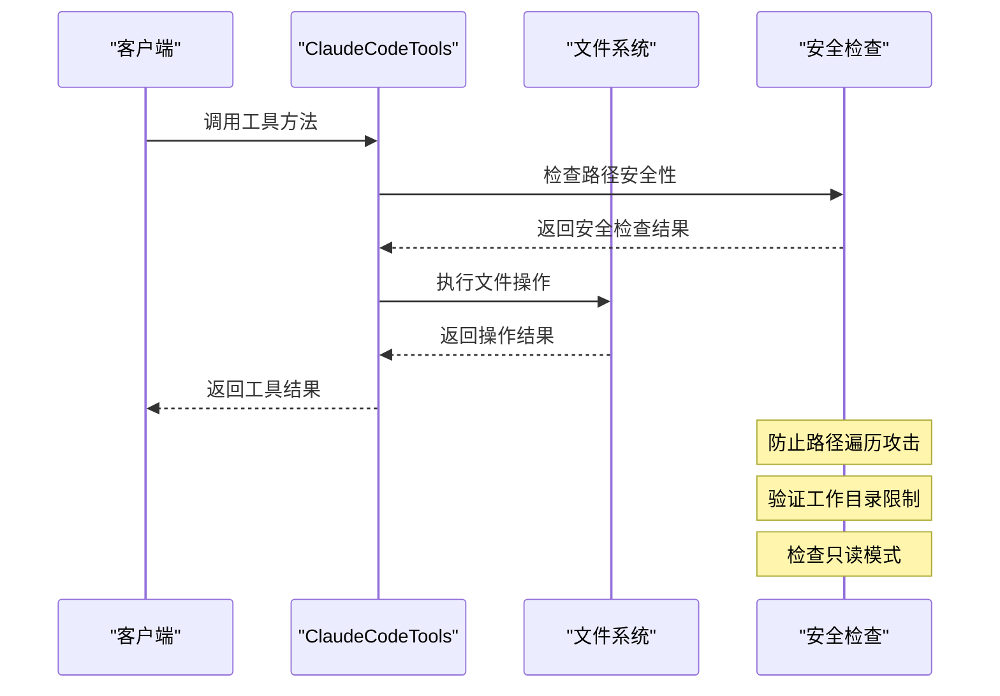
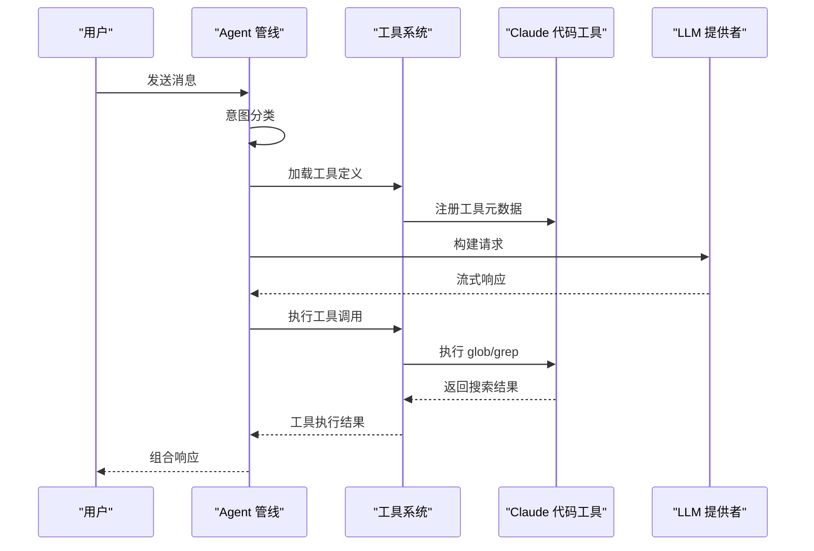
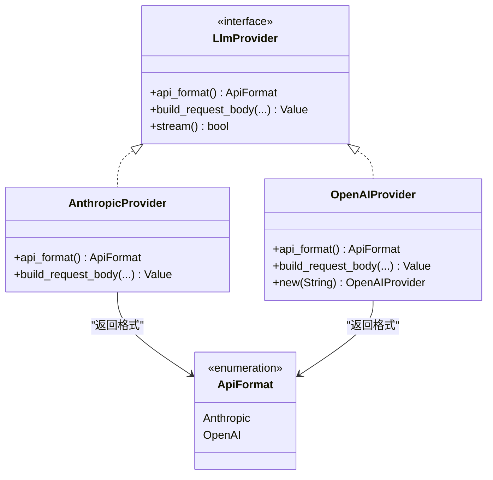
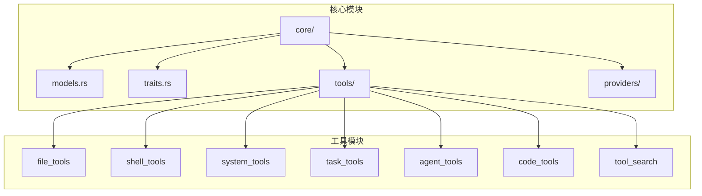

# Claude 代码工具

<cite>
**本文档引用的文件**
- [README.md](file://README.md)
- [CLAUDE.md](file://CLAUDE.md)
- [main.rs](file://src-tauri/src/main.rs)
- [Cargo.toml](file://src-tauri/Cargo.toml)
- [package.json](file://package.json)
- [claude_code_tools.rs](file://src-tauri/src/core/tools/claude_code_tools.rs)
- [mod.rs](file://src-tauri/src/core/tools/mod.rs)
- [pipeline.rs](file://src-tauri/src/core/agent/pipeline.rs)
- [traits.rs](file://src-tauri/src/core/traits.rs)
- [anthropic.rs](file://src-tauri/src/core/providers/anthropic.rs)
- [openai.rs](file://src-tauri/src/core/providers/openai.rs)
- [registry.rs](file://src-tauri/src/core/tools/registry.rs)
- [models.rs](file://src-tauri/src/core/models.rs)
- [model_registry.json](file://src-tauri/model_registry.json)
</cite>

## 目录
1. [简介](#简介)
2. [项目结构](#项目结构)
3. [核心组件](#核心组件)
4. [架构总览](#架构总览)
5. [详细组件分析](#详细组件分析)
6. [依赖关系分析](#依赖关系分析)
7. [性能考虑](#性能考虑)
8. [故障排除指南](#故障排除指南)
9. [结论](#结论)

## 简介
本项目是一个基于 Tauri 2.0 + Vue 3 + Rust 的桌面端 AI 编程助手，支持 20+ 主流 LLM 模型，具备 Claude Code 风格的代码搜索能力。Claude 代码工具作为核心搜索能力，提供了两个只读、并发安全的搜索工具：
- `glob`：按 glob 模式快速查找文件路径
- `grep`：使用正则表达式搜索文件内容

这些工具支持文件过滤、输出模式、上下文和分页等功能，为开发者提供高效的代码导航和搜索体验。

## 项目结构
项目采用前后端分离架构，前端使用 Vue 3 + TypeScript，后端使用 Rust + Tokio 异步运行时。核心目录结构如下：



**图表来源**
- [main.rs:1-23](file://src-tauri/src/main.rs#L1-L23)
- [Cargo.toml:1-42](file://src-tauri/Cargo.toml#L1-L42)
- [package.json:1-29](file://package.json#L1-L29)

**章节来源**
- [README.md:96-170](file://README.md#L96-L170)
- [CLAUDE.md:19-74](file://CLAUDE.md#L19-L74)

## 核心组件
Claude 代码工具的核心组件包括：

### 工具注册系统
- **ToolDef 结构体**：定义工具的基本信息（名称、描述、搜索提示、Schema）
- **ToolRegistry**：全局注册表，支持工具的注册、查询和过滤
- **define_tools 宏**：简化工具注册过程

### 搜索算法实现
- **glob 搜索**：支持通配符模式匹配，按修改时间倒序排列
- **grep 搜索**：支持正则表达式搜索，多种输出模式
- **路径安全检查**：防止路径遍历攻击

### 性能优化特性
- **并发安全**：工具设计支持并发执行
- **内存管理**：合理的内存使用和垃圾回收
- **限流机制**：防止过度资源消耗

**章节来源**
- [claude_code_tools.rs:1-800](file://src-tauri/src/core/tools/claude_code_tools.rs#L1-L800)
- [registry.rs:1-181](file://src-tauri/src/core/tools/registry.rs#L1-L181)

## 架构总览
项目采用分层架构设计，清晰分离关注点：



**图表来源**
- [pipeline.rs:1-800](file://src-tauri/src/core/agent/pipeline.rs#L1-L800)
- [mod.rs:1-327](file://src-tauri/src/core/tools/mod.rs#L1-L327)
- [traits.rs:1-60](file://src-tauri/src/core/traits.rs#L1-L60)

## 详细组件分析

### Claude 代码工具实现

#### 工具定义和注册
Claude 代码工具通过 `define_tools!` 宏进行注册，定义了完整的工具元数据：



**图表来源**
- [registry.rs:18-181](file://src-tauri/src/core/tools/registry.rs#L18-L181)
- [claude_code_tools.rs:734-800](file://src-tauri/src/core/tools/claude_code_tools.rs#L734-L800)

#### glob 搜索算法
glob 搜索实现了高效的文件模式匹配：



**图表来源**
- [claude_code_tools.rs:486-548](file://src-tauri/src/core/tools/claude_code_tools.rs#L486-L548)

#### grep 搜索算法
grep 搜索提供了强大的正则表达式搜索能力：



**图表来源**
- [claude_code_tools.rs:551-731](file://src-tauri/src/core/tools/claude_code_tools.rs#L551-L731)

#### 路径安全和权限控制
工具实现了严格的安全检查机制：



**图表来源**
- [claude_code_tools.rs:59-89](file://src-tauri/src/core/tools/claude_code_tools.rs#L59-L89)

**章节来源**
- [claude_code_tools.rs:1-800](file://src-tauri/src/core/tools/claude_code_tools.rs#L1-L800)
- [registry.rs:1-181](file://src-tauri/src/core/tools/registry.rs#L1-L181)

### Agent 管线集成
Claude 代码工具作为 Agent 管线的一部分，参与完整的 AI 编程流程：



**图表来源**
- [pipeline.rs:275-326](file://src-tauri/src/core/agent/pipeline.rs#L275-L326)
- [mod.rs:282-326](file://src-tauri/src/core/tools/mod.rs#L282-L326)

**章节来源**
- [pipeline.rs:1-800](file://src-tauri/src/core/agent/pipeline.rs#L1-L800)
- [mod.rs:1-327](file://src-tauri/src/core/tools/mod.rs#L1-L327)

### LLM 提供者抽象
项目实现了统一的 LLM 提供者抽象，支持多种 API 格式：



**图表来源**
- [traits.rs:25-47](file://src-tauri/src/core/traits.rs#L25-L47)
- [anthropic.rs:15-62](file://src-tauri/src/core/providers/anthropic.rs#L15-L62)
- [openai.rs:23-118](file://src-tauri/src/core/providers/openai.rs#L23-L118)

**章节来源**
- [traits.rs:1-60](file://src-tauri/src/core/traits.rs#L1-L60)
- [anthropic.rs:1-63](file://src-tauri/src/core/providers/anthropic.rs#L1-L63)
- [openai.rs:1-119](file://src-tauri/src/core/providers/openai.rs#L1-L119)

## 依赖关系分析

### 外部依赖
项目使用了现代化的技术栈，主要依赖包括：

```mermaid
graph TB
subgraph "前端依赖"
VUE[Vue 3]
PINIA[Pinia]
MARKED[Marked]
TAURI_API[@tauri-apps/api]
end
subgraph "后端依赖"
Tauri[tauri 2.1.1]
Reqwest[reqwest 0.12]
Tokio[tokio 1]
Serde[serde 1]
EventSource[eventsource-stream]
Regex[regex 1]
ThisError[thiserror 1]
end
subgraph "开发工具"
Vite[vite 6]
TypeScript[typescript ~5.6]
CLI[@tauri-apps/cli]
end
VUE --> TAURI_API
PINIA --> TAURI_API
Reqwest --> EventSource
Tokio --> EventSource
```

**图表来源**
- [Cargo.toml:20-40](file://src-tauri/Cargo.toml#L20-L40)
- [package.json:12-27](file://package.json#L12-L27)

### 内部模块依赖
内部模块之间存在清晰的依赖关系：



**图表来源**
- [mod.rs:20-31](file://src-tauri/src/core/tools/mod.rs#L20-L31)
- [main.rs:20-22](file://src-tauri/src/main.rs#L20-L22)

**章节来源**
- [Cargo.toml:1-42](file://src-tauri/Cargo.toml#L1-L42)
- [package.json:1-29](file://package.json#L1-L29)

## 性能考虑
项目在多个层面考虑了性能优化：

### 搜索性能优化
- **文件系统缓存**：避免重复的文件系统访问
- **正则表达式预编译**：提高搜索效率
- **结果分页**：控制单次搜索结果大小
- **并发执行**：支持多文件并行处理

### 内存管理
- **智能截断**：防止内存溢出
- **增量处理**：逐步处理大型文件
- **资源清理**：及时释放临时资源

### 网络优化
- **连接复用**：减少网络开销
- **流式处理**：实时响应 LLM 输出
- **重试机制**：提高网络请求成功率

## 故障排除指南

### 常见问题诊断
1. **工具调用失败**
   - 检查工具权限设置
   - 验证输入参数格式
   - 确认工作目录访问权限

2. **搜索结果异常**
   - 验证正则表达式语法
   - 检查文件过滤条件
   - 确认输出模式配置

3. **性能问题**
   - 检查系统资源使用情况
   - 优化搜索模式和过滤器
   - 调整并发参数

### 调试技巧
- 启用详细日志记录
- 使用性能分析工具
- 监控内存和 CPU 使用率
- 检查网络连接状态

**章节来源**
- [claude_code_tools.rs:59-89](file://src-tauri/src/core/tools/claude_code_tools.rs#L59-L89)
- [pipeline.rs:630-800](file://src-tauri/src/core/agent/pipeline.rs#L630-L800)

## 结论
Claude 代码工具作为 JarvisAgent 项目的重要组成部分，提供了高效、安全、易用的代码搜索能力。通过精心设计的架构和实现，该工具不仅满足了基本的搜索需求，还具备了以下优势：

1. **安全性**：严格的路径检查和权限控制，防止安全漏洞
2. **性能**：优化的搜索算法和并发处理机制
3. **可扩展性**：模块化的架构设计，易于添加新功能
4. **用户体验**：直观的 API 设计和丰富的配置选项

该项目展示了如何将复杂的 AI 编程助手功能模块化实现，为开发者提供了优秀的参考案例。通过 Claude 代码工具，用户可以快速定位和理解代码，显著提升开发效率。