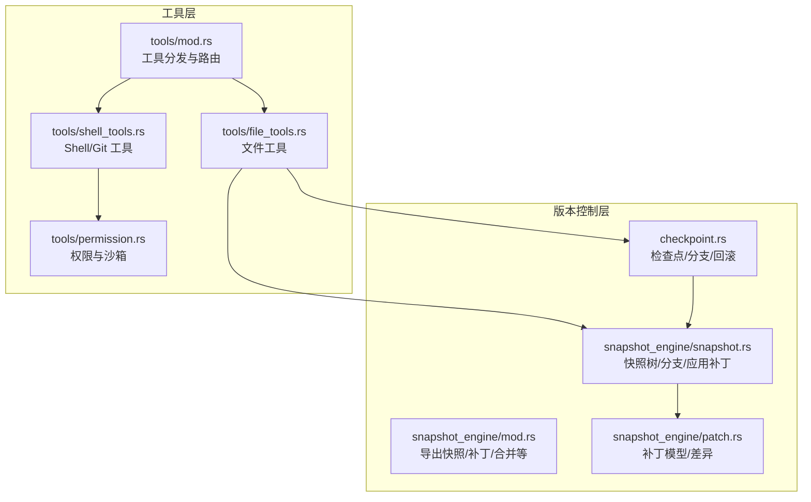
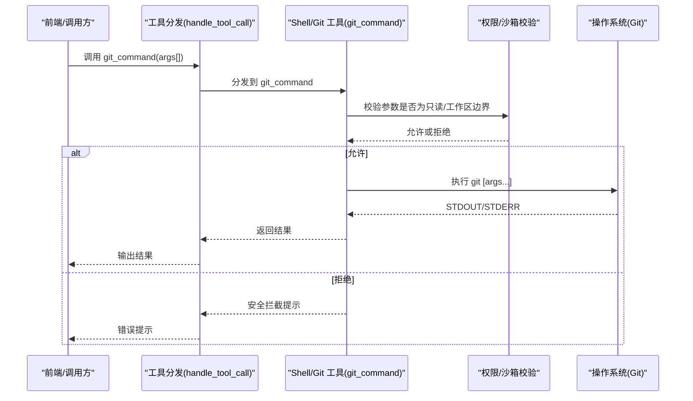
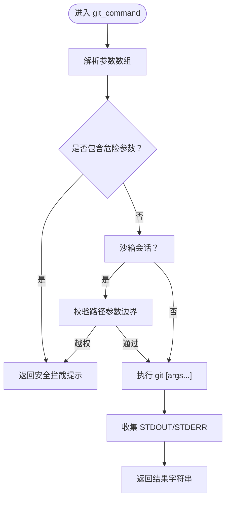
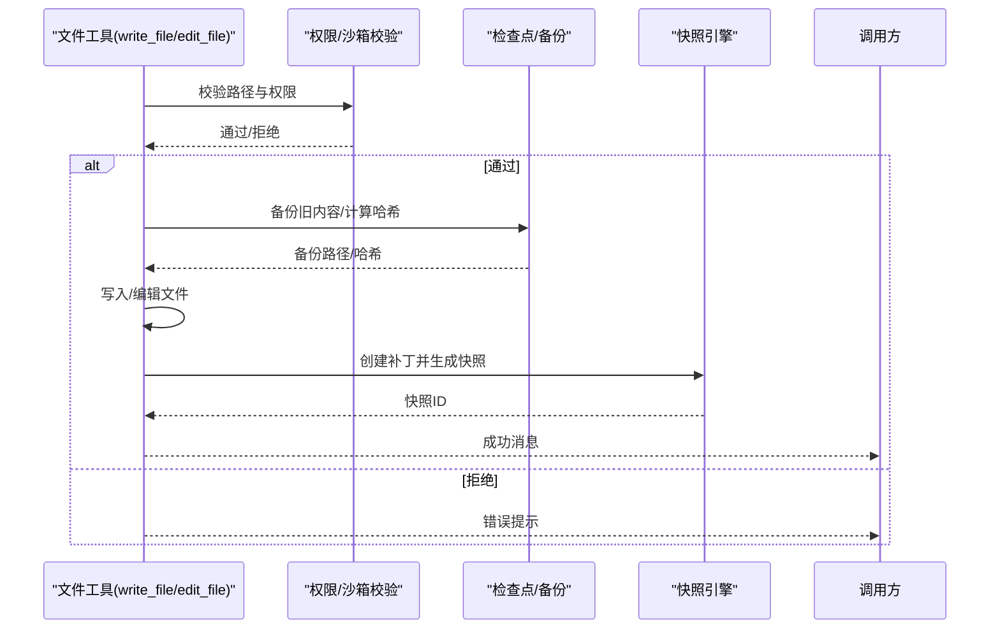
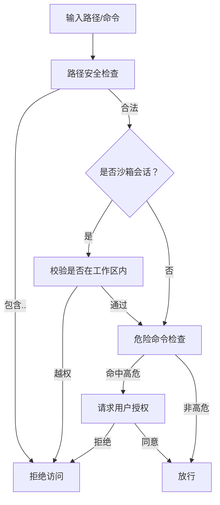
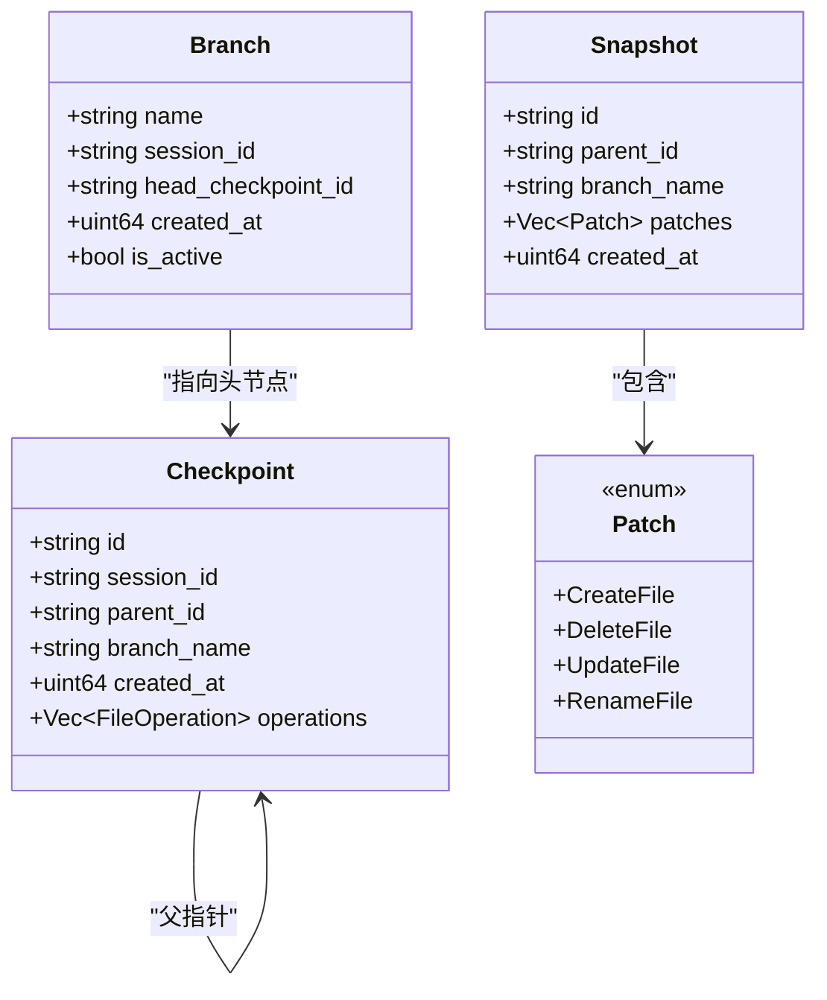
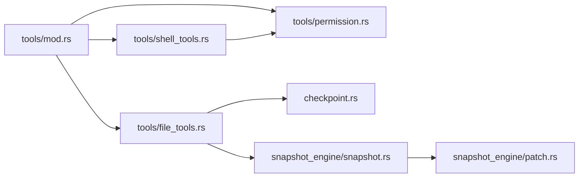

# Git 集成

<cite>
**本文档引用的文件**
- [src-tauri/src/core/tools/mod.rs](file://src-tauri/src/core/tools/mod.rs)
- [src-tauri/src/core/tools/shell_tools.rs](file://src-tauri/src/core/tools/shell_tools.rs)
- [src-tauri/src/core/tools/file_tools.rs](file://src-tauri/src/core/tools/file_tools.rs)
- [src-tauri/src/core/tools/permission.rs](file://src-tauri/src/core/tools/permission.rs)
- [src-tauri/src/core/checkpoint.rs](file://src-tauri/src/core/checkpoint.rs)
- [src-tauri/src/core/snapshot_engine/mod.rs](file://src-tauri/src/core/snapshot_engine/mod.rs)
- [src-tauri/src/core/snapshot_engine/snapshot.rs](file://src-tauri/src/core/snapshot_engine/snapshot.rs)
- [src-tauri/src/core/snapshot_engine/patch.rs](file://src-tauri/src/core/snapshot_engine/patch.rs)
- [src-tauri/src/main.rs](file://src-tauri/src/main.rs)
</cite>

## 目录
1. [简介](#简介)
2. [项目结构](#项目结构)
3. [核心组件](#核心组件)
4. [架构总览](#架构总览)
5. [详细组件分析](#详细组件分析)
6. [依赖关系分析](#依赖关系分析)
7. [性能考量](#性能考量)
8. [故障排查指南](#故障排查指南)
9. [结论](#结论)
10. [附录](#附录)

## 简介
本文件面向 JarvisAgent 的 Git 集成能力，系统性阐述其在 Tauri 后端中的实现方式与使用方法，覆盖以下方面：
- Git 操作支持：通过只读封装实现“查看状态、显示差异、查看日志、分支信息”等常用只读场景；明确禁止写入类命令（如 push、commit、reset 等）。
- 版本控制集成：结合检查点与快照引擎，提供文件级变更记录、备份、回滚与分支管理能力。
- 只读操作保护：通过路径白名单、沙箱边界校验、危险命令拦截与权限请求流程，确保不会误触破坏性操作。
- 命令封装与错误处理：统一的工具路由、参数校验、输出格式化与错误提示。
- 与文件系统的集成：文件读写、编辑、搜索、目录树生成与备份策略。
- 使用示例、最佳实践、常见问题排查与安全注意事项。

## 项目结构
与 Git 集成相关的核心模块位于 Tauri 后端的 core/tools 与 snapshot_engine 子系统中，采用“工具分发 + 权限校验 + 快照/检查点”的分层设计：
- 工具分发：统一入口负责路由不同工具（如 git_command、run_shell、background_run 等）。
- 权限与沙箱：路径合法性、工作区边界、危险命令拦截与用户授权。
- 快照与检查点：记录文件变更、备份、回滚、分支管理与视图展示。
- Git 封装：对 git 命令进行只读限制与参数安全校验。

图表来源
- [src-tauri/src/core/tools/mod.rs:158-236](file://src-tauri/src/core/tools/mod.rs#L158-L236)
- [src-tauri/src/core/tools/shell_tools.rs:132-181](file://src-tauri/src/core/tools/shell_tools.rs#L132-L181)
- [src-tauri/src/core/tools/file_tools.rs:148-223](file://src-tauri/src/core/tools/file_tools.rs#L148-L223)
- [src-tauri/src/core/tools/permission.rs:49-72](file://src-tauri/src/core/tools/permission.rs#L49-L72)
- [src-tauri/src/core/checkpoint.rs:281-314](file://src-tauri/src/core/checkpoint.rs#L281-L314)
- [src-tauri/src/core/snapshot_engine/mod.rs:1-14](file://src-tauri/src/core/snapshot_engine/mod.rs#L1-L14)
- [src-tauri/src/core/snapshot_engine/snapshot.rs:180-256](file://src-tauri/src/core/snapshot_engine/snapshot.rs#L180-L256)
- [src-tauri/src/core/snapshot_engine/patch.rs:5-25](file://src-tauri/src/core/snapshot_engine/patch.rs#L5-L25)

章节来源
- [src-tauri/src/core/tools/mod.rs:158-236](file://src-tauri/src/core/tools/mod.rs#L158-L236)
- [src-tauri/src/core/tools/shell_tools.rs:132-181](file://src-tauri/src/core/tools/shell_tools.rs#L132-L181)
- [src-tauri/src/core/tools/file_tools.rs:148-223](file://src-tauri/src/core/tools/file_tools.rs#L148-L223)
- [src-tauri/src/core/tools/permission.rs:49-72](file://src-tauri/src/core/tools/permission.rs#L49-L72)
- [src-tauri/src/core/checkpoint.rs:281-314](file://src-tauri/src/core/checkpoint.rs#L281-L314)
- [src-tauri/src/core/snapshot_engine/mod.rs:1-14](file://src-tauri/src/core/snapshot_engine/mod.rs#L1-L14)
- [src-tauri/src/core/snapshot_engine/snapshot.rs:180-256](file://src-tauri/src/core/snapshot_engine/snapshot.rs#L180-L256)
- [src-tauri/src/core/snapshot_engine/patch.rs:5-25](file://src-tauri/src/core/snapshot_engine/patch.rs#L5-L25)

## 核心组件
- 工具分发与路由：集中注册与分发工具调用，包括 git_command、run_shell、background_run 等。
- Git 命令封装：只读模式，拦截危险参数，校验工作区边界。
- 文件工具：读取、骨架提取、写入、编辑、目录列举、仓库搜索与目录树生成，并配套备份与快照。
- 权限与沙箱：路径合法性、工作区边界、危险命令拦截、用户授权请求。
- 快照与检查点：记录文件变更、备份、回滚、分支管理与视图展示。
- 补丁模型：抽象文件增删改、重命名与差异表示，支持补丁应用/撤销与摘要统计。

章节来源
- [src-tauri/src/core/tools/mod.rs:158-236](file://src-tauri/src/core/tools/mod.rs#L158-L236)
- [src-tauri/src/core/tools/shell_tools.rs:132-181](file://src-tauri/src/core/tools/shell_tools.rs#L132-L181)
- [src-tauri/src/core/tools/file_tools.rs:43-94](file://src-tauri/src/core/tools/file_tools.rs#L43-L94)
- [src-tauri/src/core/tools/permission.rs:49-72](file://src-tauri/src/core/tools/permission.rs#L49-L72)
- [src-tauri/src/core/checkpoint.rs:281-314](file://src-tauri/src/core/checkpoint.rs#L281-L314)
- [src-tauri/src/core/snapshot_engine/snapshot.rs:180-256](file://src-tauri/src/core/snapshot_engine/snapshot.rs#L180-L256)
- [src-tauri/src/core/snapshot_engine/patch.rs:5-25](file://src-tauri/src/core/snapshot_engine/patch.rs#L5-L25)

## 架构总览
Git 集成以“只读封装 + 权限校验 + 变更记录”为核心原则：
- 用户通过工具分发调用 git_command，传入参数数组。
- 封装器对参数进行只读校验与工作区边界检查，拒绝写入类命令。
- 执行 git 命令并返回标准输出与错误输出。
- 文件工具在写入/编辑时自动备份、记录操作、生成补丁并创建快照，便于后续回滚与审计。

图表来源
- [src-tauri/src/core/tools/mod.rs:158-236](file://src-tauri/src/core/tools/mod.rs#L158-L236)
- [src-tauri/src/core/tools/shell_tools.rs:132-181](file://src-tauri/src/core/tools/shell_tools.rs#L132-L181)
- [src-tauri/src/core/tools/permission.rs:49-72](file://src-tauri/src/core/tools/permission.rs#L49-L72)

## 详细组件分析

### Git 命令封装（只读）
- 功能定位：仅支持只读 Git 操作，拦截写入类参数（如 push、commit、rebase、reset、revert、clean、checkout 等）。
- 参数校验：逐项检查参数是否包含危险关键字，若命中则直接返回安全拦截提示。
- 工作区边界：在沙箱会话中，对路径参数进行边界校验，防止越权访问。
- 执行与输出：在当前工作目录执行 git 命令，捕获标准输出与错误输出并统一格式返回。

图表来源
- [src-tauri/src/core/tools/shell_tools.rs:132-181](file://src-tauri/src/core/tools/shell_tools.rs#L132-L181)
- [src-tauri/src/core/tools/permission.rs:30-47](file://src-tauri/src/core/tools/permission.rs#L30-L47)

章节来源
- [src-tauri/src/core/tools/shell_tools.rs:132-181](file://src-tauri/src/core/tools/shell_tools.rs#L132-L181)
- [src-tauri/src/core/tools/permission.rs:30-47](file://src-tauri/src/core/tools/permission.rs#L30-L47)

### 文件工具与变更记录（备份/快照）
- 写入与编辑：在写入/编辑前进行权限校验与路径边界检查；自动备份旧内容，计算内容哈希，记录操作类型与摘要。
- 快照创建：将文件变更转换为补丁并创建快照，支持后续回滚与审计。
- 目录与搜索：支持目录列举、仓库搜索与目录树生成，过滤无关文件与目录。

图表来源
- [src-tauri/src/core/tools/file_tools.rs:148-223](file://src-tauri/src/core/tools/file_tools.rs#L148-L223)
- [src-tauri/src/core/checkpoint.rs:416-440](file://src-tauri/src/core/checkpoint.rs#L416-L440)
- [src-tauri/src/core/snapshot_engine/snapshot.rs:218-256](file://src-tauri/src/core/snapshot_engine/snapshot.rs#L218-L256)

章节来源
- [src-tauri/src/core/tools/file_tools.rs:148-223](file://src-tauri/src/core/tools/file_tools.rs#L148-L223)
- [src-tauri/src/core/checkpoint.rs:416-440](file://src-tauri/src/core/checkpoint.rs#L416-L440)
- [src-tauri/src/core/snapshot_engine/snapshot.rs:218-256](file://src-tauri/src/core/snapshot_engine/snapshot.rs#L218-L256)

### 权限与沙箱控制
- 路径安全：禁止包含“..”的路径穿越；对绝对/相对路径进行规范化比较。
- 工作区边界：在沙箱会话中，严格限制命令与文件操作仅限于工作区目录。
- 危险命令拦截：对删除、重启、重置、清理等高危命令进行拦截，并支持用户授权请求。
- 会话授权：支持一次性授权，避免重复弹窗。

图表来源
- [src-tauri/src/core/tools/permission.rs:49-72](file://src-tauri/src/core/tools/permission.rs#L49-L72)
- [src-tauri/src/core/tools/shell_tools.rs:77-88](file://src-tauri/src/core/tools/shell_tools.rs#L77-L88)

章节来源
- [src-tauri/src/core/tools/permission.rs:49-72](file://src-tauri/src/core/tools/permission.rs#L49-L72)
- [src-tauri/src/core/tools/shell_tools.rs:77-88](file://src-tauri/src/core/tools/shell_tools.rs#L77-L88)

### 快照与检查点（分支/回滚/视图）
- 分支管理：默认分支 main，支持创建、切换、删除（不可删除活跃分支与主分支）。
- 检查点：记录会话内的文件操作链，支持回滚到任意检查点。
- 快照树：以补丁为单位构建快照树，支持分支视图与补丁计数。
- 回滚：逆序应用检查点链，基于备份恢复文件。

图表来源
- [src-tauri/src/core/checkpoint.rs:14-62](file://src-tauri/src/core/checkpoint.rs#L14-L62)
- [src-tauri/src/core/snapshot_engine/snapshot.rs:6-46](file://src-tauri/src/core/snapshot_engine/snapshot.rs#L6-L46)
- [src-tauri/src/core/snapshot_engine/patch.rs:5-25](file://src-tauri/src/core/snapshot_engine/patch.rs#L5-L25)

章节来源
- [src-tauri/src/core/checkpoint.rs:154-277](file://src-tauri/src/core/checkpoint.rs#L154-L277)
- [src-tauri/src/core/checkpoint.rs:281-314](file://src-tauri/src/core/checkpoint.rs#L281-L314)
- [src-tauri/src/core/checkpoint.rs:455-500](file://src-tauri/src/core/checkpoint.rs#L455-L500)
- [src-tauri/src/core/snapshot_engine/snapshot.rs:194-321](file://src-tauri/src/core/snapshot_engine/snapshot.rs#L194-L321)
- [src-tauri/src/core/snapshot_engine/patch.rs:5-25](file://src-tauri/src/core/snapshot_engine/patch.rs#L5-L25)

## 依赖关系分析
- 工具分发依赖权限模块进行路径与命令安全校验，依赖文件工具进行文件级操作，依赖快照引擎进行变更记录。
- 文件工具依赖检查点模块进行备份与回滚，依赖快照引擎生成快照。
- 快照引擎依赖补丁模块进行补丁应用/撤销与差异表示。
- 权限模块依赖会话管理器进行授权请求与状态维护。

图表来源
- [src-tauri/src/core/tools/mod.rs:158-236](file://src-tauri/src/core/tools/mod.rs#L158-L236)
- [src-tauri/src/core/tools/shell_tools.rs:132-181](file://src-tauri/src/core/tools/shell_tools.rs#L132-L181)
- [src-tauri/src/core/tools/file_tools.rs:148-223](file://src-tauri/src/core/tools/file_tools.rs#L148-L223)
- [src-tauri/src/core/tools/permission.rs:49-72](file://src-tauri/src/core/tools/permission.rs#L49-L72)
- [src-tauri/src/core/checkpoint.rs:281-314](file://src-tauri/src/core/checkpoint.rs#L281-L314)
- [src-tauri/src/core/snapshot_engine/snapshot.rs:180-256](file://src-tauri/src/core/snapshot_engine/snapshot.rs#L180-L256)
- [src-tauri/src/core/snapshot_engine/patch.rs:5-25](file://src-tauri/src/core/snapshot_engine/patch.rs#L5-L25)

章节来源
- [src-tauri/src/core/tools/mod.rs:158-236](file://src-tauri/src/core/tools/mod.rs#L158-L236)
- [src-tauri/src/core/tools/shell_tools.rs:132-181](file://src-tauri/src/core/tools/shell_tools.rs#L132-L181)
- [src-tauri/src/core/tools/file_tools.rs:148-223](file://src-tauri/src/core/tools/file_tools.rs#L148-L223)
- [src-tauri/src/core/tools/permission.rs:49-72](file://src-tauri/src/core/tools/permission.rs#L49-L72)
- [src-tauri/src/core/checkpoint.rs:281-314](file://src-tauri/src/core/checkpoint.rs#L281-L314)
- [src-tauri/src/core/snapshot_engine/snapshot.rs:180-256](file://src-tauri/src/core/snapshot_engine/snapshot.rs#L180-L256)
- [src-tauri/src/core/snapshot_engine/patch.rs:5-25](file://src-tauri/src/core/snapshot_engine/patch.rs#L5-L25)

## 性能考量
- Git 只读命令通常轻量，但涉及大仓库时建议限制输出范围（例如仅查看最近日志或特定文件差异）。
- 文件搜索与目录树生成会递归遍历，建议设置合理上限与过滤规则，避免对大型仓库造成性能压力。
- 快照与检查点存储为 JSON 文件，频繁写入可能影响磁盘 I/O；建议定期清理不必要的历史快照。
- 备份策略按内容哈希命名，重复内容不会重复写入，有助于节省空间。

## 故障排查指南
- 执行 git 命令报“安全拦截”：确认传入参数是否包含写入类关键字（如 push、commit、reset 等），只读封装不允许此类操作。
- 路径越权/沙箱限制：在沙箱会话中，命令或文件路径必须在工作区内；请检查参数路径与工作区配置。
- 文件被占用/权限不足：读取/写入/编辑失败时，系统会提示文件可能被其他进程占用或权限不足；请关闭占用程序或调整权限。
- 高危命令被拦截：删除、重启、重置、清理等命令会被拦截；如确需执行，请在非沙箱会话中谨慎操作并配合授权请求。
- 回滚失败：检查目标检查点是否存在、备份文件是否完整；必要时重新创建检查点后再尝试回滚。

章节来源
- [src-tauri/src/core/tools/shell_tools.rs:132-181](file://src-tauri/src/core/tools/shell_tools.rs#L132-L181)
- [src-tauri/src/core/tools/permission.rs:49-72](file://src-tauri/src/core/tools/permission.rs#L49-L72)
- [src-tauri/src/core/tools/file_tools.rs:57-94](file://src-tauri/src/core/tools/file_tools.rs#L57-L94)
- [src-tauri/src/core/checkpoint.rs:455-500](file://src-tauri/src/core/checkpoint.rs#L455-L500)

## 结论
JarvisAgent 的 Git 集成以“只读封装 + 权限校验 + 变更记录”为核心设计，既满足了版本控制信息的只读需求，又通过备份、快照与检查点提供了可靠的回滚与审计能力。配合严格的沙箱与权限控制，有效避免了误操作带来的破坏性影响。对于需要写入类 Git 操作的场景，建议通过非沙箱会话或专用工具链进行，并配合用户授权与审慎操作流程。

## 附录

### 使用示例（步骤说明）
- 只读查看仓库状态：调用工具分发，传入 git_command 并提供只读参数（如 log、status、diff 等），系统将进行参数与路径校验后执行。
- 查看分支信息：传入只读参数以列出分支与头指针信息。
- 文件写入与编辑：通过文件工具进行写入/编辑，系统将自动备份旧内容、记录操作并生成快照。
- 回滚到检查点：根据会话与分支信息定位目标检查点，执行回滚操作以恢复文件。

章节来源
- [src-tauri/src/core/tools/mod.rs:158-236](file://src-tauri/src/core/tools/mod.rs#L158-L236)
- [src-tauri/src/core/tools/shell_tools.rs:132-181](file://src-tauri/src/core/tools/shell_tools.rs#L132-L181)
- [src-tauri/src/core/tools/file_tools.rs:148-223](file://src-tauri/src/core/tools/file_tools.rs#L148-L223)
- [src-tauri/src/core/checkpoint.rs:455-500](file://src-tauri/src/core/checkpoint.rs#L455-L500)

### 最佳实践
- 优先使用只读 Git 命令进行信息查询，避免在自动化流程中直接执行写入类命令。
- 在沙箱会话中进行文件操作时，确保路径在工作区内，避免跨目录访问。
- 对大仓库执行搜索与目录树生成时，设置合理的过滤条件与上限，减少 I/O 压力。
- 定期审查快照与检查点数量，清理不再需要的历史记录以释放空间。

### 安全注意事项
- 严格区分“只读封装”与“写入工具”，不要将只读封装用于写入类操作。
- 对高危命令（删除、重置、清理等）启用权限请求流程，避免误操作。
- 在非沙箱会话中执行潜在危险命令时，务必进行充分测试与备份。