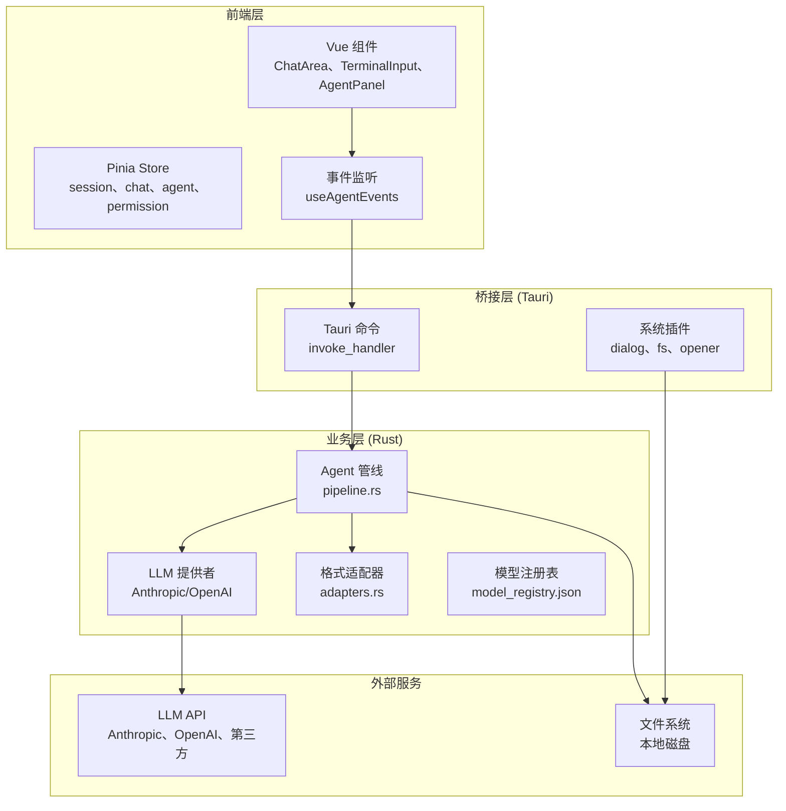
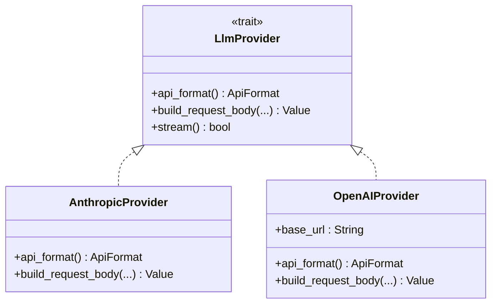
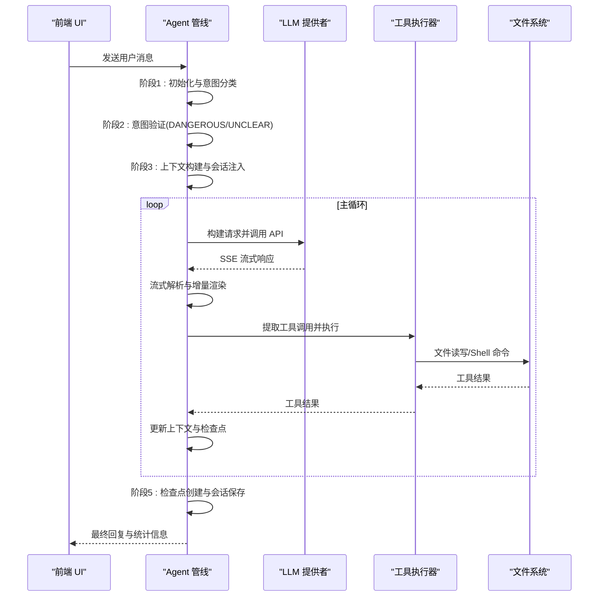
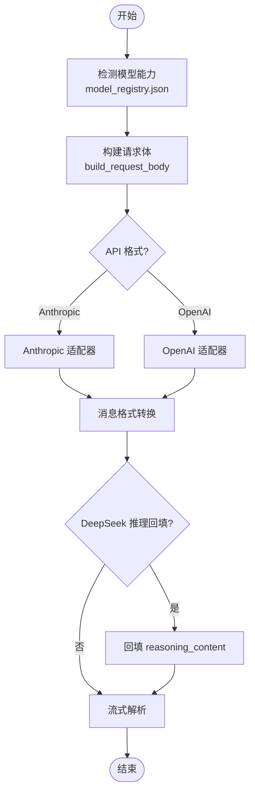
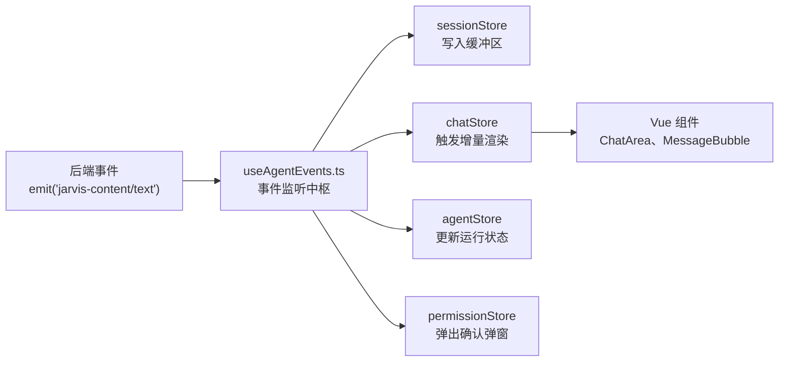
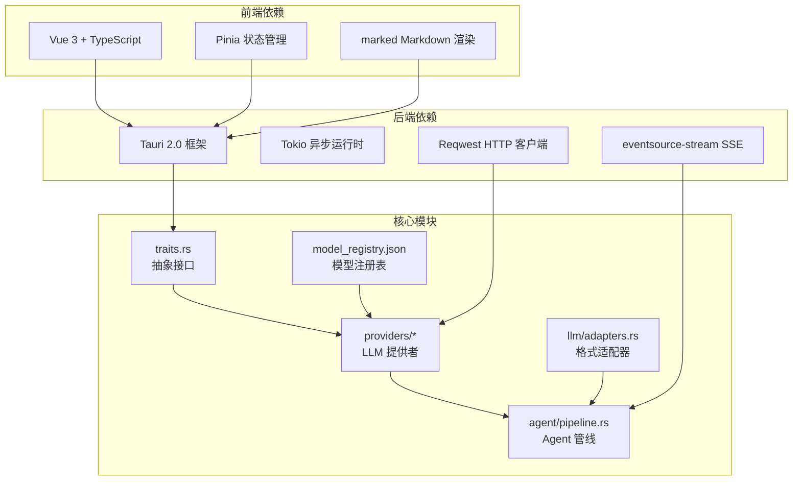

# LLM 集成系统

<cite>
**本文档引用的文件**
- [README.md](file://README.md)
- [package.json](file://package.json)
- [src/main.ts](file://src/main.ts)
- [src/App.vue](file://src/App.vue)
- [src/types/index.ts](file://src/types/index.ts)
- [src-tauri/Cargo.toml](file://src-tauri/Cargo.toml)
- [src-tauri/src/main.rs](file://src-tauri/src/main.rs)
- [src-tauri/src/lib.rs](file://src-tauri/src/lib.rs)
- [src-tauri/model_registry.json](file://src-tauri/model_registry.json)
- [src-tauri/src/core/traits.rs](file://src-tauri/src/core/traits.rs)
- [src-tauri/src/core/providers/mod.rs](file://src-tauri/src/core/providers/mod.rs)
- [src-tauri/src/core/providers/anthropic.rs](file://src-tauri/src/core/providers/anthropic.rs)
- [src-tauri/src/core/providers/openai.rs](file://src-tauri/src/core/providers/openai.rs)
- [src-tauri/src/core/llm/adapters.rs](file://src-tauri/src/core/llm/adapters.rs)
- [src-tauri/src/core/agent/pipeline.rs](file://src-tauri/src/core/agent/pipeline.rs)
</cite>

## 目录
1. [简介](#简介)
2. [项目结构](#项目结构)
3. [核心组件](#核心组件)
4. [架构总览](#架构总览)
5. [详细组件分析](#详细组件分析)
6. [依赖关系分析](#依赖关系分析)
7. [性能考虑](#性能考虑)
8. [故障排除指南](#故障排除指南)
9. [结论](#结论)

## 简介
本项目是一个基于 Tauri 2.0 + Vue 3 + Rust 的桌面端 AI 编程助手，支持 20+ 主流 LLM 模型，具备完整的 Agent 自主循环、快照版本控制、多 Agent 沙箱、方案审批等企业级能力。系统通过统一的 LLM Provider 抽象抹平不同 API 格式差异，提供流式 SSE 输出、增量渲染、权限控制与安全防护。

## 项目结构
项目采用前后端分离架构，前端使用 Vue 3 + TypeScript，后端使用 Rust + Tokio 异步运行时，通过 Tauri 桥接实现桌面应用集成。

```mermaid
graph TB
subgraph "前端 (Vue 3)"
FE_Main["src/main.ts<br/>应用入口"]
FE_App["src/App.vue<br/>根组件"]
FE_Types["src/types/index.ts<br/>类型定义"]
FE_Components["组件库<br/>chat/、common/、layout/ 等"]
FE_Stores["状态管理<br/>session、chat、agent、permission"]
end
subgraph "后端 (Rust)"
BE_Main["src-tauri/src/main.rs<br/>Tauri 入口"]
BE_Lib["src-tauri/src/lib.rs<br/>应用初始化"]
BE_Core["src-tauri/src/core/<br/>核心模块"]
BE_Providers["LLM 提供者<br/>providers/anthropic.rs、providers/openai.rs"]
BE_Traits["抽象接口<br/>core/traits.rs"]
BE_Pipeline["Agent 管线<br/>core/agent/pipeline.rs"]
BE_Adapters["格式适配器<br/>core/llm/adapters.rs"]
BE_Models["模型注册表<br/>model_registry.json"]
end
FE_Main --> FE_App
FE_App --> FE_Components
FE_App --> FE_Stores
FE_App --> FE_Types
BE_Main --> BE_Lib
BE_Lib --> BE_Core
BE_Core --> BE_Providers
BE_Core --> BE_Traits
BE_Core --> BE_Pipeline
BE_Core --> BE_Adapters
BE_Core --> BE_Models
```

**图表来源**
- [src/main.ts:1-9](file://src/main.ts#L1-L9)
- [src/App.vue:1-294](file://src/App.vue#L1-L294)
- [src-tauri/src/main.rs:1-23](file://src-tauri/src/main.rs#L1-L23)
- [src-tauri/src/lib.rs:1-227](file://src-tauri/src/lib.rs#L1-L227)

**章节来源**
- [README.md:96-170](file://README.md#L96-L170)
- [package.json:1-29](file://package.json#L1-L29)
- [src-tauri/Cargo.toml:1-42](file://src-tauri/Cargo.toml#L1-L42)

## 核心组件
系统的核心组件包括：

- **LLM Provider 抽象层**：通过 `LlmProvider` trait 统一 Anthropic Messages API 与 OpenAI Chat Completions API 的差异，支持扩展思考模式与多模态输入。
- **Agent 管线**：实现 5 阶段执行流水线，包含初始化、意图验证、上下文构建、主循环（压缩→请求→流式→工具调用）与收尾。
- **格式适配器**：处理 Anthropic 与 OpenAI 格式之间的双向转换，支持 DeepSeek 推理内容回填与流式工具输入规范化。
- **模型注册表**：集中管理各厂商模型的能力特性，动态适配思考模式参数。
- **前端事件架构**：通过 `useAgentEvents` 监听后端事件，分发到各 Pinia Store，实现增量渲染与状态同步。

**章节来源**
- [src-tauri/src/core/traits.rs:1-60](file://src-tauri/src/core/traits.rs#L1-L60)
- [src-tauri/src/core/agent/pipeline.rs:1-800](file://src-tauri/src/core/agent/pipeline.rs#L1-L800)
- [src-tauri/src/core/llm/adapters.rs:1-275](file://src-tauri/src/core/llm/adapters.rs#L1-L275)
- [src-tauri/model_registry.json:1-496](file://src-tauri/model_registry.json#L1-L496)
- [README.md:172-234](file://README.md#L172-L234)

## 架构总览
系统采用分层架构，前端负责用户交互与状态管理，后端负责业务逻辑与 LLM 集成，通过 Tauri 命令桥接实现跨语言通信。

**图表来源**
- [src-tauri/src/lib.rs:150-226](file://src-tauri/src/lib.rs#L150-L226)
- [src-tauri/src/core/agent/pipeline.rs:1-800](file://src-tauri/src/core/agent/pipeline.rs#L1-L800)
- [src-tauri/src/core/providers/anthropic.rs:1-63](file://src-tauri/src/core/providers/anthropic.rs#L1-L63)
- [src-tauri/src/core/providers/openai.rs:1-120](file://src-tauri/src/core/providers/openai.rs#L1-L120)

## 详细组件分析

### LLM Provider 抽象与实现
系统通过 `LlmProvider` trait 抽象不同 LLM 提供者的 API 差异，具体实现包括 Anthropic Messages API 与 OpenAI 兼容格式。

**图表来源**
- [src-tauri/src/core/traits.rs:25-47](file://src-tauri/src/core/traits.rs#L25-L47)
- [src-tauri/src/core/providers/anthropic.rs:15-62](file://src-tauri/src/core/providers/anthropic.rs#L15-L62)
- [src-tauri/src/core/providers/openai.rs:24-119](file://src-tauri/src/core/providers/openai.rs#L24-L119)

**章节来源**
- [src-tauri/src/core/traits.rs:1-60](file://src-tauri/src/core/traits.rs#L1-L60)
- [src-tauri/src/core/providers/anthropic.rs:1-63](file://src-tauri/src/core/providers/anthropic.rs#L1-L63)
- [src-tauri/src/core/providers/openai.rs:1-120](file://src-tauri/src/core/providers/openai.rs#L1-L120)

### Agent 管线执行流程
Agent 管线实现完整的 5 阶段执行流程，包含意图验证、上下文构建、主循环与收尾。

**图表来源**
- [src-tauri/src/core/agent/pipeline.rs:201-800](file://src-tauri/src/core/agent/pipeline.rs#L201-L800)

**章节来源**
- [src-tauri/src/core/agent/pipeline.rs:1-800](file://src-tauri/src/core/agent/pipeline.rs#L1-L800)

### 格式适配器与模型注册表
格式适配器负责 Anthropic 与 OpenAI 格式之间的双向转换，模型注册表集中管理各厂商模型的能力特性。

**图表来源**
- [src-tauri/src/core/llm/adapters.rs:96-275](file://src-tauri/src/core/llm/adapters.rs#L96-L275)
- [src-tauri/model_registry.json:1-496](file://src-tauri/model_registry.json#L1-L496)

**章节来源**
- [src-tauri/src/core/llm/adapters.rs:1-275](file://src-tauri/src/core/llm/adapters.rs#L1-L275)
- [src-tauri/model_registry.json:1-496](file://src-tauri/model_registry.json#L1-L496)

### 前端事件架构与状态管理
前端通过 `useAgentEvents` 监听后端事件，分发到各 Pinia Store，实现增量渲染与状态同步。

**图表来源**
- [README.md:223-234](file://README.md#L223-L234)

**章节来源**
- [README.md:223-234](file://README.md#L223-L234)

## 依赖关系分析
系统依赖关系清晰，前后端通过 Tauri 命令桥接，后端模块之间耦合度低，职责分离明确。

**图表来源**
- [package.json:12-28](file://package.json#L12-L28)
- [src-tauri/Cargo.toml:20-42](file://src-tauri/Cargo.toml#L20-L42)
- [src-tauri/src/lib.rs:150-226](file://src-tauri/src/lib.rs#L150-L226)

**章节来源**
- [package.json:1-29](file://package.json#L1-L29)
- [src-tauri/Cargo.toml:1-42](file://src-tauri/Cargo.toml#L1-L42)
- [src-tauri/src/lib.rs:1-227](file://src-tauri/src/lib.rs#L1-L227)

## 性能考虑
系统在多个层面进行了性能优化：

- **增量 Markdown 渲染**：采用 30fps 节流与稳定内容缓存，仅对尾部进行实时重渲染，大幅降低 CPU 占用。
- **流式 SSE 处理**：使用 `eventsource-stream` 实现流式 API 调用，支持断点续传与实时反馈。
- **异步运行时**：Rust + Tokio 提供高效的异步运行时，避免阻塞主线程。
- **内存压缩**：在 Agent 循环中自动进行上下文压缩，控制 token 使用量。
- **取消机制**：通过 `CancellationToken` 支持随时中断正在执行的任务。

## 故障排除指南
系统提供了完善的错误处理与调试机制：

- **配置错误**：当未配置 API Key 时，会返回配置错误提示，引导用户在设置中填写。
- **危险操作确认**：检测到潜在危险操作意图时，会弹出确认对话框，用户可拒绝执行。
- **意图不明确**：当意图分类为 UNCLEAR 时，系统会提示用户澄清需求。
- **循环保护**：超过最大循环次数时会暂停确认，绝对上限 500 轮防止死循环。
- **调试日志**：提供详细的请求/响应日志与思考过程记录，便于问题定位。

**章节来源**
- [src-tauri/src/core/agent/pipeline.rs:311-355](file://src-tauri/src/core/agent/pipeline.rs#L311-L355)
- [src-tauri/src/core/agent/pipeline.rs:407-639](file://src-tauri/src/core/agent/pipeline.rs#L407-L639)

## 结论
本 LLM 集成系统通过清晰的分层架构与抽象设计，成功实现了多模型支持、统一 Provider 抽象、完整的 Agent 自主循环与企业级安全特性。系统在性能、可扩展性与用户体验方面均表现出色，为桌面端 AI 编程助手提供了坚实的技术基础。