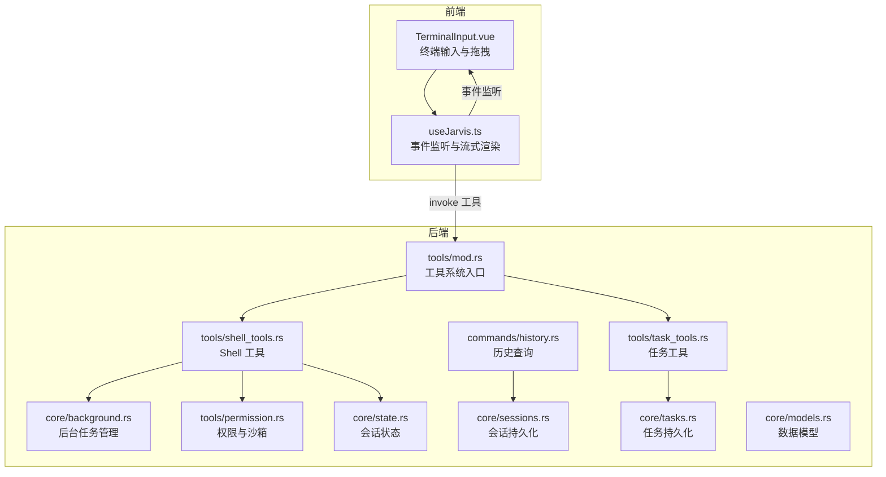
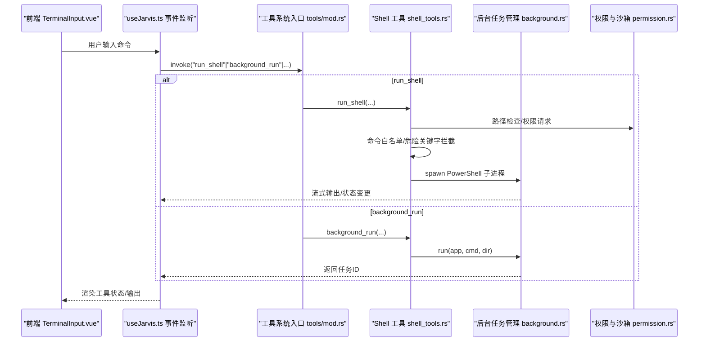
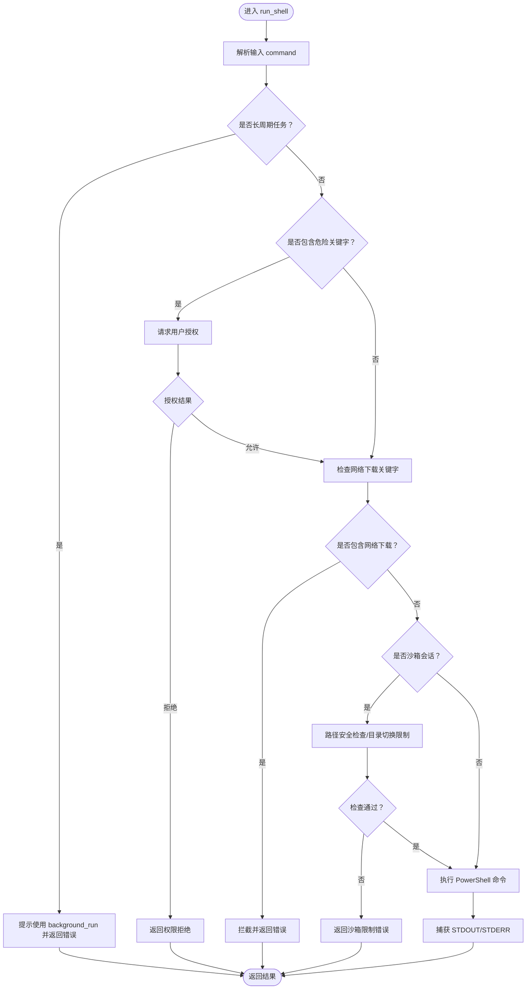
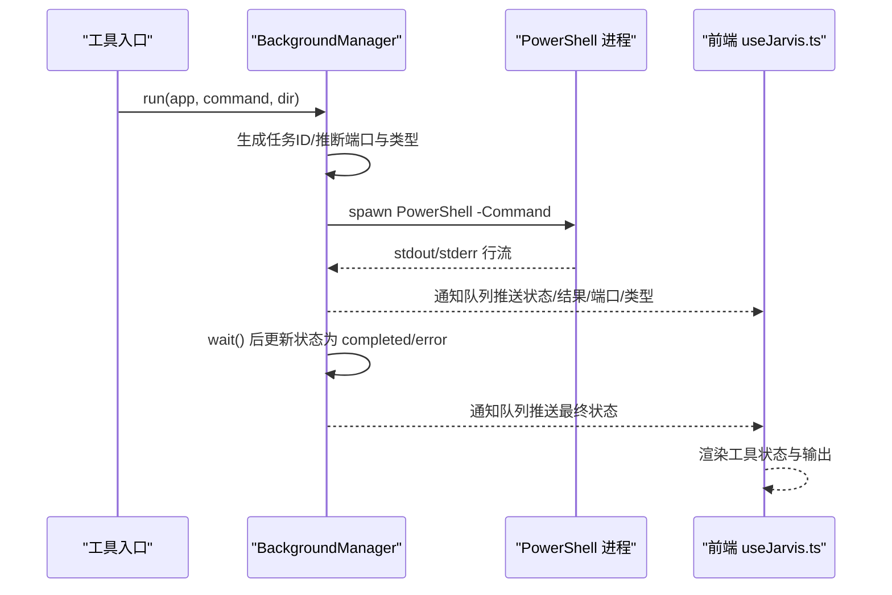
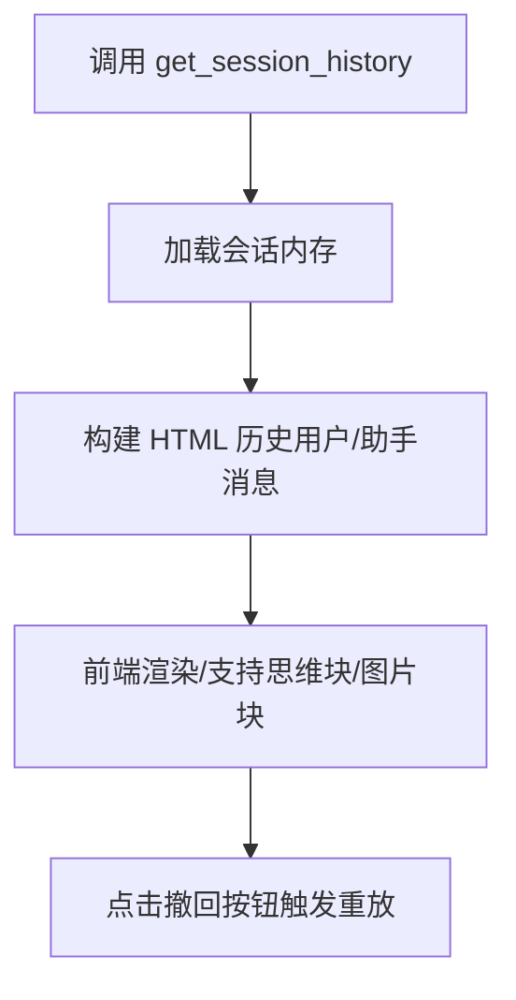
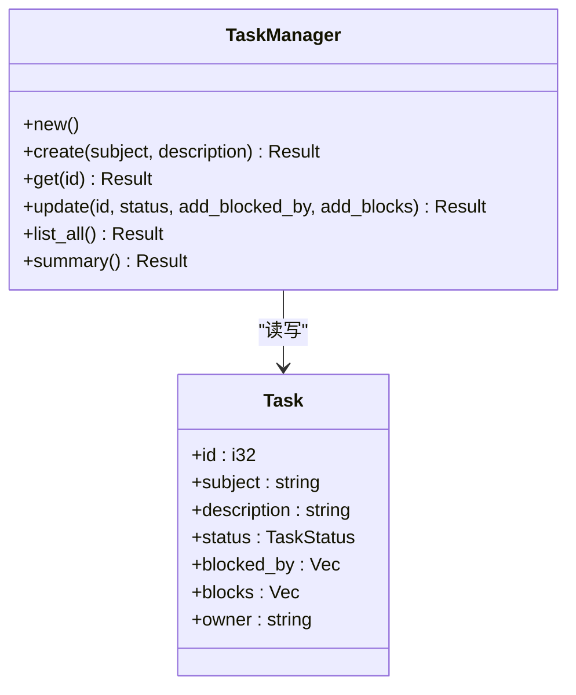
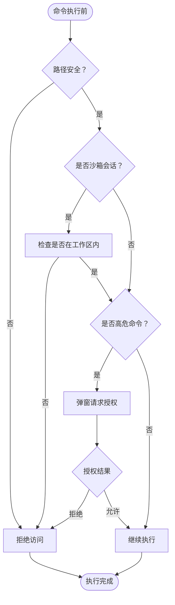
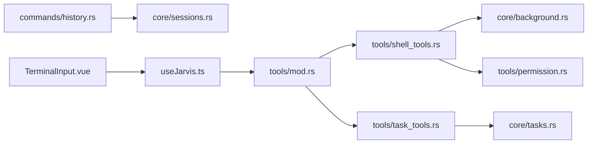

# Shell 集成

<cite>
**本文引用的文件**
- [shell_tools.rs](file://src-tauri/src/core/tools/shell_tools.rs)
- [background.rs](file://src-tauri/src/core/background.rs)
- [history.rs](file://src-tauri/src/core/commands/history.rs)
- [mod.rs（工具系统入口）](file://src-tauri/src/core/tools/mod.rs)
- [permission.rs](file://src-tauri/src/core/tools/permission.rs)
- [state.rs](file://src-tauri/src/core/state.rs)
- [sessions.rs](file://src-tauri/src/core/sessions.rs)
- [task_tools.rs](file://src-tauri/src/core/tools/task_tools.rs)
- [tasks.rs](file://src-tauri/src/core/tasks.rs)
- [models.rs](file://src-tauri/src/core/models.rs)
- [main.rs](file://src-tauri/src/main.rs)
- [TerminalInput.vue](file://src/components/chat/TerminalInput.vue)
- [useJarvis.ts](file://src/composables/useJarvis.ts)
</cite>

## 目录
1. [简介](#简介)
2. [项目结构](#项目结构)
3. [核心组件](#核心组件)
4. [架构总览](#架构总览)
5. [详细组件分析](#详细组件分析)
6. [依赖分析](#依赖分析)
7. [性能考虑](#性能考虑)
8. [故障排查指南](#故障排查指南)
9. [结论](#结论)
10. [附录](#附录)

## 简介
本文件面向 JarvisAgent 的 Shell 集成系统，围绕以下目标展开：
- 命令执行机制：Windows PowerShell 集成、命令解析与输出捕获
- 后台任务管理：异步执行、任务监控、资源控制
- 历史记录：历史保存、搜索、重放能力
- Shell 工具实现原理、跨平台兼容性处理、安全防护（命令白名单、执行限制）
- 使用示例、性能优化建议、调试技巧与安全最佳实践

## 项目结构
Shell 集成主要由 Rust 后端与前端交互层组成：
- 后端（Tauri）：工具系统入口、Shell 工具、后台任务管理、权限与沙箱、会话与历史、任务管理
- 前端（Vue + Tauri）：终端输入、事件监听、流式渲染、权限弹窗

图表来源
- [TerminalInput.vue](file://src/components/chat/TerminalInput.vue)
- [useJarvis.ts](file://src/composables/useJarvis.ts)
- [mod.rs（工具系统入口）](file://src-tauri/src/core/tools/mod.rs)
- [shell_tools.rs](file://src-tauri/src/core/tools/shell_tools.rs)
- [background.rs](file://src-tauri/src/core/background.rs)
- [permission.rs](file://src-tauri/src/core/tools/permission.rs)
- [state.rs](file://src-tauri/src/core/state.rs)
- [sessions.rs](file://src-tauri/src/core/sessions.rs)
- [history.rs](file://src-tauri/src/core/commands/history.rs)
- [task_tools.rs](file://src-tauri/src/core/tools/task_tools.rs)
- [tasks.rs](file://src-tauri/src/core/tasks.rs)
- [models.rs](file://src-tauri/src/core/models.rs)

章节来源
- [main.rs:1-7](file://src-tauri/src/main.rs#L1-L7)
- [mod.rs（工具系统入口）:1-454](file://src-tauri/src/core/tools/mod.rs#L1-L454)
- [shell_tools.rs:1-222](file://src-tauri/src/core/tools/shell_tools.rs#L1-L222)
- [background.rs:1-297](file://src-tauri/src/core/background.rs#L1-L297)
- [permission.rs:1-103](file://src-tauri/src/core/tools/permission.rs#L1-L103)
- [state.rs:1-78](file://src-tauri/src/core/state.rs#L1-L78)
- [sessions.rs:1-499](file://src-tauri/src/core/sessions.rs#L1-L499)
- [history.rs:1-151](file://src-tauri/src/core/commands/history.rs#L1-L151)
- [task_tools.rs:1-74](file://src-tauri/src/core/tools/task_tools.rs#L1-L74)
- [tasks.rs:1-241](file://src-tauri/src/core/tasks.rs#L1-L241)
- [models.rs:1-256](file://src-tauri/src/core/models.rs#L1-L256)
- [TerminalInput.vue:1-886](file://src/components/chat/TerminalInput.vue#L1-L886)
- [useJarvis.ts:1-1354](file://src/composables/useJarvis.ts#L1-L1354)

## 核心组件
- Shell 工具模块：run_shell、git_command、background_run、check_background
- 后台任务管理：任务生命周期、状态跟踪、通知队列、端口与类型推断
- 权限与沙箱：路径安全检查、工作区边界校验、用户授权请求
- 历史记录：会话持久化、消息过滤、历史 HTML 渲染
- 任务管理：任务创建、更新、列表、摘要与依赖传播
- 数据模型：消息、内容块、任务状态、会话元信息

章节来源
- [shell_tools.rs:49-130](file://src-tauri/src/core/tools/shell_tools.rs#L49-L130)
- [shell_tools.rs:132-181](file://src-tauri/src/core/tools/shell_tools.rs#L132-L181)
- [shell_tools.rs:183-222](file://src-tauri/src/core/tools/shell_tools.rs#L183-L222)
- [background.rs](file://src-tauri/src/core/background.rs#L9-T288)
- [permission.rs:12-72](file://src-tauri/src/core/tools/permission.rs#L12-L72)
- [sessions.rs:218-364](file://src-tauri/src/core/sessions.rs#L218-L364)
- [history.rs:6-151](file://src-tauri/src/core/commands/history.rs#L6-L151)
- [task_tools.rs:7-74](file://src-tauri/src/core/tools/task_tools.rs#L7-L74)
- [tasks.rs:50-241](file://src-tauri/src/core/tasks.rs#L50-L241)
- [models.rs:144-256](file://src-tauri/src/core/models.rs#L144-L256)

## 架构总览
后端通过工具系统入口统一调度 Shell 工具与任务工具；Shell 工具在执行前进行安全检查与权限请求，并在沙箱会话中限制路径与目录切换；后台任务通过异步进程执行，实时输出捕获并通过通知队列上报；历史记录与会话持久化确保可重放与审计。

图表来源
- [TerminalInput.vue:251-268](file://src/components/chat/TerminalInput.vue#L251-L268)
- [useJarvis.ts:621-800](file://src/composables/useJarvis.ts#L621-L800)
- [mod.rs（工具系统入口）:382-453](file://src-tauri/src/core/tools/mod.rs#L382-L453)
- [shell_tools.rs:49-130](file://src-tauri/src/core/tools/shell_tools.rs#L49-L130)
- [background.rs:95-236](file://src-tauri/src/core/background.rs#L95-L236)
- [permission.rs:74-102](file://src-tauri/src/core/tools/permission.rs#L74-L102)

## 详细组件分析

### Shell 工具：命令执行与安全
- run_shell
  - 功能：在 PowerShell 中执行命令，阻塞同步，捕获 STDOUT/STDERR
  - 安全策略：
    - 长周期任务拦截：对开发服务器与长任务进行告警并引导使用 background_run
    - 危险关键字拦截：删除、格式化、进程终止等高危命令需用户授权
    - 网络下载拦截：禁止使用 Invoke-WebRequest/iwr/wget/curl，避免后台挂起
    - 沙箱路径检查：Windows 绝对路径与相对路径遍历校验
    - 目录切换限制：沙箱会话禁止 cd/Set-Location 等命令
  - 输出：将 UTF-8 输出拼接为统一字符串返回

- git_command
  - 功能：只读 Git 命令封装，禁止 push/commit/rebase/reset 等修改类操作
  - 安全策略：参数路径沙箱校验，防止越权访问

- background_run/check_background
  - 功能：后台执行长任务并返回任务ID；查询任务状态与结果
  - 特性：端口与任务类型自动推断、异步输出捕获、通知队列上报

图表来源
- [shell_tools.rs:49-130](file://src-tauri/src/core/tools/shell_tools.rs#L49-L130)

章节来源
- [shell_tools.rs:49-130](file://src-tauri/src/core/tools/shell_tools.rs#L49-L130)
- [shell_tools.rs:132-181](file://src-tauri/src/core/tools/shell_tools.rs#L132-L181)
- [shell_tools.rs:183-222](file://src-tauri/src/core/tools/shell_tools.rs#L183-L222)
- [permission.rs:12-72](file://src-tauri/src/core/tools/permission.rs#L12-L72)

### 后台任务管理：异步执行与监控
- 任务结构：包含任务ID、命令、状态、结果、端口、任务类型
- 生命周期：
  - run：生成任务ID，推断端口与类型，启动 PowerShell 异步进程，捕获 stdout/stderr，等待完成后更新状态与结果，并入通知队列
  - check：查询单个或全部任务状态与简要命令摘要
  - drain_notifications：清空并返回通知队列
- 端口与类型推断：基于常见开发命令自动识别前端/后端/TAURI等类型与默认端口

图表来源
- [background.rs:95-236](file://src-tauri/src/core/background.rs#L95-L236)
- [background.rs:238-287](file://src-tauri/src/core/background.rs#L238-L287)
- [useJarvis.ts:679-755](file://src/composables/useJarvis.ts#L679-L755)

章节来源
- [background.rs](file://src-tauri/src/core/background.rs#L9-T288)

### 历史记录：保存、搜索与重放
- 历史查询：按会话ID获取消息序列，构建 HTML 历史，支持思维块与图片块渲染
- 会话持久化：过滤工具调用消息，仅保存用户输入与助手文本/图片，减少体积
- 历史重放：前端渲染历史 HTML，支持点击“撤回”按钮触发重放

图表来源
- [history.rs:6-151](file://src-tauri/src/core/commands/history.rs#L6-L151)
- [sessions.rs:218-364](file://src-tauri/src/core/sessions.rs#L218-L364)
- [useJarvis.ts:482-526](file://src/composables/useJarvis.ts#L482-L526)

章节来源
- [history.rs:6-151](file://src-tauri/src/core/commands/history.rs#L6-L151)
- [sessions.rs:218-364](file://src-tauri/src/core/sessions.rs#L218-L364)
- [useJarvis.ts:482-526](file://src/composables/useJarvis.ts#L482-L526)

### 任务管理：创建、更新、列表与摘要
- 任务持久化：任务数据保存在 Agent 家目录下的独立目录，按文件名 task_{id}.json 存储
- 操作：
  - 创建：分配下一个ID，初始状态为 Pending
  - 更新：支持状态变更与依赖关系增补，完成时自动解除被阻塞任务
  - 列表/摘要：按状态统计与瓶颈任务识别，辅助规划下一步

图表来源
- [tasks.rs:6-241](file://src-tauri/src/core/tasks.rs#L6-L241)
- [task_tools.rs:7-74](file://src-tauri/src/core/tools/task_tools.rs#L7-L74)
- [models.rs:237-256](file://src-tauri/src/core/models.rs#L237-L256)

章节来源
- [tasks.rs:50-241](file://src-tauri/src/core/tasks.rs#L50-L241)
- [task_tools.rs:7-74](file://src-tauri/src/core/tools/task_tools.rs#L7-L74)
- [models.rs:237-256](file://src-tauri/src/core/models.rs#L237-L256)

### 权限与沙箱：路径安全与用户授权
- 路径安全：禁止相对路径遍历，规范化路径比较
- 沙箱边界：工作区外访问拦截，非沙箱会话允许自由访问
- 用户授权：高危命令触发弹窗，支持会话级“允许本次会话”

图表来源
- [permission.rs:12-72](file://src-tauri/src/core/tools/permission.rs#L12-L72)
- [permission.rs:74-102](file://src-tauri/src/core/tools/permission.rs#L74-L102)
- [shell_tools.rs:18-47](file://src-tauri/src/core/tools/shell_tools.rs#L18-L47)

章节来源
- [permission.rs:12-103](file://src-tauri/src/core/tools/permission.rs#L12-L103)
- [shell_tools.rs:18-47](file://src-tauri/src/core/tools/shell_tools.rs#L18-L47)

## 依赖分析
- 工具系统入口负责工具定义与分发，集中暴露 run_shell、background_run、check_background、git_command 等
- Shell 工具依赖权限模块进行路径与授权检查，依赖后台管理器进行异步执行
- 历史与会话模块提供持久化与渲染支持
- 任务模块提供任务生命周期管理

图表来源
- [mod.rs（工具系统入口）:382-453](file://src-tauri/src/core/tools/mod.rs#L382-L453)
- [shell_tools.rs:49-222](file://src-tauri/src/core/tools/shell_tools.rs#L49-L222)
- [background.rs](file://src-tauri/src/core/background.rs#L9-T288)
- [permission.rs:12-103](file://src-tauri/src/core/tools/permission.rs#L12-L103)
- [history.rs:6-151](file://src-tauri/src/core/commands/history.rs#L6-L151)
- [sessions.rs:218-364](file://src-tauri/src/core/sessions.rs#L218-L364)
- [task_tools.rs:7-74](file://src-tauri/src/core/tools/task_tools.rs#L7-L74)
- [tasks.rs:50-241](file://src-tauri/src/core/tasks.rs#L50-L241)
- [useJarvis.ts:621-800](file://src/composables/useJarvis.ts#L621-L800)
- [TerminalInput.vue:251-268](file://src/components/chat/TerminalInput.vue#L251-L268)

章节来源
- [mod.rs（工具系统入口）:382-453](file://src-tauri/src/core/tools/mod.rs#L382-L453)
- [shell_tools.rs:49-222](file://src-tauri/src/core/tools/shell_tools.rs#L49-L222)
- [background.rs](file://src-tauri/src/core/background.rs#L9-T288)
- [permission.rs:12-103](file://src-tauri/src/core/tools/permission.rs#L12-L103)
- [history.rs:6-151](file://src-tauri/src/core/commands/history.rs#L6-L151)
- [sessions.rs:218-364](file://src-tauri/src/core/sessions.rs#L218-L364)
- [task_tools.rs:7-74](file://src-tauri/src/core/tools/task_tools.rs#L7-L74)
- [tasks.rs:50-241](file://src-tauri/src/core/tasks.rs#L50-L241)
- [useJarvis.ts:621-800](file://src/composables/useJarvis.ts#L621-L800)
- [TerminalInput.vue:251-268](file://src/components/chat/TerminalInput.vue#L251-L268)

## 性能考虑
- 避免在 run_shell 中执行长周期任务，优先使用 background_run，防止阻塞对话线程
- 对于大量输出的命令，建议使用后台任务并定期 check_background，避免一次性渲染过多内容
- 在沙箱会话中，尽量避免频繁的路径解析与权限判断，合理组织命令顺序
- 前端渲染采用节流与增量更新，减少 DOM 抖动与重排

## 故障排查指南
- run_shell 返回“长周期任务”提示：改用 background_run 并提供绝对工作目录
- “沙箱限制”错误：检查命令中是否包含沙箱外路径或目录切换命令
- “权限拒绝”：确认高危命令的授权流程是否完成
- “网络下载被拦截”：避免使用 Invoke-WebRequest/iwr/wget/curl，改为手动下载
- 后台任务无输出：确认 PowerShell 命令是否正确输出到 stdout/stderr，或查看通知队列
- 历史为空：确认会话是否保存成功，或检查消息过滤逻辑

章节来源
- [shell_tools.rs:58-130](file://src-tauri/src/core/tools/shell_tools.rs#L58-L130)
- [shell_tools.rs:183-222](file://src-tauri/src/core/tools/shell_tools.rs#L183-L222)
- [permission.rs:74-102](file://src-tauri/src/core/tools/permission.rs#L74-L102)
- [background.rs:238-287](file://src-tauri/src/core/background.rs#L238-L287)
- [sessions.rs:218-364](file://src-tauri/src/core/sessions.rs#L218-L364)

## 结论
JarvisAgent 的 Shell 集成在保证安全性与可控性的前提下，提供了强大的命令执行与后台任务管理能力。通过工具系统入口统一调度、权限与沙箱严格约束、历史与任务持久化支撑，既满足日常开发运维场景，又兼顾了用户体验与系统稳定性。

## 附录
- 使用示例（路径参考）
  - 在会话中执行只读 Git 操作：[git_command 定义:171-185](file://src-tauri/src/core/tools/mod.rs#L171-L185)
  - 执行 PowerShell 命令：[run_shell 定义:186-194](file://src-tauri/src/core/tools/mod.rs#L186-L194)
  - 后台执行开发服务器：[background_run 定义:317-327](file://src-tauri/src/core/tools/mod.rs#L317-L327)
  - 查询后台任务状态：[check_background 定义:328-337](file://src-tauri/src/core/tools/mod.rs#L328-L337)
  - 查看会话历史：[get_session_history:6-151](file://src-tauri/src/core/commands/history.rs#L6-L151)
  - 创建/更新任务：[task_create/task_update:7-45](file://src-tauri/src/core/tools/task_tools.rs#L7-L45)
- 调试技巧
  - 前端监听工具状态与输出事件，定位问题阶段：[事件监听:679-755](file://src/composables/useJarvis.ts#L679-L755)
  - 后台任务通知队列：[通知队列:278-287](file://src-tauri/src/core/background.rs#L278-L287)
- 安全最佳实践
  - 优先使用只读工具与沙箱会话
  - 高危命令必须经过授权弹窗
  - 避免在 run_shell 中执行长周期任务
  - 合理设置工作目录，避免路径遍历