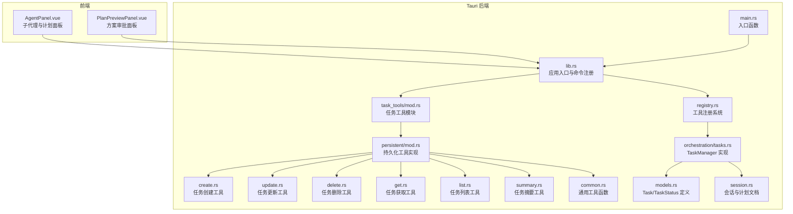
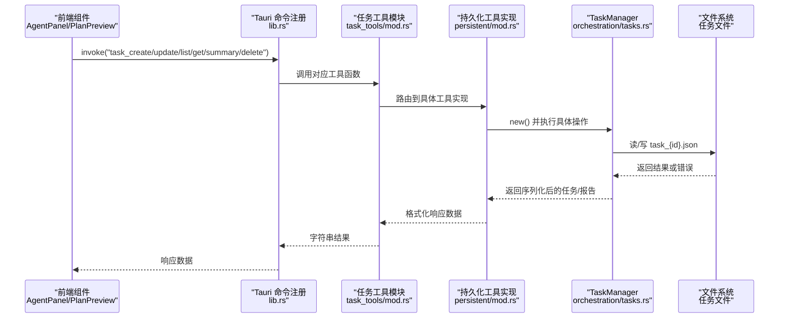
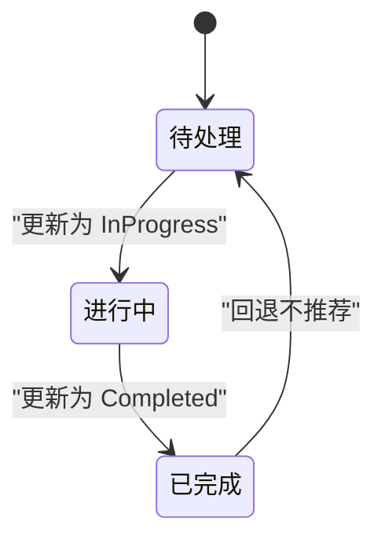
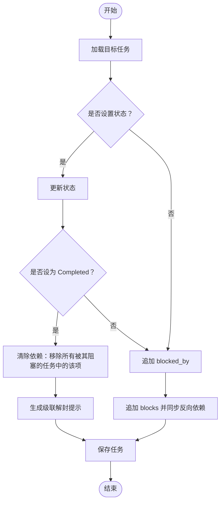
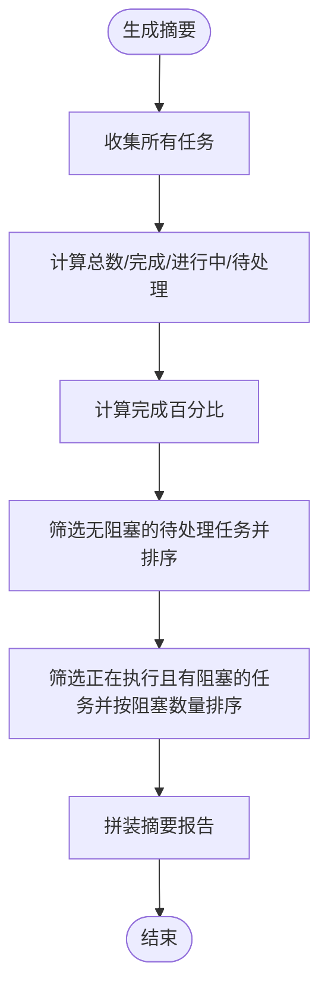
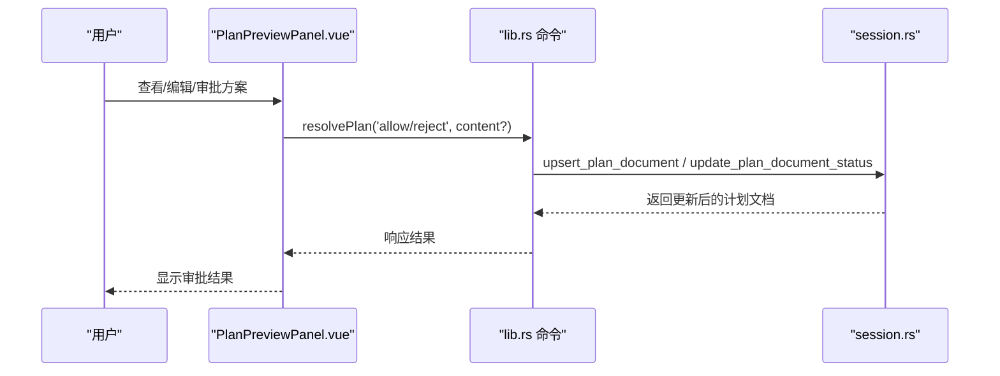
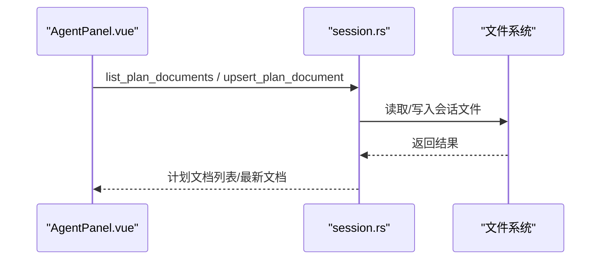
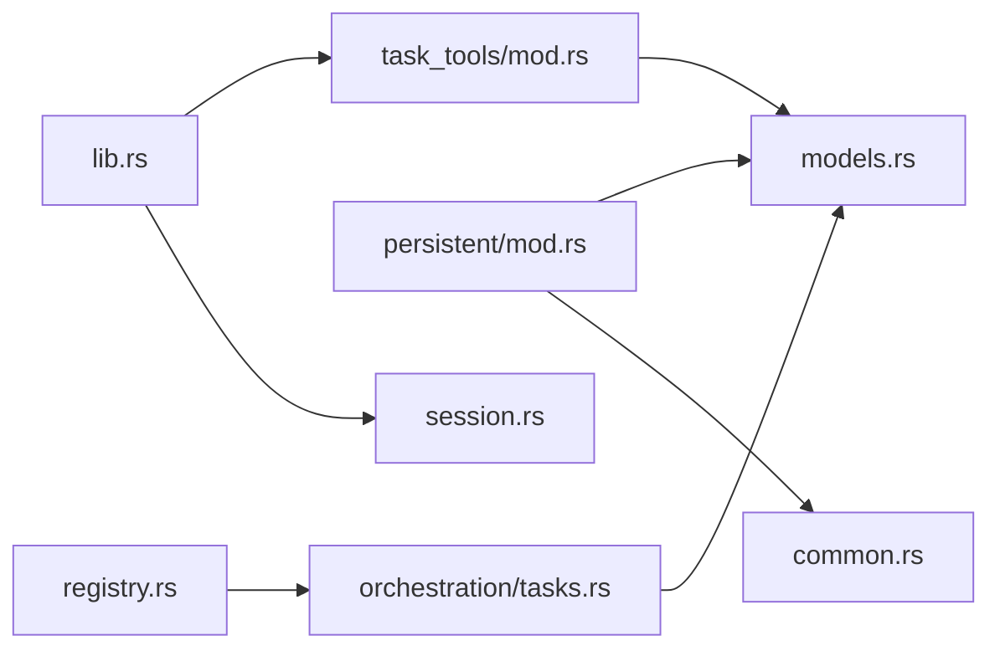

# 任务管理系统

<cite>
**本文档引用的文件**
- [src-tauri/src/core/orchestration/tasks.rs](file://src-tauri/src/core/orchestration/tasks.rs)
- [src-tauri/src/core/models.rs](file://src-tauri/src/core/models.rs)
- [src-tauri/src/core/tools/task_tools/mod.rs](file://src-tauri/src/core/tools/task_tools/mod.rs)
- [src-tauri/src/core/tools/task_tools/persistent/mod.rs](file://src-tauri/src/core/tools/task_tools/persistent/mod.rs)
- [src-tauri/src/core/tools/task_tools/persistent/create.rs](file://src-tauri/src/core/tools/task_tools/persistent/create.rs)
- [src-tauri/src/core/tools/task_tools/persistent/update.rs](file://src-tauri/src/core/tools/task_tools/persistent/update.rs)
- [src-tauri/src/core/tools/task_tools/persistent/delete.rs](file://src-tauri/src/core/tools/task_tools/persistent/delete.rs)
- [src-tauri/src/core/tools/task_tools/persistent/get.rs](file://src-tauri/src/core/tools/task_tools/persistent/get.rs)
- [src-tauri/src/core/tools/task_tools/persistent/list.rs](file://src-tauri/src/core/tools/task_tools/persistent/list.rs)
- [src-tauri/src/core/tools/task_tools/persistent/summary.rs](file://src-tauri/src/core/tools/task_tools/persistent/summary.rs)
- [src-tauri/src/core/tools/task_tools/persistent/common.rs](file://src-tauri/src/core/tools/task_tools/persistent/common.rs)
- [src-tauri/src/core/tools/task_tools/registry.rs](file://src-tauri/src/core/tools/task_tools/registry.rs)
- [src-tauri/src/lib.rs](file://src-tauri/src/lib.rs)
- [src-tauri/src/main.rs](file://src-tauri/src/main.rs)
- [src-tauri/src/core/session.rs](file://src-tauri/src/core/session.rs)
- [src/types/index.ts](file://src/types/index.ts)
- [src/components/chat/AgentPanel.vue](file://src/components/chat/AgentPanel.vue)
- [src/components/common/PlanPreviewPanel.vue](file://src/components/common/PlanPreviewPanel.vue)
</cite>

## 更新摘要
**所做更改**
- 重构任务管理模块架构：从单文件实现迁移到新的持久化任务管理架构
- 新增完整的任务管理工具模块，包含独立的持久化实现
- 更新任务数据模型，新增 active_form 和 metadata 字段
- 增强任务更新机制，支持增量更新和级联解锁
- 新增任务工具注册系统，提供标准化的工具接口

## 目录
1. [简介](#简介)
2. [项目结构](#项目结构)
3. [核心组件](#核心组件)
4. [架构总览](#架构总览)
5. [详细组件分析](#详细组件分析)
6. [依赖关系分析](#依赖关系分析)
7. [性能考虑](#性能考虑)
8. [故障排查指南](#故障排查指南)
9. [结论](#结论)
10. [附录](#附录)

## 简介
本文件面向 JarvisAgent 的任务管理系统，围绕任务看板、进度跟踪、任务分配协作三大主题，系统性阐述任务数据模型、生命周期管理、与会话系统的集成以及任务历史记录能力。文档提供可视化架构图、序列图与流程图，帮助开发者快速理解并扩展任务管理功能。

**更新** 任务管理模块已从单文件实现重构为新的持久化任务管理架构，采用模块化的工具系统设计，提供更强大的任务管理功能和更好的代码组织结构。

## 项目结构
任务管理位于后端 Rust 模块中，采用"工具函数 + 管理器"的分层设计：
- 数据模型定义于 models.rs，包含任务实体与状态枚举
- 任务管理器 TaskManager 提供 CRUD、依赖关系维护与汇总统计
- 任务工具模块提供标准化的工具接口，支持任务创建、更新、删除、列表、获取、摘要等操作
- 前端通过 Tauri 命令调用任务工具函数，实现任务看板与协作流程
- 会话系统提供任务与执行过程的上下文与历史记录

**图表来源**
- [src-tauri/src/lib.rs:150-213](file://src-tauri/src/lib.rs#L150-L213)
- [src-tauri/src/core/tools/task_tools/mod.rs:1-21](file://src-tauri/src/core/tools/task_tools/mod.rs#L1-L21)
- [src-tauri/src/core/tools/task_tools/persistent/mod.rs:1-41](file://src-tauri/src/core/tools/task_tools/persistent/mod.rs#L1-L41)
- [src-tauri/src/core/orchestration/tasks.rs:1-533](file://src-tauri/src/core/orchestration/tasks.rs#L1-L533)
- [src-tauri/src/core/models.rs:284-301](file://src-tauri/src/core/models.rs#L284-L301)
- [src-tauri/src/core/session.rs:1-200](file://src-tauri/src/core/session.rs#L1-L200)
- [src-tauri/src/main.rs:20-23](file://src-tauri/src/main.rs#L20-L23)

**章节来源**
- [src-tauri/src/lib.rs:150-213](file://src-tauri/src/lib.rs#L150-L213)
- [src-tauri/src/core/tools/task_tools/mod.rs:1-21](file://src-tauri/src/core/tools/task_tools/mod.rs#L1-L21)
- [src-tauri/src/core/orchestration/tasks.rs:1-533](file://src-tauri/src/core/orchestration/tasks.rs#L1-L533)
- [src-tauri/src/core/models.rs:284-301](file://src-tauri/src/core/models.rs#L284-L301)
- [src-tauri/src/core/session.rs:1-200](file://src-tauri/src/core/session.rs#L1-L200)

## 核心组件
- 任务数据模型
  - Task：包含唯一标识、主题、描述、状态、阻塞关系、拥有者等字段
  - TaskStatus：枚举值 Pending/InProgress/Completed
  - 新增字段：active_form（进行中时显示的动态文本）、metadata（任意附加元数据）
- 任务管理器 TaskManager
  - 负责任务的创建、查询、更新、删除、列表与汇总
  - 维护阻塞关系（blocked_by/blocks），并在任务完成后自动解除依赖
  - 生成任务进度摘要（完成度、瓶颈任务、可启动任务）
  - 支持增量更新和级联解锁机制
- 任务工具模块
  - 提供标准化的工具接口：task_create、task_update、task_delete、task_list、task_get、task_summary
  - 支持状态删除、依赖关系更新、元数据合并等功能
  - 采用模块化设计，每个工具独立实现
- 工具注册系统
  - 提供统一的工具注册接口，支持工具的动态加载和管理
  - 支持工具的元数据定义和输入验证
- 与会话系统集成
  - 会话内存中包含计划文档列表，支持审批与执行
  - 子代理运行与任务关联，支持跳转到关联任务

**更新** 任务管理模块已重构为新的持久化架构，采用模块化的工具系统设计，提供更清晰的职责分离和更好的可维护性。

**章节来源**
- [src-tauri/src/core/models.rs:284-301](file://src-tauri/src/core/models.rs#L284-L301)
- [src-tauri/src/core/orchestration/tasks.rs:12-533](file://src-tauri/src/core/orchestration/tasks.rs#L12-L533)
- [src-tauri/src/core/tools/task_tools/mod.rs:1-21](file://src-tauri/src/core/tools/task_tools/mod.rs#L1-L21)
- [src-tauri/src/core/tools/task_tools/persistent/mod.rs:1-41](file://src-tauri/src/core/tools/task_tools/persistent/mod.rs#L1-L41)
- [src-tauri/src/core/session.rs:1-200](file://src-tauri/src/core/session.rs#L1-L200)

## 架构总览
任务管理的调用链路如下：
- 前端组件通过 Tauri invoke 调用任务工具命令
- 命令进入任务工具模块，根据工具类型调用相应的实现
- 工具实现委托 TaskManager 执行具体操作
- TaskManager 以 JSON 文件形式持久化任务
- 会话系统提供计划文档与子代理运行上下文，支撑任务协作

**图表来源**
- [src-tauri/src/lib.rs:150-213](file://src-tauri/src/lib.rs#L150-L213)
- [src-tauri/src/core/tools/task_tools/mod.rs:18-21](file://src-tauri/src/core/tools/task_tools/mod.rs#L18-L21)
- [src-tauri/src/core/tools/task_tools/persistent/mod.rs:11-41](file://src-tauri/src/core/tools/task_tools/persistent/mod.rs#L11-L41)
- [src-tauri/src/core/orchestration/tasks.rs:35-71](file://src-tauri/src/core/orchestration/tasks.rs#L35-L71)

**章节来源**
- [src-tauri/src/lib.rs:150-213](file://src-tauri/src/lib.rs#L150-L213)
- [src-tauri/src/core/tools/task_tools/mod.rs:18-21](file://src-tauri/src/core/tools/task_tools/mod.rs#L18-L21)
- [src-tauri/src/core/orchestration/tasks.rs:35-71](file://src-tauri/src/core/orchestration/tasks.rs#L35-L71)

## 详细组件分析

### 任务数据模型与状态机
- Task 结构
  - id：自增整数
  - subject/description：任务主题与描述
  - status：任务状态（Pending/InProgress/Completed）
  - blocked_by/blocks：双向依赖关系（被哪些任务阻塞/阻塞其他哪些任务）
  - owner：任务拥有者（字符串）
  - active_form：进行中时显示的动态文本（如 "Fixing authentication bug"）
  - metadata：任意附加元数据（JSON 对象）
- 状态转换
  - 由 Pending → InProgress → Completed
  - 完成时自动解除依赖，可能触发级联解封提示

**图表来源**
- [src-tauri/src/core/models.rs:278-282](file://src-tauri/src/core/models.rs#L278-L282)

**章节来源**
- [src-tauri/src/core/models.rs:284-301](file://src-tauri/src/core/models.rs#L284-L301)
- [src-tauri/src/core/models.rs:278-282](file://src-tauri/src/core/models.rs#L278-L282)

### TaskManager 类与依赖关系维护
- 关键方法
  - create：生成下一个 id，创建任务并持久化，支持 active_form、metadata、owner
  - update：支持更新状态、追加 blocked_by、追加 blocks，并自动同步反向依赖
  - delete：硬删除任务，同时清理所有对它的依赖引用
  - summary：计算完成度、瓶颈任务、可启动任务
  - list_all：按 id 排序列出任务清单，智能过滤已完成的依赖
  - get/_load/_save：读取与保存任务
- 依赖解除
  - 当任务状态变为 Completed 时，遍历所有任务，移除被该任务阻塞的条目，并在解除后通知调用方
  - 支持级联解锁机制，提供详细的解锁任务列表

**图表来源**
- [src-tauri/src/core/orchestration/tasks.rs:140-259](file://src-tauri/src/core/orchestration/tasks.rs#L140-L259)
- [src-tauri/src/core/orchestration/tasks.rs:305-331](file://src-tauri/src/core/orchestration/tasks.rs#L305-L331)

**章节来源**
- [src-tauri/src/core/orchestration/tasks.rs:30-533](file://src-tauri/src/core/orchestration/tasks.rs#L30-L533)

### 任务看板与进度跟踪
- 任务看板
  - 列表按 id 升序展示，带状态标记与阻塞提示
  - Ready to Start：无任何阻塞且状态为 Pending 的任务
  - Bottlenecks：正在执行且阻塞其他任务的任务
  - 智能过滤：已完成的任务 ID 会被自动过滤，只显示未完成的前置依赖
- 进度跟踪
  - 完成度 = 已完成任务数 / 总任务数 × 100%
  - 支持瓶颈识别与可启动任务提示
  - 提供详细的进度摘要报告

**图表来源**
- [src-tauri/src/core/orchestration/tasks.rs:333-405](file://src-tauri/src/core/orchestration/tasks.rs#L333-L405)

**章节来源**
- [src-tauri/src/core/orchestration/tasks.rs:448-497](file://src-tauri/src/core/orchestration/tasks.rs#L448-L497)
- [src-tauri/src/core/orchestration/tasks.rs:333-405](file://src-tauri/src/core/orchestration/tasks.rs#L333-L405)

### 任务分配协作与权限控制
- 任务与子代理关联
  - 子代理运行项包含 taskId 字段，可在面板中点击跳转到关联任务
- 方案审批与执行
  - 前端 PlanPreviewPanel 展示待审批方案，支持编辑与同意/拒绝
  - 后端会话模块提供计划文档的增删改查与状态更新
- 权限控制
  - 任务创建需先提交计划提案并通过审批，避免绕过审批直接创建任务
  - 自动设置 owner：标记 in_progress 时若无 owner 则自动填充

**图表来源**
- [src/components/common/PlanPreviewPanel.vue:58-66](file://src/components/common/PlanPreviewPanel.vue#L58-L66)
- [src-tauri/src/core/session.rs:1-200](file://src-tauri/src/core/session.rs#L1-L200)

**章节来源**
- [src/components/chat/AgentPanel.vue:352-354](file://src/components/chat/AgentPanel.vue#L352-L354)
- [src-tauri/src/core/session.rs:1-200](file://src-tauri/src/core/session.rs#L1-L200)
- [src/components/common/PlanPreviewPanel.vue:58-66](file://src/components/common/PlanPreviewPanel.vue#L58-L66)

### 任务历史记录与会话集成
- 会话持久化
  - 会话内存包含计划文档数组，支持按更新时间排序
  - 保存会话时过滤工具消息，仅保留有意义的对话内容，降低文件体积
- 任务与会话的关系
  - 子代理运行项可携带 taskId，便于在会话上下文中定位任务
  - 任务状态变化可作为会话执行流程的一部分被记录

**图表来源**
- [src-tauri/src/core/session.rs:1-200](file://src-tauri/src/core/session.rs#L1-L200)

**章节来源**
- [src-tauri/src/core/session.rs:1-200](file://src-tauri/src/core/session.rs#L1-L200)
- [src/components/chat/AgentPanel.vue:352-354](file://src/components/chat/AgentPanel.vue#L352-L354)

### 任务工具模块架构
- 工具模块设计
  - 采用模块化设计，每个工具独立实现
  - 提供标准化的工具接口和输入验证
  - 支持工具的动态注册和管理
- 工具实现
  - create：创建任务，支持主题、描述、活动形式、元数据、所有者
  - update：更新任务状态、字段或依赖关系
  - delete：永久删除任务并清理依赖引用
  - get：获取单个任务的完整详细信息
  - list：列出所有任务及其状态概要
  - summary：生成任务全景报告
- 工具注册
  - 提供统一的工具注册接口
  - 支持工具的元数据定义和搜索提示
  - 支持工具的并发安全性和只读属性

**更新** 新增完整的任务工具模块架构，提供标准化的工具接口和模块化设计。

**章节来源**
- [src-tauri/src/core/tools/task_tools/mod.rs:1-21](file://src-tauri/src/core/tools/task_tools/mod.rs#L1-L21)
- [src-tauri/src/core/tools/task_tools/persistent/mod.rs:1-41](file://src-tauri/src/core/tools/task_tools/persistent/mod.rs#L1-L41)
- [src-tauri/src/core/tools/task_tools/registry.rs](file://src-tauri/src/core/tools/task_tools/registry.rs)

## 依赖关系分析
- 模块耦合
  - task_tools/mod.rs 依赖 orchestration/tasks.rs 中的 TaskManager
  - persistent 模块依赖 models.rs 中的 TaskStatus 与 Task
  - 工具实现依赖 common.rs 中的通用工具函数
  - lib.rs 注册任务工具命令，形成前后端交互契约
- 外部依赖
  - 文件系统：任务以 JSON 文件形式持久化
  - Tauri 插件：提供窗口状态、对话框、文件系统等能力

**图表来源**
- [src-tauri/src/core/tools/task_tools/mod.rs:18-21](file://src-tauri/src/core/tools/task_tools/mod.rs#L18-L21)
- [src-tauri/src/core/tools/task_tools/persistent/mod.rs:11-41](file://src-tauri/src/core/tools/task_tools/persistent/mod.rs#L11-L41)
- [src-tauri/src/core/orchestration/tasks.rs:7-16](file://src-tauri/src/core/orchestration/tasks.rs#L7-L16)
- [src-tauri/src/lib.rs:150-213](file://src-tauri/src/lib.rs#L150-L213)

**章节来源**
- [src-tauri/src/core/tools/task_tools/mod.rs:18-21](file://src-tauri/src/core/tools/task_tools/mod.rs#L18-L21)
- [src-tauri/src/core/orchestration/tasks.rs:7-16](file://src-tauri/src/core/orchestration/tasks.rs#L7-L16)
- [src-tauri/src/lib.rs:150-213](file://src-tauri/src/lib.rs#L150-L213)

## 性能考虑
- I/O 优化
  - 任务以单文件存储，读写均采用一次性读取/写入，避免频繁小块 I/O
  - 列表与汇总时遍历目录，建议在任务规模较大时增加索引或缓存
- 依赖解析
  - 完成态变更时需扫描全量任务以解除依赖，复杂度 O(N)，建议在高并发场景下引入异步队列
  - 支持智能过滤：已完成的任务 ID 会被自动过滤，减少显示负担
- 前端渲染
  - 任务列表按 id 排序，渲染成本低；建议在大数据量时启用虚拟滚动
- 会话过滤
  - 保存会话时过滤工具消息，显著降低文件体积，提升加载速度
- 元数据处理
  - 支持 JSON 对象的深度合并，自动删除 null 值对应的键
- 工具模块优化
  - 采用模块化设计，减少不必要的模块加载
  - 工具实现支持并发安全，提高多任务处理效率

## 故障排查指南
- 任务未找到
  - 现象：查询任务时报错"not found"
  - 排查：确认任务 id 是否正确，以及任务文件是否存在对应文件
- 依赖循环
  - 现象：更新 blocks/blocked_by 后任务无法推进
  - 排查：检查 blocks 与 blocked_by 是否形成环路，必要时手动清理
- 级联解封提示缺失
  - 现象：完成任务后未提示其他任务可启动
  - 排查：确认任务状态已更新为 Completed，且被阻塞的任务已被解除依赖
- 前端无法显示任务
  - 现象：AgentPanel 中无任务列表
  - 排查：确认子代理运行项是否携带 taskId，且前端已调用 focusTask 跳转
- 元数据合并异常
  - 现象：更新 metadata 后数据丢失或格式错误
  - 排查：确认传入的 JSON 格式正确，null 值会删除对应键
- 工具调用失败
  - 现象：任务工具调用返回错误
  - 排查：确认工具名称正确，输入参数符合 schema 定义，会话 ID 有效

**章节来源**
- [src-tauri/src/core/orchestration/tasks.rs:79-86](file://src-tauri/src/core/orchestration/tasks.rs#L79-L86)
- [src-tauri/src/core/orchestration/tasks.rs:305-331](file://src-tauri/src/core/orchestration/tasks.rs#L305-L331)
- [src/components/chat/AgentPanel.vue:352-354](file://src/components/chat/AgentPanel.vue#L352-L354)

## 结论
JarvisAgent 的任务管理系统经过重构后，以更简洁的数据模型与更清晰的职责划分实现了任务看板、进度跟踪与协作审批的闭环。新的持久化任务管理架构采用模块化设计，提供了标准化的工具接口和更好的可维护性。TaskManager 提供了更强大的任务管理功能，包括增强的依赖关系管理、元数据支持和级联解锁机制。通过与会话系统的深度集成，任务状态与执行过程得以完整记录。建议在生产环境中结合缓存与异步处理进一步优化大规模任务场景下的性能表现。

## 附录
- 使用示例（路径指引）
  - 创建任务：调用命令 task_create，传入 subject 与 description
  - 更新任务：调用命令 task_update，传入 task_id、status、add_blocked_by、add_blocks
  - 列出任务：调用命令 task_list
  - 获取任务详情：调用命令 task_get，传入 task_id
  - 生成摘要：调用命令 task_summary
  - 删除任务：调用命令 task_delete，传入 task_id
- 工作流设计
  - 提案审批：PlanPreviewPanel.vue → session.rs 的 upsert_plan_document / update_plan_document_status
  - 任务创建：提案通过后，调用 task_create
  - 任务推进：task_update 设置状态为 InProgress/Completed
  - 可视化看板：AgentPanel.vue 展示子代理与计划文档，支持跳转到关联任务
- 扩展开发指南
  - 新增字段：在 models.rs 的 Task 结构体中添加，并在 orchestration/tasks.rs 的 _save/_load 中同步
  - 新增工具：在 persistent/mod.rs 中添加新工具模块，在 registry.rs 中注册工具定义
  - 新增命令：在 lib.rs 的 generate_handler 中注册，并在 task_tools/mod.rs 中导出
  - 性能优化：引入任务索引、批量更新、异步依赖扫描
  - 元数据扩展：利用 metadata 字段存储任务特定信息，支持 JSON 对象的深度合并

**章节来源**
- [src-tauri/src/core/tools/task_tools/persistent/create.rs:33-66](file://src-tauri/src/core/tools/task_tools/persistent/create.rs#L33-L66)
- [src-tauri/src/core/tools/task_tools/persistent/update.rs:38-115](file://src-tauri/src/core/tools/task_tools/persistent/update.rs#L38-L115)
- [src-tauri/src/core/tools/task_tools/persistent/delete.rs:28-35](file://src-tauri/src/core/tools/task_tools/persistent/delete.rs#L28-L35)
- [src-tauri/src/core/tools/task_tools/persistent/list.rs:22-31](file://src-tauri/src/core/tools/task_tools/persistent/list.rs#L22-L31)
- [src-tauri/src/core/tools/task_tools/persistent/summary.rs:22-31](file://src-tauri/src/core/tools/task_tools/persistent/summary.rs#L22-L31)
- [src-tauri/src/core/tools/task_tools/persistent/get.rs:29-39](file://src-tauri/src/core/tools/task_tools/persistent/get.rs#L29-L39)
- [src-tauri/src/lib.rs:150-213](file://src-tauri/src/lib.rs#L150-L213)
- [src-tauri/src/core/session.rs:1-200](file://src-tauri/src/core/session.rs#L1-L200)
- [src/components/common/PlanPreviewPanel.vue:58-66](file://src/components/common/PlanPreviewPanel.vue#L58-L66)
- [src/components/chat/AgentPanel.vue:352-354](file://src/components/chat/AgentPanel.vue#L352-L354)