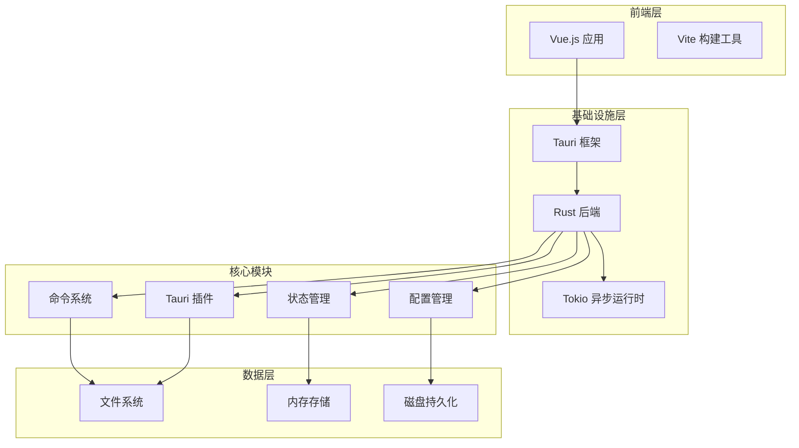
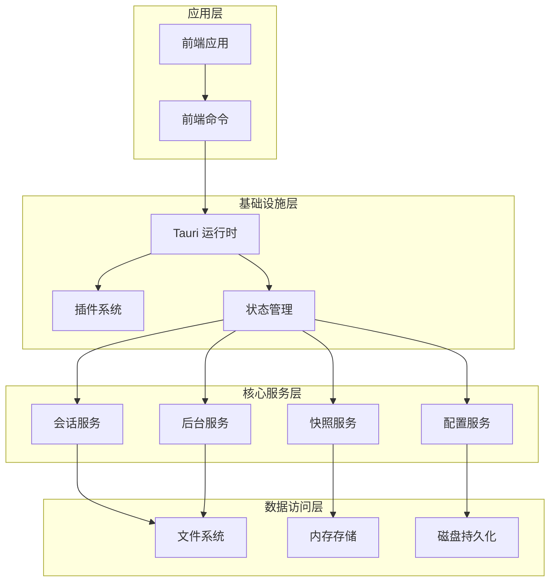
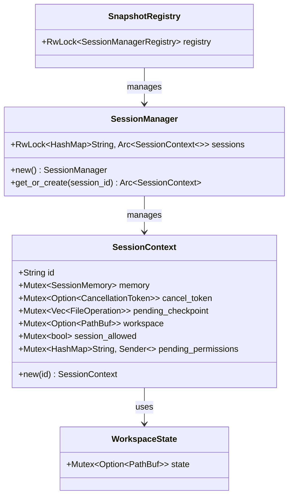
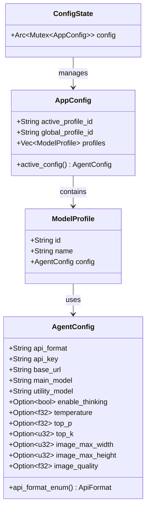
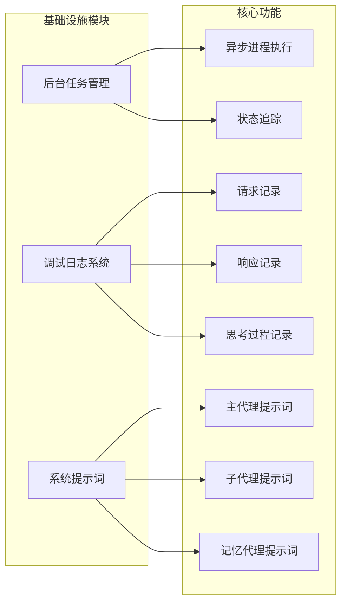
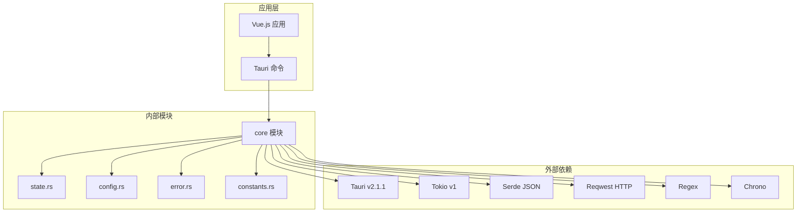

# 基础设施层

<cite>
**本文档引用的文件**
- [Cargo.toml](file://src-tauri/Cargo.toml)
- [main.rs](file://src-tauri/src/main.rs)
- [lib.rs](file://src-tauri/src/lib.rs)
- [tauri.conf.json](file://src-tauri/tauri.conf.json)
- [package.json](file://package.json)
- [core/mod.rs](file://src-tauri/src/core/mod.rs)
- [core/state.rs](file://src-tauri/src/core/state.rs)
- [core/config.rs](file://src-tauri/src/core/config.rs)
- [core/constants.rs](file://src-tauri/src/core/constants.rs)
- [core/error.rs](file://src-tauri/src/core/error.rs)
- [infra/mod.rs](file://src-tauri/src/core/infra/mod.rs)
</cite>

## 目录
1. [简介](#简介)
2. [项目结构](#项目结构)
3. [核心组件](#核心组件)
4. [架构概览](#架构概览)
5. [详细组件分析](#详细组件分析)
6. [依赖关系分析](#依赖关系分析)
7. [性能考虑](#性能考虑)
8. [故障排除指南](#故障排除指南)
9. [结论](#结论)

## 简介

JarvisAgent 是一个基于 Tauri 框架构建的桌面应用程序，专注于提供智能代理助手功能。基础设施层作为整个应用的核心支撑，负责管理应用的运行时环境、状态管理和配置系统。

该基础设施层采用 Rust 编写，结合了现代异步编程模型和类型安全的设计原则，为上层业务逻辑提供了稳定可靠的基础支撑。

## 项目结构

项目采用前后端分离的架构设计，基础设施层主要位于 `src-tauri` 目录中，使用 Rust 语言实现，通过 Tauri 框架与前端 Vue.js 应用进行交互。



**图表来源**
- [main.rs:1-23](file://src-tauri/src/main.rs#L1-L23)
- [lib.rs:81-227](file://src-tauri/src/lib.rs#L81-L227)
- [Cargo.toml:20-42](file://src-tauri/Cargo.toml#L20-L42)

**章节来源**
- [main.rs:1-23](file://src-tauri/src/main.rs#L1-L23)
- [lib.rs:1-227](file://src-tauri/src/lib.rs#L1-L227)
- [Cargo.toml:1-42](file://src-tauri/Cargo.toml#L1-L42)

## 核心组件

基础设施层包含以下核心组件：

### 1. 应用入口点
- **main.rs**: Tauri 应用的主入口文件，负责启动应用运行时
- **lib.rs**: 核心后端入口，初始化整个应用环境

### 2. 状态管理系统
- **SessionManager**: 全局会话管理器，维护活跃会话上下文
- **WorkspaceState**: 工作空间状态，记录当前工作目录
- **SnapshotRegistry**: 快照注册表，管理会话级快照

### 3. 配置管理
- **ConfigState**: 全局配置状态管理
- **AppConfig**: 应用配置结构，支持多预设配置
- **AgentConfig**: 单个模型的连接配置

### 4. 错误处理系统
- **AgentError**: 顶层错误类型
- **ApiError**: API 调用相关错误
- **ToolError**: 工具执行相关错误

**章节来源**
- [lib.rs:22-53](file://src-tauri/src/lib.rs#L22-L53)
- [core/state.rs:29-99](file://src-tauri/src/core/state.rs#L29-L99)
- [core/config.rs:29-166](file://src-tauri/src/core/config.rs#L29-L166)
- [core/error.rs:23-103](file://src-tauri/src/core/error.rs#L23-L103)

## 架构概览

基础设施层采用分层架构设计，各层职责明确，耦合度低，便于维护和扩展。



**图表来源**
- [lib.rs:135-227](file://src-tauri/src/lib.rs#L135-L227)
- [core/mod.rs:20-76](file://src-tauri/src/core/mod.rs#L20-L76)

## 详细组件分析

### 状态管理组件

状态管理是基础设施层的核心，负责维护应用的全局状态。



**图表来源**
- [core/state.rs:64-99](file://src-tauri/src/core/state.rs#L64-L99)
- [core/state.rs:40-48](file://src-tauri/src/core/state.rs#L40-L48)
- [core/state.rs:29](file://src-tauri/src/core/state.rs#L29)

#### 状态管理特性

1. **线程安全**: 使用 `Arc<Mutex<T>>` 和 `RwLock` 实现并发安全
2. **延迟加载**: `get_or_create()` 方法支持按需创建和加载会话
3. **磁盘同步**: 自动从磁盘加载历史数据和工作目录信息

**章节来源**
- [core/state.rs:64-99](file://src-tauri/src/core/state.rs#L64-L99)

### 配置管理系统

配置管理提供应用的持久化配置能力，支持多预设配置管理。



**图表来源**
- [core/config.rs:165-166](file://src-tauri/src/core/config.rs#L165-L166)
- [core/config.rs:102-125](file://src-tauri/src/core/config.rs#L102-L125)
- [core/config.rs:89-96](file://src-tauri/src/core/config.rs#L89-L96)
- [core/config.rs:29-87](file://src-tauri/src/core/config.rs#L29-L87)

#### 配置管理特性

1. **版本兼容**: 支持从旧版配置格式自动迁移
2. **多预设支持**: 允许用户快速切换不同的模型配置
3. **URL 规范化**: 自动规范化 API 基础 URL 格式

**章节来源**
- [core/config.rs:173-219](file://src-tauri/src/core/config.rs#L173-L219)

### 错误处理系统

错误处理系统提供统一的错误类型定义和错误传播机制。

```mermaid
classDiagram
class AgentError {
<<enumeration>>
Config(String)
Api(ApiError)
Tool(ToolError)
Memory(MemoryError)
Stream(String)
Session(String)
Cancelled
LoopLimitExceeded(usize, usize)
}
class ApiError {
<<enumeration>>
MissingApiKey
HttpError { status : u16, body : String }
Network(String)
RetriesExhausted { max_retries : u32, last_error : String }
Parse(String)
}
class ToolError {
<<enumeration>>
NotFound { tool : String }
ParseError { tool : String, reason : String }
ExecutionError { tool : String, reason : String }
PermissionDenied { tool : String }
}
class MemoryError {
<<enumeration>>
CompactionFailed(String)
FileRead(String)
MemoryAgent(String)
}
AgentError --> ApiError : contains
AgentError --> ToolError : contains
AgentError --> MemoryError : contains
```

**图表来源**
- [core/error.rs:23-49](file://src-tauri/src/core/error.rs#L23-L49)
- [core/error.rs:57-74](file://src-tauri/src/core/error.rs#L57-L74)
- [core/error.rs:76-90](file://src-tauri/src/core/error.rs#L76-L90)
- [core/error.rs:92-103](file://src-tauri/src/core/error.rs#L92-L103)

#### 错误处理特性

1. **类型安全**: 使用枚举类型确保错误类型的完整性
2. **链式错误**: 支持错误类型之间的自动转换
3. **序列化支持**: 所有错误类型都实现了序列化接口

**章节来源**
- [core/error.rs:1-160](file://src-tauri/src/core/error.rs#L1-L160)

### 基础设施模块

基础设施层包含以下子模块：



**图表来源**
- [infra/mod.rs:1-11](file://src-tauri/src/core/infra/mod.rs#L1-L11)

**章节来源**
- [infra/mod.rs:1-11](file://src-tauri/src/core/infra/mod.rs#L1-L11)

## 依赖关系分析

基础设施层的依赖关系清晰明确，遵循单一职责原则。



**图表来源**
- [Cargo.toml:20-42](file://src-tauri/Cargo.toml#L20-L42)
- [lib.rs:22-39](file://src-tauri/src/lib.rs#L22-L39)

### 核心依赖特性

1. **异步运行时**: 使用 Tokio 提供高性能的异步执行环境
2. **HTTP 客户端**: 使用 Reqwest 处理 API 请求和响应
3. **JSON 序列化**: 使用 Serde 实现类型安全的数据序列化
4. **正则表达式**: 使用 Regex 进行意图分类规则匹配

**章节来源**
- [Cargo.toml:20-42](file://src-tauri/Cargo.toml#L20-L42)

## 性能考虑

基础设施层在设计时充分考虑了性能优化：

### 异步处理
- 使用 Tokio 异步运行时处理并发任务
- 采用 `RwLock` 实现读写分离，提高并发性能
- 后台任务使用独立的异步通道处理

### 内存管理
- 使用 `Arc<Mutex<T>>` 实现共享状态的安全访问
- 会话数据采用延迟加载策略，减少内存占用
- 快照系统使用内存缓存加速频繁访问

### I/O 优化
- 文件系统操作使用异步 API
- 配置文件采用增量更新策略
- 日志系统支持异步写入

## 故障排除指南

### 常见问题及解决方案

#### 应用启动失败
1. **检查依赖安装**: 确保所有 Rust 依赖正确安装
2. **验证配置文件**: 检查 `config.json` 格式是否正确
3. **查看日志输出**: 关注控制台输出的错误信息

#### 状态管理异常
1. **检查内存泄漏**: 确保会话正确关闭和清理
2. **验证并发访问**: 检查是否存在竞态条件
3. **监控资源使用**: 关注内存和 CPU 使用情况

#### 配置加载错误
1. **备份配置文件**: 在修改前备份原始配置
2. **验证 JSON 格式**: 使用在线工具验证 JSON 有效性
3. **检查文件权限**: 确保应用有读写配置文件的权限

**章节来源**
- [core/error.rs:105-160](file://src-tauri/src/core/error.rs#L105-L160)

## 结论

JarvisAgent 的基础设施层展现了现代桌面应用开发的最佳实践。通过精心设计的状态管理系统、健壮的配置管理机制和完善的错误处理体系，为上层业务逻辑提供了坚实可靠的支撑。

该基础设施层的主要优势包括：

1. **类型安全**: 完全基于 Rust 类型系统，编译时捕获错误
2. **并发安全**: 使用现代化的异步编程模型处理并发
3. **可维护性**: 清晰的模块划分和职责分离
4. **扩展性**: 良好的架构设计支持功能扩展
5. **可靠性**: 完善的错误处理和恢复机制

基础设施层的成功实现为 JarvisAgent 的稳定运行奠定了坚实基础，也为后续的功能扩展提供了良好的技术支撑。