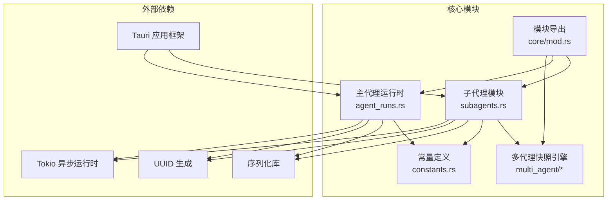
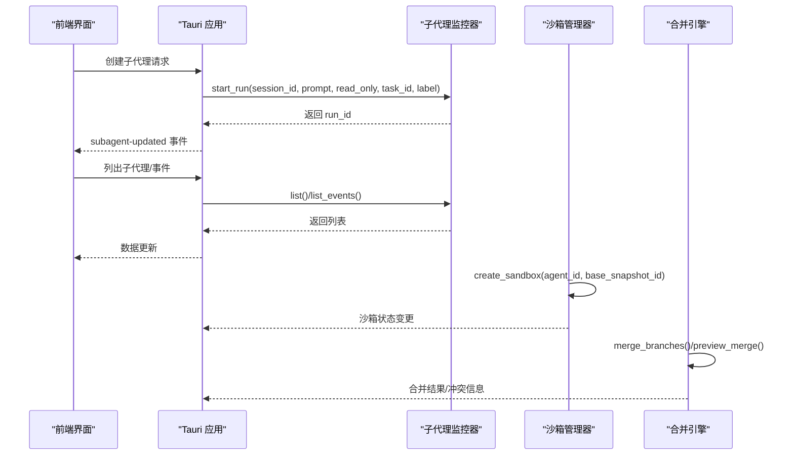
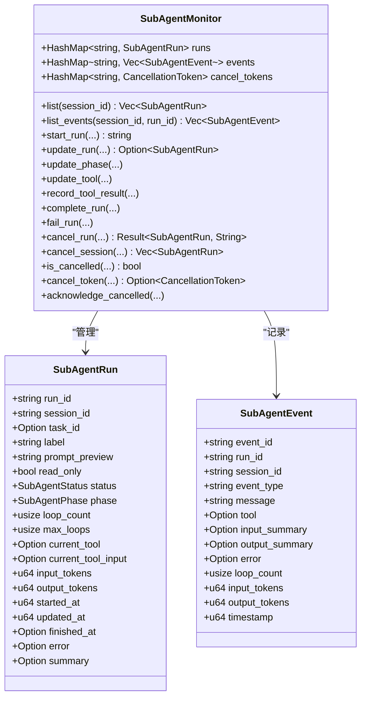
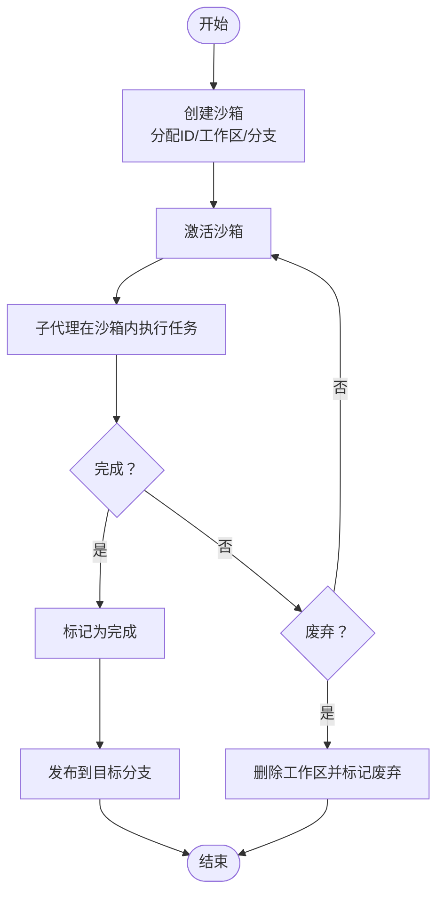
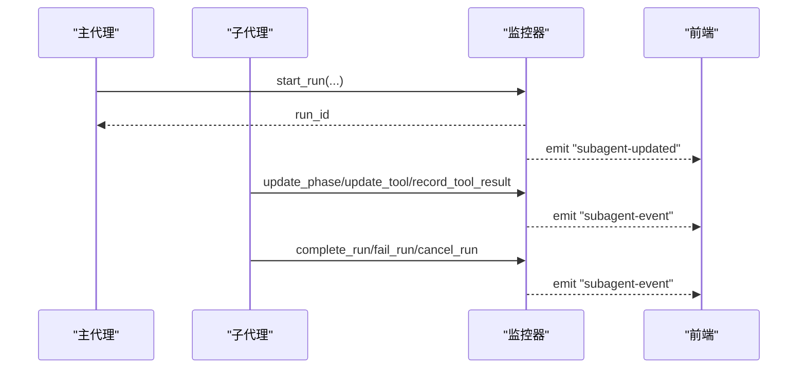
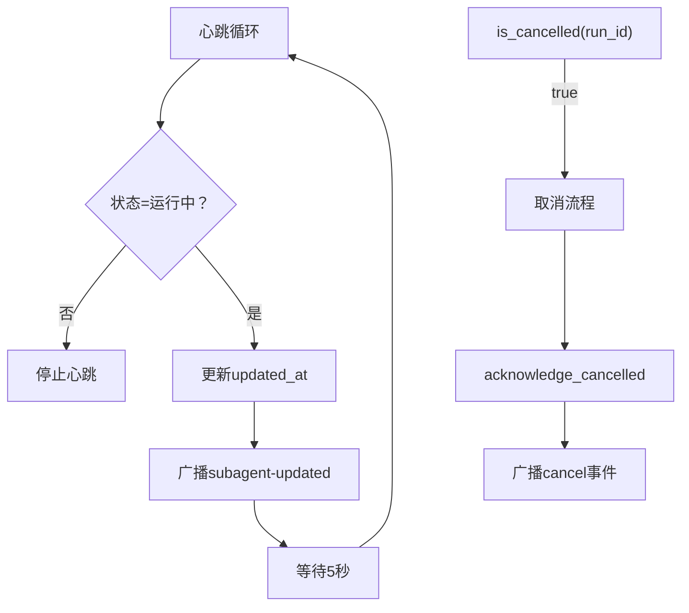
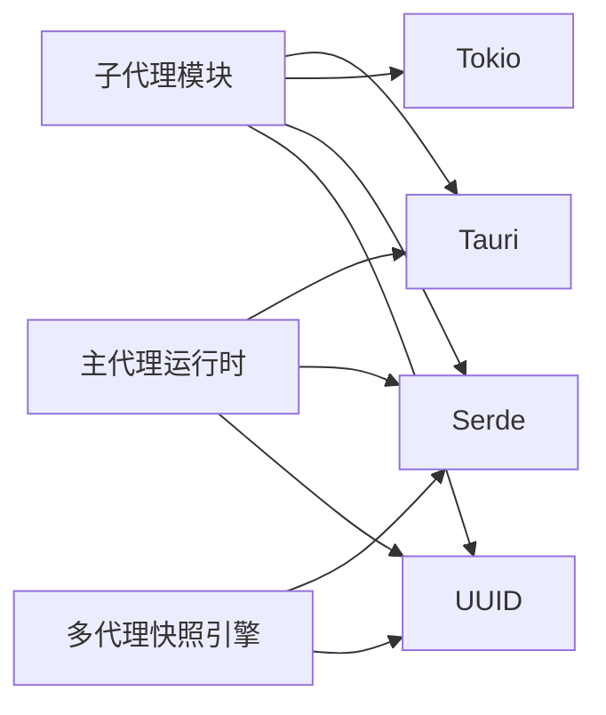

# 子代理系统

<cite>
**本文引用的文件**
- [src-tauri/src/core/subagents.rs](file://src-tauri/src/core/subagents.rs)
- [src-tauri/src/core/snapshot_engine/multi_agent/mod.rs](file://src-tauri/src/core/snapshot_engine/multi_agent/mod.rs)
- [src-tauri/src/core/snapshot_engine/multi_agent/sandbox.rs](file://src-tauri/src/core/snapshot_engine/multi_agent/sandbox.rs)
- [src-tauri/src/core/snapshot_engine/multi_agent/merge.rs](file://src-tauri/src/core/snapshot_engine/multi_agent/merge.rs)
- [src-tauri/src/core/agent_runs.rs](file://src-tauri/src/core/agent_runs.rs)
- [src-tauri/src/core/tasks.rs](file://src-tauri/src/core/tasks.rs)
- [src-tauri/src/core/constants.rs](file://src-tauri/src/core/constants.rs)
- [src-tauri/src/core/mod.rs](file://src-tauri/src/core/mod.rs)
- [src-tauri/src/main.rs](file://src-tauri/src/main.rs)
- [src-tauri/Cargo.toml](file://src-tauri/Cargo.toml)
</cite>

## 目录
1. [简介](#简介)
2. [项目结构](#项目结构)
3. [核心组件](#核心组件)
4. [架构总览](#架构总览)
5. [详细组件分析](#详细组件分析)
6. [依赖关系分析](#依赖关系分析)
7. [性能考量](#性能考量)
8. [故障排除指南](#故障排除指南)
9. [结论](#结论)
10. [附录](#附录)

## 简介
本文件面向 JarvisAgent 的子代理系统，提供从架构设计到实现细节的完整文档。内容涵盖：
- 子代理架构设计：独立执行环境、资源隔离、生命周期管理
- 独立执行环境：沙箱隔离、权限控制、资源限制
- 代理编排机制：任务分发、协调通信、状态同步
- 代理监控：健康检查、性能监控、异常处理
- 子代理的创建与销毁、与主代理的通信协议、数据共享机制、安全防护措施
- 具体使用示例、架构设计原理、性能优化建议与故障排除指南

## 项目结构
子代理系统主要由以下模块构成：
- 子代理运行时与监控：负责子代理的生命周期、状态与事件追踪
- 多代理快照与合并：提供沙箱隔离、变更比较与分支合并能力
- 主代理运行时：与子代理并行运行，负责整体编排与事件输出
- 常量与命令导出：统一常量定义与对外命令接口

图表来源
- [src-tauri/src/core/subagents.rs:1-666](file://src-tauri/src/core/subagents.rs#L1-L666)
- [src-tauri/src/core/agent_runs.rs:1-550](file://src-tauri/src/core/agent_runs.rs#L1-L550)
- [src-tauri/src/core/snapshot_engine/multi_agent/mod.rs:1-6](file://src-tauri/src/core/snapshot_engine/multi_agent/mod.rs#L1-L6)
- [src-tauri/src/core/constants.rs:1-30](file://src-tauri/src/core/constants.rs#L1-L30)
- [src-tauri/src/core/mod.rs:1-64](file://src-tauri/src/core/mod.rs#L1-L64)

章节来源
- [src-tauri/src/core/mod.rs:1-64](file://src-tauri/src/core/mod.rs#L1-L64)
- [src-tauri/src/core/subagents.rs:1-666](file://src-tauri/src/core/subagents.rs#L1-L666)
- [src-tauri/src/core/agent_runs.rs:1-550](file://src-tauri/src/core/agent_runs.rs#L1-L550)
- [src-tauri/src/core/snapshot_engine/multi_agent/mod.rs:1-6](file://src-tauri/src/core/snapshot_engine/multi_agent/mod.rs#L1-L6)
- [src-tauri/src/core/constants.rs:1-30](file://src-tauri/src/core/constants.rs#L1-L30)

## 核心组件
- 子代理运行与监控
  - 运行状态与阶段：运行中、已完成、失败、取消
  - 阶段枚举：启动、等待模型、流式输出、思考、调用工具、处理工具结果、收尾
  - 运行记录与事件：包含令牌用量、轮次统计、错误信息、摘要等
  - 监控器：维护运行表、事件表、取消令牌，并通过 Tauri 广播事件
- 多代理快照与合并
  - 沙箱：每个子代理拥有独立工作区与分支，支持激活、完成、发布、废弃
  - 比较：统计变更文件数、增删行数、快照数量与最后消息
  - 合并：检测冲突类型，自动/手动解决策略，生成合并结果
- 主代理运行时
  - 记录主代理的运行状态、事件与断点，支持恢复执行
- 常量与命令导出
  - 统一常量定义，导出对外命令接口（如列出子代理、取消子代理等）

章节来源
- [src-tauri/src/core/subagents.rs:10-71](file://src-tauri/src/core/subagents.rs#L10-L71)
- [src-tauri/src/core/subagents.rs:73-114](file://src-tauri/src/core/subagents.rs#L73-L114)
- [src-tauri/src/core/subagents.rs:116-177](file://src-tauri/src/core/subagents.rs#L116-L177)
- [src-tauri/src/core/subagents.rs:179-432](file://src-tauri/src/core/subagents.rs#L179-L432)
- [src-tauri/src/core/subagents.rs:508-612](file://src-tauri/src/core/subagents.rs#L508-L612)
- [src-tauri/src/core/snapshot_engine/multi_agent/sandbox.rs:8-42](file://src-tauri/src/core/snapshot_engine/multi_agent/sandbox.rs#L8-L42)
- [src-tauri/src/core/snapshot_engine/multi_agent/merge.rs:5-46](file://src-tauri/src/core/snapshot_engine/multi_agent/merge.rs#L5-L46)
- [src-tauri/src/core/agent_runs.rs:25-64](file://src-tauri/src/core/agent_runs.rs#L25-L64)
- [src-tauri/src/core/constants.rs:22-30](file://src-tauri/src/core/constants.rs#L22-L30)
- [src-tauri/src/core/mod.rs:38-63](file://src-tauri/src/core/mod.rs#L38-L63)

## 架构总览
子代理系统采用“主代理 + 多子代理”的并行执行模式。主代理负责总体编排与事件输出，子代理在各自沙箱内执行任务，通过监控器进行状态与事件管理，并通过 Tauri 事件通道与前端交互。

图表来源
- [src-tauri/src/core/subagents.rs:116-177](file://src-tauri/src/core/subagents.rs#L116-L177)
- [src-tauri/src/core/subagents.rs:179-232](file://src-tauri/src/core/subagents.rs#L179-L232)
- [src-tauri/src/core/snapshot_engine/multi_agent/sandbox.rs:75-107](file://src-tauri/src/core/snapshot_engine/multi_agent/sandbox.rs#L75-L107)
- [src-tauri/src/core/snapshot_engine/multi_agent/merge.rs:71-111](file://src-tauri/src/core/snapshot_engine/multi_agent/merge.rs#L71-L111)

## 详细组件分析

### 子代理运行与监控
- 数据结构
  - 运行记录：包含会话 ID、任务 ID、标签、只读标记、状态、阶段、循环次数、工具调用、令牌用量、时间戳、错误与摘要
  - 事件记录：包含事件类型、消息、工具名、输入/输出摘要、错误、循环次数、令牌用量、时间戳
  - 监控器：运行表、事件表、取消令牌表
- 生命周期管理
  - 启动：生成 run_id，初始化状态与心跳，广播更新事件
  - 更新：支持阶段变更、工具调用、工具结果记录、完成与失败处理
  - 取消：通过取消令牌中断运行，清理取消令牌并广播取消事件
  - 心跳：定期刷新更新时间，维持运行活跃性
- 事件与状态同步
  - 通过 Tauri 广播“subagent-updated”和“subagent-event”，前端可订阅以实时展示

图表来源
- [src-tauri/src/core/subagents.rs:10-71](file://src-tauri/src/core/subagents.rs#L10-L71)
- [src-tauri/src/core/subagents.rs:73-114](file://src-tauri/src/core/subagents.rs#L73-L114)
- [src-tauri/src/core/subagents.rs:116-177](file://src-tauri/src/core/subagents.rs#L116-L177)
- [src-tauri/src/core/subagents.rs:179-432](file://src-tauri/src/core/subagents.rs#L179-L432)
- [src-tauri/src/core/subagents.rs:508-612](file://src-tauri/src/core/subagents.rs#L508-L612)

章节来源
- [src-tauri/src/core/subagents.rs:10-71](file://src-tauri/src/core/subagents.rs#L10-L71)
- [src-tauri/src/core/subagents.rs:73-114](file://src-tauri/src/core/subagents.rs#L73-L114)
- [src-tauri/src/core/subagents.rs:116-177](file://src-tauri/src/core/subagents.rs#L116-L177)
- [src-tauri/src/core/subagents.rs:179-432](file://src-tauri/src/core/subagents.rs#L179-L432)
- [src-tauri/src/core/subagents.rs:508-612](file://src-tauri/src/core/subagents.rs#L508-L612)

### 独立执行环境与沙箱隔离
- 沙箱模型
  - 每个子代理拥有独立的沙箱标识、代理标识、工作区标识、分支名称、基线快照 ID、工作区路径、状态与描述
  - 支持的状态：激活、完成、发布、废弃
- 沙箱管理
  - 创建：生成唯一标识与工作区，初始化状态
  - 查询：按 ID 或按代理查询，列出全部或仅激活的沙箱
  - 完成/废弃：将状态置为完成或废弃，并在废弃时删除工作区
  - 发布：将完成的沙箱发布到目标分支
  - 比较：统计变更文件数、增删行数、快照数量与最后消息
- 合并引擎
  - 预览合并：计算冲突并统计可自动解决的数量
  - 执行合并：根据冲突解决策略生成合并补丁
  - 冲突类型：双方修改、源删除、目标删除、双方创建、双方重命名
  - 解决策略：保留源、保留目标、保留两者、手动/自定义

图表来源
- [src-tauri/src/core/snapshot_engine/multi_agent/sandbox.rs:75-151](file://src-tauri/src/core/snapshot_engine/multi_agent/sandbox.rs#L75-L151)
- [src-tauri/src/core/snapshot_engine/multi_agent/sandbox.rs:153-175](file://src-tauri/src/core/snapshot_engine/multi_agent/sandbox.rs#L153-L175)
- [src-tauri/src/core/snapshot_engine/multi_agent/sandbox.rs:177-210](file://src-tauri/src/core/snapshot_engine/multi_agent/sandbox.rs#L177-L210)

章节来源
- [src-tauri/src/core/snapshot_engine/multi_agent/sandbox.rs:8-42](file://src-tauri/src/core/snapshot_engine/multi_agent/sandbox.rs#L8-L42)
- [src-tauri/src/core/snapshot_engine/multi_agent/sandbox.rs:60-151](file://src-tauri/src/core/snapshot_engine/multi_agent/sandbox.rs#L60-L151)
- [src-tauri/src/core/snapshot_engine/multi_agent/sandbox.rs:153-175](file://src-tauri/src/core/snapshot_engine/multi_agent/sandbox.rs#L153-L175)
- [src-tauri/src/core/snapshot_engine/multi_agent/sandbox.rs:177-210](file://src-tauri/src/core/snapshot_engine/multi_agent/sandbox.rs#L177-L210)

### 代理编排机制
- 任务分发
  - 主代理负责接收用户指令并创建子代理运行；子代理运行记录包含任务 ID 与标签，便于关联
- 协调通信
  - 通过 Tauri 事件通道广播运行更新与事件，前端订阅以实现状态同步
- 状态同步
  - 监控器维护运行表与事件表，支持按会话与运行 ID 查询
  - 心跳机制确保运行活跃性，避免假死状态

图表来源
- [src-tauri/src/core/subagents.rs:116-177](file://src-tauri/src/core/subagents.rs#L116-L177)
- [src-tauri/src/core/subagents.rs:179-232](file://src-tauri/src/core/subagents.rs#L179-L232)
- [src-tauri/src/core/subagents.rs:269-302](file://src-tauri/src/core/subagents.rs#L269-L302)
- [src-tauri/src/core/subagents.rs:304-339](file://src-tauri/src/core/subagents.rs#L304-L339)
- [src-tauri/src/core/subagents.rs:341-377](file://src-tauri/src/core/subagents.rs#L341-L377)
- [src-tauri/src/core/subagents.rs:379-432](file://src-tauri/src/core/subagents.rs#L379-L432)

章节来源
- [src-tauri/src/core/subagents.rs:116-177](file://src-tauri/src/core/subagents.rs#L116-L177)
- [src-tauri/src/core/subagents.rs:179-232](file://src-tauri/src/core/subagents.rs#L179-L232)
- [src-tauri/src/core/subagents.rs:269-302](file://src-tauri/src/core/subagents.rs#L269-L302)
- [src-tauri/src/core/subagents.rs:304-339](file://src-tauri/src/core/subagents.rs#L304-L339)
- [src-tauri/src/core/subagents.rs:341-377](file://src-tauri/src/core/subagents.rs#L341-L377)
- [src-tauri/src/core/subagents.rs:379-432](file://src-tauri/src/core/subagents.rs#L379-L432)

### 代理监控与健康检查
- 健康检查
  - 心跳：每 5 秒刷新一次更新时间，确保运行处于“运行中”
  - 取消检查：通过取消令牌判断是否被取消
- 性能监控
  - 令牌用量：记录输入/输出令牌总量，用于成本与性能评估
  - 循环次数：限制最大循环次数，避免无限循环
- 异常处理
  - 失败路径：记录错误信息与摘要，触发“error”事件
  - 取消路径：清理取消令牌，触发“cancel”事件

图表来源
- [src-tauri/src/core/subagents.rs:627-650](file://src-tauri/src/core/subagents.rs#L627-L650)
- [src-tauri/src/core/subagents.rs:462-472](file://src-tauri/src/core/subagents.rs#L462-L472)
- [src-tauri/src/core/subagents.rs:480-499](file://src-tauri/src/core/subagents.rs#L480-L499)
- [src-tauri/src/core/constants.rs:25-26](file://src-tauri/src/core/constants.rs#L25-L26)

章节来源
- [src-tauri/src/core/subagents.rs:627-650](file://src-tauri/src/core/subagents.rs#L627-L650)
- [src-tauri/src/core/subagents.rs:462-472](file://src-tauri/src/core/subagents.rs#L462-L472)
- [src-tauri/src/core/subagents.rs:480-499](file://src-tauri/src/core/subagents.rs#L480-L499)
- [src-tauri/src/core/constants.rs:25-26](file://src-tauri/src/core/constants.rs#L25-L26)

### 与主代理的通信协议与数据共享
- 通信协议
  - 事件驱动：通过 Tauri 广播“subagent-updated”和“subagent-event”，前端订阅
  - 请求/响应：通过命令接口（如列出子代理、取消子代理）进行交互
- 数据共享机制
  - 会话级数据：运行记录与事件均包含会话 ID，支持按会话过滤
  - 令牌与摘要：运行记录包含令牌用量与摘要，便于跨代理共享成本与结果
- 安全防护
  - 沙箱隔离：每个子代理工作区独立，避免相互影响
  - 权限控制：通过会话与任务 ID 控制访问范围
  - 取消令牌：支持优雅取消，避免资源泄漏

章节来源
- [src-tauri/src/core/subagents.rs:613-625](file://src-tauri/src/core/subagents.rs#L613-L625)
- [src-tauri/src/core/subagents.rs:88-114](file://src-tauri/src/core/subagents.rs#L88-L114)
- [src-tauri/src/core/subagents.rs:379-432](file://src-tauri/src/core/subagents.rs#L379-L432)
- [src-tauri/src/core/snapshot_engine/multi_agent/sandbox.rs:75-107](file://src-tauri/src/core/snapshot_engine/multi_agent/sandbox.rs#L75-L107)

## 依赖关系分析
- 模块耦合
  - 子代理模块与多代理快照引擎松耦合：通过沙箱与合并接口协作
  - 主代理运行时与子代理模块解耦：通过事件与命令接口交互
- 外部依赖
  - Tauri：事件广播与命令处理
  - Tokio：异步运行时与取消令牌
  - Serde：运行记录与事件的序列化
  - UUID：生成唯一标识符

图表来源
- [src-tauri/src/core/subagents.rs:1-10](file://src-tauri/src/core/subagents.rs#L1-L10)
- [src-tauri/src/core/snapshot_engine/multi_agent/mod.rs:1-6](file://src-tauri/src/core/snapshot_engine/multi_agent/mod.rs#L1-L6)
- [src-tauri/src/core/agent_runs.rs:1-12](file://src-tauri/src/core/agent_runs.rs#L1-L12)
- [src-tauri/Cargo.toml:20-40](file://src-tauri/Cargo.toml#L20-L40)

章节来源
- [src-tauri/src/core/mod.rs:1-64](file://src-tauri/src/core/mod.rs#L1-L64)
- [src-tauri/Cargo.toml:20-40](file://src-tauri/Cargo.toml#L20-L40)

## 性能考量
- 循环次数限制
  - 最大循环次数与确认阈值用于防止长时间运行，建议结合任务复杂度调整
- 事件存储上限
  - 事件表最多保留固定数量，超出部分自动丢弃，避免内存膨胀
- 心跳频率
  - 心跳间隔为 5 秒，可根据运行密集度调整
- 合并冲突阈值
  - 冲突阈值用于控制合并失败的容忍度，建议在 CI/CD 中配合人工干预

章节来源
- [src-tauri/src/core/constants.rs:25-26](file://src-tauri/src/core/constants.rs#L25-L26)
- [src-tauri/src/core/subagents.rs:603-606](file://src-tauri/src/core/subagents.rs#L603-L606)
- [src-tauri/src/core/snapshot_engine/multi_agent/merge.rs:60-69](file://src-tauri/src/core/snapshot_engine/multi_agent/merge.rs#L60-L69)

## 故障排除指南
- 子代理无法启动
  - 检查监控器初始化状态与会话 ID 是否正确
  - 查看事件日志中的“start”事件是否成功发出
- 子代理卡住
  - 检查心跳是否仍在运行（updated_at 是否持续更新）
  - 使用取消令牌尝试取消运行
- 子代理失败
  - 查看“error”事件中的错误信息与摘要
  - 检查令牌用量与循环次数是否达到阈值
- 沙箱问题
  - 沙箱状态不一致：检查“publish”与“complete”流程
  - 合并冲突过多：降低冲突阈值或手动解决冲突

章节来源
- [src-tauri/src/core/subagents.rs:116-177](file://src-tauri/src/core/subagents.rs#L116-L177)
- [src-tauri/src/core/subagents.rs:341-377](file://src-tauri/src/core/subagents.rs#L341-L377)
- [src-tauri/src/core/subagents.rs:462-472](file://src-tauri/src/core/subagents.rs#L462-L472)
- [src-tauri/src/core/snapshot_engine/multi_agent/merge.rs:96-98](file://src-tauri/src/core/snapshot_engine/multi_agent/merge.rs#L96-L98)

## 结论
子代理系统通过“监控器 + 沙箱 + 合并引擎”的组合，实现了独立执行环境下的资源隔离与生命周期管理，并通过事件驱动与命令接口与主代理及前端协同工作。该设计在保证安全性的同时，提供了良好的可观测性与可扩展性，适合在复杂任务场景下进行并行执行与结果整合。

## 附录
- 使用示例（步骤说明）
  - 创建子代理：调用“start_run”接口，传入会话 ID、提示词、只读标记、任务 ID、标签
  - 列出子代理：调用“list_subagents”或“get_subagent_runs”
  - 获取事件：调用“list_subagent_events”
  - 取消子代理：调用“cancel_subagent_run”
  - 沙箱管理：创建/完成/发布/废弃沙箱，比较变更并预览/执行合并
- 性能优化建议
  - 合理设置最大循环次数与确认阈值
  - 控制事件存储上限，避免内存占用过高
  - 在高冲突场景下调低冲突阈值并增加人工干预
- 安全防护措施
  - 沙箱隔离与工作区独立
  - 会话与任务 ID 的访问控制
  - 取消令牌与心跳机制保障资源回收

章节来源
- [src-tauri/src/core/subagents.rs:116-177](file://src-tauri/src/core/subagents.rs#L116-L177)
- [src-tauri/src/core/subagents.rs:379-432](file://src-tauri/src/core/subagents.rs#L379-L432)
- [src-tauri/src/core/snapshot_engine/multi_agent/sandbox.rs:75-107](file://src-tauri/src/core/snapshot_engine/multi_agent/sandbox.rs#L75-L107)
- [src-tauri/src/core/snapshot_engine/multi_agent/merge.rs:113-145](file://src-tauri/src/core/snapshot_engine/multi_agent/merge.rs#L113-L145)