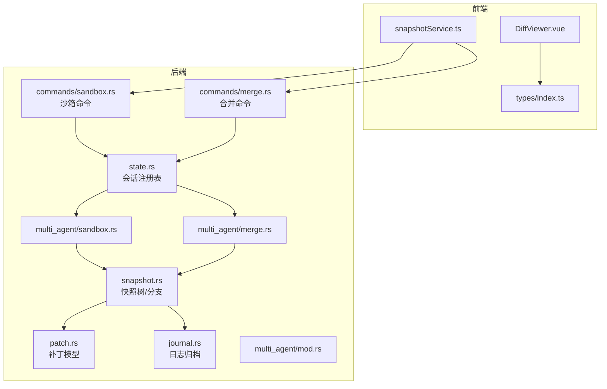
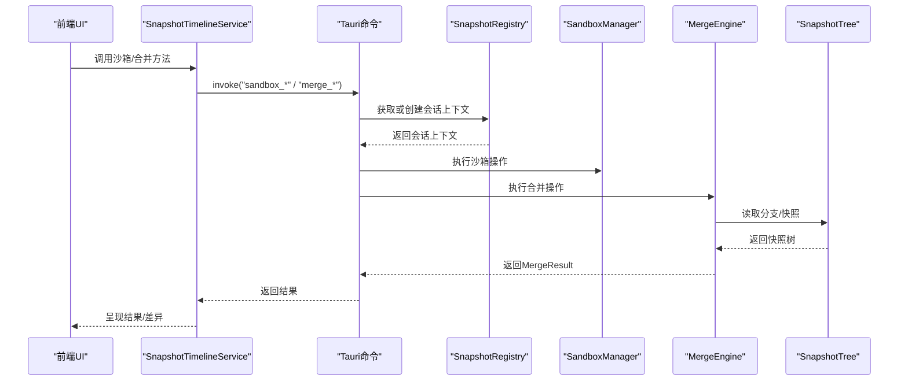
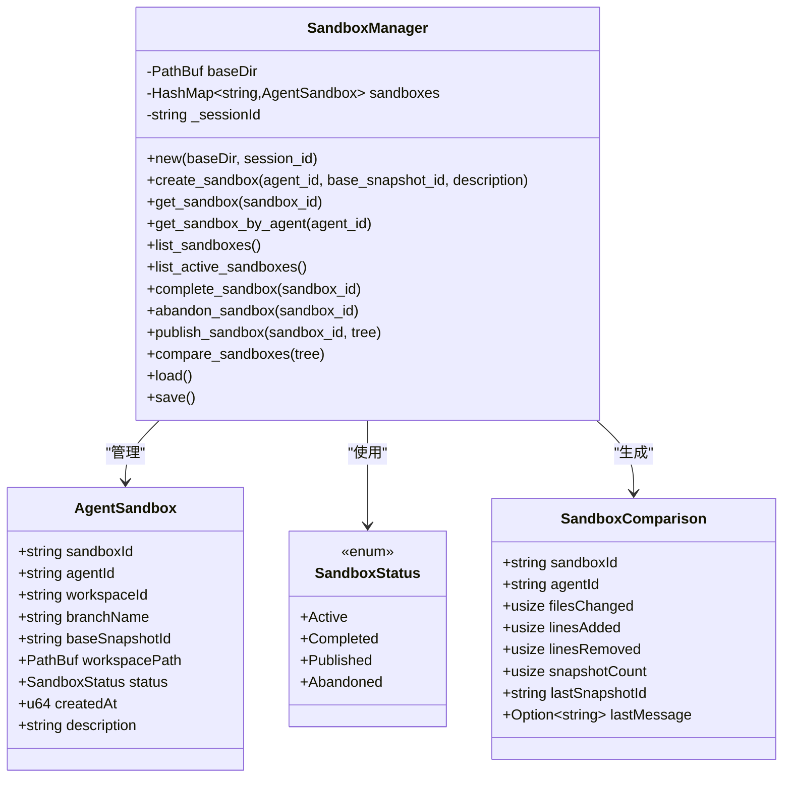
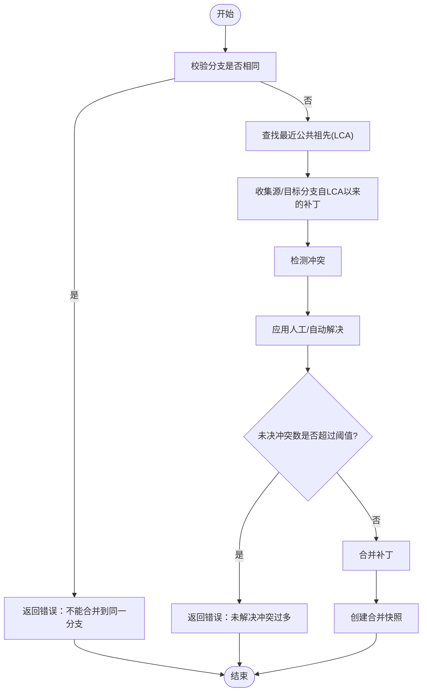
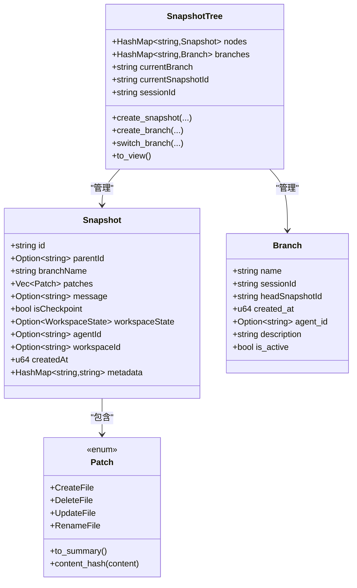
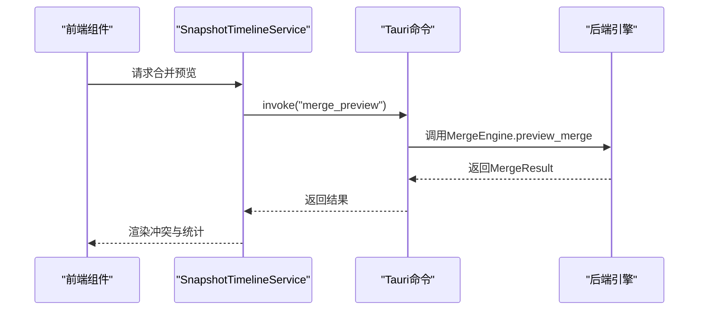
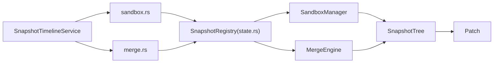

# 分支管理

<cite>
**本文引用的文件**   
- [src-tauri/src/core/snapshot_engine/multi_agent/mod.rs](file://src-tauri/src/core/snapshot_engine/multi_agent/mod.rs)
- [src-tauri/src/core/snapshot_engine/multi_agent/sandbox.rs](file://src-tauri/src/core/snapshot_engine/multi_agent/sandbox.rs)
- [src-tauri/src/core/snapshot_engine/multi_agent/merge.rs](file://src-tauri/src/core/snapshot_engine/multi_agent/merge.rs)
- [src-tauri/src/core/snapshot_engine/snapshot.rs](file://src-tauri/src/core/snapshot_engine/snapshot.rs)
- [src-tauri/src/core/snapshot_engine/patch.rs](file://src-tauri/src/core/snapshot_engine/patch.rs)
- [src-tauri/src/core/snapshot_engine/journal.rs](file://src-tauri/src/core/snapshot_engine/journal.rs)
- [src-tauri/src/core/state.rs](file://src-tauri/src/core/state.rs)
- [src-tauri/src/core/commands/sandbox.rs](file://src-tauri/src/core/commands/sandbox.rs)
- [src-tauri/src/core/commands/merge.rs](file://src-tauri/src/core/commands/merge.rs)
- [src/services/snapshotService.ts](file://src/services/snapshotService.ts)
- [src/components/snapshot/DiffViewer.vue](file://src/components/snapshot/DiffViewer.vue)
- [src/types/index.ts](file://src/types/index.ts)
- [README.md](file://README.md)
</cite>

## 目录
1. [简介](#简介)
2. [项目结构](#项目结构)
3. [核心组件](#核心组件)
4. [架构总览](#架构总览)
5. [详细组件分析](#详细组件分析)
6. [依赖关系分析](#依赖关系分析)
7. [性能考量](#性能考量)
8. [故障排查指南](#故障排查指南)
9. [结论](#结论)
10. [附录](#附录)

## 简介
本文件面向“分支管理系统”的多代理沙箱架构，围绕以下目标展开：  
- 多代理沙箱架构（Multi-Agent Sandbox）：沙箱管理器（SandboxManager）、沙箱状态管理（SandboxStatus）、并行开发环境。  
- 分支比较机制（SandboxComparison）与合并引擎（MergeEngine）：冲突检测与解决策略。  
- 冲突类型（ConflictType）、冲突解决方案（ConflictResolution）、合并结果（MergeResult）的处理流程。  
- 分支操作最佳实践、并发控制、数据同步与扩展开发指南。

该系统以 Rust 后端提供快照树与多代理沙箱能力，前端通过 Tauri 命令桥接调用，形成“会话级隔离 + 并行沙箱 + 可视化解析 + 智能合并”的完整流水线。

## 项目结构
后端采用模块化组织，核心位于快照引擎与多代理沙箱模块；前端通过服务层封装命令调用，组件层负责差异展示与交互。

图表来源
- [src-tauri/src/core/state.rs:17-77](file://src-tauri/src/core/state.rs#L17-L77)
- [src-tauri/src/core/commands/sandbox.rs:1-73](file://src-tauri/src/core/commands/sandbox.rs#L1-L73)
- [src-tauri/src/core/commands/merge.rs:1-39](file://src-tauri/src/core/commands/merge.rs#L1-L39)
- [src-tauri/src/core/snapshot_engine/snapshot.rs:40-425](file://src-tauri/src/core/snapshot_engine/snapshot.rs#L40-L425)
- [src-tauri/src/core/snapshot_engine/patch.rs:1-124](file://src-tauri/src/core/snapshot_engine/patch.rs#L1-L124)
- [src-tauri/src/core/snapshot_engine/journal.rs:1-157](file://src-tauri/src/core/snapshot_engine/journal.rs#L1-L157)
- [src-tauri/src/core/snapshot_engine/multi_agent/mod.rs:1-6](file://src-tauri/src/core/snapshot_engine/multi_agent/mod.rs#L1-L6)
- [src-tauri/src/core/snapshot_engine/multi_agent/sandbox.rs:1-248](file://src-tauri/src/core/snapshot_engine/multi_agent/sandbox.rs#L1-L248)
- [src-tauri/src/core/snapshot_engine/multi_agent/merge.rs:1-392](file://src-tauri/src/core/snapshot_engine/multi_agent/merge.rs#L1-L392)
- [src/services/snapshotService.ts:1-248](file://src/services/snapshotService.ts#L1-L248)
- [src/components/snapshot/DiffViewer.vue:1-265](file://src/components/snapshot/DiffViewer.vue#L1-L265)
- [src/types/index.ts:224-371](file://src/types/index.ts#L224-L371)

章节来源
- [README.md:107-160](file://README.md#L107-L160)

## 核心组件
- 多代理沙箱模块导出：AgentSandbox、SandboxManager、SandboxStatus、SandboxComparison；以及合并模块导出：MergeEngine、MergeResult、Conflict、ConflictType、ConflictResolution。
- 快照引擎提供 Snapshot、SnapshotTree、Branch、Patch 等基础数据结构与操作。
- 前端服务层封装 Tauri 命令，统一暴露沙箱与合并接口；组件层负责差异可视化。

章节来源
- [src-tauri/src/core/snapshot_engine/multi_agent/mod.rs:1-6](file://src-tauri/src/core/snapshot_engine/multi_agent/mod.rs#L1-L6)
- [src-tauri/src/core/snapshot_engine/snapshot.rs:6-46](file://src-tauri/src/core/snapshot_engine/snapshot.rs#L6-L46)
- [src-tauri/src/core/snapshot_engine/patch.rs:5-25](file://src-tauri/src/core/snapshot_engine/patch.rs#L5-L25)
- [src/services/snapshotService.ts:14-248](file://src/services/snapshotService.ts#L14-L248)
- [src/types/index.ts:319-371](file://src/types/index.ts#L319-L371)

## 架构总览
系统采用“会话隔离 + 沙箱并行 + 合并策略”的三层架构：

图表来源
- [src-tauri/src/core/commands/sandbox.rs:1-73](file://src-tauri/src/core/commands/sandbox.rs#L1-L73)
- [src-tauri/src/core/commands/merge.rs:1-39](file://src-tauri/src/core/commands/merge.rs#L1-L39)
- [src-tauri/src/core/state.rs:17-77](file://src-tauri/src/core/state.rs#L17-L77)
- [src-tauri/src/core/snapshot_engine/multi_agent/sandbox.rs:60-239](file://src-tauri/src/core/snapshot_engine/multi_agent/sandbox.rs#L60-L239)
- [src-tauri/src/core/snapshot_engine/multi_agent/merge.rs:60-392](file://src-tauri/src/core/snapshot_engine/multi_agent/merge.rs#L60-L392)
- [src-tauri/src/core/snapshot_engine/snapshot.rs:194-321](file://src-tauri/src/core/snapshot_engine/snapshot.rs#L194-L321)
- [src/services/snapshotService.ts:14-248](file://src/services/snapshotService.ts#L14-L248)

## 详细组件分析

### 多代理沙箱架构（SandboxManager 与 AgentSandbox）
- AgentSandbox：标识一次代理的并行开发实例，包含沙箱ID、代理ID、工作区ID、分支名、基线快照ID、工作区路径、状态、创建时间与描述。
- SandboxStatus：活动（Active）、完成（Completed）、发布（Published）、废弃（Abandoned）四种状态。
- SandboxManager：负责沙箱生命周期管理，包括创建、查询、列举、完成、废弃、发布、比较等；同时负责索引持久化（index.json）。
- SandboxComparison：对沙箱内的变更进行统计，包括变更文件数、新增/删除行数、快照数量、最后快照ID与消息。

图表来源
- [src-tauri/src/core/snapshot_engine/multi_agent/sandbox.rs:8-239](file://src-tauri/src/core/snapshot_engine/multi_agent/sandbox.rs#L8-L239)

章节来源
- [src-tauri/src/core/snapshot_engine/multi_agent/sandbox.rs:8-239](file://src-tauri/src/core/snapshot_engine/multi_agent/sandbox.rs#L8-L239)
- [src-tauri/src/core/commands/sandbox.rs:1-73](file://src-tauri/src/core/commands/sandbox.rs#L1-L73)
- [src/services/snapshotService.ts:129-187](file://src/services/snapshotService.ts#L129-L187)
- [src/types/index.ts:319-342](file://src/types/index.ts#L319-L342)

### 合并引擎（MergeEngine）与冲突处理
- MergeEngine：提供分支合并与预览能力，核心流程包括寻找最近公共祖先（LCA）、收集补丁、检测冲突、应用人工/自动解决、生成合并补丁、创建合并快照。
- 冲突类型（ConflictType）：双方修改、源文件删除、目标文件删除、双方创建、双方重命名。
- 冲突解决方案（ConflictResolution）：保留源、保留目标、保留两者（指定新路径）、手动解决（提供已解决内容）、自定义内容。
- 合并结果（MergeResult）：是否成功、目标/源分支、合并后的快照ID（可选）、冲突清单、自动解决数量、需要人工干预数量。

图表来源
- [src-tauri/src/core/snapshot_engine/multi_agent/merge.rs:71-111](file://src-tauri/src/core/snapshot_engine/multi_agent/merge.rs#L71-L111)
- [src-tauri/src/core/snapshot_engine/multi_agent/merge.rs:147-170](file://src-tauri/src/core/snapshot_engine/multi_agent/merge.rs#L147-L170)
- [src-tauri/src/core/snapshot_engine/multi_agent/merge.rs:172-195](file://src-tauri/src/core/snapshot_engine/multi_agent/merge.rs#L172-L195)
- [src-tauri/src/core/snapshot_engine/multi_agent/merge.rs:197-240](file://src-tauri/src/core/snapshot_engine/multi_agent/merge.rs#L197-L240)
- [src-tauri/src/core/snapshot_engine/multi_agent/merge.rs:283-300](file://src-tauri/src/core/snapshot_engine/multi_agent/merge.rs#L283-L300)
- [src-tauri/src/core/snapshot_engine/multi_agent/merge.rs:302-365](file://src-tauri/src/core/snapshot_engine/multi_agent/merge.rs#L302-L365)
- [src-tauri/src/core/snapshot_engine/multi_agent/merge.rs:367-384](file://src-tauri/src/core/snapshot_engine/multi_agent/merge.rs#L367-L384)

章节来源
- [src-tauri/src/core/snapshot_engine/multi_agent/merge.rs:1-392](file://src-tauri/src/core/snapshot_engine/multi_agent/merge.rs#L1-L392)
- [src-tauri/src/core/commands/merge.rs:1-39](file://src-tauri/src/core/commands/merge.rs#L1-L39)
- [src/services/snapshotService.ts:189-228](file://src/services/snapshotService.ts#L189-L228)
- [src/types/index.ts:344-371](file://src/types/index.ts#L344-L371)

### 快照树与补丁（SnapshotTree 与 Patch）
- SnapshotTree：维护节点（快照）与分支映射，支持创建分支、切分支、构建树视图、计算自上次检查点以来的补丁数等。
- Patch：抽象文件层面的操作，包括创建、删除、更新、重命名，并提供补丁摘要与内容哈希。
- Journal：对快照与分支事件进行追加式日志记录，支持回放与紧凑化。

图表来源
- [src-tauri/src/core/snapshot_engine/snapshot.rs:6-46](file://src-tauri/src/core/snapshot_engine/snapshot.rs#L6-L46)
- [src-tauri/src/core/snapshot_engine/snapshot.rs:194-321](file://src-tauri/src/core/snapshot_engine/snapshot.rs#L194-L321)
- [src-tauri/src/core/snapshot_engine/patch.rs:5-25](file://src-tauri/src/core/snapshot_engine/patch.rs#L5-L25)

章节来源
- [src-tauri/src/core/snapshot_engine/snapshot.rs:1-425](file://src-tauri/src/core/snapshot_engine/snapshot.rs#L1-L425)
- [src-tauri/src/core/snapshot_engine/patch.rs:1-124](file://src-tauri/src/core/snapshot_engine/patch.rs#L1-L124)
- [src-tauri/src/core/snapshot_engine/journal.rs:1-157](file://src-tauri/src/core/snapshot_engine/journal.rs#L1-L157)

### 前端集成与差异可视化
- SnapshotTimelineService：封装 Tauri 命令，提供沙箱与合并相关方法，内置树与摘要缓存，提升交互性能。
- DiffViewer：根据 Patch 类型渲染差异，支持创建、删除、更新、重命名的可视化呈现。
- 类型定义：前后端一致的类型契约，保证数据结构稳定与可维护性。

图表来源
- [src/services/snapshotService.ts:189-200](file://src/services/snapshotService.ts#L189-L200)
- [src-tauri/src/core/commands/merge.rs:5-14](file://src-tauri/src/core/commands/merge.rs#L5-L14)
- [src-tauri/src/core/snapshot_engine/multi_agent/merge.rs:113-145](file://src-tauri/src/core/snapshot_engine/multi_agent/merge.rs#L113-L145)

章节来源
- [src/services/snapshotService.ts:1-248](file://src/services/snapshotService.ts#L1-L248)
- [src/components/snapshot/DiffViewer.vue:1-265](file://src/components/snapshot/DiffViewer.vue#L1-L265)
- [src/types/index.ts:224-371](file://src/types/index.ts#L224-L371)

## 依赖关系分析
- 组件耦合与内聚：SandboxManager 与 MergeEngine 通过 SnapshotTree 解耦，前者专注沙箱生命周期，后者专注合并策略；二者均依赖 Patch 抽象。
- 外部依赖：Rust 标准库、serde 序列化、uuid 生成、tokio 异步运行时（通过 state.rs 的锁与会话管理体现）。
- 前后端通信：通过 Tauri 命令桥接，前端服务层统一调度，降低 UI 与后端实现细节耦合。

图表来源
- [src-tauri/src/core/state.rs:17-77](file://src-tauri/src/core/state.rs#L17-L77)
- [src-tauri/src/core/commands/sandbox.rs:1-73](file://src-tauri/src/core/commands/sandbox.rs#L1-L73)
- [src-tauri/src/core/commands/merge.rs:1-39](file://src-tauri/src/core/commands/merge.rs#L1-L39)
- [src-tauri/src/core/snapshot_engine/multi_agent/sandbox.rs:60-239](file://src-tauri/src/core/snapshot_engine/multi_agent/sandbox.rs#L60-L239)
- [src-tauri/src/core/snapshot_engine/multi_agent/merge.rs:60-392](file://src-tauri/src/core/snapshot_engine/multi_agent/merge.rs#L60-L392)
- [src-tauri/src/core/snapshot_engine/snapshot.rs:40-46](file://src-tauri/src/core/snapshot_engine/snapshot.rs#L40-L46)
- [src-tauri/src/core/snapshot_engine/patch.rs:1-25](file://src-tauri/src/core/snapshot_engine/patch.rs#L1-L25)

章节来源
- [src-tauri/src/core/state.rs:1-78](file://src-tauri/src/core/state.rs#L1-L78)
- [src-tauri/src/core/snapshot_engine/multi_agent/mod.rs:1-6](file://src-tauri/src/core/snapshot_engine/multi_agent/mod.rs#L1-L6)

## 性能考量
- 缓存策略：前端服务层对树视图与摘要进行缓存，减少重复请求；后端索引持久化避免频繁重建。
- 异步并发：会话上下文使用读写锁保护，命令处理异步执行，适合多代理并行场景。
- 日志紧凑：Journal 在达到阈值后进行紧凑化，降低磁盘占用与回放成本。
- 合并阈值：冲突阈值控制未决冲突数量，防止大规模冲突导致的合并失败。

章节来源
- [src/services/snapshotService.ts:14-248](file://src/services/snapshotService.ts#L14-L248)
- [src-tauri/src/core/state.rs:17-77](file://src-tauri/src/core/state.rs#L17-L77)
- [src-tauri/src/core/snapshot_engine/journal.rs:102-151](file://src-tauri/src/core/snapshot_engine/journal.rs#L102-L151)
- [src-tauri/src/core/snapshot_engine/multi_agent/merge.rs:60-69](file://src-tauri/src/core/snapshot_engine/multi_agent/merge.rs#L60-L69)

## 故障排查指南
- 沙箱相关错误（SandboxError）：未找到、已存在、状态非法、IO/JSON 错误、分支错误。定位要点：检查沙箱ID、状态流转、工作区路径是否存在。
- 合并相关错误（MergeError）：分支不存在、无公共祖先、未解决冲突过多、同分支合并。定位要点：确认源/目标分支存在且非同一分支；检查 LCA 查找与补丁收集；评估冲突阈值。
- 前端调用异常：确认 Tauri 命令已正确注册，会话ID有效，参数传递正确。

章节来源
- [src-tauri/src/core/snapshot_engine/multi_agent/sandbox.rs:44-58](file://src-tauri/src/core/snapshot_engine/multi_agent/sandbox.rs#L44-L58)
- [src-tauri/src/core/snapshot_engine/multi_agent/merge.rs:48-58](file://src-tauri/src/core/snapshot_engine/multi_agent/merge.rs#L48-L58)
- [src-tauri/src/core/commands/sandbox.rs:1-73](file://src-tauri/src/core/commands/sandbox.rs#L1-L73)
- [src-tauri/src/core/commands/merge.rs:1-39](file://src-tauri/src/core/commands/merge.rs#L1-L39)

## 结论
本分支管理系统通过“多代理沙箱 + 快照树 + 智能合并”实现了高并发、可审计、可可视化的并行开发与分支治理。SandboxManager 提供稳定的沙箱生命周期管理，MergeEngine 提供可配置的冲突检测与解决策略，前端通过服务层与组件层实现高效交互。建议在生产环境中结合会话隔离、冲突阈值与日志紧凑策略，确保系统稳定性与可维护性。

## 附录
- 最佳实践
  - 使用“完成（Completed）→ 发布（Published）”的状态机，确保合并前的沙箱处于稳定状态。
  - 合并前先执行“预览（preview_merge）”，评估冲突数量与类型，合理设置冲突阈值。
  - 对于“双方创建/双方重命名”等可自动解决的冲突，优先采用自动策略，减少人工干预。
  - 使用“最近公共祖先（LCA）”算法保证合并的正确性，避免跨分支的不兼容变更。
- 并发控制
  - 会话级隔离：每个会话拥有独立的 SnapshotRegistry 与 SnapshotTree，避免跨会话干扰。
  - 读写锁：对会话上下文与注册表使用读写锁，保障并发安全。
- 数据同步
  - 快照树与索引持久化：沙箱索引与快照树定期保存，确保崩溃恢复与一致性。
  - 日志归档：Journal 记录关键事件，支持回放与诊断。
- 扩展开发指南
  - 新增冲突类型：在 ConflictType 中扩展枚举值，并在冲突检测与解决逻辑中补充分支。
  - 新增冲突解决方案：在 ConflictResolution 中扩展变体，并在合并补丁生成阶段处理新策略。
  - 新增合并策略：在 MergeEngine 中扩展合并补丁生成逻辑，保持与现有数据结构兼容。