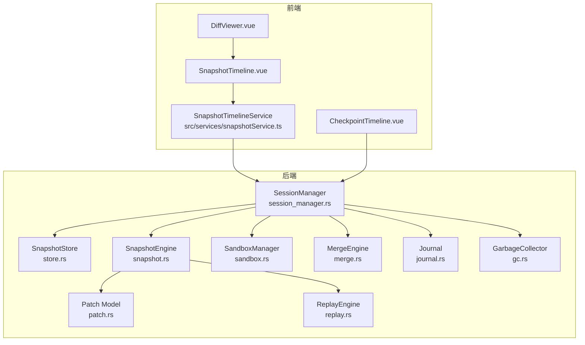
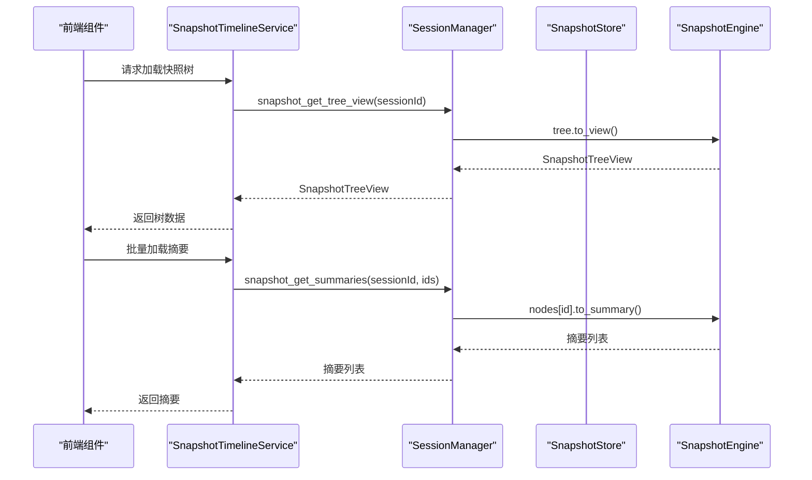
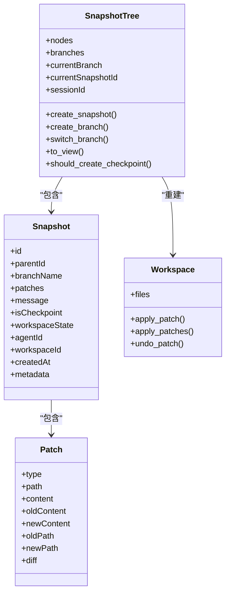
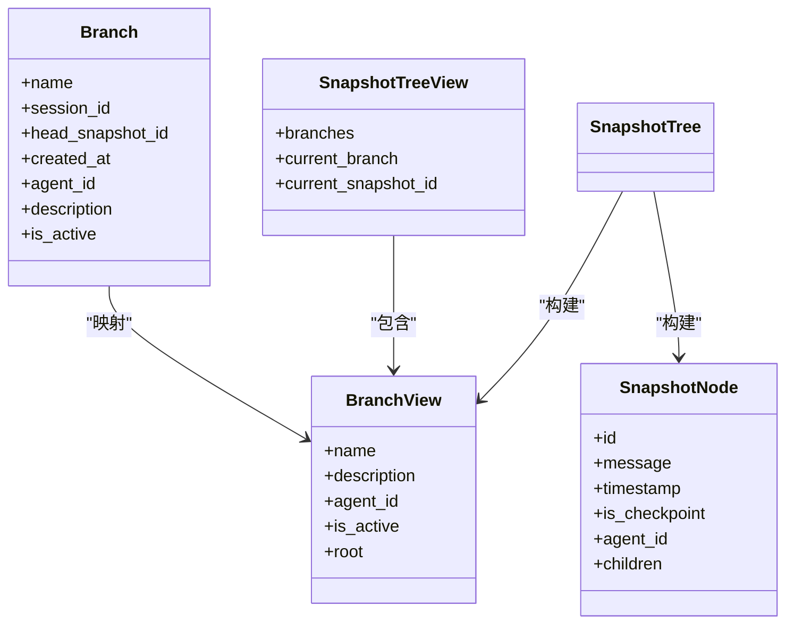
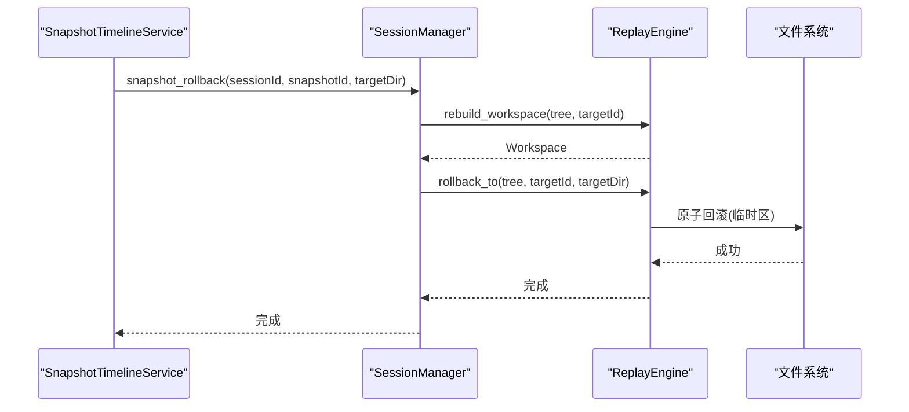
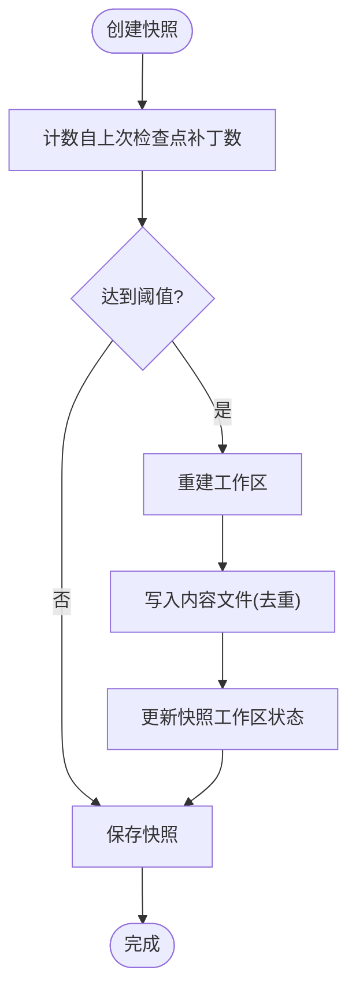
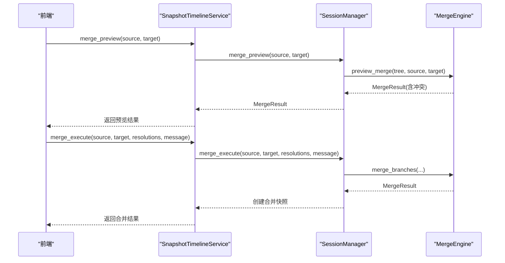
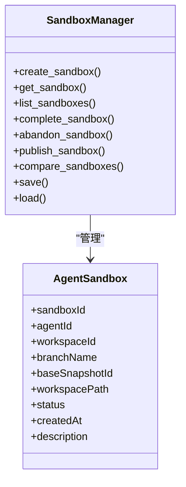
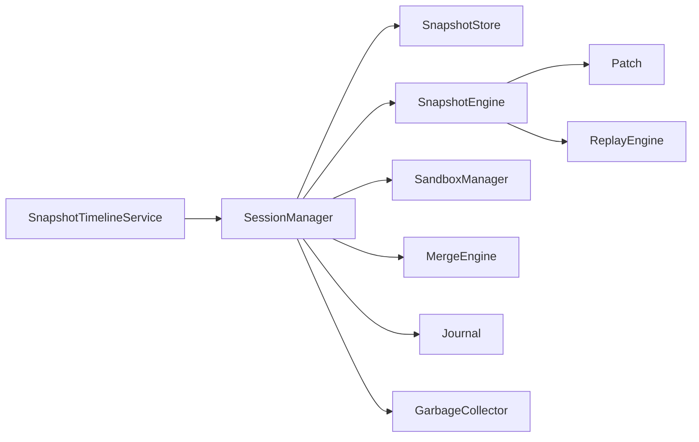

# 快照和检查点系统

<cite>
**本文档引用的文件**
- [snapshotService.ts](file://src/services/snapshotService.ts)
- [SnapshotTimeline.vue](file://src/components/snapshot/SnapshotTimeline.vue)
- [DiffViewer.vue](file://src/components/snapshot/DiffViewer.vue)
- [CheckpointTimeline.vue](file://src/components/checkpoint/CheckpointTimeline.vue)
- [mod.rs](file://src-tauri/src/core/snapshot_engine/mod.rs)
- [snapshot.rs](file://src-tauri/src/core/snapshot_engine/snapshot.rs)
- [patch.rs](file://src-tauri/src/core/snapshot_engine/patch.rs)
- [replay.rs](file://src-tauri/src/core/snapshot_engine/replay.rs)
- [journal.rs](file://src-tauri/src/core/snapshot_engine/journal.rs)
- [gc.rs](file://src-tauri/src/core/snapshot_engine/gc.rs)
- [merge.rs](file://src-tauri/src/core/snapshot_engine/multi_agent/merge.rs)
- [sandbox.rs](file://src-tauri/src/core/snapshot_engine/multi_agent/sandbox.rs)
- [store.rs](file://src-tauri/src/core/snapshot_manager/store.rs)
- [session_manager.rs](file://src-tauri/src/core/snapshot_manager/session_manager.rs)
- [snapshot.rs](file://src-tauri/src/core/commands/snapshot.rs)
- [checkpoint.rs](file://src-tauri/src/core/commands/checkpoint.rs)
- [index.ts](file://src/types/index.ts)
</cite>

## 更新摘要
**所做更改**
- 新增快照引擎详细架构章节，包含补丁模型、快照树、工作区应用等核心组件
- 新增文件级树形版本控制章节，详细说明分支管理、节点视图转换
- 新增原子化回滚机制章节，包含事务性回滚、撤销日志和临时区机制
- 新增检查点管理系统章节，涵盖自动检查点、内容去重和存储优化
- 新增分支与合并章节，详细说明冲突检测、自动解决和手动处理
- 新增多代理沙箱章节，包含沙箱生命周期管理和比较功能
- 更新性能考虑章节，新增垃圾回收、日志压缩和懒加载重建
- 新增故障排除指南，涵盖回滚失败、合并冲突和沙箱问题

## 目录
1. [简介](#简介)
2. [项目结构](#项目结构)
3. [核心组件](#核心组件)
4. [架构总览](#架构总览)
5. [详细组件分析](#详细组件分析)
6. [依赖关系分析](#依赖关系分析)
7. [性能考虑](#性能考虑)
8. [故障排除指南](#故障排除指南)
9. [结论](#结论)
10. [附录](#附录)

## 简介
本文件面向 JarvisAgent 的快照与检查点系统，提供从架构设计到实现细节的完整文档。系统支持：
- 文件变更追踪：以补丁（Patch）形式记录文件增删改与重命名
- 增量快照：基于父节点的增量存储，结合检查点进行内容去重
- 存储优化：通过内容哈希与检查点机制减少重复存储
- 检查点管理：自动与手动检查点、分支与回滚
- 版本回滚：原子化文件回滚，保障数据一致性
- 分支与合并：并行开发、冲突检测与解决
- 多代理沙箱：隔离开发环境与跨沙箱比较

## 项目结构
前端采用 Vue 组件负责展示与交互，后端 Rust 提供快照引擎与存储管理。核心模块划分如下：
- 前端服务层：统一调用后端命令，缓存与批量加载
- 前端视图层：快照时间线、差异查看器、检查点时间线
- 后端引擎层：补丁模型、快照树、回放引擎、合并引擎、沙箱管理
- 后端存储层：快照持久化、树持久化、内容存储

**图表来源**
- [snapshotService.ts:14-229](file://src/services/snapshotService.ts#L14-L229)
- [SnapshotTimeline.vue:1-200](file://src/components/snapshot/SnapshotTimeline.vue#L1-L200)
- [CheckpointTimeline.vue:1-137](file://src/components/checkpoint/CheckpointTimeline.vue#L1-L137)
- [session_manager.rs:18-57](file://src-tauri/src/core/snapshot_manager/session_manager.rs#L18-L57)
- [store.rs:13-104](file://src-tauri/src/core/snapshot_manager/store.rs#L13-L104)
- [snapshot.rs:6-100](file://src-tauri/src/core/snapshot_engine/snapshot.rs#L6-L100)
- [patch.rs:5-58](file://src-tauri/src/core/snapshot_engine/patch.rs#L5-L58)
- [replay.rs:23-51](file://src-tauri/src/core/snapshot_engine/replay.rs#L23-L51)
- [sandbox.rs:60-107](file://src-tauri/src/core/snapshot_engine/multi_agent/sandbox.rs#L60-L107)
- [merge.rs:60-111](file://src-tauri/src/core/snapshot_engine/multi_agent/merge.rs#L60-L111)
- [journal.rs:1-157](file://src-tauri/src/core/snapshot_engine/journal.rs#L1-L157)
- [gc.rs:1-107](file://src-tauri/src/core/snapshot_engine/gc.rs#L1-L107)

**章节来源**
- [snapshotService.ts:14-229](file://src/services/snapshotService.ts#L14-L229)
- [SnapshotTimeline.vue:1-200](file://src/components/snapshot/SnapshotTimeline.vue#L1-L200)
- [CheckpointTimeline.vue:1-137](file://src/components/checkpoint/CheckpointTimeline.vue#L1-L137)
- [session_manager.rs:18-57](file://src-tauri/src/core/snapshot_manager/session_manager.rs#L18-L57)

## 核心组件
- 快照服务（前端）：封装 Tauri 命令调用，提供树加载、摘要批量加载、详情加载、分支操作、回滚、沙箱与合并接口，并内置缓存
- 快照时间线（前端）：渲染快照树、分支标签、展开/折叠、查看详情、回滚确认、创建分支
- 差异查看器（前端）：按行对比显示新增/删除/上下文行
- 检查点时间线（前端）：展示检查点列表、分支切换、回滚到检查点、创建分支
- 会话管理器（后端）：生命周期管理、快照创建与持久化、分支与回滚、沙箱与合并、日志与压缩
- 快照引擎：补丁模型、快照树、工作区应用/撤销、检查点生成
- 回放引擎：从快照链重建工作区、原子化回滚、懒加载重建
- 存储：快照 JSON、树 JSON、内容去重存储
- 沙箱管理：多代理隔离工作区、沙箱比较
- 合并引擎：冲突检测与自动/手动解决、合并快照创建
- 日志系统：事件日志记录、压缩和重放
- 垃圾收集器：快照清理、分支孤儿检测、空间回收

**章节来源**
- [snapshotService.ts:14-229](file://src/services/snapshotService.ts#L14-L229)
- [SnapshotTimeline.vue:1-200](file://src/components/snapshot/SnapshotTimeline.vue#L1-L200)
- [DiffViewer.vue:1-111](file://src/components/snapshot/DiffViewer.vue#L1-L111)
- [CheckpointTimeline.vue:1-137](file://src/components/checkpoint/CheckpointTimeline.vue#L1-L137)
- [session_manager.rs:59-131](file://src-tauri/src/core/snapshot_manager/session_manager.rs#L59-L131)
- [snapshot.rs:6-100](file://src-tauri/src/core/snapshot_engine/snapshot.rs#L6-L100)
- [replay.rs:52-92](file://src-tauri/src/core/snapshot_engine/replay.rs#L52-L92)
- [store.rs:22-76](file://src-tauri/src/core/snapshot_manager/store.rs#L22-L76)
- [sandbox.rs:75-120](file://src-tauri/src/core/snapshot_engine/multi_agent/sandbox.rs#L75-L120)
- [merge.rs:71-111](file://src-tauri/src/core/snapshot_engine/multi_agent/merge.rs#L71-L111)
- [journal.rs:1-157](file://src-tauri/src/core/snapshot_engine/journal.rs#L1-L157)
- [gc.rs:1-107](file://src-tauri/src/core/snapshot_engine/gc.rs#L1-L107)

## 架构总览
系统采用"前端命令调用 + 后端引擎"的分层架构。前端通过 Tauri invoke 调用后端命令，后端在会话管理器中协调存储、引擎与日志。

**图表来源**
- [snapshotService.ts:24-60](file://src/services/snapshotService.ts#L24-L60)
- [session_manager.rs:138-148](file://src-tauri/src/core/snapshot_manager/session_manager.rs#L138-L148)
- [snapshot.rs:323-359](file://src-tauri/src/core/snapshot_engine/snapshot.rs#L323-L359)

**章节来源**
- [snapshotService.ts:24-60](file://src/services/snapshotService.ts#L24-L60)
- [session_manager.rs:138-148](file://src-tauri/src/core/snapshot_manager/session_manager.rs#L138-L148)
- [snapshot.rs:323-359](file://src-tauri/src/core/snapshot_engine/snapshot.rs#L323-L359)

## 详细组件分析

### 快照引擎架构
- 补丁模型：抽象文件操作（创建/删除/更新/重命名），支持文本差异结构
- 快照树：以分支为单位维护头节点，支持构建树视图、计算自上次检查点的补丁数
- 工作区应用：顺序应用补丁或撤销补丁，保证幂等性
- 检查点：定期生成，记录工作区状态（文件哈希与大小），用于快速重建

**图表来源**
- [patch.rs:5-58](file://src-tauri/src/core/snapshot_engine/patch.rs#L5-L58)
- [snapshot.rs:6-100](file://src-tauri/src/core/snapshot_engine/snapshot.rs#L6-L100)
- [snapshot.rs:101-178](file://src-tauri/src/core/snapshot_engine/snapshot.rs#L101-L178)
- [snapshot.rs:194-256](file://src-tauri/src/core/snapshot_engine/snapshot.rs#L194-L256)

**章节来源**
- [patch.rs:5-58](file://src-tauri/src/core/snapshot_engine/patch.rs#L5-L58)
- [snapshot.rs:6-100](file://src-tauri/src/core/snapshot_engine/snapshot.rs#L6-L100)
- [snapshot.rs:101-178](file://src-tauri/src/core/snapshot_engine/snapshot.rs#L101-L178)
- [snapshot.rs:194-256](file://src-tauri/src/core/snapshot_engine/snapshot.rs#L194-L256)

### 文件级树形版本控制
- 分支管理：创建新分支指向指定快照，激活分支变更头节点
- 树视图转换：将快照树转换为前端友好的分支视图结构
- 节点构建：递归构建快照树，支持空分支和异常节点处理
- 保护ID集合：维护分支头部快照的保护集合，防止被垃圾回收

**图表来源**
- [snapshot.rs:48-87](file://src-tauri/src/core/snapshot_engine/snapshot.rs#L48-L87)
- [snapshot.rs:323-388](file://src-tauri/src/core/snapshot_engine/snapshot.rs#L323-L388)

**章节来源**
- [snapshot.rs:48-87](file://src-tauri/src/core/snapshot_engine/snapshot.rs#L48-L87)
- [snapshot.rs:323-388](file://src-tauri/src/core/snapshot_engine/snapshot.rs#L323-L388)
- [snapshot.rs:390-410](file://src-tauri/src/core/snapshot_engine/snapshot.rs#L390-L410)

### 原子化回滚机制
- 重建工作区：从目标快照向上遍历，遇到检查点则直接加载其工作区状态，否则顺序应用补丁
- 原子回滚：先备份目标目录至临时区，再按备份信息执行重命名/删除/创建，确保可恢复
- 懒加载重建：在当前工作区与目标之间查找最近公共祖先，仅对差异部分应用/撤销补丁
- 撤销日志：记录回滚操作的详细信息，支持回滚失败时的恢复

**图表来源**
- [snapshotService.ts:104-111](file://src/services/snapshotService.ts#L104-L111)
- [session_manager.rs:186-199](file://src-tauri/src/core/snapshot_manager/session_manager.rs#L186-L199)
- [replay.rs:227-245](file://src-tauri/src/core/snapshot_engine/replay.rs#L227-L245)
- [replay.rs:248-322](file://src-tauri/src/core/snapshot_engine/replay.rs#L248-L322)

**章节来源**
- [snapshotService.ts:104-111](file://src/services/snapshotService.ts#L104-L111)
- [session_manager.rs:186-199](file://src-tauri/src/core/snapshot_manager/session_manager.rs#L186-L199)
- [replay.rs:227-245](file://src-tauri/src/core/snapshot_engine/replay.rs#L227-L245)
- [replay.rs:248-322](file://src-tauri/src/core/snapshot_engine/replay.rs#L248-L322)

### 检查点管理系统
- 自动检查点：每累计固定数量的补丁生成一次检查点
- 检查点内容：序列化工作区状态（文件路径到哈希与大小）
- 内容去重：检查点中记录的哈希对应内容文件，仅在首次出现时写入
- 日志压缩：当日志条目超过阈值时进行压缩，减少存储空间

**图表来源**
- [snapshot.rs:258-279](file://src-tauri/src/core/snapshot_engine/snapshot.rs#L258-L279)
- [session_manager.rs:69-104](file://src-tauri/src/core/snapshot_manager/session_manager.rs#L69-L104)
- [snapshot.rs:234-256](file://src-tauri/src/core/snapshot_engine/snapshot.rs#L234-L256)

**章节来源**
- [snapshot.rs:258-279](file://src-tauri/src/core/snapshot_engine/snapshot.rs#L258-L279)
- [session_manager.rs:69-104](file://src-tauri/src/core/snapshot_manager/session_manager.rs#L69-L104)
- [snapshot.rs:234-256](file://src-tauri/src/core/snapshot_engine/snapshot.rs#L234-L256)

### 分支与合并
- 分支：创建新分支指向指定快照，激活分支变更头节点
- 预览合并：计算源/目标分支自共同祖先以来的补丁，检测冲突并统计可自动解决数量
- 执行合并：应用用户提供的冲突解决方案，生成合并后的快照

**图表来源**
- [snapshotService.ts:191-228](file://src/services/snapshotService.ts#L191-L228)
- [session_manager.rs:308-370](file://src-tauri/src/core/snapshot_manager/session_manager.rs#L308-L370)
- [merge.rs:113-145](file://src-tauri/src/core/snapshot_engine/multi_agent/merge.rs#L113-L145)
- [merge.rs:367-384](file://src-tauri/src/core/snapshot_engine/multi_agent/merge.rs#L367-L384)

**章节来源**
- [snapshotService.ts:191-228](file://src/services/snapshotService.ts#L191-L228)
- [session_manager.rs:308-370](file://src-tauri/src/core/snapshot_manager/session_manager.rs#L308-L370)
- [merge.rs:113-145](file://src-tauri/src/core/snapshot_engine/multi_agent/merge.rs#L113-L145)
- [merge.rs:367-384](file://src-tauri/src/core/snapshot_engine/multi_agent/merge.rs#L367-L384)

### 多代理沙箱
- 沙箱创建：为代理创建独立分支与工作区目录，状态管理
- 沙箱比较：统计各沙箱变更文件数、增删行数、快照数量与最后消息
- 发布流程：将已完成沙箱合并到主分支或生成合并分支

**图表来源**
- [sandbox.rs:8-42](file://src-tauri/src/core/snapshot_engine/multi_agent/sandbox.rs#L8-L42)
- [sandbox.rs:60-120](file://src-tauri/src/core/snapshot_engine/multi_agent/sandbox.rs#L60-L120)
- [sandbox.rs:177-210](file://src-tauri/src/core/snapshot_engine/multi_agent/sandbox.rs#L177-L210)

**章节来源**
- [sandbox.rs:8-42](file://src-tauri/src/core/snapshot_engine/multi_agent/sandbox.rs#L8-L42)
- [sandbox.rs:60-120](file://src-tauri/src/core/snapshot_engine/multi_agent/sandbox.rs#L60-L120)
- [sandbox.rs:177-210](file://src-tauri/src/core/snapshot_engine/multi_agent/sandbox.rs#L177-L210)

### 日志与垃圾回收
- 事件日志：记录所有快照操作，支持重放和审计
- 日志压缩：当日志条目超过阈值时进行压缩，减少存储空间
- 垃圾收集：清理孤儿快照和分支，回收磁盘空间
- 保护机制：保持分支头部快照不被删除

**章节来源**
- [journal.rs:1-157](file://src-tauri/src/core/snapshot_engine/journal.rs#L1-L157)
- [gc.rs:1-107](file://src-tauri/src/core/snapshot_engine/gc.rs#L1-L107)

## 依赖关系分析
- 前端服务层依赖后端命令接口，通过 Tauri invoke 调用
- 会话管理器聚合存储、引擎与日志，提供统一入口
- 引擎模块内部解耦：补丁模型独立于快照树；回放引擎独立于存储
- 沙箱与合并引擎作为多代理能力的扩展模块

**图表来源**
- [snapshotService.ts:14-229](file://src/services/snapshotService.ts#L14-L229)
- [session_manager.rs:18-57](file://src-tauri/src/core/snapshot_manager/session_manager.rs#L18-L57)
- [mod.rs:1-14](file://src-tauri/src/core/snapshot_engine/mod.rs#L1-L14)
- [mod.rs:1-6](file://src-tauri/src/core/snapshot_manager/mod.rs#L1-L6)

**章节来源**
- [snapshotService.ts:14-229](file://src/services/snapshotService.ts#L14-L229)
- [session_manager.rs:18-57](file://src-tauri/src/core/snapshot_manager/session_manager.rs#L18-L57)
- [mod.rs:1-14](file://src-tauri/src/core/snapshot_engine/mod.rs#L1-L14)
- [mod.rs:1-6](file://src-tauri/src/core/snapshot_manager/mod.rs#L1-L6)

## 性能考虑
- 内容去重：检查点记录文件哈希，内容只存储一次，显著降低存储空间
- 懒加载重建：回放引擎在当前工作区与目标之间查找最近公共祖先，仅对差异部分应用/撤销补丁
- 批量摘要：前端一次性请求多个快照摘要，减少网络往返
- 日志压缩：当日志过大时触发压缩，减少读取开销
- 垃圾回收：定期清理孤儿快照和分支，释放磁盘空间
- 并发安全：使用读写锁确保多线程环境下的数据一致性

**章节来源**
- [session_manager.rs:124-128](file://src-tauri/src/core/snapshot_manager/session_manager.rs#L124-L128)
- [replay.rs:123-149](file://src-tauri/src/core/snapshot_engine/replay.rs#L123-L149)
- [snapshotService.ts:33-46](file://src/services/snapshotService.ts#L33-L46)
- [gc.rs:39-77](file://src-tauri/src/core/snapshot_engine/gc.rs#L39-L77)

## 故障排除指南
- 回滚失败：检查目标目录权限、磁盘空间、临时目录创建是否成功
- 快照树为空：确认会话 ID 正确、快照树是否已初始化、存储文件是否存在
- 合并冲突过多：根据预览结果调整冲突解决策略，必要时限制冲突阈值
- 沙箱发布失败：确认沙箱状态为已完成，分支存在且可合并
- 日志损坏：使用日志压缩功能重建日志文件
- 垃圾回收异常：检查保护ID集合和孤儿分支检测逻辑

**章节来源**
- [replay.rs:248-322](file://src-tauri/src/core/snapshot_engine/replay.rs#L248-L322)
- [session_manager.rs:138-148](file://src-tauri/src/core/snapshot_manager/session_manager.rs#L138-L148)
- [merge.rs:48-58](file://src-tauri/src/core/snapshot_engine/multi_agent/merge.rs#L48-L58)
- [sandbox.rs:153-175](file://src-tauri/src/core/snapshot_engine/multi_agent/sandbox.rs#L153-L175)
- [journal.rs:102-151](file://src-tauri/src/core/snapshot_engine/journal.rs#L102-L151)
- [gc.rs:79-98](file://src-tauri/src/core/snapshot_engine/gc.rs#L79-L98)

## 结论
JarvisAgent 的快照与检查点系统通过"补丁驱动 + 检查点去重 + 原子回滚"的组合，实现了高效、可靠、可扩展的版本管理能力。前端提供直观的时间线与差异查看，后端以会话管理器为核心，协调存储、引擎与日志，支撑分支、合并与多代理沙箱场景。新增的日志系统和垃圾回收机制进一步提升了系统的稳定性和性能。

## 附录

### 使用示例与最佳实践
- 快照创建：在文件变更后调用创建快照接口，自动触发检查点生成
- 快照回滚：选择目标快照，确认回滚，系统将原子化恢复到该快照状态
- 分支管理：从任意快照创建分支，进行并行开发后再进行合并
- 冲突解决：预览合并结果，针对冲突选择保留源/目标/两者或手动解决
- 沙箱开发：为不同代理创建沙箱，完成后发布到主干或生成合并分支
- 日志管理：定期检查日志文件大小，必要时进行压缩操作
- 垃圾回收：设置合适的回收配置，定期清理无用快照和分支

**章节来源**
- [snapshotService.ts:62-78](file://src/services/snapshotService.ts#L62-L78)
- [snapshotService.ts:104-111](file://src/services/snapshotService.ts#L104-L111)
- [snapshotService.ts:189-228](file://src/services/snapshotService.ts#L189-L228)
- [sandbox.rs:153-175](file://src-tauri/src/core/snapshot_engine/multi_agent/sandbox.rs#L153-L175)
- [checkpoint.rs:88-147](file://src-tauri/src/core/commands/checkpoint.rs#L88-L147)

### 扩展开发建议
- 增强冲突检测：支持更复杂的冲突类型与自动解决策略
- 优化存储：引入压缩与分片策略，提升大仓库性能
- 前端体验：增加快照搜索、筛选与导出功能
- 安全加固：在回滚前进行完整性校验与备份
- 监控告警：添加系统监控指标和异常告警机制
- 多语言支持：扩展国际化支持，适配不同地区用户需求