# 快照引擎

<cite>
**本文档引用的文件**
- [mod.rs](file://src-tauri/src/core/snapshot_engine/mod.rs)
- [snapshot.rs](file://src-tauri/src/core/snapshot_engine/snapshot.rs)
- [patch.rs](file://src-tauri/src/core/snapshot_engine/patch.rs)
- [journal.rs](file://src-tauri/src/core/snapshot_engine/journal.rs)
- [store.rs](file://src-tauri/src/core/snapshot_manager/store.rs)
- [replay.rs](file://src-tauri/src/core/snapshot_engine/replay.rs)
- [gc.rs](file://src-tauri/src/core/snapshot_engine/gc.rs)
- [multi_agent/mod.rs](file://src-tauri/src/core/snapshot_engine/multi_agent/mod.rs)
- [multi_agent/sandbox.rs](file://src-tauri/src/core/snapshot_engine/multi_agent/sandbox.rs)
- [multi_agent/merge.rs](file://src-tauri/src/core/snapshot_engine/multi_agent/merge.rs)
- [snapshot.rs（命令层）](file://src-tauri/src/core/commands/snapshot.rs)
- [snapshotService.ts](file://src/services/snapshotService.ts)
- [index.ts（类型定义）](file://src/types/index.ts)
- [DiffViewer.vue](file://src/components/snapshot/DiffViewer.vue)
</cite>

## 目录
1. [简介](#简介)
2. [项目结构](#项目结构)
3. [核心组件](#核心组件)
4. [架构总览](#架构总览)
5. [详细组件分析](#详细组件分析)
6. [依赖关系分析](#依赖关系分析)
7. [性能考量](#性能考量)
8. [故障排查指南](#故障排查指南)
9. [结论](#结论)
10. [附录](#附录)

## 简介
本文件为快照引擎的深入技术文档，覆盖快照树结构（SnapshotTree、SnapshotNode）、文件变更追踪（Patch、TextDiff、DiffHunk）、增量补丁生成与应用、快照数据格式与存储策略、回放与原子回滚、日志记录（Journal）机制、垃圾回收（GC）、多代理沙箱与分支合并等。文档同时提供 API 使用方法、错误处理策略与性能调优建议，并通过图示展示关键流程。

**更新** 根据最新代码变更，快照引擎已简化多代理功能，移除了高级特性中的沙箱和合并操作，但仍保留基础的多代理模块结构以便未来扩展。

## 项目结构
快照引擎位于 Rust 后端模块 src-tauri/src/core/snapshot_engine 下，前端通过 Tauri 命令与 TypeScript 服务进行交互。核心目录组织如下：
- snapshot_engine：快照引擎核心实现（快照树、补丁、回放、日志、GC、多代理）
- snapshot_manager：持久化存储（快照与树的 JSON 存储）
- commands：Tauri 命令入口，桥接前端与后端
- 类型定义：前后端统一的类型接口（src/types/index.ts）

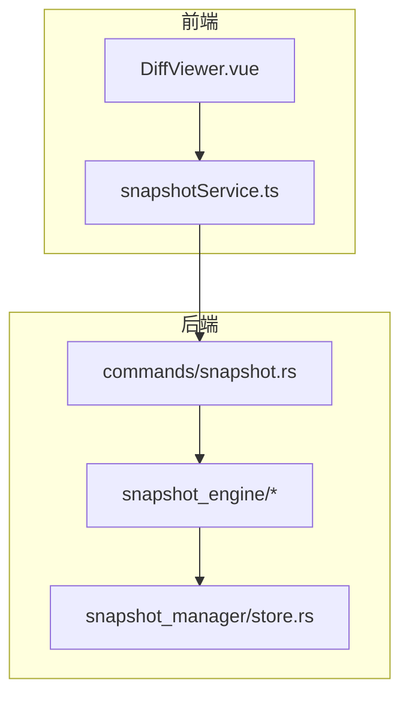

**图表来源**
- [snapshot.rs（命令层）:1-128](file://src-tauri/src/core/commands/snapshot.rs#L1-L128)
- [snapshotService.ts:1-248](file://src/services/snapshotService.ts#L1-L248)
- [store.rs:1-104](file://src-tauri/src/core/snapshot_manager/store.rs#L1-L104)

**章节来源**
- [mod.rs:1-30](file://src-tauri/src/core/snapshot_engine/mod.rs#L1-L30)
- [snapshot.rs（命令层）:1-128](file://src-tauri/src/core/commands/snapshot.rs#L1-L128)
- [snapshotService.ts:1-248](file://src/services/snapshotService.ts#L1-L248)
- [store.rs:1-104](file://src-tauri/src/core/snapshot_manager/store.rs#L1-L104)

## 核心组件
- 快照模型与树
  - Snapshot：快照实体，包含父 ID、分支名、补丁列表、消息、是否检查点、工作区状态、元数据等
  - SnapshotTree：快照树，维护节点映射、分支集合、当前分支与当前快照 ID
  - SnapshotNode/View：树视图节点与分支视图
  - WorkspaceState/FileInfo：工作区状态与文件信息（哈希、大小）
- 补丁系统
  - Patch：文件操作抽象（创建、删除、更新、重命名），支持可选文本差异
  - TextDiff/DiffHunk/DiffLine：文本差异结构
  - PatchSummary：补丁摘要（路径、操作、增删行数）
- 回放与原子回滚
  - ReplayEngine：从快照链重建工作区、惰性回放到目标快照、查找最近公共祖先、收集撤销/重做补丁
  - AtomicFileRollback：原子回滚执行与撤销日志
- 日志与持久化
  - Journal/JournalEntry：按行追加的日志，支持紧凑化（Compact）
  - SnapshotStore：基于分支目录的 JSON 文件存储
- 垃圾回收
  - GarbageCollector：按年龄与保护集清理快照与孤儿分支
- 多代理模块
  - multi_agent：多代理协作模块（当前包含沙箱和合并功能的结构定义）

**章节来源**
- [snapshot.rs:1-425](file://src-tauri/src/core/snapshot_engine/snapshot.rs#L1-L425)
- [patch.rs:1-124](file://src-tauri/src/core/snapshot_engine/patch.rs#L1-L124)
- [journal.rs:1-157](file://src-tauri/src/core/snapshot_engine/journal.rs#L1-L157)
- [store.rs:1-104](file://src-tauri/src/core/snapshot_manager/store.rs#L1-L104)
- [replay.rs:1-344](file://src-tauri/src/core/snapshot_engine/replay.rs#L1-L344)
- [gc.rs:1-107](file://src-tauri/src/core/snapshot_engine/gc.rs#L1-L107)
- [multi_agent/mod.rs:1-12](file://src-tauri/src/core/snapshot_engine/multi_agent/mod.rs#L1-L12)

## 架构总览
快照引擎采用"树 + 补丁 + 回放"的设计，前端通过 Tauri 命令调用后端，后端在内存中维护 SnapshotTree，必要时持久化到磁盘；回放时优先利用检查点（WorkspaceState）以加速重建。

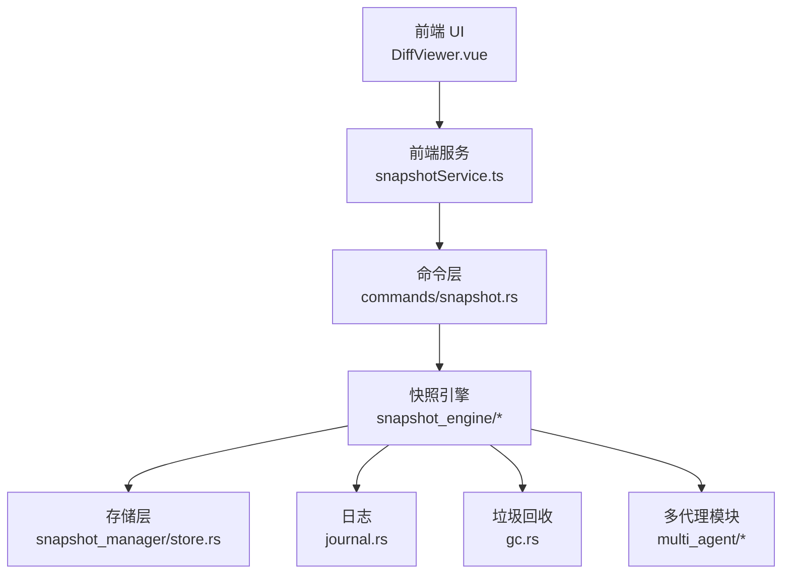

**图表来源**
- [snapshotService.ts:1-248](file://src/services/snapshotService.ts#L1-L248)
- [snapshot.rs（命令层）:1-128](file://src-tauri/src/core/commands/snapshot.rs#L1-L128)
- [snapshot.rs:1-425](file://src-tauri/src/core/snapshot_engine/snapshot.rs#L1-L425)
- [journal.rs:1-157](file://src-tauri/src/core/snapshot_engine/journal.rs#L1-L157)
- [store.rs:1-104](file://src-tauri/src/core/snapshot_manager/store.rs#L1-L104)
- [replay.rs:1-344](file://src-tauri/src/core/snapshot_engine/replay.rs#L1-L344)
- [gc.rs:1-107](file://src-tauri/src/core/snapshot_engine/gc.rs#L1-L107)
- [multi_agent/mod.rs:1-12](file://src-tauri/src/core/snapshot_engine/multi_agent/mod.rs#L1-L12)

## 详细组件分析

### 快照树与节点（SnapshotTree、SnapshotNode）
- 节点与树
  - SnapshotTree 维护 nodes（快照 ID 到快照）、branches（分支名到分支）、当前分支与当前快照 ID
  - Branch 记录分支头快照、会话 ID、描述、是否激活
  - SnapshotNode/View 提供树视图渲染所需的数据结构
- 快照创建
  - create_snapshot 自动生成 ID、设置父 ID、写入当前分支、更新分支头与当前快照
  - 自动检查点策略：统计自上次检查点以来的补丁总数达到阈值则标记为检查点
- 分支管理
  - create_branch：创建新分支并设置头快照
  - switch_branch：切换当前分支并同步当前快照 ID
- 视图构建
  - to_view：将分支映射为带根节点的视图，空分支返回占位根节点
  - build_tree_from：递归构建 SnapshotNode 树

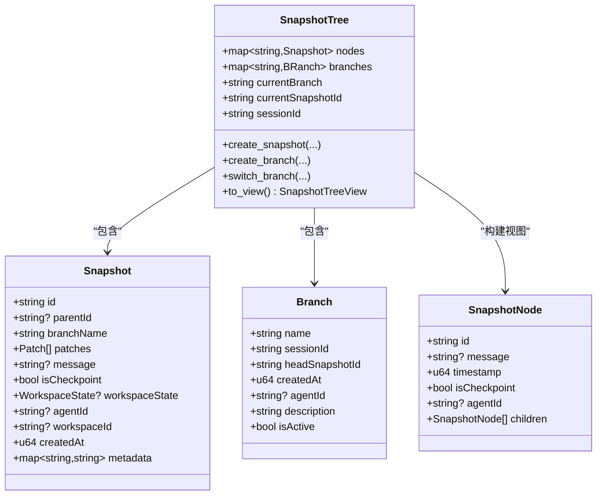

**图表来源**
- [snapshot.rs:6-87](file://src-tauri/src/core/snapshot_engine/snapshot.rs#L6-L87)

**章节来源**
- [snapshot.rs:194-410](file://src-tauri/src/core/snapshot_engine/snapshot.rs#L194-L410)

### 补丁与差异（Patch、TextDiff、DiffHunk）
- 补丁类型
  - CreateFile/DeleteFile/UpdateFile/RenameFile，UpdateFile 可携带可选 TextDiff
- 文本差异
  - TextDiff 由多个 DiffHunk 组成，每个 Hunk 包含上下文/新增/删除行序列
  - DiffLine 支持上下文、新增、删除三类
- 摘要与校验
  - PatchSummary：统计路径、操作类型、增删行数
  - content_hash：基于内容的哈希用于一致性校验
- 错误类型
  - PatchError：文件未找到、已存在、内容哈希不匹配、IO 错误

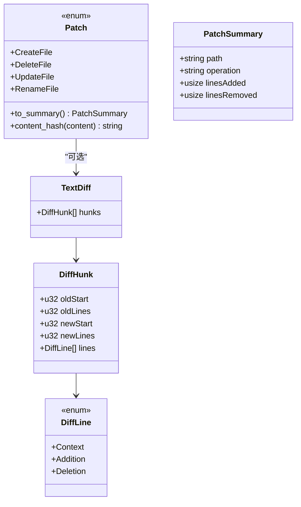

**图表来源**
- [patch.rs:5-47](file://src-tauri/src/core/snapshot_engine/patch.rs#L5-L47)

**章节来源**
- [patch.rs:1-124](file://src-tauri/src/core/snapshot_engine/patch.rs#L1-L124)

### 工作区与补丁应用（Workspace、apply_patch/undo_patch）
- Workspace
  - 以路径到内容的映射表示工作区
  - apply_patch：根据补丁类型执行创建、删除、更新、重命名，并进行哈希一致性校验
  - undo_patch：逆向执行补丁（创建变删除、更新变回滚、重命名恢复原路径）
- 性能要点
  - 通过哈希快速校验更新前的内容一致性，避免不必要的写入
  - 重命名时先删除旧键再插入新键，失败时回滚

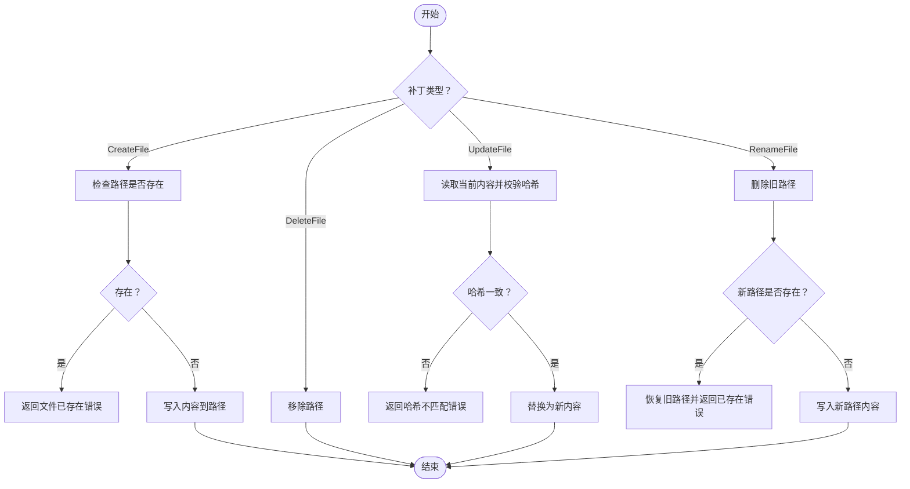

**图表来源**
- [snapshot.rs:108-177](file://src-tauri/src/core/snapshot_engine/snapshot.rs#L108-L177)

**章节来源**
- [snapshot.rs:101-178](file://src-tauri/src/core/snapshot_engine/snapshot.rs#L101-L178)

### 回放与原子回滚（ReplayEngine、AtomicFileRollback）
- 重建工作区
  - rebuild_workspace：从目标快照向上遍历，若遇到检查点则直接从 WorkspaceState 加载文件内容，否则顺序应用补丁
  - rebuild_workspace_lazy：计算 LCA，先撤销当前到 LCA 的补丁，再重做目标到 LCA 的补丁
- 原子回滚
  - AtomicFileRollback.prepare：记录目标目录下各文件的旧内容或创建行为，准备撤销日志
  - execute：分阶段写入临时目录，再原子性地重命名到目标位置，确保回滚可恢复
- 错误处理
  - ReplayError：快照不存在、无公共祖先、补丁错误、IO/JSON 错误

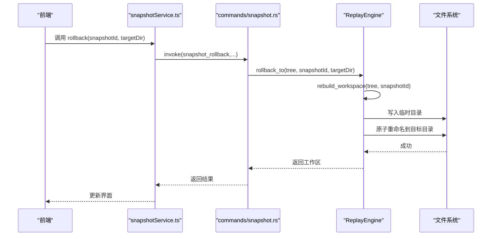

**图表来源**
- [snapshot.rs（命令层）:86-96](file://src-tauri/src/core/commands/snapshot.rs#L86-L96)
- [replay.rs:227-246](file://src-tauri/src/core/snapshot_engine/replay.rs#L227-L246)

**章节来源**
- [replay.rs:52-246](file://src-tauri/src/core/snapshot_engine/replay.rs#L52-L246)

### 日志记录（Journal）
- JournalEntry：记录创建快照、创建/切换/删除分支、紧凑化等事件
- Journal
  - open：打开日志文件并统计行数作为序列号
  - append：追加一条 JSON 行，立即同步
  - replay：逐行解析为 JournalEntry 列表
  - should_compact：超过阈值触发紧凑化
  - compact：将当前树状态写入紧凑日志并替换原文件

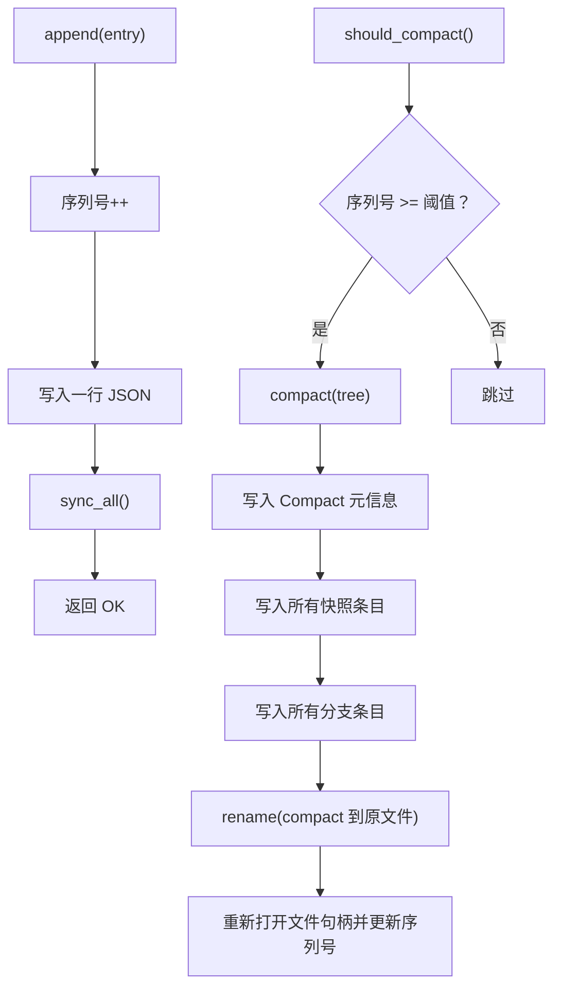

**图表来源**
- [journal.rs:76-151](file://src-tauri/src/core/snapshot_engine/journal.rs#L76-L151)

**章节来源**
- [journal.rs:1-157](file://src-tauri/src/core/snapshot_engine/journal.rs#L1-L157)

### 存储策略（SnapshotStore）
- 保存/加载快照：按分支目录存放，文件名为快照 ID.json
- 保存/加载树：tree.json
- 列出快照：扫描分支目录，按创建时间排序
- 删除快照：删除对应 JSON 文件

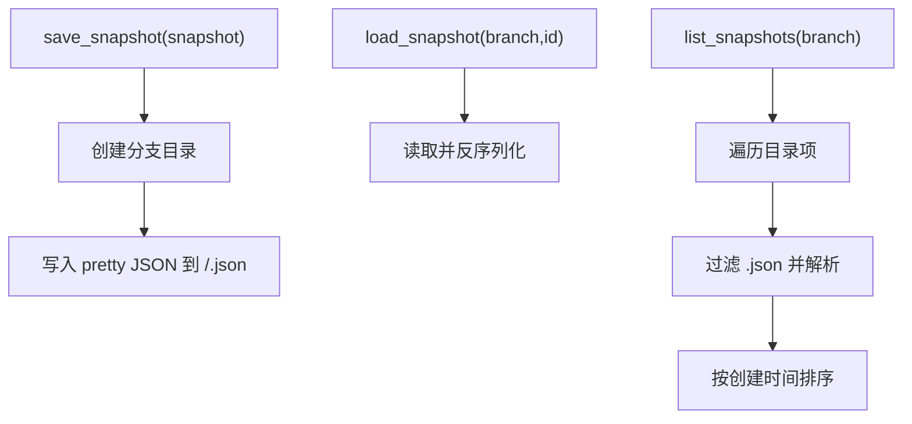

**图表来源**
- [store.rs:22-102](file://src-tauri/src/core/snapshot_manager/store.rs#L22-L102)

**章节来源**
- [store.rs:1-104](file://src-tauri/src/core/snapshot_manager/store.rs#L1-L104)

### 垃圾回收（GarbageCollector）
- 保护集：可配置是否保留分支头部；若启用，则沿父链向上收集受保护 ID
- 清理条件：按最大年龄判断（天）
- 孤儿分支：head_snapshot_id 不存在于 nodes 中的分支视为孤儿并删除
- 结果：统计移除快照数、分支数与释放空间

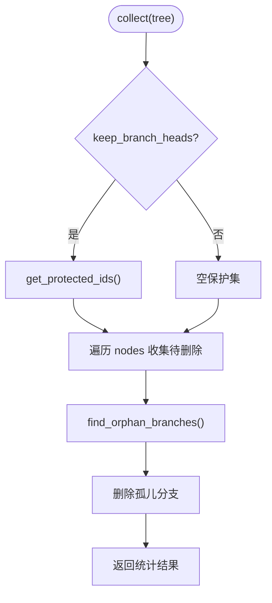

**图表来源**
- [gc.rs:39-97](file://src-tauri/src/core/snapshot_engine/gc.rs#L39-L97)

**章节来源**
- [gc.rs:1-107](file://src-tauri/src/core/snapshot_engine/gc.rs#L1-L107)

### 多代理模块（简化后的结构）
- multi_agent 模块当前仅保留基础结构定义，用于未来扩展多代理功能
- 包含沙箱（AgentSandbox）和合并（MergeEngine）的基础类型定义
- 当前命令层未暴露多代理相关 API，保持系统简洁性

**章节来源**
- [multi_agent/mod.rs:1-12](file://src-tauri/src/core/snapshot_engine/multi_agent/mod.rs#L1-L12)
- [multi_agent/sandbox.rs:1-280](file://src-tauri/src/core/snapshot_engine/multi_agent/sandbox.rs#L1-L280)
- [multi_agent/merge.rs:1-433](file://src-tauri/src/core/snapshot_engine/multi_agent/merge.rs#L1-L433)

### 前端集成与 API 使用
- 前端服务（snapshotService.ts）
  - 树视图、摘要批量获取、详情获取、创建快照、创建分支、切换分支、回滚、当前分支与快照查询
  - 多代理相关方法（当前未使用）
- 类型定义（index.ts）
  - Patch、TextDiff、DiffHunk、DiffLine、Snapshot、SnapshotTreeView、Workspace 等
- 差异展示（DiffViewer.vue）
  - 将 Patch 渲染为三类行（上下文/新增/删除），显示行列号与统计

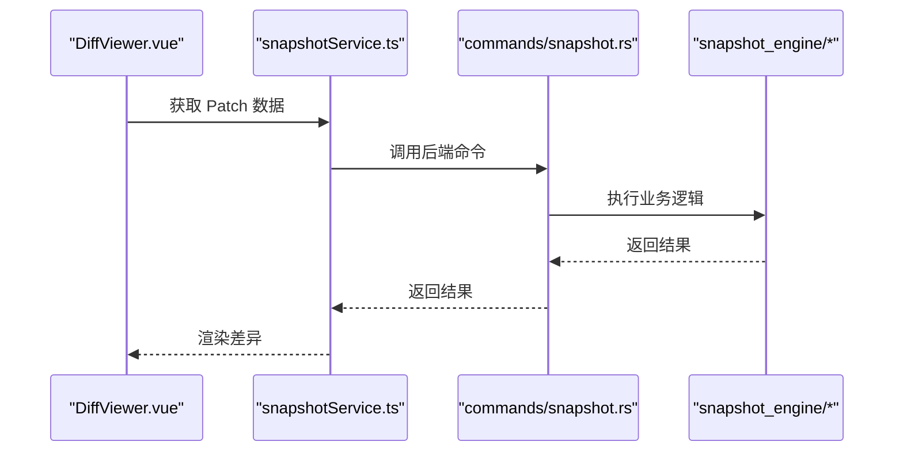

**图表来源**
- [DiffViewer.vue:16-89](file://src/components/snapshot/DiffViewer.vue#L16-L89)
- [snapshotService.ts:62-78](file://src/services/snapshotService.ts#L62-L78)
- [snapshot.rs（命令层）:4-15](file://src-tauri/src/core/commands/snapshot.rs#L4-L15)

**章节来源**
- [snapshotService.ts:1-248](file://src/services/snapshotService.ts#L1-L248)
- [index.ts（类型定义）:224-371](file://src/types/index.ts#L224-L371)
- [DiffViewer.vue:1-265](file://src/components/snapshot/DiffViewer.vue#L1-L265)

## 依赖关系分析
- 模块导出
  - snapshot_engine/mod.rs 统一导出核心类型与错误，便于上层使用
  - multi_agent 模块当前仅导出基础类型定义
- 命令层依赖
  - commands/snapshot.rs 通过 SnapshotRegistry 获取会话级管理器，调用快照引擎能力
- 前后端类型对齐
  - index.ts 定义了 Patch、Snapshot、SnapshotTreeView 等与后端结构一一对应

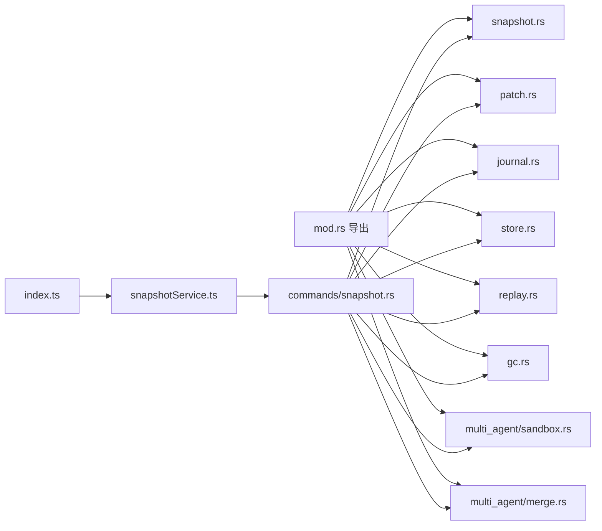

**图表来源**
- [mod.rs:1-30](file://src-tauri/src/core/snapshot_engine/mod.rs#L1-L30)
- [snapshot.rs（命令层）:1-128](file://src-tauri/src/core/commands/snapshot.rs#L1-L128)
- [index.ts（类型定义）:224-371](file://src/types/index.ts#L224-L371)

**章节来源**
- [mod.rs:1-30](file://src-tauri/src/core/snapshot_engine/mod.rs#L1-L30)
- [snapshot.rs（命令层）:1-128](file://src-tauri/src/core/commands/snapshot.rs#L1-L128)
- [index.ts（类型定义）:224-371](file://src/types/index.ts#L224-L371)

## 性能考量
- 快照树与补丁
  - 使用 HashMap/HashSet 进行 O(1)/O(log n) 的查找与去重，构建视图时递归遍历，复杂度 O(N)
  - 检查点策略：每 CHECKPOINT_INTERVAL 个补丁生成一次检查点，减少回放时的补丁应用次数
- 回放与重建
  - 优先从检查点 WorkspaceState 加载文件内容，避免逐补丁重建
  - lazy 回放：通过 LCA 减少撤销/重做补丁数量
- 存储与日志
  - JSON Pretty 写入便于调试但体积较大；生产环境可考虑压缩或二进制序列化
  - Journal compact 阈值控制日志膨胀，定期紧凑化降低 IO 开销
- 垃圾回收
  - 保护集与孤儿分支清理减少无效数据占用
- 建议
  - 对大文件内容采用内容寻址存储（Content Store），仅在快照中保存哈希
  - 在前端缓存树视图与摘要，减少重复请求
  - 对频繁变更的文件采用增量哈希策略（如分块哈希）

## 故障排查指南
- 常见错误与定位
  - PatchError：文件未找到、已存在、哈希不匹配、IO 错误
  - ReplayError：快照不存在、无公共祖先、补丁错误、IO/JSON 错误
  - JournalError：IO/JSON 错误、日志关闭
  - GC：孤儿分支、保护集为空导致清理过度
  - 多代理：沙箱状态非法、分支不存在（当前模块结构仍保留相关类型）
- 排查步骤
  - 检查快照 ID 是否存在于 SnapshotTree.nodes
  - 确认分支 head_snapshot_id 指向有效快照
  - 校验 WorkspaceState 中的文件哈希与内容一致性
  - 检查 Journal 文件是否被意外修改或损坏，必要时 compact
  - 查看 GC 配置是否过于激进，确认保护集是否正确
- 建议
  - 在关键路径增加日志与断言
  - 对外暴露健康检查接口（如列出所有快照、检查点数量、孤儿分支）

**章节来源**
- [patch.rs:58-68](file://src-tauri/src/core/snapshot_engine/patch.rs#L58-L68)
- [replay.rs:9-21](file://src-tauri/src/core/snapshot_engine/replay.rs#L9-L21)
- [journal.rs:37-45](file://src-tauri/src/core/snapshot_engine/journal.rs#L37-L45)
- [gc.rs:89-97](file://src-tauri/src/core/snapshot_engine/gc.rs#L89-L97)

## 结论
快照引擎以"补丁 + 树 + 回放"为核心，结合检查点、日志、存储与 GC，形成完整的版本化工作区管理方案。前端通过统一的命令与类型接口无缝接入，既满足单代理场景，也为多代理功能预留了模块化扩展基础。当前系统已简化多代理功能，移除了复杂的沙箱和合并操作，专注于核心的快照管理能力。建议在生产环境中进一步完善内容寻址存储、增量哈希与缓存策略，以提升大规模场景下的性能与稳定性。

## 附录
- API 概览（命令层）
  - snapshot_create：创建快照
  - snapshot_get_tree_view：获取树视图
  - snapshot_get_summaries：批量获取摘要
  - snapshot_get_detail：获取快照详情
  - snapshot_create_branch：创建分支
  - snapshot_switch_branch：切换分支
  - snapshot_rollback：回滚到指定快照
  - snapshot_list/list_branches/get_current：列举与查询
  - 多代理相关命令：当前未暴露（保留模块结构以便未来扩展）
- 前端调用示例（路径）
  - 创建快照：[snapshotService.ts:62-78](file://src/services/snapshotService.ts#L62-L78)
  - 切换分支：[snapshotService.ts:96-102](file://src/services/snapshotService.ts#L96-L102)
  - 回滚：[snapshotService.ts:104-111](file://src/services/snapshotService.ts#L104-L111)

**章节来源**
- [snapshot.rs（命令层）:1-128](file://src-tauri/src/core/commands/snapshot.rs#L1-L128)
- [snapshotService.ts:1-248](file://src/services/snapshotService.ts#L1-L248)